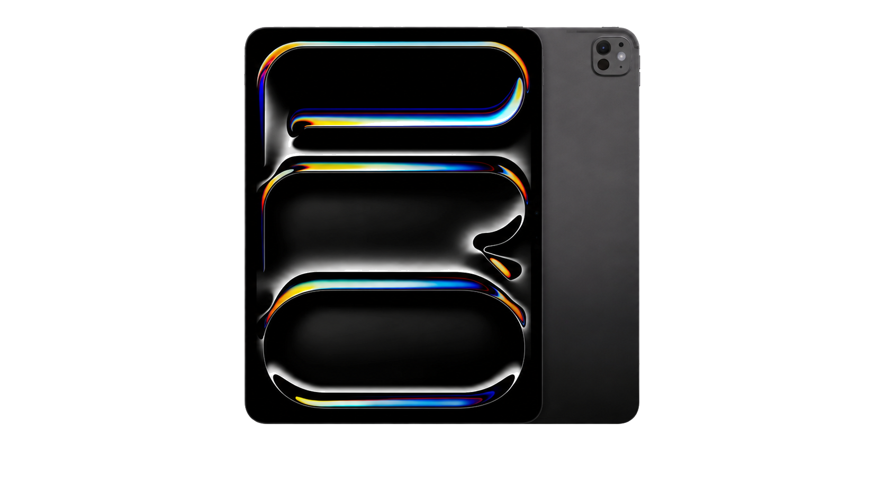
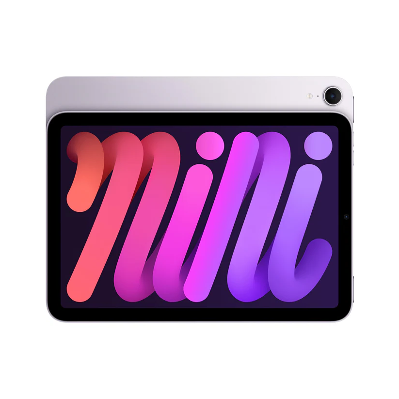
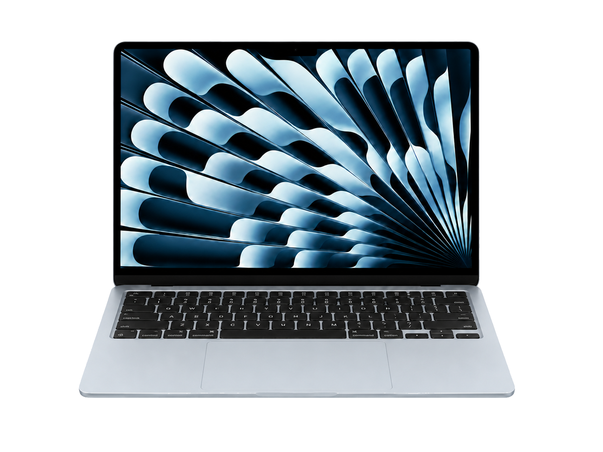
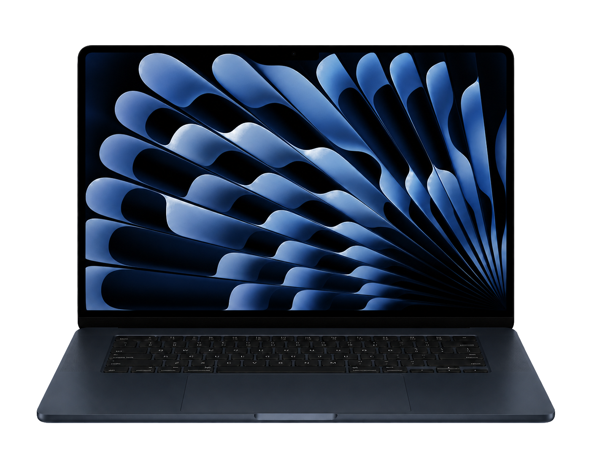
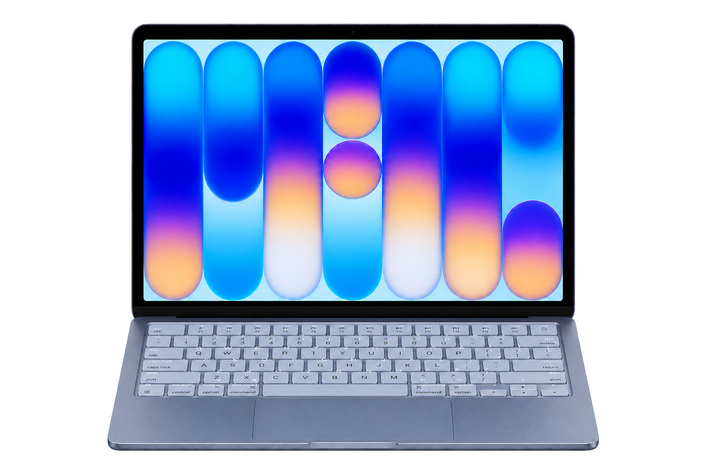
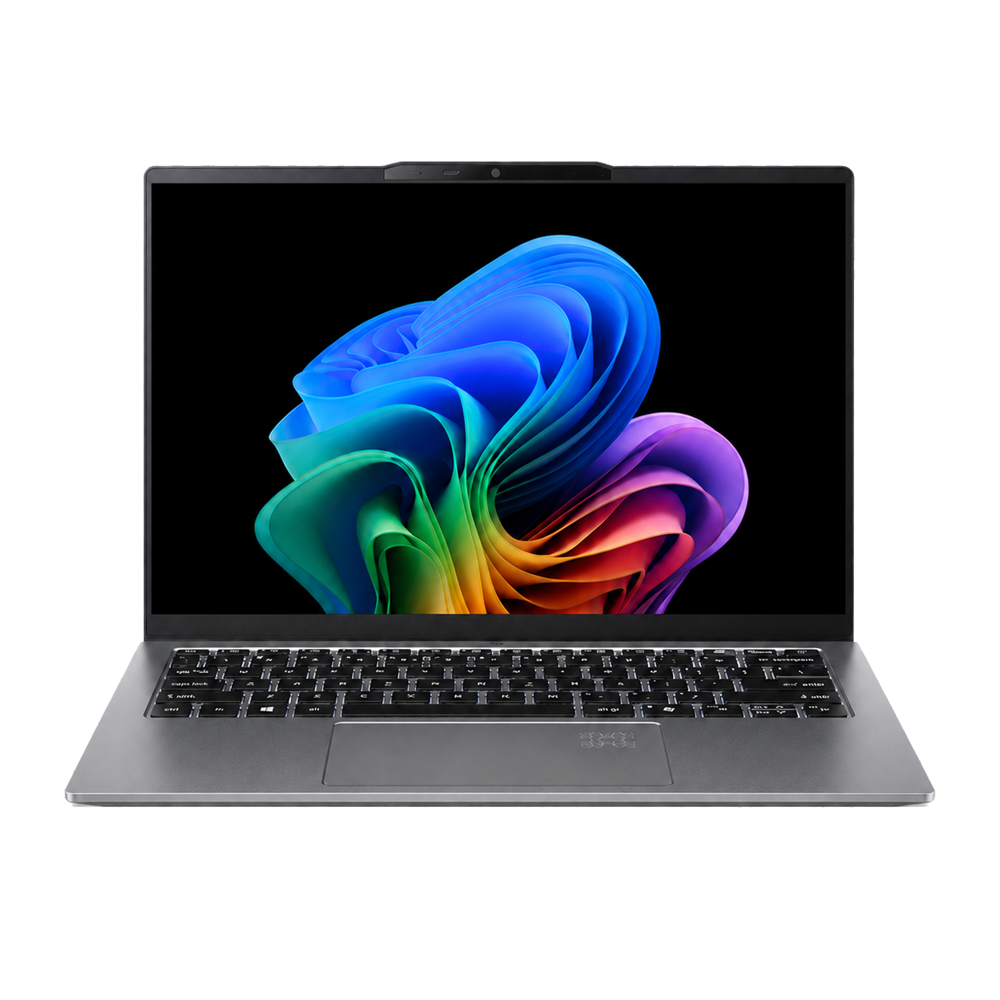
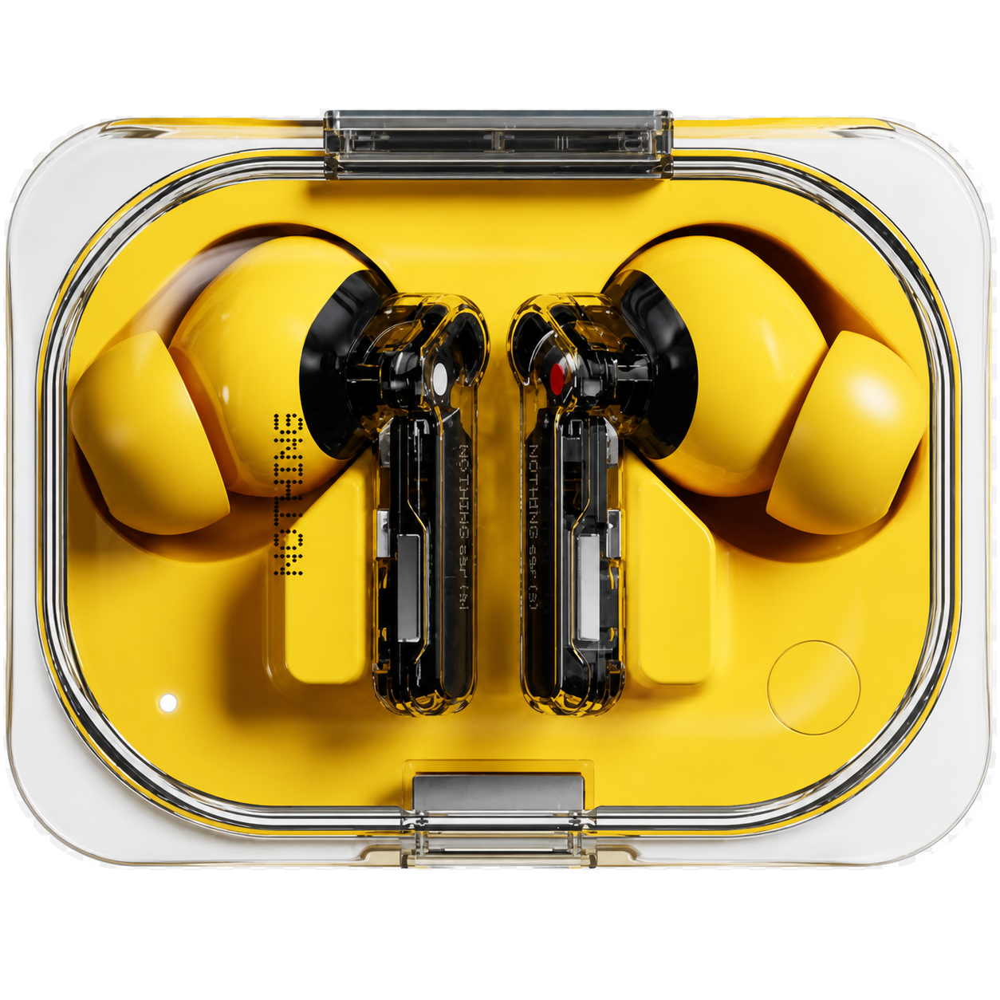

# 项目源码汇总

本文件集中收录当前项目中的 HTML、CSS 和 JavaScript 源码。源码按文件类型和文件名排序，内容保持原样。

## 文件清单

### HTML
- `comparison-lab.html`
- `decision.html`
- `field-notes.html`
- `index.html`
- `on-the-horizon.html`
- `provenance.html`
- `specs.html`
- `tech-arsenal.html`
- `topology.html`

### CSS
- `arsenal-pages.css`

### JavaScript
- `arsenal-compare.js`
- `arsenal-site.js`
- `specs-data.js`

## HTML 源码
### `comparison-lab.html`
```html
<!DOCTYPE html>
<html lang="zh-CN">
<head>
    <meta charset="UTF-8">
    <meta name="viewport" content="width=device-width, initial-scale=1.0">
    <title>TECH ARSENAL | 对比实验室 / Compare</title>
    <link rel="stylesheet" href="arsenal-pages.css">
</head>
<body>
    <div class="broadcast-bar">
        <div class="signal-icon"></div>
        <span class="shoutout-text" data-zh="决策层" data-en="Decision layer">decision layer</span>
        <span class="creator-tag" data-zh="对比" data-en="Compare">compare</span>
        <span class="shoutout-text" data-zh="候选实验室" data-en="Shortlist lab">shortlist lab</span>
    </div>

    <main class="shell">
        <header class="site-header">
            <div class="top-row">
                <a class="back-link home-mark-link" href="index.html" aria-label="返回首页 / Back to home" title="返回首页 / Back to home"></a>
                <nav class="page-nav" aria-label="site">
                    <a class="page-link${currentFile === "index.html" ? " active" : ""}" href="index.html">首页</a>
                    <a class="page-link${currentFile === "topology.html" ? " active" : ""}" href="topology.html">工位与连接</a>
                    <a class="page-link${currentFile === "decision.html" ? " active" : ""}" href="decision.html">选机算盘</a>
                    <a class="page-link${currentFile === "provenance.html" ? " active" : ""}" href="provenance.html">时间线</a>
                    <a class="page-link${currentFile === "field-notes.html" ? " active" : ""}" href="field-notes.html">使用手记</a>
                    <a class="page-link${currentFile === "comparison-lab.html" ? " active" : ""}" href="comparison-lab.html">对比实验室</a>
                    <a class="page-link${currentFile === "on-the-horizon.html" ? " active" : ""}" href="on-the-horizon.html">观望清单</a>
                    <a class="page-link${currentFile === "tech-arsenal.html" ? " active" : ""}" href="tech-arsenal.html">总目录</a>
                </nav>
            </div>

            <div class="hero-head">
                <div class="eyebrow" data-zh="对比实验室" data-en="Comparison lab">comparison lab</div>
                <div class="title-lockup">
                    <h1 class="main-title" data-zh="对比实验室" data-en="Compare">Compare</h1>
                    <p class="page-subtitle">主目录里写的是喜欢，这一页写的是取舍。把最容易纠结的旗舰机型拉到一起，比继续堆更多“想买理由”更有价值。</p>
                </div>
            </div>
        </header>

        <section class="hero-panel">
            <div class="hero-grid">
                <div class="hero-copy">
                    <div class="hero-copy-top">
                        <div class="meta-chip" data-zh="选择逻辑" data-en="Selection logic">selection logic</div>
                        <h2>同样是旗舰，吸引力其实来自完全不同的维度。</h2>
                        <p>有的靠形态，有的靠影像，有的靠生态，有的靠毫无短板。这个页面就是把差异讲清楚。</p>
                    </div>

                    <div class="hero-stats">
                        <div class="hero-stat">
                            <strong>04</strong>
                            <span>candidate devices</span>
                        </div>
                        <div class="hero-stat">
                            <strong>03</strong>
                            <span>live slots</span>
                        </div>
                        <div class="hero-stat">
                            <strong>01</strong>
                            <span>shared table</span>
                        </div>
                    </div>
                </div>

                <div class="hero-side">
                    
                </div>
            </div>
        </section>

        <section class="section">
            <div class="section-heading">
                <h3>点选候选机型，下面的三列会同步切换。</h3>
                <p>默认保留 Fold、Ultra 和 iPhone。Pixel 作为替换项，负责那条更偏算法和 AI 的路线。</p>
            </div>

            <div class="compare-choices">
                <button class="choice-btn active" data-slot="0" data-device="fold7" type="button">
                    <strong>Galaxy Z Fold 7</strong>
                    <span>form factor and productivity</span>
                </button>
                <button class="choice-btn active" data-slot="1" data-device="s25u" type="button">
                    <strong>Galaxy S25 Ultra</strong>
                    <span>all round apex</span>
                </button>
                <button class="choice-btn active" data-slot="2" data-device="iphone17" type="button">
                    <strong>iPhone 17</strong>
                    <span>ecosystem baseline</span>
                </button>
                <button class="choice-btn" data-slot="2" data-device="pixel9" type="button">
                    <strong>Pixel 11 Pro XL</strong>
                    <span>camera and native ai</span>
                </button>
            </div>
        </section>

        <section class="section">
            <div class="table-wrap">
                <table>
                    <thead>
                        <tr>
                            <th>criteria</th>
                            <th class="table-head" id="head-0">Galaxy Z Fold 7</th>
                            <th class="table-head" id="head-1">Galaxy S25 Ultra</th>
                            <th class="table-head" id="head-2">iPhone 17</th>
                        </tr>
                    </thead>
                    <tbody>
                        <tr>
                            <th>role</th>
                            <td id="role-0"></td>
                            <td id="role-1"></td>
                            <td id="role-2"></td>
                        </tr>
                        <tr>
                            <th>display</th>
                            <td id="display-0"></td>
                            <td id="display-1"></td>
                            <td id="display-2"></td>
                        </tr>
                        <tr>
                            <th>camera</th>
                            <td id="camera-0"></td>
                            <td id="camera-1"></td>
                            <td id="camera-2"></td>
                        </tr>
                        <tr>
                            <th>chip and ai</th>
                            <td id="chip-0"></td>
                            <td id="chip-1"></td>
                            <td id="chip-2"></td>
                        </tr>
                        <tr>
                            <th>pull</th>
                            <td class="table-note" id="note-0"></td>
                            <td class="table-note" id="note-1"></td>
                            <td class="table-note" id="note-2"></td>
                        </tr>
                    </tbody>
                </table>
            </div>
        </section>

        <section class="section">
            <div class="spec-grid">
                <article class="spec-card">
                    <div class="status-pill">next move</div>
                    <h4>增加排序模式</h4>
                    <p>后面可以做只看影像、只看续航、只看便携性。</p>
                </article>
                <article class="spec-card">
                    <div class="status-pill">next move</div>
                    <h4>高亮差异项</h4>
                    <p>只标真正不同的项，读起来会更快。</p>
                </article>
                <article class="spec-card">
                    <div class="status-pill">next move</div>
                    <h4>跳回主目录卡片</h4>
                    <p>每一列后面都可以继续连回新的设备详情页。</p>
                </article>
            </div>
        </section>
    </main>

    <footer class="site-footer">
        <div class="footer-line" data-zh="TECH ARSENAL / 对比 / 用候选清单辅助决策" data-en="TECH ARSENAL / Compare / Shortlist as decision support">tech arsenal / compare / shortlist as decision support</div>
    </footer>

    <script>
        window.compareLabConfig = {
            slots: ["fold7", "s25u", "iphone17"]
        };
    </script>
    <script src="arsenal-compare.js"></script>
    <script src="arsenal-site.js"></script>
</body>
</html>
```

### `decision.html`
```html
<!DOCTYPE html>
<html lang="zh-CN">
<!-- Hallmark & Humanizer · page: decision · simple prose · no AI fluff -->
<head>
    <meta charset="UTF-8">
    <meta name="viewport" content="width=device-width, initial-scale=1.0">
    <title>TECH ARSENAL | 选机算盘 / Decision helper</title>
    <link rel="stylesheet" href="arsenal-pages.css">
</head>
<body>
    <div class="broadcast-bar">
        <div class="signal-icon"></div>
        <span class="shoutout-text" data-zh="选机参考" data-en="Comparison">选机参考</span>
        <span class="creator-tag" data-zh="加权算盘" data-en="Decision helper">decision helper</span>
        <span class="shoutout-text" data-zh="按需打分" data-en="Weighted score">按需打分</span>
    </div>

    <main class="shell">
        <header class="site-header">
            <div class="top-row">
                <a class="back-link home-mark-link" href="index.html" aria-label="返回首页 / Back to home" title="返回首页 / Back to home">
                    
                </a>
                <nav class="page-nav" aria-label="site">
                    <a class="page-link${currentFile === "index.html" ? " active" : ""}" href="index.html">首页</a>
                    <a class="page-link${currentFile === "topology.html" ? " active" : ""}" href="topology.html">工位与连接</a>
                    <a class="page-link${currentFile === "decision.html" ? " active" : ""}" href="decision.html">选机算盘</a>
                    <a class="page-link${currentFile === "provenance.html" ? " active" : ""}" href="provenance.html">时间线</a>
                    <a class="page-link${currentFile === "field-notes.html" ? " active" : ""}" href="field-notes.html">使用手记</a>
                    <a class="page-link${currentFile === "comparison-lab.html" ? " active" : ""}" href="comparison-lab.html">对比实验室</a>
                    <a class="page-link${currentFile === "on-the-horizon.html" ? " active" : ""}" href="on-the-horizon.html">观望清单</a>
                    <a class="page-link${currentFile === "tech-arsenal.html" ? " active" : ""}" href="tech-arsenal.html">总目录</a>
                </nav>
            </div>

            <div class="hero-head">
                <div class="eyebrow" data-zh="选机算盘" data-en="Decision Helper">选机算盘</div>
                <div class="title-lockup">
                    <h1 class="main-title" data-zh="选机算盘" data-en="Decision Helper">选机<span class="accent">算盘</span></h1>
                    <p class="page-subtitle" data-zh="几台在看的手机，按自己在意的维度调一下权重，算算哪台更合适。" data-en="Set weights for what you care about to see which phone fits best.">几台在看的手机，按自己在意的维度调一下权重，算算哪台更合适。</p>
                </div>
            </div>
        </header>

        <section class="hero-panel">
            <div class="hero-grid">
                <div class="hero-copy">
                    <div class="hero-copy-top">
                        <div class="meta-chip" data-zh="选机逻辑" data-en="Scoring Logic">选机逻辑</div>
                        <h2 data-zh="买手机前把在意的点拉出来算个分。" data-en="Score the options before making a decision.">买手机前把在意的点拉出来算个分。</h2>
                        <p data-zh="调整下方权重，直接看每台手机的综合得分。" data-en="Adjust the weights below to see how each phone scores.">调整下方权重，直接看每台手机的综合得分。</p>
                    </div>

                    <div class="hero-stats">
                        <div class="hero-stat">
                            <strong>04</strong>
                            <span data-zh="候选手机" data-en="Candidate Phones">候选手机</span>
                        </div>
                        <div class="hero-stat">
                            <strong>06</strong>
                            <span data-zh="考量维度" data-en="Dimensions">考量维度</span>
                        </div>
                        <div class="hero-stat">
                            <strong>01</strong>
                            <span data-zh="打分引擎" data-en="Scorer">打分引擎</span>
                        </div>
                    </div>
                </div>

                <div class="hero-side">
                    
                </div>
            </div>
        </section>

        <!-- Section 1: Weighted Scorer -->
        <section class="section">
            <div class="section-heading">
                <h3 data-zh="权重打分" data-en="Weighted Scoring">权重打分</h3>
                <p data-zh="拖动滑块调整在意程度，下方会自动算出排名。" data-en="Drag the sliders to adjust your weights; scores update automatically.">拖动滑块调整在意程度，下方会自动算出排名。</p>
            </div>

            <div class="scorer-panel">
                <div class="sliders-grid">
                    <div class="slider-group">
                        <div class="slider-label-row">
                            <span class="slider-name" data-zh="屏幕护眼 (频闪/PWM)" data-en="Eye Comfort (PWM)">屏幕护眼 (频闪/PWM)</span>
                            <span class="slider-val" id="val-eye">20%</span>
                        </div>
                        <input type="range" id="slider-eye" min="0" max="50" value="20">
                    </div>

                    <div class="slider-group">
                        <div class="slider-label-row">
                            <span class="slider-name" data-zh="机身轻便与手感" data-en="Weight & Hand Feel">机身轻便与手感</span>
                            <span class="slider-val" id="val-weight">25%</span>
                        </div>
                        <input type="range" id="slider-weight" min="0" max="50" value="25">
                    </div>

                    <div class="slider-group">
                        <div class="slider-label-row">
                            <span class="slider-name" data-zh="长焦与拍照" data-en="Telephoto & Camera">长焦与拍照</span>
                            <span class="slider-val" id="val-camera">20%</span>
                        </div>
                        <input type="range" id="slider-camera" min="0" max="50" value="20">
                    </div>

                    <div class="slider-group">
                        <div class="slider-label-row">
                            <span class="slider-name" data-zh="续航与快充" data-en="Battery & Charging">续航与快充</span>
                            <span class="slider-val" id="val-battery">15%</span>
                        </div>
                        <input type="range" id="slider-battery" min="0" max="50" value="15">
                    </div>

                    <div class="slider-group">
                        <div class="slider-label-row">
                            <span class="slider-name" data-zh="系统与软件生态" data-en="OS & Ecosystem">系统与软件生态</span>
                            <span class="slider-val" id="val-eco">10%</span>
                        </div>
                        <input type="range" id="slider-eco" min="0" max="50" value="10">
                    </div>

                    <div class="slider-group">
                        <div class="slider-label-row">
                            <span class="slider-name" data-zh="二手保值率" data-en="Resale Value">二手保值率</span>
                            <span class="slider-val" id="val-value">10%</span>
                        </div>
                        <input type="range" id="slider-value" min="0" max="50" value="10">
                    </div>
                </div>

                <div class="results-rank-grid" id="rank-cards-container">
                    <!-- Populated dynamically by JS -->
                </div>
            </div>
        </section>

        <!-- Section 2: Comparison Table -->
        <section class="section">
            <div class="section-heading">
                <h3 data-zh="关键参数差异" data-en="Key Differences">关键参数差异</h3>
                <p data-zh="几台手机在日常使用中最容易感觉到的区别。" data-en="The most noticeable differences in daily use.">几台手机在日常使用中最容易感觉到的区别。</p>
            </div>

            <div class="table-wrap">
                <table class="diff-table">
                    <thead>
                        <tr>
                            <th data-zh="比较项目" data-en="Category">比较项目</th>
                            <th>Galaxy S25 Ultra</th>
                            <th>Galaxy Z Fold 7</th>
                            <th>Pixel 11 Pro XL</th>
                            <th>iPhone 17</th>
                        </tr>
                    </thead>
                    <tbody>
                        <tr>
                            <td data-zh="机身重量" data-en="Weight"><strong>机身重量</strong></td>
                            <td class="font-mono">219g (略沉)</td>
                            <td class="font-mono">215g (折叠偏厚)</td>
                            <td class="font-mono">221g (略沉)</td>
                            <td class="font-mono" style="color:var(--accent-2);">170g (轻)</td>
                        </tr>
                        <tr>
                            <td data-zh="屏幕调光" data-en="Dimming"><strong>屏幕调光</strong></td>
                            <td>492Hz 低频 PWM</td>
                            <td>492Hz 低频 PWM</td>
                            <td>240Hz+混合调光</td>
                            <td>480Hz 低频 PWM</td>
                        </tr>
                        <tr>
                            <td data-zh="长焦镜头" data-en="Telephoto"><strong>长焦镜头</strong></td>
                            <td>5 倍潜望镜头</td>
                            <td>3 倍直立镜头</td>
                            <td>5 倍潜望镜头</td>
                            <td>无独立长焦</td>
                        </tr>
                        <tr>
                            <td data-zh="充满时间" data-en="Charging"><strong>充满时间</strong></td>
                            <td class="font-mono">45W (约 1 小时)</td>
                            <td class="font-mono">25W (约 1.5 小时)</td>
                            <td class="font-mono">37W (约 1.2 小时)</td>
                            <td class="font-mono">27W (约 1.1 小时)</td>
                        </tr>
                        <tr>
                            <td data-zh="系统特点" data-en="OS Features"><strong>系统特点</strong></td>
                            <td>One UI，功能全</td>
                            <td>One UI，大屏多任务</td>
                            <td>原生 Android，AI 功能多</td>
                            <td>iOS，简单稳定</td>
                        </tr>
                    </tbody>
                </table>
            </div>
        </section>

        <!-- Section 3: Upgrade Advisor -->
        <section class="section">
            <div class="section-heading">
                <h3 data-zh="换机参考" data-en="Upgrade Notes">换机参考</h3>
                <p data-zh="从旧手机换到新手机，主要能提升什么、需要妥协什么。" data-en="What you gain and what you give up when switching phones.">从旧手机换到新手机，主要能提升什么、需要妥协什么。</p>
            </div>

            <div class="advisor-card">
                <div class="advisor-select-row">
                    <div class="select-box">
                        <label data-zh="正在用的手机" data-en="Current Phone">正在用的手机</label>
                        <select id="select-current">
                            <option value="iphone11">iPhone 11 (LCD 屏 / A13)</option>
                            <option value="mi9">Xiaomi Mi 9 (轻薄 / 电池小)</option>
                            <option value="a51">Galaxy A51 (日常备用)</option>
                            <option value="s23u">Galaxy S23 Ultra</option>
                        </select>
                    </div>

                    <div class="advisor-arrow">➔</div>

                    <div class="select-box">
                        <label data-zh="想换的目标" data-en="Target Phone">想换的目标</label>
                        <select id="select-target">
                            <option value="iphone17">iPhone 17 (120Hz 高刷)</option>
                            <option value="s25u">Galaxy S25 Ultra</option>
                            <option value="fold7">Galaxy Z Fold 7</option>
                            <option value="pixel9">Pixel 11 Pro XL</option>
                        </select>
                    </div>
                </div>

                <div class="advisor-verdict" id="advisor-verdict-box">
                    <!-- Populated dynamically by JS -->
                </div>
            </div>
        </section>

        <!-- Section 4: Pricing Notes -->
        <section class="section">
            <div class="section-heading">
                <h3 data-zh="价格与入手时机" data-en="Price & Timing">价格与入手时机</h3>
                <p data-zh="几款手机的日常降价规律。" data-en="Typical discount patterns for each brand.">几款手机的日常降价规律。</p>
            </div>

            <div class="budget-grid">
                <article class="budget-card">
                    <div class="budget-header">
                        <span class="budget-name">Galaxy S25 Ultra</span>
                        <span class="budget-drop">通常降幅约 30%</span>
                    </div>
                    <div class="price-compare">
                        <span class="price-retail">发售价约 $1,299</span>
                        <span class="price-target">建议入手价约 $899</span>
                    </div>
                    <p style="font-size:0.78rem; color:var(--muted); margin:0;" data-zh="发售半年左右电商大促（如 Shopee / Lazada）降价较多，不建议首发原价买。" data-en="Discounts usually pick up 4-6 months after release during major regional sales.">发售半年左右电商大促（如 Shopee / Lazada）降价较多，不建议首发原价买。</p>
                </article>

                <article class="budget-card">
                    <div class="budget-header">
                        <span class="budget-name">iPhone 17 (基础款)</span>
                        <span class="budget-drop">通常降幅约 15%</span>
                    </div>
                    <div class="price-compare">
                        <span class="price-retail">发售价约 $799</span>
                        <span class="price-target">建议入手价约 $680</span>
                    </div>
                    <p style="font-size:0.78rem; color:var(--muted); margin:0;" data-zh="基础款在年底大促或运营商活动时会有折扣，保值率相对较好。" data-en="Base iPhones discount during year-end sales and hold resale value well.">基础款在年底大促或运营商活动时会有折扣，保值率相对较好。</p>
                </article>

                <article class="budget-card">
                    <div class="budget-header">
                        <span class="budget-name">Pixel 11 Pro XL</span>
                        <span class="budget-drop">通常降幅约 35%</span>
                    </div>
                    <div class="price-compare">
                        <span class="price-retail">发售价约 $1,099</span>
                        <span class="price-target">建议入手价约 $699</span>
                    </div>
                    <p style="font-size:0.78rem; color:var(--muted); margin:0;" data-zh="二手市场（如 Carousell）降价较快，适合淘成色好的二手机。" data-en="Secondhand platforms (e.g. Carousell) drop quickly; great value on used units.">二手市场（如 Carousell）降价较快，适合淘成色好的二手机。</p>
                </article>
            </div>
        </section>
    </main>

    <footer class="site-footer">
        <div class="footer-line" data-zh="TECH ARSENAL / 选机算盘" data-en="TECH ARSENAL / Decision Helper">tech arsenal / 选机算盘</div>
    </footer>

    <script src="arsenal-site.js"></script>
    <script>
        const candidates = [
            {
                id: "s25u",
                name: "Galaxy S25 Ultra",
                scores: { eye: 55, weight: 60, camera: 95, battery: 90, eco: 85, value: 70 },
                role: "屏幕大、长焦强、带手写笔",
                dealbreaker: "219g 偏重；低频调光夜间看久了容易累眼"
            },
            {
                id: "fold7",
                name: "Galaxy Z Fold 7",
                scores: { eye: 55, weight: 45, camera: 75, battery: 70, eco: 90, value: 60 },
                role: "展开是大屏，适合看文档与多任务",
                dealbreaker: "折叠后偏厚；25W 充电慢；内屏折痕"
            },
            {
                id: "pixel9",
                name: "Pixel 11 Pro XL",
                scores: { eye: 75, weight: 58, camera: 95, battery: 75, eco: 80, value: 50 },
                role: "原生系统与 Google 拍照算法",
                dealbreaker: "芯片日常重负载发热较明显；部分 AI 功能需对应地区支持"
            },
            {
                id: "iphone17",
                name: "iPhone 17",
                scores: { eye: 60, weight: 95, camera: 70, battery: 80, eco: 95, value: 90 },
                role: "170g 较轻，支持 120Hz 高刷",
                dealbreaker: "没有独立长焦镜头；充电功率一般"
            }
        ];

        function getNormalizedWeights() {
            const eye = parseFloat(document.getElementById("slider-eye").value);
            const weight = parseFloat(document.getElementById("slider-weight").value);
            const camera = parseFloat(document.getElementById("slider-camera").value);
            const battery = parseFloat(document.getElementById("slider-battery").value);
            const eco = parseFloat(document.getElementById("slider-eco").value);
            const value = parseFloat(document.getElementById("slider-value").value);

            const total = eye + weight + camera + battery + eco + value || 1;
            return {
                eye: eye / total,
                weight: weight / total,
                camera: camera / total,
                battery: battery / total,
                eco: eco / total,
                value: value / total
            };
        }

        function calculateRankings() {
            const weights = getNormalizedWeights();

            document.getElementById("val-eye").textContent = document.getElementById("slider-eye").value + "%";
            document.getElementById("val-weight").textContent = document.getElementById("slider-weight").value + "%";
            document.getElementById("val-camera").textContent = document.getElementById("slider-camera").value + "%";
            document.getElementById("val-battery").textContent = document.getElementById("slider-battery").value + "%";
            document.getElementById("val-eco").textContent = document.getElementById("slider-eco").value + "%";
            document.getElementById("val-value").textContent = document.getElementById("slider-value").value + "%";

            const calculated = candidates.map(c => {
                const totalScore = (
                    c.scores.eye * weights.eye +
                    c.scores.weight * weights.weight +
                    c.scores.camera * weights.camera +
                    c.scores.battery * weights.battery +
                    c.scores.eco * weights.eco +
                    c.scores.value * weights.value
                );
                return {
                    ...c,
                    finalScore: totalScore.toFixed(1)
                };
            }).sort((a, b) => b.finalScore - a.finalScore);

            const container = document.getElementById("rank-cards-container");
            container.innerHTML = calculated.map((item, index) => `
                <article class="rank-card ${index === 0 ? 'top-pick' : ''}">
                    <div class="rank-badge">${index === 0 ? '#1 推荐' : '#' + (index + 1)}</div>
                    <h4 class="rank-title">${item.name}</h4>
                    <div class="rank-score">${item.finalScore} <span>/ 100</span></div>
                    <div class="score-bar-bg">
                        <div class="score-bar-fill" style="width: ${item.finalScore}%;"></div>
                    </div>
                    <p style="font-size:0.78rem; color:var(--muted); margin:0 0 6px;">${item.role}</p>
                    <div class="dealbreaker-tag">注意点: ${item.dealbreaker}</div>
                </article>
            `).join("");
        }

        ["slider-eye", "slider-weight", "slider-camera", "slider-battery", "slider-eco", "slider-value"].forEach(id => {
            document.getElementById(id).addEventListener("input", calculateRankings);
        });

        const upgradeKnowledge = {
            "iphone11-iphone17": {
                badge: "提升明显",
                gains: "屏幕升级到 120Hz 高刷，接口换成 Type-C，性能和日常拍照提升明显。",
                risks: "没有独立长焦镜头；从圆润边框变成了直角边框。"
            },
            "iphone11-s25u": {
                badge: "跨系统升级",
                gains: "获得高倍长焦、手写笔和大屏幕，文件管理更自由。",
                risks: "机身比 iPhone 11 重约 25g；需要适应安卓系统。"
            },
            "mi9-s25u": {
                badge: "大跨度升级",
                gains: "续航大幅提升，屏幕亮度和长焦拍照全面升级。",
                risks: "机身比 Mi 9 重很多，拿在手里更压手。"
            },
            "mi9-pixel9": {
                badge: "换原生系统",
                gains: "拍照算法好，Google 原生系统干净，持续更新时间长。",
                risks: "充电速度一般，玩重度游戏发热较明显。"
            },
            "a51-fold7": {
                badge: "换折叠形态",
                gains: "屏幕变大，适合看文档和多任务分屏。",
                risks: "折叠后偏厚，平时使用要多注意保护内屏。"
            },
            "s23u-s25u": {
                badge: "常规升级",
                gains: "换成直屏边缘防误触更好，芯片性能更强。",
                risks: "日常使用感知差距较小，不用急着换。"
            }
        };

        function updateAdvisor() {
            const current = document.getElementById("select-current").value;
            const target = document.getElementById("select-target").value;
            const key = `${current}-${target}`;
            const info = upgradeKnowledge[key] || {
                badge: "常规换代",
                gains: "屏幕刷新率、核心性能与拍照均有代际提升。",
                risks: "注意机身重量变化与充电头兼容性。"
            };

            document.getElementById("advisor-verdict-box").innerHTML = `
                <div class="verdict-header">
                    <span class="verdict-badge">${info.badge}</span>
                </div>
                <div style="margin-bottom: 8px;">
                    <strong style="color:var(--text); font-size:0.8rem;">主要提升：</strong>
                    <p style="font-size:0.8rem; color:var(--muted); margin:3px 0 0;">${info.gains}</p>
                </div>
                <div>
                    <strong style="color:var(--muted-2); font-size:0.8rem;">注意点：</strong>
                    <p style="font-size:0.8rem; color:var(--muted); margin:3px 0 0;">${info.risks}</p>
                </div>
            `;
        }

        document.getElementById("select-current").addEventListener("change", updateAdvisor);
        document.getElementById("select-target").addEventListener("change", updateAdvisor);

        calculateRankings();
        updateAdvisor();
    </script>
</body>
</html>
```

### `field-notes.html`
```html
<!DOCTYPE html>
<html lang="zh-CN">
<head>
    <meta charset="UTF-8">
    <meta name="viewport" content="width=device-width, initial-scale=1.0">
    <title>TECH ARSENAL | 使用手记 / Field notes</title>
    <link rel="stylesheet" href="arsenal-pages.css">
</head>
<body>
    <div class="broadcast-bar">
        <div class="signal-icon"></div>
        <span class="shoutout-text" data-zh="入藏后记" data-en="Post-ownership notes">post ownership notes</span>
        <span class="creator-tag" data-zh="使用手记" data-en="Field notes">field notes</span>
        <span class="shoutout-text" data-zh="使用之后" data-en="After-use layer">after use layer</span>
    </div>

    <main class="shell">
        <header class="site-header">
            <div class="top-row">
                <a class="back-link home-mark-link" href="index.html" aria-label="返回首页 / Back to home" title="返回首页 / Back to home"></a>
                <nav class="page-nav" aria-label="site">
                    <a class="page-link${currentFile === "index.html" ? " active" : ""}" href="index.html">首页</a>
                    <a class="page-link${currentFile === "topology.html" ? " active" : ""}" href="topology.html">工位与连接</a>
                    <a class="page-link${currentFile === "decision.html" ? " active" : ""}" href="decision.html">选机算盘</a>
                    <a class="page-link${currentFile === "provenance.html" ? " active" : ""}" href="provenance.html">时间线</a>
                    <a class="page-link${currentFile === "field-notes.html" ? " active" : ""}" href="field-notes.html">使用手记</a>
                    <a class="page-link${currentFile === "comparison-lab.html" ? " active" : ""}" href="comparison-lab.html">对比实验室</a>
                    <a class="page-link${currentFile === "on-the-horizon.html" ? " active" : ""}" href="on-the-horizon.html">观望清单</a>
                    <a class="page-link${currentFile === "tech-arsenal.html" ? " active" : ""}" href="tech-arsenal.html">总目录</a>
                </nav>
            </div>

            <div class="hero-head">
                <div class="eyebrow" data-zh="入藏后记" data-en="After-ownership notes">after ownership notes</div>
                <div class="title-lockup">
                    <h1 class="main-title" data-zh="使用手记" data-en="Field notes">Field notes</h1>
                    <p class="page-subtitle">这页专门写“到手以后”的内容。它和时间线不一样，时间线讲阶段，这里讲使用后的判断有没有改变，哪些设备是真正留下来的。</p>
                </div>
            </div>
        </header>

        <section class="hero-panel">
            <div class="hero-grid">
                <div class="hero-copy">
                    <div class="hero-copy-top">
                        <div class="meta-chip" data-zh="手记模式" data-en="Notes mode">notes mode</div>
                        <h2>高级感不来自想买多少，而来自你能不能说清用了以后是什么感觉。</h2>
                        <p>所以这页写的不是参数，也不是梦想配置，而是设备到手之后，哪些点真的兑现了，哪些只是发布期的激情。</p>
                    </div>

                    <div class="hero-stats">
                        <div class="hero-stat">
                            <strong>03</strong>
                            <span>note clusters</span>
                        </div>
                        <div class="hero-stat">
                            <strong>05</strong>
                            <span>owned anchors</span>
                        </div>
                        <div class="hero-stat">
                            <strong>01</strong>
                            <span>after use page</span>
                        </div>
                    </div>
                </div>

                <div class="hero-side">
                    
                </div>
            </div>
        </section>

        <section class="section">
            <div class="section-heading">
                <h3>先把最值得写后记的三类设备挑出来。</h3>
                <p>不是每一件设备都需要长评，但总有一些会代表一整个时期的偏好。先从这些写起最划算。</p>
            </div>

            <div class="spec-grid">
                <article class="spec-card">
                    <div class="status-pill">mi 9</div>
                    <h4>从惊艳感变成怀旧感</h4>
                    <p>当年觉得轻薄、快、外观有攻击性。现在回头看，它更像一个时代的起点，而不是一台绝对无敌的机器。</p>
                </article>

                <article class="spec-card">
                    <div class="status-pill">iphone 11</div>
                    <h4>稳定性比“是否最强”更长久</h4>
                    <p>很多设备一开始靠规格抓人，但留下来的往往是顺手、续航和不出戏的体验。</p>
                </article>

                <article class="spec-card">
                    <div class="status-pill">earpods</div>
                    <h4>越不花哨，越容易进入日常</h4>
                    <p>EarPods 这种东西很适合拿来写“为什么它还在桌上”，因为它的价值恰恰来自不需要被夸张描述。</p>
                </article>
            </div>
        </section>

        <section class="section">
            <div class="section-heading">
                <h3>这页的内容格式可以固定下来</h3>
                <p>一旦格式稳定，后面每加一件设备的后记都会很轻松。</p>
            </div>

            <div class="route-grid">
                <article class="route-card wide">
                    <div class="card-meta">note format</div>
                    <strong>每条后记建议都回答同样四个问题。</strong>
                    <div class="route-meta">
                        <div class="meta-cell"><span>before</span><strong>买之前最期待什么</strong></div>
                        <div class="meta-cell"><span>after</span><strong>实际到手后最常感受到什么</strong></div>
                        <div class="meta-cell"><span>still good</span><strong>今天回头看仍然成立的优点</strong></div>
                        <div class="meta-cell"><span>status</span><strong>还在用、备用、纪念保留、已退役</strong></div>
                    </div>
                </article>

                <article class="route-card wide">
                    <div class="card-meta">why this page matters</div>
                    <strong>这页会让整站从“会列设备”变成“真的有判断”。</strong>
                    <p>因为只有当你开始写后记，别人才能看出你的收藏不是堆规格，而是有持续修正和筛选过程的。</p>
                </article>
            </div>
        </section>
    </main>

    <footer class="site-footer">
        <div class="footer-line" data-zh="TECH ARSENAL / 使用手记 / 入藏后的真实反思" data-en="TECH ARSENAL / Field notes / Post-ownership reflections">tech arsenal / field notes / post ownership reflections</div>
    </footer>
    <script src="arsenal-site.js"></script>
</body>
</html>
```

### `index.html`
```html
<!DOCTYPE html>
<html lang="zh-CN">
<head>
    <meta charset="UTF-8">
    <meta name="viewport" content="width=device-width, initial-scale=1.0">
    <title>TECH ARSENAL | 机器留痕 / Machine traces</title>
    <link rel="stylesheet" href="arsenal-pages.css">
</head>
<body>
    <div class="broadcast-bar">
        <div class="signal-icon"></div>
        <span class="shoutout-text" data-zh="个人档案" data-en="Personal archive">个人档案</span>
        <span class="creator-tag" data-zh="技术兵器" data-en="Tech arsenal">tech arsenal</span>
        <span class="shoutout-text" data-zh="留下有理由的设备" data-en="Devices worth keeping">留下有理由的设备</span>
    </div>

    <main class="shell">
        <header class="site-header">
            <div class="top-row">
                <a class="back-link home-mark-link" href="index.html" aria-label="返回首页 / Back to home" title="返回首页 / Back to home">
                    
                </a>
                <nav class="page-nav" aria-label="site">
                    <a class="page-link${currentFile === "index.html" ? " active" : ""}" href="index.html">首页</a>
                    <a class="page-link${currentFile === "topology.html" ? " active" : ""}" href="topology.html">工位与连接</a>
                    <a class="page-link${currentFile === "decision.html" ? " active" : ""}" href="decision.html">选机算盘</a>
                    <a class="page-link${currentFile === "provenance.html" ? " active" : ""}" href="provenance.html">时间线</a>
                    <a class="page-link${currentFile === "field-notes.html" ? " active" : ""}" href="field-notes.html">使用手记</a>
                    <a class="page-link${currentFile === "comparison-lab.html" ? " active" : ""}" href="comparison-lab.html">对比实验室</a>
                    <a class="page-link${currentFile === "on-the-horizon.html" ? " active" : ""}" href="on-the-horizon.html">观望清单</a>
                    <a class="page-link${currentFile === "tech-arsenal.html" ? " active" : ""}" href="tech-arsenal.html">总目录</a>
                </nav>
            </div>

            <div class="hero-head">
                <div class="eyebrow" data-zh="个人首页" data-en="Personal archive">个人首页</div>
                <div class="title-lockup">
                    <h1 class="main-title" data-zh="机器留痕" data-en="Machine traces">机器<span class="accent">留痕</span></h1>
                    <p class="page-subtitle" data-zh="一份关于设备、手感，以及时间如何改变判断的私人档案。" data-en="A private archive of devices, tactility, and how time changes a judgment。">一份关于设备、手感，以及时间如何改变判断的私人档案。</p>
                </div>
            </div>
        </header>

        <section class="hero-panel">
            <div class="hero-grid">
                <div class="hero-copy">
                    <div class="hero-copy-top">
                        <div class="meta-chip" data-zh="选物标准" data-en="Selection standard">选物标准</div>
                        <h2>从 Mi 9 到 Fold、Ultra 和 iPad mini，我更在意一台设备留下的理由。</h2>
                        <p>这里不追求把参数抄全。我要记下的是：第一次为什么会心动，用久了哪里顺手，热度退掉以后还愿不愿意拿起来。</p>
                    </div>

                    <div>
                        <div class="hero-actions">
                            <a class="button-primary" href="provenance.html" data-zh="看时间线" data-en="View timeline">看时间线</a>
                            <a class="button-secondary" href="field-notes.html" data-zh="读使用手记" data-en="Read field notes">读使用手记</a>
                        </div>
                        <div class="hero-stats">
                            <div class="hero-stat">
                                <strong>35</strong>
                                <span>已记录的品目</span>
                            </div>
                            <div class="hero-stat">
                                <strong>05</strong>
                                <span>正在更新的页面</span>
                            </div>
                            <div class="hero-stat">
                                <strong>01</strong>
                                <span>贯穿全站的口味</span>
                            </div>
                        </div>
                    </div>
                </div>

                <div class="hero-side">
                    
                </div>
            </div>
        </section>

        <section class="section">
            <div class="section-heading">
                <h3>我留下设备，先看三件事</h3>
                <p>跑分和镜头当然会影响选择，但真正让一台设备待得久的，往往是每天都能感觉到的小地方。</p>
            </div>

            <div class="summary-grid">
                <article class="summary-card">
                    <strong>外形</strong>
                    <p>它有没有清楚的时代感。轻薄直板、折叠屏，或小尺寸旗舰，都应该一眼能认出来。</p>
                </article>
                <article class="summary-card">
                    <strong>手感</strong>
                    <p>用久了还顺不顺手，系统会不会打断节奏，重量和续航会不会让人慢慢放下它。</p>
                </article>
                <article class="summary-card">
                    <strong>余味</strong>
                    <p>过几年再回头，它还能不能把我带回某个具体时期，想起当时为什么喜欢它。</p>
                </article>
            </div>
        </section>

        <section class="section">
            <div class="section-panel duo-panel">
                <div class="duo-visual">
                    
                </div>
                <div class="duo-copy">
                    <h4>买过只是经历，留下才算判断。</h4>
                    <p>有些机器到手以后越用越喜欢，有些只在开箱那几天让人兴奋。首页想留下的是前一种。它可以不新，但今天看仍然有意思。</p>
                    <div class="bullet-grid">
                        <div class="bullet-card">
                            <strong>初见</strong>
                            <span>第一次让我停下来的地方。</span>
                        </div>
                        <div class="bullet-card">
                            <strong>拿到手</strong>
                            <span>真正进入日常后，优缺点变成了什么。</span>
                        </div>
                        <div class="bullet-card">
                            <strong>用久以后</strong>
                            <span>热度退掉，依然愿意留下的部分。</span>
                        </div>
                        <div class="bullet-card">
                            <strong>归档</strong>
                            <span>它适合进主目录，还是继续放在观望区。</span>
                        </div>
                    </div>
                </div>
            </div>
        </section>

        <section class="section">
            <div class="section-heading">
                <h3>这几类设备，最能说明我的口味</h3>
                <p>它们先把收藏的轮廓勾出来。其他型号以后再补，不急着一次写完。</p>
            </div>

            <div class="spec-grid">
                <article class="spec-card">
                    <div class="status-pill">起点</div>
                    <h4>Mi 9：当时一眼就喜欢上的机器</h4>
                    <p>它未必是后来最强的，却像很多偏好的起点：轻薄、快，还有一点不怕张扬的外形。</p>
                </article>

                <article class="spec-card">
                    <div class="status-pill">日常</div>
                    <h4>iPhone 11 和 Galaxy A51：真的用得久</h4>
                    <p>它们提醒我，稳定、顺手、不用反复折腾，有时比短暂的新鲜感更能留住人。</p>
                </article>

                <article class="spec-card">
                    <div class="status-pill">想收</div>
                    <h4>Fold、Ultra、iPad mini：总会再看一眼</h4>
                    <p>有人被形态吸引，有人看重影像和生态，也有人只是觉得尺寸刚好。它们决定我接下来还会追哪些方向。</p>
                </article>
            </div>
        </section>

        <section class="section">
            <div class="section-heading">
                <h3>站内四个入口，各自只做一件事</h3>
                <p>首页先交代口味，具体内容分到其他页面。这样每一页都有自己的重点。</p>
            </div>

            <div class="route-grid home-route-grid">
                <article class="route-card wide">
                    <div class="card-meta">时间线</div>
                    <strong>时间线，记录它们怎样进来。</strong>
                    <p>从最早真正喜欢上的型号，到后来慢慢成形的偏好，按顺序看会更清楚。</p>
                    <div class="route-meta">
                        <div class="meta-cell"><span>重点</span><strong>来源和阶段</strong></div>
                        <div class="meta-cell"><span>打开</span><strong><a href="provenance.html">provenance.html</a></strong></div>
                    </div>
                </article>

                <article class="route-card wide">
                    <div class="card-meta">使用手记</div>
                    <strong>使用手记，把“想买”写到“用过以后”。</strong>
                    <p>很多判断都要上手后才会改变，这里留下的是实际使用的感觉。</p>
                    <div class="route-meta">
                        <div class="meta-cell"><span>重点</span><strong>使用后的判断</strong></div>
                        <div class="meta-cell"><span>打开</span><strong><a href="field-notes.html">field-notes.html</a></strong></div>
                    </div>
                </article>

                <article class="route-card narrow">
                    <div class="card-meta">对比</div>
                    <strong>把几台纠结的机型放一起看。</strong>
                    <p>适合处理那些会来回权衡的选择。</p>
                </article>

                <article class="route-card narrow">
                    <div class="card-meta">观望</div>
                    <strong>收好还没决定的对象。</strong>
                    <p>先持续关注，不急着把它们写进主目录。</p>
                </article>

                <article class="route-card narrow">
                    <div class="card-meta">首页</div>
                    <strong>先把这套口味说清楚。</strong>
                    <p>看完这里，再去其他页面找细节。</p>
                </article>
            </div>
        </section>

        <section class="section" id="sec-creator">
            <div class="section-heading">
                <h3 data-zh="精选创作者 / BOJIO 杰哥" data-en="Featured creator / BOJIO">精选创作者 / BOJIO 杰哥</h3>
                <p data-zh="科技评测精选与内容来源参考。" data-en="Selected technology reviews and reference source.">科技评测精选与内容来源参考。</p>
            </div>

            <div class="video-card">
                <div class="video-wrapper">
                    <iframe width="560" height="315" src="https://www.youtube.com/embed/T4FwjYAWAwI?si=FUs0qRRfZWWGJGwA&amp;start=568" title="YouTube video player" frameborder="0" allow="accelerometer; autoplay; clipboard-write; encrypted-media; gyroscope; picture-in-picture; web-share" referrerpolicy="strict-origin-when-cross-origin" allowfullscreen></iframe>
                </div>
                <div class="video-info">
                    <h3 class="video-title" data-zh="BOJIO 杰哥 - 科技评测精选" data-en="BOJIO - Selected technology reviews">BOJIO 杰哥 - 科技评测精选</h3>
                    <span class="video-tagpill">DEEP DIVE</span>
                </div>
            </div>
        </section>

        <section class="section">
            <div class="section-panel closing-panel">
                <h4>值得收藏的设备，应该过几年再看，仍然说得出喜欢它的理由。</h4>
                <p>这页先把理由摆出来。来源、后记和取舍，留给后面的页面慢慢补齐。</p>
                <div class="hero-actions">
                    <a class="button-primary" href="field-notes.html" data-zh="读使用手记" data-en="Read field notes">读使用手记</a>
                    <a class="button-secondary" href="comparison-lab.html" data-zh="去看对比" data-en="Open compare">去看对比</a>
                </div>
            </div>
        </section>
    </main>

    <footer class="site-footer">
        <div class="footer-line" data-zh="TECH ARSENAL / 首页 / 一份还在更新的个人档案" data-en="TECH ARSENAL / Home / A personal archive in progress">tech arsenal / 首页 / 一份还在更新的个人档案</div>
    </footer>
    <script src="arsenal-site.js"></script>
</body>
</html>
```

### `on-the-horizon.html`
```html
<!DOCTYPE html>
<html lang="zh-CN">
<head>
    <meta charset="UTF-8">
    <meta name="viewport" content="width=device-width, initial-scale=1.0">
    <title>TECH ARSENAL | 观望清单 / Horizon</title>
    <link rel="stylesheet" href="arsenal-pages.css">
</head>
<body>
    <div class="broadcast-bar">
        <div class="signal-icon"></div>
        <span class="shoutout-text" data-zh="未来候选" data-en="Future candidates">future candidates</span>
        <span class="creator-tag" data-zh="观望" data-en="Horizon">horizon</span>
        <span class="shoutout-text" data-zh="观察清单" data-en="Watchlist deck">watchlist deck</span>
    </div>

    <main class="shell">
        <header class="site-header">
            <div class="top-row">
                <a class="back-link home-mark-link" href="index.html" aria-label="返回首页 / Back to home" title="返回首页 / Back to home"></a>
                <nav class="page-nav" aria-label="site">
                    <a class="page-link${currentFile === "index.html" ? " active" : ""}" href="index.html">首页</a>
                    <a class="page-link${currentFile === "topology.html" ? " active" : ""}" href="topology.html">工位与连接</a>
                    <a class="page-link${currentFile === "decision.html" ? " active" : ""}" href="decision.html">选机算盘</a>
                    <a class="page-link${currentFile === "provenance.html" ? " active" : ""}" href="provenance.html">时间线</a>
                    <a class="page-link${currentFile === "field-notes.html" ? " active" : ""}" href="field-notes.html">使用手记</a>
                    <a class="page-link${currentFile === "comparison-lab.html" ? " active" : ""}" href="comparison-lab.html">对比实验室</a>
                    <a class="page-link${currentFile === "on-the-horizon.html" ? " active" : ""}" href="on-the-horizon.html">观望清单</a>
                    <a class="page-link${currentFile === "tech-arsenal.html" ? " active" : ""}" href="tech-arsenal.html">总目录</a>
                </nav>
            </div>

            <div class="hero-head">
                <div class="eyebrow" data-zh="观察清单" data-en="Watchlist deck">watchlist deck</div>
                <div class="title-lockup">
                    <h1 class="main-title" data-zh="观望清单" data-en="Horizon">Horizon</h1>
                    <p class="page-subtitle">不是所有感兴趣的东西都应该直接进入主目录。Horizon 页面负责承接那些正在形成中的偏好、传闻线索和还没正式转正的候选设备。</p>
                </div>
            </div>
        </header>

        <section class="hero-panel">
            <div class="hero-grid">
                <div class="hero-copy">
                    <div class="hero-copy-top">
                        <div class="meta-chip" data-zh="未来观察清单" data-en="Future watchlist">future watchlist</div>
                        <h2>让整站从静态收藏册，变成还在继续生长的判断系统。</h2>
                        <p>这个页面的价值不在于写满，而在于区分轻度关注、强关注和接近发布的对象。</p>
                    </div>

                    <div class="hero-stats">
                        <div class="hero-stat">
                            <strong>03</strong>
                            <span>watch states</span>
                        </div>
                        <div class="hero-stat">
                            <strong>04</strong>
                            <span>tracked themes</span>
                        </div>
                        <div class="hero-stat">
                            <strong>01</strong>
                            <span>future lane</span>
                        </div>
                    </div>
                </div>

                <div class="hero-side">
                    
                </div>
            </div>
        </section>

        <section class="section">
            <div class="section-heading">
                <h3>现在最适合单独观察的四条线</h3>
                <p>它们不一定都会买，但都值得继续盯。分开记录以后，主目录就能继续保持克制。</p>
            </div>

            <div class="radar-grid">
                <article class="radar-card">
                    <div class="status-pill">rumor watch</div>
                    <h4>Next Galaxy Fold line</h4>
                    <p>真正该盯的是厚度、折痕和相机妥协是否还存在。如果这三个点一起解决，折叠屏会再次上升一个层级。</p>
                </article>

                <article class="radar-card">
                    <div class="status-pill">launch window</div>
                    <h4>Base iPhone with stronger display tier</h4>
                    <p>比起单纯涨性能，更重要的是基础款是否终于拿到完整的高刷和更成熟的 AI 入口。</p>
                </article>

                <article class="radar-card">
                    <div class="status-pill">high interest</div>
                    <h4>Compact Android flagships</h4>
                    <p>小尺寸旗舰更能看出厂商有没有真正下功夫，因为它们很难同时兼顾续航、散热和影像。</p>
                </article>
            </div>
        </section>

        <section class="section">
            <div class="section-panel">
                <div class="section-heading">
                    <h3>后续可以继续补的观察字段</h3>
                    <p>这个页面很适合再往前一步，变成真正的 watchlist，而不是普通的兴趣备忘录。</p>
                </div>
                <div class="spec-grid">
                    <article class="spec-card">
                        <div class="status-pill">field 01</div>
                        <h4>signal source</h4>
                        <p>记录来自发布会、爆料人还是评测人。</p>
                    </article>
                    <article class="spec-card">
                        <div class="status-pill">field 02</div>
                        <h4>promotion trigger</h4>
                        <p>满足什么条件后，它会正式进入 wishlist。</p>
                    </article>
                    <article class="spec-card">
                        <div class="status-pill">field 03</div>
                        <h4>expected window</h4>
                        <p>给自己一个大致时间感，而不是永远停在模糊状态。</p>
                    </article>
                </div>
            </div>
        </section>
    </main>

    <footer class="site-footer">
        <div class="footer-line" data-zh="TECH ARSENAL / 观望 / 把未来兴趣留在主档案之外" data-en="TECH ARSENAL / Horizon / Future interest outside the core archive">tech arsenal / horizon / future interest outside the core archive</div>
    </footer>
    <script src="arsenal-site.js"></script>
</body>
</html>
```

### `provenance.html`
```html
<!DOCTYPE html>
<html lang="zh-CN">
<head>
    <meta charset="UTF-8">
    <meta name="viewport" content="width=device-width, initial-scale=1.0">
    <title>TECH ARSENAL | 时间线 / Timeline</title>
    <link rel="stylesheet" href="arsenal-pages.css">
</head>
<body>
    <div class="broadcast-bar">
        <div class="signal-icon"></div>
        <span class="shoutout-text" data-zh="收藏记忆" data-en="Collection memory">collection memory</span>
        <span class="creator-tag" data-zh="时间线" data-en="Timeline">timeline</span>
        <span class="shoutout-text" data-zh="来源层" data-en="Provenance layer">provenance layer</span>
    </div>

    <main class="shell">
        <header class="site-header">
            <div class="top-row">
                <a class="back-link home-mark-link" href="index.html" aria-label="返回首页 / Back to home" title="返回首页 / Back to home"></a>
                <nav class="page-nav" aria-label="site">
                    <a class="page-link${currentFile === "index.html" ? " active" : ""}" href="index.html">首页</a>
                    <a class="page-link${currentFile === "topology.html" ? " active" : ""}" href="topology.html">工位与连接</a>
                    <a class="page-link${currentFile === "decision.html" ? " active" : ""}" href="decision.html">选机算盘</a>
                    <a class="page-link${currentFile === "provenance.html" ? " active" : ""}" href="provenance.html">时间线</a>
                    <a class="page-link${currentFile === "field-notes.html" ? " active" : ""}" href="field-notes.html">使用手记</a>
                    <a class="page-link${currentFile === "comparison-lab.html" ? " active" : ""}" href="comparison-lab.html">对比实验室</a>
                    <a class="page-link${currentFile === "on-the-horizon.html" ? " active" : ""}" href="on-the-horizon.html">观望清单</a>
                    <a class="page-link${currentFile === "tech-arsenal.html" ? " active" : ""}" href="tech-arsenal.html">总目录</a>
                </nav>
            </div>

            <div class="hero-head">
                <div class="eyebrow" data-zh="来源账本" data-en="Provenance ledger">provenance ledger</div>
                <div class="title-lockup">
                    <h1 class="main-title" data-zh="时间线" data-en="Timeline">Timeline</h1>
                    <p class="page-subtitle">这一页专门处理“来源感”。它不需要比主目录更炫，只要更安静、更具体，让设备从参数变成真实经过你手里的东西。</p>
                </div>
            </div>
        </header>

        <section class="hero-panel">
            <div class="hero-grid">
                <div class="hero-copy">
                    <div class="hero-copy-top">
                        <div class="meta-chip" data-zh="时间线模式" data-en="Timeline mode">timeline mode</div>
                        <h2>收藏的高级感，往往来自记忆，不来自效果。</h2>
                        <p>所以时间线页的重点不是视觉花活，而是阶段、原因、使用痕迹和状态变化。</p>
                    </div>

                    <div class="hero-stats">
                        <div class="hero-stat">
                            <strong>03</strong>
                            <span>archive phases</span>
                        </div>
                        <div class="hero-stat">
                            <strong>05</strong>
                            <span>owned references</span>
                        </div>
                        <div class="hero-stat">
                            <strong>01</strong>
                            <span>living ledger</span>
                        </div>
                    </div>
                </div>

                <div class="hero-side">
                    
                </div>
            </div>
        </section>

        <section class="section">
            <div class="section-heading">
                <h3>现在先按阶段归档，后面再补真实日期。</h3>
                <p>先把结构立住，比硬编精确时间更重要。你之后只要往每个节点补上年月、购买背景和后续评价，这一页就会越来越强。</p>
            </div>

            <div class="timeline">
                <article class="timeline-entry">
                    <div class="entry-kicker">phase 01 / first flagship pull</div>
                    <h4>Mi 9 把“高性能机很迷人”这件事第一次具体化。</h4>
                    <p>轻、快、带一点炫技感，但又没有后来那些设备那样沉重。它像整个收藏倾向的起点。</p>
                    <div class="meta-grid">
                        <div class="meta-cell"><span>lot</span><strong>n 010</strong></div>
                        <div class="meta-cell"><span>memory</span><strong>snapdragon 855 and 20w wireless</strong></div>
                    </div>
                </article>

                <article class="timeline-entry">
                    <div class="entry-kicker">phase 02 / daily reliability</div>
                    <h4>iPhone 11 和 Galaxy A51 把收藏冲动拉回了日常。</h4>
                    <p>这两台很适合一起写。一个代表长期稳定的 iPhone 体验，一个代表真正陪着日常任务跑很久的安卓中坚。</p>
                    <div class="meta-grid">
                        <div class="meta-cell"><span>lots</span><strong>n 019 and n 021</strong></div>
                        <div class="meta-cell"><span>thread</span><strong>reliability over spectacle</strong></div>
                    </div>
                </article>

                <article class="timeline-entry">
                    <div class="entry-kicker">phase 03 / peripheral memory</div>
                    <h4>EarPods 和 DeathAdder V2 Pro 记录的是习惯，不只是规格。</h4>
                    <p>真正留下肌肉记忆的往往不是手机，而是每天摸到的鼠标和耳机。这一段最适合补“使用后记”。</p>
                    <div class="meta-grid">
                        <div class="meta-cell"><span>lots</span><strong>n 031 and n 033</strong></div>
                        <div class="meta-cell"><span>next field</span><strong>post ownership notes</strong></div>
                    </div>
                </article>
            </div>
        </section>

        <section class="section">
            <div class="section-heading">
                <h3>接下来最值得补的字段</h3>
                <p>只要再补下面三类信息，这一页就会从“结构完成”进入“内容开始有厚度”。</p>
            </div>

            <div class="spec-grid">
                <article class="spec-card">
                    <div class="status-pill">field 01</div>
                    <h4>入藏时间</h4>
                    <p>先写到年月就够了，不必强求精确到日。</p>
                </article>

                <article class="spec-card">
                    <div class="status-pill">field 02</div>
                    <h4>使用后记</h4>
                    <p>让“买之前为什么想要”变成“到手后到底怎样”。</p>
                </article>

                <article class="spec-card">
                    <div class="status-pill">field 03</div>
                    <h4>当前状态</h4>
                    <p>继续服役、纪念保留、备用、退役，这些标签都很有用。</p>
                </article>
            </div>
        </section>
    </main>

    <footer class="site-footer">
        <div class="footer-line" data-zh="TECH ARSENAL / 时间线 / 把来源写成叙事结构" data-en="TECH ARSENAL / Timeline / Provenance as narrative structure">tech arsenal / timeline / provenance as narrative structure</div>
    </footer>
    <script src="arsenal-site.js"></script>
</body>
</html>
```

### `specs.html`
```html
<!DOCTYPE html>
<html lang="zh-CN">
<head>
    <meta charset="UTF-8">
    <meta name="viewport" content="width=device-width, initial-scale=1.0">
    <title>TECH ARSENAL | 规格</title>
    <link rel="stylesheet" href="arsenal-pages.css">
</head>
<body>
    <div class="broadcast-bar">
        <div class="signal-icon"></div>
        <span class="shoutout-text">设备参数</span>
        <span class="creator-tag">spec index</span>
        <span class="shoutout-text">041 records</span>
    </div>

    <main class="shell">
        <header class="site-header">
            <div class="top-row">
                <a class="back-link home-mark-link" href="index.html" aria-label="返回首页 / Back to home" title="返回首页 / Back to home"></a>
                <nav class="page-nav" aria-label="site">
                    <a class="page-link${currentFile === "index.html" ? " active" : ""}" href="index.html">首页</a>
                    <a class="page-link${currentFile === "topology.html" ? " active" : ""}" href="topology.html">工位与连接</a>
                    <a class="page-link${currentFile === "decision.html" ? " active" : ""}" href="decision.html">选机算盘</a>
                    <a class="page-link${currentFile === "provenance.html" ? " active" : ""}" href="provenance.html">时间线</a>
                    <a class="page-link${currentFile === "field-notes.html" ? " active" : ""}" href="field-notes.html">使用手记</a>
                    <a class="page-link${currentFile === "comparison-lab.html" ? " active" : ""}" href="comparison-lab.html">对比实验室</a>
                    <a class="page-link${currentFile === "on-the-horizon.html" ? " active" : ""}" href="on-the-horizon.html">观望清单</a>
                    <a class="page-link${currentFile === "tech-arsenal.html" ? " active" : ""}" href="tech-arsenal.html">总目录</a>
                </nav>
            </div>

            <div class="hero-head">
                <div class="eyebrow">spec index</div>
                <div class="title-lockup">
                    <h1 class="main-title">规<span class="accent">格</span></h1>
                </div>
            </div>
        </header>

        <div id="spec-catalog"></div>
    </main>

    <footer class="site-footer">
        <div class="footer-line">tech arsenal / 规格</div>
    </footer>

    <script src="specs-data.js"></script>
    <script src="arsenal-site.js"></script>
    <script>
        const specGroups = [
            ["mobile", "SMARTPHONES"],
            ["tablet", "TABLETS & SLATES"],
            ["laptop", "LAPTOPS"],
            ["desktop", "DESKTOPS"],
            ["peripheral", "WEAPONS & PERIPHERALS"]
        ];

        const escapeHtml = (value) => String(value).replace(/[&<>\"']/g, (character) => ({
            "&": "&amp;",
            "<": "&lt;",
            ">": "&gt;",
            "\"": "&quot;",
            "'": "&#039;"
        }[character]));

        const renderSpecRows = (specs) => {
            const cameraSystem = specs.find(([label]) => label === "Camera System")?.[1];
            const cameraSensor = specs.find(([label]) => label === "Camera Sensor")?.[1];
            const cameraRow = cameraSystem || cameraSensor
                ? `<div class="spec-camera-row"><dt>Camera System</dt><dd>${cameraSystem ? `<span>${escapeHtml(cameraSystem)}</span>` : ""}${cameraSensor ? `<span class="spec-camera-detail">${escapeHtml(cameraSensor)}</span>` : ""}</dd></div>`
                : "";
            const regularRows = specs
                .filter(([label]) => label !== "Camera System" && label !== "Camera Sensor")
                .map(([label, value]) => `<div><dt>${escapeHtml(label)}</dt><dd>${escapeHtml(value)}</dd></div>`)
                .join("");
            return cameraRow + regularRows;
        };

        const renderRecord = (item) => `
            <article class="spec-record" data-status="${escapeHtml(item.status)}">
                <div class="spec-record-lot">N° ${escapeHtml(item.lot)}</div>
                <div class="spec-record-identity">
                    <span class="spec-image-slot" data-image="${escapeHtml(item.image)}" aria-hidden="true"></span>
                    <div class="spec-record-title">
                        <span class="spec-record-brand">${escapeHtml(item.brand)}</span>
                        <h4>${escapeHtml(item.name)}</h4>
                        <span class="spec-status ${item.status === "owned" ? "owned" : "wishlist"}">${escapeHtml(item.status)}</span>
                    </div>
                </div>
                <dl class="spec-record-data">
                    ${renderSpecRows(item.specs)}
                </dl>
            </article>
        `;

        document.getElementById("spec-catalog").innerHTML = specGroups.map(([category, label]) => {
            const items = specsCatalog.filter((item) => item.category === category);
            return `
                <section class="section spec-catalog-section">
                    <div class="section-heading">
                        <h3>${label} <span class="section-count">(${String(items.length).padStart(2, "0")})</span></h3>
                    </div>
                    <div class="spec-catalog-list">${items.map(renderRecord).join("")}</div>
                </section>
            `;
        }).join("");
    </script>
</body>
</html>
```

### `tech-arsenal.html`
```html
<!DOCTYPE html>
<html lang="zh-CN">
<head>
    <meta charset="UTF-8">
    <meta name="viewport" content="width=device-width, initial-scale=1.0">
    <title>TECH ARSENAL | 年鉴目录 / Personal collection annual index</title>
    <link rel="stylesheet" href="arsenal-pages.css">
</head>
<body>

    <div class="broadcast-bar">
        <div class="signal-icon"></div>
        <span class="shoutout-text" data-zh="私人收藏" data-en="Private collection">私人收藏</span>
        <span class="creator-tag" data-zh="年鉴目录" data-en="Annual index">年鉴目录</span>
        <span class="shoutout-text" data-zh="43 条记录 / 5 个章节" data-en="43 records / 5 chapters">43 条记录 / 5 个章节</span>
    </div>

    <header class="header site-header">
        <div class="header-top top-row">
            <a href="index.html" class="back-link home-mark-link" aria-label="返回首页 / Back to home" title="返回首页 / Back to home"></a>
            <nav class="page-nav" aria-label="site">
                    <a class="page-link${currentFile === "index.html" ? " active" : ""}" href="index.html">首页</a>
                    <a class="page-link${currentFile === "topology.html" ? " active" : ""}" href="topology.html">工位与连接</a>
                    <a class="page-link${currentFile === "decision.html" ? " active" : ""}" href="decision.html">选机算盘</a>
                    <a class="page-link${currentFile === "provenance.html" ? " active" : ""}" href="provenance.html">时间线</a>
                    <a class="page-link${currentFile === "field-notes.html" ? " active" : ""}" href="field-notes.html">使用手记</a>
                    <a class="page-link${currentFile === "comparison-lab.html" ? " active" : ""}" href="comparison-lab.html">对比实验室</a>
                    <a class="page-link${currentFile === "on-the-horizon.html" ? " active" : ""}" href="on-the-horizon.html">观望清单</a>
                    <a class="page-link${currentFile === "tech-arsenal.html" ? " active" : ""}" href="tech-arsenal.html">总目录</a>
                </nav>
        </div>
        <div class="masthead">
            <div class="masthead-copy">
                <h1 class="main-title"><span class="tech">TECH</span> <span class="arsenal">ARSENAL</span></h1>
                <p class="header-sub" data-zh="个人设备目录：已入藏、关注与配置。" data-en="Owned gear, future objects, useful configurations.">Owned gear, future objects, useful configurations.</p>
            </div>
            <div class="collection-ledger" aria-label="收藏概览 / Collection summary">
                <span><strong>043</strong> <span data-zh="已编目" data-en="Catalogued">catalogued</span></span>
                <span class="owned"><strong>005</strong> <span data-zh="已入藏" data-en="In collection">in collection</span></span>
                <span><strong>038</strong> <span data-zh="关注中" data-en="Pursuing">pursuing</span></span>
                <span><strong>005</strong> <span data-zh="章节" data-en="Chapters">chapters</span></span>
            </div>
        </div>
    </header>

    <section class="control-bar" aria-label="查找并筛选目录 / Find and filter the catalogue">
        <div class="search-wrap" role="search">
            <label class="search-label" for="searchInput" data-zh="查找设备或配置" data-en="Find a device or configuration">Find a device or configuration</label>
            <span class="search-mark" aria-hidden="true"></span>
            <input type="search" class="search-input" id="searchInput" placeholder="Search gear" data-placeholder-zh="搜索设备" data-placeholder-en="Search gear" autocomplete="off" spellcheck="false" aria-describedby="resultSummary">
            <span class="search-key" aria-hidden="true" data-zh="按 / 聚焦" data-en="Press / to focus">Press /</span>
        </div>
        <div class="filter-bar" role="group" aria-label="按章节筛选 / Filter by chapter">
            <button class="filter-btn active" type="button" data-filter="all" aria-pressed="true" data-zh="全部设备" data-en="All gear">All gear</button>
            <button class="filter-btn" type="button" data-filter="mobile" aria-pressed="false" data-zh="手机" data-en="Phones">Phones</button>
            <button class="filter-btn" type="button" data-filter="tablet" aria-pressed="false" data-zh="平板" data-en="Tablets">Tablets</button>
            <button class="filter-btn" type="button" data-filter="laptop" aria-pressed="false" data-zh="笔记本" data-en="Laptops">Laptops</button>
            <button class="filter-btn" type="button" data-filter="desktop" aria-pressed="false" data-zh="台式机" data-en="Desktops">Desktops</button>
            <button class="filter-btn" type="button" data-filter="peripheral" aria-pressed="false" data-zh="外设" data-en="Peripherals">Peripherals</button>
        </div>
        <p class="result-summary" id="resultSummary" role="status" aria-live="polite" data-zh="显示 43 条记录，分布于 5 个章节" data-en="Showing 43 records across 5 chapters">Showing 43 records across 5 chapters</p>
    </section>

    <aside class="dossier" id="techDossier" aria-labelledby="dossierTitle" hidden>
        <div class="dossier-visual">
            
        </div>
        <div class="dossier-body">
            <div class="dossier-topline">
                <span class="dossier-brand" id="dossierBrand">Brand / 品牌</span>
                <span class="dossier-status" id="dossierStatus">Pursuing / 关注中</span>
            </div>
            <h2 class="dossier-title" id="dossierTitle">Product name</h2>
            <p class="dossier-lot" id="dossierLot"></p>
            <p class="dossier-why" id="dossierWhy"></p>
            <p class="dossier-desc" id="dossierDesc"></p>
            <div class="dossier-specs" id="dossierSpecs"></div>
            <div class="dossier-actions">
                <a class="dossier-action" href="comparison-lab.html" data-zh="打开对比实验室" data-en="Open comparison lab">Open comparison lab</a>
                <button class="dossier-close" id="dossierClose" type="button" data-zh="关闭档案" data-en="Close dossier">Close dossier</button>
            </div>
        </div>
    </aside>

    <main class="collection" id="catalogue-main">
    <div class="section-wrapper" id="sec-mobile">
        <div class="chapter-head">
            <span class="chapter-eyebrow">phones</span>
            <h2 class="section-title"><span class="lang-pair"><span class="lang-zh" lang="zh-CN">手机</span><span class="lang-divider" aria-hidden="true"> / </span><span class="lang-en" lang="en">Smartphones</span></span><span class="section-count">(22 / 22 PIECES)</span></h2>
            <div class="chapter-rule"></div>
        </div>
        <div class="grid">

            <div class="card" data-brand="xiaomi" data-status="wishlist" data-cat="mobile" data-lot="001" data-chapter="SMARTPHONES" data-name="mi 10 ultra xiaomi · 10th anniversary 10th anniversary xiaomi">
                <div class="lot-number">N&deg; 001</div>
                <div class="seal wishlist"><span class="dot"></span>WISHLIST</div>
                <div class="img-box">
                    
                </div>
                <div class="card-content">
                    <div class="hallmark">XIAOMI · 10TH ANNIVERSARY</div>
                    <h3 class="product-name">Mi 10 Ultra</h3>
                    <div class="specs">
<div class="spec-row"><span class="spec-label">Display</span><span class="spec-val">6.67&quot; 120Hz 10-bit OLED</span></div>
<div class="spec-row"><span class="spec-label">Camera</span><span class="spec-val">48MP OV48C + 120x IMX586</span></div>
<div class="spec-row"><span class="spec-label">Battery</span><span class="spec-val">4500mAh Graphene</span></div>
<div class="spec-row"><span class="spec-label">Charging</span><span class="spec-val">120W Wired + 50W Wireless</span></div>
                    </div>
                </div>
                <div class="hidden-details" style="display:none;">
                    <div class="d-brand">XIAOMI // 10TH ANNIVERSARY</div>
                    <div class="d-title">Mi 10 Ultra</div>
                    <div class="d-why">120W charging speed is still insane even today. The transparent edition looks absolutely fire - like wearing your internals on your sleeve.</div>
                    <div class="d-desc">The ultimate 10th-anniversary masterpiece. A camera monster featuring dual 48MP sensors and revolutionary 120W charging technology.</div>
<div class="d-spec" data-label="SoC">Snapdragon 865 (7nm) | LPDDR5 | UFS 3.1</div>
<div class="d-spec" data-label="Display">6.67" OLED | 120Hz | 10-bit Color | 1120 nits peak</div>
<div class="d-spec" data-label="Camera System">[Main] 48MP OmniVision OV48C | 1/1.32" | OIS<br/>
                        [Periscope] 48MP Sony IMX586 | 5x Optical | 120x Zoom<br/>
                        [Portrait] 12MP S5K2L7 | 2x Optical | 46mm Equivalent<br/>
                        [Ultrawide] 20MP Sony IMX350 | 128° FOV | 12mm</div>
<div class="d-spec" data-label="Focal Lengths">Native: 12mm / 25mm / 50mm / 120mm | Sensor crop: 50mm (2× main; overlaps the native 50mm camera) | Hybrid reach: 240mm+ at 10× and beyond</div>
<div class="d-spec" data-label="Battery &amp; Charging">4500mAh Graphene-based | 120W Wired (100% in 23m) | 50W Wireless</div>
<div class="d-spec" data-label="Build">221.8g | Ceramic Black / Transparent Edition</div>
                </div>
            </div>
            <div class="card" data-brand="samsung" data-status="wishlist" data-cat="mobile" data-lot="002" data-chapter="SMARTPHONES" data-name="galaxy s23 ultra samsung · galaxy ultra galaxy ultra samsung">
                <div class="lot-number">N&deg; 002</div>
                <div class="seal wishlist"><span class="dot"></span>WISHLIST</div>
                <div class="img-box">
                    
                </div>
                <div class="card-content">
                    <div class="hallmark">SAMSUNG · GALAXY ULTRA</div>
                    <h3 class="product-name">Galaxy S23 Ultra</h3>
                    <div class="specs">
<div class="spec-row"><span class="spec-label">Chip</span><span class="spec-val">Snapdragon 8 Gen 2</span></div>
<div class="spec-row"><span class="spec-label">Camera</span><span class="spec-val">200MP + 10x Optical</span></div>
<div class="spec-row"><span class="spec-label">Feature</span><span class="spec-val">Built-in S-Pen</span></div>
                    </div>
                </div>
                <div class="hidden-details" style="display:none;">
                    <div class="d-brand">SAMSUNG // GALAXY ULTRA</div>
                    <div class="d-title">Galaxy S23 Ultra</div>
                    <div class="d-why">200MP + built-in S-Pen is the combination I keep coming back to. It&#x27;s the phone for people who take notes AND photos seriously.</div>
                    <div class="d-desc">The ultimate productivity and zoom king. Featuring a custom Snapdragon chip and a 200MP ISOCELL sensor.</div>
<div class="d-spec" data-label="SoC">Snapdragon 8 Gen 2 For Galaxy (Overclocked)</div>
<div class="d-spec" data-label="Display">6.8" Dynamic AMOLED 2X | 1-120Hz LTPO | 1750 nits</div>
<div class="d-spec" data-label="Camera System">[Main] 200MP ISOCELL HP2 | 1/1.3" | Laser AF | OIS<br/>
                        [Periscope] 10MP | 10x Optical | 100x Space Zoom<br/>
                        [Telephoto] 10MP | 3x Optical<br/>
                        [Ultrawide] 12MP | 120° FOV</div>
<div class="d-spec" data-label="Focal Lengths">Native: 13mm / 24mm / 70mm / 230mm | Sensor crop: 48mm (2× main) | Space Zoom: up to 100× (algorithmic, not a fixed optical focal length)</div>
<div class="d-spec" data-label="Feature">Built-in S-Pen | IP68 | Armor Aluminum Frame</div>
<div class="d-spec" data-label="Battery">5000mAh | 45W Fast Charging</div>
                </div>
            </div>
            <div class="card" data-brand="apple" data-status="wishlist" data-cat="mobile" data-lot="003" data-chapter="SMARTPHONES" data-name="iphone 14 pro max apple · pro max apple flagship apple">
                <div class="lot-number">N&deg; 003</div>
                <div class="seal wishlist"><span class="dot"></span>WISHLIST</div>
                <div class="img-box">
                    
                </div>
                <div class="card-content">
                    <div class="hallmark">APPLE · PRO MAX</div>
                    <h3 class="product-name">iPhone 14 Pro Max</h3>
                    <div class="specs">
<div class="spec-row"><span class="spec-label">Chip</span><span class="spec-val">A16 Bionic</span></div>
<div class="spec-row"><span class="spec-label">Display</span><span class="spec-val">6.7&quot; Super Retina XDR</span></div>
<div class="spec-row"><span class="spec-label">Feature</span><span class="spec-val">Dynamic Island</span></div>
                    </div>
                </div>
                <div class="hidden-details" style="display:none;">
                    <div class="d-brand">APPLE // PRO MAX</div>
                    <div class="d-title">iPhone 14 Pro Max</div>
                    <div class="d-why">The Dynamic Island was the design move of the decade. Also that A16 chip ages like fine wine.</div>
                    <div class="d-desc">The dawn of the Dynamic Island. Apple&#x27;s shift to a 48MP main sensor and Always-On Display.</div>
<div class="d-spec" data-label="SoC">A16 Bionic (4nm) | 6-core CPU | 5-core GPU</div>
<div class="d-spec" data-label="Display">6.7" Super Retina XDR OLED | ProMotion 120Hz | 2000 nits peak</div>
<div class="d-spec" data-label="Camera System">[Main] 48MP Sony IMX803 | 1/1.28" | Sensor-shift OIS<br/>
                        [Telephoto] 12MP | 3x Optical | 77mm equivalent<br/>
                        [Ultrawide] 12MP | 120° FOV</div>
<div class="d-spec" data-label="Focal Lengths">Native: 13mm / 24mm / 77mm | Sensor crop: 48mm (2× from the 48MP main sensor)</div>
<div class="d-spec" data-label="Feature">Dynamic Island | Emergency SOS via Satellite | Crash Detection</div>
<div class="d-spec" data-label="Build">Surgical-grade Stainless Steel | Ceramic Shield front</div>
                </div>
            </div>
            <div class="card" data-brand="vivo" data-status="wishlist" data-cat="mobile" data-lot="004" data-chapter="SMARTPHONES" data-name="vivo x300 ultra vivo · zeiss master lenses snapdragon 8 elite gen 5 200mp camera">
                <div class="lot-number">N&deg; 004</div>
                <div class="seal wishlist"><span class="dot"></span>WISHLIST</div>
                <div class="img-box">
                    
                </div>
                <div class="card-content">
                    <div class="hallmark">VIVO · ZEISS MASTER LENSES</div>
                    <h3 class="product-name">Vivo X300 Ultra</h3>
                    <div class="specs">
<div class="spec-row"><span class="spec-label">Optics</span><span class="spec-val">ZEISS 14/35/85mm · 28/50/135mm crop modes</span></div>
<div class="spec-row"><span class="spec-label">Chip</span><span class="spec-val">Snapdragon 8 Elite Gen 5</span></div>
<div class="spec-row"><span class="spec-label">Feature</span><span class="spec-val">4K 120fps 10-bit Log Video</span></div>
                    </div>
                </div>
                <div class="hidden-details" style="display:none;">
                    <div class="d-brand">VIVO // ZEISS MASTER LENSES</div>
                    <div class="d-title">Vivo X300 Ultra</div>
                    <div class="d-why">A camera-first flagship built around three ZEISS focal lengths: 14mm ultra-wide, 35mm documentary, and an 85mm gimbal-grade APO telephoto.</div>
                    <div class="d-desc">The X300 Ultra pairs 200MP master cameras with pro video controls, long-range extenders, and a display tuned for accurate color.</div>
<div class="d-spec" data-label="SoC">Qualcomm Snapdragon 8 Elite Gen 5 | 3nm | up to 4.6GHz</div>
<div class="d-spec" data-label="Memory">16GB LPDDR5X Ultra Pro | UFS 4.1 | 512GB or 1TB</div>
<div class="d-spec" data-label="Display">6.82&quot; 2K AMOLED | 3168 × 1440 | 1–144Hz | 4500 nits local peak</div>
<div class="d-spec" data-label="Camera System">[Ultra-wide] 50MP Sony LYTIA 818 | 14mm | 1/1.28&quot; | OIS<br/>
                        [Documentary] 200MP Sony LYTIA 901 | 35mm | 1/1.12&quot; | OIS<br/>
                        [Telephoto] 200MP HP0 | 85mm | 1/1.4&quot; | 3° OIS<br/>
                        [Front] 50MP | ZEISS T* coatings across the master lenses</div>
<div class="d-spec" data-label="Focal Lengths">Native: 14mm / 35mm / 85mm | Sensor crop modes: 28mm / 50mm / 135mm | ZEISS extenders: 200mm / 400mm equivalent</div>
<div class="d-spec" data-label="Video">Multi-focal 4K 120fps | 10-bit Log | 4:2:2 | Dolby Vision</div>
<div class="d-spec" data-label="Battery">6600mAh BlueVolt | 100W wired FlashCharge | 40W wireless</div>
<div class="d-spec" data-label="Build">IP68/IP69 | 3D ultrasonic fingerprint | 232–237g</div>
                </div>
            </div>
            <div class="card" data-brand="honor" data-status="wishlist" data-cat="mobile" data-lot="005" data-chapter="SMARTPHONES" data-name="magic 4 至臻版 honor · magic ultimate honor // ultimate honor">
                <div class="lot-number">N&deg; 005</div>
                <div class="seal wishlist"><span class="dot"></span>WISHLIST</div>
                <div class="img-box">
                    
                </div>
                <div class="card-content">
                    <div class="hallmark">HONOR · MAGIC ULTIMATE</div>
                    <h3 class="product-name">Magic 4 至臻版</h3>
                    <div class="specs">
<div class="spec-row"><span class="spec-label">Display</span><span class="spec-val">6.81&quot; LTPO OLED</span></div>
<div class="spec-row"><span class="spec-label">Camera</span><span class="spec-val">Custom 1/1.12&quot; 50MP</span></div>
<div class="spec-row"><span class="spec-label">Feature</span><span class="spec-val">Ceramic / DxO King</span></div>
                    </div>
                </div>
                <div class="hidden-details" style="display:none;">
                    <div class="d-brand">HONOR // MAGIC ULTIMATE</div>
                    <div class="d-title">Honor Magic4 Ultimate</div>
                    <div class="d-why"></div>
                    <div class="d-desc">A photography monolith. The Ultimate edition features a massive custom 8P lens main sensor and an independent custom image processor, wrapped in premium ceramic.</div>
<div class="d-spec" data-label="SoC">Snapdragon 8 Gen 1 (4nm) | Custom Image Signal Processor</div>
<div class="d-spec" data-label="Display">6.81" LTPO OLED | 1-120Hz | 1920Hz PWM Dimming</div>
<div class="d-spec" data-label="Camera System">[Main] 50MP Custom 1/1.12" | 8P Lens | f/1.6 | OIS<br/>
                        [Ultrawide] 64MP | 126° FOV | Dual Free-Form Lens<br/>
                        [Periscope] 64MP | 3.5x Optical | 100x Digital | OIS<br/>
                        [Spectrum] 50MP Spectrum Enhanced Sensor</div>
<div class="d-spec" data-label="Focal Lengths">Native: 11mm / 23mm / 90mm | Sensor crop: 46mm (2× main) | 100× mode is computational reach, not a fixed optical focal length</div>
<div class="d-spec" data-label="Battery &amp; Charging">4600mAh | 100W Wired | 50W Wireless</div>
<div class="d-spec" data-label="Build">Nanocrystal Ceramic | IP68 | 242g</div>
                </div>
            </div>
            <div class="card" data-brand="huawei" data-status="wishlist" data-cat="mobile" data-lot="006" data-chapter="SMARTPHONES" data-name="huawei p40 pro+ huawei · leica optics huawei // leica huawei">
                <div class="lot-number">N&deg; 006</div>
                <div class="seal wishlist"><span class="dot"></span>WISHLIST</div>
                <div class="img-box">
                    
                </div>
                <div class="card-content">
                    <div class="hallmark">HUAWEI · LEICA OPTICS</div>
                    <h3 class="product-name">Huawei P40 Pro+</h3>
                    <div class="specs">
<div class="spec-row"><span class="spec-label">Chip</span><span class="spec-val">Kirin 990 5G</span></div>
<div class="spec-row"><span class="spec-label">Camera</span><span class="spec-val">10x Optical Periscope</span></div>
<div class="spec-row"><span class="spec-label">Build</span><span class="spec-val">Nano-tech Ceramic</span></div>
                    </div>
                </div>
                <div class="hidden-details" style="display:none;">
                    <div class="d-brand">HUAWEI // LEICA OPTICS</div>
                    <div class="d-title">Huawei P40 Pro+</div>
                    <div class="d-why">World&#x27;s first true 10x optical zoom periscope. Still the camera engineering flex of 2020. The ceramic build slaps too.</div>
                    <div class="d-desc">The absolute peak of zooming technology of its time. The world&#x27;s first smartphone to feature a true 10x optical continuous zoom periscope lens.</div>
<div class="d-spec" data-label="SoC">Kirin 990 5G (7nm+) | Mali-G76 MC16 GPU</div>
<div class="d-spec" data-label="Display">6.58" OLED | 90Hz | Quad-Curve Overflow Display</div>
<div class="d-spec" data-label="Camera System">[Main] 50MP Ultra Vision RYYB | 1/1.28" | OIS<br/>
                        [Cine Ultrawide] 40MP | 18mm | f/1.8<br/>
                        [Periscope] 8MP | 10x Optical | 100x Max Zoom | OIS<br/>
                        [Telephoto] 8MP | 3x Optical | OIS<br/>
                        [Depth] 3D ToF Sensor</div>
<div class="d-spec" data-label="Focal Lengths">Native: 18mm / 23mm / 80mm / 240mm | Sensor crop / hybrid: ~46mm (2× main) | 100× mode extends beyond the optical 240mm anchor</div>
<div class="d-spec" data-label="Battery">4200mAh | 40W Wired | 40W Wireless Charging</div>
<div class="d-spec" data-label="Build">Kiln-baked Nano-tech Ceramic | IP68 Water Resistance</div>
                </div>
            </div>
            <div class="card" data-brand="huawei" data-status="wishlist" data-cat="mobile" data-lot="007" data-chapter="SMARTPHONES" data-name="huawei p50 pro huawei · leica optics huawei // leica huawei">
                <div class="lot-number">N&deg; 007</div>
                <div class="seal wishlist"><span class="dot"></span>WISHLIST</div>
                <div class="img-box">
                    
                </div>
                <div class="card-content">
                    <div class="hallmark">HUAWEI · LEICA OPTICS</div>
                    <h3 class="product-name">Huawei P50 Pro</h3>
                    <div class="specs">
<div class="spec-row"><span class="spec-label">Design</span><span class="spec-val">Dual-Matrix Camera</span></div>
<div class="spec-row"><span class="spec-label">Camera</span><span class="spec-val">True-Chroma + Monochrome</span></div>
<div class="spec-row"><span class="spec-label">Zoom</span><span class="spec-val">200x Digital Range</span></div>
                    </div>
                </div>
                <div class="hidden-details" style="display:none;">
                    <div class="d-brand">HUAWEI // LEICA OPTICS</div>
                    <div class="d-title">Huawei P50 Pro</div>
                    <div class="d-why">That Dual-Matrix camera ring design is iconic. Nobody else has dared to look this different. XD Optics is something else.</div>
                    <div class="d-desc">The apex of the P50 series. Famous for its iconic Dual-Matrix camera design and the revolutionary XD Optics computational photography.</div>
<div class="d-spec" data-label="SoC">Kirin 9000 / Snapdragon 888 4G</div>
<div class="d-spec" data-label="Display">6.6" OLED | 120Hz | 1440Hz PWM Dimming | True-Chroma</div>
<div class="d-spec" data-label="Camera System">[Main] 50MP True-Chroma | f/1.8 | OIS<br/>
                        [Monochrome] 40MP True-Chroma | f/1.6<br/>
                        [Periscope] 64MP | 3.5x Optical | 200x Digital Zoom Range | OIS<br/>
                        [Ultrawide] 13MP | 13mm Equivalent</div>
<div class="d-spec" data-label="Focal Lengths">Native: 13mm / 23mm / 26mm monochrome / 90mm | Sensor crop: 46mm (2× main) | 200× range is computational reach</div>
<div class="d-spec" data-label="Imaging Tech">HUAWEI XD Optics | XD Fusion Pro Image Engine</div>
<div class="d-spec" data-label="Battery">4360mAh | 66W Wired | 50W Wireless Charging</div>
                </div>
            </div>
            <div class="card" data-brand="samsung" data-status="wishlist" data-cat="mobile" data-lot="008" data-chapter="SMARTPHONES" data-name="galaxy z fold8 samsung · galaxy z series samsung foldable">
                <div class="lot-number">N&deg; 008</div>
                <div class="seal wishlist"><span class="dot"></span>WISHLIST</div>
                <div class="img-box">
                    
                </div>
                <div class="card-content">
                    <div class="hallmark">SAMSUNG · GALAXY Z SERIES</div>
                    <h3 class="product-name">Galaxy Z Fold8</h3>
                    <div class="specs">
<div class="spec-row"><span class="spec-label">SoC</span><span class="spec-val">Snapdragon 8 Elite Gen 5</span></div>
<div class="spec-row"><span class="spec-label">Display</span><span class="spec-val">7.6&quot; Dynamic AMOLED 2X</span></div>
<div class="spec-row"><span class="spec-label">Build</span><span class="spec-val">Flex Titanium · IP48</span></div>
                    </div>
                </div>
                <div class="hidden-details" style="display:none;">
                    <div class="d-brand">SAMSUNG // GALAXY Z SERIES</div>
                    <div class="d-title">Galaxy Z Fold8</div>
                    <div class="d-why">A thinner, sharper foldable that turns a pocket device into a real multitasking canvas.</div>
                    <div class="d-desc">Samsung&#x27;s next Galaxy Z flagship pairs a large inner screen with a more capable camera system and a lighter titanium frame.</div>
<div class="d-spec" data-label="SoC">Snapdragon 8 Elite Gen 5 for Galaxy | 12GB / 16GB LPDDR5X</div>
<div class="d-spec" data-label="Inner Display">7.6&quot; Dynamic AMOLED 2X | 1–120Hz | 3000 nits | 4:3</div>
<div class="d-spec" data-label="Cover Display">5.5&quot; Dynamic AMOLED 2X | 1–120Hz | 3000 nits | 10:16</div>
<div class="d-spec" data-label="Camera System">50MP GN3 main | 50MP JN3 ultrawide | 10MP cover + 10MP inner selfie | up to 10x digital zoom</div>
<div class="d-spec" data-label="Build / Battery">Flex Titanium | IP48 | 4800mAh | 45W wired | 20W wireless | 201g</div>
                </div>
            </div>
            <div class="card" data-brand="google" data-status="wishlist" data-cat="mobile" data-lot="009" data-chapter="SMARTPHONES" data-name="pixel 11 pro xl google · pixel flagship google // pure android google">
                <div class="lot-number">N&deg; 009</div>
                <div class="seal wishlist"><span class="dot"></span>WISHLIST</div>
                <div class="img-box">
                    
                </div>
                <div class="card-content">
                    <div class="hallmark">GOOGLE · PIXEL FLAGSHIP</div>
                    <h3 class="product-name">Pixel 11 Pro XL</h3>
                    <div class="specs">
<div class="spec-row"><span class="spec-label">Chip</span><span class="spec-val">Google Tensor G4</span></div>
<div class="spec-row"><span class="spec-label">Camera</span><span class="spec-val">50MP + Dual 48MP</span></div>
<div class="spec-row"><span class="spec-label">Feature</span><span class="spec-val">Gemini Nano AI Built-in</span></div>
                    </div>
                </div>
                <div class="hidden-details" style="display:none;">
                    <div class="d-brand">GOOGLE // PIXEL FLAGSHIP</div>
                    <div class="d-title">Pixel 11 Pro XL</div>
                    <div class="d-why">On-device Gemini + that 42MP selfie camera. Google somehow made their best camera AND their best AI phone at the same time.</div>
                    <div class="d-desc">The smartest smartphone in the room. Combines an ultra-bright Super Actua display with the Tensor G4 chip, delivering deep on-device Gemini AI capabilities.</div>
<div class="d-spec" data-label="SoC">Google Tensor G4 (4nm) | Titan M2 Security Coprocessor | 16GB RAM</div>
<div class="d-spec" data-label="Display">6.8" Super Actua LTPO OLED | 1-120Hz | 3000 nits peak</div>
<div class="d-spec" data-label="Camera System">[Main] 50MP | 1/1.31" | f/1.68 | OIS<br/>
                        [Periscope] 48MP | 5x Optical | 30x Super Res Zoom | OIS<br/>
                        [Ultrawide] 48MP | 123° FOV | Macro Focus<br/>
                        [Selfie] 42MP | Autofocus | 103° FOV</div>
<div class="d-spec" data-label="Focal Lengths">Native: ~11mm / 25mm / 113mm | Sensor crop: 50mm (2× main) | Super Res Zoom is variable computational reach, not a fixed lens</div>
<div class="d-spec" data-label="AI Features">Gemini Nano | Add Me | Video Boost | Magic Editor | Zoom Enhance</div>
<div class="d-spec" data-label="Battery">5060mAh | 37W Wired | 23W Wireless</div>
<div class="d-spec" data-label="Build">Polished Aluminum Frame | Matte Gorilla Glass Victus 2 Back</div>
                </div>
            </div>
            <div class="card" data-brand="xiaomi" data-status="owned" data-cat="mobile" data-lot="010" data-chapter="SMARTPHONES" data-name="mi 9 xiaomi · battle angel xiaomi // battle angel xiaomi">
                <div class="lot-number">N&deg; 010</div>
                <div class="seal owned"><span class="dot"></span>OWNED</div>
                <div class="img-box">
                    
                </div>
                <div class="card-content">
                    <div class="hallmark">XIAOMI · BATTLE ANGEL</div>
                    <h3 class="product-name">Mi 9</h3>
                    <div class="specs">
<div class="spec-row"><span class="spec-label">Chip</span><span class="spec-val">Snapdragon 855</span></div>
<div class="spec-row"><span class="spec-label">Camera</span><span class="spec-val">48MP Triple System</span></div>
<div class="spec-row"><span class="spec-label">Charging</span><span class="spec-val">20W Fast Wireless</span></div>
                    </div>
                </div>
                <div class="hidden-details" style="display:none;">
                    <div class="d-brand">XIAOMI // BATTLE ANGEL</div>
                    <div class="d-title">Mi 9</div>
                    <div class="d-why">My OG. First phone to hit 20W wireless, Snapdragon 855, holographic back. She&#x27;s been through wars.</div>
                    <div class="d-desc">Known as the &quot;Battle Angel.&quot; It was one of the first phones to rock the Snapdragon 855 and the world&#x27;s first to feature 20W fast wireless charging, all wrapped in a stunning holographic glass body.</div>
<div class="d-spec" data-label="SoC">Snapdragon 855 (7nm) | Adreno 640</div>
<div class="d-spec" data-label="Display">6.39" Super AMOLED | 60Hz | HDR10</div>
<div class="d-spec" data-label="Camera System">[Main] 48MP Sony IMX586 | 1/2.0" | f/1.75 | Laser AF<br/>
                        [Telephoto] 12MP Samsung S5K3M5 | 2x Optical Zoom<br/>
                        [Ultrawide] 16MP Sony IMX481 | 117° FOV | 4cm Macro</div>
<div class="d-spec" data-label="Focal Lengths">Native: 13mm / 27mm / 54mm | Sensor crop: 54mm (2× main; overlaps the native telephoto)</div>
<div class="d-spec" data-label="Battery &amp; Charging">3300mAh | 27W Wired | 20W Fast Wireless (World's First)</div>
<div class="d-spec" data-label="Build">Holographic Glass Back | Aluminum Frame | Ultra-light 173g</div>
                </div>
            </div>
            <div class="card" data-brand="apple" data-status="wishlist" data-cat="mobile" data-lot="011" data-chapter="SMARTPHONES" data-name="iphone 13 pro max apple · the battery king apple legend apple">
                <div class="lot-number">N&deg; 011</div>
                <div class="seal wishlist"><span class="dot"></span>WISHLIST</div>
                <div class="img-box">
                    
                </div>
                <div class="card-content">
                    <div class="hallmark">APPLE · THE BATTERY KING</div>
                    <h3 class="product-name">iPhone 13 Pro Max</h3>
                    <div class="specs">
<div class="spec-row"><span class="spec-label">Chip</span><span class="spec-val">A15 Bionic</span></div>
<div class="spec-row"><span class="spec-label">Display</span><span class="spec-val">6.7&quot; 120Hz ProMotion</span></div>
<div class="spec-row"><span class="spec-label">Feature</span><span class="spec-val">Battery King / Macro</span></div>
                    </div>
                </div>
                <div class="hidden-details" style="display:none;">
                    <div class="d-brand">APPLE // THE BATTERY KING</div>
                    <div class="d-title">iPhone 13 Pro Max</div>
                    <div class="d-why">ProMotion 120Hz finally on an iPhone + that cinematic battery life. The 13 Pro Max era felt like peak iPhone.</div>
                    <div class="d-desc">An absolute legend in smartphone history. It introduced the 120Hz ProMotion display to the iPhone and delivered unprecedented, record-breaking battery life that remains the gold standard.</div>
<div class="d-spec" data-label="SoC">A15 Bionic (5nm) | 5-core GPU | 16-core Neural Engine</div>
<div class="d-spec" data-label="Display">6.7" Super Retina XDR OLED | 120Hz ProMotion | 1200 nits peak</div>
<div class="d-spec" data-label="Camera System">[Main] 12MP | 1.9µm pixels | f/1.5 | Sensor-shift OIS<br/>
                        [Telephoto] 12MP | 3x Optical Zoom | 77mm<br/>
                        [Ultrawide] 12MP | f/1.8 | Autofocus &amp; Macro Photography</div>
<div class="d-spec" data-label="Focal Lengths">Native: 13mm / 26mm / 77mm | Digital crop: 52mm (2× main; software crop rather than a separate telephoto sensor)</div>
<div class="d-spec" data-label="Battery">4352mAh | The undisputed endurance champion of its era</div>
<div class="d-spec" data-label="Build">Surgical-grade Stainless Steel | Ceramic Shield | 240g</div>
                </div>
            </div>
            <div class="card" data-brand="samsung" data-status="wishlist" data-cat="mobile" data-lot="012" data-chapter="SMARTPHONES" data-name="galaxy s21 ultra samsung · galaxy classic design icon samsung">
                <div class="lot-number">N&deg; 012</div>
                <div class="seal wishlist"><span class="dot"></span>WISHLIST</div>
                <div class="img-box">
                    
                </div>
                <div class="card-content">
                    <div class="hallmark">SAMSUNG · GALAXY CLASSIC</div>
                    <h3 class="product-name">Galaxy S21 Ultra</h3>
                    <div class="specs">
<div class="spec-row"><span class="spec-label">Camera</span><span class="spec-val">108MP + Dual Telephoto</span></div>
<div class="spec-row"><span class="spec-label">Display</span><span class="spec-val">6.8&quot; WQHD+ 120Hz</span></div>
<div class="spec-row"><span class="spec-label">Design</span><span class="spec-val">Contour Cut Housing</span></div>
                    </div>
                </div>
                <div class="hidden-details" style="display:none;">
                    <div class="d-brand">SAMSUNG // GALAXY CLASSIC</div>
                    <div class="d-title">Galaxy S21 Ultra</div>
                    <div class="d-why">The one that introduced 108MP zoom madness to the mainstream. Still holds up as a photography powerhouse.</div>
                    <div class="d-desc">A masterpiece of industrial design featuring the iconic Contour Cut camera housing. The phone that cemented Samsung&#x27;s zooming supremacy with its dual-telephoto system.</div>
<div class="d-spec" data-label="SoC">Snapdragon 888 / Exynos 2100 (5nm)</div>
<div class="d-spec" data-label="Display">6.8" Dynamic AMOLED 2X | WQHD+ | Adaptive 10-120Hz | 1500 nits</div>
<div class="d-spec" data-label="Camera System">[Main] 108MP ISOCELL HM3 | 1/1.33" | Laser AF | OIS<br/>
                        [Periscope] 10MP | 10x Optical | 100x Space Zoom<br/>
                        [Telephoto] 10MP | 3x Optical<br/>
                        [Ultrawide] 12MP | 120° FOV | Dual Pixel AF</div>
<div class="d-spec" data-label="Focal Lengths">Native: 13mm / 24mm / 72mm / 240mm | Sensor crop: 48mm (2× main) | Space Zoom: up to 100× computational reach</div>
<div class="d-spec" data-label="Feature">S-Pen Support (First for S-Series) | Phantom Black Matte Finish</div>
<div class="d-spec" data-label="Battery">5000mAh | 25W Wired | 15W Wireless</div>
                </div>
            </div>
            <div class="card" data-brand="samsung" data-status="wishlist" data-cat="mobile" data-lot="013" data-chapter="SMARTPHONES" data-name="galaxy s25 ultra samsung · 2025/2026 apex ultimate flagship samsung">
                <div class="lot-number">N&deg; 013</div>
                <div class="seal wishlist"><span class="dot"></span>WISHLIST</div>
                <div class="img-box">
                    
                </div>
                <div class="card-content">
                    <div class="hallmark">SAMSUNG · 2025/2026 APEX</div>
                    <h3 class="product-name">Galaxy S25 Ultra</h3>
                    <div class="specs">
<div class="spec-row"><span class="spec-label">Chip</span><span class="spec-val">Snapdragon 8 Gen 4</span></div>
<div class="spec-row"><span class="spec-label">Camera</span><span class="spec-val">200MP + 50MP 5x</span></div>
<div class="spec-row"><span class="spec-label">Build</span><span class="spec-val">Titanium Armor</span></div>
                    </div>
                </div>
                <div class="hidden-details" style="display:none;">
                    <div class="d-brand">SAMSUNG // 2025/2026 APEX</div>
                    <div class="d-title">Galaxy S25 Ultra</div>
                    <div class="d-why">Snapdragon 8 Elite + the thinnest Ultra ever. The specs sheet reads like a fever dream. I want it.</div>
                    <div class="d-desc">The absolute apex predator of the Android world. Features a refined flat display, ultra-tough titanium frame, and the monstrous Snapdragon 8 Gen 4 pushing Galaxy AI to new limits.</div>
<div class="d-spec" data-label="SoC">Snapdragon 8 Gen 4 For Galaxy | 16GB LPDDR5X RAM</div>
<div class="d-spec" data-label="Display">6.8" Flat Dynamic AMOLED 2X | 1-120Hz | 2600+ nits | Gorilla Armor (Anti-Reflective)</div>
<div class="d-spec" data-label="Camera System">[Main] 200MP ISOCELL | 1/1.3" | Laser AF | OIS<br/>
                        [Periscope] 50MP | 5x Optical | 8K Video | 100x Space Zoom<br/>
                        [Telephoto] 10MP | 3x Optical<br/>
                        [Ultrawide] 50MP | Autofocus | Macro</div>
<div class="d-spec" data-label="Focal Lengths">Native: 13mm / 24mm / 67mm / 111mm | Sensor crop: 48mm (2× main) | Space Zoom: up to 100× computational reach</div>
<div class="d-spec" data-label="Feature">Built-in S-Pen | Advanced Galaxy AI | Titanium Frame</div>
<div class="d-spec" data-label="Battery">5000mAh | 45W Fast Charging | Wi-Fi 7</div>
                </div>
            </div>
            <div class="card" data-brand="samsung" data-status="wishlist" data-cat="mobile" data-lot="014" data-chapter="SMARTPHONES" data-name="galaxy s25+ samsung · the sweet spot smart choice samsung">
                <div class="lot-number">N&deg; 014</div>
                <div class="seal wishlist"><span class="dot"></span>WISHLIST</div>
                <div class="img-box">
                    
                </div>
                <div class="card-content">
                    <div class="hallmark">SAMSUNG · THE SWEET SPOT</div>
                    <h3 class="product-name">Galaxy S25+</h3>
                    <div class="specs">
<div class="spec-row"><span class="spec-label">Display</span><span class="spec-val">6.7&quot; WQHD+ Flat</span></div>
<div class="spec-row"><span class="spec-label">Battery</span><span class="spec-val">4900mAh Endurance</span></div>
<div class="spec-row"><span class="spec-label">Chip</span><span class="spec-val">Snapdragon 8 Gen 4</span></div>
                    </div>
                </div>
                <div class="hidden-details" style="display:none;">
                    <div class="d-brand">SAMSUNG // THE SWEET SPOT</div>
                    <div class="d-title">Galaxy S25+</div>
                    <div class="d-why">The sweet spot - all the performance, none of the S-Pen bulk. This is what most people actually need.</div>
                    <div class="d-desc">The most practical flagship. You get the same gorgeous WQHD+ resolution and processing power as the Ultra, packaged in a lighter, more comfortable body with incredible battery life.</div>
<div class="d-spec" data-label="SoC">Snapdragon 8 Gen 4 For Galaxy | 12GB RAM</div>
<div class="d-spec" data-label="Display">6.7" Flat Dynamic AMOLED 2X | WQHD+ | 1-120Hz LTPO | 2600 nits peak</div>
<div class="d-spec" data-label="Camera System">[Main] 50MP | Dual Pixel PDAF | OIS<br/>
                        [Telephoto] 10MP | 3x Optical Zoom | OIS<br/>
                        [Ultrawide] 12MP | 120° FOV | Super Steady Video</div>
<div class="d-spec" data-label="Focal Lengths">Native: 13mm / 24mm / 67mm | Sensor crop: 48mm (2× main; optical-quality crop)</div>
<div class="d-spec" data-label="Build">Armor Aluminum Frame | Symmetrical Bezels | 196g</div>
<div class="d-spec" data-label="Battery">4900mAh | 45W Wired Charging | Unmatched Screen-On Time</div>
                </div>
            </div>
            <div class="card" data-brand="apple" data-status="wishlist" data-cat="mobile" data-lot="015" data-chapter="SMARTPHONES" data-name="iphone 17 apple · next gen standard apple ai flagship apple">
                <div class="lot-number">N&deg; 015</div>
                <div class="seal wishlist"><span class="dot"></span>WISHLIST</div>
                <div class="img-box">
                    
                </div>
                <div class="card-content">
                    <div class="hallmark">APPLE · NEXT GEN STANDARD</div>
                    <h3 class="product-name">iPhone 17</h3>
                    <div class="specs">
<div class="spec-row"><span class="spec-label">Chip</span><span class="spec-val">A19 (3nm)</span></div>
<div class="spec-row"><span class="spec-label">Camera</span><span class="spec-val">48MP + 48MP UW</span></div>
<div class="spec-row"><span class="spec-label">Feature</span><span class="spec-val">Apple Intelligence</span></div>
                    </div>
                </div>
                <div class="hidden-details" style="display:none;">
                    <div class="d-brand">APPLE // NEXT GEN STANDARD</div>
                    <div class="d-title">iPhone 17</div>
                    <div class="d-why">Aluminum frame design leak had me losing sleep. If they bring proper ProMotion to the base model, it&#x27;s game over.</div>
                    <div class="d-desc">The new baseline for the AI era. Built from the ground up to run Apple Intelligence natively, featuring a much-requested display upgrade and massive camera bumps.</div>
<div class="d-spec" data-label="SoC">A19 (3nm process) | 8GB Unified Memory for On-device AI</div>
<div class="d-spec" data-label="Display">6.3" Super Retina XDR | LTPO 120Hz ProMotion (Finally on base model) | Dynamic Island</div>
<div class="d-spec" data-label="Camera System">[Main] 48MP | f/1.6 | Sensor-shift OIS | 2x Optical-quality crop<br/>
                        [Ultrawide] 48MP | Autofocus | Spatial Video Capture<br/>
                        [Front] 24MP Upgraded Selfie Camera</div>
<div class="d-spec" data-label="Focal Lengths">Native: 13mm / 26mm | Sensor crop: 52mm (2× main sensor, optical-quality crop)</div>
<div class="d-spec" data-label="New Features">Action Button | Camera Control | Native Apple Intelligence</div>
<div class="d-spec" data-label="Build">Aerospace-grade Aluminum | Color-infused Glass</div>
                </div>
            </div>
            <div class="card" data-brand="xiaomi" data-status="wishlist" data-cat="mobile" data-lot="016" data-chapter="SMARTPHONES" data-name="小米 11 ultra xiaomi · imaging pioneer xiaomi // ultra legend xiaomi">
                <div class="lot-number">N&deg; 016</div>
                <div class="seal wishlist"><span class="dot"></span>WISHLIST</div>
                <div class="img-box">
                    
                </div>
                <div class="card-content">
                    <div class="hallmark">XIAOMI · IMAGING PIONEER</div>
                    <h3 class="product-name">小米 11 Ultra</h3>
                    <div class="specs">
<div class="spec-row"><span class="spec-label">Sensor</span><span class="spec-val">1/1.12&quot; GN2</span></div>
<div class="spec-row"><span class="spec-label">Feature</span><span class="spec-val">Rear Tiny Display</span></div>
<div class="spec-row"><span class="spec-label">Build</span><span class="spec-val">Ceramic Body</span></div>
                    </div>
                </div>
                <div class="hidden-details" style="display:none;">
                    <div class="d-brand">XIAOMI // IMAGING PIONEER</div>
                    <div class="d-title">Xiaomi 11 Ultra</div>
                    <div class="d-why"></div>
                    <div class="d-desc">The &quot;Light of Android.&quot; It featured one of the largest sensors in mobile history and a unique rear display for selfies with the main camera.</div>
<div class="d-spec" data-label="SoC">Snapdragon 888 | LPDDR5 | UFS 3.1</div>
<div class="d-spec" data-label="Display">6.81" 2K AMOLED | 120Hz | 1700 nits | E4 Material</div>
<div class="d-spec" data-label="Camera System">[Main] 50MP GN2 (1/1.12") | f/1.95 | OIS<br/>
                        [Periscope] 48MP IMX586 | 5x Optical | 120x Digital | OIS<br/>
                        [Ultrawide] 48MP IMX586 | 128° FOV</div>
<div class="d-spec" data-label="Focal Lengths">Native: 12mm / 24mm / 120mm | Sensor crop: 48mm (2× main) | Hybrid reach: 240mm+ toward the 120× mode</div>
<div class="d-spec" data-label="Battery">5000mAh Silicon-Oxygen Anode | 67W Wired | 67W Wireless</div>
                </div>
            </div>
            <div class="card" data-brand="xiaomi" data-status="wishlist" data-cat="mobile" data-lot="017" data-chapter="SMARTPHONES" data-name="小米 17 xiaomi · leica optics xiaomi // compact flagship xiaomi">
                <div class="lot-number">N&deg; 017</div>
                <div class="seal wishlist"><span class="dot"></span>WISHLIST</div>
                <div class="img-box">
                    
                </div>
                <div class="card-content">
                    <div class="hallmark">XIAOMI · LEICA OPTICS</div>
                    <h3 class="product-name">小米 17</h3>
                    <div class="specs">
<div class="spec-row"><span class="spec-label">Display</span><span class="spec-val">6.36&quot; LTPO OLED</span></div>
<div class="spec-row"><span class="spec-label">Camera</span><span class="spec-val">Leica Triple System</span></div>
<div class="spec-row"><span class="spec-label">Battery</span><span class="spec-val">5400mAh</span></div>
<div class="spec-row"><span class="spec-label">Charging</span><span class="spec-val">90W Wired + 50W Wireless</span></div>
                    </div>
                </div>
                <div class="hidden-details" style="display:none;">
                    <div class="d-brand">XIAOMI // LEICA OPTICS</div>
                    <div class="d-title">Xiaomi 17</div>
                    <div class="d-why">A compact Leica flagship built around fast performance, a bright LTPO panel, and a versatile triple-camera system.</div>
                    <div class="d-desc">Xiaomi 17 brings a refined ceramic body, Leica-tuned imaging, and all-day battery life into a compact flagship form.</div>
<div class="d-spec" data-label="SoC">Snapdragon 8 Elite Gen 5 | 16GB LPDDR5X | UFS 4.1</div>
<div class="d-spec" data-label="Display">6.36" LTPO OLED | 1-120Hz | 3200 nits</div>
<div class="d-spec" data-label="Camera System">[Main] 50MP Light Fusion 950 | 23mm | OIS<br/>
                         [Telephoto] 50MP Floating Lens | 60mm | OIS<br/>
                         [Ultrawide] 50MP | 14mm | 115° FOV</div>
<div class="d-spec" data-label="Focal Lengths">Native: 14mm / 23mm / 60mm | Main-sensor crop modes: 28mm / 35mm / 46mm (2×)</div>
<div class="d-spec" data-label="Battery &amp; Charging">5400mAh High-Density Battery | 90W Wired | 50W Wireless</div>
<div class="d-spec" data-label="Build">Ceramic Body | Dragon Crystal Glass</div>
                </div>
            </div>
            <div class="card" data-brand="xiaomi" data-status="wishlist" data-cat="mobile" data-lot="018" data-chapter="SMARTPHONES" data-name="小米 17 pro max xiaomi · the current king xiaomi // 2026 apex xiaomi">
                <div class="lot-number">N&deg; 018</div>
                <div class="seal wishlist"><span class="dot"></span>WISHLIST</div>
                <div class="img-box">
                    
                </div>
                <div class="card-content">
                    <div class="hallmark">XIAOMI · THE CURRENT KING</div>
                    <h3 class="product-name">小米 17 Pro Max</h3>
                    <div class="specs">
<div class="spec-row"><span class="spec-label">Chip</span><span class="spec-val">Snapdragon 8 Gen 5</span></div>
<div class="spec-row"><span class="spec-label">Camera</span><span class="spec-val">Leica 17/23/115mm triple system</span></div>
<div class="spec-row"><span class="spec-label">Power</span><span class="spec-val">120W / 80W Wireless</span></div>
                    </div>
                </div>
                <div class="hidden-details" style="display:none;">
                    <div class="d-brand">XIAOMI // THE CURRENT KING</div>
                    <div class="d-title">Xiaomi 17 Pro Max</div>
                    <div class="d-why"></div>
                    <div class="d-desc">Released late 2025, this flagship pairs a Leica triple-camera system with a 5x periscope and a rear secondary display.</div>
<div class="d-spec" data-label="SoC">Snapdragon 8 Gen 5 (2nm) | 24GB LPDDR6 | 1TB UFS 4.1</div>
<div class="d-spec" data-label="Display">6.73" All-Around Micro-Curved | 2K+ | 240Hz | 4500 nits</div>
<div class="d-spec" data-label="Leica Triple-Camera">[Main] 50MP Light Hunter 950L | 23mm | OIS<br/>
                         [Periscope] 50MP Samsung GN8 | 115mm | 5x Optical | OIS<br/>
                         [Ultrawide] 50MP | 17mm | 102° FOV</div>
<div class="d-spec" data-label="Focal Lengths">Native: 17mm / 23mm / 115mm | Sensor crop: 46mm (2× main) | Hybrid reach: ~230mm (2× telephoto)</div>
<div class="d-spec" data-label="Build">Full Nano-tech Ceramic Unibody | Dragon Crystal Glass 3.0</div>
<div class="d-spec" data-label="Battery">6200mAh Solid-State Battery | 120W Wired | 80W Wireless</div>
                </div>
            </div>
            <div class="card" data-brand="apple" data-status="owned" data-cat="mobile" data-lot="019" data-chapter="SMARTPHONES" data-name="iphone 11 apple · legacy apple classic apple">
                <div class="lot-number">N&deg; 019</div>
                <div class="seal owned"><span class="dot"></span>OWNED</div>
                <div class="img-box">
                    
                </div>
                <div class="card-content">
                    <div class="hallmark">APPLE · LEGACY</div>
                    <h3 class="product-name">iPhone 11</h3>
                    <div class="specs">
<div class="spec-row"><span class="spec-label">Chip</span><span class="spec-val">A13 Bionic</span></div>
<div class="spec-row"><span class="spec-label">Display</span><span class="spec-val">6.1&quot; Liquid Retina</span></div>
<div class="spec-row"><span class="spec-label">Camera</span><span class="spec-val">12MP Dual System</span></div>
                    </div>
                </div>
                <div class="hidden-details" style="display:none;">
                    <div class="d-brand">APPLE // LEGACY</div>
                    <div class="d-title">iPhone 11</div>
                    <div class="d-why">My first iPhone. Night Mode changed how I shoot after dark. Still running smooth after all these years.</div>
                    <div class="d-desc">The phone that set the modern standard for battery life and dual-camera systems. A true classic that aged remarkably well.</div>
<div class="d-spec" data-label="SoC">A13 Bionic (7nm+) | 6-core CPU | 4-core GPU</div>
<div class="d-spec" data-label="Display">6.1" Liquid Retina IPS LCD | 625 nits | True Tone</div>
<div class="d-spec" data-label="Camera System">[Main] 12MP | 1/2.55" | f/1.8 | Dual Pixel PDAF | OIS<br/>
                        [Ultrawide] 12MP | 120° FOV | f/2.4</div>
<div class="d-spec" data-label="Focal Lengths">Native: 13mm / 26mm | Digital crop: 52mm (2× main; no separate telephoto sensor)</div>
<div class="d-spec" data-label="Feature">Face ID | IP68 Water Resistance | Night Mode</div>
<div class="d-spec" data-label="Battery">3110 mAh | 18W Wired Charging | Qi Wireless</div>
                </div>
            </div>
            <div class="card" data-brand="realme" data-status="wishlist" data-cat="mobile" data-lot="020" data-chapter="SMARTPHONES" data-name="realme 11 pro+ realme · premium mid-range realme design realme">
                <div class="lot-number">N&deg; 020</div>
                <div class="seal wishlist"><span class="dot"></span>WISHLIST</div>
                <div class="img-box">
                    
                </div>
                <div class="card-content">
                    <div class="hallmark">REALME · PREMIUM MID-RANGE</div>
                    <h3 class="product-name">realme 11 Pro+</h3>
                    <div class="specs">
<div class="spec-row"><span class="spec-label">Display</span><span class="spec-val">6.7&quot; 120Hz Curved AMOLED</span></div>
<div class="spec-row"><span class="spec-label">Camera</span><span class="spec-val">200MP OIS SuperZoom</span></div>
<div class="spec-row"><span class="spec-label">Charging</span><span class="spec-val">100W SuperVOOC</span></div>
                    </div>
                </div>
                <div class="hidden-details" style="display:none;">
                    <div class="d-brand">REALME // PREMIUM MID-RANGE</div>
                    <div class="d-title">realme 11 Pro+</div>
                    <div class="d-why">108MP curved OLED at this price point is almost offensive to other manufacturers. Punches way above its class.</div>
                    <div class="d-desc">Premium vegan leather design co-created with former Gucci designer Matteo Menotto, featuring a massive 200MP sensor.</div>
<div class="d-spec" data-label="SoC">MediaTek Dimensity 7050 (6nm) | Up to 12GB RAM</div>
<div class="d-spec" data-label="Display">6.7" Curved AMOLED | 120Hz | 1 Billion Colors | 2160Hz PWM</div>
<div class="d-spec" data-label="Camera System">[Main] 200MP Samsung ISOCELL HP3 | f/1.69 | OIS | 4x In-sensor Zoom<br/>
                        [Ultrawide] 8MP | 112° FOV<br/>
                        [Macro] 2MP</div>
<div class="d-spec" data-label="Focal Lengths">Native: 15.9mm / 22.9mm | Sensor crops: 45.8mm (2×) / 91.6mm (4× in-sensor zoom) | Macro: 4cm focus distance</div>
<div class="d-spec" data-label="Battery &amp; Charging">5000mAh | 100W SuperVOOC (100% in 26 mins)</div>
<div class="d-spec" data-label="Build">Premium Lychee Vegan Leather | 3D Woven Texture</div>
                </div>
            </div>
            <div class="card" data-brand="samsung" data-status="owned" data-cat="mobile" data-lot="021" data-chapter="SMARTPHONES" data-name="galaxy a51 samsung · best seller galaxy essential samsung">
                <div class="lot-number">N&deg; 021</div>
                <div class="seal owned"><span class="dot"></span>OWNED</div>
                <div class="img-box">
                    
                </div>
                <div class="card-content">
                    <div class="hallmark">SAMSUNG · BEST SELLER</div>
                    <h3 class="product-name">Galaxy A51</h3>
                    <div class="specs">
<div class="spec-row"><span class="spec-label">Display</span><span class="spec-val">6.5&quot; Super AMOLED</span></div>
<div class="spec-row"><span class="spec-label">Camera</span><span class="spec-val">48MP Quad System</span></div>
<div class="spec-row"><span class="spec-label">Battery</span><span class="spec-val">4000 mAh</span></div>
                    </div>
                </div>
                <div class="hidden-details" style="display:none;">
                    <div class="d-brand">SAMSUNG // BEST SELLER</div>
                    <div class="d-title">Galaxy A51</div>
                    <div class="d-why">The phone that introduced me to Samsung&#x27;s ecosystem. Quad camera mid-ranger done right.</div>
                    <div class="d-desc">One of the world&#x27;s best-selling smartphones of its era. It brought the Infinity-O display and quad-camera versatility to the masses.</div>
<div class="d-spec" data-label="SoC">Exynos 9611 (10nm) | Mali-G72 MP3</div>
<div class="d-spec" data-label="Display">6.5" Super AMOLED | 1080x2400 | Corning Gorilla Glass 3</div>
<div class="d-spec" data-label="Camera System">[Main] 48MP | 1/2.0" | f/2.0 | PDAF<br/>
                        [Ultrawide] 12MP | 123° FOV<br/>
                        [Macro] 5MP | f/2.4<br/>
                        [Depth] 5MP | f/2.2</div>
<div class="d-spec" data-label="Focal Lengths">Native: 12mm / 26mm | Macro module: 25mm (Samsung also describes close-up framing as ~40mm) | Sensor crop: 52mm (2× main)</div>
<div class="d-spec" data-label="Battery">4000mAh | 15W Fast Charging</div>
<div class="d-spec" data-label="Feature">Under-display Fingerprint | 3.5mm Headphone Jack</div>
                </div>
            </div>
            <div class="card" data-brand="samsung" data-status="wishlist" data-cat="mobile" data-lot="041" data-chapter="SMARTPHONES" data-name="galaxy z fold 8 ultra samsung · galaxy z ultra samsung // foldable samsung">
                <div class="lot-number">N&deg; 041</div>
                <div class="seal wishlist"><span class="dot"></span>WISHLIST</div>
                <div class="img-box">
                    
                </div>
                <div class="card-content">
                    <div class="hallmark">SAMSUNG · GALAXY Z ULTRA</div>
                    <h3 class="product-name">Galaxy Z Fold 8 Ultra</h3>
                    <div class="specs">
<div class="spec-row"><span class="spec-label">Display</span><span class="spec-val">8.0&quot; Dynamic AMOLED 2X</span></div>
<div class="spec-row"><span class="spec-label">Chip</span><span class="spec-val">Snapdragon 8 Elite Gen 5</span></div>
<div class="spec-row"><span class="spec-label">Feature</span><span class="spec-val">Flex Titanium / S Pen</span></div>
                    </div>
                </div>
                <div class="hidden-details" style="display:none;">
                    <div class="d-brand">SAMSUNG // GALAXY Z ULTRA</div>
                    <div class="d-title">Galaxy Z Fold 8 Ultra</div>
                    <div class="d-why">A foldable flagship with an 8-inch canvas, thin titanium hardware, and the camera system of an ultra-class phone.</div>
                    <div class="d-desc">The next ultra foldable is built around a wider, brighter inner display, a strengthened flex hinge, and Snapdragon 8 Elite Gen 5 performance.</div>
<div class="d-spec" data-label="SoC">Snapdragon 8 Elite Gen 5 For Galaxy | 12GB / 16GB LPDDR5X RAM</div>
<div class="d-spec" data-label="Inner Display">8.0" Dynamic AMOLED 2X | 1-120Hz LTPO | 3000 nits | Anti-reflection</div>
<div class="d-spec" data-label="Cover Display">6.5" Dynamic AMOLED 2X | 1-120Hz | 3000 nits</div>
<div class="d-spec" data-label="Camera System">[Main] 200MP HP2 | 24mm | f/1.7 | Dual Pixel AF | OIS<br/>
                         [Telephoto] 10MP | 3x Optical Zoom | OIS<br/>
                         [Ultrawide] 50MP JN3 | 13mm | 123° FOV<br/>
                         [Selfie] 10MP (Cover) + 10MP (Inner)</div>
<div class="d-spec" data-label="Focal Lengths">Native: 13mm / 24mm / 67mm | Sensor crop: 48mm (2× main) | 30× Space Zoom is computational reach</div>
<div class="d-spec" data-label="Build">Flex Titanium | IP48 Water/Dust Resistance</div>
<div class="d-spec" data-label="Battery">5000mAh | 45W Wired | 20W Wireless</div>
                </div>
            </div>
        </div>
    </div>

    <div class="section-wrapper" id="sec-tablet">
        <div class="chapter-head">
            <span class="chapter-eyebrow">tablets</span>
            <h2 class="section-title"><span class="lang-pair"><span class="lang-zh" lang="zh-CN">平板与薄板设备</span><span class="lang-divider" aria-hidden="true"> / </span><span class="lang-en" lang="en">Tablets &amp; slates</span></span><span class="section-count">(5 / 5 PIECES)</span></h2>
            <div class="chapter-rule"></div>
        </div>
        <div class="grid">

            <div class="card" data-brand="apple" data-status="wishlist" data-cat="tablet" data-lot="022" data-chapter="TABLETS &amp; SLATES" data-name="ipad pro 13&quot; apple · creator slate apple pro apple">
                <div class="lot-number">N&deg; 022</div>
                <div class="seal wishlist"><span class="dot"></span>WISHLIST</div>
                <div class="img-box">
                    
                </div>
                <div class="card-content">
                    <div class="hallmark">APPLE · CREATOR SLATE</div>
                    <h3 class="product-name">iPad Pro 13&quot;</h3>
                    <div class="specs">
<div class="spec-row"><span class="spec-label">Chip</span><span class="spec-val">Apple M4</span></div>
<div class="spec-row"><span class="spec-label">Display</span><span class="spec-val">Tandem OLED</span></div>
<div class="spec-row"><span class="spec-label">Accessory</span><span class="spec-val">Apple Pencil Pro</span></div>
                    </div>
                </div>
                <div class="hidden-details" style="display:none;">
                    <div class="d-brand">APPLE // CREATOR SLATE</div>
                    <div class="d-title">iPad Pro 13&quot; (M4)</div>
                    <div class="d-why"></div>
                    <div class="d-desc">Impossibly thin. Outrageously powerful. The first Apple device to feature the M4 chip and Tandem OLED technology.</div>
<div class="d-spec" data-label="SoC">Apple M4 | 9/10-Core CPU | 10-Core GPU | Hardware Ray Tracing</div>
<div class="d-spec" data-label="Display">13" Ultra Retina XDR | Tandem OLED | 1000 nits full | 1600 nits peak</div>
<div class="d-spec" data-label="Design">5.1mm thickness (Thinnest Apple product ever) | 579g</div>
<div class="d-spec" data-label="Accessories">Apple Pencil Pro (Squeeze &amp; Barrel Roll) | Magic Keyboard (Aluminum)</div>
                </div>
            </div>
            <div class="card" data-brand="apple" data-status="wishlist" data-cat="tablet" data-lot="023" data-chapter="TABLETS &amp; SLATES" data-name="ipad mini (a17 pro) apple · gaming &amp; reading apple portable apple">
                <div class="lot-number">N&deg; 023</div>
                <div class="seal wishlist"><span class="dot"></span>WISHLIST</div>
                <div class="img-box">
                    
                </div>
                <div class="card-content">
                    <div class="hallmark">APPLE · GAMING &amp; READING</div>
                    <h3 class="product-name">iPad mini (A17 Pro)</h3>
                    <div class="specs">
<div class="spec-row"><span class="spec-label">Chip</span><span class="spec-val">A17 Pro</span></div>
<div class="spec-row"><span class="spec-label">Display</span><span class="spec-val">8.3&quot; Liquid Retina</span></div>
<div class="spec-row"><span class="spec-label">Portability</span><span class="spec-val">Ultra-light 293g</span></div>
                    </div>
                </div>
                <div class="hidden-details" style="display:none;">
                    <div class="d-brand">APPLE // GAMING &amp; READING</div>
                    <div class="d-title">iPad mini (A17 Pro)</div>
                    <div class="d-why">A17 Pro chip in the smallest package - this fits in a jacket pocket and benchmarks like a laptop. Unreal.</div>
                    <div class="d-desc">The ultimate one-handed powerhouse. Upgraded with the A17 Pro chip for console-level gaming on the go.</div>
<div class="d-spec" data-label="SoC">A17 Pro (3nm) | Hardware-accelerated Ray Tracing</div>
<div class="d-spec" data-label="Display">8.3" Liquid Retina | True Tone | P3 Wide Color</div>
<div class="d-spec" data-label="Connectivity">Wi-Fi 6E | USB-C (10Gbps)</div>
<div class="d-spec" data-label="Compatibility">Supports Apple Pencil Pro</div>
                </div>
            </div>
            <div class="card" data-brand="samsung" data-status="wishlist" data-cat="tablet" data-lot="024" data-chapter="TABLETS &amp; SLATES" data-name="galaxy tab s10 ultra samsung · galaxy tab galaxy ultra samsung">
                <div class="lot-number">N&deg; 024</div>
                <div class="seal wishlist"><span class="dot"></span>WISHLIST</div>
                <div class="img-box">
                    
                </div>
                <div class="card-content">
                    <div class="hallmark">SAMSUNG · GALAXY TAB</div>
                    <h3 class="product-name">Galaxy Tab S10 Ultra</h3>
                    <div class="specs">
<div class="spec-row"><span class="spec-label">Display</span><span class="spec-val">14.6&quot; Dynamic AMOLED</span></div>
<div class="spec-row"><span class="spec-label">Chip</span><span class="spec-val">Dimensity 9300+</span></div>
<div class="spec-row"><span class="spec-label">Feature</span><span class="spec-val">IP68 &amp; Built-in S-Pen</span></div>
                    </div>
                </div>
                <div class="hidden-details" style="display:none;">
                    <div class="d-brand">SAMSUNG // GALAXY TAB</div>
                    <div class="d-title">Galaxy Tab S10 Ultra</div>
                    <div class="d-why">That massive 14.6&quot; AMOLED + 16GB RAM is basically a desktop replacement that bends. The S-Pen integration is chef&#x27;s kiss.</div>
                    <div class="d-desc">A colossal 14.6-inch canvas for creators. The king of Android tablets with IP68 water resistance.</div>
<div class="d-spec" data-label="SoC">MediaTek Dimensity 9300+ | Advanced AI Processing</div>
<div class="d-spec" data-label="Display">14.6" Dynamic AMOLED 2X | 120Hz | Anti-Reflection Coating</div>
<div class="d-spec" data-label="Features">IP68 Water &amp; Dust Resistance | Included S-Pen (IP68)</div>
<div class="d-spec" data-label="Multitasking">Samsung DeX | Multi-Active Window</div>
                </div>
            </div>
            <div class="card" data-brand="samsung" data-status="wishlist" data-cat="tablet" data-lot="025" data-chapter="TABLETS &amp; SLATES" data-name="galaxy tab s10+ samsung · galaxy tab plus the sweet spot samsung">
                <div class="lot-number">N&deg; 025</div>
                <div class="seal wishlist"><span class="dot"></span>WISHLIST</div>
                <div class="img-box">
                    
                </div>
                <div class="card-content">
                    <div class="hallmark">SAMSUNG · GALAXY TAB PLUS</div>
                    <h3 class="product-name">Galaxy Tab S10+</h3>
                    <div class="specs">
<div class="spec-row"><span class="spec-label">Display</span><span class="spec-val">12.4&quot; AMOLED 120Hz</span></div>
<div class="spec-row"><span class="spec-label">Chip</span><span class="spec-val">Dimensity 9300+</span></div>
<div class="spec-row"><span class="spec-label">Feature</span><span class="spec-val">S-Pen / Anti-Reflective</span></div>
                    </div>
                </div>
                <div class="hidden-details" style="display:none;">
                    <div class="d-brand">SAMSUNG // GALAXY TAB PLUS</div>
                    <div class="d-title">Galaxy Tab S10+</div>
                    <div class="d-why">The balanced one. Just enough screen, just enough power. My ideal couch + coffee setup.</div>
                    <div class="d-desc">The absolute sweet spot of the Android tablet world. Offers a massive, gorgeous 12.4-inch display without the unwieldy size of the Ultra.</div>
<div class="d-spec" data-label="SoC">MediaTek Dimensity 9300+ | Advanced AI Processing Engine</div>
<div class="d-spec" data-label="Display">12.4" Dynamic AMOLED 2X | 120Hz | Anti-Reflection Coating</div>
<div class="d-spec" data-label="Battery">10,090 mAh | 45W Super Fast Charging</div>
<div class="d-spec" data-label="Features">IP68 Water/Dust Resistance | Included S-Pen (0.7mm tip, 4096 pressure levels)</div>
<div class="d-spec" data-label="Audio">Quad Speakers Sound by AKG | Dolby Atmos</div>
                </div>
            </div>
            <div class="card" data-brand="apple" data-status="wishlist" data-cat="tablet" data-lot="045" data-chapter="TABLETS &amp; SLATES" data-name="ipad air 11&quot; apple · everyday slate apple portable">
                <div class="lot-number">N&deg; 045</div>
                <div class="seal wishlist"><span class="dot"></span>WISHLIST</div>
                <div class="img-box">
                    
                </div>
                <div class="card-content">
                    <div class="hallmark">APPLE · EVERYDAY SLATE</div>
                    <h3 class="product-name">iPad Air 11-inch</h3>
                    <div class="specs">
<div class="spec-row"><span class="spec-label">Chip</span><span class="spec-val">Apple M2</span></div>
<div class="spec-row"><span class="spec-label">Display</span><span class="spec-val">11&quot; Liquid Retina</span></div>
<div class="spec-row"><span class="spec-label">Weight</span><span class="spec-val">462g</span></div>
                    </div>
                </div>
                <div class="hidden-details" style="display:none;">
                    <div class="d-brand">APPLE // EVERYDAY SLATE</div>
                    <div class="d-title">iPad Air 11-inch (M2)</div>
                    <div class="d-why">The iPad sweet spot: enough M-series power for creative work without the weight or price of the Pro line.</div>
                    <div class="d-desc">The 11-inch iPad Air pairs the M2 chip with a bright Liquid Retina display, Apple Pencil Pro support, and a lightweight aluminum design.</div>
<div class="d-spec" data-label="SoC">Apple M2 | 8-core CPU | 9-core GPU | 16-core Neural Engine</div>
<div class="d-spec" data-label="Display">11&quot; Liquid Retina | 2360×1640 | 500 nits | P3 | True Tone</div>
<div class="d-spec" data-label="Design">6.1mm aluminum body | 462g Wi-Fi model</div>
<div class="d-spec" data-label="Accessories">Apple Pencil Pro | Apple Pencil (USB-C) | Magic Keyboard Folio</div>
                </div>
            </div>
        </div>
    </div>

    <div class="section-wrapper" id="sec-laptop">
        <div class="chapter-head">
            <span class="chapter-eyebrow">laptops</span>
            <h2 class="section-title"><span class="lang-pair"><span class="lang-zh" lang="zh-CN">移动工作站</span><span class="lang-divider" aria-hidden="true"> / </span><span class="lang-en" lang="en">Mobile workstations</span></span><span class="section-count">(8 / 8 PIECES)</span></h2>
            <div class="chapter-rule"></div>
        </div>
        <div class="grid">

            <div class="card" data-brand="apple" data-status="wishlist" data-cat="laptop" data-lot="026" data-chapter="MOBILE WORKSTATIONS" data-name="macbook pro 16-inch m5 pro m5 max apple · professional apple creator">
                <div class="lot-number">N&deg; 026</div>
                <div class="seal wishlist"><span class="dot"></span>WISHLIST</div>
                <div class="img-box">
                    
                </div>
                <div class="card-content">
                    <div class="hallmark">APPLE · MACBOOK PRO / M5</div>
                    <h3 class="product-name">MacBook Pro 16-inch</h3>
                    <div class="specs">
<div class="spec-row"><span class="spec-label">Processor</span><span class="spec-val">Apple M5 Pro / M5 Max</span></div>
<div class="spec-row"><span class="spec-label">Memory</span><span class="spec-val">Up to 128GB Unified</span></div>
<div class="spec-row"><span class="spec-label">Display</span><span class="spec-val">16.2&quot; Liquid Retina XDR</span></div>
                    </div>
                </div>
                <div class="hidden-details" style="display:none;">
                    <div class="d-brand">APPLE // MACBOOK PRO 16-INCH / M5</div>
                    <div class="d-title">MacBook Pro 16-inch</div>
                    <div class="d-why">The uncompromising MacBook: M5 Pro or M5 Max power in a 16-inch Liquid Retina XDR studio display.</div>
                    <div class="d-desc">Apple&#x27;s current 16-inch MacBook Pro is built for demanding creative, development, AI, and production workflows, with up to 24 hours of battery life.</div>
<div class="d-spec" data-label="Processor">Apple M5 Pro | up to 18-core CPU | up to 20-core GPU; M5 Max | 18-core CPU | up to 40-core GPU</div>
<div class="d-spec" data-label="Memory">M5 Pro up to 64GB unified memory | M5 Max up to 128GB unified memory</div>
<div class="d-spec" data-label="Display">16.2&quot; Liquid Retina XDR | 1,600 nits peak HDR | 1,000,000:1 contrast ratio</div>
<div class="d-spec" data-label="Battery">Up to 24 hours</div>
<div class="d-spec" data-label="Camera &amp; Audio">12MP Center Stage camera | Three-mic array | Six-speaker system with Spatial Audio and Dolby Atmos</div>
<div class="d-spec" data-label="I/O">3× Thunderbolt 4 or 5 | HDMI | MagSafe 3 | SDXC | Headphone jack</div>
                </div>
            </div>
            <div class="card" data-brand="lenovo" data-status="wishlist" data-cat="laptop" data-lot="027" data-chapter="MOBILE WORKSTATIONS" data-name="legion 5 15ahp10 lenovo · legion esports lenovo gaming lenovo">
                <div class="lot-number">N&deg; 027</div>
                <div class="seal wishlist"><span class="dot"></span>WISHLIST</div>
                <div class="img-box">
                    
                </div>
                <div class="card-content">
                    <div class="hallmark">LENOVO · LEGION ESPORTS</div>
                    <h3 class="product-name">Legion 5 15AHP10</h3>
                    <div class="specs">
<div class="spec-row"><span class="spec-label">CPU</span><span class="spec-val">AMD Ryzen 9 9945HX</span></div>
<div class="spec-row"><span class="spec-label">GPU</span><span class="spec-val">NVIDIA RTX 5070</span></div>
<div class="spec-row"><span class="spec-label">RAM</span><span class="spec-val">32GB DDR5-5600</span></div>
                    </div>
                </div>
                <div class="hidden-details" style="display:none;">
                    <div class="d-brand">LENOVO // LEGION ESPORTS</div>
                    <div class="d-title">Legion 5 15AHP10</div>
                    <div class="d-why">Ryzen 9 + RTX 5070 in a chassis that doesn&#x27;t look like a transformer toy. This is how you build a gaming laptop.</div>
                    <div class="d-desc">The ultimate sweet-spot gaming laptop. Coldfront cooling system ensures the AMD CPU and RTX 50-series GPU run at max TGP.</div>
<div class="d-spec" data-label="Processor">AMD Ryzen 9 9945HX | 16 Cores / 32 Threads</div>
<div class="d-spec" data-label="Graphics">NVIDIA GeForce RTX 5070 Laptop GPU | 140W Max TGP</div>
<div class="d-spec" data-label="Memory">32GB (2x16GB) SO-DIMM DDR5-5600</div>
<div class="d-spec" data-label="Display">15.6" WQHD (2560x1440) | 165Hz | 100% sRGB | G-Sync</div>
<div class="d-spec" data-label="Cooling">Legion Coldfront 5.0 | Liquid Metal Thermal Interface</div>
                </div>
            </div>
            <div class="card" data-brand="asus" data-status="wishlist" data-cat="laptop" data-lot="037" data-chapter="MOBILE WORKSTATIONS" data-name="proart p16 h7607 rtx spark asus · creator workstation asus creator laptop">
                <div class="lot-number">N&deg; 037</div>
                <div class="seal wishlist"><span class="dot"></span>WISHLIST</div>
                <div class="img-box">
                    
                </div>
                <div class="card-content">
                    <div class="hallmark">ASUS · PROART P16 / RTX SPARK</div>
                    <h3 class="product-name">ProArt P16 (H7607)</h3>
                    <div class="specs">
<div class="spec-row"><span class="spec-label">Platform</span><span class="spec-val">NVIDIA RTX Spark</span></div>
<div class="spec-row"><span class="spec-label">AI</span><span class="spec-val">Up to 1 PFLOP FP4</span></div>
<div class="spec-row"><span class="spec-label">Display</span><span class="spec-val">4K Lumina Pro OLED · 120Hz VRR</span></div>
                    </div>
                </div>
                <div class="hidden-details" style="display:none;">
                    <div class="d-brand">ASUS // PROART P16 / RTX SPARK</div>
                    <div class="d-title">ProArt P16 (H7607)</div>
                    <div class="d-why">The exact RTX Spark creator laptop from ASUS: a portable workstation built for local AI, 3D, and high-resolution creative work.</div>
                    <div class="d-desc">The ProArt P16 H7607 combines NVIDIA RTX Spark with up to 128GB of unified memory and an ASUS Lumina Pro OLED display.</div>
<div class="d-spec" data-label="Platform">NVIDIA Blackwell RTX GPU | 6,144 CUDA cores | 20-core NVIDIA Grace CPU</div>
<div class="d-spec" data-label="AI Performance">Up to 1 petaflop FP4 AI performance | Purpose-built for personal agents</div>
<div class="d-spec" data-label="Memory">Up to 128GB unified memory</div>
<div class="d-spec" data-label="Display">4K ASUS Lumina Pro OLED | Delta E &lt; 1 | 120Hz VRR | up to 1,600 nits | anti-reflection</div>
<div class="d-spec" data-label="Design">12.9mm ultrathin | 1.77kg | Nano Black / Neo White</div>
<div class="d-spec" data-label="Operating System">Windows 11 Home</div>
                </div>
            </div>
            <div class="card" data-brand="apple" data-status="wishlist" data-cat="laptop" data-lot="038" data-chapter="MOBILE WORKSTATIONS" data-name="macbook air 13 apple · everyday laptop apple macbook">
                <div class="lot-number">N&deg; 038</div>
                <div class="seal wishlist"><span class="dot"></span>WISHLIST</div>
                <div class="img-box">
                    
                </div>
                <div class="card-content">
                    <div class="hallmark">APPLE · EVERYDAY LAPTOP</div>
                    <h3 class="product-name">MacBook Air 13-inch</h3>
                    <div class="specs">
<div class="spec-row"><span class="spec-label">Processor</span><span class="spec-val">Apple M5</span></div>
<div class="spec-row"><span class="spec-label">Display</span><span class="spec-val">13.6&quot; Liquid Retina</span></div>
<div class="spec-row"><span class="spec-label">Battery</span><span class="spec-val">Up to 18h video</span></div>
                    </div>
                </div>
                <div class="hidden-details" style="display:none;">
                    <div class="d-brand">APPLE // EVERYDAY LAPTOP</div>
                    <div class="d-title">MacBook Air 13-inch</div>
                    <div class="d-why">The quiet, light everyday machine: enough power for creative work without the weight of a workstation.</div>
                    <div class="d-desc">Apple&#x27;s M5 MacBook Air keeps the fanless, portable formula while adding a faster neural engine and modern connectivity.</div>
<div class="d-spec" data-label="Processor">Apple M5 | 10-core CPU | 8-core GPU | 16-core Neural Engine</div>
<div class="d-spec" data-label="Memory">16GB Unified Memory | Configurable to 24GB / 32GB | 153GB/s</div>
<div class="d-spec" data-label="Storage">512GB SSD | Configurable to 1TB / 2TB / 4TB</div>
<div class="d-spec" data-label="Display">13.6&quot; Liquid Retina | 2560×1664 | 500 nits | P3 | True Tone</div>
<div class="d-spec" data-label="Battery &amp; I/O">Up to 18h video | MagSafe 3 | 2× Thunderbolt 4 | Wi-Fi 7 | Bluetooth 6</div>
                </div>
            </div>
            <div class="card" data-brand="apple" data-status="wishlist" data-cat="laptop" data-lot="043" data-chapter="MOBILE WORKSTATIONS" data-name="macbook air 15 apple · everyday laptop apple macbook">
                <div class="lot-number">N&deg; 043</div>
                <div class="seal wishlist"><span class="dot"></span>WISHLIST</div>
                <div class="img-box">
                    
                </div>
                <div class="card-content">
                    <div class="hallmark">APPLE · EVERYDAY LAPTOP</div>
                    <h3 class="product-name">MacBook Air 15-inch</h3>
                    <div class="specs">
<div class="spec-row"><span class="spec-label">Processor</span><span class="spec-val">Apple M5</span></div>
<div class="spec-row"><span class="spec-label">Display</span><span class="spec-val">15.3&quot; Liquid Retina</span></div>
<div class="spec-row"><span class="spec-label">Battery</span><span class="spec-val">Up to 18h video</span></div>
                    </div>
                </div>
                <div class="hidden-details" style="display:none;">
                    <div class="d-brand">APPLE // EVERYDAY LAPTOP</div>
                    <div class="d-title">MacBook Air 15-inch</div>
                    <div class="d-why">The larger-screen Air: the same silent, fanless M5 platform with more room for multitasking.</div>
                    <div class="d-desc">Apple&#x27;s 15.3-inch MacBook Air brings the current M5 performance, Liquid Retina display, and lightweight aluminium design to a bigger portable workspace.</div>
<div class="d-spec" data-label="Processor">Apple M5 | 10-core CPU | up to 10-core GPU | Neural Accelerators</div>
<div class="d-spec" data-label="Memory">16GB Unified Memory | Configurable to 24GB / 32GB</div>
<div class="d-spec" data-label="Storage">512GB SSD | Configurable to 1TB / 2TB / 4TB</div>
<div class="d-spec" data-label="Display">15.3&quot; Liquid Retina | 2880×1864 | 500 nits | P3 | True Tone</div>
<div class="d-spec" data-label="Battery &amp; I/O">Up to 18h video | MagSafe 3 | 2× Thunderbolt 4 | Wi-Fi 7 | Bluetooth 6</div>
                </div>
            </div>
            <div class="card" data-brand="msi" data-status="wishlist" data-cat="laptop" data-lot="039" data-chapter="MOBILE WORKSTATIONS" data-name="prestige 16 ai c3m c3mx msi · business productivity msi laptop">
                <div class="lot-number">N&deg; 039</div>
                <div class="seal wishlist"><span class="dot"></span>WISHLIST</div>
                <div class="img-box">
                    
                </div>
                <div class="card-content">
                    <div class="hallmark">MSI · PRESTIGE 16 AI+ / C3M</div>
                    <h3 class="product-name">Prestige 16 AI+ C3M</h3>
                    <div class="specs">
<div class="spec-row"><span class="spec-label">Processor</span><span class="spec-val">Intel Core Ultra X9 388H</span></div>
<div class="spec-row"><span class="spec-label">Display</span><span class="spec-val">16&quot; 2.8K OLED · 48–120Hz VRR</span></div>
<div class="spec-row"><span class="spec-label">Weight</span><span class="spec-val">1.59kg · 11.9–13.9mm</span></div>
                    </div>
                </div>
                <div class="hidden-details" style="display:none;">
                    <div class="d-brand">MSI // PRESTIGE 16 AI+ / C3M</div>
                    <div class="d-title">Prestige 16 AI+ C3M</div>
                    <div class="d-why">A large-screen professional laptop that keeps the executive look, AI headroom, and all-day mobility in balance.</div>
                    <div class="d-desc">The MSI Prestige 16 AI+ C3M pairs Intel Core Ultra Series 3 with a 16-inch OLED display, a lightweight aluminum chassis, and Copilot+ PC features.</div>
<div class="d-spec" data-label="Processor">Intel Core Ultra X9 388H | Up to 16 cores | Up to 5.1GHz | 50 NPU TOPS</div>
<div class="d-spec" data-label="Graphics">Up to Intel Arc GPU B390</div>
<div class="d-spec" data-label="Memory &amp; Storage">LPDDR5x up to 64GB | 1× M.2 NVMe PCIe Gen4</div>
<div class="d-spec" data-label="Display">16&quot; 2.8K OLED | 2880×1800 | 48–120Hz VRR | 100% DCI-P3 | DisplayHDR True Black 600</div>
<div class="d-spec" data-label="Design">Ultra-slim 11.9–13.9mm | 1.59kg aluminum alloy chassis</div>
<div class="d-spec" data-label="Battery &amp; I/O">81Wh | Up to 24+ hours | 100W PD 3.0 | Thunderbolt 4 | HDMI 2.1 | Wi-Fi 7</div>
                </div>
            </div>
            <div class="card" data-brand="apple" data-status="wishlist" data-cat="laptop" data-lot="040" data-chapter="MOBILE WORKSTATIONS" data-name="macbook neo 13 apple · entry mac apple laptop">
                <div class="lot-number">N&deg; 040</div>
                <div class="seal wishlist"><span class="dot"></span>WISHLIST</div>
                <div class="img-box">
                    
                </div>
                <div class="card-content">
                    <div class="hallmark">APPLE · ENTRY MAC</div>
                    <h3 class="product-name">MacBook Neo 13-inch</h3>
                    <div class="specs">
<div class="spec-row"><span class="spec-label">Processor</span><span class="spec-val">Apple A18 Pro</span></div>
<div class="spec-row"><span class="spec-label">Display</span><span class="spec-val">13.0&quot; Liquid Retina</span></div>
<div class="spec-row"><span class="spec-label">Battery</span><span class="spec-val">Up to 16h video</span></div>
                    </div>
                </div>
                <div class="hidden-details" style="display:none;">
                    <div class="d-brand">APPLE // ENTRY MAC</div>
                    <div class="d-title">MacBook Neo 13-inch</div>
                    <div class="d-why">The affordable Mac I keep wishing existed: compact, quiet, and still unmistakably Apple.</div>
                    <div class="d-desc">MacBook Neo brings Apple&#x27;s A18 Pro platform to a lighter entry notebook with a full-size keyboard and modern wireless connectivity.</div>
<div class="d-spec" data-label="Processor">Apple A18 Pro | 6-core CPU | 5-core GPU | 16-core Neural Engine</div>
<div class="d-spec" data-label="Memory &amp; Storage">8GB Unified Memory | 256GB / 512GB SSD</div>
<div class="d-spec" data-label="Display">13.0&quot; Liquid Retina | 2408×1506 | 500 nits | sRGB</div>
<div class="d-spec" data-label="Battery">Up to 16h video | 36.5Wh | 20W USB-C Power Adapter</div>
<div class="d-spec" data-label="I/O &amp; Wireless">USB 3 USB-C + USB 2 USB-C | 3.5mm | Wi-Fi 6E | Bluetooth 6</div>
                </div>
            </div>
            <div class="card" data-brand="acer" data-status="wishlist" data-cat="laptop" data-lot="042" data-chapter="MOBILE WORKSTATIONS" data-name="swift go 14 ai acer · swift go acer 14-inch intel core ultra ai laptop">
                <div class="lot-number">N&deg; 042</div>
                <div class="seal wishlist"><span class="dot"></span>WISHLIST</div>
                <div class="img-box">
                    
                </div>
                <div class="card-content">
                    <div class="hallmark">ACER · SWIFT GO / AI</div>
                    <h3 class="product-name">Swift Go 14 AI</h3>
                    <div class="specs">
<div class="spec-row"><span class="spec-label">Processor</span><span class="spec-val">Intel Core Ultra X9 388H</span></div>
<div class="spec-row"><span class="spec-label">AI</span><span class="spec-val">Up to 180 TOPS</span></div>
<div class="spec-row"><span class="spec-label">Display</span><span class="spec-val">Up to 3K OLED · 120Hz</span></div>
                    </div>
                </div>
                <div class="hidden-details" style="display:none;">
                    <div class="d-brand">ACER // SWIFT GO 14 AI</div>
                    <div class="d-title">Swift Go 14 AI</div>
                    <div class="d-why">The 14-inch Swift Go is the portable counterpoint to the big workstations: light enough to carry every day, smart enough to keep up.</div>
                    <div class="d-desc">Acer&#x27;s Swift Go 14 AI combines an ultra-light aluminum design with Intel Core Ultra performance, OLED display options, and Copilot+ PC features.</div>
<div class="d-spec" data-label="Processor">Up to Intel Core Ultra X9 388H</div>
<div class="d-spec" data-label="AI Performance">Up to 180 TOPS total platform AI performance</div>
<div class="d-spec" data-label="Graphics">Up to Intel Arc B390 graphics</div>
<div class="d-spec" data-label="Display">Up to 3K OLED | Up to 120Hz | Slim bezels</div>
<div class="d-spec" data-label="Mobility">Starting at 1.12kg | 180° lie-flat hinge | Laser-etched aluminum cover</div>
<div class="d-spec" data-label="Connectivity">2× Thunderbolt 4 Type-C | HDMI 2.1 up to 8K | Wi-Fi 7 | 5MP IR camera</div>
<div class="d-spec" data-label="Operating System">Windows 11 Home</div>
                </div>
            </div>
        </div>
    </div>

    <div class="section-wrapper" id="sec-desktop">
        <div class="chapter-head">
            <span class="chapter-eyebrow">desktops</span>
            <h2 class="section-title"><span class="lang-pair"><span class="lang-zh" lang="zh-CN">终极主机</span><span class="lang-divider" aria-hidden="true"> / </span><span class="lang-en" lang="en">Ultimate rigs</span></span><span class="section-count">(3 / 3 PIECES)</span></h2>
            <div class="chapter-rule"></div>
        </div>
        <div class="grid">

            <div class="card" data-brand="amd" data-status="wishlist" data-cat="desktop" data-lot="028" data-chapter="ULTIMATE RIGS" data-name="amd titan rig custom build · team red team red supremacy amd">
                <div class="lot-number">N&deg; 028</div>
                <div class="seal wishlist"><span class="dot"></span>WISHLIST</div>
                <div class="img-box">
                    
                </div>
                <div class="card-content">
                    <div class="hallmark">CUSTOM BUILD · TEAM RED</div>
                    <h3 class="product-name">AMD Titan Rig</h3>
                    <div class="specs">
<div class="spec-row"><span class="spec-label">CPU</span><span class="spec-val">Ryzen 9 9950X3D</span></div>
<div class="spec-row"><span class="spec-label">GPU</span><span class="spec-val">NVIDIA RTX 5090 32GB</span></div>
<div class="spec-row"><span class="spec-label">RAM</span><span class="spec-val">64GB DDR5-6400</span></div>
                    </div>
                </div>
                <div class="hidden-details" style="display:none;">
                    <div class="d-brand">CUSTOM BUILD // TEAM RED</div>
                    <div class="d-title">AMD Titan Rig</div>
                    <div class="d-why">Team Red all the way. Ryzen X3D cache architecture + RDNA 4 in one build. Overkill is the only way to build.</div>
                    <div class="d-desc">Built for pure FPS dominance. The massive 3D V-Cache of the 9950X3D eliminates CPU bottlenecks for the mighty RTX 5090.</div>
<div class="d-spec" data-label="Processor">AMD Ryzen 9 9950X3D | 16 Cores | 128MB L3 Cache</div>
<div class="d-spec" data-label="Graphics">NVIDIA GeForce RTX 5090 | 32GB GDDR7 | Blackwell Arch</div>
<div class="d-spec" data-label="Motherboard">ASUS ROG Crosshair X870E Hero</div>
<div class="d-spec" data-label="Memory">64GB (2x32GB) G.Skill Trident Z5 Neo DDR5-6400 CL30</div>
<div class="d-spec" data-label="Cooling">NZXT Kraken Elite 360mm AIO Liquid Cooler</div>
                </div>
            </div>
            <div class="card" data-brand="intel" data-status="wishlist" data-cat="desktop" data-lot="029" data-chapter="ULTIMATE RIGS" data-name="intel core rig custom build · team blue team blue flagship intel">
                <div class="lot-number">N&deg; 029</div>
                <div class="seal wishlist"><span class="dot"></span>WISHLIST</div>
                <div class="img-box">
                    
                </div>
                <div class="card-content">
                    <div class="hallmark">CUSTOM BUILD · TEAM BLUE</div>
                    <h3 class="product-name">Intel Core Rig</h3>
                    <div class="specs">
<div class="spec-row"><span class="spec-label">CPU</span><span class="spec-val">Core Ultra 9 285K</span></div>
<div class="spec-row"><span class="spec-label">GPU</span><span class="spec-val">NVIDIA RTX 5090 32GB</span></div>
<div class="spec-row"><span class="spec-label">RAM</span><span class="spec-val">64GB DDR5-6400</span></div>
                    </div>
                </div>
                <div class="hidden-details" style="display:none;">
                    <div class="d-brand">CUSTOM BUILD // TEAM BLUE</div>
                    <div class="d-title">Intel Core Rig</div>
                    <div class="d-why">For when I need the absolute best single-core clock speed. Some workflows just run better on blue.</div>
                    <div class="d-desc">The king of single-thread and production workflows. Arrow Lake architecture delivers extreme clockspeeds.</div>
<div class="d-spec" data-label="Processor">Intel Core Ultra 9 285K | 24 Cores (8P+16E) | Up to 5.7GHz</div>
<div class="d-spec" data-label="Graphics">NVIDIA GeForce RTX 5090 | 32GB GDDR7 | Blackwell Arch</div>
<div class="d-spec" data-label="Motherboard">MSI ROG Maximus Z890 Apex</div>
<div class="d-spec" data-label="Memory">64GB (2x32GB) Corsair Dominator Titanium DDR5-6400</div>
<div class="d-spec" data-label="Power Supply">Corsair AX1600i | 1600W 80+ Titanium</div>
                </div>
            </div>
            <div class="card" data-brand="apple" data-status="wishlist" data-cat="desktop" data-lot="030" data-chapter="ULTIMATE RIGS" data-name="mac studio (m4 ultra) apple · professional desktop apple workstation apple">
                <div class="lot-number">N&deg; 030</div>
                <div class="seal wishlist"><span class="dot"></span>WISHLIST</div>
                <div class="img-box">
                    
                </div>
                <div class="card-content">
                    <div class="hallmark">APPLE · PROFESSIONAL DESKTOP</div>
                    <h3 class="product-name">Mac Studio (M4 Ultra)</h3>
                    <div class="specs">
<div class="spec-row"><span class="spec-label">Processor</span><span class="spec-val">Apple M4 Ultra</span></div>
<div class="spec-row"><span class="spec-label">Memory</span><span class="spec-val">256GB Unified</span></div>
<div class="spec-row"><span class="spec-label">Storage</span><span class="spec-val">8TB NVMe SSD</span></div>
                    </div>
                </div>
                <div class="hidden-details" style="display:none;">
                    <div class="d-brand">APPLE // PROFESSIONAL DESKTOP</div>
                    <div class="d-title">Mac Studio (M4 Ultra)</div>
                    <div class="d-why">The M4 Ultra chip is borderline mythological. A desktop that fits in a lunchbox and destroys workstations costing 5x more.</div>
                    <div class="d-desc">An absolute powerhouse for the studio. The M4 Ultra chip bridges two M4 Max dies to deliver unprecedented rendering and simulation performance.</div>
<div class="d-spec" data-label="Processor">Apple M4 Ultra | 32-Core CPU | 80-Core GPU</div>
<div class="d-spec" data-label="Memory">256GB Unified Memory | 1.6TB/s Bandwidth</div>
<div class="d-spec" data-label="Storage">8TB PCIe Gen 4 SSD</div>
<div class="d-spec" data-label="Connectivity">6x Thunderbolt 5 | 10Gb Ethernet | HDMI 2.1</div>
<div class="d-spec" data-label="Form Factor">Extruded Aluminum | Advanced Thermal System</div>
                </div>
            </div>
        </div>
    </div>

    <div class="section-wrapper" id="sec-peripheral">
        <div class="chapter-head">
            <span class="chapter-eyebrow">peripherals</span>
            <h2 class="section-title"><span class="lang-pair"><span class="lang-zh" lang="zh-CN">装备与外设</span><span class="lang-divider" aria-hidden="true"> / </span><span class="lang-en" lang="en">Weapons &amp; peripherals</span></span><span class="section-count">(6 / 6 PIECES)</span></h2>
            <div class="chapter-rule"></div>
        </div>
        <div class="grid">

            <div class="card" data-brand="razer" data-status="owned" data-cat="peripheral" data-lot="031" data-chapter="WEAPONS &amp; PERIPHERALS" data-name="deathadder v2 pro razer · for gamers. by gamers. esports grade razer">
                <div class="lot-number">N&deg; 031</div>
                <div class="seal owned"><span class="dot"></span>OWNED</div>
                <div class="img-box">
                    
                </div>
                <div class="card-content">
                    <div class="hallmark">RAZER · FOR GAMERS. BY GAMERS.</div>
                    <h3 class="product-name">DeathAdder V2 Pro</h3>
                    <div class="specs">
<div class="spec-row"><span class="spec-label">Sensor</span><span class="spec-val">Focus+ 20K DPI</span></div>
<div class="spec-row"><span class="spec-label">Connection</span><span class="spec-val">HyperSpeed Wireless</span></div>
<div class="spec-row"><span class="spec-label">Weight</span><span class="spec-val">Ultra-light 88g</span></div>
                    </div>
                </div>
                <div class="hidden-details" style="display:none;">
                    <div class="d-brand">RAZER // FOR GAMERS. BY GAMERS.</div>
                    <div class="d-title">DeathAdder V2 Pro</div>
                    <div class="d-why">My daily driver. The ergonomics are perfect for my grip style and HyperSpeed wireless is basically wired latency.</div>
                    <div class="d-desc">Ergonomics without limits. A legendary shape updated with low-latency wireless connectivity.</div>
<div class="d-spec" data-label="Sensor">Razer Focus+ Optical Sensor | 20,000 DPI | 650 IPS</div>
<div class="d-spec" data-label="Switches">Razer Optical Mouse Switches Gen-2 | 70 Million Clicks</div>
<div class="d-spec" data-label="Connectivity">Razer HyperSpeed Wireless (2.4GHz) | Bluetooth | Wired Speedflex Cable</div>
<div class="d-spec" data-label="Battery Life">Up to 120 hours (Bluetooth) | 70 hours (HyperSpeed)</div>
<div class="d-spec" data-label="Form Factor">Right-Handed Ergonomic | 88g Weight</div>
                </div>
            </div>
            <div class="card" data-brand="apple" data-status="wishlist" data-cat="peripheral" data-lot="032" data-chapter="WEAPONS &amp; PERIPHERALS" data-name="pro display xdr 2 apple · reference display reference monitor apple">
                <div class="lot-number">N&deg; 032</div>
                <div class="seal wishlist"><span class="dot"></span>WISHLIST</div>
                <div class="img-box">
                    
                </div>
                <div class="card-content">
                    <div class="hallmark">APPLE · REFERENCE DISPLAY</div>
                    <h3 class="product-name">Pro Display XDR 2</h3>
                    <div class="specs">
<div class="spec-row"><span class="spec-label">Panel</span><span class="spec-val">32&quot; 6K Tandem OLED</span></div>
<div class="spec-row"><span class="spec-label">Refresh Rate</span><span class="spec-val">120Hz ProMotion</span></div>
<div class="spec-row"><span class="spec-label">Brightness</span><span class="spec-val">2000 nits Peak</span></div>
                    </div>
                </div>
                <div class="hidden-details" style="display:none;">
                    <div class="d-brand">APPLE // REFERENCE DISPLAY</div>
                    <div class="d-title">Pro Display XDR 2</div>
                    <div class="d-why">6K OLED reference display. I will never need this. I want it so badly it physically hurts.</div>
                    <div class="d-desc">The ultimate reference monitor gets a major upgrade. Now featuring Tandem OLED technology and ProMotion for flawless HDR grading and buttery-smooth timelines.</div>
<div class="d-spec" data-label="Display">32-inch Tandem OLED | 6016 x 3384 (6K)</div>
<div class="d-spec" data-label="Refresh Rate">ProMotion Adaptive Sync up to 120Hz</div>
<div class="d-spec" data-label="Brightness">1000 nits sustained | 2000 nits peak (HDR)</div>
<div class="d-spec" data-label="Contrast Ratio">1,000,000:1 | True Blacks</div>
<div class="d-spec" data-label="Build">Nano-texture glass | Pro Stand (Sold Separately)</div>
                </div>
            </div>
            <div class="card" data-brand="apple" data-status="owned" data-cat="peripheral" data-lot="033" data-chapter="WEAPONS &amp; PERIPHERALS" data-name="earpods apple · retro essential apple audio apple">
                <div class="lot-number">N&deg; 033</div>
                <div class="seal owned"><span class="dot"></span>OWNED</div>
                <div class="img-box">
                    
                </div>
                <div class="card-content">
                    <div class="hallmark">APPLE · RETRO ESSENTIAL</div>
                    <h3 class="product-name">EarPods</h3>
                    <div class="specs">
<div class="spec-row"><span class="spec-label">Type</span><span class="spec-val">Wired In-Ear</span></div>
<div class="spec-row"><span class="spec-label">Connection</span><span class="spec-val">USB-C / Lightning / 3.5mm</span></div>
<div class="spec-row"><span class="spec-label">Feature</span><span class="spec-val">Zero Latency. No Battery.</span></div>
                    </div>
                </div>
                <div class="hidden-details" style="display:none;">
                    <div class="d-brand">APPLE // RETRO ESSENTIAL</div>
                    <div class="d-title">EarPods</div>
                    <div class="d-why">Never left. No ANC, no spatial audio, just crystal clear call quality and zero latency. Underrated forever.</div>
                    <div class="d-desc">The iconic wired earphones that defined a generation. Engineered to maximize sound output and minimize sound loss. Plug and play, no charging anxiety.</div>
<div class="d-spec" data-label="Acoustics">Custom tuned drivers | Deeper, richer bass tones</div>
<div class="d-spec" data-label="Design">Defined by the geometry of the ear for enhanced comfort</div>
<div class="d-spec" data-label="Controls">Built-in remote | Adjust volume, control playback, answer calls</div>
<div class="d-spec" data-label="Reliability">Zero latency | Infinite battery life | Greater protection from sweat/water</div>
                </div>
            </div>
            <div class="card" data-brand="samsung" data-status="wishlist" data-cat="peripheral" data-lot="034" data-chapter="WEAPONS &amp; PERIPHERALS" data-name="galaxy buds 2 samsung · tws earbuds galaxy audio samsung">
                <div class="lot-number">N&deg; 034</div>
                <div class="seal wishlist"><span class="dot"></span>WISHLIST</div>
                <div class="img-box">
                    
                </div>
                <div class="card-content">
                    <div class="hallmark">SAMSUNG · TWS EARBUDS</div>
                    <h3 class="product-name">Galaxy Buds 2</h3>
                    <div class="specs">
<div class="spec-row"><span class="spec-label">Type</span><span class="spec-val">TWS In-Ear</span></div>
<div class="spec-row"><span class="spec-label">Feature</span><span class="spec-val">Active Noise Canceling</span></div>
<div class="spec-row"><span class="spec-label">Weight</span><span class="spec-val">5.0g per bud</span></div>
                    </div>
                </div>
                <div class="hidden-details" style="display:none;">
                    <div class="d-brand">SAMSUNG // TWS EARBUDS</div>
                    <div class="d-title">Galaxy Buds 2</div>
                    <div class="d-why">Compact, clean ANC, and that galaxy ecosystem lock-in makes it seamless. Simple done right.</div>
                    <div class="d-desc">Lightweight, comfortable, and featuring solid active noise canceling in a sleek, pebble-like design.</div>
<div class="d-spec" data-label="Audio">Dynamic 2-way speakers (Woofer + Tweeter) | Sound by AKG</div>
<div class="d-spec" data-label="ANC">Active Noise Canceling cuts background noise by up to 98%</div>
<div class="d-spec" data-label="Microphones">3 mics + VPU (Voice Pickup Unit) for clear calls</div>
<div class="d-spec" data-label="Battery">Up to 20h total playback with ANC on (with charging case)</div>
<div class="d-spec" data-label="Connectivity">Bluetooth 5.2 | Auto Switch between Galaxy devices</div>
                </div>
            </div>
            <div class="card" data-brand="samsung" data-status="wishlist" data-cat="peripheral" data-lot="035" data-chapter="WEAPONS &amp; PERIPHERALS" data-name="galaxy buds 3 samsung · next-gen audio galaxy ai audio samsung">
                <div class="lot-number">N&deg; 035</div>
                <div class="seal wishlist"><span class="dot"></span>WISHLIST</div>
                <div class="img-box">
                    
                </div>
                <div class="card-content">
                    <div class="hallmark">SAMSUNG · NEXT-GEN AUDIO</div>
                    <h3 class="product-name">Galaxy Buds 3</h3>
                    <div class="specs">
<div class="spec-row"><span class="spec-label">Design</span><span class="spec-val">Blade Design (Stem)</span></div>
<div class="spec-row"><span class="spec-label">Audio</span><span class="spec-val">24-bit Hi-Fi Sound</span></div>
<div class="spec-row"><span class="spec-label">Feature</span><span class="spec-val">Galaxy AI Translate</span></div>
                    </div>
                </div>
                <div class="hidden-details" style="display:none;">
                    <div class="d-brand">SAMSUNG // NEXT-GEN AUDIO</div>
                    <div class="d-title">Galaxy Buds 3</div>
                    <div class="d-why">Blade stem design + Galaxy AI real-time interpreter. If I&#x27;m on calls all day, these are the move.</div>
                    <div class="d-desc">A radical redesign featuring a new &quot;Blade&quot; stem for better controls and mics, deeply integrated with Galaxy AI for real-time translation.</div>
<div class="d-spec" data-label="Audio Architecture">11mm Dynamic Driver | 24-bit / 96kHz Hi-Fi Audio (SSC Codec)</div>
<div class="d-spec" data-label="Design">New Blade Design | Pinch &amp; Swipe Controls | Open-type fit</div>
<div class="d-spec" data-label="Smart Features">Adaptive EQ | Adaptive ANC | Galaxy AI Real-time Interpreter</div>
<div class="d-spec" data-label="Durability">IP57 Water &amp; Dust Resistance</div>
<div class="d-spec" data-label="Connectivity">Bluetooth 5.4 | Auracast Support</div>
                </div>
            </div>
            <div class="card" data-brand="nothing" data-status="wishlist" data-cat="peripheral" data-lot="036" data-chapter="WEAPONS &amp; PERIPHERALS" data-name="nothing ear a nothing · everyday audio wireless earbuds">
                <div class="lot-number">N&deg; 036</div>
                <div class="seal wishlist"><span class="dot"></span>WISHLIST</div>
                <div class="img-box">
                    
                </div>
                <div class="card-content">
                    <div class="hallmark">NOTHING · EVERYDAY AUDIO</div>
                    <h3 class="product-name">Nothing Ear (a)</h3>
                    <div class="specs">
<div class="spec-row"><span class="spec-label">Driver</span><span class="spec-val">11mm Dynamic Driver</span></div>
<div class="spec-row"><span class="spec-label">ANC</span><span class="spec-val">Adaptive · up to 45dB</span></div>
<div class="spec-row"><span class="spec-label">Battery</span><span class="spec-val">Up to 42.5h with case</span></div>
                    </div>
                </div>
                <div class="hidden-details" style="display:none;">
                    <div class="d-brand">NOTHING // EVERYDAY AUDIO</div>
                    <div class="d-title">Nothing Ear (a)</div>
                    <div class="d-why">A playful everyday pair that brings proper ANC, good battery life, and a little visual personality to the shortlist.</div>
                    <div class="d-desc">Nothing Ear (a) balances a light transparent design with adaptive noise cancellation and broad codec support.</div>
<div class="d-spec" data-label="Audio Architecture">11mm Dynamic Driver | PMI + TPU diaphragm</div>
<div class="d-spec" data-label="Noise Cancellation">Adaptive ANC | Up to 45dB | Transparency Mode</div>
<div class="d-spec" data-label="Battery">Up to 9.5h earbuds | 42.5h with case | 10 min = 10h</div>
<div class="d-spec" data-label="Connectivity">Bluetooth 5.3 | AAC / SBC / LDAC | Dual Connection</div>
<div class="d-spec" data-label="Protection">IP54 earbuds | IPX2 case | 4.8g per earbud</div>
                </div>
            </div>
        </div>
    </div>

    </main>

    <div class="site-footer">
        <div class="footer-line" data-zh="TECH ARSENAL / 年鉴目录 / 043 条记录 / 候选清晰后再对比" data-en="TECH ARSENAL / Annual index / 043 pieces catalogued / Compare when the shortlist is clear">tech arsenal / annual index / 043 pieces catalogued / compare when the shortlist is clear</div>
    </div>

    <div class="empty-state" id="emptyState" hidden>
        <h2 data-zh="没有匹配记录" data-en="No records match that search.">No records match that search.</h2>
        <p data-zh="试试其他设备名称、品牌、规格或章节。清除搜索后，目录会恢复显示全部记录。" data-en="Try a different device name, brand, specification, or chapter. The catalogue will return every record when the search is cleared.">Try a different device name, brand, specification, or chapter. The catalogue will return every record when the search is cleared.</p>
    </div>

    <script src="arsenal-site.js"></script>
    <script>
        function applyCardImageFallback(img) {
            if (img.dataset.fallbackApplied) return;
            const card = img.closest(".card");
            const box = img.closest(".img-box");
            if (!card || !box) return;
            img.dataset.fallbackApplied = "true";
            box.classList.add("is-missing-image");
            box.dataset.fallback = card.querySelector(".product-name")?.textContent.trim() || img.alt || "Archive object";
        }

        document.querySelectorAll(".card .img-box img").forEach((img) => {
            img.addEventListener("error", () => applyCardImageFallback(img), {once: true});
            if (img.complete && img.naturalWidth === 0) applyCardImageFallback(img);
        });

        const filterButtons = [...document.querySelectorAll(".filter-btn")];
        const sections = [...document.querySelectorAll(".section-wrapper")];
        const searchInput = document.getElementById("searchInput");
        const resultSummary = document.getElementById("resultSummary");
        const controlBar = document.querySelector(".control-bar");
        const emptyState = document.getElementById("emptyState");
        const dossier = document.getElementById("techDossier");
        const dossierImage = document.getElementById("dossierImage");
        const dossierBrand = document.getElementById("dossierBrand");
        const dossierStatus = document.getElementById("dossierStatus");
        const dossierTitle = document.getElementById("dossierTitle");
        const dossierLot = document.getElementById("dossierLot");
        const dossierWhy = document.getElementById("dossierWhy");
        const dossierDesc = document.getElementById("dossierDesc");
        const dossierSpecs = document.getElementById("dossierSpecs");
        const dossierClose = document.getElementById("dossierClose");
        let activeFilter = "all";
        let selectedCard = null;
        const cards = [...document.querySelectorAll(".card")];

        dossierImage.addEventListener("error", () => {
            if (dossierImage.dataset.fallbackApplied) return;
            dossierImage.dataset.fallbackApplied = "true";
            dossierImage.src = "assets/images/arsenal-spark.png";
        });

        function addRecordActions() {
            cards.forEach((card) => {
                card.tabIndex = 0;
                card.setAttribute("role", "button");
                card.setAttribute("aria-controls", "techDossier");
                card.setAttribute("aria-expanded", "false");
                const content = card.querySelector(".card-content");
                if (content && !content.querySelector(".record-action")) {
                    const action = document.createElement("button");
                    action.type = "button";
                    action.className = "record-action";
                    action.innerHTML = window.arsenalBilingual("查看档案", "View dossier");
                    content.appendChild(action);
                }
            });
        }

        function getSearchText(card) {
            return ((card.dataset.name || "") + " " + card.textContent).toLowerCase();
        }

        function updateLead(section) {
            section.querySelectorAll(".card").forEach((card) => card.classList.remove("is-lead"));
            const firstVisible = [...section.querySelectorAll(".card")].find((card) => !card.hidden);
            if (firstVisible) firstVisible.classList.add("is-lead");
        }

        function applyFilters({scrollToResult = false} = {}) {
            const query = searchInput.value.trim().toLowerCase();
            let visibleTotal = 0;
            let visibleChapters = 0;

            sections.forEach((section) => {
                const categoryMatch = activeFilter === "all" || section.id === "sec-" + activeFilter;
                let visibleInSection = 0;
                section.querySelectorAll(".card").forEach((card) => {
                    const matches = categoryMatch && (!query || getSearchText(card).includes(query));
                    card.hidden = !matches;
                    if (matches) visibleInSection += 1;
                });
                section.hidden = !categoryMatch || visibleInSection === 0;
                if (visibleInSection) {
                    visibleTotal += visibleInSection;
                    visibleChapters += 1;
                    updateLead(section);
                }
            });

            if (selectedCard && selectedCard.hidden) closeTechDossier();

                emptyState.hidden = visibleTotal !== 0;
                controlBar.classList.toggle("has-query", Boolean(query) || activeFilter !== "all");
                resultSummary.innerHTML = visibleTotal === 0
                ? window.arsenalBilingual("没有匹配记录", "No matching records")
                : window.arsenalBilingual(
                    "显示 " + visibleTotal + " 条记录，分布于 " + visibleChapters + " 个章节",
                    "Showing " + visibleTotal + " record" + (visibleTotal === 1 ? "" : "s") + " across " + visibleChapters + " chapter" + (visibleChapters === 1 ? "" : "s")
                );

            if (scrollToResult && visibleTotal) {
                const firstSection = sections.find((section) => !section.hidden);
                if (firstSection) firstSection.scrollIntoView({behavior: "smooth", block: "start"});
            }
        }

        function setActiveFilter(button) {
            filterButtons.forEach((item) => {
                const active = item === button;
                item.classList.toggle("active", active);
                item.setAttribute("aria-pressed", String(active));
            });
            activeFilter = button.dataset.filter;
            applyFilters({scrollToResult: activeFilter !== "all"});
        }

        filterButtons.forEach((button) => button.addEventListener("click", () => setActiveFilter(button)));
        searchInput.addEventListener("input", () => applyFilters());

        document.querySelectorAll(".chapter-index a").forEach((link) => {
            link.addEventListener("click", () => {
                const target = document.querySelector(link.getAttribute("href"));
                if (!target) return;
                const matchingFilter = filterButtons.find((button) => button.dataset.filter === target.id.replace("sec-", ""));
                if (matchingFilter) setActiveFilter(matchingFilter);
            });
        });

        function openDossier(card) {
            const details = card.querySelector(".hidden-details");
            if (!details) return;
            const getText = (selector) => {
                const node = details.querySelector(selector);
                return node ? node.textContent.trim() : "";
            };

            selectedCard = card;
            cards.forEach((item) => item.setAttribute("aria-expanded", String(item === card)));
            dossierImage.src = card.querySelector(".img-box img").src;
            dossierImage.alt = card.querySelector(".img-box img").alt || getText(".d-title");
            dossierBrand.textContent = getText(".d-brand");
            dossierTitle.textContent = getText(".d-title");
            dossierLot.textContent = "N° " + (card.dataset.lot || "") + " · " + (card.dataset.chapter || "");
            dossierWhy.textContent = getText(".d-why");
            dossierDesc.textContent = getText(".d-desc");

            const status = card.dataset.status === "owned" ? "owned" : "wishlist";
            dossierStatus.className = "dossier-status " + status;
            dossierStatus.innerHTML = window.arsenalBilingual(status === "owned" ? "已入藏" : "关注中", status === "owned" ? "In collection" : "Pursuing");

            dossierSpecs.innerHTML = "";
            details.querySelectorAll(".d-spec").forEach((spec) => {
                const row = document.createElement("div");
                row.className = "dossier-spec";
                const label = document.createElement("span");
                label.className = "dossier-spec-label";
                label.textContent = spec.dataset.label || "Specification";
                const value = document.createElement("span");
                value.className = "dossier-spec-value";
                value.innerHTML = spec.innerHTML;
                row.append(label, value);
                dossierSpecs.appendChild(row);
            });

            dossier.hidden = false;
            dossier.scrollIntoView({behavior: "smooth", block: "nearest"});
            dossierClose.focus({preventScroll: true});
        }

        function closeTechDossier() {
            if (dossier.hidden) return;
            dossier.hidden = true;
            if (selectedCard) {
                selectedCard.setAttribute("aria-expanded", "false");
                selectedCard.focus({preventScroll: true});
            }
            selectedCard = null;
        }

        cards.forEach((card) => {
            card.addEventListener("click", () => openDossier(card));
            card.addEventListener("keydown", (event) => {
                if (event.key === "Enter" || event.key === " ") {
                    event.preventDefault();
                    openDossier(card);
                }
            });
        });

        dossierClose.addEventListener("click", closeTechDossier);
        document.addEventListener("keydown", (event) => {
            if (event.key === "Escape") closeTechDossier();
            if (event.key === "/" && document.activeElement !== searchInput && !["INPUT", "TEXTAREA", "SELECT"].includes(document.activeElement.tagName)) {
                event.preventDefault();
                searchInput.focus();
            }
        });

        addRecordActions();
        applyFilters();
    </script>
</body>

</html>
```

### `topology.html`
```html
<!DOCTYPE html>
<html lang="zh-CN">
<!-- Hallmark & Humanizer · page: topology · simple prose · no AI fluff -->
<head>
    <meta charset="UTF-8">
    <meta name="viewport" content="width=device-width, initial-scale=1.0">
    <title>TECH ARSENAL | 工位与连接 / Rig & Setup</title>
    <link rel="stylesheet" href="arsenal-pages.css">
</head>
<body>
    <div class="broadcast-bar">
        <div class="signal-icon"></div>
        <span class="shoutout-text" data-zh="设备连接" data-en="Connections">设备连接</span>
        <span class="creator-tag" data-zh="工位设置" data-en="Rig setup">rig setup</span>
        <span class="shoutout-text" data-zh="供电与同步" data-en="Power & Sync">供电与同步</span>
    </div>

    <main class="shell">
        <header class="site-header">
            <div class="top-row">
                <a class="back-link home-mark-link" href="index.html" aria-label="返回首页 / Back to home" title="返回首页 / Back to home">
                    
                </a>
                <nav class="page-nav" aria-label="site">
                    <a class="page-link${currentFile === "index.html" ? " active" : ""}" href="index.html">首页</a>
                    <a class="page-link${currentFile === "topology.html" ? " active" : ""}" href="topology.html">工位与连接</a>
                    <a class="page-link${currentFile === "decision.html" ? " active" : ""}" href="decision.html">选机算盘</a>
                    <a class="page-link${currentFile === "provenance.html" ? " active" : ""}" href="provenance.html">时间线</a>
                    <a class="page-link${currentFile === "field-notes.html" ? " active" : ""}" href="field-notes.html">使用手记</a>
                    <a class="page-link${currentFile === "comparison-lab.html" ? " active" : ""}" href="comparison-lab.html">对比实验室</a>
                    <a class="page-link${currentFile === "on-the-horizon.html" ? " active" : ""}" href="on-the-horizon.html">观望清单</a>
                    <a class="page-link${currentFile === "tech-arsenal.html" ? " active" : ""}" href="tech-arsenal.html">总目录</a>
                </nav>
            </div>

            <div class="hero-head">
                <div class="eyebrow" data-zh="工位与连接" data-en="Rig & Setup">工位与连接</div>
                <div class="title-lockup">
                    <h1 class="main-title" data-zh="工位与连接" data-en="Rig & Setup">工位与<span class="accent">连接</span></h1>
                    <p class="page-subtitle" data-zh="日常用到的几台设备，怎么连屏幕、怎么传文件、怎么供电。" data-en="How my daily devices connect to screens, sync files, and get power.">日常用到的几台设备，怎么连屏幕、怎么传文件、怎么供电。</p>
                </div>
            </div>
        </header>

        <section class="hero-panel">
            <div class="hero-grid">
                <div class="hero-copy">
                    <div class="hero-copy-top">
                        <div class="meta-chip" data-zh="日常搭配" data-en="Daily Setup">日常搭配</div>
                        <h2 data-zh="日常主要用 MacBook 和 Legion 两台电脑。" data-en="My daily setup centers on a MacBook and a Legion laptop.">日常主要用 MacBook 和 Legion 两台电脑。</h2>
                        <p data-zh="MacBook 负责写代码和日常使用，Legion 负责跑本地模型、渲染和打游戏。两台电脑用 Syncthing 自动同步文件夹，不用手动拷数据。" data-en="MacBook handles code and daily tasks; Legion runs local models, rendering, and games. Syncthing keeps project folders in sync automatically.">MacBook 负责写代码和日常使用，Legion 负责跑本地模型、渲染和打游戏。两台电脑用 Syncthing 自动同步文件夹，不用手动拷数据。</p>
                    </div>

                    <div class="hero-stats">
                        <div class="hero-stat">
                            <strong>02</strong>
                            <span data-zh="主力电脑" data-en="Main PCs">主力电脑</span>
                        </div>
                        <div class="hero-stat">
                            <strong>03</strong>
                            <span data-zh="常用场景" data-en="Presets">常用场景</span>
                        </div>
                        <div class="hero-stat">
                            <strong>140W</strong>
                            <span data-zh="桌面充电头" data-en="Desktop Charger">桌面充电头</span>
                        </div>
                    </div>
                </div>

                <div class="hero-side">
                    
                </div>
            </div>
        </section>

        <!-- Section 1: Station Nodes -->
        <section class="section">
            <div class="section-heading">
                <h3 data-zh="工位与设备" data-en="Workstation & Devices">工位与设备</h3>
                <p data-zh="点选不同场景，查看设备的分工和接线方式。" data-en="Select a scenario to see device roles and connections.">点选不同场景，查看设备的分工和接线方式。</p>
            </div>

            <div class="topology-controls">
                <button class="station-tab active" data-station="dual-desk" type="button">
                    <span class="tab-indicator"></span>
                    <span data-zh="双机桌面" data-en="Dual-PC Desk">双机桌面</span>
                </button>
                <button class="station-tab" data-station="edc-mobile" type="button">
                    <span class="tab-indicator"></span>
                    <span data-zh="出门随身" data-en="On the Go">出门随身</span>
                </button>
                <button class="station-tab" data-station="lab-testbed" type="button">
                    <span class="tab-indicator"></span>
                    <span data-zh="备用测试" data-en="Testbed">备用测试</span>
                </button>
            </div>

            <div class="topology-board">
                <div class="topology-nodes-grid" id="topology-nodes-container">
                    <!-- Populated dynamically by JS -->
                </div>
            </div>
        </section>

        <!-- Section 2: Data Pipeline -->
        <section class="section">
            <div class="section-heading">
                <h3 data-zh="文件与连接工具" data-en="File Sync & Networking">文件与连接工具</h3>
                <p data-zh="跨设备传文件和远程连接用的几样工具。" data-en="Tools used for file transfers and remote access across platforms.">跨设备传文件和远程连接用的几样工具。</p>
            </div>

            <div class="table-wrap">
                <table class="pipeline-table">
                    <thead>
                        <tr>
                            <th data-zh="工具" data-en="Tool">工具</th>
                            <th data-zh="连接设备" data-en="Devices">连接设备</th>
                            <th data-zh="主要用途" data-en="Main Job">主要用途</th>
                            <th data-zh="特点" data-en="Notes">特点</th>
                        </tr>
                    </thead>
                    <tbody>
                        <tr>
                            <td><span class="protocol-pill">Syncthing</span></td>
                            <td>MacBook ⇄ Legion</td>
                            <td data-zh="自动双向同步代码库和笔记文件夹" data-en="Syncs code repos and note folders automatically">自动双向同步代码库和笔记文件夹</td>
                            <td class="font-mono" style="font-size:0.75rem; color:var(--muted-2);">局域网直连，不走第三方云端</td>
                        </tr>
                        <tr>
                            <td><span class="protocol-pill">Tailscale</span></td>
                            <td>手机 / 笔记本 ⇄ 电脑</td>
                            <td data-zh="出门在外远程连回电脑写代码、调接口" data-en="Remote SSH and coding when away from home">出门在外远程连回电脑写代码、调接口</td>
                            <td class="font-mono" style="font-size:0.75rem; color:var(--muted-2);">自动组网，不需要公网 IP</td>
                        </tr>
                        <tr>
                            <td><span class="protocol-pill">LocalSend</span></td>
                            <td>iPhone ⇄ 安卓 / 电脑</td>
                            <td data-zh="跨平台快速传照片和大文件" data-en="Quick cross-platform photo and file transfer">跨平台快速传照片和大文件</td>
                            <td class="font-mono" style="font-size:0.75rem; color:var(--muted-2);">局域网免登录，不压画质</td>
                        </tr>
                        <tr>
                            <td><span class="protocol-pill">Barrier</span></td>
                            <td>Razer 鼠标 ⇄ Mac / Windows</td>
                            <td data-zh="一套鼠标键盘直接在两台电脑屏幕间滑过去用" data-en="One mouse and keyboard across both screens">一套鼠标键盘直接在两台电脑屏幕间滑过去用</td>
                            <td class="font-mono" style="font-size:0.75rem; color:var(--muted-2);">延迟低，剪贴板文字直接复制</td>
                        </tr>
                        <tr>
                            <td><span class="protocol-pill">KDE Connect</span></td>
                            <td>安卓手机 ➔ MacBook</td>
                            <td data-zh="短信验证码自动显示在电脑屏幕上" data-en="SMS verification codes pop up on Mac">短信验证码自动显示在电脑屏幕上</td>
                            <td class="font-mono" style="font-size:0.75rem; color:var(--muted-2);">后台省电，省去拿手机看验证码</td>
                        </tr>
                    </tbody>
                </table>
            </div>
        </section>

        <!-- Section 3: Power Setup -->
        <section class="section">
            <div class="section-heading">
                <h3 data-zh="供电与充电" data-en="Power & Charging">供电与充电</h3>
                <p data-zh="桌面和笔记本的实际供电方式。" data-en="How the desk and laptops are powered.">桌面和笔记本的实际供电方式。</p>
            </div>

            <div class="power-grid-cards">
                <article class="power-card">
                    <div class="power-card-head">
                        <span class="power-card-title" data-zh="桌面 140W 充电头" data-en="140W Desktop Charger">桌面 140W 充电头</span>
                        <span class="power-card-wattage">140W</span>
                    </div>
                    <ul class="power-route-list">
                        <li class="power-route-item">
                            <span>C 口 1 (100W)</span>
                            <span>➔ 充 MacBook Pro 16</span>
                        </li>
                        <li class="power-route-item">
                            <span>C 口 2 (27W)</span>
                            <span>➔ 充 iPhone 11 或 Mi 9</span>
                        </li>
                        <li class="power-route-item">
                            <span>A 口 (12W)</span>
                            <span>➔ 鼠标底座供电</span>
                        </li>
                    </ul>
                    <div class="power-note" data-zh="插拔新设备时充电头会短暂重启重新握手，外设底座接 A 口最稳。" data-en="Multi-port chargers restart briefly when new devices are plugged in.">插拔新设备时充电头会短暂重启重新握手，外设底座接 A 口最稳。</div>
                </article>

                <article class="power-card">
                    <div class="power-card-head">
                        <span class="power-card-title" data-zh="Legion 游戏本供电" data-en="Legion Power">Legion 游戏本供电</span>
                        <span class="power-card-wattage">230W</span>
                    </div>
                    <ul class="power-route-list">
                        <li class="power-route-item">
                            <span>原装方口电源</span>
                            <span>➔ 重载渲染与游戏</span>
                        </li>
                        <li class="power-route-item">
                            <span>便携 140W C 口充</span>
                            <span>➔ 轻办公与外带</span>
                        </li>
                        <li class="power-route-item">
                            <span>普通 65W/100W PD</span>
                            <span>➔ 待机慢充保电</span>
                        </li>
                    </ul>
                    <div class="power-note" data-zh="独立显卡跑满时功耗高，用普通 PD 充会掉电，重度使用需要用原装电源。" data-en="GPU under full load needs the brick; standard 100W PD will slowly drain under heavy loads.">独立显卡跑满时功耗高，用普通 PD 充会掉电，重度使用需要用原装电源。</div>
                </article>
            </div>
        </section>

        <!-- Section 4: EDC Loadouts -->
        <section class="section">
            <div class="section-heading">
                <h3 data-zh="出门搭配" data-en="Carry Loadouts">出门搭配</h3>
                <p data-zh="按出门需求整理的三种随身包。" data-en="Three simple carry setups depending on the trip.">按出门需求整理的三种随身包。</p>
            </div>

            <div class="loadout-grid">
                <article class="loadout-card">
                    <div class="loadout-header">
                        <span class="loadout-tag" data-zh="01 · 轻便出门" data-en="01 · Light Carry">01 · 轻便出门</span>
                        <span class="loadout-weight">约 400g</span>
                    </div>
                    <ul class="loadout-list">
                        <li>iPhone 11 (主力机)</li>
                        <li>Apple EarPods (插上就能用，不用充电)</li>
                        <li>5000mAh 磁吸充电宝</li>
                        <li>0.5 米充电线</li>
                    </ul>
                </article>

                <article class="loadout-card">
                    <div class="loadout-header">
                        <span class="loadout-tag" data-zh="02 · 电脑外出" data-en="02 · Laptop Carry">02 · 电脑外出</span>
                        <span class="loadout-weight">约 2.7kg</span>
                    </div>
                    <ul class="loadout-list">
                        <li>MacBook Pro 16</li>
                        <li>Razer 鼠标 (蓝牙模式)</li>
                        <li>65W 氮化镓充电头</li>
                        <li>2 米 Type-C 充电线</li>
                        <li>小拓展坞</li>
                    </ul>
                </article>

                <article class="loadout-card">
                    <div class="loadout-header">
                        <span class="loadout-tag" data-zh="03 · 现场测试" data-en="03 · Lab / Testing">03 · 现场测试</span>
                        <span class="loadout-weight">约 1.2kg</span>
                    </div>
                    <ul class="loadout-list">
                        <li>Mi 9 (已刷原生系统，测试用)</li>
                        <li>千兆网卡转接线</li>
                        <li>45W 充电宝</li>
                        <li>iPad mini 6 (副屏查看)</li>
                        <li>便携固态 U 盘</li>
                    </ul>
                </article>
            </div>
        </section>
    </main>

    <footer class="site-footer">
        <div class="footer-line" data-zh="TECH ARSENAL / 工位与连接" data-en="TECH ARSENAL / Rig & Setup">tech arsenal / 工位与连接</div>
    </footer>

    <script src="arsenal-site.js"></script>
    <script>
        const stationsData = {
            "dual-desk": [
                {
                    type: "PRIMARY LAPTOP",
                    badge: "MACOS",
                    title: "MacBook Pro 16-inch",
                    role: "写代码、做设计和日常主力。常用 VSCode、Obsidian 和 Docker。",
                    connections: ["Type-C 连 Pro Display XDR 2 (6K 120Hz)", "Syncthing 自动同步代码给 Legion", "Barrier 接收鼠标光标"]
                },
                {
                    type: "GPU COMPUTE",
                    badge: "WINDOWS 11",
                    title: "Legion 5 15AHP10",
                    role: "跑本地模型、Blender 渲染和打游戏。插网线接入局域网。",
                    connections: ["有线网口直连局域网", "Tailscale 暴露本地模型端口", "插 2.4G 鼠标接收器"]
                },
                {
                    type: "MONITOR",
                    badge: "32 INCH 6K",
                    title: "Pro Display XDR 2",
                    role: "32 寸主屏幕，Type-C 连 Mac，DP 连 Legion。",
                    connections: ["Type-C 供电并传输画面", "DP 接口直连游戏本"]
                },
                {
                    type: "MOUSE",
                    badge: "WIRELESS",
                    title: "DeathAdder V2 Pro",
                    role: "双模鼠标，2.4G 连 Legion，通过软件在两台电脑之间移动。",
                    connections: ["2.4G 低延迟模式", "磁吸底座充电"]
                }
            ],
            "edc-mobile": [
                {
                    type: "MAIN PHONE",
                    badge: "IOS",
                    title: "iPhone 11",
                    role: "主力手机，主要负责通讯、看消息和拍照记录。",
                    connections: ["LocalSend 传照片给电脑", "磁吸充电宝供电"]
                },
                {
                    type: "EARPHONES",
                    badge: "WIRED",
                    title: "Apple EarPods",
                    role: "有线耳机，插上就听，不用充电，开会收音清楚。",
                    connections: ["Type-C / 3.5mm 直插", "线控直接接听"]
                },
                {
                    type: "COMPACT TABLET",
                    badge: "IPADOS",
                    title: "iPad mini (A17 Pro)",
                    role: "随身看书、看 PDF，出门时可作为笔记本无线副屏。",
                    connections: ["随航无线副屏", "Wi-Fi 6E 联网"]
                }
            ],
            "lab-testbed": [
                {
                    type: "TEST PHONE",
                    badge: "AOSP",
                    title: "Xiaomi Mi 9",
                    role: "备用测试机，解锁刷了原生系统，用来抓包和跑自动化脚本。",
                    connections: ["无线调试 ADB", "20W 无线充电座"]
                },
                {
                    type: "BACKUP PHONE",
                    badge: "ANDROID",
                    title: "Galaxy A51",
                    role: "备用机，日常放着收短信验证码。",
                    connections: ["KDE Connect 转发短信到电脑", "双卡待命"]
                }
            ]
        };

        function renderTopology(stationId) {
            const container = document.getElementById("topology-nodes-container");
            const nodes = stationsData[stationId] || stationsData["dual-desk"];

            container.innerHTML = nodes.map(node => `
                <article class="node-card">
                    <div class="node-header">
                        <span class="node-type">${node.type}</span>
                        <span class="node-badge">${node.badge}</span>
                    </div>
                    <h4 class="node-title">${node.title}</h4>
                    <p class="node-role">${node.role}</p>
                    <div class="node-connections">
                        ${node.connections.map(conn => `
                            <div class="connection-tag">
                                <span class="dot"></span>
                                <span>${conn}</span>
                            </div>
                        `).join("")}
                    </div>
                </article>
            `).join("");
        }

        document.querySelectorAll(".station-tab").forEach(tab => {
            tab.addEventListener("click", () => {
                document.querySelectorAll(".station-tab").forEach(t => t.classList.remove("active"));
                tab.classList.add("active");
                renderTopology(tab.dataset.station);
            });
        });

        renderTopology("dual-desk");
    </script>
</body>
</html>
```


## CSS 源码
### `arsenal-pages.css`
```css
:root {
    --bg: #0a0d12;
    --bg-elevated: #111722;
    --panel: rgba(17, 23, 34, 0.86);
    --panel-solid: #131a26;
    --panel-soft: #171f2d;
    --line: rgba(160, 176, 204, 0.14);
    --line-strong: rgba(160, 176, 204, 0.28);
    --text: #edf2fb;
    --muted: #a2adbf;
    --muted-2: #7f8ca2;
    --accent: #6f86ff;
    --accent-2: #91a5ff;
    --accent-soft: rgba(111, 134, 255, 0.14);
    --steel: #d7dde8;
    --shadow: rgba(2, 6, 18, 0.45);
    --shell: 1280px;
    --display: "Avenir Next", "SF Pro Display", "Helvetica Neue", "Segoe UI", sans-serif;
    --body: "SF Pro Text", "Avenir Next", "Helvetica Neue", "Segoe UI", sans-serif;
    --mono: ui-monospace, "SFMono-Regular", "SF Mono", Menlo, Consolas, monospace;
}

* {
    box-sizing: border-box;
}

html {
    scroll-behavior: smooth;
}

body {
    margin: 0;
    min-height: 100vh;
    color: var(--text);
    font-family: var(--body);
    background:
        radial-gradient(circle at 12% 0%, rgba(111, 134, 255, 0.18), transparent 24%),
        radial-gradient(circle at 88% 16%, rgba(111, 134, 255, 0.12), transparent 20%),
        linear-gradient(180deg, #090c11 0%, #0a0d12 42%, #0d1118 100%);
    position: relative;
}

body::before {
    content: "";
    position: fixed;
    inset: 0;
    pointer-events: none;
    opacity: 0.22;
    background-image:
        linear-gradient(rgba(255, 255, 255, 0.028) 1px, transparent 1px),
        linear-gradient(90deg, rgba(255, 255, 255, 0.028) 1px, transparent 1px);
    background-size: 36px 36px;
    mask-image: linear-gradient(180deg, rgba(0, 0, 0, 0.8), transparent 85%);
}

::selection {
    background: var(--accent);
    color: #05070c;
}

a {
    color: inherit;
    text-decoration: none;
}

img {
    display: block;
    width: 100%;
}

.broadcast-bar,
.shell,
.site-footer {
    position: relative;
    z-index: 1;
}

.broadcast-bar {
    display: flex;
    justify-content: center;
    align-items: center;
    gap: 14px;
    padding: 12px 18px;
    position: sticky;
    top: 0;
    z-index: 20;
    border-bottom: 1px solid var(--line);
    background: rgba(10, 13, 18, 0.82);
    backdrop-filter: blur(18px);
}

.signal-icon {
    width: 7px;
    height: 7px;
    background: var(--accent);
    border-radius: 999px;
    box-shadow: 0 0 0 6px rgba(111, 134, 255, 0.1);
}

.shoutout-text,
.meta-chip,
.eyebrow,
.section-label,
.mini-label,
.page-link,
.back-link,
.stats-label,
.card-meta,
.footer-line {
    font-family: var(--mono);
    text-transform: uppercase;
    letter-spacing: 0.14em;
}

.shoutout-text {
    color: var(--muted);
    font-size: 0.66rem;
}

.creator-tag {
    padding: 4px 10px;
    border: 1px solid rgba(111, 134, 255, 0.4);
    background: rgba(111, 134, 255, 0.11);
    color: var(--accent-2);
    font-family: var(--mono);
    font-size: 0.72rem;
    letter-spacing: 0.12em;
    text-transform: uppercase;
}

.shell {
    max-width: var(--shell);
    margin: 0 auto;
    padding: 0 40px 76px;
}

.site-header {
    padding: 34px 0 20px;
}

.top-row {
    display: flex;
    justify-content: space-between;
    align-items: center;
    gap: 16px;
}

.site-mark {
    display: inline-flex;
    align-items: center;
    justify-content: center;
    width: 46px;
    height: 46px;
    flex: 0 0 auto;
    opacity: 0.86;
}

.site-mark img {
    width: 34px;
    height: 34px;
    object-fit: contain;
    filter: drop-shadow(0 0 16px rgba(111, 134, 255, 0.18));
}

.back-link,
.page-link {
    display: inline-flex;
    align-items: center;
    justify-content: center;
    min-height: 42px;
    padding: 0 16px;
    border: 1px solid var(--line-strong);
    background: rgba(255, 255, 255, 0.02);
    color: var(--muted);
    font-size: 0.67rem;
    transition: border-color 0.24s ease, color 0.24s ease, background 0.24s ease, transform 0.24s ease;
}

.back-link:hover,
.page-link:hover,
.page-link.active {
    border-color: rgba(111, 134, 255, 0.52);
    color: var(--text);
    background: rgba(111, 134, 255, 0.09);
    transform: translateY(-1px);
}

.page-nav {
    display: flex;
    flex-wrap: wrap;
    gap: 10px;
    justify-content: flex-end;
}

.hero-head {
    margin-top: 34px;
}

.eyebrow {
    color: var(--muted);
    font-size: 0.68rem;
}

.title-lockup {
    margin-top: 16px;
    display: grid;
    gap: 14px;
}

.main-title {
    margin: 0;
    max-width: 10ch;
    font-family: var(--display);
    font-size: clamp(3rem, 7vw, 6.4rem);
    line-height: 0.92;
    letter-spacing: -0.05em;
    font-weight: 700;
}

.main-title .accent {
    color: var(--accent-2);
    font-style: italic;
    font-weight: 600;
}

.page-subtitle {
    margin: 0;
    max-width: 40rem;
    color: var(--muted);
    line-height: 1.74;
    font-size: 1rem;
}

.hero-panel,
.section-panel,
.card,
.timeline-entry,
.spec-card,
.radar-card,
.table-wrap,
.route-card {
    border: 1px solid var(--line);
    background:
        linear-gradient(180deg, rgba(255, 255, 255, 0.03), transparent 28%),
        var(--panel);
    box-shadow: 0 24px 70px var(--shadow);
}

.hero-panel {
    margin-top: 36px;
    overflow: hidden;
}

.hero-grid {
    display: grid;
    grid-template-columns: minmax(0, 1.08fr) minmax(360px, 0.92fr);
    min-height: 560px;
}

.hero-copy {
    position: relative;
    display: flex;
    flex-direction: column;
    justify-content: space-between;
    padding: 76px 42px 36px;
}

.hero-copy-top {
    display: grid;
    gap: 18px;
}

.hero-copy-top h2 {
    margin: 0;
    max-width: 12ch;
    font-family: var(--display);
    font-size: clamp(2.4rem, 5vw, 4.8rem);
    line-height: 0.96;
    letter-spacing: -0.045em;
    font-weight: 700;
}

.hero-copy-top p {
    margin: 0;
    max-width: 32rem;
    color: var(--muted);
    line-height: 1.72;
}

.hero-actions {
    display: flex;
    flex-wrap: wrap;
    gap: 12px;
    margin-top: 8px;
}

.button-primary,
.button-secondary {
    display: inline-flex;
    align-items: center;
    justify-content: center;
    min-height: 46px;
    padding: 0 18px;
    border: 1px solid transparent;
    font-family: var(--mono);
    font-size: 0.68rem;
    text-transform: uppercase;
    letter-spacing: 0.14em;
    transition: transform 0.24s ease, border-color 0.24s ease, background 0.24s ease;
}

.button-primary {
    color: #080b10;
    background: var(--accent);
    border-color: var(--accent);
}

.button-secondary {
    color: var(--text);
    border-color: var(--line-strong);
    background: rgba(255, 255, 255, 0.02);
}

.button-primary:hover,
.button-secondary:hover {
    transform: translateY(-1px);
}

.hero-stats {
    display: grid;
    grid-template-columns: repeat(3, minmax(0, 1fr));
    gap: 12px;
    margin-top: 26px;
}

.hero-stat,
.metric-cell {
    padding: 16px 18px;
    border: 1px solid var(--line);
    background: rgba(255, 255, 255, 0.02);
}

.hero-stat strong,
.metric-cell strong {
    display: block;
    font-family: var(--display);
    font-size: 1.65rem;
    letter-spacing: -0.03em;
}

.hero-stat span,
.metric-cell span {
    margin-top: 6px;
    display: block;
    color: var(--muted);
    font-size: 0.86rem;
}

.hero-side {
    min-height: 100%;
    position: relative;
    padding: 28px;
    border-left: 1px solid var(--line);
    background:
        radial-gradient(circle at 50% 18%, rgba(111, 134, 255, 0.24), transparent 34%),
        linear-gradient(180deg, rgba(255, 255, 255, 0.03), transparent 40%),
        var(--panel-solid);
}

.hero-side img {
    height: 100%;
    min-height: 500px;
    object-fit: cover;
}

.duo-panel {
    display: grid;
    grid-template-columns: minmax(0, 0.92fr) minmax(320px, 1.08fr);
    overflow: hidden;
}

.duo-visual {
    min-height: 100%;
    padding: 22px;
    border-right: 1px solid var(--line);
    background:
        radial-gradient(circle at 40% 20%, rgba(111, 134, 255, 0.16), transparent 30%),
        var(--panel-solid);
}

.duo-visual img {
    height: 100%;
    min-height: 360px;
    object-fit: cover;
}

.duo-copy {
    padding: 30px;
}

.duo-copy h4,
.closing-panel h4 {
    margin: 10px 0 12px;
    font-family: var(--display);
    font-size: clamp(1.8rem, 3vw, 3rem);
    line-height: 1.02;
    letter-spacing: -0.04em;
}

.duo-copy p,
.closing-panel p {
    margin: 0;
    max-width: 42rem;
    color: var(--muted);
    line-height: 1.74;
}

.bullet-grid {
    display: grid;
    grid-template-columns: repeat(2, minmax(0, 1fr));
    gap: 12px;
    margin-top: 22px;
}

.bullet-card {
    padding: 16px 18px;
    border: 1px solid var(--line);
    background: rgba(255, 255, 255, 0.02);
}

.bullet-card strong {
    display: block;
    font-family: var(--display);
    font-size: 1.08rem;
    letter-spacing: -0.02em;
}

.bullet-card span {
    display: block;
    margin-top: 8px;
    color: var(--muted);
    line-height: 1.6;
    font-size: 0.92rem;
}

.summary-grid {
    grid-template-columns: repeat(3, minmax(0, 1fr));
}

.summary-card {
    padding: 22px;
    border: 1px solid var(--line);
    background: rgba(255, 255, 255, 0.02);
}

.summary-card strong {
    display: block;
    font-family: var(--display);
    font-size: 1.2rem;
    letter-spacing: -0.02em;
}

.summary-card p {
    margin: 10px 0 0;
    color: var(--muted);
    line-height: 1.66;
}

.closing-panel {
    padding: 28px;
}

.closing-panel .hero-actions {
    margin-top: 22px;
}

.meta-chip {
    position: absolute;
    top: 28px;
    left: 42px;
    display: inline-flex;
    align-items: center;
    gap: 8px;
    min-height: 34px;
    padding: 0 12px;
    color: var(--accent-2);
    font-size: 0.64rem;
    background: rgba(10, 13, 18, 0.54);
    border: 1px solid rgba(111, 134, 255, 0.34);
}

.section-panel {
    margin-top: 26px;
    padding: 26px;
}

.section {
    margin-top: 48px;
}

.section-label,
.mini-label {
    color: var(--muted-2);
    font-size: 0.64rem;
    margin-bottom: 10px;
}

.section-heading {
    margin-bottom: 18px;
}

.section-heading h3 {
    margin: 0;
    max-width: 18ch;
    font-family: var(--display);
    font-size: clamp(1.7rem, 3vw, 2.8rem);
    line-height: 1.02;
    letter-spacing: -0.04em;
}

.section-heading p {
    margin: 14px 0 0;
    max-width: 40rem;
    color: var(--muted);
    line-height: 1.7;
}

.portal-grid,
.route-grid,
.spec-grid,
.radar-grid,
.summary-grid {
    display: grid;
    gap: 18px;
}

.route-grid {
    grid-template-columns: repeat(12, minmax(0, 1fr));
}

.route-card {
    padding: 24px;
}

.route-card.wide {
    grid-column: span 6;
}

.route-card.narrow {
    grid-column: span 3;
}

.home-route-grid .route-card.narrow {
    grid-column: span 4;
}

.route-card strong,
.card h4,
.spec-card h4,
.timeline-entry h4,
.radar-card h4 {
    font-family: var(--display);
    letter-spacing: -0.03em;
}

.route-card strong {
    display: block;
    font-size: 1.38rem;
    margin-top: 8px;
}

.route-card p,
.card p,
.spec-card p,
.timeline-entry p,
.radar-card p {
    color: var(--muted);
    line-height: 1.68;
}

.route-meta,
.meta-grid {
    display: grid;
    gap: 12px;
    margin-top: 18px;
}

.route-meta {
    grid-template-columns: repeat(2, minmax(0, 1fr));
}

.meta-cell {
    padding-top: 10px;
    border-top: 1px solid var(--line);
}

.meta-cell span {
    display: block;
    color: var(--muted-2);
    font-family: var(--mono);
    font-size: 0.65rem;
    text-transform: uppercase;
    letter-spacing: 0.12em;
}

.meta-cell strong {
    display: block;
    margin-top: 6px;
    font-size: 0.96rem;
    font-family: var(--body);
    font-weight: 500;
}

.timeline {
    display: grid;
    gap: 16px;
}

.timeline-entry {
    position: relative;
    padding: 24px 24px 24px 54px;
}

.timeline-entry::before {
    content: "";
    position: absolute;
    left: 24px;
    top: 30px;
    width: 12px;
    height: 12px;
    border-radius: 999px;
    background: var(--accent);
    box-shadow: 0 0 0 8px rgba(111, 134, 255, 0.1);
}

.entry-kicker,
.status-pill {
    display: inline-flex;
    align-items: center;
    gap: 8px;
    min-height: 30px;
    padding: 0 10px;
    border: 1px solid var(--line-strong);
    color: var(--muted);
    font-family: var(--mono);
    font-size: 0.64rem;
    text-transform: uppercase;
    letter-spacing: 0.13em;
    width: fit-content;
}

.entry-kicker::before,
.status-pill::before {
    content: "";
    width: 6px;
    height: 6px;
    border-radius: 999px;
    background: var(--accent);
}

.timeline-entry h4,
.spec-card h4,
.radar-card h4,
.card h4 {
    margin: 14px 0 10px;
    font-size: 1.34rem;
}

.spec-grid {
    grid-template-columns: repeat(3, minmax(0, 1fr));
}

.spec-card,
.radar-card,
.card {
    padding: 22px;
}

.table-wrap {
    overflow-x: auto;
}

table {
    width: 100%;
    border-collapse: collapse;
    min-width: 760px;
}

th,
td {
    padding: 16px 18px;
    border-bottom: 1px solid var(--line);
    text-align: left;
    vertical-align: top;
}

thead th,
.table-head {
    color: var(--text);
    font-family: var(--display);
    font-size: 1.02rem;
    letter-spacing: -0.02em;
}

tbody th {
    width: 18%;
    color: var(--muted-2);
    font-family: var(--mono);
    font-size: 0.66rem;
    text-transform: uppercase;
    letter-spacing: 0.13em;
}

tbody td {
    color: var(--muted);
    line-height: 1.65;
}

.table-note {
    color: var(--steel);
}

.compare-choices {
    display: grid;
    grid-template-columns: repeat(4, minmax(0, 1fr));
    gap: 14px;
}

.choice-btn {
    text-align: left;
    padding: 18px;
    border: 1px solid var(--line);
    background: rgba(255, 255, 255, 0.02);
    color: var(--muted);
    cursor: pointer;
    transition: border-color 0.24s ease, background 0.24s ease, transform 0.24s ease;
}

.choice-btn strong {
    display: block;
    color: var(--text);
    font-family: var(--display);
    font-size: 1.08rem;
    letter-spacing: -0.025em;
}

.choice-btn span {
    display: block;
    margin-top: 8px;
    font-size: 0.86rem;
}

.choice-btn.active,
.choice-btn:hover {
    border-color: rgba(111, 134, 255, 0.5);
    background: rgba(111, 134, 255, 0.08);
    transform: translateY(-1px);
}

.radar-grid {
    grid-template-columns: repeat(3, minmax(0, 1fr));
}

.site-footer {
    max-width: var(--shell);
    margin: 0 auto 46px;
    padding: 24px 40px 0;
    border-top: 1px solid var(--line);
}

.footer-line {
    color: var(--muted-2);
    font-size: 0.64rem;
}

@media (max-width: 1100px) {
    .hero-grid,
    .duo-panel,
    .compare-choices,
    .spec-grid,
    .radar-grid,
    .summary-grid {
        grid-template-columns: 1fr 1fr;
    }

    .route-card.wide,
    .route-card.narrow {
        grid-column: span 6;
    }

    .home-route-grid .route-card.narrow {
        grid-column: span 4;
    }
}

@media (max-width: 780px) {
    .shell,
    .site-footer {
        padding-left: 18px;
        padding-right: 18px;
    }

    .top-row {
        flex-direction: column;
        align-items: flex-start;
    }

    .page-nav {
        justify-content: flex-start;
    }

    .hero-grid,
    .duo-panel,
    .hero-stats,
    .compare-choices,
    .spec-grid,
    .radar-grid,
    .route-meta,
    .bullet-grid,
    .summary-grid {
        grid-template-columns: 1fr;
    }

    .route-card.wide,
    .route-card.narrow {
        grid-column: span 12;
    }

    .home-route-grid .route-card.narrow {
        grid-column: span 12;
    }

    .hero-copy,
    .hero-side,
    .duo-copy,
    .duo-visual,
    .section-panel,
    .route-card,
    .spec-card,
    .card,
    .timeline-entry,
    .radar-card {
        padding: 20px;
    }

    .hero-copy {
        padding-top: 68px;
    }

    .meta-chip {
        top: 20px;
        left: 20px;
    }

    .hero-side {
        border-left: 0;
        border-top: 1px solid var(--line);
    }

    .duo-visual {
        border-right: 0;
        border-bottom: 1px solid var(--line);
    }

    .hero-side img {
        min-height: 280px;
    }

    .duo-visual img {
        min-height: 260px;
    }
}

/* Bilingual copy stays inside the annual grid: the primary language carries scale,
   while the translation is a readable secondary line. */
html,
body {
    max-width: 100%;
    overflow-x: hidden;
}

.top-row,
.site-header,
.hero-head,
.title-lockup,
.hero-grid,
.hero-copy,
.hero-copy-top,
.hero-side,
.section-heading,
.route-card,
.spec-card,
.summary-card,
.radar-card,
.timeline-entry {
    min-width: 0;
}

.lang-pair {
    max-width: 100%;
    white-space: normal;
    overflow-wrap: anywhere;
}

.page-nav .lang-pair,
.language-note .lang-pair {
    white-space: nowrap;
    overflow-wrap: normal;
}

.main-title {
    max-width: 18ch;
    font-size: clamp(3.2rem, 6vw, 6rem);
    overflow-wrap: anywhere;
}

.main-title .lang-pair {
    width: 100%;
}

.main-title .lang-en {
    max-width: 28ch;
    font-size: .32em;
    line-height: 1.16;
    letter-spacing: .08em;
    text-transform: uppercase;
}

.page-subtitle .lang-pair,
.hero-copy-top p .lang-pair,
.section-heading p .lang-pair,
.route-card p .lang-pair,
.spec-card p .lang-pair,
.summary-card p .lang-pair,
.radar-card p .lang-pair,
.closing-panel p .lang-pair {
    display: inline;
    line-height: 1.65;
    white-space: normal;
}

.page-subtitle .lang-en,
.hero-copy-top p .lang-en,
.section-heading p .lang-en,
.route-card p .lang-en,
.spec-card p .lang-en,
.summary-card p .lang-en,
.radar-card p .lang-en,
.closing-panel p .lang-en {
    color: var(--muted-2);
    font-size: .86em;
    letter-spacing: .025em;
}

.hero-copy-top h2 .lang-pair,
.section-heading h3 .lang-pair,
.route-card strong .lang-pair,
.spec-card h4 .lang-pair,
.summary-card strong .lang-pair,
.radar-card h4 .lang-pair,
.timeline-entry h4 .lang-pair {
    display: inline-flex;
    flex-direction: column;
    align-items: flex-start;
    gap: 0;
    line-height: .98;
    white-space: normal;
}

.hero-copy-top h2 .lang-divider,
.section-heading h3 .lang-divider,
.route-card strong .lang-divider,
.spec-card h4 .lang-divider,
.summary-card strong .lang-divider,
.radar-card h4 .lang-divider,
.timeline-entry h4 .lang-divider {
    display: none;
}

.hero-copy-top h2 .lang-en,
.section-heading h3 .lang-en,
.route-card strong .lang-en,
.spec-card h4 .lang-en,
.summary-card strong .lang-en,
.radar-card h4 .lang-en,
.timeline-entry h4 .lang-en {
    color: var(--accent-2);
    font-size: .38em;
    font-style: italic;
    letter-spacing: .04em;
    line-height: 1.1;
}

.hero-copy-top h2,
.section-heading h3,
.route-card strong,
.spec-card h4,
.summary-card strong,
.radar-card h4,
.timeline-entry h4,
.page-subtitle {
    overflow-wrap: anywhere;
}

@media (max-width: 780px) {
    .main-title {
        max-width: 14ch;
        font-size: clamp(2.9rem, 13vw, 5rem);
    }

    .main-title .lang-en {
        max-width: 24ch;
        font-size: .3em;
    }
}

/* Annual index world: the shared pages use the same blue catalogue language as tech-arsenal. */
:root {
    --display: "Iowan Old Style", "Palatino Linotype", "Book Antiqua", Georgia, serif;
    --body: "Avenir Next", "Helvetica Neue", "Segoe UI", sans-serif;
    --annual-rule: rgba(160, 176, 204, .28);
    --annual-rule-soft: rgba(160, 176, 204, .16);
    --annual-blue-wash: rgba(111, 134, 255, .09);
}

body {
    background:
        radial-gradient(circle at 12% 0%, rgba(111, 134, 255, .18), transparent 25%),
        radial-gradient(circle at 88% 14%, rgba(111, 134, 255, .11), transparent 22%),
        linear-gradient(180deg, #090c11 0%, #0a0d12 46%, #0d1118 100%);
}

.shell {
    max-width: 1400px;
    padding-inline: 48px;
}

.site-header {
    padding: 34px 0 28px;
}

.top-row {
    align-items: flex-start;
    padding-bottom: 22px;
    border-bottom: 1px solid var(--annual-rule);
}

.page-nav {
    gap: 8px;
    justify-content: flex-end;
}

.back-link,
.page-link {
    min-height: 36px;
    padding-inline: 12px;
    border: 0;
    border-bottom: 1px solid transparent;
    background: transparent;
    color: var(--muted);
}

.back-link:hover,
.page-link:hover,
.page-link.active {
    border-color: var(--accent);
    background: transparent;
    color: var(--text);
    transform: none;
}

.hero-head {
    margin-top: 42px;
    padding-bottom: 14px;
}

.eyebrow,
.meta-chip,
.section-label,
.card-meta {
    color: var(--muted-2);
}

.main-title {
    max-width: 15ch;
    font-size: clamp(3.8rem, 8vw, 8rem);
    line-height: .84;
    letter-spacing: -.07em;
    font-weight: 500;
}

.main-title .accent {
    color: var(--accent-2);
    font-weight: 400;
}

.page-subtitle {
    max-width: 50rem;
    color: var(--muted);
    line-height: 1.65;
}

.hero-panel {
    margin-top: 24px;
    border: 0;
    border-top: 1px solid var(--text);
    border-bottom: 1px solid var(--annual-rule);
    background: transparent;
    box-shadow: none;
}

.hero-grid {
    grid-template-columns: minmax(0, 1.08fr) minmax(300px, .92fr);
    min-height: 500px;
}

.hero-copy {
    padding: 74px 46px 36px 0;
}

.hero-copy-top h2 {
    max-width: 14ch;
    font-size: clamp(2.8rem, 5vw, 5.8rem);
    line-height: .9;
    letter-spacing: -.07em;
    font-weight: 500;
}

.hero-copy-top p,
.section-heading p,
.route-card p,
.spec-card p,
.timeline-entry p,
.radar-card p {
    max-width: 62ch;
    color: var(--muted);
    line-height: 1.7;
}

.hero-side {
    padding: 24px 0 24px 24px;
    border-left: 1px solid var(--annual-rule);
    background: transparent;
}

.hero-side::before {
    content: "";
    position: absolute;
    inset: 24px 0 24px 24px;
    border: 1px solid var(--annual-rule-soft);
    pointer-events: none;
}

.hero-side img {
    min-height: 450px;
    filter: saturate(.72) contrast(1.02);
}

.meta-chip {
    top: 26px;
    left: 0;
    min-height: 28px;
    padding: 0;
    border: 0;
    background: transparent;
}

.hero-actions {
    gap: 18px;
}

.button-primary,
.button-secondary {
    min-height: 40px;
    padding-inline: 0;
    border: 0;
    border-bottom: 1px solid currentColor;
    background: transparent;
}

.button-primary {
    color: var(--accent-2);
}

.button-secondary {
    color: var(--muted);
}

.button-primary:hover,
.button-secondary:hover {
    background: transparent;
    color: var(--text);
    transform: none;
}

.hero-stats {
    grid-template-columns: repeat(3, minmax(0, 1fr));
    gap: 0;
    margin-top: 34px;
    border-top: 1px solid var(--annual-rule);
}

.hero-stat,
.metric-cell {
    padding: 16px 16px 12px 0;
    border: 0;
    border-right: 1px solid var(--annual-rule-soft);
    background: transparent;
}

.hero-stat:last-child,
.metric-cell:last-child {
    border-right: 0;
}

.hero-stat strong,
.metric-cell strong {
    font-size: 1.8rem;
    font-weight: 500;
}

.section {
    margin-top: 78px;
}

.section-heading {
    display: grid;
    grid-template-columns: minmax(0, 1fr) minmax(260px, .75fr);
    align-items: end;
    gap: 28px;
    margin-bottom: 22px;
    padding: 15px 0 18px;
    border-top: 1px solid var(--annual-rule-strong, var(--annual-rule));
    border-bottom: 1px solid var(--annual-rule);
}

.section-heading h3 {
    max-width: 16ch;
    font-size: clamp(2.2rem, 4vw, 4.8rem);
    line-height: .9;
    letter-spacing: -.065em;
    font-weight: 500;
}

.section-heading p {
    margin: 0;
}

.hero-panel,
.section-panel,
.card,
.timeline-entry,
.spec-card,
.radar-card,
.table-wrap,
.route-card {
    border-radius: 0;
    box-shadow: none;
}

.section-panel {
    margin-top: 0;
    padding: 28px 0;
    border: 0;
    border-top: 1px solid var(--annual-rule);
    border-bottom: 1px solid var(--annual-rule);
    background: transparent;
}

.spec-grid,
.summary-grid,
.radar-grid {
    grid-template-columns: repeat(12, minmax(0, 1fr));
    gap: 0;
    border-top: 1px solid var(--annual-rule);
}

.spec-card,
.summary-card,
.radar-card {
    grid-column: span 4;
    min-height: 190px;
    padding: 24px 24px 28px 0;
    border: 0;
    border-bottom: 1px solid var(--annual-rule);
    border-right: 1px solid var(--annual-rule-soft);
    background: transparent;
}

.spec-card:nth-child(2),
.summary-card:nth-child(2),
.radar-card:nth-child(2) {
    grid-column: span 5;
    padding-left: 24px;
}

.spec-card:nth-child(3),
.summary-card:nth-child(3),
.radar-card:nth-child(3) {
    grid-column: span 3;
    padding-left: 24px;
    border-right: 0;
}

.spec-card h4,
.summary-card strong,
.radar-card h4,
.route-card strong,
.timeline-entry h4 {
    margin-top: 18px;
    font-family: var(--display);
    font-size: clamp(1.35rem, 2vw, 2.25rem);
    line-height: .98;
    letter-spacing: -.045em;
    font-weight: 500;
}

.summary-card p {
    max-width: 32ch;
    margin-top: 12px;
}

.status-pill,
.entry-kicker {
    min-height: 24px;
    padding: 0;
    border: 0;
    color: var(--accent-2);
    background: transparent;
}

.status-pill::before,
.entry-kicker::before {
    background: var(--accent);
}

.route-grid {
    gap: 0;
    border-top: 1px solid var(--annual-rule);
}

.route-card {
    min-height: 220px;
    padding: 26px 24px 28px 0;
    border: 0;
    border-bottom: 1px solid var(--annual-rule);
    border-right: 1px solid var(--annual-rule-soft);
    background: transparent;
}

.route-card.wide {
    grid-column: span 7;
}

.route-card.narrow {
    grid-column: span 5;
    padding-left: 24px;
    border-right: 0;
}

.home-route-grid .route-card.narrow {
    grid-column: span 4;
    padding-left: 24px;
    border-right: 1px solid var(--annual-rule-soft);
}

.home-route-grid .route-card:nth-child(3) {
    padding-left: 0;
}

.home-route-grid .route-card:nth-child(5) {
    border-right: 0;
}

.route-card strong {
    display: block;
    max-width: 17ch;
}

.route-card p {
    max-width: 44ch;
}

.route-meta,
.meta-grid {
    gap: 16px;
    margin-top: 22px;
}

.meta-cell {
    padding-top: 10px;
    border-top-color: var(--annual-rule);
}

.timeline {
    gap: 0;
    border-top: 1px solid var(--annual-rule);
}

.timeline-entry {
    display: grid;
    grid-template-columns: minmax(150px, .28fr) minmax(0, .72fr);
    column-gap: 28px;
    padding: 26px 0 30px 24px;
    border: 0;
    border-bottom: 1px solid var(--annual-rule);
    background: transparent;
}

.timeline-entry::before {
    left: 0;
    top: 32px;
    width: 7px;
    height: 7px;
    box-shadow: 0 0 0 5px rgba(111, 134, 255, .1);
}

.timeline-entry .entry-kicker {
    grid-column: 1;
    grid-row: 1 / span 2;
}

.timeline-entry h4,
.timeline-entry p,
.timeline-entry .meta-grid {
    grid-column: 2;
}

.timeline-entry h4 {
    margin: 0 0 10px;
    max-width: 20ch;
}

.table-wrap {
    border: 0;
    border-top: 1px solid var(--annual-rule);
    border-bottom: 1px solid var(--annual-rule);
    background: transparent;
}

table {
    min-width: 720px;
}

th,
td {
    padding: 18px 18px 18px 0;
    border-bottom-color: var(--annual-rule);
}

thead th {
    padding-top: 22px;
    color: var(--text);
}

tbody th {
    color: var(--accent-2);
}

.compare-choices {
    grid-template-columns: repeat(12, minmax(0, 1fr));
    gap: 0;
    border-top: 1px solid var(--annual-rule);
}

.choice-btn {
    grid-column: span 3;
    min-height: 130px;
    padding: 18px 18px 20px 0;
    border: 0;
    border-bottom: 1px solid var(--annual-rule);
    border-right: 1px solid var(--annual-rule-soft);
    border-radius: 0;
    background: transparent;
}

.choice-btn:last-child {
    border-right: 0;
}

.choice-btn strong {
    font-family: var(--display);
    font-size: 1.4rem;
    font-weight: 500;
}

.choice-btn.active,
.choice-btn:hover {
    border-color: var(--annual-rule);
    background: var(--annual-blue-wash);
    transform: none;
}

.site-footer {
    max-width: 1400px;
    margin-top: 92px;
    padding-inline: 48px;
    border-top-color: var(--annual-rule);
}

@media (max-width: 900px) {
    .shell { padding-inline: 28px; }
    .section-heading { grid-template-columns: 1fr; gap: 8px; }
    .hero-copy { padding-right: 28px; }
    .spec-card,
    .summary-card,
    .radar-card,
    .spec-card:nth-child(2),
    .summary-card:nth-child(2),
    .radar-card:nth-child(2),
    .spec-card:nth-child(3),
    .summary-card:nth-child(3),
    .radar-card:nth-child(3) {
        grid-column: span 6;
        padding-left: 0;
        border-right: 1px solid var(--annual-rule-soft);
    }
    .spec-card:nth-child(even),
    .summary-card:nth-child(even),
    .radar-card:nth-child(even) { padding-left: 24px; }
    .route-card.wide,
    .route-card.narrow,
    .home-route-grid .route-card.narrow { grid-column: span 6; }
    .route-card:nth-child(even) { padding-left: 24px; border-right: 0; }
    .site-footer { padding-inline: 28px; }
}

@media (max-width: 780px) {
    .shell { padding-inline: 18px; }
    .site-header { padding-top: 22px; }
    .top-row { gap: 14px; }
    .page-nav { justify-content: flex-start; }
    .main-title { max-width: 12ch; font-size: clamp(3.2rem, 15vw, 6rem); }
    .hero-grid { grid-template-columns: 1fr; min-height: 0; }
    .hero-copy { padding: 66px 0 28px; }
    .hero-copy-top h2 { max-width: 11ch; font-size: clamp(2.7rem, 13vw, 5rem); }
    .hero-side { min-height: 270px; padding: 20px 0 0; border-left: 0; border-top: 1px solid var(--annual-rule); }
    .hero-side::before { inset: 20px 0 0; }
    .hero-side img { min-height: 250px; }
    .hero-stats { grid-template-columns: 1fr 1fr 1fr; }
    .section { margin-top: 58px; }
    .section-heading h3 { max-width: 12ch; font-size: clamp(2.4rem, 12vw, 4.6rem); }
    .spec-card,
    .summary-card,
    .radar-card,
    .spec-card:nth-child(2),
    .summary-card:nth-child(2),
    .radar-card:nth-child(2),
    .spec-card:nth-child(3),
    .summary-card:nth-child(3),
    .radar-card:nth-child(3),
    .route-card.wide,
    .route-card.narrow,
    .home-route-grid .route-card.narrow {
        grid-column: span 12;
        padding: 22px 0 24px;
        border-right: 0;
    }
    .timeline-entry { grid-template-columns: 1fr; gap: 10px; padding: 24px 0 28px 22px; }
    .timeline-entry .entry-kicker,
    .timeline-entry h4,
    .timeline-entry p,
    .timeline-entry .meta-grid { grid-column: 1; grid-row: auto; }
    .timeline-entry h4 { margin-top: 7px; }
    .compare-choices { grid-template-columns: 1fr 1fr; }
    .choice-btn { grid-column: span 1; min-height: 110px; padding-right: 12px; }
    .choice-btn:nth-child(even) { padding-left: 12px; border-right: 0; }
    .site-footer { padding-inline: 18px; margin-top: 68px; }
}

/* Shared bilingual site chrome */
.lang-pair {
    display: inline-flex;
    align-items: baseline;
    gap: 0.18em;
    white-space: nowrap;
}

.lang-zh,
.lang-en {
    display: inline;
}

.lang-zh {
    color: inherit;
}

.lang-en {
    color: color-mix(in srgb, currentColor 70%, transparent);
    font-size: 0.9em;
    letter-spacing: 0.08em;
}

.lang-divider {
    color: var(--accent-2);
    opacity: 0.72;
}

.main-title .lang-pair {
    display: flex;
    flex-direction: column;
    align-items: flex-start;
    gap: 0;
    white-space: normal;
}

.main-title .lang-divider {
    display: none;
}

.main-title .lang-en {
    color: var(--accent-2);
    font-style: italic;
    font-weight: 600;
}

.language-note {
    display: inline-flex;
    align-items: center;
    margin-left: auto;
    color: var(--muted-2);
    font-family: var(--mono);
    font-size: 0.59rem;
    letter-spacing: 0.1em;
    text-transform: uppercase;
}

.language-note .lang-en {
    font-size: 0.92em;
}

.page-nav .page-link {
    min-height: 42px;
}

@media (max-width: 780px) {
    .language-note {
        margin-left: 0;
    }

    .page-nav .page-link {
        min-height: 38px;
        padding-inline: 11px;
    }
}

/* Final fit pass: preserve the annual catalogue voice while keeping real copy in frame. */
html,
body {
    max-width: 100%;
    overflow-x: hidden;
}

.shell,
.site-header,
.top-row,
.page-nav,
.page-link,
.hero-head,
.hero-grid,
.hero-copy,
.hero-copy-top,
.hero-side,
.section-heading,
.route-card,
.spec-card,
.summary-card,
.radar-card,
.timeline-entry,
.closing-panel {
    min-width: 0;
}

.lang-pair {
    max-width: 100%;
    white-space: normal;
    overflow-wrap: anywhere;
}

.page-nav .lang-pair,
.language-note .lang-pair {
    white-space: nowrap;
    overflow-wrap: normal;
}

.main-title {
    max-width: 18ch;
    font-size: clamp(2.75rem, 5.25vw, 5rem);
    line-height: .95;
    letter-spacing: -.055em;
    overflow-wrap: anywhere;
}

.main-title .lang-en {
    max-width: 28ch;
    font-size: .38em;
    line-height: 1.16;
    letter-spacing: .08em;
    text-transform: uppercase;
}

.page-subtitle,
.hero-copy-top p,
.section-heading p,
.route-card p,
.spec-card p,
.summary-card p,
.radar-card p,
.closing-panel p {
    overflow-wrap: anywhere;
}

@media (max-width: 780px) {
    .main-title {
        max-width: 14ch;
        font-size: clamp(2.5rem, 11vw, 3.8rem);
    }

    .main-title .lang-en {
        max-width: 24ch;
        font-size: .36em;
    }
}

/* Home is a mark in the shared chrome, not a second active navigation item. */
.home-mark-link {
    display: inline-flex;
    align-items: center;
    justify-content: center;
    flex: 0 0 46px;
    width: 46px;
    height: 46px;
    min-height: 46px;
    padding: 0;
    border: 0 !important;
    background: transparent !important;
    color: inherit;
    transform: none !important;
}

.home-mark-link img {
    width: 34px;
    height: 34px;
    object-fit: contain;
    filter: drop-shadow(0 0 16px rgba(111, 134, 255, .18));
    transition: transform .2s ease, opacity .2s ease;
}

.home-mark-link:hover img,
.home-mark-link:focus-visible img {
    opacity: 1;
    transform: scale(1.06);
}

/* Keep the shared chrome on one predictable rail before it becomes a second row. */
.top-row {
    flex-wrap: nowrap;
    align-items: center;
    gap: 16px;
}

.top-row .page-nav {
    flex: 1 1 auto;
    justify-content: center;
    gap: 6px 12px;
}

.top-row .page-nav .page-link {
    flex: 0 0 auto;
}

@media (max-width: 1100px) {
    .top-row {
        flex-wrap: wrap;
    }

    .top-row .language-note {
        order: 2;
        margin-left: auto;
    }

    .top-row .page-nav {
        order: 3;
        width: 100%;
        flex: 0 0 100%;
        justify-content: flex-start;
        padding-top: 14px;
        border-top: 1px solid var(--annual-rule);
    }
}

@media (max-width: 780px) {
    .top-row {
        align-items: flex-start;
        flex-direction: column;
    }

    .top-row .page-nav {
        width: 100%;
        flex: 0 0 auto;
        flex-wrap: wrap;
    }
}

/* One navigation rail across the whole site.
   The catalogue uses 1420px with 36px viewport gutters, so shared pages use
   the same effective content width instead of shrinking the header twice. */
.shell {
    max-width: 1492px;
    padding-inline: 36px;
}

@media (max-width: 1080px) {
    .shell {
        max-width: none;
        padding-inline: 21px;
    }
}

@media (max-width: 760px) {
    .shell {
        padding-inline: 18px;
    }
}

/* ==========================================================================
   PAGE-SPECIFIC COMPONENT MODULES (ALL 9 SITES UNIFIED IN ONE CSS)
   ========================================================================== */

/* --------------------------------------------------------------------------
   1. DECISION HELPER (decision.html)
   -------------------------------------------------------------------------- */
.scorer-panel {
    background: var(--panel-solid);
    border: 1px solid var(--line-strong);
    border-radius: 6px;
    padding: 24px;
    margin-bottom: 28px;
}

.sliders-grid {
    display: grid;
    grid-template-columns: repeat(auto-fit, minmax(240px, 1fr));
    gap: 18px;
    margin-bottom: 24px;
    padding-bottom: 20px;
    border-bottom: 1px solid var(--line);
}

.slider-group {
    display: flex;
    flex-direction: column;
    gap: 6px;
}

.slider-label-row {
    display: flex;
    justify-content: space-between;
    align-items: baseline;
    font-size: 0.8rem;
}

.slider-name {
    font-weight: 500;
    color: var(--text);
}

.slider-val {
    font-family: var(--mono);
    color: var(--accent);
    font-weight: 600;
    font-size: 0.82rem;
}

input[type="range"] {
    -webkit-appearance: none;
    width: 100%;
    height: 5px;
    background: var(--line-strong);
    border-radius: 3px;
    outline: none;
    cursor: pointer;
}

input[type="range"]::-webkit-slider-thumb {
    -webkit-appearance: none;
    width: 15px;
    height: 15px;
    border-radius: 50%;
    background: var(--accent);
    cursor: pointer;
    box-shadow: 0 0 6px rgba(111, 134, 255, 0.4);
    transition: transform 0.15s ease;
}

input[type="range"]::-webkit-slider-thumb:hover {
    transform: scale(1.15);
}

.results-rank-grid {
    display: grid;
    grid-template-columns: repeat(auto-fit, minmax(240px, 1fr));
    gap: 14px;
}

.rank-card {
    background: var(--bg-elevated);
    border: 1px solid var(--line);
    border-radius: 4px;
    padding: 16px;
    transition: all 0.2s ease;
}

.rank-card.top-pick {
    border-color: var(--accent);
    background: var(--panel-soft);
}

.rank-badge {
    font-family: var(--mono);
    font-size: 0.62rem;
    color: var(--accent-2);
    text-transform: uppercase;
    margin-bottom: 4px;
}

.rank-score {
    font-family: var(--mono);
    font-size: 1.7rem;
    font-weight: 700;
    color: var(--text);
    line-height: 1;
    margin: 6px 0;
    display: flex;
    align-items: baseline;
    gap: 4px;
}

.rank-score span {
    font-size: 0.78rem;
    color: var(--muted-2);
    font-weight: 400;
}

.rank-title {
    font-size: 1rem;
    font-weight: 600;
    margin: 0 0 8px;
    font-family: var(--display);
}

.score-bar-bg {
    height: 5px;
    background: var(--line);
    border-radius: 3px;
    overflow: hidden;
    margin-bottom: 10px;
}

.score-bar-fill {
    height: 100%;
    background: var(--accent);
    transition: width 0.3s ease;
}

.dealbreaker-tag {
    font-size: 0.72rem;
    color: var(--muted);
    background: rgba(255, 255, 255, 0.03);
    border: 1px solid var(--line);
    padding: 6px 8px;
    border-radius: 3px;
    line-height: 1.4;
    margin-top: 8px;
}

.diff-controls {
    display: flex;
    gap: 10px;
    margin-bottom: 14px;
}

.toggle-btn {
    font-family: var(--mono);
    font-size: 0.68rem;
    padding: 7px 12px;
    border: 1px solid var(--line-strong);
    background: var(--panel-soft);
    color: var(--muted);
    border-radius: 4px;
    cursor: pointer;
    transition: all 0.2s ease;
}

.toggle-btn.active {
    border-color: var(--accent);
    color: #ffffff;
    background: var(--accent-soft);
}

.diff-table {
    width: 100%;
    border-collapse: collapse;
    font-size: 0.8rem;
}

.diff-table th, .diff-table td {
    padding: 10px 14px;
    border-bottom: 1px solid var(--line);
    text-align: left;
}

.diff-table th {
    font-family: var(--mono);
    font-size: 0.65rem;
    color: var(--muted-2);
    background: var(--panel-solid);
    text-transform: uppercase;
}

.advisor-card {
    background: var(--panel-solid);
    border: 1px solid var(--line-strong);
    border-radius: 6px;
    padding: 22px;
}

.advisor-select-row {
    display: grid;
    grid-template-columns: 1fr auto 1fr;
    align-items: center;
    gap: 14px;
    margin-bottom: 20px;
}

.select-box {
    display: flex;
    flex-direction: column;
    gap: 5px;
}

.select-box label {
    font-family: var(--mono);
    font-size: 0.65rem;
    color: var(--muted-2);
    text-transform: uppercase;
}

select {
    background: var(--bg-elevated);
    border: 1px solid var(--line-strong);
    color: var(--text);
    padding: 9px 12px;
    border-radius: 4px;
    font-size: 0.85rem;
    outline: none;
    cursor: pointer;
}

select:focus {
    border-color: var(--accent);
}

.advisor-arrow {
    font-family: var(--mono);
    font-size: 1.1rem;
    color: var(--accent);
    text-align: center;
}

.advisor-verdict {
    background: var(--bg-elevated);
    border: 1px solid var(--line);
    border-radius: 4px;
    padding: 18px;
}

.verdict-header {
    display: flex;
    justify-content: space-between;
    align-items: center;
    margin-bottom: 12px;
    padding-bottom: 8px;
    border-bottom: 1px solid var(--line);
}

.verdict-badge {
    font-family: var(--mono);
    font-size: 0.72rem;
    font-weight: 600;
    color: var(--accent);
}

.budget-grid {
    display: grid;
    grid-template-columns: repeat(auto-fit, minmax(260px, 1fr));
    gap: 16px;
    margin-top: 16px;
}

.budget-card {
    background: var(--panel);
    border: 1px solid var(--line);
    border-radius: 4px;
    padding: 18px;
}

.budget-header {
    display: flex;
    justify-content: space-between;
    align-items: baseline;
    margin-bottom: 8px;
}

.budget-name {
    font-weight: 600;
    color: var(--text);
}

.budget-drop {
    font-family: var(--mono);
    font-size: 0.68rem;
    color: var(--accent-2);
    background: var(--panel-soft);
    padding: 2px 6px;
    border-radius: 2px;
}

.price-compare {
    font-family: var(--mono);
    font-size: 0.78rem;
    margin: 8px 0;
    display: flex;
    gap: 12px;
}

.price-retail {
    color: var(--muted-2);
    text-decoration: line-through;
}

.price-target {
    color: var(--accent-2);
    font-weight: 600;
}

/* --------------------------------------------------------------------------
   2. TOPOLOGY & SETUP (topology.html)
   -------------------------------------------------------------------------- */
.topology-controls {
    display: flex;
    gap: 10px;
    margin-bottom: 24px;
    flex-wrap: wrap;
}

.station-tab {
    padding: 9px 16px;
    border: 1px solid var(--line-strong);
    background: var(--panel-soft);
    color: var(--muted);
    font-family: var(--mono);
    font-size: 0.72rem;
    letter-spacing: 0.06em;
    cursor: pointer;
    border-radius: 4px;
    transition: all 0.2s ease;
    display: inline-flex;
    align-items: center;
    gap: 8px;
}

.station-tab:hover {
    color: var(--text);
    border-color: var(--accent);
    background: var(--panel);
}

.station-tab.active {
    color: #ffffff;
    border-color: var(--accent);
    background: var(--accent-soft);
    box-shadow: 0 0 0 1px var(--accent);
}

.station-tab .tab-indicator {
    width: 6px;
    height: 6px;
    border-radius: 50%;
    background: var(--muted-2);
}

.station-tab.active .tab-indicator {
    background: var(--accent);
}

.topology-board {
    background: var(--panel-solid);
    border: 1px solid var(--line-strong);
    border-radius: 6px;
    padding: 24px;
}

.topology-nodes-grid {
    display: grid;
    grid-template-columns: repeat(auto-fit, minmax(250px, 1fr));
    gap: 16px;
}

.node-card {
    background: var(--bg-elevated);
    border: 1px solid var(--line);
    border-radius: 4px;
    padding: 16px;
    transition: all 0.2s ease;
}

.node-card:hover {
    border-color: var(--accent);
    transform: translateY(-2px);
}

.node-header {
    display: flex;
    justify-content: space-between;
    align-items: center;
    margin-bottom: 10px;
    padding-bottom: 6px;
    border-bottom: 1px solid var(--line);
}

.node-type {
    font-family: var(--mono);
    font-size: 0.62rem;
    color: var(--accent-2);
    letter-spacing: 0.08em;
    text-transform: uppercase;
}

.node-badge {
    font-family: var(--mono);
    font-size: 0.6rem;
    padding: 2px 6px;
    border-radius: 2px;
    background: rgba(111, 134, 255, 0.12);
    color: var(--steel);
}

.node-title {
    margin: 0 0 6px;
    font-size: 1rem;
    font-weight: 600;
    color: var(--text);
    font-family: var(--display);
}

.node-role {
    font-size: 0.8rem;
    color: var(--muted);
    line-height: 1.45;
    margin-bottom: 12px;
}

.node-connections {
    display: flex;
    flex-direction: column;
    gap: 5px;
    border-top: 1px dashed var(--line);
    padding-top: 10px;
}

.connection-tag {
    font-family: var(--mono);
    font-size: 0.65rem;
    color: var(--muted-2);
    display: flex;
    align-items: center;
    gap: 6px;
}

.connection-tag .dot {
    width: 4px;
    height: 4px;
    border-radius: 50%;
    background: var(--accent);
}

.pipeline-table {
    width: 100%;
    border-collapse: collapse;
    font-size: 0.82rem;
    margin-top: 16px;
}

.pipeline-table th {
    text-align: left;
    padding: 10px 14px;
    font-family: var(--mono);
    font-size: 0.65rem;
    letter-spacing: 0.08em;
    text-transform: uppercase;
    color: var(--muted-2);
    border-bottom: 1px solid var(--line-strong);
    background: var(--panel-solid);
}

.pipeline-table td {
    padding: 12px 14px;
    border-bottom: 1px solid var(--line);
    color: var(--text);
    vertical-align: middle;
}

.pipeline-table tr:hover td {
    background: rgba(111, 134, 255, 0.04);
}

.protocol-pill {
    display: inline-block;
    font-family: var(--mono);
    font-size: 0.65rem;
    padding: 2px 7px;
    border-radius: 3px;
    background: var(--panel-soft);
    border: 1px solid var(--line-strong);
    color: var(--accent-2);
}

.power-grid-cards {
    display: grid;
    grid-template-columns: repeat(auto-fit, minmax(290px, 1fr));
    gap: 16px;
    margin-top: 16px;
}

.power-card {
    background: var(--panel);
    border: 1px solid var(--line);
    border-radius: 4px;
    padding: 18px;
}

.power-card-head {
    display: flex;
    justify-content: space-between;
    align-items: baseline;
    margin-bottom: 12px;
}

.power-card-title {
    font-size: 0.92rem;
    font-weight: 600;
    color: var(--text);
}

.power-card-wattage {
    font-family: var(--mono);
    font-size: 1.05rem;
    color: var(--accent);
    font-weight: 600;
}

.power-route-list {
    list-style: none;
    padding: 0;
    margin: 0;
    display: flex;
    flex-direction: column;
    gap: 6px;
}

.power-route-item {
    font-family: var(--mono);
    font-size: 0.72rem;
    color: var(--muted);
    display: flex;
    justify-content: space-between;
    padding: 4px 0;
    border-bottom: 1px solid rgba(255, 255, 255, 0.04);
}

.power-route-item span:first-child {
    color: var(--steel);
}

.power-note {
    margin-top: 12px;
    padding: 8px 10px;
    background: rgba(111, 134, 255, 0.06);
    border: 1px solid var(--line);
    border-radius: 3px;
    font-size: 0.74rem;
    color: var(--muted);
    line-height: 1.4;
}

.loadout-grid {
    display: grid;
    grid-template-columns: repeat(auto-fit, minmax(260px, 1fr));
    gap: 16px;
    margin-top: 16px;
}

.loadout-card {
    background: var(--panel-solid);
    border: 1px solid var(--line-strong);
    border-radius: 4px;
    padding: 18px;
}

.loadout-header {
    display: flex;
    justify-content: space-between;
    align-items: baseline;
    margin-bottom: 8px;
}

.loadout-tag {
    font-family: var(--mono);
    font-size: 0.65rem;
    color: var(--accent);
    text-transform: uppercase;
}

.loadout-weight {
    font-family: var(--mono);
    font-size: 0.8rem;
    color: var(--text);
    font-weight: 600;
}

.loadout-list {
    list-style: none;
    padding: 0;
    margin: 10px 0 0;
    display: flex;
    flex-direction: column;
    gap: 6px;
    font-size: 0.8rem;
    color: var(--muted);
}

.loadout-list li {
    position: relative;
    padding-left: 14px;
}

.loadout-list li::before {
    content: "•";
    position: absolute;
    left: 2px;
    color: var(--accent);
}

/* --------------------------------------------------------------------------
   3. TECH ARSENAL CATALOGUE (tech-arsenal.html)
   -------------------------------------------------------------------------- */
.header {
    width: 100%;
    max-width: var(--shell);
    margin: 0 auto;
    padding: 24px 0 10px;
}

.masthead {
    display: flex;
    justify-content: space-between;
    align-items: flex-end;
    flex-wrap: wrap;
    gap: 20px;
    padding: 24px 0 20px;
    margin-top: 14px;
    border-bottom: 1px solid var(--line);
}

.masthead-copy {
    max-width: 620px;
}

.main-title .tech {
    font-weight: 700;
    color: var(--text);
}

.main-title .arsenal {
    color: var(--accent);
    font-style: italic;
    font-weight: 400;
}

.header-sub {
    margin: 10px 0 0;
    color: var(--muted);
    font-size: 0.92rem;
    line-height: 1.5;
}

.collection-ledger {
    display: flex;
    align-items: baseline;
    gap: 20px;
    flex-wrap: wrap;
    padding: 12px 18px;
    background: var(--panel-solid);
    border: 1px solid var(--line-strong);
    border-radius: 4px;
    font-family: var(--mono);
    font-size: 0.65rem;
    letter-spacing: 0.1em;
    text-transform: uppercase;
    color: var(--muted);
}

.collection-ledger span {
    display: inline-flex;
    align-items: baseline;
    gap: 8px;
}

.collection-ledger strong {
    font-family: var(--display);
    font-size: 1.4rem;
    font-weight: 700;
    color: var(--text);
}

.collection-ledger .owned strong {
    color: var(--accent-2);
}

.control-bar {
    width: 100%;
    max-width: var(--shell);
    margin: 28px auto 20px;
    padding: 20px;
    background: var(--panel);
    border: 1px solid var(--line-strong);
    border-radius: 6px;
    display: grid;
    grid-template-columns: minmax(280px, 1fr) auto;
    align-items: end;
    gap: 20px;
}

.search-wrap {
    position: relative;
    max-width: 520px;
}

.search-label {
    display: block;
    margin-bottom: 8px;
    color: var(--muted-2);
    font-family: var(--mono);
    font-size: 0.65rem;
    letter-spacing: 0.12em;
    text-transform: uppercase;
}

.search-input {
    width: 100%;
    min-height: 44px;
    padding: 8px 60px 8px 34px;
    border: 1px solid var(--line-strong);
    border-radius: 4px;
    background: var(--bg-elevated);
    color: var(--text);
    font-size: 0.95rem;
    outline: none;
    transition: border-color 0.2s ease, box-shadow 0.2s ease;
}

.search-input:focus {
    border-color: var(--accent);
    box-shadow: 0 0 0 2px var(--accent-soft);
}

.search-mark {
    position: absolute;
    left: 12px;
    bottom: 15px;
    width: 12px;
    height: 12px;
    border: 1.5px solid var(--muted-2);
    border-radius: 50%;
    pointer-events: none;
}

.search-mark::after {
    content: "";
    position: absolute;
    width: 5px;
    height: 1.5px;
    right: -4px;
    bottom: -2px;
    background: var(--muted-2);
    transform: rotate(45deg);
}

.search-key {
    position: absolute;
    right: 12px;
    bottom: 14px;
    color: var(--muted-2);
    font-family: var(--mono);
    font-size: 0.65rem;
    padding: 2px 5px;
    background: var(--panel-solid);
    border: 1px solid var(--line);
    border-radius: 3px;
}

.filter-bar {
    display: flex;
    justify-content: flex-end;
    flex-wrap: wrap;
    gap: 8px;
}

.filter-btn {
    min-height: 36px;
    padding: 0 12px;
    border: 1px solid var(--line);
    border-radius: 4px;
    background: var(--panel-soft);
    color: var(--muted);
    cursor: pointer;
    font-family: var(--mono);
    font-size: 0.65rem;
    letter-spacing: 0.08em;
    text-transform: uppercase;
    transition: all 0.2s ease;
}

.filter-btn:hover {
    color: var(--text);
    border-color: var(--line-strong);
    background: var(--panel-solid);
}

.filter-btn.active {
    border-color: var(--accent);
    color: #ffffff;
    background: var(--accent-soft);
}

.result-summary {
    grid-column: 1 / -1;
    margin: 6px 0 0;
    color: var(--muted-2);
    font-family: var(--mono);
    font-size: 0.65rem;
    letter-spacing: 0.08em;
    text-transform: uppercase;
}

.dossier {
    position: fixed;
    top: 50%;
    left: 50%;
    transform: translate(-50%, -50%);
    width: min(920px, calc(100% - 32px));
    max-height: calc(100vh - 48px);
    margin: 0;
    z-index: 1000;
    overflow-y: auto;
    background: var(--panel-solid);
    border: 1px solid var(--accent);
    border-radius: 8px;
    box-shadow: 0 24px 80px rgba(0, 0, 0, 0.7), 0 0 0 1px rgba(160, 176, 204, 0.2);
    display: grid;
    grid-template-columns: minmax(280px, 0.75fr) minmax(0, 1.25fr);
}

.dossier::before {
    content: "";
    position: fixed;
    inset: -200vmax;
    background: rgba(2, 6, 18, 0.75);
    backdrop-filter: blur(8px);
    z-index: -1;
    pointer-events: auto;
}

body:has(.dossier:not([hidden])) {
    overflow: hidden;
}

.dossier[hidden] {
    display: none;
}

.dossier-visual {
    min-height: 380px;
    padding: 30px;
    display: flex;
    align-items: center;
    justify-content: center;
    background: var(--bg-elevated);
    border-right: 1px solid var(--line);
}

.dossier-visual img {
    max-height: 320px;
    object-fit: contain;
    filter: drop-shadow(0 14px 28px rgba(0, 0, 0, 0.4));
}

.dossier-body {
    padding: 32px 36px;
    display: flex;
    flex-direction: column;
}

.dossier-topline {
    display: flex;
    align-items: center;
    justify-content: space-between;
    gap: 14px;
    padding-bottom: 12px;
    border-bottom: 1px solid var(--line);
}

.dossier-brand, .dossier-status {
    font-family: var(--mono);
    font-size: 0.65rem;
    letter-spacing: 0.1em;
    text-transform: uppercase;
}

.dossier-brand {
    color: var(--muted);
}

.dossier-status {
    display: inline-flex;
    align-items: center;
    gap: 6px;
    color: var(--accent-2);
}

.dossier-status::before {
    content: "";
    width: 6px;
    height: 6px;
    border-radius: 50%;
    background: var(--accent);
}

.dossier-title {
    margin: 18px 0 6px;
    font-family: var(--display);
    font-size: clamp(2rem, 4vw, 3.5rem);
    font-weight: 600;
    color: var(--text);
    line-height: 1;
}

.dossier-lot {
    margin: 0;
    color: var(--muted-2);
    font-family: var(--mono);
    font-size: 0.65rem;
    letter-spacing: 0.1em;
    text-transform: uppercase;
}

.dossier-why {
    margin: 18px 0 0;
    color: var(--text);
    font-size: 1.05rem;
    line-height: 1.5;
}

.dossier-desc {
    margin: 12px 0 0;
    color: var(--muted);
    font-size: 0.85rem;
    line-height: 1.6;
}

.dossier-specs {
    margin-top: 22px;
    display: grid;
    grid-template-columns: repeat(2, minmax(0, 1fr));
    gap: 12px 20px;
    padding-top: 18px;
    border-top: 1px solid var(--line);
}

.dossier-spec-label {
    display: block;
    margin-bottom: 4px;
    color: var(--muted-2);
    font-family: var(--mono);
    font-size: 0.6rem;
    letter-spacing: 0.1em;
    text-transform: uppercase;
}

.dossier-spec-value {
    color: var(--text);
    font-size: 0.85rem;
}

.dossier-actions {
    display: grid;
    grid-template-columns: repeat(2, minmax(0, 1fr));
    gap: 12px;
    margin-top: 24px;
    padding-top: 18px;
    border-top: 1px solid var(--line);
}

.dossier-action, .dossier-close {
    width: 100%;
    min-height: 40px;
    padding: 0 16px;
    border-radius: 4px;
    cursor: pointer;
    font-family: var(--mono);
    font-size: 0.68rem;
    letter-spacing: 0.08em;
    text-transform: uppercase;
    display: inline-flex;
    align-items: center;
    justify-content: center;
    transition: all 0.2s ease;
}

.dossier-action {
    background: var(--accent);
    border: 1px solid var(--accent);
    color: #ffffff;
}

.dossier-action:hover {
    background: var(--accent-2);
    border-color: var(--accent-2);
}

.dossier-close {
    background: var(--panel-soft);
    border: 1px solid var(--line-strong);
    color: var(--muted);
}

.dossier-close:hover {
    color: var(--text);
    border-color: var(--accent);
}

.collection {
    width: 100%;
    max-width: var(--shell);
    margin: 0 auto;
    display: flex;
    flex-direction: column;
}

.section-wrapper {
    margin-top: 54px;
}

.section-wrapper.hidden {
    display: none;
}

.chapter-head {
    margin-bottom: 18px;
}

.chapter-eyebrow {
    color: var(--muted-2);
    font-family: var(--mono);
    font-size: 0.65rem;
    letter-spacing: 0.14em;
    text-transform: uppercase;
    display: block;
    margin-bottom: 6px;
}

.section-title {
    margin: 0;
    font-family: var(--display);
    font-size: clamp(1.8rem, 3.5vw, 2.6rem);
    font-weight: 600;
    color: var(--text);
    display: flex;
    align-items: baseline;
    gap: 14px;
    flex-wrap: wrap;
}

.section-count {
    color: var(--accent-2);
    font-family: var(--mono);
    font-size: 0.68rem;
    font-weight: 400;
    letter-spacing: 0.1em;
}

.chapter-rule {
    width: 100%;
    height: 1px;
    margin-top: 14px;
    background: var(--line-strong);
}

.grid {
    display: grid;
    gap: 16px;
    margin-top: 18px;
}

.card {
    position: relative;
    background: var(--panel-solid);
    border: 1px solid var(--line);
    border-radius: 6px;
    display: grid;
    grid-template-columns: 200px minmax(0, 1fr);
    min-width: 0;
    cursor: pointer;
    transition: all 0.22s ease;
    overflow: hidden;
}

.card:hover, .card:focus-visible {
    border-color: var(--accent);
    transform: translateY(-2px);
    box-shadow: 0 10px 30px rgba(0, 0, 0, 0.35);
}

.card.is-lead {
    grid-template-columns: minmax(320px, 0.9fr) minmax(0, 1.1fr);
    background: var(--panel);
    border-color: var(--line-strong);
}

.card[hidden] {
    display: none;
}

.lot-number {
    position: absolute;
    top: 14px;
    left: 16px;
    z-index: 2;
    color: var(--muted-2);
    font-family: var(--mono);
    font-size: 0.62rem;
    letter-spacing: 0.1em;
}

.seal {
    position: absolute;
    top: 14px;
    right: 16px;
    z-index: 2;
    display: inline-flex;
    align-items: center;
    gap: 6px;
    font-family: var(--mono);
    font-size: 0.62rem;
    letter-spacing: 0.1em;
    text-transform: uppercase;
    padding: 3px 8px;
    border-radius: 3px;
    background: var(--bg-elevated);
    border: 1px solid var(--line);
}

.seal .dot {
    width: 6px;
    height: 6px;
    border-radius: 50%;
}

.seal.owned {
    color: var(--accent-2);
    border-color: rgba(111, 134, 255, 0.3);
}

.seal.owned .dot {
    background: var(--accent);
}

.seal.wishlist {
    color: var(--muted);
}

.seal.wishlist .dot {
    background: var(--muted-2);
}

.img-box {
    min-height: 180px;
    padding: 24px;
    display: flex;
    align-items: center;
    justify-content: center;
    background: var(--bg-elevated);
    border-right: 1px solid var(--line);
}

.card.is-lead .img-box {
    min-height: 380px;
    padding: 40px;
}

.img-box img {
    max-height: 150px;
    object-fit: contain;
    filter: drop-shadow(0 10px 20px rgba(0, 0, 0, 0.3));
    transition: transform 0.3s ease;
}

.card.is-lead .img-box img {
    max-height: 280px;
}

.card:hover .img-box img {
    transform: scale(1.04);
}

.card-content {
    padding: 28px 24px 20px;
    display: flex;
    flex-direction: column;
    min-width: 0;
}

.card.is-lead .card-content {
    padding: 44px 36px 30px;
    justify-content: center;
}

.hallmark {
    margin-bottom: 6px;
    color: var(--accent-2);
    font-family: var(--mono);
    font-size: 0.65rem;
    letter-spacing: 0.1em;
    text-transform: uppercase;
}

.product-name {
    margin: 0;
    font-family: var(--display);
    font-size: clamp(1.4rem, 2.2vw, 2.2rem);
    font-weight: 600;
    color: var(--text);
    line-height: 1.1;
}

.card.is-lead .product-name {
    font-size: clamp(2.2rem, 4.5vw, 3.8rem);
}

.specs {
    display: grid;
    gap: 6px;
    margin-top: auto;
    padding-top: 16px;
    border-top: 1px solid var(--line);
}

.spec-row {
    display: grid;
    grid-template-columns: minmax(70px, 0.35fr) minmax(0, 1fr);
    gap: 12px;
    padding: 4px 0;
}

.spec-label {
    color: var(--muted-2);
    font-family: var(--mono);
    font-size: 0.6rem;
    letter-spacing: 0.08em;
    text-transform: uppercase;
}

.spec-val {
    color: var(--muted);
    font-size: 0.8rem;
    text-align: right;
}

.record-action {
    align-self: flex-start;
    margin-top: 16px;
    padding: 4px 10px;
    border: 1px solid var(--line);
    border-radius: 3px;
    background: var(--panel-soft);
    color: var(--accent-2);
    cursor: pointer;
    font-family: var(--mono);
    font-size: 0.62rem;
    letter-spacing: 0.08em;
    text-transform: uppercase;
    transition: all 0.2s ease;
}

.record-action:hover {
    border-color: var(--accent);
    color: #ffffff;
    background: var(--accent-soft);
}

.card:not(.is-lead) {
    grid-template-columns: 160px minmax(0, 1fr);
}

.card:not(.is-lead) .card-content {
    display: grid;
    grid-template-columns: minmax(160px, 0.7fr) minmax(200px, 1fr) auto;
    align-items: center;
    gap: 20px;
    padding: 20px 22px;
}

.card:not(.is-lead) .hallmark {
    grid-column: 1;
    grid-row: 1;
    margin: 0;
}

.card:not(.is-lead) .product-name {
    grid-column: 1;
    grid-row: 2;
    font-size: 1.3rem;
}

.card:not(.is-lead) .specs {
    grid-column: 2;
    grid-row: 1 / span 2;
    margin: 0;
    padding: 0 0 0 18px;
    border-top: 0;
    border-left: 1px solid var(--line);
}

.card:not(.is-lead) .record-action {
    grid-column: 3;
    grid-row: 1 / span 2;
    align-self: center;
    white-space: nowrap;
    margin-top: 0;
}

.creator-title {
    color: var(--text);
}

.creator-desc {
    max-width: 640px;
    margin: 0 0 20px;
    color: var(--muted);
    font-size: 0.9rem;
    line-height: 1.5;
}

.video-card {
    max-width: 820px;
    background: var(--panel-solid);
    border: 1px solid var(--line-strong);
    border-radius: 6px;
    overflow: hidden;
}

.video-wrapper {
    position: relative;
    height: 0;
    padding-bottom: 56.25%;
    background: #000;
}

.video-wrapper iframe {
    position: absolute;
    inset: 0;
    width: 100%;
    height: 100%;
    border: 0;
}

.video-info {
    padding: 16px 20px;
    display: flex;
    align-items: center;
    justify-content: space-between;
    gap: 16px;
}

.video-title {
    margin: 0;
    font-family: var(--display);
    font-size: 1.1rem;
    font-weight: 500;
    color: var(--text);
}

.video-tagpill {
    color: var(--accent-2);
    font-family: var(--mono);
    font-size: 0.62rem;
    padding: 3px 8px;
    background: var(--accent-soft);
    border: 1px solid rgba(111, 134, 255, 0.3);
    border-radius: 3px;
    letter-spacing: 0.1em;
    text-transform: uppercase;
}

.empty-state {
    width: 100%;
    max-width: var(--shell);
    margin: 40px auto;
    padding: 40px 24px;
    background: var(--panel-solid);
    border: 1px dashed var(--line-strong);
    border-radius: 6px;
    text-align: center;
}

.empty-state h2 {
    margin: 0;
    font-family: var(--display);
    font-size: 1.8rem;
    color: var(--text);
}

.empty-state p {
    margin: 10px 0 0;
    color: var(--muted);
}

/* --------------------------------------------------------------------------
   4. SHARED RESPONSIVE EXTENSIONS
   -------------------------------------------------------------------------- */
@media (max-width: 1080px) {
    .control-bar {
        grid-template-columns: 1fr;
    }
    .filter-bar {
        justify-content: flex-start;
    }
    .card:not(.is-lead) .card-content {
        grid-template-columns: 1fr auto;
        gap: 12px;
    }
    .card:not(.is-lead) .specs {
        grid-column: 1 / span 2;
        grid-row: 3;
        border-left: 0;
        border-top: 1px solid var(--line);
        padding: 10px 0 0;
    }
}

@media (max-width: 768px) {
    .advisor-select-row {
        grid-template-columns: 1fr;
        gap: 10px;
    }
    .advisor-arrow {
        transform: rotate(90deg);
    }
    .diff-table, .pipeline-table {
        display: block;
        overflow-x: auto;
    }
}

@media (max-width: 760px) {
    .masthead {
        flex-direction: column;
        align-items: flex-start;
    }
    .collection-ledger {
        width: 100%;
    }
    .dossier {
        grid-template-columns: 1fr;
    }
    .dossier-visual {
        min-height: 220px;
        border-right: 0;
        border-bottom: 1px solid var(--line);
    }
    .card, .card.is-lead, .card:not(.is-lead) {
        grid-template-columns: 1fr;
    }
    .img-box, .card.is-lead .img-box, .card:not(.is-lead) .img-box {
        min-height: 180px;
        border-right: 0;
        border-bottom: 1px solid var(--line);
    }
    .card:not(.is-lead) .card-content {
        grid-template-columns: 1fr;
        padding: 16px;
    }
    .card:not(.is-lead) .specs {
        grid-column: 1;
        grid-row: auto;
    }
    .card:not(.is-lead) .record-action {
        grid-column: 1;
        grid-row: auto;
        justify-self: flex-start;
    }
}
```


## JavaScript 源码
### `arsenal-compare.js`
```javascript
const compareDevices = {
    fold7: {
        name: "Galaxy Z Fold 7",
        role: "Best when the form factor itself is the reason to buy.",
        display: '7.6 inch inner AMOLED with a 6.3 inch cover screen.',
        camera: "50MP main system with a productivity first compromise profile.",
        chip: "Snapdragon 8 Gen 4 for Galaxy with multitasking as the main story.",
        note: "It pulls hardest when a normal slab phone already feels solved."
    },
    s25u: {
        name: "Galaxy S25 Ultra",
        role: "The no weak category option in the whole shortlist.",
        display: '6.8 inch flat LTPO AMOLED with an anti reflective top layer.',
        camera: "200MP main and stronger zoom stack across more situations.",
        chip: "Snapdragon 8 Gen 4 for Galaxy plus the most complete Android utility set.",
        note: "This is the safe apex pick when you want one device to do everything."
    },
    iphone17: {
        name: "iPhone 17",
        role: "The ecosystem anchor if the base line really grows up this cycle.",
        display: '6.3 inch class panel with expected ProMotion and cleaner balance.',
        camera: "Less wild than the Ultras, but tighter and more cohesive in daily use.",
        chip: "A19 positioning with Apple Intelligence as the baseline story.",
        note: "It matters if the regular iPhone finally stops feeling intentionally held back."
    },
    pixel9: {
        name: "Pixel 11 Pro XL",
        role: "The software flavored flagship in this group.",
        display: '6.8 inch LTPO OLED with strong brightness and clean Android feel.',
        camera: "Signature Pixel tuning with a more obvious computational identity.",
        chip: "Tensor G4 with Gemini leaning features and Google first behavior.",
        note: "Choose it when camera taste and software personality matter more than prestige."
    }
};

const compareConfig = window.compareLabConfig || { slots: ["fold7", "s25u", "iphone17"] };
const compareSlots = [...compareConfig.slots];

function renderCompareTable() {
    compareSlots.forEach((deviceKey, index) => {
        const device = compareDevices[deviceKey];
        if (!device) return;

        document.getElementById(`head-${index}`).textContent = device.name;
        document.getElementById(`role-${index}`).textContent = device.role;
        document.getElementById(`display-${index}`).textContent = device.display;
        document.getElementById(`camera-${index}`).textContent = device.camera;
        document.getElementById(`chip-${index}`).textContent = device.chip;
        document.getElementById(`note-${index}`).textContent = device.note;
    });

    document.querySelectorAll(".choice-btn").forEach((button) => {
        const slotIndex = Number(button.dataset.slot);
        const key = button.dataset.device;
        button.classList.toggle("active", compareSlots[slotIndex] === key);
    });
}

document.querySelectorAll(".choice-btn").forEach((button) => {
    button.addEventListener("click", () => {
        const slotIndex = Number(button.dataset.slot);
        const key = button.dataset.device;
        compareSlots[slotIndex] = key;
        renderCompareTable();
    });
});

renderCompareTable();
```

### `arsenal-site.js`
```javascript
(function () {
    const pages = [
        { file: "index.html", zh: "首页", en: "Home", key: "home" },
        { file: "topology.html", zh: "工位与连接", en: "Setup", key: "topology" },
        { file: "decision.html", zh: "选机算盘", en: "Decision", key: "decision" },
        { file: "provenance.html", zh: "时间线", en: "Timeline", key: "timeline" },
        { file: "field-notes.html", zh: "使用手记", en: "Field notes", key: "notes" },
        { file: "comparison-lab.html", zh: "对比实验室", en: "Compare", key: "compare" },
        { file: "on-the-horizon.html", zh: "观望清单", en: "Horizon", key: "horizon" },
        { file: "tech-arsenal.html", zh: "总目录", en: "Catalogue", key: "catalogue" }
    ];

    const currentFile = (window.location.pathname.split("/").pop() || "index.html").toLowerCase();
    const current = pages.find((page) => page.file === currentFile) || pages[0];

    function bilingual(zh, en) {
        return `<span class="lang-pair"><span class="lang-zh" lang="zh-CN">${zh}</span><span class="lang-divider" aria-hidden="true"> / </span><span class="lang-en" lang="en">${en}</span></span>`;
    }

    window.arsenalBilingual = bilingual;

    document.querySelectorAll("[data-zh][data-en]").forEach((node) => {
        node.innerHTML = bilingual(node.dataset.zh, node.dataset.en);
    });

    document.querySelectorAll("[data-placeholder-zh][data-placeholder-en]").forEach((input) => {
        input.placeholder = `${input.dataset.placeholderZh} / ${input.dataset.placeholderEn}`;
    });

    const textPairs = {
        "个人档案": ["个人档案", "Personal archive"],
        "个人首页": ["个人首页", "Personal archive"],
        "一份关于设备、手感，以及时间如何改变判断的私人档案。": ["一份关于设备、手感，以及时间如何改变判断的私人档案。", "A private archive of devices, tactility, and how time changes judgment."],
        "从 Mi 9 到 Fold、Ultra 和 iPad mini，我更在意一台设备留下的理由。": ["从 Mi 9 到 Fold、Ultra 和 iPad mini，我更在意一台设备留下的理由。", "From Mi 9 to Fold, Ultra, and iPad mini, I care about why a device earns its place."],
        "这里不追求把参数抄全。我要记下的是：第一次为什么会心动，用久了哪里顺手，热度退掉以后还愿不愿意拿起来。": ["这里不追求把参数抄全。我要记下的是：第一次为什么会心动，用久了哪里顺手，热度退掉以后还愿不愿意拿起来。", "This is not a complete spec dump. I record the first spark, the daily ease, and whether I still reach for it after the hype fades."],
        "我留下设备，先看三件事": ["我留下设备，先看三件事", "Three things I look for before a device stays"],
        "跑分和镜头当然会影响选择，但真正让一台设备待得久的，往往是每天都能感觉到的小地方。": ["跑分和镜头当然会影响选择，但真正让一台设备待得久的，往往是每天都能感觉到的小地方。", "Benchmarks and cameras matter, but the small daily sensations are what keep a device around."],
        "外形": ["外形", "Form"],
        "手感": ["手感", "Tactility"],
        "余味": ["余味", "Aftertaste"],
        "买过只是经历，留下才算判断。": ["买过只是经历，留下才算判断。", "Buying is an experience; keeping is a judgment."],
        "值得收藏的设备，应该过几年再看，仍然说得出喜欢它的理由。": ["值得收藏的设备，应该过几年再看，仍然说得出喜欢它的理由。", "A device worth keeping should still have a reason you can name years later."],
        "这一页专门处理“来源感”。它不需要比主目录更炫，只要更安静、更具体，让设备从参数变成真实经过你手里的东西。": ["这一页专门处理“来源感”。它不需要比主目录更炫，只要更安静、更具体，让设备从参数变成真实经过你手里的东西。", "This page follows provenance. It stays quieter and more specific, turning specs into objects that have genuinely passed through your hands."],
        "收藏的高级感，往往来自记忆，不来自效果。": ["收藏的高级感，往往来自记忆，不来自效果。", "The refinement of a collection comes from memory, not effects."],
        "现在先按阶段归档，后面再补真实日期。": ["现在先按阶段归档，后面再补真实日期。", "For now, the archive is arranged by phase; exact dates can come later."],
        "这页专门写“到手以后”的内容。它和时间线不一样，时间线讲阶段，这里讲使用后的判断有没有改变，哪些设备是真正留下来的。": ["这页专门写“到手以后”的内容。它和时间线不一样，时间线讲阶段，这里讲使用后的判断有没有改变，哪些设备是真正留下来的。", "This page is about what happened after ownership. The timeline tracks phases; these notes track which judgments changed and what truly stayed."],
        "高级感不来自想买多少，而来自你能不能说清用了以后是什么感觉。": ["高级感不来自想买多少，而来自你能不能说清用了以后是什么感觉。", "Refinement is not wanting more; it is being able to explain how something feels after using it."],
        "先把最值得写后记的三类设备挑出来。": ["先把最值得写后记的三类设备挑出来。", "Start with the three devices most worth writing about."],
        "这页的内容格式可以固定下来": ["这页的内容格式可以固定下来", "A repeatable format for every note"],
        "每条后记建议都回答同样四个问题。": ["每条后记建议都回答同样四个问题。", "Every note should answer the same four questions."],
        "主目录里写的是喜欢，这一页写的是取舍。把最容易纠结的旗舰机型拉到一起，比继续堆更多“想买理由”更有价值。": ["主目录里写的是喜欢，这一页写的是取舍。把最容易纠结的旗舰机型拉到一起，比继续堆更多“想买理由”更有价值。", "The main catalogue records attraction; this page records tradeoffs. Putting the difficult flagships together is more useful than adding more reasons to want them."],
        "同样是旗舰，吸引力其实来自完全不同的维度。": ["同样是旗舰，吸引力其实来自完全不同的维度。", "Flagships can be compelling for entirely different reasons."],
        "点选候选机型，下面的三列会同步切换。": ["点选候选机型，下面的三列会同步切换。", "Select a candidate and the three comparison columns update together."],
        "不是所有感兴趣的东西都应该直接进入主目录。Horizon 页面负责承接那些正在形成中的偏好、传闻线索和还没正式转正的候选设备。": ["不是所有感兴趣的东西都应该直接进入主目录。Horizon 页面负责承接那些正在形成中的偏好、传闻线索和还没正式转正的候选设备。", "Not every interest belongs in the main catalogue. Horizon holds emerging preferences, signals, and candidates that are not ready for promotion."],
        "让整站从静态收藏册，变成还在继续生长的判断系统。": ["让整站从静态收藏册，变成还在继续生长的判断系统。", "Turn a static collection book into a judgment system that keeps growing."],
        "现在最适合单独观察的四条线": ["现在最适合单独观察的四条线", "Four lines worth watching on their own"],
        "后续可以继续补的观察字段": ["后续可以继续补的观察字段", "Fields to add to the watchlist"],
        "candidate devices": ["候选设备", "Candidate devices"],
        "live slots": ["当前席位", "Live slots"],
        "shared table": ["共享表格", "Shared table"],
        "archive phases": ["档案阶段", "Archive phases"],
        "owned references": ["已入藏参考", "Owned references"],
        "living ledger": ["持续账本", "Living ledger"],
        "note clusters": ["手记分组", "Note clusters"],
        "owned anchors": ["已入藏锚点", "Owned anchors"],
        "after use page": ["使用后页面", "After-use page"],
        "watch states": ["观察状态", "Watch states"],
        "tracked themes": ["追踪主题", "Tracked themes"],
        "future lane": ["未来方向", "Future lane"],
        "criteria": ["比较维度", "Criteria"],
        "role": ["定位", "Role"],
        "display": ["屏幕", "Display"],
        "camera": ["影像", "Camera"],
        "chip and ai": ["芯片与 AI", "Chip and AI"],
        "pull": ["吸引力", "Pull"],
        "next move": ["下一步", "Next move"],
        "signal source": ["信号来源", "Signal source"],
        "promotion trigger": ["转正条件", "Promotion trigger"],
        "expected window": ["预计时间", "Expected window"]
    };

    /* Narrative copy that predates the bilingual data attributes. Keep the
       Chinese source intact, then give every visible sentence the same paired
       treatment as the shared chrome. */
    Object.assign(textPairs, {
        "已记录的品目": ["已记录的品目", "Catalogued entries"],
        "正在更新的页面": ["正在更新的页面", "Pages in progress"],
        "贯穿全站的口味": ["贯穿全站的口味", "A consistent point of view"],
        "它有没有清楚的时代感。轻薄直板、折叠屏，或小尺寸旗舰，都应该一眼能认出来。": ["它有没有清楚的时代感。轻薄直板、折叠屏，或小尺寸旗舰，都应该一眼能认出来。", "Whether it has a clear sense of its era. A slim slab, foldable, or compact flagship should be recognizable at a glance."],
        "用久了还顺不顺手，系统会不会打断节奏，重量和续航会不会让人慢慢放下它。": ["用久了还顺不顺手，系统会不会打断节奏，重量和续航会不会让人慢慢放下它。", "Whether it still feels effortless, whether the system interrupts the rhythm, and whether weight or battery life slowly pushes it aside."],
        "过几年再回头，它还能不能把我带回某个具体时期，想起当时为什么喜欢它。": ["过几年再回头，它还能不能把我带回某个具体时期，想起当时为什么喜欢它。", "Years later, can it still return me to a specific period and remind me why I liked it then?"],
        "有些机器到手以后越用越喜欢，有些只在开箱那几天让人兴奋。首页想留下的是前一种。它可以不新，但今天看仍然有意思。": ["有些机器到手以后越用越喜欢，有些只在开箱那几天让人兴奋。首页想留下的是前一种。它可以不新，但今天看仍然有意思。", "Some devices grow on you; others are exciting only during unboxing week. This archive keeps the first kind. It does not need to be new, only interesting today."],
        "初见": ["初见", "First look"],
        "第一次让我停下来的地方。": ["第一次让我停下来的地方。", "The detail that first made me stop."],
        "拿到手": ["拿到手", "In hand"],
        "真正进入日常后，优缺点变成了什么。": ["真正进入日常后，优缺点变成了什么。", "What changed once it entered daily life."],
        "用久以后": ["用久以后", "After living with it"],
        "热度退掉，依然愿意留下的部分。": ["热度退掉，依然愿意留下的部分。", "What I still want to keep after the hype fades."],
        "归档": ["归档", "Archive"],
        "它适合进主目录，还是继续放在观望区。": ["它适合进主目录，还是继续放在观望区。", "Whether it belongs in the main catalogue or stays on the watchlist."],
        "这几类设备，最能说明我的口味": ["这几类设备，最能说明我的口味", "These device families say the most about my taste"],
        "它们先把收藏的轮廓勾出来。其他型号以后再补，不急着一次写完。": ["它们先把收藏的轮廓勾出来。其他型号以后再补，不急着一次写完。", "They sketch the collection's outline first. The rest can come later; there is no need to finish everything at once."],
        "起点": ["起点", "Starting point"],
        "Mi 9：当时一眼就喜欢上的机器": ["Mi 9：当时一眼就喜欢上的机器", "Mi 9: the machine I liked at first sight"],
        "它未必是后来最强的，却像很多偏好的起点：轻薄、快，还有一点不怕张扬的外形。": ["它未必是后来最强的，却像很多偏好的起点：轻薄、快，还有一点不怕张扬的外形。", "It was not the strongest for long, but it began many preferences: light, fast, and unafraid of a little visual drama."],
        "日常": ["日常", "Daily"],
        "iPhone 11 和 Galaxy A51：真的用得久": ["iPhone 11 和 Galaxy A51：真的用得久", "iPhone 11 and Galaxy A51: genuinely long-term"],
        "它们提醒我，稳定、顺手、不用反复折腾，有时比短暂的新鲜感更能留住人。": ["它们提醒我，稳定、顺手、不用反复折腾，有时比短暂的新鲜感更能留住人。", "They remind me that stable, effortless, low-maintenance devices can outlast a brief rush of novelty."],
        "想收": ["想收", "On the list"],
        "Fold、Ultra、iPad mini：总会再看一眼": ["Fold、Ultra、iPad mini：总会再看一眼", "Fold, Ultra, and iPad mini: always worth another look"],
        "有人被形态吸引，有人看重影像和生态，也有人只是觉得尺寸刚好。它们决定我接下来还会追哪些方向。": ["有人被形态吸引，有人看重影像和生态，也有人只是觉得尺寸刚好。它们决定我接下来还会追哪些方向。", "Some pull me in with form, some with imaging or ecosystem, and some simply feel the right size. They set the directions I will keep watching."],
        "站内四个入口，各自只做一件事": ["站内四个入口，各自只做一件事", "Four entrances, one job each"],
        "首页先交代口味，具体内容分到其他页面。这样每一页都有自己的重点。": ["首页先交代口味，具体内容分到其他页面。这样每一页都有自己的重点。", "The home page names the taste; the other pages hold the detail. Each surface keeps one clear focus."],
        "时间线，记录它们怎样进来。": ["时间线，记录它们怎样进来。", "Timeline: how they entered."],
        "从最早真正喜欢上的型号，到后来慢慢成形的偏好，按顺序看会更清楚。": ["从最早真正喜欢上的型号，到后来慢慢成形的偏好，按顺序看会更清楚。", "From the first model I truly loved to the preferences that formed later, the sequence makes the pattern clearer."],
        "重点": ["重点", "Focus"],
        "来源和阶段": ["来源和阶段", "Origin and phase"],
        "打开": ["打开", "Open"],
        "使用手记，把“想买”写到“用过以后”。": ["使用手记，把“想买”写到“用过以后”。", "Field notes: move from wanting it to living with it."],
        "很多判断都要上手后才会改变，这里留下的是实际使用的感觉。": ["很多判断都要上手后才会改变，这里留下的是实际使用的感觉。", "Many judgments change only after hands-on time. This is where the lived feeling stays."],
        "使用后的判断": ["使用后的判断", "Post-use judgment"],
        "把几台纠结的机型放一起看。": ["把几台纠结的机型放一起看。", "Put the difficult choices side by side."],
        "适合处理那些会来回权衡的选择。": ["适合处理那些会来回权衡的选择。", "For decisions that keep pulling you back and forth."],
        "观望": ["观望", "Watchlist"],
        "收好还没决定的对象。": ["收好还没决定的对象。", "Keep the undecided objects here."],
        "先持续关注，不急着把它们写进主目录。": ["先持续关注，不急着把它们写进主目录。", "Keep watching first; there is no rush to promote them into the main catalogue."],
        "先把这套口味说清楚。": ["先把这套口味说清楚。", "Start by naming the taste."],
        "看完这里，再去其他页面找细节。": ["看完这里，再去其他页面找细节。", "Start here, then follow the details into the other pages."],
        "这页先把理由摆出来。来源、后记和取舍，留给后面的页面慢慢补齐。": ["这页先把理由摆出来。来源、后记和取舍，留给后面的页面慢慢补齐。", "This page lays out the reasons first. Provenance, afterthoughts, and tradeoffs can be filled in by the pages that follow."],
        "去看对比": ["去看对比", "Open compare"],
        "所以时间线页的重点不是视觉花活，而是阶段、原因、使用痕迹和状态变化。": ["所以时间线页的重点不是视觉花活，而是阶段、原因、使用痕迹和状态变化。", "The timeline is about phases, reasons, traces of use, and status changes—not visual effects."],
        "先把结构立住，比硬编精确时间更重要。你之后只要往每个节点补上年月、购买背景和后续评价，这一页就会越来越强。": ["先把结构立住，比硬编精确时间更重要。你之后只要往每个节点补上年月、购买背景和后续评价，这一页就会越来越强。", "Establishing the structure matters more than inventing exact dates. Add the month, buying context, and later verdict to each node and the page will gain weight."],
        "Mi 9 把“高性能机很迷人”这件事第一次具体化。": ["Mi 9 把“高性能机很迷人”这件事第一次具体化。", "Mi 9 made the appeal of a high-performance phone concrete for the first time."],
        "轻、快、带一点炫技感，但又没有后来那些设备那样沉重。它像整个收藏倾向的起点。": ["轻、快、带一点炫技感，但又没有后来那些设备那样沉重。它像整个收藏倾向的起点。", "Light, fast, and a little showy without the weight of later devices. It feels like the starting point of the collection's bias."],
        "iPhone 11 和 Galaxy A51 把收藏冲动拉回了日常。": ["iPhone 11 和 Galaxy A51 把收藏冲动拉回了日常。", "iPhone 11 and Galaxy A51 pulled the collecting impulse back into daily life."],
        "这两台很适合一起写。一个代表长期稳定的 iPhone 体验，一个代表真正陪着日常任务跑很久的安卓中坚。": ["这两台很适合一起写。一个代表长期稳定的 iPhone 体验，一个代表真正陪着日常任务跑很久的安卓中坚。", "They belong together: one represents long-term iPhone stability, the other an Android workhorse that stayed with daily tasks."],
        "EarPods 和 DeathAdder V2 Pro 记录的是习惯，不只是规格。": ["EarPods 和 DeathAdder V2 Pro 记录的是习惯，不只是规格。", "EarPods and DeathAdder V2 Pro record habits, not just specifications."],
        "真正留下肌肉记忆的往往不是手机，而是每天摸到的鼠标和耳机。这一段最适合补“使用后记”。": ["真正留下肌肉记忆的往往不是手机，而是每天摸到的鼠标和耳机。这一段最适合补“使用后记”。", "Muscle memory often comes from the mouse and earphones touched every day, not the phone. This is the right place for a post-use note."],
        "接下来最值得补的字段": ["接下来最值得补的字段", "The next fields worth adding"],
        "只要再补下面三类信息，这一页就会从“结构完成”进入“内容开始有厚度”。": ["只要再补下面三类信息，这一页就会从“结构完成”进入“内容开始有厚度”。", "Add these three kinds of information and the page moves from complete structure to meaningful depth."],
        "入藏时间": ["入藏时间", "Acquisition date"],
        "先写到年月就够了，不必强求精确到日。": ["先写到年月就够了，不必强求精确到日。", "Year and month are enough; there is no need to force an exact day."],
        "使用后记": ["使用后记", "Post-use note"],
        "让“买之前为什么想要”变成“到手后到底怎样”。": ["让“买之前为什么想要”变成“到手后到底怎样”。", "Turn why you wanted it before buying into what it was actually like in hand."],
        "当前状态": ["当前状态", "Current status"],
        "继续服役、纪念保留、备用、退役，这些标签都很有用。": ["继续服役、纪念保留、备用、退役，这些标签都很有用。", "Active, kept for memory, backup, or retired—these labels make the archive useful."],
        "所以这页写的不是参数，也不是梦想配置，而是设备到手之后，哪些点真的兑现了，哪些只是发布期的激情。": ["所以这页写的不是参数，也不是梦想配置，而是设备到手之后，哪些点真的兑现了，哪些只是发布期的激情。", "This page is not a spec sheet or a dream build. It asks which promises held up after ownership and which belonged only to launch-week excitement."],
        "不是每一件设备都需要长评，但总有一些会代表一整个时期的偏好。先从这些写起最划算。": ["不是每一件设备都需要长评，但总有一些会代表一整个时期的偏好。先从这些写起最划算。", "Not every device needs a long review, but some stand for an entire period of taste. Start with those."],
        "从惊艳感变成怀旧感": ["从惊艳感变成怀旧感", "From first impact to nostalgia"],
        "当年觉得轻薄、快、外观有攻击性。现在回头看，它更像一个时代的起点，而不是一台绝对无敌的机器。": ["当年觉得轻薄、快、外观有攻击性。现在回头看，它更像一个时代的起点，而不是一台绝对无敌的机器。", "It felt light, fast, and boldly styled then. Looking back, it is more a starting point for an era than an unbeatable machine."],
        "稳定性比“是否最强”更长久": ["稳定性比“是否最强”更长久", "Stability lasts longer than being the strongest"],
        "很多设备一开始靠规格抓人，但留下来的往往是顺手、续航和不出戏的体验。": ["很多设备一开始靠规格抓人，但留下来的往往是顺手、续航和不出戏的体验。", "Specs catch attention at first; ease, battery life, and an experience that stays out of the way are what remain."],
        "越不花哨，越容易进入日常": ["越不花哨，越容易进入日常", "The less showy, the easier it enters daily life"],
        "EarPods 这种东西很适合拿来写“为什么它还在桌上”，因为它的价值恰恰来自不需要被夸张描述。": ["EarPods 这种东西很适合拿来写“为什么它还在桌上”，因为它的价值恰恰来自不需要被夸张描述。", "EarPods are perfect for asking why they are still on the desk: their value comes from needing no exaggerated description."],
        "一旦格式稳定，后面每加一件设备的后记都会很轻松。": ["一旦格式稳定，后面每加一件设备的后记都会很轻松。", "Once the format is stable, adding another device note becomes easy."],
        "买之前最期待什么": ["买之前最期待什么", "What did I hope for before buying?"],
        "实际到手后最常感受到什么": ["实际到手后最常感受到什么", "What did I feel most often in hand?"],
        "今天回头看仍然成立的优点": ["今天回头看仍然成立的优点", "Which strengths still hold up today?"],
        "还在用、备用、纪念保留、已退役": ["还在用、备用、纪念保留、已退役", "Still in use, backup, kept for memory, or retired"],
        "这页会让整站从“会列设备”变成“真的有判断”。": ["这页会让整站从“会列设备”变成“真的有判断”。", "This page turns the site from a list of devices into a record of real judgment."],
        "因为只有当你开始写后记，别人才能看出你的收藏不是堆规格，而是有持续修正和筛选过程的。": ["因为只有当你开始写后记，别人才能看出你的收藏不是堆规格，而是有持续修正和筛选过程的。", "Only when you write the afterthoughts can readers see that the collection is not a spec pile, but a process of revision and selection."],
        "有的靠形态，有的靠影像，有的靠生态，有的靠毫无短板。这个页面就是把差异讲清楚。": ["有的靠形态，有的靠影像，有的靠生态，有的靠毫无短板。这个页面就是把差异讲清楚。", "Some win on form, some on imaging, some on ecosystem, and some by having no obvious weakness. This page makes the difference legible."],
        "默认保留 Fold、Ultra 和 iPhone。Pixel 作为替换项，负责那条更偏算法和 AI 的路线。": ["默认保留 Fold、Ultra 和 iPhone。Pixel 作为替换项，负责那条更偏算法和 AI 的路线。", "Fold, Ultra, and iPhone stay in the default set. Pixel is the substitute for the more algorithmic, AI-led route."],
        "增加排序模式": ["增加排序模式", "Add sorting modes"],
        "后面可以做只看影像、只看续航、只看便携性。": ["后面可以做只看影像、只看续航、只看便携性。", "Later, filter to imaging, battery life, or portability alone."],
        "高亮差异项": ["高亮差异项", "Highlight differences"],
        "只标真正不同的项，读起来会更快。": ["只标真正不同的项，读起来会更快。", "Mark only the real differences so the table reads faster."],
        "跳回主目录卡片": ["跳回主目录卡片", "Jump back to catalogue cards"],
        "每一列后面都可以继续连回新的设备详情页。": ["每一列后面都可以继续连回新的设备详情页。", "Each column can eventually link back to a fuller device dossier."],
        "这个页面的价值不在于写满，而在于区分轻度关注、强关注和接近发布的对象。": ["这个页面的价值不在于写满，而在于区分轻度关注、强关注和接近发布的对象。", "The value is not filling the page; it is separating light interest, strong interest, and near-launch candidates."],
        "它们不一定都会买，但都值得继续盯。分开记录以后，主目录就能继续保持克制。": ["它们不一定都会买，但都值得继续盯。分开记录以后，主目录就能继续保持克制。", "I may not buy all of them, but each is worth watching. Keeping them separate lets the main catalogue stay restrained."],
        "现在最适合单独观察的四条线": ["现在最适合单独观察的四条线", "Four lines worth watching on their own"],
        "真正该盯的是厚度、折痕和相机妥协是否还存在。如果这三个点一起解决，折叠屏会再次上升一个层级。": ["真正该盯的是厚度、折痕和相机妥协是否还存在。如果这三个点一起解决，折叠屏会再次上升一个层级。", "Watch the thickness, crease, and camera compromises. If all three improve together, foldables move up another tier."],
        "比起单纯涨性能，更重要的是基础款是否终于拿到完整的高刷和更成熟的 AI 入口。": ["比起单纯涨性能，更重要的是基础款是否终于拿到完整的高刷和更成熟的 AI 入口。", "More than a performance bump, the question is whether the base model finally gets a full high-refresh display and a mature AI entry point."],
        "小尺寸旗舰更能看出厂商有没有真正下功夫，因为它们很难同时兼顾续航、散热和影像。": ["小尺寸旗舰更能看出厂商有没有真正下功夫，因为它们很难同时兼顾续航、散热和影像。", "Compact flagships reveal how serious the engineering is because battery life, thermals, and imaging are hard to balance at once."],
        "后续可以继续补的观察字段": ["后续可以继续补的观察字段", "Fields to add to the watchlist"],
        "这个页面很适合再往前一步，变成真正的 watchlist，而不是普通的兴趣备忘录。": ["这个页面很适合再往前一步，变成真正的 watchlist，而不是普通的兴趣备忘录。", "This page can become a real watchlist rather than an ordinary interest memo."],
        "记录来自发布会、爆料人还是评测人。": ["记录来自发布会、爆料人还是评测人。", "Record whether the signal came from a launch, a leaker, or a reviewer."],
        "满足什么条件后，它会正式进入 wishlist。": ["满足什么条件后，它会正式进入 wishlist。", "Name the condition that promotes it into the wishlist."],
        "给自己一个大致时间感，而不是永远停在模糊状态。": ["给自己一个大致时间感，而不是永远停在模糊状态。", "Give it a rough time window instead of leaving it permanently vague."],
        "Next Galaxy Fold line": ["下一代 Galaxy Fold 系列", "Next Galaxy Fold line"],
        "Base iPhone with stronger display tier": ["拥有更高规格屏幕的基础款 iPhone", "Base iPhone with stronger display tier"],
        "Compact Android flagships": ["小尺寸 Android 旗舰", "Compact Android flagships"],
        "rumor watch": ["传闻观察", "Rumor watch"],
        "launch window": ["发布窗口", "Launch window"],
        "high interest": ["高度关注", "High interest"],
        "form factor and productivity": ["形态与生产力", "Form factor and productivity"],
        "all round apex": ["全能旗舰", "All-round apex"],
        "ecosystem baseline": ["生态基准", "Ecosystem baseline"],
        "camera and native ai": ["影像与原生 AI", "Camera and native AI"],
        "phase 01 / first flagship pull": ["阶段 01 / 第一台旗舰的吸引力", "Phase 01 / First flagship pull"],
        "phase 02 / daily reliability": ["阶段 02 / 日常可靠性", "Phase 02 / Daily reliability"],
        "phase 03 / peripheral memory": ["阶段 03 / 外设记忆", "Phase 03 / Peripheral memory"],
        "lot": ["批次", "Lot"],
        "lots": ["批次", "Lots"],
        "memory": ["记忆", "Memory"],
        "thread": ["线索", "Thread"],
        "next field": ["下一字段", "Next field"],
        "note format": ["手记格式", "Note format"],
        "why this page matters": ["这页为什么重要", "Why this page matters"],
        "before": ["之前", "Before"],
        "after": ["之后", "After"],
        "still good": ["仍然成立", "Still good"],
        "status": ["状态", "Status"],
        "next move": ["下一步", "Next move"],
        "field 01": ["字段 01", "Field 01"],
        "field 02": ["字段 02", "Field 02"],
        "field 03": ["字段 03", "Field 03"],
        "phones": ["手机", "Phones"],
        "手机": ["手机", "Phones"],
        "Magic 4 至臻版": ["Magic 4 至臻版", "Magic4 Ultimate"],
        "小米 11 Ultra": ["小米 11 Ultra", "Xiaomi 11 Ultra"],
        "小米 15": ["小米 15", "Xiaomi 15"],
        "小米 17": ["小米 17", "Xiaomi 17"],
        "小米 17 Pro Max": ["小米 17 Pro Max", "Xiaomi 17 Pro Max"],
        "平板与薄板设备": ["平板与薄板设备", "Tablets & thin slabs"],
        "移动工作站": ["移动工作站", "Mobile workstations"],
        "终极主机": ["终极主机", "Ultimate desktop"],
        "装备与外设": ["装备与外设", "Gear & peripherals"]
    });

    Object.assign(textPairs, {
        "The no weak category option in the whole shortlist.": ["这份候选中没有明显短板的选择。", "The no-weak-category option in the whole shortlist."],
        "Best when the form factor itself is the reason to buy.": ["当形态本身就是购买理由时，它最合适。", "Best when the form factor itself is the reason to buy."],
        "The ecosystem anchor if the base line really grows up this cycle.": ["如果基础款这次真正成长，它就是生态锚点。", "The ecosystem anchor if the base line really grows up this cycle."],
        "The software flavored flagship in this group.": ["这组里最偏软件体验的旗舰。", "The software-flavored flagship in this group."],
        "7.6 inch inner AMOLED with a 6.3 inch cover screen.": ["7.6 英寸内屏 AMOLED，外屏 6.3 英寸。", "7.6-inch inner AMOLED with a 6.3-inch cover screen."],
        "6.8 inch flat LTPO AMOLED with an anti reflective top layer.": ["6.8 英寸平面 LTPO AMOLED，配抗反射表层。", "6.8-inch flat LTPO AMOLED with an anti-reflective top layer."],
        "6.3 inch class panel with expected ProMotion and cleaner balance.": ["约 6.3 英寸屏幕，预计配 ProMotion，整体更均衡。", "6.3-inch-class panel with expected ProMotion and cleaner balance."],
        "6.8 inch LTPO OLED with strong brightness and clean Android feel.": ["6.8 英寸 LTPO OLED，高亮度与干净的 Android 体验。", "6.8-inch LTPO OLED with strong brightness and a clean Android feel."],
        "50MP main system with a productivity first compromise profile.": ["5000 万像素主摄，优先服务生产力的取舍。", "50MP main system with a productivity-first compromise profile."],
        "200MP main and stronger zoom stack across more situations.": ["2 亿像素主摄，在更多场景下提供更强的变焦组合。", "200MP main and a stronger zoom stack across more situations."],
        "Less wild than the Ultras, but tighter and more cohesive in daily use.": ["不如 Ultra 激进，但日常使用更紧凑、更协调。", "Less wild than the Ultras, but tighter and more cohesive in daily use."],
        "Signature Pixel tuning with a more obvious computational identity.": ["标志性的 Pixel 调校，更鲜明的计算影像个性。", "Signature Pixel tuning with a more obvious computational identity."],
        "Snapdragon 8 Gen 4 for Galaxy with multitasking as the main story.": ["Galaxy 定制 Snapdragon 8 Gen 4，重点在多任务。", "Snapdragon 8 Gen 4 for Galaxy with multitasking as the main story."],
        "Snapdragon 8 Gen 4 for Galaxy plus the most complete Android utility set.": ["Galaxy 定制 Snapdragon 8 Gen 4，加上最完整的 Android 工具集。", "Snapdragon 8 Gen 4 for Galaxy plus the most complete Android utility set."],
        "A19 positioning with Apple Intelligence as the baseline story.": ["A19 定位，以 Apple Intelligence 作为基础叙事。", "A19 positioning with Apple Intelligence as the baseline story."],
        "Tensor G4 with Gemini leaning features and Google first behavior.": ["Tensor G4，偏向 Gemini 功能与 Google 原生体验。", "Tensor G4 with Gemini-leaning features and Google-first behavior."],
        "It pulls hardest when a normal slab phone already feels solved.": ["当普通直板机已经足够时，它的形态吸引力最强。", "It pulls hardest when a normal slab phone already feels solved."],
        "This is the safe apex pick when you want one device to do everything.": ["如果只想用一台设备完成所有事，这是最稳妥的顶点选择。", "This is the safe apex pick when you want one device to do everything."],
        "It matters if the regular iPhone finally stops feeling intentionally held back.": ["如果普通 iPhone 不再被刻意限制，它就会变得重要。", "It matters if the regular iPhone finally stops feeling intentionally held back."],
        "Choose it when camera taste and software personality matter more than prestige.": ["当影像口味与软件个性比声望更重要时，选它。", "Choose it when camera taste and software personality matter more than prestige."]
    });

    document.querySelectorAll("body *:not(script):not(style)").forEach((node) => {
        if (node.children.length || node.closest(".lang-pair") || node.dataset.zh) return;
        const key = node.textContent.trim();
        const pair = textPairs[key];
        if (pair) node.innerHTML = bilingual(pair[0], pair[1]);
    });

    document.querySelectorAll(".seal").forEach((seal) => {
        const dot = seal.querySelector(".dot");
        if (!dot || seal.querySelector(".lang-pair")) return;
        const owned = seal.classList.contains("owned");
        seal.innerHTML = `${dot.outerHTML}${bilingual(owned ? "已入藏" : "心愿单", owned ? "In collection" : "Wishlist")}`;
    });

    document.querySelectorAll(".page-nav").forEach((nav) => {
        nav.setAttribute("aria-label", "Site navigation / 网站导航");
        nav.innerHTML = pages.map((page) => {
            const active = page.file === current.file;
            return `<a class="page-link${active ? " active" : ""}" href="${page.file}"${active ? ' aria-current="page"' : ""}>${bilingual(page.zh, page.en)}</a>`;
        }).join("");
    });

    document.querySelectorAll(".back-link, .back-btn").forEach((link) => {
        link.classList.add("home-mark-link");
        link.innerHTML = '';
        link.setAttribute("aria-label", "返回首页 / Back to home");
        link.setAttribute("title", "返回首页 / Back to home");
    });


    document.documentElement.dataset.sitePage = current.key;
})();
```

### `specs-data.js`
```javascript
const specsCatalog = [
    {
        lot: "001", category: "mobile", name: "Mi 10 Ultra", brand: "XIAOMI · 10TH ANNIVERSARY", status: "wishlist", image: "Mi10Ultra.png",
        specs: [["SoC", "Snapdragon 865 (7nm) | LPDDR5 | UFS 3.1"], ["Display", "6.67\" OLED | 120Hz | 10-bit Color | 1120 nits peak"], ["Camera Sensor", "Main: OmniVision OV48C / 1/1.32\"; 2x portrait: Samsung ISOCELL 2L7 (S5K2L7) / 1/2.56\"; 5x periscope: Sony IMX586 / 1/2\"; ultrawide: Sony IMX350 / 1/2.78\"; front: Samsung ISOCELL 3T2 (S5K3T2) / 1/3.4\""], ["Camera System", "48MP OmniVision OV48C | 48MP 5x periscope | 12MP portrait | 20MP ultrawide"], ["Battery & Charging", "4500mAh Graphene | 120W wired | 50W wireless"], ["Build", "221.8g | Ceramic Black / Transparent Edition"]]
    },
    {
        lot: "002", category: "mobile", name: "Galaxy S23 Ultra", brand: "SAMSUNG · GALAXY ULTRA", status: "wishlist", image: "s23ultra.png",
        specs: [["SoC", "Snapdragon 8 Gen 2 For Galaxy"], ["Display", "6.8\" Dynamic AMOLED 2X | 1–120Hz LTPO | 1750 nits"], ["Camera Sensor", "Main: Samsung ISOCELL S5KHP2 (HP2) / 1/1.3\"; 3x and 10x tele: Sony IMX754 / 1/3.52\"; ultrawide: Sony IMX564 / 1/2.55\"; front: Samsung ISOCELL 3LU (S5K3LU) / 1/3.2\""], ["Camera System", "200MP main | 10MP 10x periscope | 10MP 3x tele | 12MP ultrawide"], ["Feature", "Built-in S-Pen | IP68 | Armor Aluminum Frame"], ["Battery", "5000mAh | 45W fast charging"]]
    },
    {
        lot: "003", category: "mobile", name: "iPhone 14 Pro Max", brand: "APPLE · PRO MAX", status: "wishlist", image: "iphone14promax.png",
        specs: [["SoC", "A16 Bionic (4nm) | 6-core CPU | 5-core GPU"], ["Display", "6.7\" Super Retina XDR OLED | ProMotion 120Hz | 2000 nits peak"], ["Camera Sensor", "Main: Sony IMX803 / 1/1.28\"; 3x tele: Sony IMX713 / 1/3.5\"; ultrawide: Sony IMX633 / 1/2.55\"; front: Sony IMX714 / 1/3.6\""], ["Camera System", "48MP main | 12MP 3x tele | 12MP ultrawide"], ["Feature", "Dynamic Island | Emergency SOS via Satellite | Crash Detection"], ["Build", "Surgical-grade Stainless Steel | Ceramic Shield front"]]
    },
    {
        lot: "004", category: "mobile", name: "Vivo X300 Pro", brand: "VIVO · ZEISS CO-ENGINEERED", status: "wishlist", image: "vivox300pro.png",
        specs: [["SoC", "MediaTek Dimensity 9400 | Custom V3+ Imaging Chip"], ["Display", "6.78\" 8T LTPO AMOLED | 144Hz | 3000 nits peak"], ["Camera Sensor", "Main: Sony LYTIA LYT-828 / 1/1.28\"; 3.7x ZEISS APO periscope: Samsung ISOCELL HPB / 1/1.4\"; ultrawide and front: Samsung ISOCELL JN1 / 1/2.76\""], ["Camera System", "50MP LYT-828 main | 200MP HPB 3.7x ZEISS APO periscope | 50MP JN1 ultrawide"], ["Battery", "5400mAh BlueVolt | 100W wired | 50W wireless"]]
    },
    {
        lot: "005", category: "mobile", name: "Magic 4 至臻版", brand: "HONOR · MAGIC ULTIMATE", status: "wishlist", image: "honormagic4ultimate.png",
        specs: [["SoC", "Snapdragon 8 Gen 1 | Custom Image Signal Processor"], ["Display", "6.81\" LTPO OLED | 1–120Hz | 1920Hz PWM"], ["Camera Sensor", "Main: HONOR GNH (often labeled S5KGNH; exact part number not officially disclosed) / 1/1.12\"; ultrawide and periscope: OmniVision OV64B / 1/2\"; spectrum-enhanced camera: 50MP / 1/2.5\" (part number not disclosed); front: 12MP + 3D depth sensor / model and size not publicly disclosed"], ["Camera System", "50MP GNH main | 64MP OV64B ultrawide | 64MP OV64B periscope | 50MP spectrum"], ["Battery & Charging", "4600mAh | 100W wired | 50W wireless"], ["Build", "Nanocrystal Ceramic | IP68 | 242g"]]
    },
    {
        lot: "006", category: "mobile", name: "Huawei P40 Pro+", brand: "HUAWEI · LEICA OPTICS", status: "wishlist", image: "huaweip40pro+.png",
        specs: [["SoC", "Kirin 990 5G | Mali-G76 MC16 GPU"], ["Display", "6.58\" OLED | 90Hz | Quad-Curve Overflow Display"], ["Camera Sensor", "Main: Sony IMX700 / 1/1.28\"; cine ultrawide: Sony IMX608 / 1/1.54\"; 3x and 10x tele model/size not publicly disclosed; ToF: Sony IMX316 / 1/6\"; front: Sony IMX616 / 1/2.8\"; front IR/depth: Sony IMX332 / 1/6.95\""], ["Camera System", "50MP RYYB main | 40MP cine ultrawide | 8MP 10x periscope | 8MP 3x tele"], ["Battery", "4200mAh | 40W wired | 40W wireless"], ["Build", "Kiln-baked Nano-tech Ceramic | IP68"]]
    },
    {
        lot: "007", category: "mobile", name: "Huawei P50 Pro", brand: "HUAWEI · LEICA OPTICS", status: "wishlist", image: "HuaweiP50Pro.png",
        specs: [["SoC", "Kirin 9000 / Snapdragon 888 4G"], ["Display", "6.6\" OLED | 120Hz | 1440Hz PWM | True-Chroma"], ["Camera Sensor", "Main: Huawei-custom True-Chroma, likely OmniVision OV50A / about 1/1.55\" (inferred; exact part not officially disclosed); monochrome: about 1/1.7\" (likely OmniVision OV40A or Sony IMX600; not confirmed); 3.5x tele: 64MP / 1/1.97\" if Samsung ISOCELL GW3, or 1/2\" if OmniVision OV64B (sensor model not confirmed); ultrawide: about 1/2.75\" (likely OmniVision OV13B10 or Hynix HI1333; not confirmed); front: likely OmniVision OV13870 / 1/2.74\" (inferred; exact part not officially disclosed)"], ["Camera System", "50MP True-Chroma | 40MP monochrome | 64MP 3.5x periscope | 13MP ultrawide"], ["Imaging Tech", "HUAWEI XD Optics | XD Fusion Pro Image Engine"], ["Battery", "4360mAh | 66W wired | 50W wireless"]]
    },
    {
        lot: "008", category: "mobile", name: "Galaxy Z Fold8", brand: "SAMSUNG · GALAXY Z SERIES", status: "wishlist", image: "assets/images/samsungzfold8-transparent.png",
        specs: [["SoC", "Snapdragon 8 Elite Gen 5 for Galaxy | 12GB / 16GB LPDDR5X"], ["Inner Display", "7.6\" Dynamic AMOLED 2X | 1–120Hz | 3000 nits | 4:3"], ["Cover Display", "5.5\" Dynamic AMOLED 2X | 1–120Hz | 3000 nits | 10:16"], ["Camera Sensor", "Main: Samsung ISOCELL S5KGN3 (GN3) / 1/1.56\"; ultrawide: Samsung ISOCELL S5KJN3 (JN3) / 1/2.5\"; cover and inner selfie: Sony IMX374 / 1/3.0\""], ["Camera System", "50MP GN3 main | 50MP JN3 ultrawide | 10MP cover + 10MP inner selfie | up to 10x digital zoom"], ["Build / Battery", "Flex Titanium | IP48 | 4800mAh | 45W wired | 20W wireless | 201g"]]
    },
    {
        lot: "009", category: "mobile", name: "Pixel 11 Pro XL", brand: "GOOGLE · PIXEL FLAGSHIP", status: "wishlist", image: "assets/images/pixel11proxl-transparent.png",
        specs: [["SoC", "Google Tensor G4 | Titan M2 | 16GB RAM"], ["Display", "6.8\" Super Actua LTPO OLED | 1–120Hz | 3000 nits"], ["Camera Sensor", "Main: Samsung ISOCELL GNK (S5KGNK) / 1/1.31\"; 5x tele and ultrawide: Sony IMX858 / 1/2.55\"; front: Samsung ISOCELL 3J1 / 1/3.1\""], ["Camera System", "50MP main | 48MP 5x periscope | 48MP ultrawide | 42MP selfie"], ["AI Features", "Gemini Nano | Add Me | Video Boost | Magic Editor | Zoom Enhance"], ["Battery / Build", "5060mAh | 37W wired | 23W wireless | Polished Aluminum"]]
    },
    {
        lot: "010", category: "mobile", name: "Mi 9", brand: "XIAOMI · BATTLE ANGEL", status: "owned", image: "https://images.unsplash.com/photo-1565849904461-04a58ad377e0?q=80&w=800&auto=format&fit=crop",
        specs: [["SoC", "Snapdragon 855 (7nm) | Adreno 640"], ["Display", "6.39\" Super AMOLED | 60Hz | HDR10"], ["Camera Sensor", "Main: Sony IMX586 / 1/2\"; 2x tele: Samsung ISOCELL 3M5 (S5K3M5) / 1/3\"; ultrawide: Sony IMX481 / 1/3\"; front: Samsung ISOCELL 3T1 (S5K3T1) / 1/3\""], ["Camera System", "48MP main | 12MP 2x tele | 16MP ultrawide | 4cm macro"], ["Battery & Charging", "3300mAh | 27W wired | 20W fast wireless"], ["Build", "Holographic Glass Back | Aluminum Frame | 173g"]]
    },
    {
        lot: "011", category: "mobile", name: "iPhone 13 Pro Max", brand: "APPLE · THE BATTERY KING", status: "wishlist", image: "assets/images/iphone13promax-transparent.png",
        specs: [["SoC", "A15 Bionic (5nm) | 5-core GPU | 16-core Neural Engine"], ["Display", "6.7\" Super Retina XDR OLED | 120Hz ProMotion | 1200 nits"], ["Camera Sensor", "Main: Sony IMX703 / about 1/1.65\"; 3x tele: Sony IMX713 / 1/3.4\"; ultrawide: Sony IMX772 / 1/3.4\"; front: Sony IMX514 / 1/3.6\""], ["Camera System", "12MP main | 12MP 3x tele | 12MP ultrawide | macro"], ["Battery", "4352mAh | endurance flagship"], ["Build", "Surgical-grade Stainless Steel | Ceramic Shield | 240g"]]
    },
    {
        lot: "012", category: "mobile", name: "Galaxy S21 Ultra", brand: "SAMSUNG · GALAXY CLASSIC", status: "wishlist", image: "assets/images/s21ultra-transparent.png",
        specs: [["SoC", "Snapdragon 888 / Exynos 2100 (5nm)"], ["Display", "6.8\" Dynamic AMOLED 2X | WQHD+ | Adaptive 10–120Hz"], ["Camera Sensor", "Main: Samsung ISOCELL S5KHM3 (HM3) / 1/1.33\"; 3x and 10x tele: Samsung S5K3J1 / about 1/3.24\"; ultrawide: Sony IMX563 / 1/2.55\"; front: Samsung ISOCELL GH1 (S5KGH1) / 1/2.65\""], ["Camera System", "108MP main | 10MP 10x periscope | 10MP 3x tele | 12MP ultrawide"], ["Feature", "S-Pen Support | Contour Cut Housing"], ["Battery", "5000mAh | 25W wired | 15W wireless"]]
    },
    {
        lot: "013", category: "mobile", name: "Galaxy S25 Ultra", brand: "SAMSUNG · 2025/2026 APEX", status: "wishlist", image: "https://images.unsplash.com/photo-1707343843437-caacff5cfa74?q=80&w=800&auto=format&fit=crop",
        specs: [["SoC", "Snapdragon 8 Gen 4 For Galaxy | 16GB LPDDR5X RAM"], ["Display", "6.8\" Flat Dynamic AMOLED 2X | 1–120Hz | 2600+ nits"], ["Camera Sensor", "Main: Samsung ISOCELL S5KHP2 (HP2) / 1/1.3\"; 5x periscope: Sony IMX854 / about 1/2.52\"; 3x tele: Sony IMX754 / 1/3.52\"; ultrawide: Samsung ISOCELL JN3 (S5KJN3) / about 1/2.76\" (third-party estimate; Samsung has no dedicated public JN3 datasheet); front: Samsung ISOCELL 3LU (S5K3LU) / 1/3.2\""], ["Camera System", "200MP HP2 main | 50MP IMX854 5x periscope | 10MP IMX754 3x tele | 50MP JN3 ultrawide"], ["Feature", "Built-in S-Pen | Galaxy AI | Titanium Frame"], ["Battery", "5000mAh | 45W wired | Wi-Fi 7"]]
    },
    {
        lot: "014", category: "mobile", name: "Galaxy S25+", brand: "SAMSUNG · THE SWEET SPOT", status: "wishlist", image: "S25Plus.png",
        specs: [["SoC", "Snapdragon 8 Gen 4 For Galaxy | 12GB RAM"], ["Display", "6.7\" Flat Dynamic AMOLED 2X | WQHD+ | 1–120Hz LTPO"], ["Camera Sensor", "Main: Samsung ISOCELL GN3 (S5KGN3) / 1/1.57\"; 3x tele: Samsung ISOCELL 3K1 (S5K3K1) / 1/3.94\"; ultrawide: Sony IMX564 / 1/2.55\"; front: Samsung ISOCELL 3LU (S5K3LU) / 1/3.2\""], ["Camera System", "50MP GN3 main | 10MP 3x S5K3K1 tele | 12MP IMX564 ultrawide"], ["Build", "Armor Aluminum Frame | Symmetrical Bezels | 196g"], ["Battery", "4900mAh | 45W wired"]]
    },
    {
        lot: "015", category: "mobile", name: "iPhone 17", brand: "APPLE · NEXT GEN STANDARD", status: "wishlist", image: "assets/images/iphone17-transparent.png",
        specs: [["SoC", "A19 (3nm) | 8GB Unified Memory"], ["Display", "6.3\" Super Retina XDR | LTPO 120Hz ProMotion"], ["Camera Sensor", "Main: Sony IMX904 / 1/1.56\"; ultrawide: Sony IMX972 / 1/2.55\"; front: Sony IMX914 / square active area, optical format not publicly disclosed"], ["Camera System", "48MP main | 48MP ultrawide | 18MP selfie"], ["Features", "Action Button | Camera Control | Apple Intelligence"], ["Build", "Aerospace-grade Aluminum | Color-infused Glass"]]
    },
    {
        lot: "016", category: "mobile", name: "小米 11 Ultra", brand: "XIAOMI · IMAGING PIONEER", status: "wishlist", image: "assets/images/xiaomi11ultra-transparent.png",
        specs: [["SoC", "Snapdragon 888 | LPDDR5 | UFS 3.1"], ["Display", "6.81\" 2K AMOLED | 120Hz | 1700 nits | E4"], ["Camera Sensor", "Main: Samsung ISOCELL S5KGN2 (GN2) / 1/1.12\"; 5x periscope: Sony IMX586 / 1/2\"; ultrawide: Sony IMX586 / 1/2\"; front: Samsung ISOCELL 3T2 (S5K3T2) / 1/3.4\""], ["Camera System", "50MP GN2 1/1.12\" main | 48MP 5x periscope | 48MP ultrawide"], ["Feature", "Rear Tiny Display | Ceramic Body"], ["Battery", "5000mAh silicon-oxygen | 67W wired | 67W wireless"]]
    },
    {
        lot: "017", category: "mobile", name: "小米 17", brand: "XIAOMI · LEICA OPTICS", status: "wishlist", image: "assets/images/xiaomi17-transparent.png",
        specs: [["SoC", "Snapdragon 8 Elite Gen 5 | 16GB LPDDR5X | UFS 4.1"], ["Display", "6.36\" LTPO OLED | 1–120Hz | 3200 nits"], ["Camera Sensor", "Main: Xiaomi Light Fusion 950 / 1/1.28\"; floating tele: Samsung ISOCELL JN5 / 1/2.76\"; ultrawide: Samsung ISOCELL JN1 / 1/2.76\"; front: OmniVision OV32B40 / 1/3.14\""], ["Camera System", "50MP Light Fusion 950 main | 50MP 60mm floating tele | 50MP JN1 ultrawide"], ["Lens", "Leica Summilux"], ["Battery", "5400mAh | 90W wired | 50W wireless"]]
    },
    {
        lot: "018", category: "mobile", name: "小米 17 Pro Max", brand: "XIAOMI · THE CURRENT KING", status: "wishlist", image: "assets/images/xiaomi17promax-transparent.png",
        specs: [["SoC", "Snapdragon 8 Gen 5 (2nm) | 24GB LPDDR6 | 1TB UFS 4.1"], ["Display", "6.73\" All-Around Micro-Curved | 2K+ | 240Hz | 4500 nits"], ["Camera Sensor", "Main: Xiaomi Light Fusion 950L / 1/1.28\"; 5x periscope: Samsung ISOCELL GN8 (S5KGN8) / 1/1.95\" (often rounded to 1/2\"); ultrawide: OmniVision OV50M / 1/2.87\"; front: OmniVision OV50M / 1/2.87\""], ["Camera System", "50MP Light Fusion 950L main | 50MP 5x large-bottom periscope | 50MP OV50M ultrawide"], ["Build", "Full Nano-tech Ceramic Unibody"], ["Battery", "6200mAh solid-state | 120W wired | 80W wireless"]]
    },
    {
        lot: "019", category: "mobile", name: "iPhone 11", brand: "APPLE · LEGACY", status: "owned", image: "assets/images/iphone11-transparent.png",
        specs: [["SoC", "A13 Bionic (7nm+) | 6-core CPU | 4-core GPU"], ["Display", "6.1\" Liquid Retina IPS LCD | 625 nits | True Tone"], ["Camera Sensor", "Main: Sony IMX503 / 1/2.55\"; ultrawide: Sony IMX372 / 1/3.6\"; front: model not publicly disclosed / 1/3.6\""], ["Camera System", "12MP main | 12MP ultrawide | Night Mode"], ["Feature", "Face ID | IP68"], ["Battery", "3110mAh | 18W wired | Qi wireless"]]
    },
    {
        lot: "020", category: "mobile", name: "realme 11 Pro+", brand: "REALME · PREMIUM MID-RANGE", status: "wishlist", image: "assets/images/realme11proplus-transparent.png",
        specs: [["SoC", "MediaTek Dimensity 7050 (6nm) | Up to 12GB RAM"], ["Display", "6.7\" Curved AMOLED | 120Hz | 1 Billion Colors"], ["Camera Sensor", "Main: Samsung ISOCELL S5KHP3 (HP3) / 1/1.4\"; ultrawide: Sony IMX355 / 1/4\"; macro: model not publicly disclosed / 1/5\"; front: Sony IMX615 / size not publicly disclosed"], ["Camera System", "200MP Samsung HP3 main | 8MP IMX355 ultrawide | 2MP macro"], ["Battery & Charging", "5000mAh | 100W SuperVOOC"], ["Build", "Premium Lychee Vegan Leather"]]
    },
    {
        lot: "021", category: "mobile", name: "Galaxy A51", brand: "SAMSUNG · BEST SELLER", status: "owned", image: "assets/images/samsung-a51-transparent.png",
        specs: [["SoC", "Exynos 9611 (10nm) | Mali-G72 MP3"], ["Display", "6.5\" Super AMOLED | 1080×2400 | Gorilla Glass 3"], ["Camera Sensor", "Main: Sony IMX582 / 1/2\" (some regional/variant reports differ); ultrawide: Samsung ISOCELL 3L6 (S5K3L6) / 1/3\"; macro and depth: GalaxyCore GC5035 / 1/5\"; front: Samsung ISOCELL GD1 (S5KGD1) / 1/2.8\""], ["Camera System", "48MP main | 12MP ultrawide | 5MP macro | 5MP depth"], ["Battery", "4000mAh | 15W fast charging"], ["Feature", "Under-display Fingerprint | 3.5mm Jack"]]
    },
    {
        lot: "022", category: "tablet", name: "iPad Pro 13\"", brand: "APPLE · CREATOR SLATE", status: "wishlist", image: "assets/images/ipad-pro-13-camera-right.png",
        specs: [["SoC", "Apple M4 | 9/10-core CPU | 10-core GPU"], ["Display", "13\" Ultra Retina XDR | Tandem OLED | 1000/1600 nits"], ["Design", "5.1mm thickness | 579g"], ["Accessories", "Apple Pencil Pro | Magic Keyboard"]]
    },
    {
        lot: "023", category: "tablet", name: "iPad mini (A17 Pro)", brand: "APPLE · GAMING & READING", status: "wishlist", image: "assets/images/ipad-mini-purple.png",
        specs: [["SoC", "A17 Pro (3nm) | Hardware Ray Tracing"], ["Display", "8.3\" Liquid Retina | True Tone | P3"], ["Connectivity", "Wi-Fi 6E | USB-C 10Gbps"], ["Compatibility", "Apple Pencil Pro"]]
    },
    {
        lot: "024", category: "tablet", name: "Galaxy Tab S10 Ultra", brand: "SAMSUNG · GALAXY TAB", status: "wishlist", image: "assets/images/galaxy-tab-s11-ultra.png",
        specs: [["SoC", "MediaTek Dimensity 9300+ | AI Processing"], ["Display", "14.6\" Dynamic AMOLED 2X | 120Hz | Anti-Reflection"], ["Features", "IP68 | Included S-Pen"], ["Multitasking", "Samsung DeX | Multi-Active Window"]]
    },
    {
        lot: "025", category: "tablet", name: "Galaxy Tab S10+", brand: "SAMSUNG · GALAXY TAB PLUS", status: "wishlist", image: "assets/images/galaxy-tab-s10-plus.png",
        specs: [["SoC", "MediaTek Dimensity 9300+ | AI Processing Engine"], ["Display", "12.4\" Dynamic AMOLED 2X | 120Hz | Anti-Reflection"], ["Battery", "10,090mAh | 45W Super Fast Charging"], ["Features", "IP68 | Included S-Pen | AKG Quad Speakers"]]
    },
    {
        lot: "026", category: "laptop", name: "MacBook Pro 16-inch", brand: "APPLE · MACBOOK PRO / M5", status: "wishlist", image: "https://images.unsplash.com/photo-1517336714731-489689fd1ca8?q=80&w=1000&auto=format&fit=crop",
        specs: [["Processor", "Apple M5 Pro | up to 18-core CPU | up to 20-core GPU; M5 Max | 18-core CPU | up to 40-core GPU"], ["Memory", "M5 Pro up to 64GB unified memory | M5 Max up to 128GB unified memory"], ["Display", "16.2\" Liquid Retina XDR | 1,600 nits peak HDR | 1,000,000:1 contrast ratio"], ["Battery", "Up to 24 hours"], ["Camera & Audio", "12MP Center Stage | Three-mic array | Six-speaker system with Spatial Audio and Dolby Atmos"], ["I/O", "3× Thunderbolt 4 or 5 | HDMI | MagSafe 3 | SDXC | Headphone jack"]]
    },
    {
        lot: "027", category: "laptop", name: "Legion 5 15AHP10", brand: "LENOVO · LEGION ESPORTS", status: "wishlist", image: "https://images.unsplash.com/photo-1603302576837-37561b2e2302?q=80&w=1000&auto=format&fit=crop",
        specs: [["Processor", "AMD Ryzen 9 9945HX | 16 cores / 32 threads"], ["Graphics", "NVIDIA RTX 5070 Laptop GPU | 140W"], ["Memory", "32GB (2×16GB) DDR5-5600"], ["Display", "15.6\" WQHD | 165Hz | 100% sRGB | G-Sync"], ["Cooling", "Legion Coldfront 5.0 | Liquid Metal"]]
    },
    {
        lot: "028", category: "desktop", name: "AMD Titan Rig", brand: "CUSTOM BUILD · TEAM RED", status: "wishlist", image: "https://images.unsplash.com/photo-1587831990711-23ca6441447b?q=80&w=1000&auto=format&fit=crop",
        specs: [["Processor", "AMD Ryzen 9 9950X3D | 16 cores | 128MB L3"], ["Graphics", "NVIDIA RTX 5090 | 32GB GDDR7"], ["Motherboard", "ASUS ROG Crosshair X870E Hero"], ["Memory", "64GB G.Skill Trident Z5 Neo DDR5-6400"], ["Cooling", "NZXT Kraken Elite 360mm AIO"]]
    },
    {
        lot: "029", category: "desktop", name: "Intel Core Rig", brand: "CUSTOM BUILD · TEAM BLUE", status: "wishlist", image: "https://images.unsplash.com/photo-1624701928517-44c8ac49d93c?q=80&w=1000&auto=format&fit=crop",
        specs: [["Processor", "Intel Core Ultra 9 285K | 24 cores | Up to 5.7GHz"], ["Graphics", "NVIDIA RTX 5090 | 32GB GDDR7"], ["Motherboard", "MSI ROG Maximus Z890 Apex"], ["Memory", "64GB Corsair Dominator Titanium DDR5-6400"], ["Power Supply", "Corsair AX1600i | 1600W 80+ Titanium"]]
    },
    {
        lot: "030", category: "desktop", name: "Mac Studio (M4 Ultra)", brand: "APPLE · PROFESSIONAL DESKTOP", status: "wishlist", image: "assets/images/macstudio-m4-ultra-transparent.png",
        specs: [["Processor", "Apple M4 Ultra | 32-core CPU | 80-core GPU"], ["Memory", "256GB Unified Memory | 1.6TB/s"], ["Storage", "8TB PCIe Gen 4 SSD"], ["Connectivity", "6× Thunderbolt 5 | 10Gb Ethernet | HDMI 2.1"], ["Form Factor", "Extruded Aluminum | Advanced Thermal System"]]
    },
    {
        lot: "031", category: "peripheral", name: "DeathAdder V2 Pro", brand: "RAZER · FOR GAMERS. BY GAMERS.", status: "owned", image: "https://images.unsplash.com/photo-1615663245857-ac1eeb536fcb?q=80&w=1000&auto=format&fit=crop",
        specs: [["Sensor", "Razer Focus+ Optical | 20,000 DPI | 650 IPS"], ["Switches", "Optical Mouse Switches Gen-2 | 70M clicks"], ["Connectivity", "HyperSpeed 2.4GHz | Bluetooth | Wired"], ["Battery Life", "120h Bluetooth | 70h HyperSpeed"], ["Form Factor", "Right-handed ergonomic | 88g"]]
    },
    {
        lot: "032", category: "peripheral", name: "Pro Display XDR 2", brand: "APPLE · REFERENCE DISPLAY", status: "wishlist", image: "https://images.unsplash.com/photo-1616423641400-0e1dc6d00df7?q=80&w=1000&auto=format&fit=crop",
        specs: [["Display", "32-inch Tandem OLED | 6016×3384 (6K)"], ["Refresh Rate", "ProMotion adaptive sync up to 120Hz"], ["Brightness", "1000 nits sustained | 2000 nits peak HDR"], ["Contrast Ratio", "1,000,000:1 | True Blacks"], ["Build", "Nano-texture glass | Pro Stand separate"]]
    },
    {
        lot: "033", category: "peripheral", name: "EarPods", brand: "APPLE · RETRO ESSENTIAL", status: "owned", image: "https://images.unsplash.com/photo-1528659139886-c466cfa928ba?q=80&w=800&auto=format&fit=crop",
        specs: [["Acoustics", "Custom tuned drivers | Deeper bass tones"], ["Design", "Geometry-shaped open fit"], ["Controls", "Built-in remote | Volume | Playback | Calls"], ["Reliability", "Zero latency | No battery | Sweat/water protection"], ["Connection", "USB-C / Lightning / 3.5mm"]]
    },
    {
        lot: "034", category: "peripheral", name: "Galaxy Buds 2", brand: "SAMSUNG · TWS EARBUDS", status: "wishlist", image: "https://images.unsplash.com/photo-1631281005856-787db8c08db7?q=80&w=800&auto=format&fit=crop",
        specs: [["Audio", "Dynamic 2-way speakers | Sound by AKG"], ["ANC", "Active Noise Canceling | up to 98%"], ["Microphones", "3 mics + VPU"], ["Battery", "20h total with ANC on"], ["Connectivity", "Bluetooth 5.2 | Auto Switch"]]
    },
    {
        lot: "035", category: "peripheral", name: "Galaxy Buds 3", brand: "SAMSUNG · NEXT-GEN AUDIO", status: "wishlist", image: "https://images.unsplash.com/photo-1590658268037-6bf12165a8df?q=80&w=800&auto=format&fit=crop",
        specs: [["Audio Architecture", "11mm Dynamic Driver | 24-bit / 96kHz Hi-Fi"], ["Design", "Blade Design | Pinch & Swipe | Open fit"], ["Smart Features", "Adaptive EQ | Adaptive ANC | Galaxy AI"], ["Durability", "IP57 Water & Dust Resistance"], ["Connectivity", "Bluetooth 5.4 | Auracast"]]
    },
    {
        lot: "036", category: "peripheral", name: "Nothing Ear (a)", brand: "NOTHING · EVERYDAY AUDIO", status: "wishlist", image: "assets/images/nothing-ear-a-transparent.png",
        specs: [["Audio Architecture", "11mm Dynamic Driver | PMI + TPU diaphragm"], ["Noise Cancellation", "Adaptive ANC | Up to 45dB | Transparency Mode"], ["Battery", "Up to 9.5h earbuds | 42.5h with case | 10 min = 10h"], ["Connectivity", "Bluetooth 5.3 | AAC / SBC / LDAC | Dual Connection"], ["Protection", "IP54 earbuds | IPX2 case | 4.8g per earbud"]]
    },
    {
        lot: "037", category: "laptop", name: "ProArt P16 (H7607)", brand: "ASUS · PROART P16 / RTX SPARK", status: "wishlist", image: "https://dlcdnwebimgs.asus.com/gain/db815677-1e89-4035-bc04-729491f4386e/w800",
        specs: [["Platform", "NVIDIA Blackwell RTX GPU | 6,144 CUDA cores | 20-core NVIDIA Grace CPU"], ["AI Performance", "Up to 1 petaflop FP4 AI performance | Purpose-built for personal agents"], ["Memory", "Up to 128GB unified memory"], ["Display", "4K ASUS Lumina Pro OLED | Delta E < 1 | 120Hz VRR | up to 1,600 nits | anti-reflection"], ["Design", "12.9mm ultrathin | 1.77kg | Nano Black / Neo White"], ["Operating System", "Windows 11 Home"]]
    },
    {
        lot: "038", category: "laptop", name: "MacBook Air 13\"", brand: "APPLE · EVERYDAY LAPTOP", status: "wishlist", image: "assets/images/macbook-air-13-clean.png",
        specs: [["Processor", "Apple M5 | 10-core CPU | up to 10-core GPU | Neural Accelerators"], ["Memory", "16GB Unified Memory | Configurable to 24GB / 32GB"], ["Storage", "512GB SSD | Configurable to 1TB / 2TB / 4TB"], ["Display", "13.6\" Liquid Retina | 2560×1664 | 500 nits | P3 | True Tone"], ["Battery & I/O", "Up to 18h video | MagSafe 3 | 2× Thunderbolt 4 | Wi-Fi 7 | Bluetooth 6"]]
    },
    {
        lot: "043", category: "laptop", name: "MacBook Air 15\"", brand: "APPLE · EVERYDAY LAPTOP", status: "wishlist", image: "assets/images/macbook-air-15-m5.png",
        specs: [["Processor", "Apple M5 | 10-core CPU | up to 10-core GPU | Neural Accelerators"], ["Memory", "16GB Unified Memory | Configurable to 24GB / 32GB"], ["Storage", "512GB SSD | Configurable to 1TB / 2TB / 4TB"], ["Display", "15.3\" Liquid Retina | 2880×1864 | 500 nits | P3 | True Tone"], ["Battery & I/O", "Up to 18h video | MagSafe 3 | 2× Thunderbolt 4 | Wi-Fi 7 | Bluetooth 6"]]
    },
    {
        lot: "039", category: "laptop", name: "Prestige 16 AI+ C3M", brand: "MSI · PRESTIGE 16 AI+ / C3M", status: "wishlist", image: "assets/images/prestige-16-ai-plus-c3m.png",
        specs: [["Processor", "Intel Core Ultra X9 388H | Up to 16 cores | Up to 5.1GHz | 50 NPU TOPS"], ["Graphics", "Up to Intel Arc GPU B390"], ["Memory & Storage", "LPDDR5x up to 64GB | 1× M.2 NVMe PCIe Gen4"], ["Display", "16\" 2.8K OLED | 2880×1800 | 48–120Hz VRR | 100% DCI-P3 | DisplayHDR True Black 600"], ["Design", "Ultra-slim 11.9–13.9mm | 1.59kg aluminum alloy chassis"], ["Battery & I/O", "81Wh | Up to 24+ hours | 100W PD 3.0 | Thunderbolt 4 | HDMI 2.1 | Wi-Fi 7"]]
    },
    {
        lot: "040", category: "laptop", name: "MacBook Neo 13\"", brand: "APPLE · ENTRY MAC", status: "wishlist", image: "assets/images/macbook-neo-13-clean.png",
        specs: [["Processor", "Apple A18 Pro | 6-core CPU | 5-core GPU | 16-core Neural Engine"], ["Memory & Storage", "8GB Unified Memory | 256GB / 512GB SSD"], ["Display", "13.0\" Liquid Retina | 2408×1506 | 500 nits | sRGB"], ["Battery", "Up to 16h video | 36.5Wh | 20W USB-C Power Adapter"], ["I/O & Wireless", "USB 3 USB-C + USB 2 USB-C | 3.5mm | Wi-Fi 6E | Bluetooth 6"]]
    },
    {
        lot: "042", category: "laptop", name: "Swift Go 14 AI", brand: "ACER · SWIFT GO / AI", status: "wishlist", image: "assets/images/swift-go-14-ai.png",
        specs: [["Processor", "Up to Intel Core Ultra X9 388H"], ["AI Performance", "Up to 180 TOPS total platform AI performance"], ["Graphics", "Up to Intel Arc B390 graphics"], ["Display", "Up to 3K OLED | Up to 120Hz | Slim bezels"], ["Mobility", "Starting at 1.12kg | 180° lie-flat hinge | Laser-etched aluminum cover"], ["Connectivity", "2× Thunderbolt 4 Type-C | HDMI 2.1 up to 8K | Wi-Fi 7 | 5MP IR camera"], ["Operating System", "Windows 11 Home"]]
    },
    {
        lot: "041", category: "mobile", name: "Galaxy Z Fold 8 Ultra", brand: "SAMSUNG · GALAXY Z ULTRA", status: "wishlist", image: "assets/images/samsungzfold8ultra-square-transparent.png",
        specs: [["SoC", "Snapdragon 8 Elite Gen 5 for Galaxy | 12GB / 16GB LPDDR5X"], ["Inner Display", "8.0\" Dynamic AMOLED 2X | 1–120Hz | 3000 nits | anti-reflection"], ["Cover Display", "6.5\" Dynamic AMOLED 2X | 1–120Hz | 3000 nits"], ["Camera Sensor", "Main: Samsung ISOCELL S5KHP2 (HP2) / 1/1.3\"; 3x tele: Samsung S5K3K1 / 1/3.94\"; ultrawide: Samsung ISOCELL S5KJN3 (JN3) / 1/2.5\"; cover and inner selfie: Sony IMX374 / 1/3.0\""], ["Camera System", "200MP HP2 main | 50MP JN3 ultrawide | 10MP 3x tele | 10MP cover + 10MP inner selfie"], ["Build / Battery", "Flex Titanium | IP48 | 5000mAh | 45W wired | 20W wireless | 215g"]]
    }
];
```
