# 项目源码汇总

本文件集中收录当前项目中的 HTML、CSS 和 JavaScript 源码。源码按文件类型和文件名排序，内容保持原样。

## 文件清单

### HTML
- `comparison-lab.html`
- `index.html`
- `tech-arsenal.html`
- `topology.html`

### CSS
- `arsenal-pages.css`

### JavaScript
- `arsenal-site.js`

## HTML 源码

### `comparison-lab.html`
```html
<!DOCTYPE html>
<html lang="zh-CN">
<head>
    <meta charset="UTF-8">
    <meta name="viewport" content="width=device-width, initial-scale=1.0">
    <title>TECH ARSENAL — 对比 / Compare</title>
    <link rel="stylesheet" href="arsenal-pages.css">
    <style>
        /* 这页没有独立的产品文案 — 规格全部从 tech-arsenal.html 现读现拿，
           样式沿用 dossier 的视觉语言（等宽 lot number / seal / spec 行）。*/
        /* ===== 对比控制台卡座 (3-Slot Deck) ===== */
        .compare-deck {
            display: grid;
            grid-template-columns: repeat(3, 1fr);
            gap: 16px;
            margin: 24px 0 16px;
        }

        .compare-slot {
            background: linear-gradient(180deg, rgba(20, 27, 40, 0.92) 0%, rgba(14, 20, 30, 0.92) 100%);
            border: 1px solid var(--line-strong, rgba(160, 176, 204, 0.16));
            border-radius: 8px;
            padding: 16px 18px;
            display: flex;
            flex-direction: column;
            gap: 12px;
            box-shadow: inset 0 1px 0 rgba(255, 255, 255, 0.04), 0 4px 16px -2px rgba(0, 0, 0, 0.32);
            transition: border-color 0.18s ease, box-shadow 0.18s ease;
        }

        .compare-slot.has-device {
            border-color: rgba(111, 134, 255, 0.35);
        }

        .slot-header {
            display: flex;
            align-items: center;
            justify-content: space-between;
            gap: 8px;
        }

        .slot-tag {
            font-family: var(--mono, monospace);
            font-size: 0.68rem;
            letter-spacing: 0.08em;
            color: var(--accent-2, #91a5ff);
            background: rgba(111, 134, 255, 0.1);
            border: 1px solid rgba(111, 134, 255, 0.2);
            padding: 2px 7px;
            border-radius: 3px;
            font-weight: 600;
        }

        .slot-clear-btn {
            background: transparent;
            border: none;
            color: var(--muted-2, #7f8ca2);
            font-size: 0.75rem;
            font-family: var(--mono, monospace);
            cursor: pointer;
            padding: 2px 6px;
            border-radius: 3px;
            transition: color 0.15s ease, background 0.15s ease;
        }

        .slot-clear-btn:hover {
            color: #ff7b7b;
            background: rgba(255, 123, 123, 0.1);
        }

        .slot-preview {
            display: flex;
            align-items: center;
            gap: 12px;
            background: rgba(0, 0, 0, 0.22);
            border: 1px solid var(--line, rgba(160, 176, 204, 0.1));
            border-radius: 6px;
            padding: 8px 10px;
        }

        .slot-thumb {
            width: 40px;
            height: 40px;
            border-radius: 4px;
            background: rgba(255, 255, 255, 0.025);
            border: 1px solid var(--line, rgba(160, 176, 204, 0.1));
            display: flex;
            align-items: center;
            justify-content: center;
            flex-shrink: 0;
            overflow: hidden;
            padding: 2px;
        }

        .slot-thumb img {
            max-width: 100%;
            max-height: 100%;
            object-fit: contain;
            display: block;
        }

        .slot-info {
            display: flex;
            flex-direction: column;
            gap: 2px;
            min-width: 0;
            flex: 1;
        }

        .slot-lot {
            font-family: var(--mono, monospace);
            font-size: 0.65rem;
            color: var(--accent-2, #91a5ff);
        }

        .slot-title {
            font-size: 0.92rem;
            font-weight: 600;
            color: var(--text, #edf2fb);
            white-space: nowrap;
            overflow: hidden;
            text-overflow: ellipsis;
        }

        /* 统一的实验室下拉菜单 */
        .lab-select {
            width: 100%;
            background-color: rgba(0, 0, 0, 0.32);
            background-image: url("data:image/svg+xml,%3Csvg xmlns='http://www.w3.org/2000/svg' width='12' height='12' viewBox='0 0 24 24' fill='none' stroke='%2391a5ff' stroke-width='2' stroke-linecap='round' stroke-linejoin='round'%3E%3Cpolyline points='6 9 12 15 18 9'%3E%3C/polyline%3E%3C/svg%3E");
            background-repeat: no-repeat;
            background-position: right 12px center;
            border: 1px solid var(--line, rgba(160, 176, 204, 0.16));
            border-radius: 6px;
            color: var(--text, #edf2fb);
            font-size: 0.85rem;
            padding: 9px 36px 9px 12px;
            appearance: none;
            -webkit-appearance: none;
            cursor: pointer;
            transition: border-color 0.18s ease;
        }

        .lab-select:hover {
            border-color: rgba(111, 134, 255, 0.3);
        }

        .lab-select:focus-visible {
            outline: 2px solid var(--accent, #6f86ff);
            outline-offset: 2px;
            border-color: var(--accent, #6f86ff);
        }

        .lab-select optgroup {
            background: #131a26;
            color: var(--accent-2, #91a5ff);
            font-family: var(--mono, monospace);
            font-weight: 600;
            padding: 6px 0;
        }

        .lab-select option {
            background: #0d121c;
            color: #edf2fb;
            font-family: inherit;
            padding: 6px 12px;
        }

        /* ===== 工具栏 ===== */
        .compare-toolbar {
            display: flex;
            flex-wrap: wrap;
            align-items: center;
            justify-content: space-between;
            gap: 12px;
            margin: 0 0 20px;
            padding: 10px 14px;
            background: rgba(16, 22, 33, 0.6);
            border: 1px solid var(--line, rgba(160, 176, 204, 0.12));
            border-radius: 6px;
        }

        .preset-group {
            display: flex;
            align-items: center;
            flex-wrap: wrap;
            gap: 8px;
        }

        .preset-label {
            font-family: var(--mono, monospace);
            font-size: 0.72rem;
            color: var(--muted-2, #7f8ca2);
        }

        .preset-chip {
            background: rgba(111, 134, 255, 0.08);
            border: 1px solid rgba(111, 134, 255, 0.2);
            color: var(--accent-2, #91a5ff);
            font-family: var(--mono, monospace);
            font-size: 0.72rem;
            padding: 3px 8px;
            border-radius: 4px;
            cursor: pointer;
            transition: background 0.15s ease, border-color 0.15s ease;
        }

        .preset-chip:hover {
            background: rgba(111, 134, 255, 0.16);
            border-color: rgba(111, 134, 255, 0.4);
        }

        .toolbar-actions {
            display: flex;
            align-items: center;
            gap: 10px;
            margin-left: auto;
        }

        .diff-toggle-label {
            display: inline-flex;
            align-items: center;
            gap: 6px;
            font-size: 0.78rem;
            color: var(--muted, #a2adbf);
            cursor: pointer;
            user-select: none;
        }

        .diff-checkbox {
            accent-color: var(--accent, #6f86ff);
            cursor: pointer;
        }

        .toolbar-btn {
            display: inline-flex;
            align-items: center;
            gap: 5px;
            background: rgba(255, 255, 255, 0.04);
            border: 1px solid var(--line, rgba(160, 176, 204, 0.16));
            color: var(--text, #edf2fb);
            font-size: 0.76rem;
            padding: 4px 9px;
            border-radius: 4px;
            cursor: pointer;
            transition: background 0.15s ease, border-color 0.15s ease;
        }

        .toolbar-btn:hover {
            background: rgba(255, 255, 255, 0.08);
            border-color: var(--accent, #6f86ff);
        }

        /* ===== 空状态 (Empty State) ===== */
        .compare-empty-card {
            background: linear-gradient(180deg, rgba(20, 27, 40, 0.8) 0%, rgba(14, 20, 30, 0.8) 100%);
            border: 1px dashed var(--line-strong, rgba(160, 176, 204, 0.25));
            border-radius: 8px;
            padding: 44px 24px;
            text-align: center;
            display: flex;
            flex-direction: column;
            align-items: center;
            gap: 12px;
            margin-bottom: 36px;
        }

        .empty-icon-box {
            width: 44px;
            height: 44px;
            border-radius: 8px;
            background: rgba(111, 134, 255, 0.1);
            border: 1px solid rgba(111, 134, 255, 0.25);
            display: flex;
            align-items: center;
            justify-content: center;
            color: var(--accent, #6f86ff);
        }

        .empty-title {
            font-size: 1.05rem;
            font-weight: 600;
            color: var(--text, #edf2fb);
            margin: 0;
        }

        .empty-desc {
            font-size: 0.88rem;
            color: var(--muted, #a2adbf);
            max-width: 520px;
            margin: 0;
            line-height: 1.6;
        }

        .empty-presets {
            display: flex;
            flex-wrap: wrap;
            justify-content: center;
            gap: 10px;
            margin-top: 12px;
        }

        .empty-preset-card {
            background: rgba(0, 0, 0, 0.3);
            border: 1px solid var(--line, rgba(160, 176, 204, 0.16));
            border-radius: 6px;
            padding: 10px 14px;
            color: var(--text, #edf2fb);
            font-size: 0.82rem;
            cursor: pointer;
            display: flex;
            align-items: center;
            gap: 8px;
            transition: border-color 0.18s ease, background 0.18s ease;
        }

        .empty-preset-card:hover {
            border-color: var(--accent, #6f86ff);
            background: rgba(111, 134, 255, 0.08);
        }

        .empty-preset-card .arr {
            color: var(--accent-2, #91a5ff);
            font-family: var(--mono, monospace);
        }

        /* ===== 对比数据表格卡片 ===== */
        .compare-table-card {
            background: var(--panel-solid, #131a26);
            border: 1px solid var(--line-strong, rgba(160, 176, 204, 0.2));
            border-radius: 8px;
            overflow: clip;
            box-shadow: inset 0 1px 0 rgba(255, 255, 255, 0.04), 0 8px 24px -4px rgba(0, 0, 0, 0.4);
            margin-bottom: 40px;
        }

        .compare-table-scroller {
            width: 100%;
            overflow-x: auto;
            -webkit-overflow-scrolling: touch;
        }

        .compare-table {
            width: 100%;
            border-collapse: separate;
            border-spacing: 0;
            font-size: 0.85rem;
        }

        .compare-table thead th {
            position: sticky;
            top: 0;
            z-index: 5;
            background: #131a26;
            border-bottom: 1px solid var(--line-strong, rgba(160, 176, 204, 0.22));
            padding: 16px 18px;
            text-align: left;
            vertical-align: top;
        }

        .compare-table thead th:first-child {
            width: 150px;
            min-width: 130px;
            border-right: 1px solid var(--line, rgba(160, 176, 204, 0.12));
            background: #111722;
        }

        .compare-head-cell {
            display: flex;
            align-items: center;
            gap: 12px;
        }

        .compare-head-thumb {
            width: 46px;
            height: 46px;
            border-radius: 6px;
            background: rgba(255, 255, 255, 0.025);
            border: 1px solid var(--line, rgba(160, 176, 204, 0.14));
            display: flex;
            align-items: center;
            justify-content: center;
            flex-shrink: 0;
            overflow: hidden;
            padding: 3px;
        }

        .compare-head-thumb img {
            max-width: 100%;
            max-height: 100%;
            object-fit: contain;
            display: block;
        }

        .compare-head-meta {
            display: flex;
            flex-direction: column;
            gap: 3px;
            min-width: 0;
        }

        .compare-head-lot {
            font-family: var(--mono, monospace);
            font-size: 0.65rem;
            color: var(--accent-2, #91a5ff);
        }

        .compare-head-title {
            font-size: 0.98rem;
            font-weight: 600;
            color: var(--text, #edf2fb);
            margin: 0;
            white-space: nowrap;
            overflow: hidden;
            text-overflow: ellipsis;
        }

        .compare-table tbody th {
            font-family: var(--mono, monospace);
            font-size: 0.72rem;
            letter-spacing: 0.05em;
            text-transform: uppercase;
            color: var(--accent-2, #91a5ff);
            background: rgba(0, 0, 0, 0.22);
            border-right: 1px solid var(--line, rgba(160, 176, 204, 0.12));
            border-bottom: 1px solid var(--line, rgba(160, 176, 204, 0.1));
            padding: 12px 16px;
            text-align: left;
            vertical-align: middle;
            white-space: nowrap;
        }

        .compare-table tbody td {
            padding: 12px 18px;
            border-bottom: 1px solid var(--line, rgba(160, 176, 204, 0.1));
            font-size: 0.85rem;
            line-height: 1.55;
            color: var(--text, #edf2fb);
            font-feature-settings: "tnum";
            font-variant-numeric: tabular-nums;
            vertical-align: middle;
            transition: background 0.15s ease;
        }

        .compare-table tbody tr:nth-child(even) td {
            background: rgba(255, 255, 255, 0.015);
        }

        .compare-table tbody tr:hover td {
            background: rgba(111, 134, 255, 0.04);
        }

        /* 差异高亮 */
        .compare-table.highlight-diff tbody tr.row-diff td {
            background: rgba(111, 134, 255, 0.05);
        }

        .compare-table.highlight-diff tbody tr.row-diff th {
            border-left: 3px solid var(--accent, #6f86ff);
            color: #fff;
        }

        .spec-val-empty {
            color: var(--muted-2, #7f8ca2);
            opacity: 0.4;
        }

        /* 无障碍焦点 */
        a.page-link:focus-visible,
        a.back-link:focus-visible,
        .preset-chip:focus-visible,
        .toolbar-btn:focus-visible,
        .empty-preset-card:focus-visible {
            outline: 2px solid var(--accent, #6f86ff);
            outline-offset: 2px;
        }

        @media (max-width: 900px) {
            .compare-deck {
                grid-template-columns: 1fr;
            }
            .compare-toolbar {
                flex-direction: column;
                align-items: stretch;
            }
            .toolbar-actions {
                margin-left: 0;
                justify-content: space-between;
            }
        }
    </style>
</head>
<body class="catalogue-page">
    <header class="header site-header">
        <div class="header-top top-row">
            <a href="index.html" class="back-link home-mark-link" aria-label="返回首页 / Back to home" title="返回首页 / Back to home"></a>
            <nav class="page-nav" aria-label="Site navigation / 站点导航">
                <a class="page-link" href="index.html"><span class="lang-pair"><span class="lang-zh" lang="zh-CN">首页</span><span class="lang-divider" aria-hidden="true"> / </span><span class="lang-en" lang="en">Home</span></span></a>
                <a class="page-link" href="tech-arsenal.html"><span class="lang-pair"><span class="lang-zh" lang="zh-CN">总目录</span><span class="lang-divider" aria-hidden="true"> / </span><span class="lang-en" lang="en">Catalogue</span></span></a>
                <a class="page-link active" href="comparison-lab.html" aria-current="page"><span class="lang-pair"><span class="lang-zh" lang="zh-CN">对比</span><span class="lang-divider" aria-hidden="true"> / </span><span class="lang-en" lang="en">Compare</span></span></a>
                <a class="page-link" href="topology.html"><span class="lang-pair"><span class="lang-zh" lang="zh-CN">工位与连接</span><span class="lang-divider" aria-hidden="true"> / </span><span class="lang-en" lang="en">Setup</span></span></a>
            </nav>
        </div>
        <div class="masthead">
            <div class="masthead-copy">
                <h1 class="main-title"><span class="tech">TECH</span> <span class="arsenal">ARSENAL</span></h1>
            </div>
        </div>
    </header>

    <main class="collection">
        <!-- 对比卡座 (3-Slot Deck) -->
        <div class="compare-deck">
            <!-- SLOT 01 -->
            <div class="compare-slot" id="slotCardA">
                <div class="slot-header">
                    <span class="slot-tag">机位 01 · 基准</span>
                    <button type="button" class="slot-clear-btn" id="clearA" title="清除当前设备" aria-label="清空当前基准机" hidden>清空</button>
                </div>
                <div class="slot-preview" id="previewA" hidden>
                    <div class="slot-thumb"></div>
                    <div class="slot-info">
                        <span class="slot-lot" id="lotA"></span>
                        <span class="slot-title" id="nameA"></span>
                    </div>
                </div>
                <select id="pickA" class="lab-select" aria-label="选择第一台基准设备">
                    <option value="">选一台基准机…</option>
                </select>
            </div>

            <!-- SLOT 02 -->
            <div class="compare-slot" id="slotCardB">
                <div class="slot-header">
                    <span class="slot-tag">机位 02 · 对照</span>
                    <button type="button" class="slot-clear-btn" id="clearB" title="清除当前设备" aria-label="清空当前对照机" hidden>清空</button>
                </div>
                <div class="slot-preview" id="previewB" hidden>
                    <div class="slot-thumb"></div>
                    <div class="slot-info">
                        <span class="slot-lot" id="lotB"></span>
                        <span class="slot-title" id="nameB"></span>
                    </div>
                </div>
                <select id="pickB" class="lab-select" aria-label="选择第二台对照设备">
                    <option value="">选一台对照机…</option>
                </select>
            </div>

            <!-- SLOT 03 -->
            <div class="compare-slot" id="slotCardC">
                <div class="slot-header">
                    <span class="slot-tag">机位 03 · 参考 (可选)</span>
                    <button type="button" class="slot-clear-btn" id="clearC" title="清除当前设备" aria-label="清空当前参考机" hidden>清空</button>
                </div>
                <div class="slot-preview" id="previewC" hidden>
                    <div class="slot-thumb"></div>
                    <div class="slot-info">
                        <span class="slot-lot" id="lotC"></span>
                        <span class="slot-title" id="nameC"></span>
                    </div>
                </div>
                <select id="pickC" class="lab-select" aria-label="选择第三台参考设备（可选）">
                    <option value="">第三台（可选）…</option>
                </select>
            </div>
        </div>

        <!-- 实验室工具栏 -->
        <div class="compare-toolbar">
            <div class="preset-group">
                <span class="preset-label">对局速选:</span>
                <button type="button" class="preset-chip" data-a="003" data-b="013">14 Pro Max vs S25 Ultra</button>
                <button type="button" class="preset-chip" data-a="030" data-b="026">Mac Studio vs MBP 16"</button>
                <button type="button" class="preset-chip" data-a="022" data-b="023">iPad Pro vs iPad mini</button>
                <button type="button" class="preset-chip" data-a="027" data-b="026">Legion 5 vs MBP 16"</button>
            </div>
            <div class="toolbar-actions">
                <label class="diff-toggle-label" title="高亮所有存在参数差异的对比行">
                    <input type="checkbox" id="toggleDiff" class="diff-checkbox">
                    <span>高亮参数差异</span>
                </label>
                <button type="button" class="toolbar-btn" id="btnSwap" title="交换 A 和 B 位置" aria-label="交换机位 A 与机位 B 设备">
                    <svg width="13" height="13" viewBox="0 0 24 24" fill="none" stroke="currentColor" stroke-width="2" stroke-linecap="round" stroke-linejoin="round" aria-hidden="true"><path d="m16 3 4 4-4 4"/><path d="M20 7H4"/><path d="m8 21-4-4 4-4"/><path d="M4 17h16"/></svg>
                    <span>对调 A/B</span>
                </button>
                <button type="button" class="toolbar-btn" id="btnReset" title="重置对比" aria-label="重置并清空所有对比机位">
                    <span>清空</span>
                </button>
            </div>
        </div>

        <!-- 空状态卡片 -->
        <div id="compareEmpty" class="compare-empty-card">
            <div class="empty-icon-box" aria-hidden="true">
                <svg width="24" height="24" viewBox="0 0 24 24" fill="none" stroke="currentColor" stroke-width="1.8" stroke-linecap="round" stroke-linejoin="round"><path d="m16 16 3-8 3 8c-.87.65-1.92 1-3 1s-2.13-.35-3-1Z"/><path d="m2 16 3-8 3 8c-.87.65-1.92 1-3 1s-2.13-.35-3-1Z"/><path d="M7 21h10"/><path d="M12 3v18"/><path d="M3 7h2c2 0 5-1 7-2 2 1 5 2 7 2h2"/></svg>
            </div>
            <h2 class="empty-title">待选机位</h2>
            <p class="empty-desc">单看参数都不差。在上方选两三台设备，比一比屏幕、重量、芯片和影像；或者直接看下方的对局组合。</p>
            <div class="empty-presets">
                <button type="button" class="empty-preset-card" data-a="003" data-b="013">
                    <span>iPhone 14 Pro Max vs Galaxy S25 Ultra</span>
                    <span class="arr" aria-hidden="true">→</span>
                </button>
                <button type="button" class="empty-preset-card" data-a="030" data-b="026">
                    <span>Mac Studio (M4 Ultra) vs MacBook Pro 16"</span>
                    <span class="arr" aria-hidden="true">→</span>
                </button>
                <button type="button" class="empty-preset-card" data-a="022" data-b="023">
                    <span>iPad Pro 13" vs iPad mini (A17 Pro)</span>
                    <span class="arr" aria-hidden="true">→</span>
                </button>
            </div>
        </div>

        <!-- 对比表格 -->
        <div id="compareCard" class="compare-table-card" hidden>
            <div class="compare-table-scroller">
                <table id="compareTable" class="compare-table">
                    <thead><tr id="compareHeadRow"></tr></thead>
                    <tbody id="compareBody"></tbody>
                </table>
            </div>
        </div>
    </main>

    <footer class="site-footer">
        <div class="footer-line" data-zh="TECH ARSENAL / 对比" data-en="TECH ARSENAL / Compare">tech arsenal / 对比</div>
    </footer>

    <script>
        // 这页不维护自己的产品数据。所有规格从 tech-arsenal.html 现读现解析，
        // 避免总目录和对比页各自一份数据、互相对不上。
        let devices = [];

        const escapeHtml = (str) => String(str ?? "").replace(/[&<>"']/g, (s) => ({
            "&": "&amp;",
            "<": "&lt;",
            ">": "&gt;",
            "\"": "&quot;",
            "'": "&#039;"
        }[s]));

        async function loadDevices() {
            try {
                const res = await fetch("tech-arsenal.html");
                if (!res.ok) throw new Error(`HTTP ${res.status}`);
                const html = await res.text();
                const doc = new DOMParser().parseFromString(html, "text/html");
                devices = [...doc.querySelectorAll(".card")].map((card) => {
                    const details = card.querySelector(".hidden-details");
                    const img = card.querySelector(".img-box img");
                    return {
                        lot: card.dataset.lot,
                        cat: card.dataset.cat || "",
                        chapter: card.dataset.chapter || "SMARTPHONES",
                        title: details?.querySelector(".d-title")?.textContent.trim() || "",
                        img: img?.getAttribute("src") || "",
                        specs: [...(details?.querySelectorAll(".d-spec") || [])].map((s) => ({
                            label: s.dataset.label || "",
                            value: s.innerHTML,
                        })),
                    };
                }).filter((d) => d.title);
            } catch (err) {
                console.warn("无法直接通过 fetch 读取 tech-arsenal.html（若通过本地 file:// 协议打开，受浏览器同源策略限制）：", err);
                showLoadError();
            }
        }

        function showLoadError() {
            const emptyNotice = document.getElementById("compareEmpty");
            if (emptyNotice && !emptyNotice.querySelector(".compare-notice-banner")) {
                const notice = document.createElement("div");
                notice.className = "compare-notice-banner";
                notice.style.cssText = "margin-top: 18px; padding: 14px 18px; background: rgba(255, 123, 123, 0.08); border: 1px solid rgba(255, 123, 123, 0.28); border-radius: 6px; text-align: left; font-size: 0.85rem; line-height: 1.6; color: #ffb4b4;";
                notice.innerHTML = '<strong>提示 / Notice:</strong> 检测到当前可能通过本地直接双击打开（<code>file://</code> 协议），受现代浏览器安全策略限制，页面无法直接读取 <code>tech-arsenal.html</code> 目录数据。建议通过本地服务器打开本页面（例如在 VSCode 中使用 <em>Live Server</em> 插件，或在项目根目录终端运行 <code>npx serve</code>）。<br><span style="font-size: 0.76rem; opacity: 0.85;">Direct file:// browsing prevents fetching sibling HTML data due to CORS policy. Please view via a local server (e.g., Live Server or <code>npx serve</code>).</span>';
                emptyNotice.appendChild(notice);
            }
        }

        const CATEGORY_NAMES = {
            "mobile": "手机 / SMARTPHONES",
            "tablet": "平板 / TABLETS",
            "laptop": "笔记本 / LAPTOPS",
            "desktop": "台机与显示 / DESKTOPS & RIGS",
            "audio": "音频与外设 / AUDIO & PERIPHERALS",
            "peripheral": "音频与外设 / AUDIO & PERIPHERALS"
        };

        function populateSelects() {
            // Group by category
            const groups = {};
            devices.forEach((d) => {
                const catKey = d.cat || "mobile";
                if (!groups[catKey]) groups[catKey] = [];
                groups[catKey].push(d);
            });

            // Sort within each group
            Object.values(groups).forEach(arr => arr.sort((a, b) => a.title.localeCompare(b.title)));

            const catOrder = ["mobile", "tablet", "laptop", "desktop", "peripheral", "audio"];

            [pickA, pickB, pickC].forEach((select) => {
                // Keep the first default option
                select.innerHTML = select.options[0].outerHTML;

                catOrder.forEach((catKey) => {
                    const list = groups[catKey];
                    if (!list || list.length === 0) return;

                    const groupEl = document.createElement("optgroup");
                    groupEl.label = `—— ${CATEGORY_NAMES[catKey] || catKey.toUpperCase()} ——`;

                    list.forEach((d) => {
                        const opt = document.createElement("option");
                        opt.value = d.lot;
                        opt.textContent = `N° ${d.lot} · ${d.title}`;
                        groupEl.appendChild(opt);
                    });

                    select.appendChild(groupEl);
                });
            });
        }

        function updateSlotVisual(slotPrefix, pickSelect) {
            const lot = pickSelect.value;
            const slotCard = document.getElementById(`slotCard${slotPrefix}`);
            const preview = document.getElementById(`preview${slotPrefix}`);
            const clearBtn = document.getElementById(`clear${slotPrefix}`);
            const thumb = document.getElementById(`thumb${slotPrefix}`);
            const lotEl = document.getElementById(`lot${slotPrefix}`);
            const nameEl = document.getElementById(`name${slotPrefix}`);

            if (lot) {
                const d = devices.find((item) => item.lot === lot);
                if (d) {
                    slotCard.classList.add("has-device");
                    preview.hidden = false;
                    clearBtn.hidden = false;
                    thumb.src = d.img;
                    thumb.alt = d.title;
                    lotEl.textContent = `N° ${d.lot}`;
                    nameEl.textContent = d.title;
                    return;
                }
            }
            slotCard.classList.remove("has-device");
            preview.hidden = true;
            clearBtn.hidden = true;
        }

        function currentSelection() {
            return [pickA.value, pickB.value, pickC.value]
                .filter(Boolean)
                .map((lot) => devices.find((d) => d.lot === lot))
                .filter(Boolean);
        }

        function render() {
            updateSlotVisual("A", pickA);
            updateSlotVisual("B", pickB);
            updateSlotVisual("C", pickC);

            const chosen = currentSelection();
            const empty = document.getElementById("compareEmpty");
            const card = document.getElementById("compareCard");
            const table = document.getElementById("compareTable");
            const isDiffHighlight = document.getElementById("toggleDiff")?.checked;

            if (chosen.length < 2) {
                empty.hidden = false;
                card.hidden = true;
                return;
            }
            empty.hidden = true;
            card.hidden = false;

            if (isDiffHighlight) {
                table.classList.add("highlight-diff");
            } else {
                table.classList.remove("highlight-diff");
            }

            const headRow = document.getElementById("compareHeadRow");
            headRow.innerHTML = "<th>参数项 / SPEC</th>" + chosen.map((d) =>
                `<th>
                    <div class="compare-head-cell">
                        <div class="compare-head-thumb"></div>
                        <div class="compare-head-meta">
                            <span class="compare-head-lot">N° ${escapeHtml(d.lot)}</span>
                            <h3 class="compare-head-title">${escapeHtml(d.title)}</h3>
                        </div>
                    </div>
                </th>`
            ).join("");

            // 标准参数项分类映射表，确保不同品类设备横向对比时对齐同一参数行
            const CANONICAL_TAXONOMY = [
                { label: "PROCESSOR / SOC", aliases: ["soc", "processor", "platform", "cpu"] },
                { label: "GRAPHICS / GPU", aliases: ["graphics", "gpu"] },
                { label: "MEMORY", aliases: ["memory", "ram", "memory & storage"] },
                { label: "STORAGE", aliases: ["storage", "ssd", "rom", "memory & storage"] },
                { label: "DISPLAY", aliases: ["display", "screen", "display panel"] },
                { label: "INNER DISPLAY", aliases: ["inner display"] },
                { label: "COVER DISPLAY", aliases: ["cover display"] },
                { label: "CAMERA SYSTEM", aliases: ["camera system", "imaging tech"] },
                { label: "CAMERA SENSORS", aliases: ["camera sensors"] },
                { label: "FOCAL LENGTHS", aliases: ["focal lengths"] },
                { label: "BATTERY & POWER", aliases: ["battery", "battery & charging", "battery & power", "battery life", "battery & i/o"] },
                { label: "CONNECTIVITY & I/O", aliases: ["connectivity", "i/o", "i/o & connectivity", "i/o & wireless", "ports & gaming features", "battery & i/o"] },
                { label: "BUILD & DESIGN", aliases: ["build", "build / battery", "build & weight", "build & durability", "build & audio", "design", "design & styling", "form factor"] },
                { label: "AUDIO & SOUND", aliases: ["audio", "acoustics", "audio architecture", "camera & audio", "build & audio", "audio & haptics"] },
                { label: "NOISE CANCELLATION (ANC)", aliases: ["anc", "noise cancellation"] },
                { label: "FEATURES & AI", aliases: ["feature", "features", "ai features", "new features", "smart features", "multitasking", "ai performance"] },
                { label: "THERMAL & COOLING", aliases: ["cooling", "thermal architecture"] },
                { label: "ACCESSORIES & SUPPORT", aliases: ["accessories", "compatibility"] },
                { label: "SENSOR & INPUT", aliases: ["sensor", "switches", "controls"] },
                { label: "OPERATING SYSTEM", aliases: ["operating system"] },
            ];

            const renderedRows = [];
            const matchedSpecs = new Set();

            // 1. 遍历标准参数体系
            CANONICAL_TAXONOMY.forEach((canon) => {
                const aliases = canon.aliases;
                const hasAny = chosen.some((d) => d.specs.some((s) => aliases.includes(s.label.toLowerCase())));
                if (!hasAny) return;

                const values = chosen.map((d) => {
                    const match = d.specs.find((s) => aliases.includes(s.label.toLowerCase()));
                    if (match) {
                        matchedSpecs.add(`${d.lot}:${match.label.toLowerCase()}`);
                        return match.value;
                    }
                    return "";
                });

                renderedRows.push({ label: canon.label, values });
            });

            // 2. 补齐任何未归入标准分类的个性化规格行
            chosen.forEach((d) => {
                d.specs.forEach((s) => {
                    const specKey = `${d.lot}:${s.label.toLowerCase()}`;
                    if (!matchedSpecs.has(specKey)) {
                        const existing = renderedRows.find((r) => r.label.toLowerCase() === s.label.toLowerCase());
                        if (!existing) {
                            const values = chosen.map((item) => {
                                const m = item.specs.find((x) => x.label.toLowerCase() === s.label.toLowerCase());
                                return m ? m.value : "";
                            });
                            renderedRows.push({ label: s.label.toUpperCase(), values });
                        }
                    }
                });
            });

            const body = document.getElementById("compareBody");
            body.innerHTML = renderedRows.map(({ label, values }) => {
                // Check if values differ across chosen devices (only when at least two devices have a non-empty value)
                const validValues = values.filter(v => v && v.trim() !== "");
                const isDiffering = validValues.length >= 2 && new Set(validValues.map(v => v.trim().toLowerCase())).size > 1;

                const cells = values.map((val) => {
                    return `<td>${val ? val : '<span class="spec-val-empty">—</span>'}</td>`;
                }).join("");

                return `<tr class="${isDiffering ? 'row-diff' : ''}"><th>${escapeHtml(label)}</th>${cells}</tr>`;
            }).join("");
        }

        const pickA = document.getElementById("pickA");
        const pickB = document.getElementById("pickB");
        const pickC = document.getElementById("pickC");
        const toggleDiff = document.getElementById("toggleDiff");

        [pickA, pickB, pickC].forEach((select) => select.addEventListener("change", render));
        toggleDiff?.addEventListener("change", render);

        document.getElementById("clearA").addEventListener("click", () => { pickA.value = ""; render(); });
        document.getElementById("clearB").addEventListener("click", () => { pickB.value = ""; render(); });
        document.getElementById("clearC").addEventListener("click", () => { pickC.value = ""; render(); });

        document.getElementById("btnReset").addEventListener("click", () => {
            pickA.value = "";
            pickB.value = "";
            pickC.value = "";
            render();
        });

        document.getElementById("btnSwap").addEventListener("click", () => {
            const temp = pickA.value;
            pickA.value = pickB.value;
            pickB.value = temp;
            render();
        });

        function applyPreset(lotA, lotB) {
            pickA.value = lotA;
            pickB.value = lotB;
            pickC.value = "";
            render();
            document.getElementById("compareCard")?.scrollIntoView({ behavior: "smooth", block: "nearest" });
        }

        document.querySelectorAll("[data-a][data-b]").forEach((btn) => {
            btn.addEventListener("click", () => {
                applyPreset(btn.dataset.a, btn.dataset.b);
            });
        });

        loadDevices().then(populateSelects).then(render).catch((err) => {
            console.error("Initialization error:", err);
            showLoadError();
        });
    </script>
    <script src="arsenal-site.js"></script>
</body>
</html>
```

### `index.html`
```html
<!DOCTYPE html>
<html lang="zh-CN">
<head>
    <meta charset="UTF-8">
    <meta name="viewport" content="width=device-width, initial-scale=1.0">
    <title>TECH ARSENAL</title>
    <link rel="stylesheet" href="arsenal-pages.css">
    <style>
        /* ===== 方案 A：馆藏统计指标模块 (Hero Stats Ledger) ===== */
        .hero-stats-inline {
            display: inline-flex;
            align-items: stretch;
            gap: 0;
            margin-bottom: 32px;
            padding: 16px 20px;
            background: var(--panel-solid, #131a26);
            border: 1px solid var(--line-strong, rgba(160, 176, 204, 0.28));
            border-radius: 6px;
            box-shadow: inset 0 1px 0 rgba(255, 255, 255, 0.04), 0 8px 24px -4px rgba(0, 0, 0, 0.35);
        }

        .hero-stat-item {
            display: flex;
            flex-direction: column;
            gap: 6px;
            padding: 0 22px;
        }

        .hero-stat-item:first-child {
            padding-left: 2px;
        }

        .hero-stat-item:last-child {
            padding-right: 2px;
        }

        .hero-stat-item + .hero-stat-item {
            border-left: 1px solid var(--line, rgba(160, 176, 204, 0.14));
        }

        .hero-stat-item strong {
            font-size: 2.1rem;
            letter-spacing: -0.02em;
            font-family: var(--display);
            color: var(--text);
            line-height: 1;
            font-variant-numeric: tabular-nums;
            font-feature-settings: "tnum";
        }

        .hero-stat-item.owned strong {
            color: var(--accent-2, #91a5ff);
        }

        .hero-stat-label {
            display: flex;
            flex-direction: column;
            gap: 2px;
        }

        .hero-stat-label .lang-pair {
            display: flex;
            flex-direction: column;
            gap: 2px;
        }

        /* 隐藏落单孤悬的斜杠，中英文以年鉴层级整饬排印 */
        .hero-stat-label .lang-divider {
            display: none !important;
        }

        .hero-stat-label .lang-zh {
            font-size: 0.76rem;
            font-weight: 500;
            color: var(--text);
            line-height: 1.2;
            letter-spacing: 0.04em;
        }

        .hero-stat-label .lang-en {
            font-family: var(--mono);
            font-size: 0.58rem;
            font-weight: 500;
            letter-spacing: 0.08em;
            text-transform: uppercase;
            color: var(--muted-2);
            line-height: 1.2;
        }

        /* ===== 极简主屏 Bento 卡片 (Minimalist Hero Bento) ===== */
        .home-hero-card {
            display: grid;
            grid-template-columns: minmax(0, 1.25fr) minmax(0, 0.75fr);
            background: var(--panel-solid, #131a26);
            border: 1px solid var(--line-strong, rgba(160, 176, 204, 0.28));
            border-radius: 8px;
            overflow: hidden;
            margin-bottom: 48px;
        }

        .home-hero-content {
            padding: 36px 40px;
            display: flex;
            flex-direction: column;
            justify-content: center;
            gap: 24px;
        }

        .home-hero-preview {
            position: relative;
            display: flex;
            align-items: center;
            justify-content: center;
            padding: 36px;
            background: rgba(255, 255, 255, 0.012);
            border-left: 1px solid var(--line, rgba(160, 176, 204, 0.14));
        }

        .home-hero-preview img {
            max-width: 82%;
            max-height: 240px;
            width: auto;
            height: auto;
            object-fit: contain;
            filter: drop-shadow(0 14px 28px rgba(0, 0, 0, 0.45));
            user-select: none;
            pointer-events: none;
        }

        .home-preview-badge {
            position: absolute;
            bottom: 16px;
            right: 20px;
            font-family: var(--mono, monospace);
            font-size: 0.6rem;
            letter-spacing: 0.12em;
            color: var(--muted-2, #7f8ca2);
            text-transform: uppercase;
        }

        @media (max-width: 900px) {
            .home-hero-card {
                grid-template-columns: 1fr;
            }
            .home-hero-preview {
                border-left: 0;
                border-top: 1px solid var(--line, rgba(160, 176, 204, 0.14));
                padding: 28px;
            }
            .home-hero-content {
                padding: 24px 20px;
            }
            .hero-stats-inline {
                padding: 12px 14px;
                margin-bottom: 20px;
                width: 100%;
                justify-content: space-between;
            }
            .hero-stat-item {
                padding: 0 10px;
            }
            .hero-stat-item strong {
                font-size: 1.5rem;
            }
            .hero-stat-label .lang-zh {
                font-size: 0.68rem;
            }
            .hero-stat-label .lang-en {
                font-size: 0.52rem;
            }
        }
    </style>
</head>
<body class="catalogue-page">
    <header class="header site-header">
        <div class="header-top top-row">
            <a class="back-link home-mark-link" href="index.html" aria-label="返回首页 / Back to home" title="返回首页 / Back to home">
                
            </a>
            <nav class="page-nav" aria-label="Site navigation / 站点导航">
                <a class="page-link active" href="index.html" aria-current="page"><span class="lang-pair"><span class="lang-zh" lang="zh-CN">首页</span><span class="lang-divider" aria-hidden="true"> / </span><span class="lang-en" lang="en">Home</span></span></a>
                <a class="page-link" href="tech-arsenal.html"><span class="lang-pair"><span class="lang-zh" lang="zh-CN">总目录</span><span class="lang-divider" aria-hidden="true"> / </span><span class="lang-en" lang="en">Catalogue</span></span></a>
                <a class="page-link" href="comparison-lab.html"><span class="lang-pair"><span class="lang-zh" lang="zh-CN">对比</span><span class="lang-divider" aria-hidden="true"> / </span><span class="lang-en" lang="en">Compare</span></span></a>
                <a class="page-link" href="topology.html"><span class="lang-pair"><span class="lang-zh" lang="zh-CN">工位与连接</span><span class="lang-divider" aria-hidden="true"> / </span><span class="lang-en" lang="en">Setup</span></span></a>
            </nav>
        </div>

        <div class="masthead">
            <div class="masthead-copy">
                <h1 class="main-title"><span class="tech">TECH</span> <span class="arsenal">ARSENAL</span></h1>
            </div>
        </div>
    </header>

    <main class="collection">
        <section class="home-hero-card">
            <div class="home-hero-content">
                <div class="hero-stats-inline" aria-label="馆藏数据概览 / Collection statistics">
                    <div class="hero-stat-item">
                        <strong class="stat-num">058</strong>
                        <span class="hero-stat-label" data-zh="已编目" data-en="catalogued">catalogued</span>
                    </div>
                    <div class="hero-stat-item owned">
                        <strong class="stat-num">005</strong>
                        <span class="hero-stat-label" data-zh="已入藏" data-en="in collection">in collection</span>
                    </div>
                    <div class="hero-stat-item">
                        <strong class="stat-num">053</strong>
                        <span class="hero-stat-label" data-zh="关注中" data-en="pursuing">pursuing</span>
                    </div>
                </div>
                <div class="hero-actions">
                    <a class="button-primary" href="tech-arsenal.html" data-zh="打开总目录" data-en="Open the catalogue">打开总目录</a>
                    <a class="button-secondary" href="comparison-lab.html" data-zh="进入对比实验室" data-en="Open comparison lab">进入对比实验室</a>
                </div>
            </div>

            <div class="home-hero-preview">
                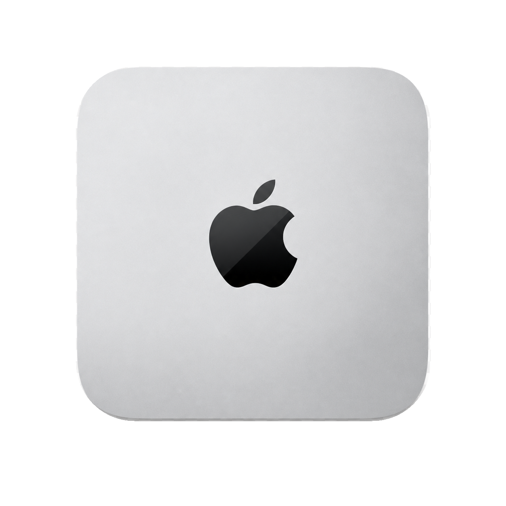
                <span class="home-preview-badge">FLAGSHIP · MAC STUDIO</span>
            </div>
        </section>

        <section class="section" id="sec-creator">
            <div class="chapter-head">
                <span class="chapter-eyebrow">REFERENCE</span>
                <h2 class="section-title"><span class="lang-pair"><span class="lang-zh" lang="zh-CN">精选评测参考</span><span class="lang-divider" aria-hidden="true"> / </span><span class="lang-en" lang="en">BOJIO 杰哥</span></span></h2>
                <div class="chapter-rule"></div>
            </div>

            <div class="video-card">
                <div class="video-wrapper">
                    <iframe width="560" height="315" src="https://www.youtube.com/embed/T4FwjYAWAwI?si=FUs0qRRfZWWGJGwA&amp;start=568" title="YouTube video player" frameborder="0" allow="accelerometer; autoplay; clipboard-write; encrypted-media; gyroscope; picture-in-picture; web-share" referrerpolicy="strict-origin-when-cross-origin" allowfullscreen></iframe>
                </div>
                <div class="video-info">
                    <h4 class="video-title" data-zh="BOJIO 杰哥 - 科技评测精选" data-en="BOJIO - Selected technology reviews">BOJIO 杰哥 - 科技评测精选</h4>
                    <span class="video-tagpill">DEEP DIVE</span>
                </div>
            </div>
        </section>
    </main>

    <footer class="site-footer">
        <div class="footer-line" data-zh="TECH ARSENAL / 首页" data-en="TECH ARSENAL / Home">tech arsenal / 首页</div>
    </footer>
    <script src="arsenal-site.js"></script>
</body>
</html>
```

### `tech-arsenal.html`
```html
<!DOCTYPE html>

<html lang="zh-CN">
<head>
<meta charset="utf-8"/>
<meta content="width=device-width, initial-scale=1.0" name="viewport"/>
<title>TECH ARSENAL — 总目录 / Catalogue</title>
<link href="arsenal-pages.css" rel="stylesheet"/>
<style>
        /* ===== 清单视图（manifest / list view） ===== */
        #catalogue-main.is-list .grid {
            display: flex !important;
            flex-direction: column !important;
            gap: 1px !important;
            background: var(--line, rgba(255,255,255,.12)) !important;
            border: 1px solid var(--line, rgba(255,255,255,.12)) !important;
            padding: 0 !important;
            grid-template-columns: none !important;
        }
        #catalogue-main.is-list .card,
        #catalogue-main.is-list .card:not(.is-lead),
        #catalogue-main.is-list .card.is-lead {
            display: grid !important;
            grid-template-columns: 60px 48px minmax(180px, 1.2fr) minmax(260px, 2fr) auto !important;
            grid-column: 1 / -1 !important;
            align-items: center !important;
            column-gap: 16px !important;
            padding: 8px 16px !important;
            min-height: 0 !important;
            height: auto !important;
            border: 0 !important;
            border-bottom: 1px solid var(--line, rgba(255,255,255,.08)) !important;
            border-radius: 0 !important;
            background: var(--panel-solid, #14171f) !important;
            cursor: pointer !important;
            transform: none !important;
            box-shadow: none !important;
            outline: none !important;
        }
        #catalogue-main.is-list .card:hover,
        #catalogue-main.is-list .card:focus-visible {
            background: var(--row-hover, rgba(255,255,255,.07)) !important;
            outline: none !important;
            transform: none !important;
        }
        #catalogue-main.is-list .lot-number {
            position: static !important;
            order: 1 !important;
            font-family: var(--mono, ui-monospace, "SF Mono", Menlo, monospace) !important;
            font-size: 11px !important;
            letter-spacing: .04em !important;
            opacity: .6 !important;
            margin: 0 !important;
            padding: 0 !important;
            color: var(--text) !important;
        }
        #catalogue-main.is-list .img-box,
        #catalogue-main.is-list .card.is-lead .img-box,
        #catalogue-main.is-list .card:not(.is-lead) .img-box {
            position: static !important;
            order: 2 !important;
            width: 44px !important;
            height: 44px !important;
            min-height: 44px !important;
            max-height: 44px !important;
            padding: 4px !important;
            border: 1px solid var(--line, rgba(255,255,255,.1)) !important;
            border-radius: 6px !important;
            background: var(--bg-elevated, #0c0e14) !important;
            display: flex !important;
            align-items: center !important;
            justify-content: center !important;
            overflow: hidden !important;
            flex: 0 0 44px !important;
            margin: 0 !important;
        }
        #catalogue-main.is-list .img-box img,
        #catalogue-main.is-list .card.is-lead .img-box img,
        #catalogue-main.is-list .card:not(.is-lead) .img-box img {
            width: 100% !important;
            height: 100% !important;
            max-width: 36px !important;
            max-height: 36px !important;
            object-fit: contain !important;
            transform: none !important;
            filter: none !important;
            display: block !important;
        }
        #catalogue-main.is-list .card-content,
        #catalogue-main.is-list .card.is-lead .card-content,
        #catalogue-main.is-list .card:not(.is-lead) .card-content {
            order: 3 !important;
            display: flex !important;
            flex-direction: column !important;
            align-items: flex-start !important;
            gap: 2px !important;
            padding: 0 !important;
            min-width: 0 !important;
        }
        #catalogue-main.is-list .product-name,
        #catalogue-main.is-list .card.is-lead .product-name,
        #catalogue-main.is-list .card:not(.is-lead) .product-name {
            order: 1 !important;
            margin: 0 !important;
            font-size: 15px !important;
            line-height: 1.2 !important;
            white-space: nowrap !important;
            overflow: hidden !important;
            text-overflow: ellipsis !important;
            max-width: 100% !important;
        }
        #catalogue-main.is-list .hallmark,
        #catalogue-main.is-list .card.is-lead .hallmark,
        #catalogue-main.is-list .card:not(.is-lead) .hallmark {
            order: 2 !important;
            margin: 0 !important;
            font-size: 10px !important;
            opacity: .55 !important;
            white-space: nowrap !important;
            overflow: hidden !important;
            text-overflow: ellipsis !important;
            max-width: 100% !important;
        }
        #catalogue-main.is-list .specs,
        #catalogue-main.is-list .card.is-lead .specs,
        #catalogue-main.is-list .card:not(.is-lead) .specs {
            order: 4 !important;
            display: flex !important;
            align-items: center !important;
            gap: 14px !important;
            margin: 0 !important;
            padding: 0 !important;
            border: 0 !important;
            overflow: hidden !important;
            flex-wrap: nowrap !important;
            max-width: 100% !important;
        }
        #catalogue-main.is-list .spec-row {
            display: inline-flex !important;
            align-items: baseline !important;
            gap: 5px !important;
            padding: 0 !important;
            border: 0 !important;
            white-space: nowrap !important;
            min-width: 0 !important;
        }
        #catalogue-main.is-list .spec-label {
            font-size: 10px !important;
            opacity: .45 !important;
            text-transform: uppercase !important;
        }
        #catalogue-main.is-list .spec-val {
            font-size: 12px !important;
            opacity: .85 !important;
            color: var(--text) !important;
        }
        #catalogue-main.is-list .seal {
            order: 5 !important;
            position: static !important;
            justify-self: end !important;
            margin: 0 !important;
            white-space: nowrap !important;
        }
        #catalogue-main.is-list .record-action {
            display: none !important;
        }
        /* ===== 精致视图切换分段控制器（Segmented View Switcher） ===== */
        .control-subbar {
            grid-column: 1 / -1;
            display: flex;
            align-items: center;
            justify-content: space-between;
            gap: 16px;
            margin-top: 12px;
            padding-top: 14px;
            border-top: 1px solid var(--line);
        }
        .control-subbar .result-summary {
            margin: 0;
            grid-column: auto;
        }
        .view-toggle {
            display: inline-flex;
            align-items: center;
            padding: 3px;
            background: rgba(10, 13, 18, 0.85);
            border: 1px solid var(--line-strong);
            border-radius: 6px;
            box-shadow: inset 0 1px 3px rgba(0, 0, 0, 0.45);
            gap: 3px;
            user-select: none;
        }
        .view-btn {
            position: relative;
            display: inline-flex;
            align-items: center;
            justify-content: center;
            gap: 7px;
            height: 32px;
            padding: 0 13px;
            border: 1px solid transparent;
            border-radius: 4px;
            background: transparent;
            color: var(--muted);
            font-family: var(--mono);
            font-size: 0.64rem;
            font-weight: 500;
            letter-spacing: 0.08em;
            text-transform: uppercase;
            cursor: pointer;
            white-space: nowrap;
            transition: color 180ms ease, background-color 180ms ease, border-color 180ms ease, box-shadow 180ms ease;
        }
        .view-btn > * {
            pointer-events: none;
        }
        .view-btn .view-icon {
            width: 12px;
            height: 12px;
            flex: 0 0 12px;
            opacity: 0.65;
            transition: opacity 180ms ease, color 180ms ease;
        }
        .view-btn:hover {
            color: var(--text);
            background: rgba(255, 255, 255, 0.04);
        }
        .view-btn:hover .view-icon {
            opacity: 1;
        }
        .view-btn:focus-visible {
            outline: 2px solid var(--accent);
            outline-offset: 2px;
        }
        .view-btn.active {
            color: #ffffff;
            background: linear-gradient(180deg, #1f2a3a 0%, #131a26 100%);
            border: 1px solid rgba(145, 165, 255, 0.4);
            box-shadow:
                0 2px 8px rgba(0, 0, 0, 0.38),
                inset 0 1px 0 rgba(255, 255, 255, 0.12),
                0 0 12px rgba(111, 134, 255, 0.15);
        }
        .view-btn.active .view-icon {
            color: var(--accent-2);
            opacity: 1;
        }
        @media (max-width: 640px) {
            .control-subbar {
                flex-direction: column;
                align-items: stretch;
                gap: 12px;
            }
            .view-toggle {
                width: 100%;
            }
            .view-btn {
                flex: 1 1 50%;
            }
        }
    </style>
</head>
<body class="catalogue-page">
<header class="header site-header">
<div class="header-top top-row">
<a aria-label="返回首页 / Back to home" class="back-link home-mark-link" href="index.html" title="返回首页 / Back to home"></a>
<nav aria-label="Site navigation / 站点导航" class="page-nav">
<a class="page-link" href="index.html"><span class="lang-pair"><span class="lang-zh" lang="zh-CN">首页</span><span aria-hidden="true" class="lang-divider"> / </span><span class="lang-en" lang="en">Home</span></span></a>
<a aria-current="page" class="page-link active" href="tech-arsenal.html"><span class="lang-pair"><span class="lang-zh" lang="zh-CN">总目录</span><span aria-hidden="true" class="lang-divider"> / </span><span class="lang-en" lang="en">Catalogue</span></span></a>
<a class="page-link" href="comparison-lab.html"><span class="lang-pair"><span class="lang-zh" lang="zh-CN">对比</span><span aria-hidden="true" class="lang-divider"> / </span><span class="lang-en" lang="en">Compare</span></span></a>
<a class="page-link" href="topology.html"><span class="lang-pair"><span class="lang-zh" lang="zh-CN">工位与连接</span><span aria-hidden="true" class="lang-divider"> / </span><span class="lang-en" lang="en">Setup</span></span></a>
</nav>
</div>
<div class="masthead">
<div class="masthead-copy">
<h1 class="main-title"><span class="tech">TECH</span> <span class="arsenal">ARSENAL</span></h1>
</div>
<div aria-label="收藏概览 / Collection summary" class="collection-ledger">
<span><strong>058</strong> <span data-en="Catalogued" data-zh="已编目">catalogued</span></span>
<span class="owned"><strong>005</strong> <span data-en="In collection" data-zh="已入藏">in collection</span></span>
<span><strong>053</strong> <span data-en="Pursuing" data-zh="关注中">pursuing</span></span>
<span><strong>005</strong> <span data-en="Chapters" data-zh="章节">chapters</span></span>
</div>
</div>
</header>
<section aria-label="查找并筛选目录 / Find and filter the catalogue" class="control-bar">
<div class="search-wrap" role="search">
<label class="search-label" data-en="Find a device or configuration" data-zh="查找设备或配置" for="searchInput">Find a device or configuration</label>
<span aria-hidden="true" class="search-mark"></span>
<input aria-describedby="resultSummary" autocomplete="off" class="search-input" data-placeholder-en="Search gear" data-placeholder-zh="搜索设备" id="searchInput" placeholder="Search gear" spellcheck="false" type="search"/>
<span aria-hidden="true" class="search-key" data-en="Press / to focus" data-zh="按 / 聚焦">Press /</span>
</div>
<div aria-label="按章节筛选 / Filter by chapter" class="filter-bar" role="group">
<button aria-pressed="true" class="filter-btn active" data-en="All gear" data-filter="all" data-zh="全部设备" type="button">All gear</button>
<button aria-pressed="false" class="filter-btn" data-en="Phones" data-filter="mobile" data-zh="手机" type="button">Phones</button>
<button aria-pressed="false" class="filter-btn" data-en="Tablets" data-filter="tablet" data-zh="平板" type="button">Tablets</button>
<button aria-pressed="false" class="filter-btn" data-en="Laptops" data-filter="laptop" data-zh="笔记本" type="button">Laptops</button>
<button aria-pressed="false" class="filter-btn" data-en="Desktops" data-filter="desktop" data-zh="台式机" type="button">Desktops</button>
<button aria-pressed="false" class="filter-btn" data-en="Peripherals" data-filter="peripheral" data-zh="外设" type="button">Peripherals</button>
</div>
<div class="control-subbar">
<p aria-live="polite" class="result-summary" data-en="Showing 58 records across 5 chapters" data-zh="显示 58 条记录，分布于 5 个章节" id="resultSummary" role="status">Showing 58 records across 5 chapters</p>
<div aria-label="切换显示方式 / Switch view" class="view-toggle" role="group">
<button aria-pressed="false" class="view-btn" data-view="gallery" type="button">
<svg aria-hidden="true" class="view-icon" fill="currentColor" viewbox="0 0 16 16">
<path d="M1.5 2A1.5 1.5 0 0 0 0 3.5v3A1.5 1.5 0 0 0 1.5 8h3A1.5 1.5 0 0 0 6 6.5v-3A1.5 1.5 0 0 0 4.5 2h-3zm8 0A1.5 1.5 0 0 0 8 3.5v3A1.5 1.5 0 0 0 9.5 8h3A1.5 1.5 0 0 0 14 6.5v-3A1.5 1.5 0 0 0 12.5 2h-3zm-8 8A1.5 1.5 0 0 0 0 11.5v3A1.5 1.5 0 0 0 1.5 16h3A1.5 1.5 0 0 0 6 14.5v-3A1.5 1.5 0 0 0 4.5 10h-3zm8 0a1.5 1.5 0 0 0-1.5 1.5v3a1.5 1.5 0 0 0 1.5 1.5h3a1.5 1.5 0 0 0 1.5-1.5v-3a1.5 1.5 0 0 0-1.5-1.5h-3z"></path>
</svg>
<span data-en="Gallery" data-zh="图册">图册 / Gallery</span>
</button>
<button aria-pressed="true" class="view-btn active" data-view="list" type="button">
<svg aria-hidden="true" class="view-icon" fill="currentColor" viewbox="0 0 16 16">
<path d="M2.5 12a.5.5 0 0 1 .5-.5h10a.5.5 0 0 1 0 1H3a.5.5 0 0 1-.5-.5zm0-4a.5.5 0 0 1 .5-.5h10a.5.5 0 0 1 0 1H3a.5.5 0 0 1-.5-.5zm0-4a.5.5 0 0 1 .5-.5h10a.5.5 0 0 1 0 1H3a.5.5 0 0 1-.5-.5z" fill-rule="evenodd"></path>
</svg>
<span data-en="List" data-zh="清单">清单 / List</span>
</button>
</div>
</div>
</section>
<aside aria-describedby="dossierDesc" aria-labelledby="dossierTitle" aria-modal="true" class="dossier" hidden="" id="techDossier" role="dialog">
<div aria-hidden="true" class="dossier-backdrop" data-dossier-dismiss=""></div>
<div class="dossier-panel">
<div class="dossier-visual">

<p aria-live="polite" class="dossier-image-note" data-en="Image unavailable; showing archive placeholder" data-zh="图像暂不可用，显示档案占位图" hidden="" id="dossierImageNote" role="status">Image unavailable; showing archive placeholder</p>
</div>
<div class="dossier-body">
<div class="dossier-topline">
<span class="dossier-brand" id="dossierBrand">Brand / 品牌</span>
<div class="dossier-topline-tools">
<span class="dossier-status" id="dossierStatus">Pursuing / 关注中</span>
<button aria-label="关闭档案 / Close dossier" class="dossier-close" id="dossierClose" type="button">
<svg aria-hidden="true" class="dossier-close-icon" focusable="false" viewbox="0 0 12 12"><path d="M2 2l8 8M10 2L2 10"></path></svg>
<span data-en="Close dossier" data-zh="关闭档案">Close dossier</span>
</button>
</div>
</div>
<h2 class="dossier-title" id="dossierTitle">Product name</h2>
<p class="dossier-lot" id="dossierLot"></p>
<p class="dossier-why" id="dossierWhy"></p>
<p class="dossier-desc" id="dossierDesc"></p>
<div class="dossier-specs" id="dossierSpecs"></div>
<div class="dossier-actions">
<a class="dossier-action" data-en="Open comparison lab" data-zh="打开对比实验室" href="comparison-lab.html">Open comparison lab</a>
</div>
</div>
</div>
</aside>
<main class="collection is-list" id="catalogue-main">
<div class="section-wrapper" id="sec-mobile">
<div class="chapter-head">
<span class="chapter-eyebrow">phones</span>
<h2 class="section-title"><span class="lang-pair"><span class="lang-zh" lang="zh-CN">手机</span><span aria-hidden="true" class="lang-divider"> / </span><span class="lang-en" lang="en">Smartphones</span></span><span class="section-count">(36 / 36 PIECES)</span></h2>
<div class="chapter-rule"></div>
</div>
<div class="grid">
<div class="card" data-brand="xiaomi" data-cat="mobile" data-chapter="SMARTPHONES" data-lot="001" data-name="mi 10 ultra xiaomi · 10th anniversary 10th anniversary xiaomi" data-status="wishlist">
<div class="lot-number">N° 001</div>
<div class="seal wishlist"><span class="dot"></span>WISHLIST</div>
<div class="img-box">
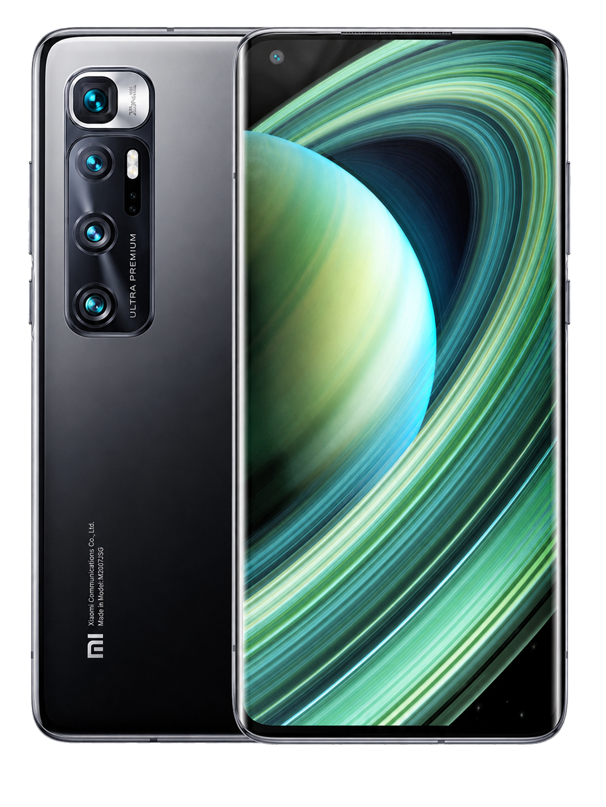
</div>
<div class="card-content">
<div class="hallmark">XIAOMI · 10TH ANNIVERSARY</div>
<h3 class="product-name">Mi 10 Ultra</h3>
<div class="specs">
<div class="spec-row"><span class="spec-label">Display</span><span class="spec-val">6.67" 120Hz 10-bit OLED</span></div>
<div class="spec-row"><span class="spec-label">Sensor</span><span class="spec-val">1/1.32" OV48C · 1/2" IMX586</span></div>
<div class="spec-row"><span class="spec-label">Battery</span><span class="spec-val">4500mAh Graphene</span></div>
<div class="spec-row"><span class="spec-label">Charging</span><span class="spec-val">120W Wired + 50W Wireless</span></div>
</div>
</div>
<div class="hidden-details" style="display:none;">
<div class="d-brand">XIAOMI // 10TH ANNIVERSARY</div>
<div class="d-title">Mi 10 Ultra</div>
<div class="d-why">120W is still fast today. I like that the transparent edition shows the internals.</div>
<div class="d-desc">10th-anniversary model. Dual 48MP main and periscope cameras, 120W wired charging.</div>
<div class="d-spec" data-label="SoC">Snapdragon 865 (7nm) | LPDDR5 | UFS 3.1</div>
<div class="d-spec" data-label="Display">6.67" OLED | 120Hz | 10-bit Color | 1120 nits peak</div>
<div class="d-spec" data-label="Camera System">[Main] 48MP OmniVision OV48C | 1/1.32" | OIS<br/>
                        [Periscope] 48MP Sony IMX586 | 5x Optical | 120x Zoom<br/>
                        [Portrait] 12MP S5K2L7 | 2x Optical | 46mm Equivalent<br/>
                        [Ultrawide] 20MP Sony IMX350 | 128° FOV | 12mm</div>
<div class="d-spec" data-label="Camera Sensors">Main: OmniVision OV48C / 1/1.32" (48MP, 1.2µm, OIS); Periscope: Sony IMX586 / 1/2.0" (48MP, 5× optical / 120× digital, OIS); Portrait: Samsung S5K2L7 / 1/2.56" (12MP, 2× optical); Ultrawide: Sony IMX350 / 1/2.78" (20MP, 128°); Front: Samsung S5K3T2 / 1/3.4" (20MP)</div>
<div class="d-spec" data-label="Focal Lengths">Native: 12mm / 25mm / 50mm / 120mm | Sensor crop: 50mm (2× main; overlaps the native 50mm camera) | Hybrid reach: 240mm+ at 10× and beyond</div>
<div class="d-spec" data-label="Battery &amp; Charging">4500mAh Graphene-based | 120W Wired (100% in 23m) | 50W Wireless</div>
<div class="d-spec" data-label="Build">221.8g | Ceramic Black / Transparent Edition</div>
</div>
</div>
<div class="card" data-brand="samsung" data-cat="mobile" data-chapter="SMARTPHONES" data-lot="002" data-name="galaxy s23 ultra samsung · galaxy ultra galaxy ultra samsung" data-status="wishlist">
<div class="lot-number">N° 002</div>
<div class="seal wishlist"><span class="dot"></span>WISHLIST</div>
<div class="img-box">
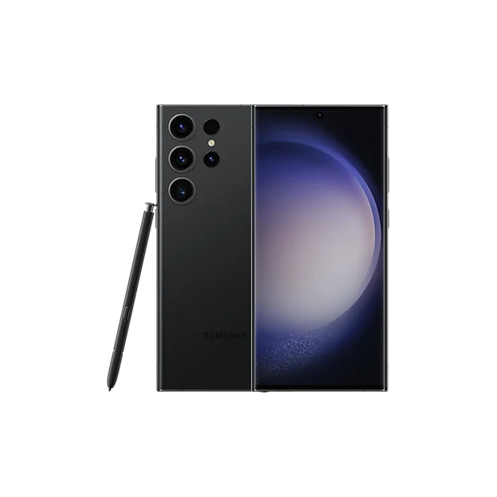
</div>
<div class="card-content">
<div class="hallmark">SAMSUNG · GALAXY ULTRA</div>
<h3 class="product-name">Galaxy S23 Ultra</h3>
<div class="specs">
<div class="spec-row"><span class="spec-label">Chip</span><span class="spec-val">Snapdragon 8 Gen 2</span></div>
<div class="spec-row"><span class="spec-label">Sensor</span><span class="spec-val">1/1.3" HP2 · 200MP OIS</span></div>
<div class="spec-row"><span class="spec-label">Feature</span><span class="spec-val">Built-in S-Pen</span></div>
</div>
</div>
<div class="hidden-details" style="display:none;">
<div class="d-brand">SAMSUNG // GALAXY ULTRA</div>
<div class="d-title">Galaxy S23 Ultra</div>
<div class="d-why">200MP plus a built-in S-Pen is the combination I keep coming back to.</div>
<div class="d-desc">A productivity- and zoom-focused flagship with a custom overclocked Snapdragon chip and a 200MP ISOCELL sensor.</div>
<div class="d-spec" data-label="SoC">Snapdragon 8 Gen 2 For Galaxy (Overclocked)</div>
<div class="d-spec" data-label="Display">6.8" Dynamic AMOLED 2X | 1-120Hz LTPO | 1750 nits</div>
<div class="d-spec" data-label="Camera System">[Main] 200MP ISOCELL HP2 | 1/1.3" | Laser AF | OIS<br/>
                        [Periscope] 10MP | 10x Optical | 100x Space Zoom<br/>
                        [Telephoto] 10MP | 3x Optical<br/>
                        [Ultrawide] 12MP | 120° FOV</div>
<div class="d-spec" data-label="Camera Sensors">Main: Samsung ISOCELL HP2 / 1/1.3" (200MP, 0.6µm, OIS); Periscope: Sony IMX754 / 1/3.52" (10MP, 10× optical, OIS); 3× Telephoto: Sony IMX754 / 1/3.52" (10MP, 3×, OIS); Ultrawide: Sony IMX564 / 1/2.55" (12MP, 120°); Front: Samsung S5K3LU / 1/3.2" (12MP)</div>
<div class="d-spec" data-label="Focal Lengths">Native: 13mm / 24mm / 70mm / 230mm | Sensor crop: 48mm (2× main) | Space Zoom: up to 100× (algorithmic, not a fixed optical focal length)</div>
<div class="d-spec" data-label="Feature">Built-in S-Pen | IP68 | Armor Aluminum Frame</div>
<div class="d-spec" data-label="Battery">5000mAh | 45W Fast Charging</div>
<div class="d-spec" data-label="Build">Armor Aluminum frame | Gorilla Glass Victus 2 | IP68 water &amp; dust | 234g</div><div class="d-spec" data-label="Memory">12GB LPDDR5X RAM</div><div class="d-spec" data-label="Storage">1TB UFS 4.0 (顶配)</div></div>
</div>
<div class="card" data-brand="apple" data-cat="mobile" data-chapter="SMARTPHONES" data-lot="003" data-name="iphone 14 pro max apple · pro max apple flagship apple" data-status="wishlist">
<div class="lot-number">N° 003</div>
<div class="seal wishlist"><span class="dot"></span>WISHLIST</div>
<div class="img-box">
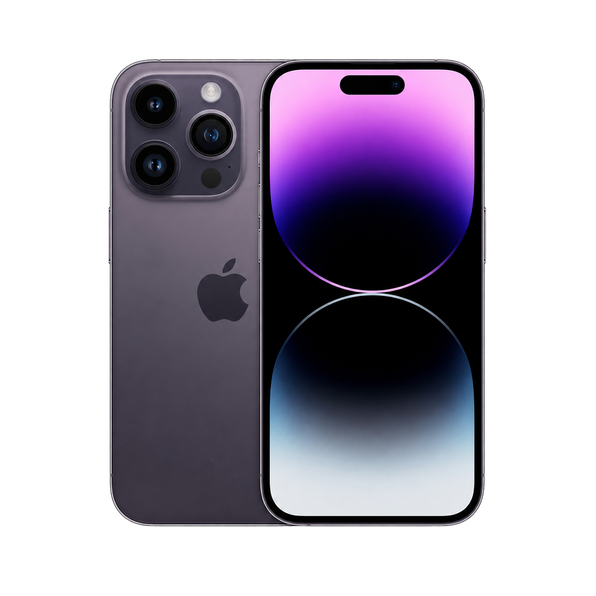
</div>
<div class="card-content">
<div class="hallmark">APPLE · PRO MAX</div>
<h3 class="product-name">iPhone 14 Pro Max</h3>
<div class="specs">
<div class="spec-row"><span class="spec-label">Chip</span><span class="spec-val">A16 Bionic</span></div>
<div class="spec-row"><span class="spec-label">Display</span><span class="spec-val">6.7" Super Retina XDR</span></div>
<div class="spec-row"><span class="spec-label">Feature</span><span class="spec-val">Dynamic Island</span></div>
</div>
</div>
<div class="hidden-details" style="display:none;">
<div class="d-brand">APPLE // PRO MAX</div>
<div class="d-title">iPhone 14 Pro Max</div>
<div class="d-why">Dynamic Island was a real design shift, not just a notch redesign.</div>
<div class="d-desc">First iPhone with Dynamic Island, and the shift to a 48MP main sensor with an always-on display.</div>
<div class="d-spec" data-label="SoC">A16 Bionic (4nm) | 6-core CPU | 5-core GPU</div>
<div class="d-spec" data-label="Display">6.7" Super Retina XDR OLED | ProMotion 120Hz | 2000 nits peak</div>
<div class="d-spec" data-label="Camera System">[Main] 48MP Sony IMX803 | 1/1.28" | Sensor-shift OIS<br/>
                        [Telephoto] 12MP | 3x Optical | 77mm equivalent<br/>
                        [Ultrawide] 12MP | 120° FOV</div>
<div class="d-spec" data-label="Camera Sensors">Main: Sony IMX803 / 1/1.28" (48MP, 1.22µm, 24mm, Sensor-shift OIS); 3× Telephoto: Sony IMX713 / 1/3.5" (12MP, 77mm, OIS); Ultrawide: Sony IMX633 / 1/2.55" (12MP, 13mm, 120°); Front: Sony IMX714 / 1/3.6" (12MP)</div>
<div class="d-spec" data-label="Focal Lengths">Native: 13mm / 24mm / 77mm | Sensor crop: 48mm (2× from the 48MP main sensor)</div>
<div class="d-spec" data-label="Feature">Dynamic Island | Emergency SOS via Satellite | Crash Detection</div>
<div class="d-spec" data-label="Build">Surgical-grade Stainless Steel | Ceramic Shield front</div>
<div class="d-spec" data-label="Battery">4323mAh | 20W wired fast charging | 15W MagSafe | Up to 29 hours video playback</div><div class="d-spec" data-label="Memory">6GB LPDDR5 RAM</div><div class="d-spec" data-label="Storage">1TB NVMe Storage (顶配)</div></div>
</div>
<div class="card" data-brand="vivo" data-cat="mobile" data-chapter="SMARTPHONES" data-lot="004" data-name="vivo x300 ultra vivo · zeiss master lenses snapdragon 8 elite gen 5 200mp camera" data-status="wishlist">
<div class="lot-number">N° 004</div>
<div class="seal wishlist"><span class="dot"></span>WISHLIST</div>
<div class="img-box">
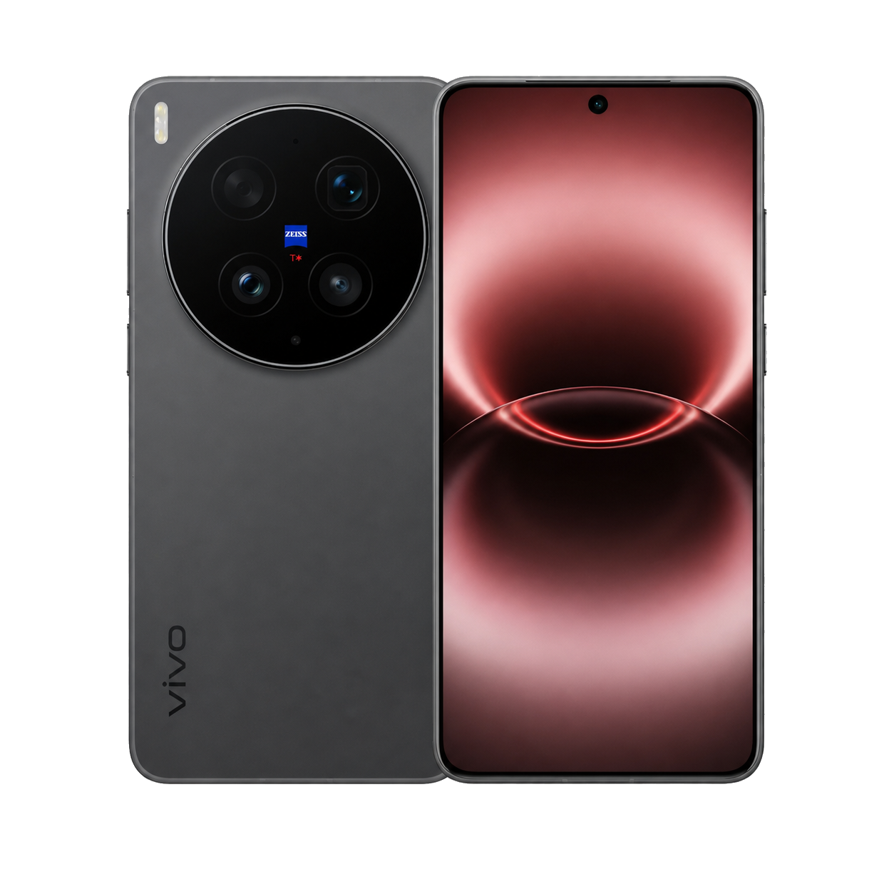
</div>
<div class="card-content">
<div class="hallmark">VIVO · ZEISS MASTER LENSES</div>
<h3 class="product-name">Vivo X300 Ultra</h3>
<div class="specs">
<div class="spec-row"><span class="spec-label">Optics</span><span class="spec-val">ZEISS 14/35/85mm · 28/50/135mm crop modes</span></div>
<div class="spec-row"><span class="spec-label">Chip</span><span class="spec-val">Snapdragon 8 Elite Gen 5</span></div>
<div class="spec-row"><span class="spec-label">Feature</span><span class="spec-val">4K 120fps 10-bit Log Video</span></div>
</div>
</div>
<div class="hidden-details" style="display:none;">
<div class="d-brand">VIVO // ZEISS MASTER LENSES</div>
<div class="d-title">Vivo X300 Ultra</div>
<div class="d-why">A camera-first flagship built around three ZEISS focal lengths: 14mm ultra-wide, 35mm documentary, and an 85mm gimbal-grade APO telephoto.</div>
<div class="d-desc">The X300 Ultra pairs 200MP master cameras with pro video controls, long-range extenders, and a display tuned for accurate color.</div>
<div class="d-spec" data-label="SoC">Qualcomm Snapdragon 8 Elite Gen 5 | 3nm | up to 4.6GHz</div>
<div class="d-spec" data-label="Memory">16GB LPDDR5X Ultra Pro | UFS 4.1 | 512GB or 1TB</div>
<div class="d-spec" data-label="Display">6.82" 2K AMOLED | 3168 × 1440 | 1–144Hz | 4500 nits local peak</div>
<div class="d-spec" data-label="Camera System">[Ultra-wide] 50MP Sony LYTIA 818 | 14mm | 1/1.28" | OIS<br/>
                        [Documentary] 200MP Sony LYTIA 901 | 35mm | 1/1.12" | OIS<br/>
                        [Telephoto] 200MP HP0 | 85mm | 1/1.4" | 3° OIS<br/>
                        [Front] 50MP | ZEISS T* coatings across the master lenses</div>
<div class="d-spec" data-label="Camera Sensors">Documentary Main: Sony LYTIA 901 / 1/1.12" (200MP, 35mm, OIS); Ultrawide: Sony LYTIA 818 / 1/1.28" (50MP, 14mm, OIS); Telephoto: Samsung HP0 / 1/1.4" (200MP, 85mm, 3° OIS); Front: 50MP ZEISS master lens</div>
<div class="d-spec" data-label="Focal Lengths">Native: 14mm / 35mm / 85mm | Sensor crop modes: 28mm / 50mm / 135mm | ZEISS extenders: 200mm / 400mm equivalent</div>
<div class="d-spec" data-label="Video">Multi-focal 4K 120fps | 10-bit Log | 4:2:2 | Dolby Vision</div>
<div class="d-spec" data-label="Battery">6600mAh BlueVolt | 100W wired FlashCharge | 40W wireless</div>
<div class="d-spec" data-label="Build">IP68/IP69 | 3D ultrasonic fingerprint | 232–237g</div>
</div>
</div>
<div class="card" data-brand="honor" data-cat="mobile" data-chapter="SMARTPHONES" data-lot="005" data-name="magic 4 至臻版 honor · magic ultimate honor // ultimate honor" data-status="wishlist">
<div class="lot-number">N° 005</div>
<div class="seal wishlist"><span class="dot"></span>WISHLIST</div>
<div class="img-box">
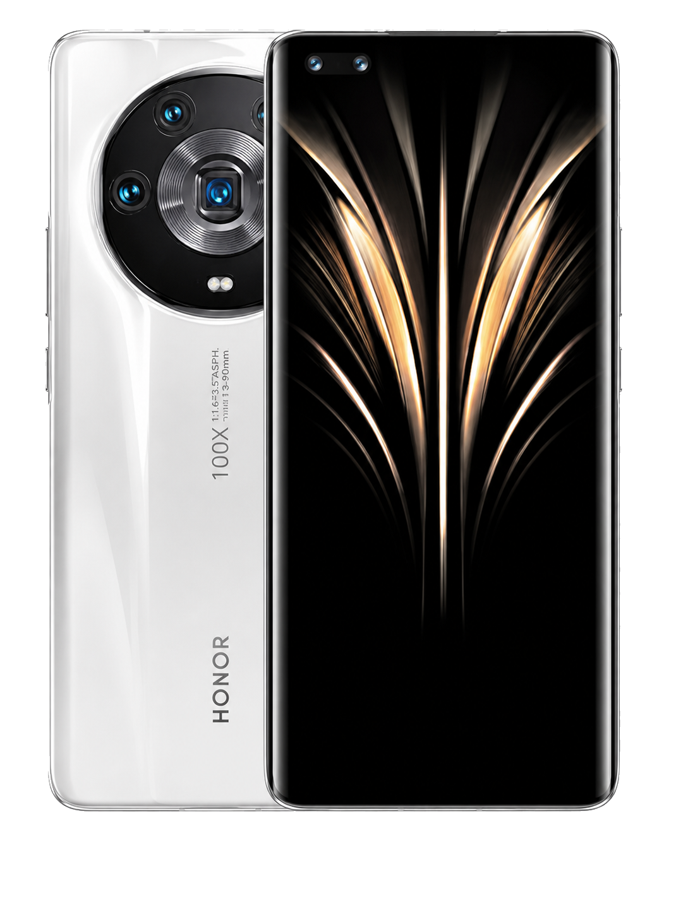
</div>
<div class="card-content">
<div class="hallmark">HONOR · MAGIC ULTIMATE</div>
<h3 class="product-name">Magic 4 至臻版</h3>
<div class="specs">
<div class="spec-row"><span class="spec-label">Display</span><span class="spec-val">6.81" LTPO OLED</span></div>
<div class="spec-row"><span class="spec-label">Sensor</span><span class="spec-val">1/1.12" Custom · Dual OV64B</span></div>
<div class="spec-row"><span class="spec-label">Feature</span><span class="spec-val">Ceramic / DxO King</span></div>
</div>
</div>
<div class="hidden-details" style="display:none;">
<div class="d-brand">HONOR // MAGIC ULTIMATE</div>
<div class="d-title">Honor Magic4 Ultimate</div>
<div class="d-why"></div>
<div class="d-desc">Custom 8P-lens main sensor with a dedicated image processor, ceramic body.</div>
<div class="d-spec" data-label="SoC">Snapdragon 8 Gen 1 (4nm) | Custom Image Signal Processor</div>
<div class="d-spec" data-label="Display">6.81" LTPO OLED | 1-120Hz | 1920Hz PWM Dimming</div>
<div class="d-spec" data-label="Camera System">[Main] 50MP Custom 1/1.12" | 8P Lens | f/1.6 | OIS<br/>
                        [Ultrawide] 64MP | 126° FOV | Dual Free-Form Lens<br/>
                        [Periscope] 64MP | 3.5x Optical | 100x Digital | OIS<br/>
                        [Spectrum] 50MP Spectrum Enhanced Sensor</div>
<div class="d-spec" data-label="Camera Sensors">Main: Custom Sony IMX707 / GNH / 1/1.12" (50MP, 1.4µm, 8P, OIS); Ultrawide: OmniVision OV64B / 1/2.0" (64MP, 126°); Periscope: OmniVision OV64B / 1/2.0" (64MP, 3.5× optical / 100× digital, OIS); Spectrum: 50MP / 1/2.5"; Front: 12MP / 1/3.6" + 3D ToF</div>
<div class="d-spec" data-label="Focal Lengths">Native: 11mm / 23mm / 90mm | Sensor crop: 46mm (2× main) | 100× mode is computational reach, not a fixed optical focal length</div>
<div class="d-spec" data-label="Battery &amp; Charging">4600mAh | 100W Wired | 50W Wireless</div>
<div class="d-spec" data-label="Build">Nanocrystal Ceramic | IP68 | 242g</div>
</div>
</div>
<div class="card" data-brand="huawei" data-cat="mobile" data-chapter="SMARTPHONES" data-lot="006" data-name="huawei p40 pro+ huawei · leica optics huawei // leica huawei" data-status="wishlist">
<div class="lot-number">N° 006</div>
<div class="seal wishlist"><span class="dot"></span>WISHLIST</div>
<div class="img-box">
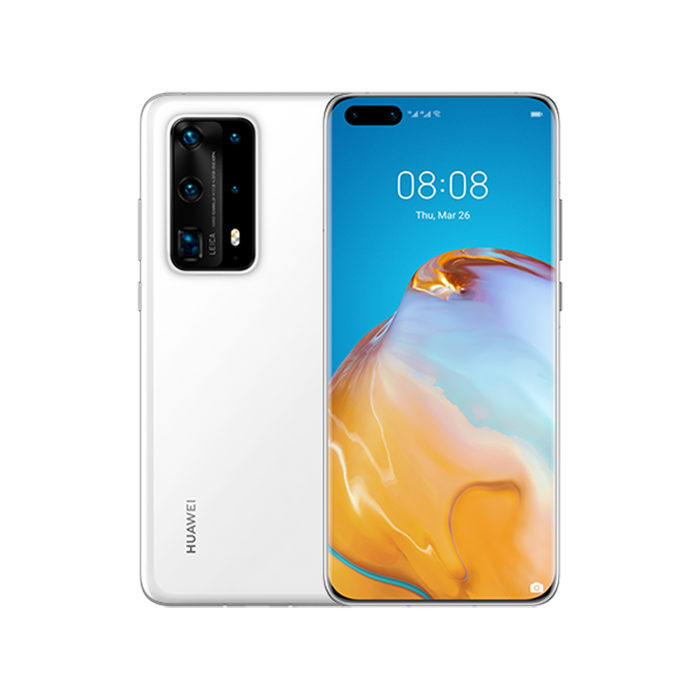
</div>
<div class="card-content">
<div class="hallmark">HUAWEI · LEICA OPTICS</div>
<h3 class="product-name">Huawei P40 Pro+</h3>
<div class="specs">
<div class="spec-row"><span class="spec-label">Chip</span><span class="spec-val">Kirin 990 5G</span></div>
<div class="spec-row"><span class="spec-label">Sensor</span><span class="spec-val">1/1.28" IMX700 RYYB · 50MP</span></div>
<div class="spec-row"><span class="spec-label">Build</span><span class="spec-val">Nano-tech Ceramic</span></div>
</div>
</div>
<div class="hidden-details" style="display:none;">
<div class="d-brand">HUAWEI // LEICA OPTICS</div>
<div class="d-title">Huawei P40 Pro+</div>
<div class="d-why">First phone with a true 10x optical periscope zoom. Notable engineering for 2020.</div>
<div class="d-desc">First smartphone with a true 10x optical continuous zoom periscope lens.</div>
<div class="d-spec" data-label="SoC">Kirin 990 5G (7nm+) | Mali-G76 MC16 GPU</div>
<div class="d-spec" data-label="Display">6.58" OLED | 90Hz | Quad-Curve Overflow Display</div>
<div class="d-spec" data-label="Camera System">[Main] 50MP Ultra Vision RYYB | 1/1.28" | OIS<br/>
                        [Cine Ultrawide] 40MP | 18mm | f/1.8<br/>
                        [Periscope] 8MP | 10x Optical | 100x Max Zoom | OIS<br/>
                        [Telephoto] 8MP | 3x Optical | OIS<br/>
                        [Depth] 3D ToF Sensor</div>
<div class="d-spec" data-label="Camera Sensors">Main: Sony IMX700 Ultra Vision RYYB / 1/1.28" (50MP, 1.22µm, OIS); Cine Ultrawide: Sony IMX608 / 1/1.54" (40MP, 18mm); 10× Periscope: Sony IMX520 / 1/3.6" (8MP, 240mm, OIS); 3× Telephoto: Sony IMX520 / 1/3.6" (8MP, 80mm, OIS); 3D ToF; Front: Sony IMX616 / 1/2.8" (32MP)</div>
<div class="d-spec" data-label="Focal Lengths">Native: 18mm / 23mm / 80mm / 240mm | Sensor crop / hybrid: ~46mm (2× main) | 100× mode extends beyond the optical 240mm anchor</div>
<div class="d-spec" data-label="Battery">4200mAh | 40W Wired | 40W Wireless Charging</div>
<div class="d-spec" data-label="Build">Kiln-baked Nano-tech Ceramic | IP68 Water Resistance</div>
<div class="d-spec" data-label="Memory">8GB LPDDR4X RAM</div><div class="d-spec" data-label="Storage">512GB UFS 3.0 (顶配)</div></div>
</div>
<div class="card" data-brand="huawei" data-cat="mobile" data-chapter="SMARTPHONES" data-lot="007" data-name="huawei p50 pro huawei · leica optics huawei // leica huawei" data-status="wishlist">
<div class="lot-number">N° 007</div>
<div class="seal wishlist"><span class="dot"></span>WISHLIST</div>
<div class="img-box">
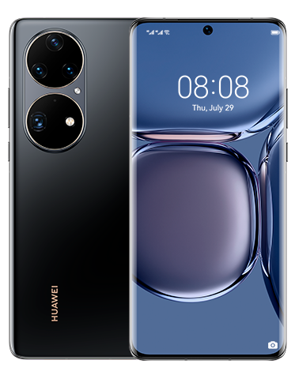
</div>
<div class="card-content">
<div class="hallmark">HUAWEI · LEICA OPTICS</div>
<h3 class="product-name">Huawei P50 Pro</h3>
<div class="specs">
<div class="spec-row"><span class="spec-label">Design</span><span class="spec-val">Dual-Matrix Camera</span></div>
<div class="spec-row"><span class="spec-label">Sensor</span><span class="spec-val">1/1.56" IMX766 + 1/2" OV64B</span></div>
<div class="spec-row"><span class="spec-label">Zoom</span><span class="spec-val">200x Digital Range</span></div>
</div>
</div>
<div class="hidden-details" style="display:none;">
<div class="d-brand">HUAWEI // LEICA OPTICS</div>
<div class="d-title">Huawei P50 Pro</div>
<div class="d-why">The Dual-Matrix camera ring is a distinct design nobody else really copied.</div>
<div class="d-desc">Known for its Dual-Matrix camera design and XD Optics computational photography.</div>
<div class="d-spec" data-label="SoC">Kirin 9000 / Snapdragon 888 4G</div>
<div class="d-spec" data-label="Display">6.6" OLED | 120Hz | 1440Hz PWM Dimming | True-Chroma</div>
<div class="d-spec" data-label="Camera System">[Main] 50MP True-Chroma | f/1.8 | OIS<br/>
                        [Monochrome] 40MP True-Chroma | f/1.6<br/>
                        [Periscope] 64MP | 3.5x Optical | 200x Digital Zoom Range | OIS<br/>
                        [Ultrawide] 13MP | 13mm Equivalent</div>
<div class="d-spec" data-label="Camera Sensors">Color Main: Sony IMX766 / 1/1.56" (50MP, 1.0µm, OIS); B&amp;W Main: Sony IMX600 / 1/1.7" (40MP, 1.0µm); Periscope: OmniVision OV64B / 1/2.0" (64MP, 3.5× optical / 200× digital, OIS); Ultrawide: Sony IMX258 / 1/3.06" (13MP, 13mm); Front: 13MP / 1/3.06"</div>
<div class="d-spec" data-label="Focal Lengths">Native: 13mm / 23mm / 26mm monochrome / 90mm | Sensor crop: 46mm (2× main) | 200× range is computational reach</div>
<div class="d-spec" data-label="Imaging Tech">HUAWEI XD Optics | XD Fusion Pro Image Engine</div>
<div class="d-spec" data-label="Battery">4360mAh | 66W Wired | 50W Wireless Charging</div>
<div class="d-spec" data-label="Build">Aluminum frame | Curved glass front &amp; back | IP68 water &amp; dust | 195g</div><div class="d-spec" data-label="Memory">12GB LPDDR5 RAM (顶配)</div><div class="d-spec" data-label="Storage">512GB (顶配)</div></div>
</div>
<div class="card" data-brand="samsung" data-cat="mobile" data-chapter="SMARTPHONES" data-lot="008" data-name="galaxy z fold6" data-status="wishlist">
<div class="lot-number">N° 008</div>
<div class="seal wishlist"><span class="dot"></span>WISHLIST</div>
<div class="img-box">
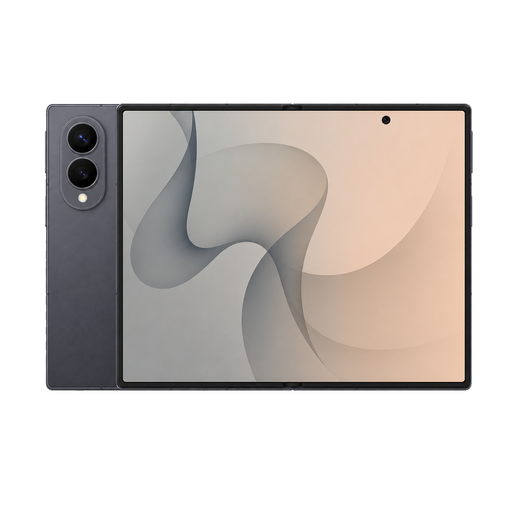
</div>
<div class="card-content">
<div class="hallmark">SAMSUNG · GALAXY Z SERIES</div>
<h3 class="product-name">Galaxy Z Fold8</h3>
<div class="specs">
<div class="spec-row"><span class="spec-label">SoC</span><span class="spec-val">Snapdragon 8 Elite Gen 5</span></div>
<div class="spec-row"><span class="spec-label">Display</span><span class="spec-val">7.6" Dynamic AMOLED 2X</span></div>
<div class="spec-row"><span class="spec-label">Build</span><span class="spec-val">Flex Titanium · IP48</span></div>
</div>
</div>
<div class="hidden-details" style="display:none;">
<div class="d-brand">SAMSUNG // GALAXY Z SERIES</div>
<div class="d-title">Galaxy Z Fold6</div>
<div class="d-why">A thinner, sharper foldable that turns a pocket device into a real multitasking canvas.</div>
<div class="d-desc">Samsung’s refined foldable flagship: symmetrical 239g lightweight design, IP48 dust/water resistance, Snapdragon 8 Gen 3 for Galaxy, and full Galaxy AI suite.</div>
<div class="d-spec" data-label="SoC">Qualcomm Snapdragon 8 Gen 3 for Galaxy (4nm) | 3.39GHz Cortex-X4 | Adreno 750</div><div class="d-spec" data-label="Memory">12GB LPDDR5X RAM (顶配)</div><div class="d-spec" data-label="Storage">1TB UFS 4.0 (顶配)</div><div class="d-spec" data-label="Inner Display">7.6" Dynamic AMOLED 2X (2160x1856) | 1-120Hz LTPO | 2600 nits peak | Ultra Thin Glass</div><div class="d-spec" data-label="Cover Display">6.3" Dynamic AMOLED 2X (2376x968, 22.1:9) | 1-120Hz LTPO | 2600 nits peak | Corning Gorilla Glass Victus 2</div><div class="d-spec" data-label="Camera System">[Main] 50MP (1/1.56", f/1.8, Dual Pixel AF, OIS) | [Telephoto] 10MP (3x Optical, OIS) | [Ultrawide] 12MP (123° FOV)</div><div class="d-spec" data-label="Camera Sensors">Main: Samsung ISOCELL GN3 / 1/1.56" (50MP, 1.0µm, OIS); 3× Telephoto: Samsung S5K3K1 (10MP, 3×, OIS); Ultrawide: 12MP (123°); Under-display: 4MP; Cover Front: 10MP</div><div class="d-spec" data-label="Focal Lengths">Native: 12mm / 24mm / 67mm | Sensor crop: 48mm (2× main optical crop) | Digital zoom: up to 30×</div><div class="d-spec" data-label="Battery">4400mAh dual battery | 25W wired | 15W wireless | Wireless PowerShare</div><div class="d-spec" data-label="Build">Enhanced Armor Aluminum frame | IP48 water &amp; dust resistance | 239g | 12.1mm folded (5.6mm unfolded)</div><div class="d-spec" data-label="Feature">Dual-Screen Live Interpreter | Note Assist | S-Pen support | Samsung DeX | 7 years OS updates</div></div>
</div>
<div class="card" data-brand="google" data-cat="mobile" data-chapter="SMARTPHONES" data-lot="009" data-name="pixel 9 pro xl" data-status="wishlist">
<div class="lot-number">N° 009</div>
<div class="seal wishlist"><span class="dot"></span>WISHLIST</div>
<div class="img-box">
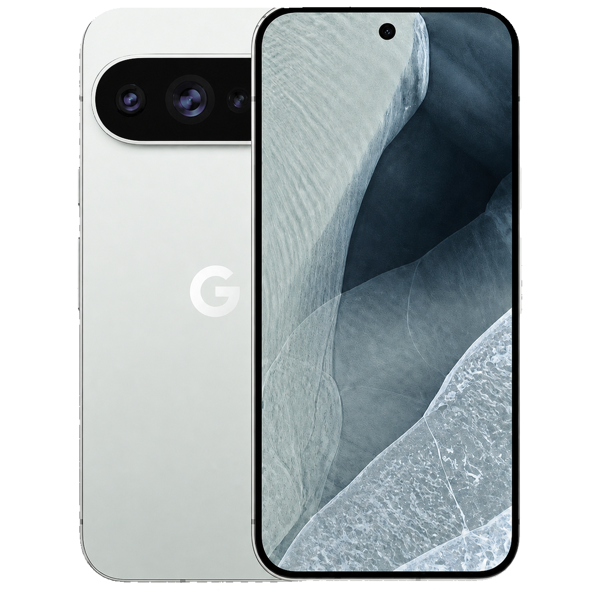
</div>
<div class="card-content">
<div class="hallmark">GOOGLE · PIXEL FLAGSHIP</div>
<h3 class="product-name">Pixel 11 Pro XL</h3>
<div class="specs">
<div class="spec-row"><span class="spec-label">Chip</span><span class="spec-val">Google Tensor G4</span></div>
<div class="spec-row"><span class="spec-label">Sensor</span><span class="spec-val">1/1.31" GNK · Dual 1/2.55"</span></div>
<div class="spec-row"><span class="spec-label">Feature</span><span class="spec-val">Gemini Nano AI Built-in</span></div>
</div>
</div>
<div class="hidden-details" style="display:none;">
<div class="d-brand">GOOGLE // PIXEL 9 PRO XL</div>
<div class="d-title">Pixel 9 Pro XL</div>
<div class="d-why">On-device Gemini plus a 42MP selfie camera — Google's camera phone and AI phone in one this time.</div>
<div class="d-desc">Google’s flagship hardware: Tensor G4, 16GB RAM for on-device Gemini Live, 3000-nit Super Actua display, and an upgraded 42MP selfie camera.</div>
<div class="d-spec" data-label="SoC">Google Tensor G4 (4nm) | Titan M2 Security Coprocessor</div><div class="d-spec" data-label="Memory">16GB LPDDR5X RAM (顶配)</div><div class="d-spec" data-label="Storage">1TB UFS 3.1 SSD (顶配)</div><div class="d-spec" data-label="Display">6.8" Super Actua LTPO OLED (1344x2992) | 1-120Hz | 3000 nits peak | Corning Gorilla Glass Victus 2</div><div class="d-spec" data-label="Camera System">[Main] 50MP Octa PD (1/1.31", f/1.68, OIS) | [Periscope] 48MP Quad PD (5x Optical, 30x Super Res Zoom, OIS) | [Ultrawide] 48MP Quad PD (123° FOV, Macro) | [Front] 42MP Dual PD (103° FOV)</div><div class="d-spec" data-label="Camera Sensors">Main: Samsung GNK / 1/1.31" (50MP, 1.2µm, OIS); 5× Periscope: Sony IMX858 / 1/2.51" (48MP, 5× optical, OIS); Ultrawide: Sony IMX858 / 1/2.51" (48MP, 123°); Front: Sony IMX858 / 1/2.51" (42MP, 103°)</div><div class="d-spec" data-label="Focal Lengths">Native: 12mm / 25mm / 110mm | Sensor crop: 50mm (2× from 50MP main) | Super Res Zoom: up to 30× computational reach</div><div class="d-spec" data-label="Battery">5060mAh | 37W wired fast charging | 23W wireless with Pixel Stand 2 | Qi certified</div><div class="d-spec" data-label="Build">Polished aerospace-grade aluminum frame | Silky matte back glass | IP68 water &amp; dust | 221g | 8.5mm</div><div class="d-spec" data-label="Feature">Gemini Live multimodal AI | Add Me | Magic Editor | Pixel Screenshots | Call Notes | 7 years OS updates</div></div>
</div>
<div class="card" data-brand="google" data-cat="mobile" data-chapter="SMARTPHONES" data-lot="053" data-name="pixel 9 pro fold" data-status="wishlist">
<div class="lot-number">N° 053</div>
<div class="seal wishlist"><span class="dot"></span>WISHLIST</div>
<div class="img-box">
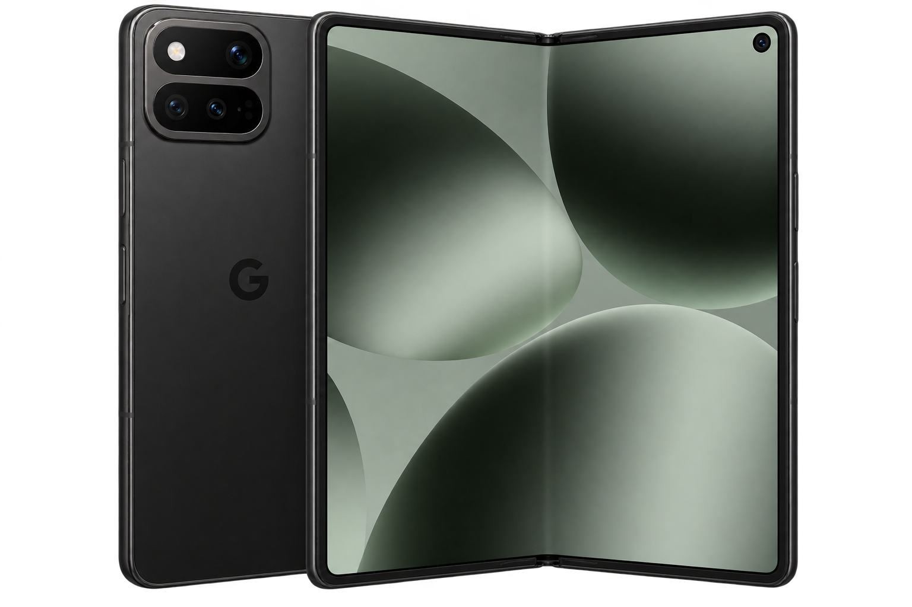
</div>
<div class="card-content">
<div class="hallmark">GOOGLE · FOLDABLE FLAGSHIP</div>
<h3 class="product-name">Pixel 11 Pro Fold</h3>
<div class="specs">
<div class="spec-row"><span class="spec-label">Display</span><span class="spec-val">8.0" Super Actua Flex</span></div>
<div class="spec-row"><span class="spec-label">Chip</span><span class="spec-val">Google Tensor G4</span></div>
<div class="spec-row"><span class="spec-label">Sensor</span><span class="spec-val">1/2" IMX787 · 1/3.2" 5x</span></div>
</div>
</div>
<div class="hidden-details" style="display:none;">
<div class="d-brand">GOOGLE // PIXEL 9 PRO FOLD</div>
<div class="d-title">Pixel 9 Pro Fold</div>
<div class="d-why">Google's vision of the ultimate foldable: an 8.0" square canvas, fluid multi-tasking, Gemini multimodal intelligence, and genuine flagship camera tuning.</div>
<div class="d-desc">Google’s thinnest foldable flagship: 8.0" Super Actua Flex square canvas, fluid multi-tasking, Gemini multimodal intelligence, and IPX8 water resistance.</div>
<div class="d-spec" data-label="SoC">Google Tensor G4 (4nm) | Titan M2 Security Coprocessor</div><div class="d-spec" data-label="Memory">16GB LPDDR5X RAM (顶配)</div><div class="d-spec" data-label="Storage">512GB UFS 3.1 (顶配)</div><div class="d-spec" data-label="Inner Display">8.0" Super Actua Flex LTPO OLED (2076x2152) | 1-120Hz | 2700 nits peak | Ultra Thin Glass</div><div class="d-spec" data-label="Cover Display">6.3" Actua OLED (1080x2424) | 60-120Hz | 2700 nits peak | Corning Gorilla Glass Victus 2</div><div class="d-spec" data-label="Camera System">[Main] 48MP Quad PD (1/2", f/1.7, OIS) | [Telephoto] 10.8MP Dual PD (5x Optical, 20x Super Res Zoom, OIS) | [Ultrawide] 10.5MP (127° FOV, Macro)</div><div class="d-spec" data-label="Camera Sensors">Main: Sony IMX787 (48MP, OIS); 5× Telephoto: Samsung 3J1 (10.8MP, 5× optical, OIS); Ultrawide: Samsung 3LU (10.5MP, 127°); Front &amp; Inner: Dual 10MP Dual PD (f/2.2)</div><div class="d-spec" data-label="Focal Lengths">Native: 12mm / 25mm / 112mm | Sensor crop: 50mm (2× main) | Super Res Zoom: up to 20×</div><div class="d-spec" data-label="Battery">4650mAh | 21W wired fast charging | 7.5W wireless Qi</div><div class="d-spec" data-label="Build">Aerospace-grade high-strength aluminum alloy | Multi-gear fluid hinge | IPX8 water resistance | 257g | 10.5mm folded (5.1mm unfolded)</div><div class="d-spec" data-label="Feature">Split Screen Dual-App Multitasking | Drag and Drop | Gemini Live | 7 years of OS upgrades &amp; Pixel Drops</div></div>
</div>
<div class="card" data-brand="xiaomi" data-cat="mobile" data-chapter="SMARTPHONES" data-lot="010" data-name="mi 9 xiaomi · battle angel xiaomi // battle angel xiaomi" data-status="owned">
<div class="lot-number">N° 010</div>
<div class="seal owned"><span class="dot"></span>OWNED</div>
<div class="img-box">
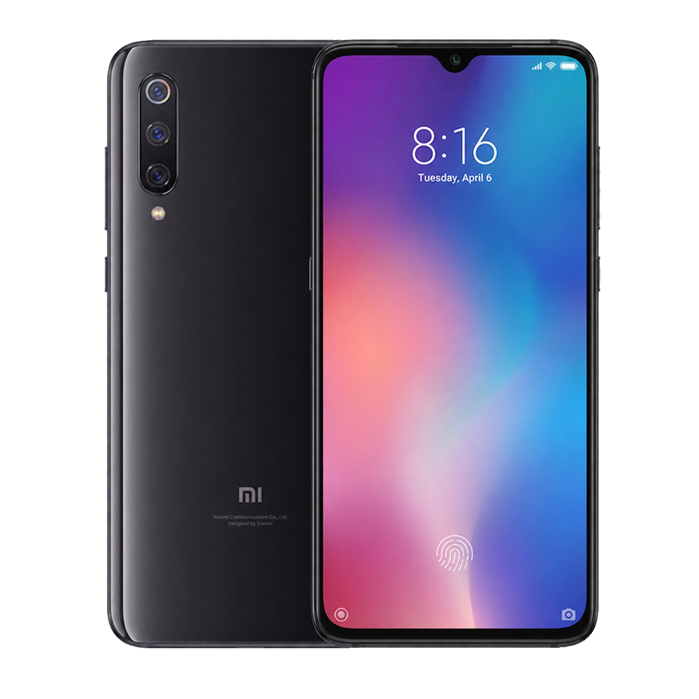
</div>
<div class="card-content">
<div class="hallmark">XIAOMI · BATTLE ANGEL</div>
<h3 class="product-name">Mi 9</h3>
<div class="specs">
<div class="spec-row"><span class="spec-label">Chip</span><span class="spec-val">Snapdragon 855</span></div>
<div class="spec-row"><span class="spec-label">Sensor</span><span class="spec-val">1/2" IMX586 · 48MP</span></div>
<div class="spec-row"><span class="spec-label">Charging</span><span class="spec-val">20W Fast Wireless</span></div>
</div>
</div>
<div class="hidden-details" style="display:none;">
<div class="d-brand">XIAOMI // BATTLE ANGEL</div>
<div class="d-title">Mi 9</div>
<div class="d-why">My OG. First phone to hit 20W wireless, Snapdragon 855, holographic back. She's been through wars.</div>
<div class="d-desc">Known as the "Battle Angel." One of the first phones with the Snapdragon 855, and the first with 20W fast wireless charging, in a holographic glass body.</div>
<div class="d-spec" data-label="SoC">Snapdragon 855 (7nm) | Adreno 640</div>
<div class="d-spec" data-label="Display">6.39" Super AMOLED | 60Hz | HDR10</div>
<div class="d-spec" data-label="Camera System">[Main] 48MP Sony IMX586 | 1/2.0" | f/1.75 | Laser AF<br/>
                        [Telephoto] 12MP Samsung S5K3M5 | 2x Optical Zoom<br/>
                        [Ultrawide] 16MP Sony IMX481 | 117° FOV | 4cm Macro</div>
<div class="d-spec" data-label="Camera Sensors">Main: Sony IMX586 / 1/2.0" (48MP, 0.8µm / 1.6µm 4-in-1, Laser AF); 2× Telephoto: Samsung S5K3M5 / 1/3.6" (12MP, 54mm); Ultrawide: Sony IMX481 / 1/3.0" (16MP, 117°, 4cm macro); Front: Samsung S5K3T1 / 1/3.1" (20MP)</div>
<div class="d-spec" data-label="Focal Lengths">Native: 13mm / 27mm / 54mm | Sensor crop: 54mm (2× main; overlaps the native telephoto)</div>
<div class="d-spec" data-label="Battery &amp; Charging">3300mAh | 27W Wired | 20W Fast Wireless (World's First)</div>
<div class="d-spec" data-label="Build">Holographic Glass Back | Aluminum Frame | Ultra-light 173g</div>
</div>
</div>
<div class="card" data-brand="apple" data-cat="mobile" data-chapter="SMARTPHONES" data-lot="011" data-name="iphone 13 pro max apple · the battery king apple legend apple" data-status="wishlist">
<div class="lot-number">N° 011</div>
<div class="seal wishlist"><span class="dot"></span>WISHLIST</div>
<div class="img-box">
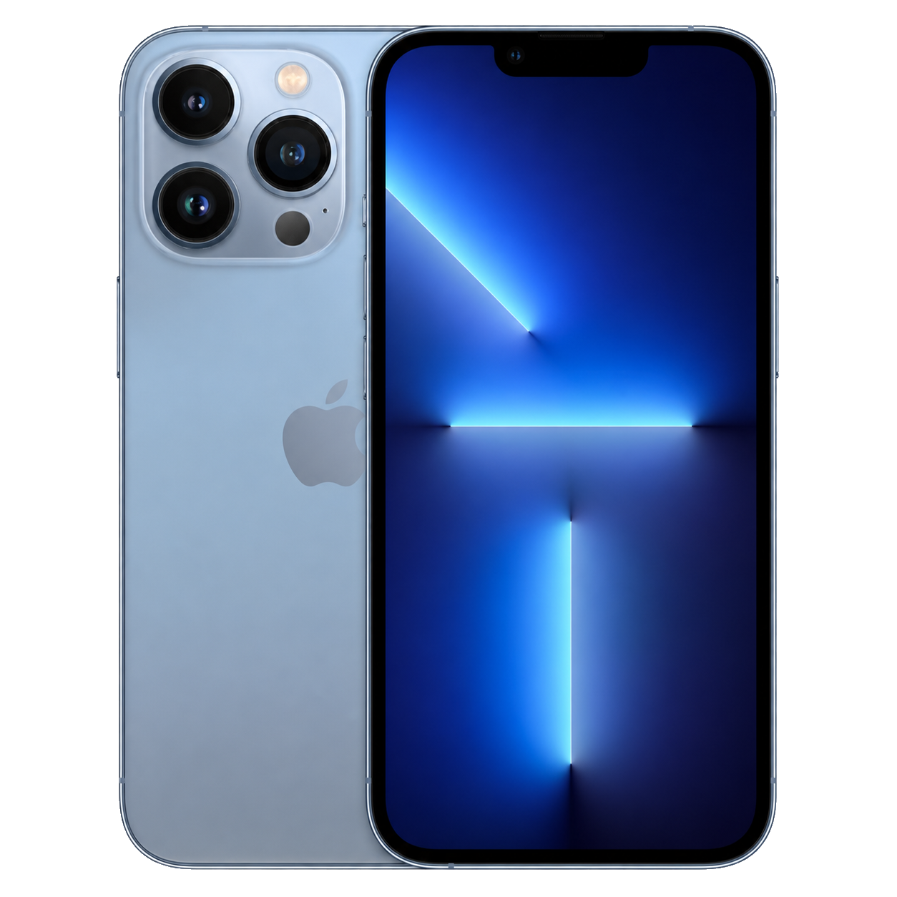
</div>
<div class="card-content">
<div class="hallmark">APPLE · THE BATTERY KING</div>
<h3 class="product-name">iPhone 13 Pro Max</h3>
<div class="specs">
<div class="spec-row"><span class="spec-label">Chip</span><span class="spec-val">A15 Bionic</span></div>
<div class="spec-row"><span class="spec-label">Display</span><span class="spec-val">6.7" 120Hz ProMotion</span></div>
<div class="spec-row"><span class="spec-label">Feature</span><span class="spec-val">Battery King / Macro</span></div>
</div>
</div>
<div class="hidden-details" style="display:none;">
<div class="d-brand">APPLE // THE BATTERY KING</div>
<div class="d-title">iPhone 13 Pro Max</div>
<div class="d-why">First iPhone with 120Hz ProMotion, and the battery life held up.</div>
<div class="d-desc">Introduced the 120Hz ProMotion display to iPhone, with battery life that's still a reference point.</div>
<div class="d-spec" data-label="SoC">A15 Bionic (5nm) | 5-core GPU | 16-core Neural Engine</div>
<div class="d-spec" data-label="Display">6.7" Super Retina XDR OLED | 120Hz ProMotion | 1200 nits peak</div>
<div class="d-spec" data-label="Camera System">[Main] 12MP | 1.9µm pixels | f/1.5 | Sensor-shift OIS<br/>
                        [Telephoto] 12MP | 3x Optical Zoom | 77mm<br/>
                        [Ultrawide] 12MP | f/1.8 | Autofocus &amp; Macro Photography</div>
<div class="d-spec" data-label="Camera Sensors">Main: Sony IMX703 / 1/1.66" (12MP, 1.9µm, 26mm, Sensor-shift OIS); 3× Telephoto: Sony IMX713 / 1/3.5" (12MP, 77mm, OIS); Ultrawide: Sony IMX772 / 1/3.4" (12MP, 13mm, 120°, macro); Front: Sony IMX514 / 1/3.6" (12MP)</div>
<div class="d-spec" data-label="Focal Lengths">Native: 13mm / 26mm / 77mm | Digital crop: 52mm (2× main; software crop rather than a separate telephoto sensor)</div>
<div class="d-spec" data-label="Battery">4352mAh | The undisputed endurance champion of its era</div>
<div class="d-spec" data-label="Build">Surgical-grade Stainless Steel | Ceramic Shield | 240g</div>
<div class="d-spec" data-label="Memory">6GB LPDDR4X RAM</div><div class="d-spec" data-label="Storage">1TB NVMe Storage (顶配)</div></div>
</div>
<div class="card" data-brand="samsung" data-cat="mobile" data-chapter="SMARTPHONES" data-lot="012" data-name="galaxy s21 ultra samsung · galaxy classic design icon samsung" data-status="wishlist">
<div class="lot-number">N° 012</div>
<div class="seal wishlist"><span class="dot"></span>WISHLIST</div>
<div class="img-box">
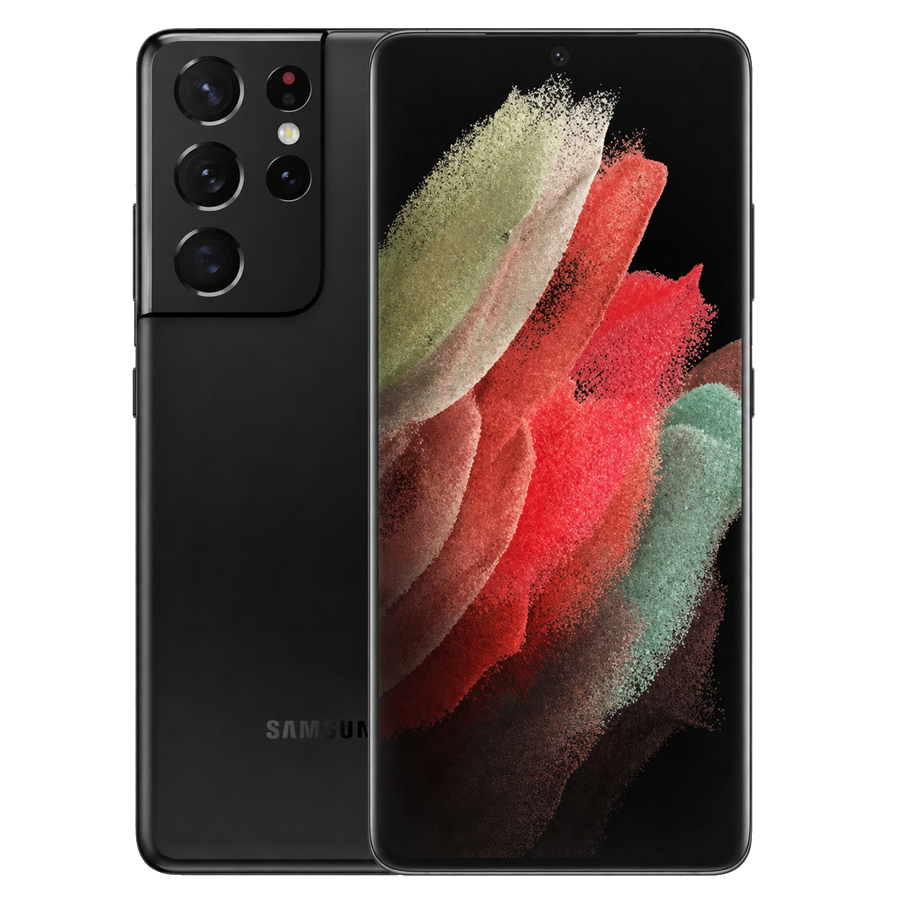
</div>
<div class="card-content">
<div class="hallmark">SAMSUNG · GALAXY CLASSIC</div>
<h3 class="product-name">Galaxy S21 Ultra</h3>
<div class="specs">
<div class="spec-row"><span class="spec-label">Sensor</span><span class="spec-val">1/1.33" HM3 · 108MP</span></div>
<div class="spec-row"><span class="spec-label">Display</span><span class="spec-val">6.8" WQHD+ 120Hz</span></div>
<div class="spec-row"><span class="spec-label">Design</span><span class="spec-val">Contour Cut Housing</span></div>
</div>
</div>
<div class="hidden-details" style="display:none;">
<div class="d-brand">SAMSUNG // GALAXY CLASSIC</div>
<div class="d-title">Galaxy S21 Ultra</div>
<div class="d-why">First phone to bring 108MP and dual telephoto to the mainstream. The specs still hold up.</div>
<div class="d-desc">Known for the Contour Cut camera housing design. Cemented Samsung's zoom lineup with a dual-telephoto system.</div>
<div class="d-spec" data-label="SoC">Snapdragon 888 / Exynos 2100 (5nm)</div>
<div class="d-spec" data-label="Display">6.8" Dynamic AMOLED 2X | WQHD+ | Adaptive 10-120Hz | 1500 nits</div>
<div class="d-spec" data-label="Camera System">[Main] 108MP ISOCELL HM3 | 1/1.33" | Laser AF | OIS<br/>
                        [Periscope] 10MP | 10x Optical | 100x Space Zoom<br/>
                        [Telephoto] 10MP | 3x Optical<br/>
                        [Ultrawide] 12MP | 120° FOV | Dual Pixel AF</div>
<div class="d-spec" data-label="Camera Sensors">Main: Samsung ISOCELL HM3 / 1/1.33" (108MP, 0.8µm, Laser AF, OIS); 10× Periscope: Samsung S5K3I1 / 1/3.24" (10MP, 240mm, Dual Pixel AF, OIS); 3× Telephoto: Samsung S5K3I1 / 1/3.24" (10MP, 72mm, Dual Pixel AF, OIS); Ultrawide: Sony IMX563 / 1/2.55" (12MP, 120°); Front: Samsung S5KGH1 / 1/2.8" (40MP)</div>
<div class="d-spec" data-label="Focal Lengths">Native: 13mm / 24mm / 72mm / 240mm | Sensor crop: 48mm (2× main) | Space Zoom: up to 100× computational reach</div>
<div class="d-spec" data-label="Feature">S-Pen Support (First for S-Series) | Phantom Black Matte Finish</div>
<div class="d-spec" data-label="Battery">5000mAh | 25W Wired | 15W Wireless</div>
<div class="d-spec" data-label="Build">Armor Aluminum frame | Gorilla Glass Victus | IP68 | 227g</div><div class="d-spec" data-label="Memory">16GB LPDDR5 RAM (顶配)</div><div class="d-spec" data-label="Storage">512GB UFS 3.1 (顶配)</div></div>
</div>
<div class="card" data-brand="samsung" data-cat="mobile" data-chapter="SMARTPHONES" data-lot="013" data-name="galaxy s25 ultra" data-status="wishlist">
<div class="lot-number">N° 013</div>
<div class="seal wishlist"><span class="dot"></span>WISHLIST</div>
<div class="img-box">
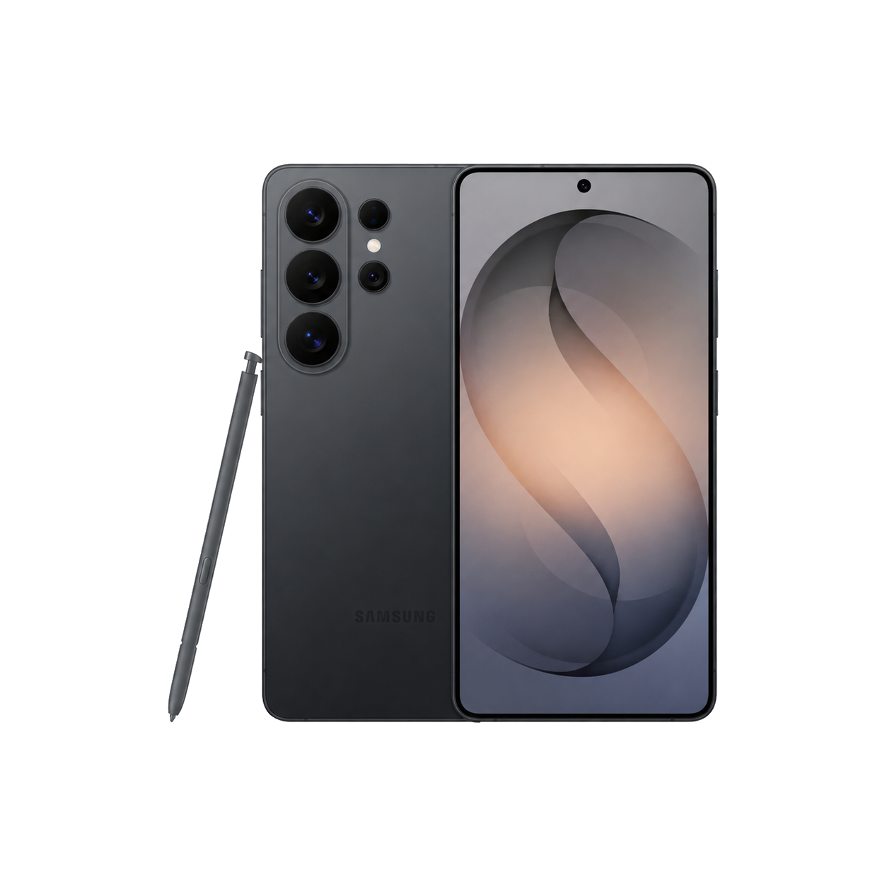
</div>
<div class="card-content">
<div class="hallmark">SAMSUNG · 2025/2026 APEX</div>
<h3 class="product-name">Galaxy S25 Ultra</h3>
<div class="specs">
<div class="spec-row"><span class="spec-label">Chip</span><span class="spec-val">Snapdragon 8 Gen 4</span></div>
<div class="spec-row"><span class="spec-label">Sensor</span><span class="spec-val">1/1.3" HP2 · 1/2.52" 5x</span></div>
<div class="spec-row"><span class="spec-label">Build</span><span class="spec-val">Titanium Armor</span></div>
</div>
</div>
<div class="hidden-details" style="display:none;">
<div class="d-brand">SAMSUNG // 2025/2026 APEX</div>
<div class="d-title">Galaxy S25 Ultra</div>
<div class="d-why">Snapdragon 8 Elite in the thinnest Ultra yet. I want one.</div>
<div class="d-desc">Flat display, Grade 5 titanium frame, Snapdragon 8 Elite for Galaxy running multimodal Galaxy AI.</div>
<div class="d-spec" data-label="SoC">Qualcomm Snapdragon 8 Elite for Galaxy (3nm) | 2x 4.47GHz Prime + 6x 3.53GHz Performance | Adreno 830 GPU</div><div class="d-spec" data-label="Memory">16GB LPDDR5X RAM (顶配)</div><div class="d-spec" data-label="Storage">1TB UFS 4.0 (顶配)</div><div class="d-spec" data-label="Display">6.8" Flat Dynamic AMOLED 2X | QHD+ (3120x1440) | 1-120Hz LTPO | 2600 nits peak | Corning Gorilla Armor 2 (Anti-Reflective)</div><div class="d-spec" data-label="Camera System">[Main] 200MP ISOCELL HP2 (1/1.3", f/1.7, OIS) | [Periscope] 50MP Sony IMX854 (5x Optical, 100x Space Zoom, OIS) | [Telephoto] 10MP Sony IMX754 (3x Optical, OIS) | [Ultrawide] 50MP ISOCELL JN3 (120° FOV, AF Macro)</div><div class="d-spec" data-label="Camera Sensors">Main: Samsung ISOCELL HP2 / 1/1.3" (200MP, 0.6µm, OIS); 5× Periscope: Sony IMX854 / 1/2.52" (50MP, 5× optical, OIS); 3× Telephoto: Sony IMX754 / 1/3.52" (10MP, 3×, OIS); Ultrawide: Samsung ISOCELL JN3 / 1/2.76" (50MP, 120°); Front: Samsung S5K3LU / 1/3.2" (12MP)</div><div class="d-spec" data-label="Focal Lengths">Native: 13mm / 24mm / 67mm / 111mm | Sensor crop: 48mm (2× main) | Space Zoom: up to 100× computational reach</div><div class="d-spec" data-label="Battery">5000mAh | 45W Fast Charging 2.0 | 15W Fast Wireless Charging 2.0 | Wireless PowerShare | Wi-Fi 7 | Bluetooth 5.4</div><div class="d-spec" data-label="Build">Grade 5 Titanium frame | Corning Gorilla Armor 2 front | Gorilla Glass rear | IP68 water &amp; dust | 218g | 8.2mm</div><div class="d-spec" data-label="Feature">Built-in S-Pen | Galaxy AI with Gemini Nano multimodal | ProVisual Engine | 7 years OS &amp; security updates</div></div>
</div>
<div class="card" data-brand="samsung" data-cat="mobile" data-chapter="SMARTPHONES" data-lot="014" data-name="galaxy s25+" data-status="wishlist">
<div class="lot-number">N° 014</div>
<div class="seal wishlist"><span class="dot"></span>WISHLIST</div>
<div class="img-box">
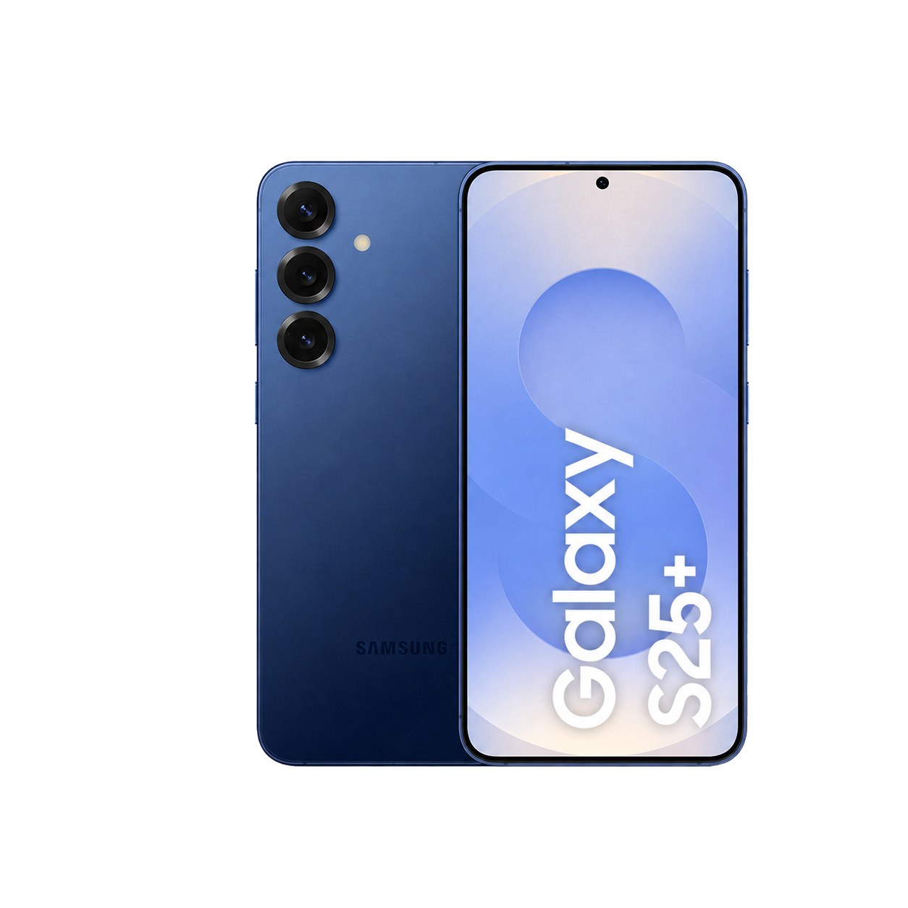
</div>
<div class="card-content">
<div class="hallmark">SAMSUNG · THE SWEET SPOT</div>
<h3 class="product-name">Galaxy S25+</h3>
<div class="specs">
<div class="spec-row"><span class="spec-label">Display</span><span class="spec-val">6.7" WQHD+ Flat</span></div>
<div class="spec-row"><span class="spec-label">Battery</span><span class="spec-val">4900mAh Endurance</span></div>
<div class="spec-row"><span class="spec-label">Chip</span><span class="spec-val">Snapdragon 8 Gen 4</span></div>
</div>
</div>
<div class="hidden-details" style="display:none;">
<div class="d-brand">SAMSUNG // THE SWEET SPOT</div>
<div class="d-title">Galaxy S25+</div>
<div class="d-why">The sweet spot - all the performance, none of the S-Pen bulk. This is what most people actually need.</div>
<div class="d-desc">Same WQHD+ resolution and Snapdragon 8 Elite processor as the Ultra, in a lighter 196g body with 4900mAh battery.</div>
<div class="d-spec" data-label="SoC">Qualcomm Snapdragon 8 Elite for Galaxy (3nm) | 2x 4.47GHz Prime + 6x 3.53GHz Performance | Adreno 830 GPU</div><div class="d-spec" data-label="Memory">12GB LPDDR5X RAM (顶配)</div><div class="d-spec" data-label="Storage">512GB UFS 4.0 (顶配)</div><div class="d-spec" data-label="Display">6.7" Flat Dynamic AMOLED 2X | QHD+ (3120x1440) | 1-120Hz LTPO | 2600 nits peak | Corning Gorilla Glass Victus 2</div><div class="d-spec" data-label="Camera System">[Main] 50MP ISOCELL GN3 (1/1.57", f/1.8, Dual Pixel AF, OIS) | [Telephoto] 10MP (3x Optical, OIS) | [Ultrawide] 12MP (120° FOV, Super Steady)</div><div class="d-spec" data-label="Camera Sensors">Main: Samsung ISOCELL GN3 / 1/1.57" (50MP, 1.0µm, Dual Pixel AF, OIS); 3× Telephoto: Samsung S5K3K1 / 1/3.94" (10MP, 3×, OIS); Ultrawide: Sony IMX564 / 1/2.55" (12MP, 120°); Front: Samsung S5K3LU / 1/3.2" (12MP)</div><div class="d-spec" data-label="Focal Lengths">Native: 13mm / 24mm / 67mm | Sensor crop: 48mm (2× main; optical-quality crop)</div><div class="d-spec" data-label="Battery">4900mAh | 45W Wired Fast Charging | 15W Wireless | Wireless PowerShare | Wi-Fi 7</div><div class="d-spec" data-label="Build">Enhanced Armor Aluminum frame | Corning Gorilla Glass Victus 2 | IP68 water &amp; dust | 196g | 7.3mm thickness</div><div class="d-spec" data-label="Feature">Galaxy AI multimodal suite | Circle to Search | Generative Edit | 7 years OS &amp; security updates</div></div>
</div>
<div class="card" data-brand="apple" data-cat="mobile" data-chapter="SMARTPHONES" data-lot="015" data-name="iphone 17 apple · next gen standard apple ai flagship apple" data-status="wishlist">
<div class="lot-number">N° 015</div>
<div class="seal wishlist"><span class="dot"></span>WISHLIST</div>
<div class="img-box">
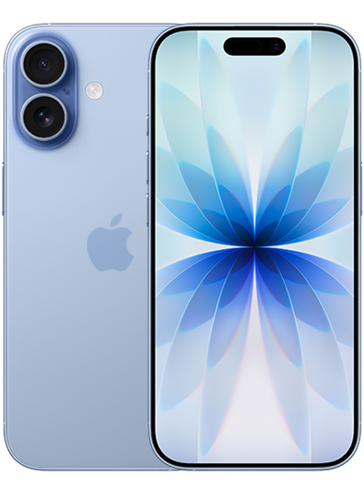
</div>
<div class="card-content">
<div class="hallmark">APPLE · NEXT GEN STANDARD</div>
<h3 class="product-name">iPhone 17</h3>
<div class="specs">
<div class="spec-row"><span class="spec-label">Chip</span><span class="spec-val">A19 (3nm)</span></div>
<div class="spec-row"><span class="spec-label">Sensor</span><span class="spec-val">1/1.56" Fusion · 48MP</span></div>
<div class="spec-row"><span class="spec-label">Feature</span><span class="spec-val">Apple Intelligence</span></div>
</div>
</div>
<div class="hidden-details" style="display:none;">
<div class="d-brand">APPLE // NEXT GEN STANDARD</div>
<div class="d-title">iPhone 17</div>
<div class="d-why">Aluminum frame design leak had me losing sleep. If they bring proper ProMotion to the base model, it's game over.</div>
<div class="d-desc">Runs Apple Intelligence natively, with the display upgrade and camera bump people had been asking for.</div>
<div class="d-spec" data-label="SoC">A19 (3nm process) | 8GB Unified Memory for On-device AI</div>
<div class="d-spec" data-label="Display">6.3" Super Retina XDR | LTPO 120Hz ProMotion (Finally on base model) | Dynamic Island</div>
<div class="d-spec" data-label="Camera System">[Main] 48MP | f/1.6 | Sensor-shift OIS | 2x Optical-quality crop<br/>
                        [Ultrawide] 48MP | Autofocus | Spatial Video Capture<br/>
                        [Front] 24MP Upgraded Selfie Camera</div>
<div class="d-spec" data-label="Camera Sensors">Main: 48MP Sony Fusion / 1/1.56" (1.0µm / 2.0µm 4-in-1, Sensor-shift OIS); Ultrawide: 48MP Sony / 1/2.55" (13mm, 120°); Front: 24MP / 1/3.0" (PDAF)</div>
<div class="d-spec" data-label="Focal Lengths">Native: 13mm / 26mm | Sensor crop: 52mm (2× main sensor, optical-quality crop)</div>
<div class="d-spec" data-label="New Features">Action Button | Camera Control | Native Apple Intelligence</div>
<div class="d-spec" data-label="Build">Aerospace-grade Aluminum | Color-infused Glass</div>
<div class="d-spec" data-label="Battery">3650mAh | 25W wired fast charge | 15W MagSafe | Qi2 wireless</div></div>
</div>
<div class="card" data-brand="xiaomi" data-cat="mobile" data-chapter="SMARTPHONES" data-lot="016" data-name="小米 11 ultra xiaomi · imaging pioneer xiaomi // ultra legend xiaomi" data-status="wishlist">
<div class="lot-number">N° 016</div>
<div class="seal wishlist"><span class="dot"></span>WISHLIST</div>
<div class="img-box">
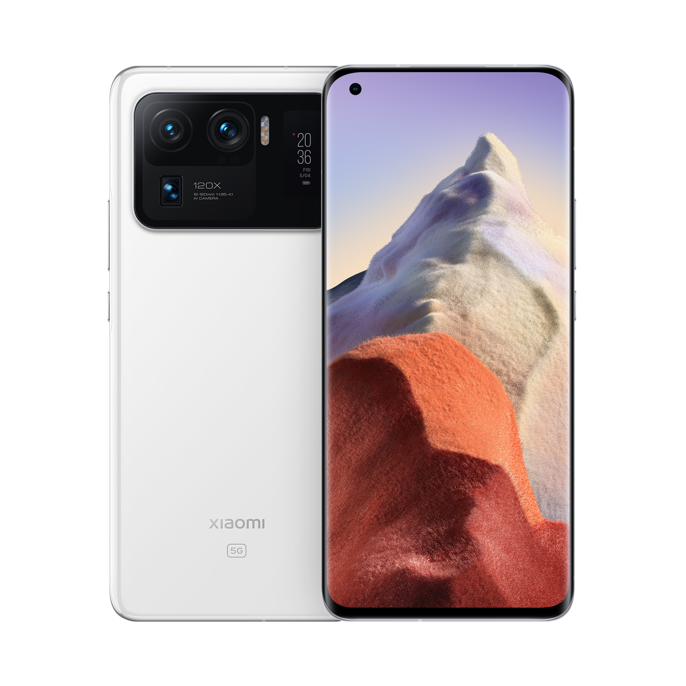
</div>
<div class="card-content">
<div class="hallmark">XIAOMI · IMAGING PIONEER</div>
<h3 class="product-name">小米 11 Ultra</h3>
<div class="specs">
<div class="spec-row"><span class="spec-label">Sensor</span><span class="spec-val">1/1.12" GN2 · Dual IMX586</span></div>
<div class="spec-row"><span class="spec-label">Feature</span><span class="spec-val">Rear Tiny Display</span></div>
<div class="spec-row"><span class="spec-label">Build</span><span class="spec-val">Ceramic Body</span></div>
</div>
</div>
<div class="hidden-details" style="display:none;">
<div class="d-brand">XIAOMI // IMAGING PIONEER</div>
<div class="d-title">Xiaomi 11 Ultra</div>
<div class="d-why"></div>
<div class="d-desc">One of the largest camera sensors in a phone at the time, plus a rear display for selfies shot with the main camera.</div>
<div class="d-spec" data-label="SoC">Snapdragon 888 | LPDDR5 | UFS 3.1</div>
<div class="d-spec" data-label="Display">6.81" 2K AMOLED | 120Hz | 1700 nits | E4 Material</div>
<div class="d-spec" data-label="Camera System">[Main] 50MP GN2 (1/1.12") | f/1.95 | OIS<br/>
                        [Periscope] 48MP IMX586 | 5x Optical | 120x Digital | OIS<br/>
                        [Ultrawide] 48MP IMX586 | 128° FOV</div>
<div class="d-spec" data-label="Camera Sensors">Main: Samsung ISOCELL GN2 (S5KGN2) / 1/1.12" (50MP, 1.4µm / 2.8µm 4-in-1, 8P, Dual Pixel Pro, OIS, dToF); Periscope: Sony IMX586 / 1/2.0" (48MP, 5× optical / 120× digital, OIS); Ultrawide: Sony IMX586 / 1/2.0" (48MP, 128° FOV, 12mm); Front: Samsung S5K3T2 / 1/3.4" (20MP)</div>
<div class="d-spec" data-label="Focal Lengths">Native: 12mm / 24mm / 120mm | Sensor crop: 48mm (2× main) | Hybrid reach: 240mm+ toward the 120× mode</div>
<div class="d-spec" data-label="Battery">5000mAh Silicon-Oxygen Anode | 67W Wired | 67W Wireless</div>
<div class="d-spec" data-label="Build">Ceramic body | 234g | IP68</div>
<div class="d-spec" data-label="Memory">12GB LPDDR5 RAM (顶配)</div><div class="d-spec" data-label="Storage">512GB UFS 3.1 (顶配)</div></div>
</div>
<div class="card" data-brand="xiaomi" data-cat="mobile" data-chapter="SMARTPHONES" data-lot="051" data-name="小米 11 pro xiaomi · android king xiaomi // gn2 flagship xiaomi" data-status="wishlist">
<div class="lot-number">N° 051</div>
<div class="seal wishlist"><span class="dot"></span>WISHLIST</div>
<div class="img-box">
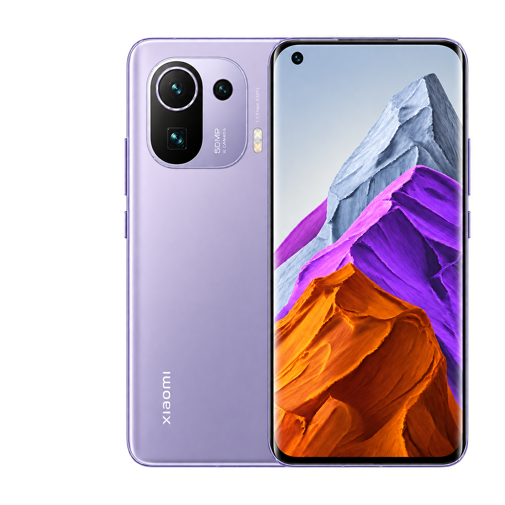
</div>
<div class="card-content">
<div class="hallmark">XIAOMI · ANDROID KING</div>
<h3 class="product-name">小米 11 Pro</h3>
<div class="specs">
<div class="spec-row"><span class="spec-label">Sensor</span><span class="spec-val">1/1.12" GN2 · 50MP</span></div>
<div class="spec-row"><span class="spec-label">Display</span><span class="spec-val">6.81" 2K 120Hz E4</span></div>
<div class="spec-row"><span class="spec-label">Design</span><span class="spec-val">Dream Purple · IP68</span></div>
</div>
</div>
<div class="hidden-details" style="display:none;">
<div class="d-brand">XIAOMI // ANDROID KING</div>
<div class="d-title">Xiaomi 11 Pro</div>
<div class="d-why">The "King of Android" defined by its massive 1/1.12" Samsung GN2 sensor, 67W dual fast charge, and elegant dream purple quad-curved finish.</div>
<div class="d-desc">Known as the "King of Android" (安卓机皇), Xiaomi 11 Pro pairs the super-large 1/1.12" GN2 main camera and 50× periscope zoom with a 2K 120Hz E4 quad-curved display and IP68 water resistance.</div>
<div class="d-spec" data-label="SoC">Qualcomm Snapdragon 888 (5nm) | Adreno 660 | LPDDR5 6400Mbps + UFS 3.1</div>
<div class="d-spec" data-label="Display">6.81" Quad-Curved AMOLED | 3200×1440 2K WQHD+ | 120Hz | 480Hz Touch | 1700 nits Peak | Samsung E4 | Gorilla Glass Victus</div>
<div class="d-spec" data-label="Camera System">[Main] 50MP Samsung ISOCELL GN2 | 1/1.12" | f/1.95 | 8P | OIS | Dual Pixel Pro<br/>
                        [Periscope] 8MP OmniVision OV08A10 | 5× Optical Zoom | 50× Digital | OIS<br/>
                        [Ultrawide] 13MP OmniVision OV13B10 | 123° FOV | f/2.4<br/>
                        [Front] 20MP Samsung S5K3T2 | f/2.2</div>
<div class="d-spec" data-label="Camera Sensors">Main: Samsung ISOCELL GN2 (S5KGN2) / 1/1.12" (1.4µm native, 2.8µm 4-in-1); Periscope: OmniVision OV08A10 / 1/4.4"; Ultrawide: OmniVision OV13B10 / 1/3.06"; Front: Samsung S5K3T2 / 1/3.4"</div>
<div class="d-spec" data-label="Focal Lengths">Native: 16mm (ultrawide) / 24mm (main) / 120mm (5× periscope) | Sensor crop: 48mm (2× main) | Hybrid zoom reach to 50×</div>
<div class="d-spec" data-label="Design &amp; Styling">Style: AG Frosted Quad-Curved Glass | Dream Purple (幻境紫) | Stepped squircle camera DECO with CD-textured metal collar ring | Aluminum alloy middle frame | IP68 dust/water resistant | 208g | 8.53mm</div>
<div class="d-spec" data-label="Battery &amp; Charging">5000mAh MTW Silicon-Oxygen Anode single cell | 67W wired fast charge | 67W wireless fast charge (100% in 36m) | 10W reverse wireless</div>
<div class="d-spec" data-label="Audio &amp; Haptics">Harman Kardon tuned stereo dual speakers | Hi-Res &amp; Hi-Res Wireless Audio | X-axis linear vibration motor | IR blaster</div>
<div class="d-spec" data-label="Build">Quad-curved Corning Gorilla Glass Victus | Metal middle frame | IP68 | 208g</div></div>
</div>
<div class="card" data-brand="xiaomi" data-cat="mobile" data-chapter="SMARTPHONES" data-lot="017" data-name="小米 17 xiaomi · leica optics xiaomi // compact flagship xiaomi" data-status="wishlist">
<div class="lot-number">N° 017</div>
<div class="seal wishlist"><span class="dot"></span>WISHLIST</div>
<div class="img-box">
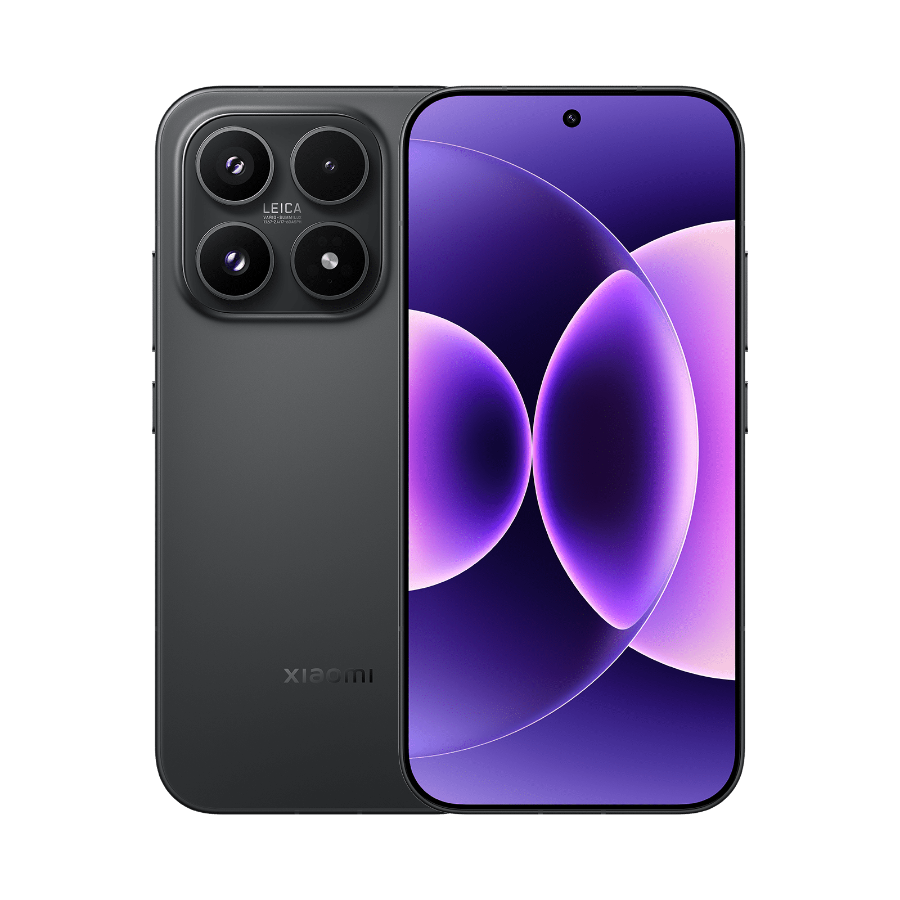
</div>
<div class="card-content">
<div class="hallmark">XIAOMI · LEICA OPTICS</div>
<h3 class="product-name">小米 17</h3>
<div class="specs">
<div class="spec-row"><span class="spec-label">Display</span><span class="spec-val">6.36" LTPO OLED</span></div>
<div class="spec-row"><span class="spec-label">Sensor</span><span class="spec-val">1/1.28" Light Fusion 950</span></div>
<div class="spec-row"><span class="spec-label">Battery</span><span class="spec-val">5400mAh</span></div>
<div class="spec-row"><span class="spec-label">Charging</span><span class="spec-val">90W Wired + 50W Wireless</span></div>
</div>
</div>
<div class="hidden-details" style="display:none;">
<div class="d-brand">XIAOMI // LEICA OPTICS</div>
<div class="d-title">Xiaomi 17</div>
<div class="d-why">A compact Leica flagship built around fast performance, a bright LTPO panel, and a versatile triple-camera system.</div>
<div class="d-desc">Xiaomi 17 brings a ceramic body, Leica-tuned imaging, and all-day battery life into a compact flagship form.</div>
<div class="d-spec" data-label="SoC">Snapdragon 8 Elite Gen 5 | 16GB LPDDR5X | UFS 4.1</div>
<div class="d-spec" data-label="Display">6.36" LTPO OLED | 1-120Hz | 3200 nits</div>
<div class="d-spec" data-label="Camera System">[Main] 50MP Light Fusion 950 | 23mm | OIS<br/>
                        [Telephoto] 50MP Floating Lens | 60mm | OIS<br/>
                        [Ultrawide] 50MP | 14mm | 115° FOV</div>
<div class="d-spec" data-label="Camera Sensors">Main: Xiaomi Light Fusion 950 / 1/1.28" (50MP, 1.2µm, 23mm, OIS); Floating Telephoto: Samsung ISOCELL JN5 / 1/2.76" (50MP, 60mm, 10cm macro, OIS); Ultrawide: Samsung ISOCELL JN1 / 1/2.76" (50MP, 14mm, 115°); Front: OmniVision OV32B40 / 1/3.14" (32MP)</div>
<div class="d-spec" data-label="Focal Lengths">Native: 14mm / 23mm / 60mm | Main-sensor crop modes: 28mm / 35mm / 46mm (2×)</div>
<div class="d-spec" data-label="Battery &amp; Charging">5400mAh High-Density Battery | 90W Wired | 50W Wireless</div>
<div class="d-spec" data-label="Build">Ceramic Body | Dragon Crystal Glass</div>
</div>
</div>
<div class="card" data-brand="xiaomi" data-cat="mobile" data-chapter="SMARTPHONES" data-lot="018" data-name="小米 17 pro max xiaomi · the current king xiaomi // 2026 apex xiaomi" data-status="wishlist">
<div class="lot-number">N° 018</div>
<div class="seal wishlist"><span class="dot"></span>WISHLIST</div>
<div class="img-box">
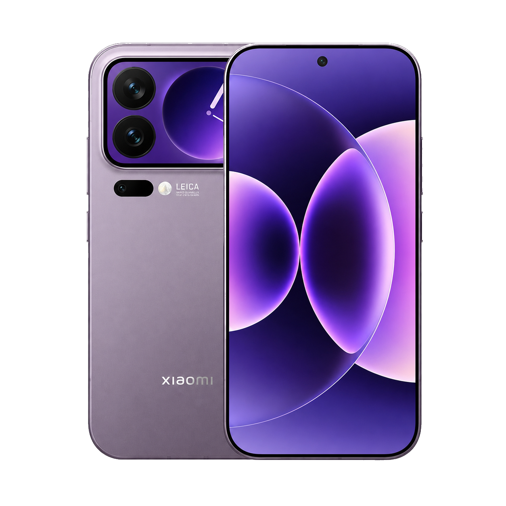
</div>
<div class="card-content">
<div class="hallmark">XIAOMI · THE CURRENT KING</div>
<h3 class="product-name">小米 17 Pro Max</h3>
<div class="specs">
<div class="spec-row"><span class="spec-label">Chip</span><span class="spec-val">Snapdragon 8 Gen 5</span></div>
<div class="spec-row"><span class="spec-label">Sensor</span><span class="spec-val">1.0" LYT-900 · 1/2.51" 5x</span></div>
<div class="spec-row"><span class="spec-label">Power</span><span class="spec-val">120W / 80W Wireless</span></div>
</div>
</div>
<div class="hidden-details" style="display:none;">
<div class="d-brand">XIAOMI // THE CURRENT KING</div>
<div class="d-title">Xiaomi 17 Pro Max</div>
<div class="d-why"></div>
<div class="d-desc">Released late 2025, this flagship pairs a Leica triple-camera system with a 5x periscope and a rear secondary display.</div>
<div class="d-spec" data-label="SoC">Snapdragon 8 Gen 5 (2nm) | 24GB LPDDR6 | 1TB UFS 4.1</div>
<div class="d-spec" data-label="Display">6.73" All-Around Micro-Curved | 2K+ | 240Hz | 4500 nits</div>
<div class="d-spec" data-label="Camera System">[Main] 50MP Light Hunter 950L | 23mm | OIS<br/>
                         [Periscope] 50MP Samsung GN8 | 115mm | 5x Optical | OIS<br/>
                         [Ultrawide] 50MP | 17mm | 102° FOV</div>
<div class="d-spec" data-label="Camera Sensors">Main: Sony LYT-900 / 1.0" (50MP, 1.6µm / 3.2µm 4-in-1, 23mm, OIS); 5× Periscope: Sony IMX858 / 1/2.51" (50MP, 115mm, OIS); Ultrawide: OmniVision OV50M / 1/2.88" (50MP, 17mm); Front: Sony IMX858 / 1/2.51" (50MP)</div>
<div class="d-spec" data-label="Focal Lengths">Native: 17mm / 23mm / 115mm | Sensor crop: 46mm (2× main) | Hybrid reach: ~230mm (2× telephoto)</div>
<div class="d-spec" data-label="Build">Full Nano-tech Ceramic Unibody | Dragon Crystal Glass 3.0</div>
<div class="d-spec" data-label="Battery">6200mAh Solid-State Battery | 120W Wired | 80W Wireless</div>
</div>
</div>
<div class="card" data-brand="apple" data-cat="mobile" data-chapter="SMARTPHONES" data-lot="019" data-name="iphone 11 apple · legacy apple classic apple" data-status="owned">
<div class="lot-number">N° 019</div>
<div class="seal owned"><span class="dot"></span>OWNED</div>
<div class="img-box">
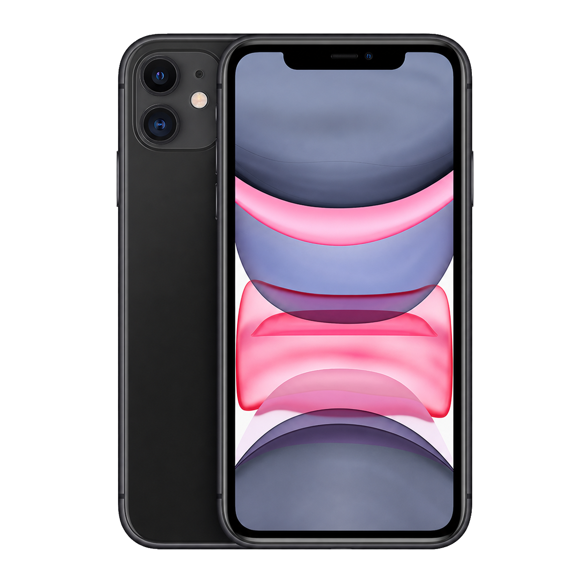
</div>
<div class="card-content">
<div class="hallmark">APPLE · LEGACY</div>
<h3 class="product-name">iPhone 11</h3>
<div class="specs">
<div class="spec-row"><span class="spec-label">Chip</span><span class="spec-val">A13 Bionic</span></div>
<div class="spec-row"><span class="spec-label">Display</span><span class="spec-val">6.1" Liquid Retina</span></div>
<div class="spec-row"><span class="spec-label">Sensor</span><span class="spec-val">1/2.55" IMX503 · 12MP</span></div>
</div>
</div>
<div class="hidden-details" style="display:none;">
<div class="d-brand">APPLE // LEGACY</div>
<div class="d-title">iPhone 11</div>
<div class="d-why">My first iPhone. Night Mode changed how I shoot after dark. Still running smooth after all these years.</div>
<div class="d-desc">Set a new standard at the time for battery life and dual-camera systems on iPhone.</div>
<div class="d-spec" data-label="SoC">A13 Bionic (7nm+) | 6-core CPU | 4-core GPU</div>
<div class="d-spec" data-label="Display">6.1" Liquid Retina IPS LCD | 625 nits | True Tone</div>
<div class="d-spec" data-label="Camera System">[Main] 12MP | 1/2.55" | f/1.8 | Dual Pixel PDAF | OIS<br/>
                        [Ultrawide] 12MP | 120° FOV | f/2.4</div>
<div class="d-spec" data-label="Camera Sensors">Main: Sony IMX503 / 1/2.55" (12MP, 1.4µm, 26mm, 100% Focus Pixels, OIS); Ultrawide: Sony IMX372 / 1/3.6" (12MP, 13mm, 120°); Front: Sony IMX514 / 1/3.6" (12MP)</div>
<div class="d-spec" data-label="Focal Lengths">Native: 13mm / 26mm | Digital crop: 52mm (2× main; no separate telephoto sensor)</div>
<div class="d-spec" data-label="Feature">Face ID | IP68 Water Resistance | Night Mode</div>
<div class="d-spec" data-label="Battery">3110 mAh | 18W Wired Charging | Qi Wireless</div>
<div class="d-spec" data-label="Build">Aerospace-grade 7000-series aluminum | Dual-ion glass | IP68 (2m 30min) | 194g</div></div>
</div>
<div class="card" data-brand="realme" data-cat="mobile" data-chapter="SMARTPHONES" data-lot="020" data-name="realme 11 pro+ realme · premium mid-range realme design realme" data-status="wishlist">
<div class="lot-number">N° 020</div>
<div class="seal wishlist"><span class="dot"></span>WISHLIST</div>
<div class="img-box">
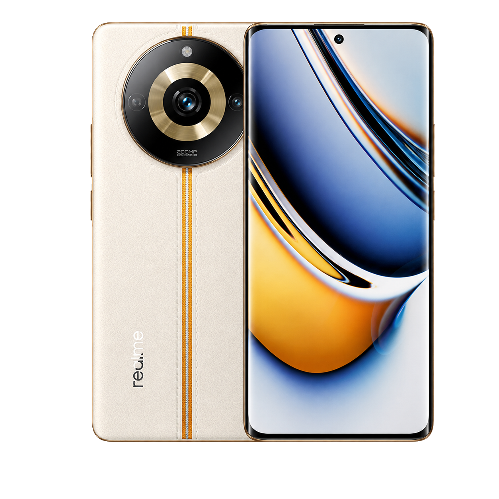
</div>
<div class="card-content">
<div class="hallmark">REALME · PREMIUM MID-RANGE</div>
<h3 class="product-name">realme 11 Pro+</h3>
<div class="specs">
<div class="spec-row"><span class="spec-label">Display</span><span class="spec-val">6.7" 120Hz Curved AMOLED</span></div>
<div class="spec-row"><span class="spec-label">Sensor</span><span class="spec-val">1/1.4" HP3 · 200MP OIS</span></div>
<div class="spec-row"><span class="spec-label">Charging</span><span class="spec-val">100W SuperVOOC</span></div>
</div>
</div>
<div class="hidden-details" style="display:none;">
<div class="d-brand">REALME // PREMIUM MID-RANGE</div>
<div class="d-title">realme 11 Pro+</div>
<div class="d-why">A curved OLED display and 200MP sensor at this price is unusual for the segment.</div>
<div class="d-desc">Vegan leather design co-created with former Gucci designer Matteo Menotto, with a 200MP sensor.</div>
<div class="d-spec" data-label="SoC">MediaTek Dimensity 7050 (6nm) | Up to 12GB RAM</div>
<div class="d-spec" data-label="Display">6.7" Curved AMOLED | 120Hz | 1 Billion Colors | 2160Hz PWM</div>
<div class="d-spec" data-label="Camera System">[Main] 200MP Samsung ISOCELL HP3 | f/1.69 | OIS | 4x In-sensor Zoom<br/>
                        [Ultrawide] 8MP | 112° FOV<br/>
                        [Macro] 2MP</div>
<div class="d-spec" data-label="Camera Sensors">Main: Samsung ISOCELL HP3 / 1/1.4" (200MP, 0.56µm / 2.24µm 16-in-1, SuperOIS, 4× in-sensor zoom); Ultrawide: Sony IMX355 / 1/4.0" (8MP, 112°); Macro: GalaxyCore GC02M1 / 1/5.0" (2MP, 4cm); Front: Sony IMX615 / 1/2.74" (32MP)</div>
<div class="d-spec" data-label="Focal Lengths">Native: 15.9mm / 22.9mm | Sensor crops: 45.8mm (2×) / 91.6mm (4× in-sensor zoom) | Macro: 4cm focus distance</div>
<div class="d-spec" data-label="Battery &amp; Charging">5000mAh | 100W SuperVOOC (100% in 26 mins)</div>
<div class="d-spec" data-label="Build">Premium Lychee Vegan Leather | 3D Woven Texture</div>
</div>
</div>
<div class="card" data-brand="samsung" data-cat="mobile" data-chapter="SMARTPHONES" data-lot="021" data-name="galaxy a51 samsung · best seller galaxy essential samsung" data-status="owned">
<div class="lot-number">N° 021</div>
<div class="seal owned"><span class="dot"></span>OWNED</div>
<div class="img-box">
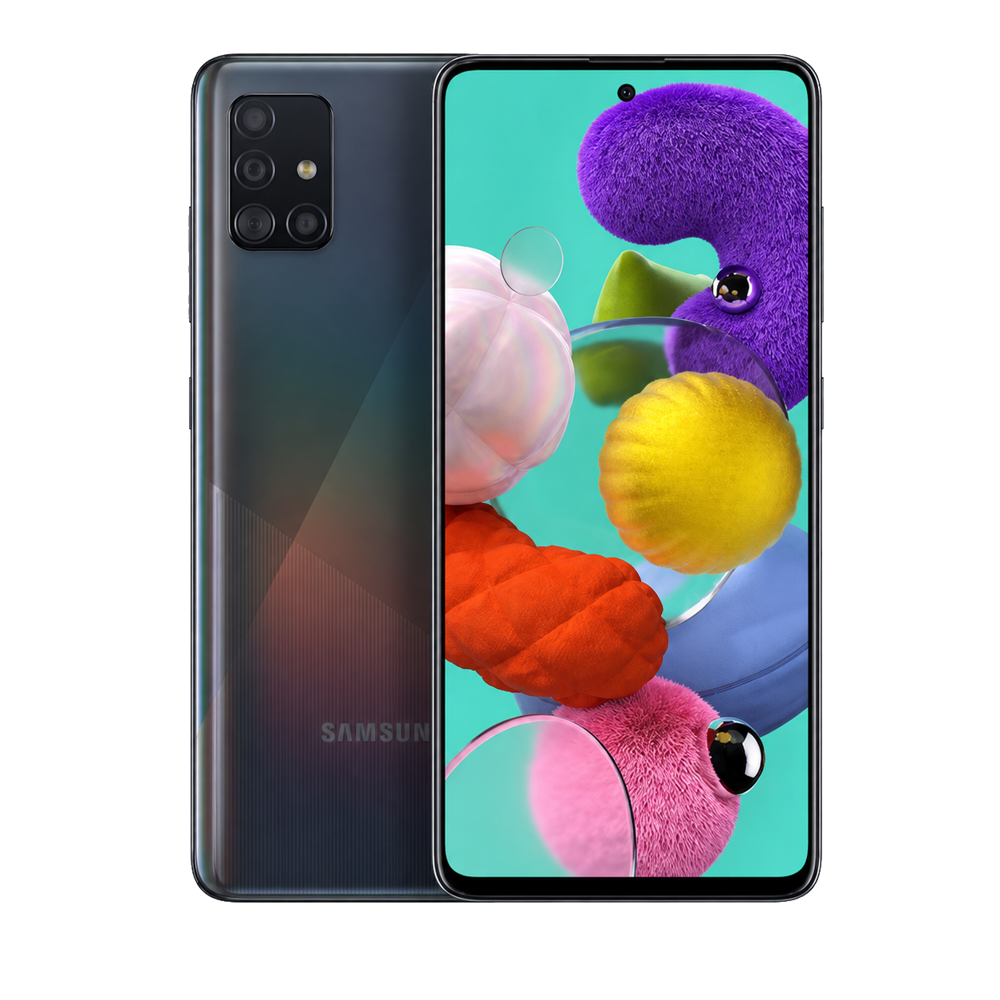
</div>
<div class="card-content">
<div class="hallmark">SAMSUNG · BEST SELLER</div>
<h3 class="product-name">Galaxy A51</h3>
<div class="specs">
<div class="spec-row"><span class="spec-label">Display</span><span class="spec-val">6.5" Super AMOLED</span></div>
<div class="spec-row"><span class="spec-label">Sensor</span><span class="spec-val">1/2.0" GM2 · 48MP Quad</span></div>
<div class="spec-row"><span class="spec-label">Battery</span><span class="spec-val">4000 mAh</span></div>
</div>
</div>
<div class="hidden-details" style="display:none;">
<div class="d-brand">SAMSUNG // BEST SELLER</div>
<div class="d-title">Galaxy A51</div>
<div class="d-why">The phone that introduced me to Samsung's ecosystem. Quad camera mid-ranger done right.</div>
<div class="d-desc">One of the best-selling phones of its era, bringing the Infinity-O display and a quad-camera setup to the mid-range.</div>
<div class="d-spec" data-label="SoC">Exynos 9611 (10nm) | Mali-G72 MP3</div>
<div class="d-spec" data-label="Display">6.5" Super AMOLED | 1080x2400 | Corning Gorilla Glass 3</div>
<div class="d-spec" data-label="Camera System">[Main] 48MP | 1/2.0" | f/2.0 | PDAF<br/>
                        [Ultrawide] 12MP | 123° FOV<br/>
                        [Macro] 5MP | f/2.4<br/>
                        [Depth] 5MP | f/2.2</div>
<div class="d-spec" data-label="Camera Sensors">Main: Samsung ISOCELL GM2 (S5KGM2) / 1/2.0" (48MP, 0.8µm, PDAF); Ultrawide: Samsung S5K3L6 / 1/3.1" (12MP, 123°); Macro: GalaxyCore GC5035 / 1/5.0" (5MP, 40mm); Depth: GalaxyCore GC5035 / 1/5.0" (5MP); Front: Sony IMX616 / 1/2.8" (32MP)</div>
<div class="d-spec" data-label="Focal Lengths">Native: 12mm / 26mm | Macro module: 25mm (Samsung also describes close-up framing as ~40mm) | Sensor crop: 52mm (2× main)</div>
<div class="d-spec" data-label="Battery">4000mAh | 15W Fast Charging</div>
<div class="d-spec" data-label="Feature">Under-display Fingerprint | 3.5mm Headphone Jack</div>
<div class="d-spec" data-label="Build">Glasstic (polycarbonate) 3D curved back | Aluminum frame | 172g | 7.9mm</div></div>
</div>
<div class="card" data-brand="samsung" data-cat="mobile" data-chapter="SMARTPHONES" data-lot="041" data-name="galaxy z fold special edition" data-status="wishlist">
<div class="lot-number">N° 041</div>
<div class="seal wishlist"><span class="dot"></span>WISHLIST</div>
<div class="img-box">
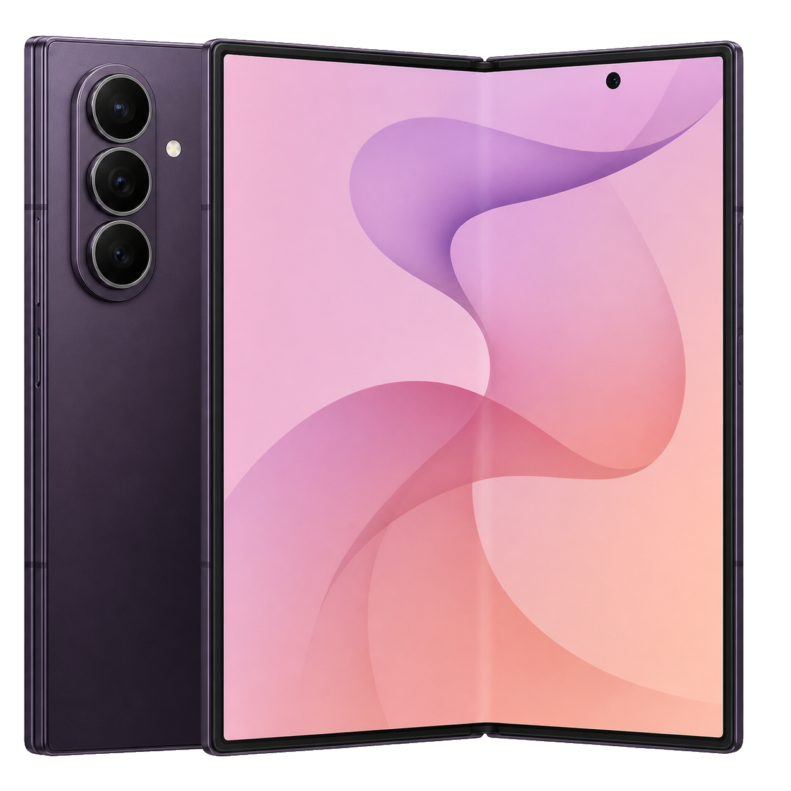
</div>
<div class="card-content">
<div class="hallmark">SAMSUNG · GALAXY Z ULTRA</div>
<h3 class="product-name">Galaxy Z Fold 8 Ultra</h3>
<div class="specs">
<div class="spec-row"><span class="spec-label">Display</span><span class="spec-val">8.0" Dynamic AMOLED 2X</span></div>
<div class="spec-row"><span class="spec-label">Chip</span><span class="spec-val">Snapdragon 8 Elite Gen 5</span></div>
<div class="spec-row"><span class="spec-label">Feature</span><span class="spec-val">Flex Titanium / S Pen</span></div>
</div>
</div>
<div class="hidden-details" style="display:none;">
<div class="d-brand">SAMSUNG // GALAXY Z SPECIAL EDITION</div>
<div class="d-title">Galaxy Z Fold Special Edition</div>
<div class="d-why">A foldable flagship with an 8-inch canvas, thin titanium hardware, and the camera system of an ultra-class phone.</div>
<div class="d-desc">Samsung’s thinnest, widest luxury foldable: 10.6mm ultra-slim chassis, 200MP apex camera sensor, 16GB on-device AI RAM, and expansive 8.0-inch main display.</div>
<div class="d-spec" data-label="SoC">Qualcomm Snapdragon 8 Gen 3 for Galaxy (4nm) | 3.39GHz Cortex-X4</div><div class="d-spec" data-label="Memory">16GB LPDDR5X RAM (顶配，专为 Galaxy AI 扩容)</div><div class="d-spec" data-label="Storage">512GB UFS 4.0 (顶配)</div><div class="d-spec" data-label="Inner Display">8.0" Dynamic AMOLED 2X (20:18 ratio, 2184x1968) | 1-120Hz LTPO | 2600 nits peak | UTG</div><div class="d-spec" data-label="Cover Display">6.5" Dynamic AMOLED 2X (21:9 ratio, 2520x1080) | 1-120Hz LTPO | 2600 nits peak | Gorilla Glass Ceramic</div><div class="d-spec" data-label="Camera System">[Main] 200MP ISOCELL HP2 (1/1.3", f/1.7, OIS) | [Telephoto] 10MP (3x Optical, OIS) | [Ultrawide] 12MP (AF Macro)</div><div class="d-spec" data-label="Camera Sensors">Main: Samsung ISOCELL HP2 / 1/1.3" (200MP, 0.6µm, OIS); 3× Telephoto: Samsung S5K3K1 (10MP, OIS); Ultrawide: 12MP with AF; Cover Front: 10MP</div><div class="d-spec" data-label="Focal Lengths">Native: 12mm / 24mm / 67mm | Sensor crop: 48mm (2× from 200MP) | Space Zoom: up to 30×</div><div class="d-spec" data-label="Battery">4400mAh dual battery | 25W wired fast charge | 15W wireless | Wi-Fi 7</div><div class="d-spec" data-label="Build">Striped patterned craft titanium/glass back | Armor Aluminum frame | IP48 | 236g | 10.6mm folded (4.9mm unfolded)</div><div class="d-spec" data-label="Feature">First 200MP camera in a Samsung foldable | 16GB RAM on-device AI | Wi-Fi 7 | Ultra-wide 21:9 cover screen</div></div>
</div>
<div class="card" data-brand="huawei" data-cat="mobile" data-chapter="SMARTPHONES" data-lot="044" data-name="huawei mate 40 pro+ huawei · mate ultimate huawei // kirin 9000 camera system" data-status="wishlist">
<div class="lot-number">N° 044</div>
<div class="seal wishlist"><span class="dot"></span>WISHLIST</div>
<div class="img-box">
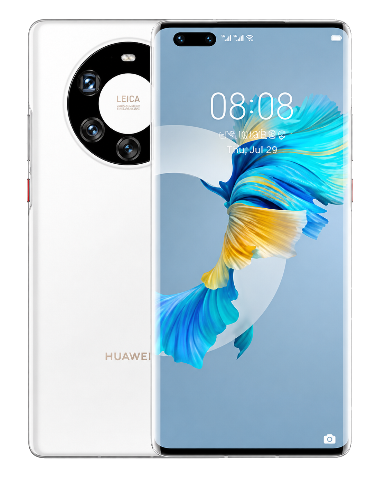
</div>
<div class="card-content">
<div class="hallmark">HUAWEI · MATE ULTIMATE</div>
<h3 class="product-name">Huawei Mate 40 Pro+</h3>
<div class="specs">
<div class="spec-row"><span class="spec-label">SoC</span><span class="spec-val">Kirin 9000 5G</span></div>
<div class="spec-row"><span class="spec-label">Display</span><span class="spec-val">6.76" 90Hz OLED</span></div>
<div class="spec-row"><span class="spec-label">Sensor</span><span class="spec-val">1/1.28" IMX700 RYYB · 50MP</span></div>
</div>
</div>
<div class="hidden-details" style="display:none;">
<div class="d-brand">HUAWEI // MATE ULTIMATE</div>
<div class="d-title">Huawei Mate 40 Pro+</div>
<div class="d-why">The Mate 40 series at its most elaborate: a ceramic-backed flagship with a five-camera system built for every focal length.</div>
<div class="d-desc">Huawei's top Mate 40 model combines the Kirin 9000 5G platform, a 90Hz OLED display, and a five-camera system with dual telephoto lenses.</div>
<div class="d-spec" data-label="SoC">Kirin 9000 5G (5nm) | Mali-G78 GPU</div>
<div class="d-spec" data-label="Display">6.76" OLED | 90Hz | 2772×1344 | Horizon Display</div>
<div class="d-spec" data-label="Camera System">[Main] 50MP Ultra Vision RYYB | OIS<br/>
                        [Cine Ultrawide] 20MP | 120° FOV<br/>
                        [Telephoto] 12MP | 3x Optical | OIS<br/>
                        [SuperZoom] 8MP | 10x Optical-equivalent | OIS<br/>
                        [Depth] 3D ToF Sensor</div>
<div class="d-spec" data-label="Camera Sensors">Main: Sony IMX700 Ultra Vision RYYB / 1/1.28" (50MP, 1.22µm / 2.44µm 4-in-1, OIS); Cine Ultrawide: Sony IMX518 / 1/1.54" (20MP, 14mm, free-form); 3× Telephoto: Sony IMX351 / 1/3.6" (12MP, 70mm, OIS); 10× Periscope: Sony IMX520 / 1/3.6" (8MP, 240mm, OIS); 3D ToF; Front: 13MP / 1/3.06" + 3D ToF</div>
<div class="d-spec" data-label="Focal Lengths">Native: 18mm / 23mm / 70mm / 240mm | Sensor crop: 46mm (2× main)</div>
<div class="d-spec" data-label="Imaging Tech">HUAWEI XD Fusion Pro | Leica color science</div>
<div class="d-spec" data-label="Battery &amp; Charging">4400mAh | 66W Wired | 50W Wireless</div>
<div class="d-spec" data-label="Build">Ceramic Back | IP68 | 234g</div>
</div>
</div>
<div class="card" data-brand="xiaomi" data-cat="mobile" data-chapter="SMARTPHONES" data-lot="054" data-name="mi 10 pro xiaomi · mi flagship xiaomi camera phone 108mp 1/1.33 sensor" data-status="wishlist">
<div class="lot-number">N° 054</div>
<div class="seal wishlist"><span class="dot"></span>WISHLIST</div>
<div class="img-box">
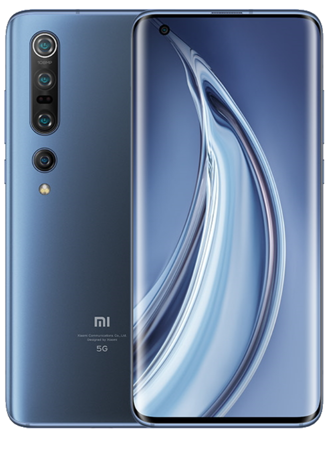
</div>
<div class="card-content">
<div class="hallmark">XIAOMI · MI FLAGSHIP</div>
<h3 class="product-name">Mi 10 Pro</h3>
<div class="specs">
<div class="spec-row"><span class="spec-label">SoC</span><span class="spec-val">Snapdragon 865</span></div>
<div class="spec-row"><span class="spec-label">Display</span><span class="spec-val">6.67" OLED · 90Hz</span></div>
<div class="spec-row"><span class="spec-label">Sensor</span><span class="spec-val">1/1.33" HMX · 108MP OIS</span></div>
</div>
</div>
<div class="hidden-details" style="display:none;">
<div class="d-brand">XIAOMI // MI FLAGSHIP</div>
<div class="d-title">Mi 10 Pro</div>
<div class="d-why">A Snapdragon 865 flagship built around a 108MP primary sensor and a four-camera zoom stack.</div>
<div class="d-desc">A Snapdragon 865-era imaging flagship with a 108MP primary sensor and a four-camera zoom stack.</div>
<div class="d-spec" data-label="SoC">Snapdragon 865 | 8GB LPDDR5 + 256GB UFS 3.0</div>
<div class="d-spec" data-label="Display">6.67" OLED | 2340×1080 FHD+ | 90Hz</div>
<div class="d-spec" data-label="Camera System">[Main] 108MP primary | f/1.69 | OIS | 8P lens<br/>
                        [Telephoto] 8MP | 10× hybrid zoom | OIS<br/>
                        [Portrait] 12MP | 2× optical zoom<br/>
                        [Ultrawide] 20MP | up to 117° FOV<br/>
                        [Front] 20MP</div>
<div class="d-spec" data-label="Camera Sensors">Main: Samsung ISOCELL Bright HMX (S5KHMX) / 1/1.33" (108MP, 0.8µm / 1.6µm 4-in-1, 8P, OIS); 10× Hybrid Tele: OmniVision OV08A10 / 1/4.4" (8MP, OIS); 2× Portrait: Samsung S5K2L7 / 1/2.56" (12MP, 50mm, Dual Pixel AF); Ultrawide: Sony IMX350 / 1/2.78" (20MP, 117°); Front: Samsung S5K3T2 / 1/3.4" (20MP)</div>
<div class="d-spec" data-label="Battery &amp; Charging">4500mAh typical | 50W wired | 30W wireless</div>
<div class="d-spec" data-label="Focal Lengths">Native: 12mm / 25mm / 94mm (3.7×) | Sensor crop: 50mm (2×)</div>
<div class="d-spec" data-label="Build">208g | Glass Back</div>
</div>
</div>
<div class="card" data-brand="xiaomi" data-cat="mobile" data-chapter="SMARTPHONES" data-lot="050" data-name="mi cc9 pro xiaomi mi note 10 pro xiaomi · cc series 108mp samsung hmx camera phone" data-status="wishlist">
<div class="lot-number">N° 050</div>
<div class="seal wishlist"><span class="dot"></span>WISHLIST</div>
<div class="img-box">
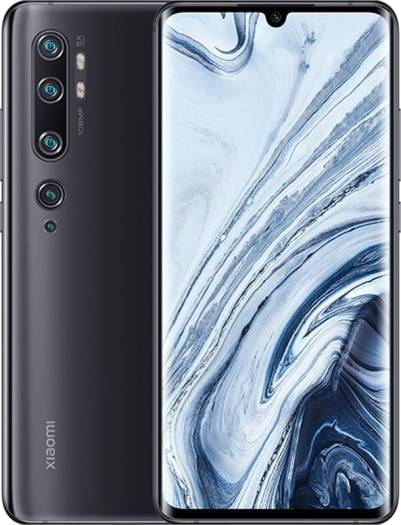
</div>
<div class="card-content">
<div class="hallmark">XIAOMI · CC SERIES</div>
<h3 class="product-name">Mi CC9 Pro</h3>
<div class="specs">
<div class="spec-row"><span class="spec-label">SoC</span><span class="spec-val">Snapdragon 730G</span></div>
<div class="spec-row"><span class="spec-label">Display</span><span class="spec-val">6.47" AMOLED · curved</span></div>
<div class="spec-row"><span class="spec-label">Sensor</span><span class="spec-val">108MP Samsung HMX · 1/1.33" · OIS</span></div>
</div>
</div>
<div class="hidden-details" style="display:none;">
<div class="d-brand">XIAOMI // CC SERIES</div>
<div class="d-title">Mi CC9 Pro / Mi Note 10 Pro</div>
<div class="d-why">The camera-first CC-series phone that brought a 108MP, five-camera stack to Xiaomi's mainstream line.</div>
<div class="d-desc">The China-market Mi CC9 Pro is sold globally as the Mi Note 10 Pro — curved AMOLED body, five camera focal lengths.</div>
<div class="d-spec" data-label="SoC">Qualcomm Snapdragon 730G (8nm) | Adreno 618 | 8GB LPDDR4X</div>
<div class="d-spec" data-label="Display">6.47" curved AMOLED | 2340×1080 FHD+ | HDR10 | Gorilla Glass 5</div>
<div class="d-spec" data-label="Camera System">[Main] 108MP | f/1.69 | OIS<br/>
                        [Periscope] 8MP | 5× optical | OIS<br/>
                        [Portrait] 12MP | 2× optical<br/>
                        [Ultrawide] 20MP | 117° FOV<br/>
                        [Macro] 2MP | [Front] 32MP</div>
<div class="d-spec" data-label="Camera Sensors">Main: Samsung ISOCELL Bright HMX (S5KHMX) / 1/1.33" (108MP, 0.8µm / 1.6µm 4-in-1, 4-axis OIS); 5× Telephoto: OmniVision OV08A10 / 1/4.4" (5MP / 8MP crop, 4-axis OIS); 2× Portrait: Samsung S5K2L7 / 1/2.56" (12MP, 50mm, Dual Pixel AF); Ultrawide: Sony IMX350 / 1/2.8" (20MP, 117°); Macro: GalaxyCore GC02M1 / 1/5.0" (2MP); Front: Samsung S5KGD1 / 1/2.8" (32MP)</div>
<div class="d-spec" data-label="Battery &amp; Charging">5260mAh typical | 30W wired fast charging</div>
<div class="d-spec" data-label="Focal Lengths">Native: 12mm / 25mm / 50mm / 94mm / 125mm (5×)</div>
<div class="d-spec" data-label="Build">208g | curved glass front/back | 3.5mm headphone jack</div>
</div>
</div>
<div class="card" data-brand="oppo" data-cat="mobile" data-chapter="SMARTPHONES" data-lot="046" data-name="oppo find x9 ultra oppo · find ultra camera flagship 200mp sony sensor 1/1.12" data-status="wishlist">
<div class="lot-number">N° 046</div>
<div class="seal wishlist"><span class="dot"></span>WISHLIST</div>
<div class="img-box">
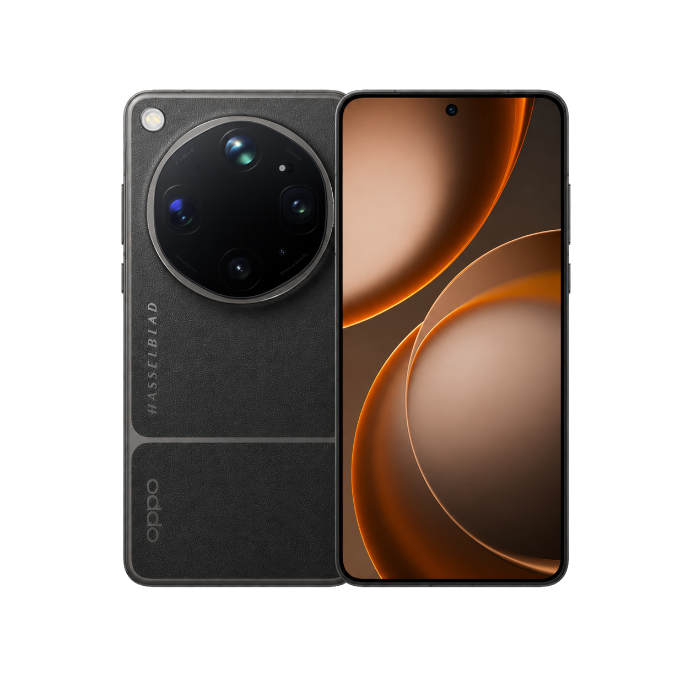
</div>
<div class="card-content">
<div class="hallmark">OPPO · FIND ULTRA</div>
<h3 class="product-name">Find X9 Ultra</h3>
<div class="specs">
<div class="spec-row"><span class="spec-label">SoC</span><span class="spec-val">Snapdragon 8 Elite Gen 5</span></div>
<div class="spec-row"><span class="spec-label">Display</span><span class="spec-val">6.82" QHD+ · 1–120Hz</span></div>
<div class="spec-row"><span class="spec-label">Sensor</span><span class="spec-val">200MP · 1/1.12" Sony</span></div>
</div>
</div>
<div class="hidden-details" style="display:none;">
<div class="d-brand">OPPO // FIND ULTRA</div>
<div class="d-title">Find X9 Ultra</div>
<div class="d-why">An all-focal-length camera flagship built around dual 200MP cameras and a 10× periscope.</div>
<div class="d-desc">A Hasselblad-tuned camera flagship with dual 200MP sensors and a 10x periscope telephoto.</div>
<div class="d-spec" data-label="SoC">Snapdragon 8 Elite Gen 5 | 12GB LPDDR5X + 512GB UFS 4.1</div>
<div class="d-spec" data-label="Display">6.82" AMOLED | QHD+ 3168×1440 | adaptive 1–120Hz (144Hz in supported games)</div>
<div class="d-spec" data-label="Camera System">[Main] 200MP wide | f/1.5 | 2-axis OIS<br/>
                        [Portrait Telephoto] 200MP | 3× optical | f/2.2 | 2-axis OIS<br/>
                        [Ultra Telephoto] 50MP | 10× optical | f/3.5 | 2-axis OIS<br/>
                        [Ultrawide] 50MP | 123° FOV | f/2.0<br/>
                        [Monochrome] 3.2MP | [Front] 50MP AF</div>
<div class="d-spec" data-label="Camera Sensors">Main: Sony LYTIA 900 / 1/1.12" custom (200MP, f/1.5, 2-axis OIS); 3× Portrait Tele: Sony / 1/1.28" (200MP, 2-axis OIS); 10× Tele: Sony / 1/2.75" (50MP, OIS); Ultrawide: Sony / 1/1.95" (50MP, 14mm)</div>
<div class="d-spec" data-label="Battery &amp; Charging">7050mAh typical | 100W SUPERVOOC wired | 50W AIRVOOC wireless</div>
<div class="d-spec" data-label="Focal Lengths">Native: 14mm / 23mm / 65mm / 135mm</div>
<div class="d-spec" data-label="Build">IP68/IP69 | ~225g</div>
</div>
</div>
<div class="card" data-brand="vivo" data-cat="mobile" data-chapter="SMARTPHONES" data-lot="047" data-name="vivo x70 pro vivo · x70 pro camera flagship vivo sony imx766v gimbal sensor" data-status="wishlist">
<div class="lot-number">N° 047</div>
<div class="seal wishlist"><span class="dot"></span>WISHLIST</div>
<div class="img-box">
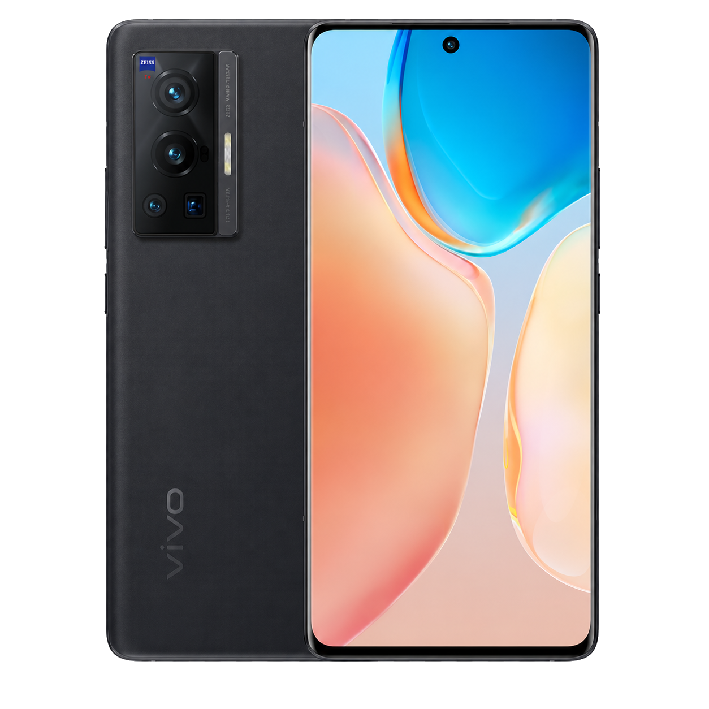
</div>
<div class="card-content">
<div class="hallmark">VIVO · X SERIES</div>
<h3 class="product-name">X70 Pro</h3>
<div class="specs">
<div class="spec-row"><span class="spec-label">SoC</span><span class="spec-val">Dimensity 1200-vivo</span></div>
<div class="spec-row"><span class="spec-label">Display</span><span class="spec-val">6.56" AMOLED · 120Hz</span></div>
<div class="spec-row"><span class="spec-label">Sensor</span><span class="spec-val">1/1.56" IMX766V · 50MP Gimbal</span></div>
</div>
</div>
<div class="hidden-details" style="display:none;">
<div class="d-brand">VIVO // X SERIES</div>
<div class="d-title">X70 Pro</div>
<div class="d-why">A ZEISS-coated camera flagship whose gimbal-stabilized main sensor is the defining feature.</div>
<div class="d-desc">A ZEISS-tuned camera flagship built around a gimbal-stabilized main sensor.</div>
<div class="d-spec" data-label="SoC">MediaTek Dimensity 1200-vivo | 12GB + 256GB</div>
<div class="d-spec" data-label="Display">6.56" E5 AMOLED | 2376×1080 FHD+ | 120Hz</div>
<div class="d-spec" data-label="Camera System">[Main] 50MP Ultra-Sensing Gimbal | f/1.75 | ZEISS T* coating<br/>
                        [Portrait] 12MP | 50mm equivalent | f/1.98<br/>
                        [Ultrawide] 12MP | f/2.2<br/>
                        [Periscope] 8MP OIS | f/3.4<br/>
                        [Front] 32MP | f/2.45</div>
<div class="d-spec" data-label="Camera Sensors">Main: Sony IMX766V / 1/1.56" (50MP, 1.0µm / 2.0µm, Micro-Gimbal OIS, ZEISS T*); Portrait: Sony IMX663 / 1/2.93" (12MP, 50mm, Dual Pixel AF); Ultrawide: Samsung S5K3L6 / 1/3.1" (12MP, 116°); 5× Periscope: OmniVision OV08A10 / 1/4.4" (8MP, 5× optical / 60× zoom, OIS); Front: Samsung S5KGD2 / 1/2.8" (32MP)</div>
<div class="d-spec" data-label="Battery &amp; Charging">4450mAh typical | 44W vivo FlashCharge</div>
<div class="d-spec" data-label="Focal Lengths">Native: 14mm / 23mm / 50mm | ZEISS T* coatings</div>
<div class="d-spec" data-label="Build">IP68 | 185g | Fluorite AG Glass</div>
</div>
</div>
<div class="card" data-brand="oneplus" data-cat="mobile" data-chapter="SMARTPHONES" data-lot="048" data-name="oneplus 9 pro oneplus · hasselblad flagship oneplus sony imx789 imx766 sensor" data-status="wishlist">
<div class="lot-number">N° 048</div>
<div class="seal wishlist"><span class="dot"></span>WISHLIST</div>
<div class="img-box">
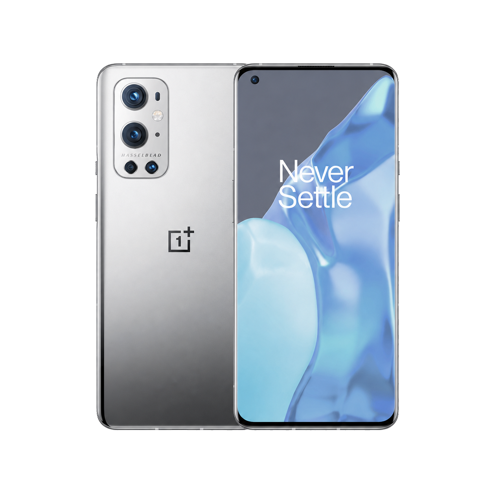
</div>
<div class="card-content">
<div class="hallmark">ONEPLUS · PRO FLAGSHIP</div>
<h3 class="product-name">OnePlus 9 Pro</h3>
<div class="specs">
<div class="spec-row"><span class="spec-label">SoC</span><span class="spec-val">Snapdragon 888 5G</span></div>
<div class="spec-row"><span class="spec-label">Display</span><span class="spec-val">6.7" LTPO OLED · 120Hz</span></div>
<div class="spec-row"><span class="spec-label">Sensor</span><span class="spec-val">Sony IMX789 · 48MP · 1/1.43"</span></div>
</div>
</div>
<div class="hidden-details" style="display:none;">
<div class="d-brand">ONEPLUS // PRO FLAGSHIP</div>
<div class="d-title">OnePlus 9 Pro</div>
<div class="d-why">A Hasselblad-tuned flagship with a custom Sony main sensor and a large IMX766 ultrawide.</div>
<div class="d-desc">A Hasselblad-tuned flagship with a custom Sony IMX789 main sensor and an IMX766 ultrawide.</div>
<div class="d-spec" data-label="SoC">Snapdragon 888 5G | 12GB LPDDR5 + 256GB UFS 3.1</div>
<div class="d-spec" data-label="Display">6.7" Fluid Display 2.0 | LTPO | QHD+ 3216×1440 | Smart 1–120Hz</div>
<div class="d-spec" data-label="Camera System">[Main] 48MP Sony IMX789 | 23mm | f/1.8 | OIS<br/>
                        [Ultrawide] 50MP Sony IMX766 | 14mm | f/2.2 | Freeform lens<br/>
                        [Telephoto] 8MP | 3.3× | 77mm | OIS<br/>
                        [Mono] 2MP | [Front] 16MP</div>
<div class="d-spec" data-label="Camera Sensors">Main: Sony IMX789 / 1/1.43" (48MP, 1.12µm, 23mm, OIS, Omnidirectional PDAF); Ultrawide: Sony IMX766 / 1/1.56" (50MP, 14mm, Freeform); 3.3× Telephoto: OmniVision OV08A10 / 1/4.4" (8MP, 77mm, OIS); Monochrome: GalaxyCore GC02M1B / 1/5.0" (2MP); Front: Sony IMX471 / 1/3.06" (16MP)</div>
<div class="d-spec" data-label="Battery &amp; Charging">4500mAh | 65W Warp Charge wired | 50W Warp Charge wireless</div>
<div class="d-spec" data-label="Focal Lengths">Native: 14mm / 23mm / 77mm | Freeform ultrawide lens</div>
<div class="d-spec" data-label="Build">197g | Morning Mist / Pine Green</div>
</div>
</div>
<div class="card" data-brand="samsung" data-cat="mobile" data-chapter="SMARTPHONES" data-lot="049" data-name="samsung galaxy a72 samsung · galaxy a series samsung midrange 64mp ois camera sensor" data-status="wishlist">
<div class="lot-number">N° 049</div>
<div class="seal wishlist"><span class="dot"></span>WISHLIST</div>
<div class="img-box">
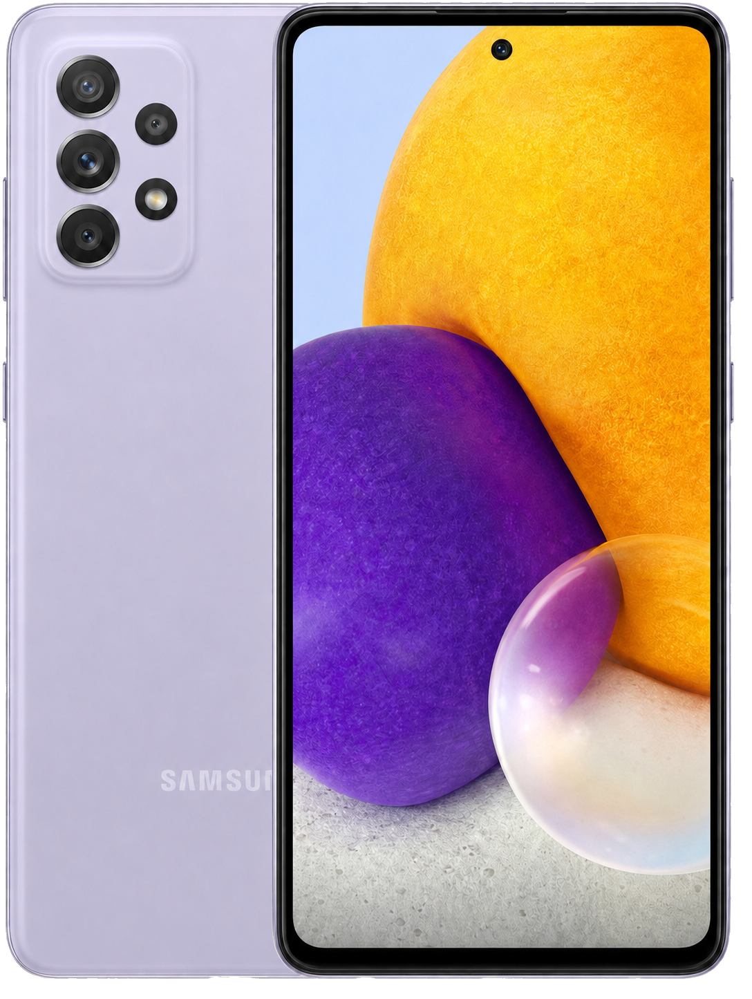
</div>
<div class="card-content">
<div class="hallmark">SAMSUNG · GALAXY A SERIES</div>
<h3 class="product-name">Galaxy A72</h3>
<div class="specs">
<div class="spec-row"><span class="spec-label">SoC</span><span class="spec-val">Snapdragon 720G</span></div>
<div class="spec-row"><span class="spec-label">Display</span><span class="spec-val">6.7" Super AMOLED · 90Hz</span></div>
<div class="spec-row"><span class="spec-label">Sensor</span><span class="spec-val">1/1.7" IMX682 · 64MP OIS</span></div>
</div>
</div>
<div class="hidden-details" style="display:none;">
<div class="d-brand">SAMSUNG // GALAXY A SERIES</div>
<div class="d-title">Galaxy A72</div>
<div class="d-why">A practical Galaxy A-series camera phone with OIS, 3× telephoto, and a large 5000mAh battery.</div>
<div class="d-desc">A practical Galaxy A-series camera phone with OIS, a 3x telephoto lens, and a 5000mAh battery.</div>
<div class="d-spec" data-label="SoC">Qualcomm Snapdragon 720G (SDM720G) | octa-core 2×2.3GHz + 6×1.8GHz | 6/8GB + 128/256GB</div>
<div class="d-spec" data-label="Display">6.7" FHD+ Super AMOLED Infinity-O | 1080×2400 | 90Hz | 800 nits</div>
<div class="d-spec" data-label="Camera System">[Main] 64MP OIS AF | f/1.8 | 0.8µm<br/>
                        [Ultrawide] 12MP | f/2.2 | 1.12µm<br/>
                        [Telephoto] 8MP AF | 3× optical | f/2.4 | 1.0µm<br/>
                        [Macro] 5MP | f/2.4 | 1.12µm<br/>
                        [Front] 32MP | f/2.2 | 0.8µm</div>
<div class="d-spec" data-label="Camera Sensors">Main: Sony IMX682 (or Samsung GW1) / 1/1.7" (64MP, 0.8µm / 1.6µm 4-in-1, OIS); 3× Telephoto: SK Hynix Hi-847 / 1/4.0" (8MP, 3× optical, OIS); Ultrawide: 1/3.0" (12MP, 123°); Macro: 1/5.0" (5MP); Front: Sony IMX616 / 1/2.8" (32MP)</div>
<div class="d-spec" data-label="Battery &amp; Charging">5000mAh typical | 25W fast charging</div>
<div class="d-spec" data-label="Focal Lengths">Native: 12mm / 26mm / 52mm (2×) / 64mm (2.4× main crop)</div>
<div class="d-spec" data-label="Build">203g | Plastic (Glasstic) | IP67</div>
</div>
</div>
<div class="card" data-brand="xiaomi" data-cat="mobile" data-chapter="SMARTPHONES" data-lot="029" data-name="xiaomi 13 ultra xiaomi · leica apex leica apex xiaomi" data-status="wishlist">
<div class="lot-number">N° 029</div>
<div class="seal wishlist"><span class="dot"></span>WISHLIST</div>
<div class="img-box">
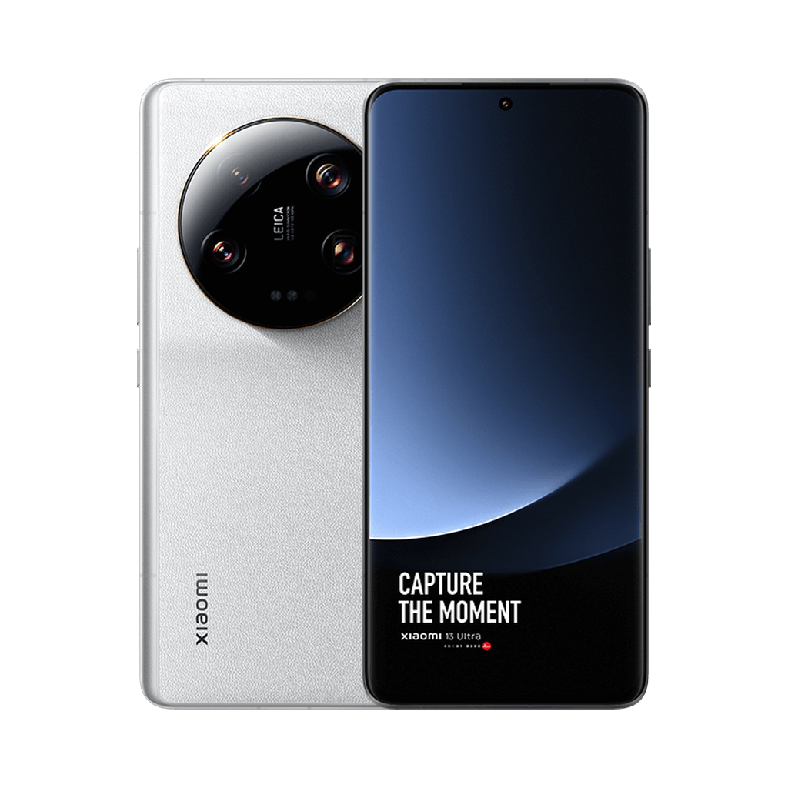
</div>
<div class="card-content">
<div class="hallmark">XIAOMI · LEICA APEX</div>
<h3 class="product-name">Xiaomi 13 Ultra</h3>
<div class="specs">
<div class="spec-row"><span class="spec-label">Chip</span><span class="spec-val">Snapdragon 8 Gen 2</span></div>
<div class="spec-row"><span class="spec-label">Display</span><span class="spec-val">6.73" 120Hz C7 WQHD+</span></div>
<div class="spec-row"><span class="spec-label">Sensor</span><span class="spec-val">1" IMX989 · 可变光圈</span></div>
<div class="spec-row"><span class="spec-label">Camera</span><span class="spec-val">50MP Quad · 全焦段徕卡</span></div>
</div>
</div>
<div class="hidden-details" style="display:none;">
<div class="d-brand">XIAOMI // LEICA APEX</div>
<div class="d-title">Xiaomi 13 Ultra</div>
<div class="d-why">一英寸可变光圈与全焦段大底四摄，溜背蒙皮造型把小米彻底拉入了相机时代。</div>
<div class="d-desc">小米与徕卡联合研发的专业影像旗舰，四颗5000万像素全焦段大光圈镜头，搭载一英寸IMX989物理双档可变光圈与仿相机蒙皮微凸后盖。</div>
<div class="d-spec" data-label="SoC">Snapdragon 8 Gen 2 (4nm) | Adreno 740 | LPDDR5X | UFS 4.0</div>
<div class="d-spec" data-label="Memory">16GB LPDDR5X RAM 8533Mbps (顶配)</div>
<div class="d-spec" data-label="Storage">1TB UFS 4.0 高速闪存 (顶配)</div>
<div class="d-spec" data-label="Display">6.73" C7 AMOLED | 1-120Hz LTPO | 2600 nits peak | WQHD+ (3200×1440) | 12-bit 色深 | 1920Hz 高频 PWM + 类 DC 调光 | Gorilla Glass Victus</div>
<div class="d-spec" data-label="Camera System">[Main] 50MP Sony IMX989 | 1" 超大底 | 8P 镜头 | f/1.9-f/4.0 物理两档可变光圈 | OIS<br/>
                        [Portrait Telephoto] 50MP Sony IMX858 | 3.2× Optical (75mm) | f/1.8 | OIS<br/>
                        [Super Telephoto] 50MP Sony IMX858 | 5× Optical (120mm) | 120× 数码变焦 | f/3.0 | OIS<br/>
                        [Ultrawide] 50MP Sony IMX858 | 12mm 等效 | 122° FOV | f/1.8 | 5cm 超微距</div>
<div class="d-spec" data-label="Camera Sensors">Main: Sony IMX989 / 1.0" (50MP, 1.6µm / 3.2µm 4-in-1, 8P 非球面, OIS, Octa-PD); Telephoto 3.2×: Sony IMX858 / 1/2.51" (50MP, 75mm, f/1.8, OIS); Super Telephoto 5×: Sony IMX858 / 1/2.51" (50MP, 120mm, f/3.0, OIS); Ultrawide: Sony IMX858 / 1/2.51" (50MP, 12mm, f/1.8, AF); Front: OmniVision OV32C / 1/3.14" (32MP, f/2.0)</div>
<div class="d-spec" data-label="Focal Lengths">Native: 12mm / 23mm / 75mm / 120mm | In-sensor zoom: 46mm (2×) / 240mm (10×) | 数码裁切至 120×</div>
<div class="d-spec" data-label="Battery &amp; Charging">5000mAh 单电芯 | 90W 有线澎湃秒充 | 50W Pro 无线秒充 | 10W 无线反向充 | 澎湃 P2 快充芯片 + G1 电源管理芯片</div>
<div class="d-spec" data-label="Build">227g | 第二代科技纳米皮 | 一体化金属中框延伸结构 | 经典相机溜背造型 | IP68 防尘防水</div>
<div class="d-spec" data-label="Feature">Leica 专业影像套装生态 (实体两段快门手柄/67mm滤镜转接环) | 环形冷泵散热架构 | 徕卡经典/生动双画质 | USB 3.2 Gen 1 (DP 视频输出)</div>
</div>
</div>
<div class="card" data-brand="xiaomi" data-cat="mobile" data-chapter="SMARTPHONES" data-lot="055" data-name="xiaomi mix 4 xiaomi · unibody ceramic unibody ceramic cup xiaomi" data-status="wishlist">
<div class="lot-number">N° 055</div>
<div class="seal wishlist"><span class="dot"></span>WISHLIST</div>
<div class="img-box">
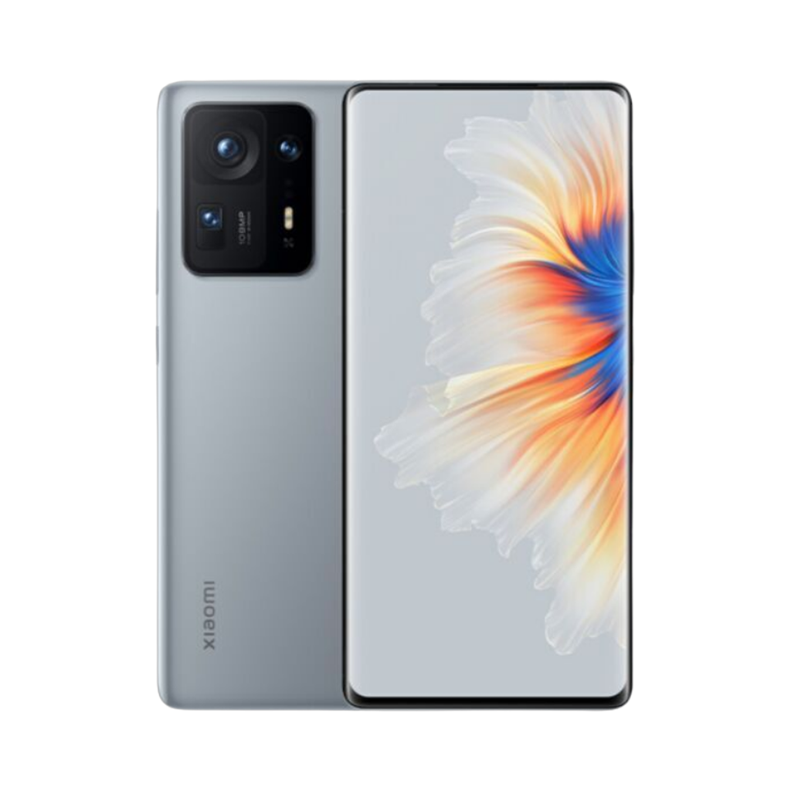
</div>
<div class="card-content">
<div class="hallmark">XIAOMI · UNIBODY CERAMIC</div>
<h3 class="product-name">Xiaomi MIX 4</h3>
<div class="specs">
<div class="spec-row"><span class="spec-label">Chip</span><span class="spec-val">Snapdragon 888+</span></div>
<div class="spec-row"><span class="spec-label">Display</span><span class="spec-val">6.67" CUP 屏下全视屏</span></div>
<div class="spec-row"><span class="spec-label">Sensor</span><span class="spec-val">1/1.33" HMX · 108MP OIS</span></div>
<div class="spec-row"><span class="spec-label">Build</span><span class="spec-val">一体化汝窑温润陶瓷</span></div>
</div>
</div>
<div class="hidden-details" style="display:none;">
<div class="d-brand">XIAOMI // UNIBODY CERAMIC</div>
<div class="d-title">Xiaomi MIX 4</div>
<div class="d-why">Unibody 仿汝窑一体化轻量陶瓷，配合正面无开孔真全面屏，手感温润如玉。</div>
<div class="d-desc">全陶瓷一体化机身工业设计，首发微钻排列 CUP 屏下相机真全面屏，搭载骁龙 888+ 与 120W 有线秒充。</div>
<div class="d-spec" data-label="SoC">Snapdragon 888+ (5nm, Cortex-X1 @ 3.0GHz) | Adreno 660 | LPDDR5 | UFS 3.1</div>
<div class="d-spec" data-label="Memory">12GB LPDDR5 RAM 6400Mbps (顶配)</div>
<div class="d-spec" data-label="Storage">512GB UFS 3.1 高速闪存 (顶配)</div>
<div class="d-spec" data-label="Display">6.67" CUP 屏下微曲 AMOLED | 2400×1080 FHD+ | 120Hz | 480Hz 触控 | 400PPI 微钻排列真全视屏 | 10-bit HDR10+ | Dolby Vision | Gorilla Glass Victus</div>
<div class="d-spec" data-label="Camera System">[Main] 108MP Samsung HMX | 1/1.33" 超大底 | 7P 镜头 | 4 轴 OIS 光学防抖<br/>
                        [Periscope] 8MP 5× 潜望长焦 (120mm) | OIS 光学防抖 | 50× 数码变焦<br/>
                        [Ultrawide] 13MP 自由曲面超广角 (12mm) | 120° FOV | 硬件级低畸变</div>
<div class="d-spec" data-label="Camera Sensors">Main: Samsung ISOCELL HMX / 1/1.33" (108MP, 0.8µm / 1.6µm 4-in-1, 7P, f/1.95, 4 轴 OIS); Periscope: 8MP (5× optical / 50× digital, 120mm, f/4.1, OIS); Ultrawide: 13MP 自由曲面防畸变 (12mm, f/2.2, 120°); Front CUP: 20MP 微钻排列屏下微米相机 (1.6µm 4-in-1)</div>
<div class="d-spec" data-label="Focal Lengths">Native: 12mm / 24mm / 120mm | Sensor crop: 48mm (2×) | 数码变焦至 50×</div>
<div class="d-spec" data-label="Battery &amp; Charging">4500mAh 石墨烯双电芯 | 120W 有线秒充 (疾速 15 分钟满电 / 恒温 21 分钟) | 50W 无线秒充 (疾速 28 分钟满电) | 10W 无线反充</div>
<div class="d-spec" data-label="Build">225g | 高精密轻量化一体全陶瓷 (Unibody Ceramic, 减重 30%) | 影青灰 / 陶瓷黑 / 陶瓷白 (仿汝窑釉色)</div>
<div class="d-spec" data-label="Feature">CUP 真正零挖孔真全面屏 | 自由曲面防畸变超广角镜头 | UWB 一指连空间精准感知定位 | Harman Kardon 联合调校立体声双扬声器</div>
</div>
</div>
<div class="card" data-brand="sony" data-cat="mobile" data-chapter="SMARTPHONES" data-lot="056" data-name="sony xperia 1 v sony · alpha in hand zeiss t optics continuous optical zoom sony" data-status="wishlist">
<div class="lot-number">N° 056</div>
<div class="seal wishlist"><span class="dot"></span>WISHLIST</div>
<div class="img-box">
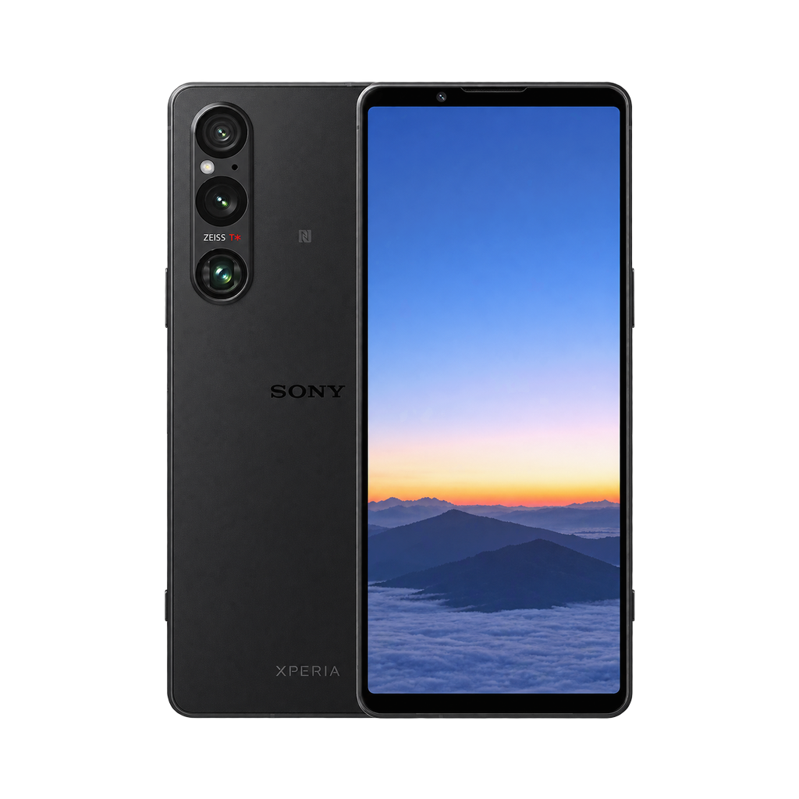
</div>
<div class="card-content">
<div class="hallmark">SONY · ALPHA IN HAND</div>
<h3 class="product-name">Sony Xperia 1 V</h3>
<div class="specs">
<div class="spec-row"><span class="spec-label">Chip</span><span class="spec-val">Snapdragon 8 Gen 2</span></div>
<div class="spec-row"><span class="spec-label">Display</span><span class="spec-val">6.5" 4K 120Hz 21:9 OLED</span></div>
<div class="spec-row"><span class="spec-label">Sensor</span><span class="spec-val">双层晶体管 Exmor T</span></div>
<div class="spec-row"><span class="spec-label">Zoom</span><span class="spec-val">85-125mm 真正连续光变</span></div>
</div>
</div>
<div class="hidden-details" style="display:none;">
<div class="d-brand">SONY // ALPHA IN HAND</div>
<div class="d-title">Sony Xperia 1 V</div>
<div class="d-why">21:9 4K 无开孔带鱼屏与日系棱线防滑微粒，保留实体两段式快门和真连续光学变焦。</div>
<div class="d-desc">索尼日系工业美学旗舰，首发双层晶体管像素 Exmor T 传感器，具备 85-125mm 物理连续光学变焦潜望模组与实体相机快门按键。</div>
<div class="d-spec" data-label="SoC">Snapdragon 8 Gen 2 (4nm) | Adreno 740 | LPDDR5X | UFS 4.0</div>
<div class="d-spec" data-label="Memory">16GB LPDDR5X RAM (顶配)</div>
<div class="d-spec" data-label="Storage">512GB UFS 4.0 (顶配) | 支持 MicroSDXC 免工具插拔扩展最高 1TB</div>
<div class="d-spec" data-label="Display">6.5" 4K HDR OLED (3840×1644, 643 PPI) | 120Hz | 21:9 电影画幅 | 无挖孔对称上下微额头 | X1 for mobile 引擎 | Gorilla Glass Victus 2</div>
<div class="d-spec" data-label="Camera System">[Main] 48MP (有效52MP) 双层晶体管 Exmor T | 24mm | f/1.9 | 蔡司 T* 镀膜 | OIS<br/>
                        [Telephoto] 12MP 物理连续光学变焦 (85mm-125mm, 3.5×-5.2×) | f/2.3-f/2.8 | OIS<br/>
                        [Ultrawide] 12MP Exmor RS | 16mm | f/2.2 | 123° FOV | Dual PD AF<br/>
                        [Shutter] 侧边独立实体两段式机械快门键</div>
<div class="d-spec" data-label="Camera Sensors">Main: Sony Exmor T for mobile / 1/1.35" (48MP 有效, 1.12µm / 2.24µm 4-in-1, 24mm, f/1.9, OIS, 蔡司 Zeiss T* 镀膜); Telephoto: Sony IMX650 / 1/3.5" (12MP, 85-125mm 物理连续光学变焦, f/2.3-f/2.8, OIS); Ultrawide: Sony IMX563 / 1/2.5" (12MP, 16mm, f/2.2); Front: Sony IMX663 / 1/2.9" (12MP, 24mm, f/2.0)</div>
<div class="d-spec" data-label="Focal Lengths">Native: 16mm / 24mm / 85mm-125mm (全域物理连续无级光学变焦) | Sensor crop: 48mm (2× 高画质主摄裁切)</div>
<div class="d-spec" data-label="Battery &amp; Charging">5000mAh 长寿命电池 (Xperia 电池保护技术) | 30W USB PD 快充 | Qi 无线快充与无线电量共享</div>
<div class="d-spec" data-label="Build">187g 极致轻量化 | 71mm 黄金手感宽度 | 棱线防滑微粒金属中框 | 触感微粒磨砂玻璃 | 独立 3.5mm 镀金耳机孔 | IP65/IP68 双重防水</div>
<div class="d-spec" data-label="Feature">实体两段式快门按键 | 85-125mm 物理连续光变 | 独立 3.5mm 无损音频孔 | 全焦段 4K 120fps HDR 录制与眼部追焦 | Alpha 微单监视屏直连</div>
</div>
</div>
<div class="card" data-brand="huawei" data-cat="mobile" data-chapter="SMARTPHONES" data-lot="057" data-name="huawei p60 pro huawei · rococo pearl rococo pearl xmage optics huawei" data-status="wishlist">
<div class="lot-number">N° 057</div>
<div class="seal wishlist"><span class="dot"></span>WISHLIST</div>
<div class="img-box">
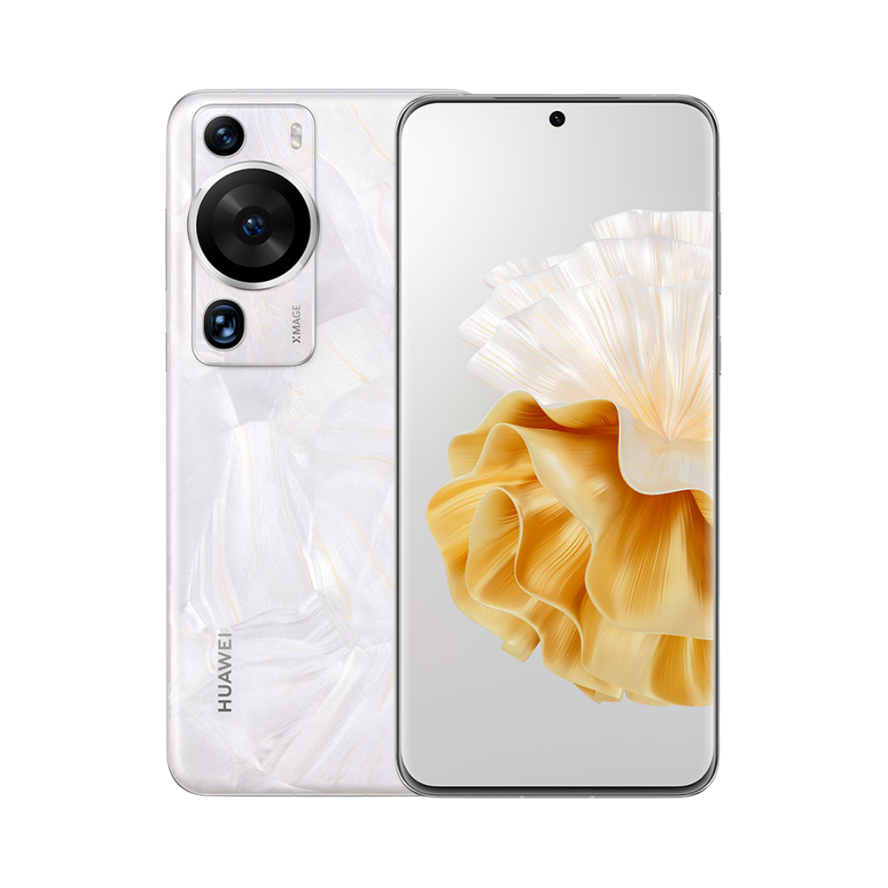
</div>
<div class="card-content">
<div class="hallmark">HUAWEI · ROCOCO PEARL</div>
<h3 class="product-name">Huawei P60 Pro</h3>
<div class="specs">
<div class="spec-row"><span class="spec-label">Chip</span><span class="spec-val">Snapdragon 8+ Gen 1</span></div>
<div class="spec-row"><span class="spec-label">Display</span><span class="spec-val">6.67" 玲珑四曲 120Hz LTPO</span></div>
<div class="spec-row"><span class="spec-label">Sensor</span><span class="spec-val">48MP 十档物理可变光圈</span></div>
<div class="spec-row"><span class="spec-label">Tele</span><span class="spec-val">超聚光夜视潜望 · 长焦微距</span></div>
</div>
</div>
<div class="hidden-details" style="display:none;">
<div class="d-brand">HUAWEI // ROCOCO PEARL</div>
<div class="d-title">Huawei P60 Pro</div>
<div class="d-why">首创凝光贝母工艺让每一台花纹独一无二，超聚光长焦群把暗光长焦带到了新高度。</div>
<div class="d-desc">华为 XMAGE 影像美学旗舰，采用独创手工凝光贝母背板与十档物理可变光圈主摄，首发聚光镜群超聚光夜视潜望长焦。</div>
<div class="d-spec" data-label="SoC">Snapdragon 8+ Gen 1 4G (4nm) | Adreno 730 | LPDDR5 | UFS 3.1</div>
<div class="d-spec" data-label="Memory">12GB LPDDR5 RAM (顶配)</div>
<div class="d-spec" data-label="Storage">512GB UFS 3.1 (顶配) | 支持最高 256GB NM 存储卡扩展</div>
<div class="d-spec" data-label="Display">6.67" 玲珑四曲 OLED | 2700×1220 1.5K+ | 1-120Hz LTPO 自适应刷新 | 1440Hz 高频 PWM 调光 | 10.7 亿色 | 华为昆仑玻璃 (耐摔抗跌落提升 10 倍)</div>
<div class="d-spec" data-label="Camera System">[Main] 48MP 超聚光主摄 | f/1.4-f/4.0 十档物理可变光圈 | RYYB | OIS 传感器位移防抖<br/>
                        [Telephoto] 48MP 超聚光夜视长焦 | f/2.1 超大光圈 | 3.5× 光学 (90mm) | RYYB | 100× 数字变焦 | 三轴传感器位移防抖 | 10cm 超级长焦微距<br/>
                        [Ultrawide] 13MP 超广角 | 13mm | f/2.2 | RYYB | 2.5cm 超微距</div>
<div class="d-spec" data-label="Camera Sensors">Main: Sony IMX888 / 1/1.43" (48MP, RYYB 超聚光, f/1.4-f/4.0 十档可变光圈, OIS 传感器位移防抖); Telephoto: 48MP (RYYB, f/2.1 行业最大潜望光圈, 90mm, 3.5× 光学 / 100× 数字, 三轴位移 OIS); Ultrawide: 13MP RYYB (13mm, f/2.2); Front: 13MP 超广角 (f/2.4)</div>
<div class="d-spec" data-label="Focal Lengths">Native: 13mm / 24.5mm / 90mm | Sensor crop: 49mm (2×) / 270mm (10× 混合变焦) | 数字变焦至 100×</div>
<div class="d-spec" data-label="Battery &amp; Charging">4815mAh | 88W 有线超级快充 (Turbo 10 分钟充至 50%) | 50W 无线超级快充 | 7.5W 反向无线充</div>
<div class="d-spec" data-label="Build">200g | 8.3mm | 天然矿物微粉手工凝光贝母 (洛可可白独一无二纹理) | 昆仑玻璃面板 | IP68 防尘防水</div>
<div class="d-spec" data-label="Feature">十档物理可变光圈 (f/1.4-f/4.0) | 洛可可白天然手工贝母纹理 | 双向北斗卫星消息 (无地面信号联络) | 10cm 超聚光长焦微距</div>
</div>
</div>
<div class="card" data-brand="oppo" data-cat="mobile" data-chapter="SMARTPHONES" data-lot="058" data-name="oppo find x7 ultra oppo · hasselblad dual periscope hasselblad optics oppo" data-status="wishlist">
<div class="lot-number">N° 058</div>
<div class="seal wishlist"><span class="dot"></span>WISHLIST</div>
<div class="img-box">
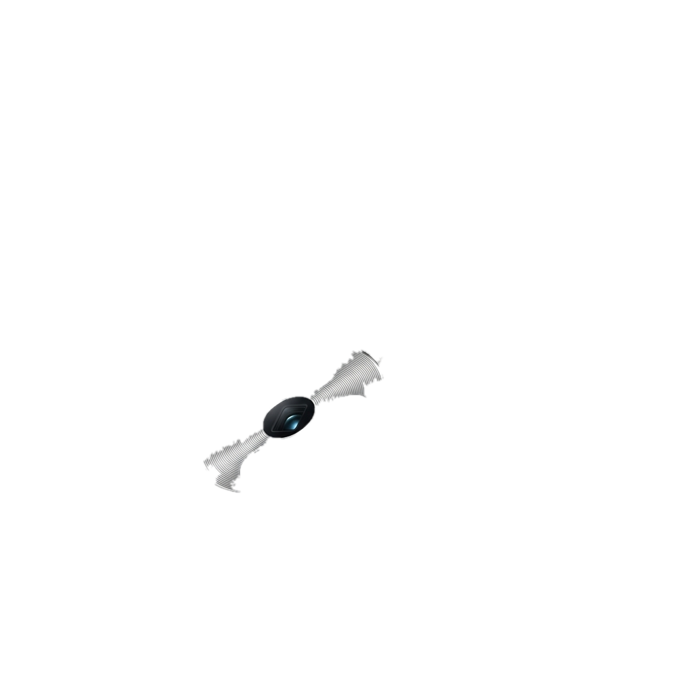
</div>
<div class="card-content">
<div class="hallmark">OPPO · HASSELBLAD DUAL PERISCOPE</div>
<h3 class="product-name">OPPO Find X7 Ultra</h3>
<div class="specs">
<div class="spec-row"><span class="spec-label">Chip</span><span class="spec-val">Snapdragon 8 Gen 3</span></div>
<div class="spec-row"><span class="spec-label">Display</span><span class="spec-val">6.82" 2K 120Hz LTPO</span></div>
<div class="spec-row"><span class="spec-label">Sensor</span><span class="spec-val">1" LYT-900 · 50MP OIS</span></div>
<div class="spec-row"><span class="spec-label">Telephoto</span><span class="spec-val">双潜望 · 65mm + 135mm</span></div>
</div>
</div>
<div class="hidden-details" style="display:none;">
<div class="d-brand">OPPO // HASSELBLAD DUAL PERISCOPE</div>
<div class="d-title">OPPO Find X7 Ultra</div>
<div class="d-why">大漠银月双拼皮金属复古机身，全球首创双潜望长焦系统，哈苏全焦段人像标杆。</div>
<div class="d-desc">全球首发双潜望四主摄系统，搭载第二代一英寸索尼 LYT-900 与 65mm/135mm 双潜望长焦镜头，采用经典大漠银月双拼材质与哈苏超光影画质。</div>
<div class="d-spec" data-label="SoC">Snapdragon 8 Gen 3 (4nm) | 潮汐架构 | Adreno 750 | LPDDR5X | UFS 4.0</div>
<div class="d-spec" data-label="Memory">16GB LPDDR5X RAM 8533Mbps (顶配)</div>
<div class="d-spec" data-label="Storage">512GB UFS 4.0 高速闪存 (顶配)</div>
<div class="d-spec" data-label="Display">6.82" 2K (3168×1440) 东方钻石屏 | 1-120Hz LTPO | 4500 nits 局部峰值 | ProXDR 显示 | 2160Hz 高频 PWM + 类 DC 调光 | Gorilla Glass Victus 2</div>
<div class="d-spec" data-label="Camera System">[Main] 50MP Sony LYT-900 | 第二代 1" 超大底 | 1G+7P 混合镜头 | f/1.8 | OIS<br/>
                        [Portrait Telephoto] 50MP Sony IMX890 | 3× (65mm) | 1/1.56" 行业超大底 | f/2.6 | 悬浮棱镜防抖 | 25cm 最近对焦<br/>
                        [Close-up Telephoto] 50MP Sony IMX858 | 6× (135mm) | 1/2.51" | f/4.3 | 棱镜防抖 | 35cm 最近对焦<br/>
                        [Ultrawide] 50MP Sony LYT-600 | 14mm | f/2.0 | 123° FOV | 4cm 微距</div>
<div class="d-spec" data-label="Camera Sensors">Main: Sony LYT-900 / 1.0" (50MP, 1.6µm / 3.2µm 4-in-1, 1G+7P, f/1.8, OIS); 65mm 3× 潜望: Sony IMX890 / 1/1.56" (50MP, f/2.6, 悬浮棱镜 OIS); 135mm 6× 潜望: Sony IMX858 / 1/2.51" (50MP, f/4.3, 棱镜 OIS); Ultrawide: Sony LYT-600 / 1/1.95" (50MP, 14mm, f/2.0); Front: 32MP Sony IMX709 (RGBW, f/2.4, AF)</div>
<div class="d-spec" data-label="Focal Lengths">Native: 14mm / 23mm / 65mm / 135mm | In-sensor zoom: 46mm (2×) / 300mm (13.3×) | 数码变焦至 120×</div>
<div class="d-spec" data-label="Battery &amp; Charging">5000mAh 大容量电池 | 100W 有线超级闪充 (26 分钟充至 100%) | 50W 无线闪充 | 10W 无线反充 | 支持 -20°C 极寒充电</div>
<div class="d-spec" data-label="Build">221g | 大漠银月 (荔枝纹高端素皮与冷雕金属微弧拼接) | 独立三段式物理滑块按键 | IP68 防尘防水</div>
<div class="d-spec" data-label="Feature">全球首创双潜望四主摄系统 (65mm+135mm) | 独立三段式物理滑块 (一键 VIP 隐私模式) | 国密二级独立安全芯片 | 全焦段 4K 杜比视界 HDR 视频</div>
</div>
</div>
</div>
</div>
<div class="section-wrapper" id="sec-tablet">
<div class="chapter-head">
<span class="chapter-eyebrow">tablets</span>
<h2 class="section-title"><span class="lang-pair"><span class="lang-zh" lang="zh-CN">平板与薄板设备</span><span aria-hidden="true" class="lang-divider"> / </span><span class="lang-en" lang="en">Tablets &amp; slates</span></span><span class="section-count">(6 / 6 PIECES)</span></h2>
<div class="chapter-rule"></div>
</div>
<div class="grid">
<div class="card" data-brand="apple" data-cat="tablet" data-chapter="TABLETS &amp; SLATES" data-lot="022" data-name='ipad pro 13" apple · creator slate apple pro apple' data-status="wishlist">
<div class="lot-number">N° 022</div>
<div class="seal wishlist"><span class="dot"></span>WISHLIST</div>
<div class="img-box">
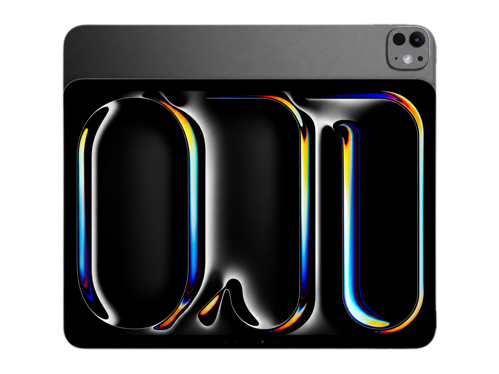
</div>
<div class="card-content">
<div class="hallmark">APPLE · CREATOR SLATE</div>
<h3 class="product-name">iPad Pro 13"</h3>
<div class="specs">
<div class="spec-row"><span class="spec-label">Chip</span><span class="spec-val">Apple M4</span></div>
<div class="spec-row"><span class="spec-label">Display</span><span class="spec-val">Tandem OLED</span></div>
<div class="spec-row"><span class="spec-label">Accessory</span><span class="spec-val">Apple Pencil Pro</span></div>
</div>
</div>
<div class="hidden-details" style="display:none;">
<div class="d-brand">APPLE // CREATOR SLATE</div>
<div class="d-title">iPad Pro 13" (M4)</div>
<div class="d-why"></div>
<div class="d-desc">First Apple device with the M4 chip and a Tandem OLED display. 5.1mm thick.</div>
<div class="d-spec" data-label="SoC">Apple M4 | 10-Core CPU (4P + 6E) | 10-Core GPU | Hardware Ray Tracing | 16-Core Neural Engine (38 TOPS)</div><div class="d-spec" data-label="Memory">16GB Unified Memory (顶配)</div><div class="d-spec" data-label="Storage">2TB PCIe SSD with Nano-texture display glass option (顶配)</div><div class="d-spec" data-label="Display">13" Ultra Retina XDR | Tandem OLED (2752x2064) | 120Hz ProMotion | 1000 nits full / 1600 nits peak HDR | Nano-texture option</div><div class="d-spec" data-label="Camera System">Rear: 12MP Wide (f/1.8) + LiDAR Scanner | Front: Landscape 12MP Ultra Wide (Center Stage)</div><div class="d-spec" data-label="Battery">Built-in 38.99Wh rechargeable lithium-polymer | Up to 10 hours web/video</div><div class="d-spec" data-label="Connectivity">Thunderbolt / USB 4 (up to 40Gb/s) | Wi-Fi 6E (802.11ax) | 5G Sub-6 | Bluetooth 5.3</div><div class="d-spec" data-label="Build">100% recycled aluminum unibody | 5.1mm thickness (Thinnest Apple product) | 579g (Wi-Fi) / 582g (Cellular)</div><div class="d-spec" data-label="Accessories">Apple Pencil Pro (Squeeze, Barrel Roll, Haptic Feedback) | Magic Keyboard for iPad Pro (Aluminum palm rest)</div></div>
</div>
<div class="card" data-brand="apple" data-cat="tablet" data-chapter="TABLETS &amp; SLATES" data-lot="023" data-name="ipad mini (a17 pro) apple · gaming &amp; reading apple portable apple" data-status="wishlist">
<div class="lot-number">N° 023</div>
<div class="seal wishlist"><span class="dot"></span>WISHLIST</div>
<div class="img-box">
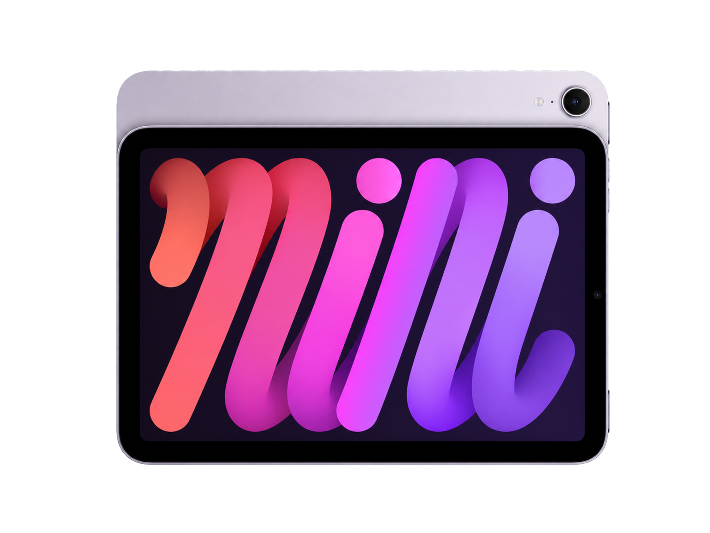
</div>
<div class="card-content">
<div class="hallmark">APPLE · GAMING &amp; READING</div>
<h3 class="product-name">iPad mini (A17 Pro)</h3>
<div class="specs">
<div class="spec-row"><span class="spec-label">Chip</span><span class="spec-val">A17 Pro</span></div>
<div class="spec-row"><span class="spec-label">Display</span><span class="spec-val">8.3" Liquid Retina</span></div>
<div class="spec-row"><span class="spec-label">Portability</span><span class="spec-val">Ultra-light 293g</span></div>
</div>
</div>
<div class="hidden-details" style="display:none;">
<div class="d-brand">APPLE // GAMING &amp; READING</div>
<div class="d-title">iPad mini (A17 Pro)</div>
<div class="d-why">A17 Pro in the smallest form factor — fits in a jacket pocket and benchmarks close to a laptop.</div>
<div class="d-desc">Upgraded with the A17 Pro chip, enough for console-level gaming on a device this size.</div>
<div class="d-spec" data-label="SoC">Apple A17 Pro (3nm) | 6-Core CPU (2P + 4E) | 5-Core GPU | Hardware-accelerated Ray Tracing | 16-Core Neural Engine</div><div class="d-spec" data-label="Memory">8GB Unified Memory (顶配，支持 Apple Intelligence)</div><div class="d-spec" data-label="Storage">512GB PCIe SSD (顶配)</div><div class="d-spec" data-label="Display">8.3" Liquid Retina (2266x1488, 326 PPI) | 500 nits | P3 Wide Color | True Tone | Anti-reflective coating</div><div class="d-spec" data-label="Camera System">Rear: 12MP Wide (f/1.8, Smart HDR 4) | Front: 12MP Ultra Wide (Landscape, Center Stage)</div><div class="d-spec" data-label="Battery">Built-in 19.3Wh lithium-polymer | Up to 10 hours web/video | 20W USB-C adapter</div><div class="d-spec" data-label="Connectivity">USB-C (USB 3, up to 10Gb/s) | Wi-Fi 6E | 5G Sub-6 | Bluetooth 5.3</div><div class="d-spec" data-label="Build">100% recycled aluminum enclosure | 195.4 x 134.8 x 6.3mm | 293g (Wi-Fi) / 297g (Cellular)</div><div class="d-spec" data-label="Compatibility">Supports Apple Pencil Pro (Squeeze &amp; Barrel roll) and Apple Pencil (USB-C)</div></div>
</div>
<div class="card" data-brand="samsung" data-cat="tablet" data-chapter="TABLETS &amp; SLATES" data-lot="024" data-name="galaxy tab s10 ultra samsung · galaxy tab galaxy ultra samsung" data-status="wishlist">
<div class="lot-number">N° 024</div>
<div class="seal wishlist"><span class="dot"></span>WISHLIST</div>
<div class="img-box">
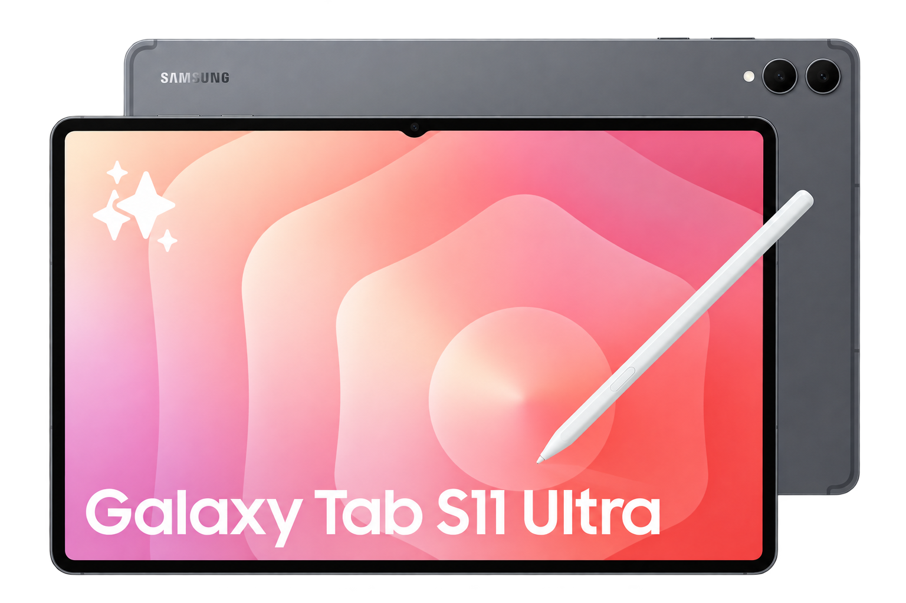
</div>
<div class="card-content">
<div class="hallmark">SAMSUNG · GALAXY TAB</div>
<h3 class="product-name">Galaxy Tab S10 Ultra</h3>
<div class="specs">
<div class="spec-row"><span class="spec-label">Display</span><span class="spec-val">14.6" Dynamic AMOLED</span></div>
<div class="spec-row"><span class="spec-label">Chip</span><span class="spec-val">Dimensity 9300+</span></div>
<div class="spec-row"><span class="spec-label">Feature</span><span class="spec-val">IP68 &amp; Built-in S-Pen</span></div>
</div>
</div>
<div class="hidden-details" style="display:none;">
<div class="d-brand">SAMSUNG // GALAXY TAB</div>
<div class="d-title">Galaxy Tab S10 Ultra</div>
<div class="d-why">14.6" AMOLED plus 16GB RAM — close to a desktop replacement, and the S-Pen integration is done well.</div>
<div class="d-desc">A 14.6-inch display aimed at creators. The largest Android tablet, with IP68 water resistance.</div>
<div class="d-spec" data-label="SoC">MediaTek Dimensity 9300+ (4nm) | 1x 3.4GHz Cortex-X4 + 3x 2.85GHz Cortex-X4 + 4x 2.0GHz Cortex-A720 | Immortalis-G720 GPU</div><div class="d-spec" data-label="Memory">16GB LPDDR5X RAM (顶配)</div><div class="d-spec" data-label="Storage">1TB UFS 4.0 (MicroSD expandable up to 1.5TB) (顶配)</div><div class="d-spec" data-label="Display">14.6" Dynamic AMOLED 2X (2960x1848, 16:10) | 120Hz | 930 nits peak | Anti-Reflection Coating</div><div class="d-spec" data-label="Camera System">Rear: 13MP Wide + 8MP Ultra-wide | Front: Dual 12MP Wide + 12MP Ultra-wide</div><div class="d-spec" data-label="Battery">11,200mAh | 45W Super Fast Charging 2.0</div><div class="d-spec" data-label="Build">Enhanced Armor Aluminum unibody | IP68 water &amp; dust resistance | 326.4 x 208.6 x 5.4mm | 718g (Wi-Fi) / 723g (5G)</div><div class="d-spec" data-label="Connectivity">Wi-Fi 7 | 5G Sub-6 | USB Type-C 3.2 Gen 1 with DisplayPort Out | Pogo Pin keyboard connection</div><div class="d-spec" data-label="Features">Galaxy AI Suite (Circle to Search, Note Assist, Sketch to Image) | Included IP68 S-Pen | Samsung DeX</div></div>
</div>
<div class="card" data-brand="samsung" data-cat="tablet" data-chapter="TABLETS &amp; SLATES" data-lot="025" data-name="galaxy tab s10+ samsung · galaxy tab plus the sweet spot samsung" data-status="wishlist">
<div class="lot-number">N° 025</div>
<div class="seal wishlist"><span class="dot"></span>WISHLIST</div>
<div class="img-box">
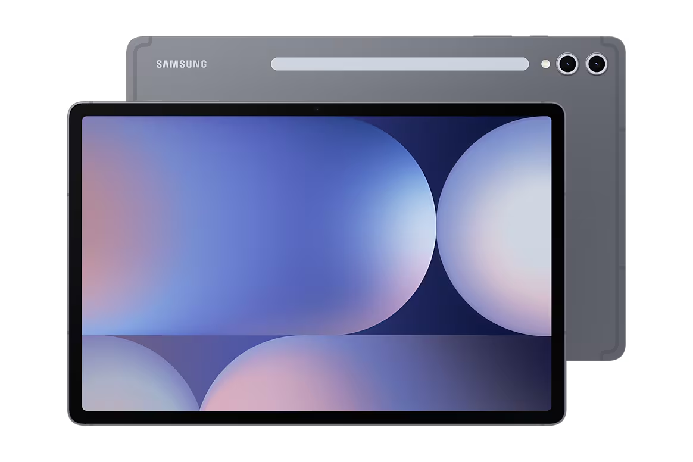
</div>
<div class="card-content">
<div class="hallmark">SAMSUNG · GALAXY TAB PLUS</div>
<h3 class="product-name">Galaxy Tab S10+</h3>
<div class="specs">
<div class="spec-row"><span class="spec-label">Display</span><span class="spec-val">12.4" AMOLED 120Hz</span></div>
<div class="spec-row"><span class="spec-label">Chip</span><span class="spec-val">Dimensity 9300+</span></div>
<div class="spec-row"><span class="spec-label">Feature</span><span class="spec-val">S-Pen / Anti-Reflective</span></div>
</div>
</div>
<div class="hidden-details" style="display:none;">
<div class="d-brand">SAMSUNG // GALAXY TAB PLUS</div>
<div class="d-title">Galaxy Tab S10+</div>
<div class="d-why">The balanced one. Just enough screen, just enough power. My ideal couch + coffee setup.</div>
<div class="d-desc">A 12.4-inch display without the bulk of the Ultra — the size I'd actually reach for.</div>
<div class="d-spec" data-label="SoC">MediaTek Dimensity 9300+ (4nm) | 1x 3.4GHz Cortex-X4 + 3x 2.85GHz Cortex-X4 + 4x 2.0GHz Cortex-A720 | Immortalis-G720 GPU</div><div class="d-spec" data-label="Memory">12GB LPDDR5X RAM (顶配)</div><div class="d-spec" data-label="Storage">512GB UFS 4.0 (MicroSD expandable up to 1.5TB) (顶配)</div><div class="d-spec" data-label="Display">12.4" Dynamic AMOLED 2X (2800x1752, 16:10) | 120Hz | 650 nits peak | Anti-Reflection Coating</div><div class="d-spec" data-label="Camera System">Rear: 13MP Wide + 8MP Ultra-wide | Front: 12MP Ultra-wide</div><div class="d-spec" data-label="Battery">10,090mAh | 45W Super Fast Charging 2.0</div><div class="d-spec" data-label="Build">Enhanced Armor Aluminum unibody | IP68 water &amp; dust resistance | 285.4 x 185.4 x 5.6mm | 571g (Wi-Fi) / 576g (5G)</div><div class="d-spec" data-label="Connectivity">Wi-Fi 7 | 5G Sub-6 | USB Type-C 3.2 Gen 1 with DisplayPort Out | Pogo Pin</div><div class="d-spec" data-label="Features">Galaxy AI Suite | Included low-latency S-Pen (0.7mm, 4096 pressure levels) | Samsung DeX | Quad AKG Speakers</div></div>
</div>
<div class="card" data-brand="apple" data-cat="tablet" data-chapter="TABLETS &amp; SLATES" data-lot="045" data-name='ipad air 11" apple · everyday slate apple portable' data-status="wishlist">
<div class="lot-number">N° 045</div>
<div class="seal wishlist"><span class="dot"></span>WISHLIST</div>
<div class="img-box">
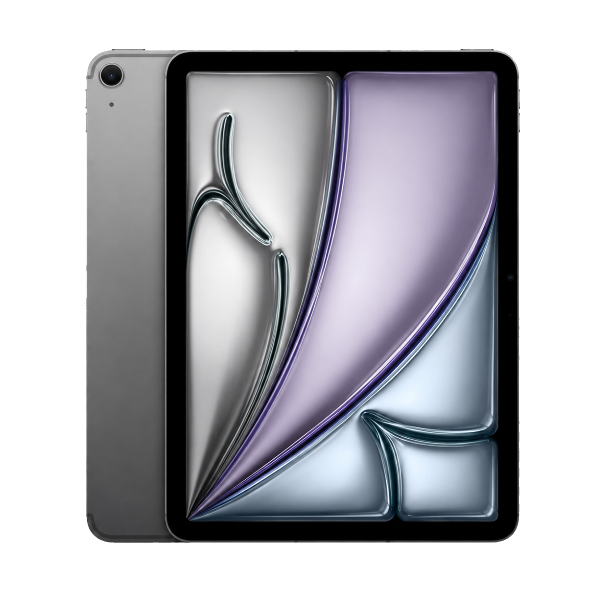
</div>
<div class="card-content">
<div class="hallmark">APPLE · EVERYDAY SLATE</div>
<h3 class="product-name">iPad Air 11-inch</h3>
<div class="specs">
<div class="spec-row"><span class="spec-label">Chip</span><span class="spec-val">Apple M2</span></div>
<div class="spec-row"><span class="spec-label">Display</span><span class="spec-val">11" Liquid Retina</span></div>
<div class="spec-row"><span class="spec-label">Weight</span><span class="spec-val">462g</span></div>
</div>
</div>
<div class="hidden-details" style="display:none;">
<div class="d-brand">APPLE // EVERYDAY SLATE</div>
<div class="d-title">iPad Air 11-inch (M2)</div>
<div class="d-why">The iPad sweet spot: enough M-series power for creative work without the weight or price of the Pro line.</div>
<div class="d-desc">Pairs the M2 chip with a Liquid Retina display and Apple Pencil Pro support, in an aluminum body.</div>
<div class="d-spec" data-label="SoC">Apple M2 | 8-core CPU | 9-core GPU | 16-core Neural Engine</div>
<div class="d-spec" data-label="Display">11" Liquid Retina | 2360×1640 | 500 nits | P3 | True Tone</div>
<div class="d-spec" data-label="Camera System">Rear: 12MP Wide | Front: 12MP Ultra Wide (Center Stage)</div>
<div class="d-spec" data-label="Design">6.1mm aluminum body | 462g Wi-Fi model</div>
<div class="d-spec" data-label="Battery">Built-in 28.93Wh | Up to 10 hours</div>
<div class="d-spec" data-label="Accessories">Apple Pencil Pro | Apple Pencil (USB-C) | Magic Keyboard Folio</div>
</div>
</div>
<div class="card" data-brand="lenovo" data-cat="tablet" data-chapter="TABLETS &amp; SLATES" data-lot="052" data-name="拯救者 y700 lenovo legion y700 联想 拯救者 y700 平板 lenovo · compact gaming slate lenovo gaming tablet" data-status="wishlist">
<div class="lot-number">N° 052</div>
<div class="seal wishlist"><span class="dot"></span>WISHLIST</div>
<div class="img-box">
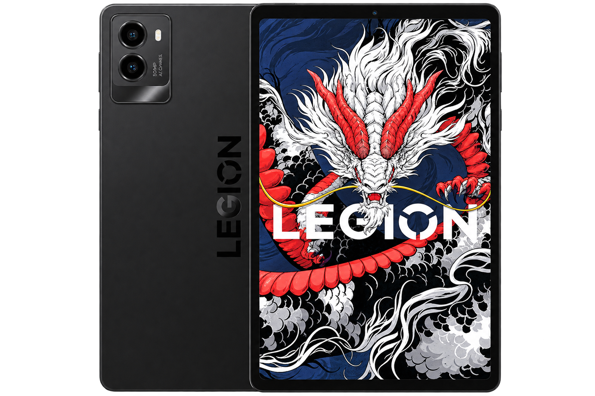
</div>
<div class="card-content">
<div class="hallmark">LENOVO · COMPACT GAMING SLATE</div>
<h3 class="product-name">拯救者 Y700</h3>
<div class="specs">
<div class="spec-row"><span class="spec-label">Display</span><span class="spec-val">8.8" 2.5K 165Hz</span></div>
<div class="spec-row"><span class="spec-label">Chip</span><span class="spec-val">Snapdragon 8 Gen 3</span></div>
<div class="spec-row"><span class="spec-label">Feature</span><span class="spec-val">Dual USB-C · 340g</span></div>
</div>
</div>
<div class="hidden-details" style="display:none;">
<div class="d-brand">LENOVO // COMPACT GAMING SLATE</div>
<div class="d-title">Legion Y700 (Gen 3)</div>
<div class="d-why">The undisputed king of compact Android gaming tablets. An 8.8" 165Hz display, Snapdragon 8 Gen 3, dual USB-C ports, and bypass charging in an ultra-portable 340g CNC metal frame.</div>
<div class="d-desc">Known as the "Pocket Gaming Monolith," the Lenovo Legion Y700 (3rd Gen) pairs Qualcomm Snapdragon 8 Gen 3, a massive 10,004mm² vapor chamber, an 8.8-inch 2.5K 165Hz high-refresh gaming display, and dual USB-C ports with bypass charging into an anodized all-metal body.</div>
<div class="d-spec" data-label="SoC">Qualcomm Snapdragon 8 Gen 3 (4nm) | Adreno 750 | LPDDR5X (up to 16GB) + UFS 4.0 (up to 512GB)</div>
<div class="d-spec" data-label="Display">8.8" IPS LCD | 2560×1600 2.5K | 165Hz | 343 PPI | 500 nits | DCI-P3 | DC Dimming | TÜV Low Blue Light</div>
<div class="d-spec" data-label="Thermal Architecture">QianKun Cooling Architecture | 10,004mm² Super-Large Vapor Chamber (VC)</div>
<div class="d-spec" data-label="Ports &amp; Gaming Features">Dual USB Type-C Ports (side + bottom) | Bypass Charging (direct motherboard power) | DP Video Output | Dual X-axis Linear Motors</div>
<div class="d-spec" data-label="Battery &amp; Charging">6550mAh high-density battery | 68W Super Flash Charge</div>
<div class="d-spec" data-label="Build &amp; Audio">CNC Integrated Anodized Aluminum | 7.79mm | 340g | Dual Ultra-linear Stereo Speakers with Dolby Atmos</div>
<div class="d-spec" data-label="Camera System">Rear: 13MP Main + 2MP Macro with flash | Front: 8MP Centered HD Camera</div>
<div class="d-spec" data-label="Build">CNC Integrated Anodized Aluminum | 7.79mm | 340g</div><div class="d-spec" data-label="Battery">6550mAh high-density battery | 68W Super Flash Charge | Bypass Charging</div><div class="d-spec" data-label="Connectivity">Dual USB-C (1x USB 3.2 Gen 2 DP Out + 1x USB 2.0) | Wi-Fi 6E | Bluetooth 5.4</div><div class="d-spec" data-label="Memory">12GB / 16GB LPDDR5X | 256GB / 512GB UFS 4.0</div></div>
</div>
</div>
</div>
<div class="section-wrapper" id="sec-laptop">
<div class="chapter-head">
<span class="chapter-eyebrow">laptops</span>
<h2 class="section-title"><span class="lang-pair"><span class="lang-zh" lang="zh-CN">移动工作站</span><span aria-hidden="true" class="lang-divider"> / </span><span class="lang-en" lang="en">Mobile workstations</span></span><span class="section-count">(8 / 8 PIECES)</span></h2>
<div class="chapter-rule"></div>
</div>
<div class="grid">
<div class="card" data-brand="apple" data-cat="laptop" data-chapter="MOBILE WORKSTATIONS" data-lot="026" data-name="macbook pro 16-inch m5 pro m5 max apple · professional apple creator" data-status="wishlist">
<div class="lot-number">N° 026</div>
<div class="seal wishlist"><span class="dot"></span>WISHLIST</div>
<div class="img-box">
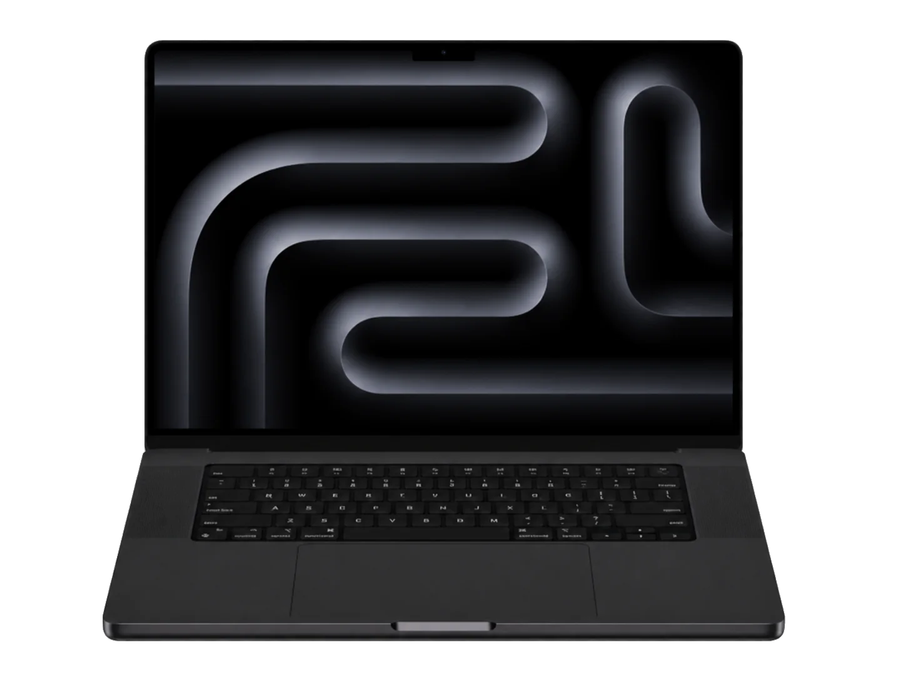
</div>
<div class="card-content">
<div class="hallmark">APPLE · MACBOOK PRO / M5</div>
<h3 class="product-name">MacBook Pro 16-inch</h3>
<div class="specs">
<div class="spec-row"><span class="spec-label">Processor</span><span class="spec-val">Apple M5 Pro / M5 Max</span></div>
<div class="spec-row"><span class="spec-label">Memory</span><span class="spec-val">Up to 128GB Unified</span></div>
<div class="spec-row"><span class="spec-label">Display</span><span class="spec-val">16.2" Liquid Retina XDR</span></div>
</div>
</div>
<div class="hidden-details" style="display:none;">
<div class="d-brand">APPLE // MACBOOK PRO 16-INCH / M5</div>
<div class="d-title">MacBook Pro 16-inch</div>
<div class="d-why">M5 Pro or M5 Max in a 16-inch Liquid Retina XDR display, built for heavier workloads.</div>
<div class="d-desc">Built for creative, development, AI, and production workflows, with up to 24 hours of battery life.</div>
<div class="d-spec" data-label="Processor">Apple M5 Max | 18-Core CPU (12P + 6E) | 40-Core GPU | 16-Core Neural Engine</div><div class="d-spec" data-label="Graphics">Apple M5 Max 40-Core GPU | Hardware-accelerated Ray Tracing | Dynamic Caching</div><div class="d-spec" data-label="Memory">128GB Unified Memory | 800GB/s Memory Bandwidth</div><div class="d-spec" data-label="Storage">8TB PCIe NVMe SSD (up to 7.4GB/s read)</div><div class="d-spec" data-label="Display">16.2" Liquid Retina XDR (3456x2234) | 120Hz ProMotion | 1,600 nits peak HDR | Nano-texture option</div><div class="d-spec" data-label="Battery">100Wh Lithium-Polymer | 140W USB-C GaN Power Adapter | Up to 24 hours</div><div class="d-spec" data-label="Camera &amp; Audio">12MP Center Stage camera | Studio-quality three-mic array | Six-speaker system with Spatial Audio</div><div class="d-spec" data-label="I/O">3x Thunderbolt 5 (up to 120Gb/s) | HDMI 2.1 (8K) | MagSafe 3 | SDXC (UHS-II) | 3.5mm Headphone Jack</div><div class="d-spec" data-label="Form Factor">100% recycled aluminum unibody | 2.16kg | 16.8mm thickness</div></div>
</div>
<div class="card" data-brand="lenovo" data-cat="laptop" data-chapter="MOBILE WORKSTATIONS" data-lot="027" data-name="legion 5 15ahp10 lenovo · legion esports lenovo gaming lenovo" data-status="wishlist">
<div class="lot-number">N° 027</div>
<div class="seal wishlist"><span class="dot"></span>WISHLIST</div>
<div class="img-box">

</div>
<div class="card-content">
<div class="hallmark">LENOVO · LEGION ESPORTS</div>
<h3 class="product-name">Legion 5 15AHP10</h3>
<div class="specs">
<div class="spec-row"><span class="spec-label">CPU</span><span class="spec-val">AMD Ryzen 9 9945HX</span></div>
<div class="spec-row"><span class="spec-label">GPU</span><span class="spec-val">NVIDIA RTX 5070</span></div>
<div class="spec-row"><span class="spec-label">RAM</span><span class="spec-val">32GB DDR5-5600</span></div>
</div>
</div>
<div class="hidden-details" style="display:none;">
<div class="d-brand">LENOVO // LEGION ESPORTS</div>
<div class="d-title">Legion 5 15AHP10</div>
<div class="d-why">Ryzen 9 and RTX 5070 in a chassis that doesn't look like a toy.</div>
<div class="d-desc">Coldfront cooling keeps the AMD CPU and RTX 50-series GPU running at their rated TGP.</div>
<div class="d-spec" data-label="Processor">AMD Ryzen 9 9945HX | 16 Cores / 32 Threads | up to 5.4GHz | 80MB Cache</div><div class="d-spec" data-label="Graphics">NVIDIA GeForce RTX 5070 Laptop GPU | 8GB GDDR6 | 140W Max TGP</div><div class="d-spec" data-label="Memory">64GB (2x32GB) DDR5-5600 SO-DIMM</div><div class="d-spec" data-label="Storage">4TB (2x2TB) M.2 2280 PCIe Gen 4 NVMe SSD</div><div class="d-spec" data-label="Display">15.6" WQHD (2560x1440) | 165Hz | 100% sRGB | G-Sync | 350 nits</div><div class="d-spec" data-label="Cooling">Legion Coldfront 5.0 | Liquid Metal Thermal Interface | Dual 12V Fans</div><div class="d-spec" data-label="Battery">80Wh integrated battery | 230W Slim Tip AC adapter | Rapid Charge Pro</div><div class="d-spec" data-label="I/O">1x USB-C (DP 1.4, 140W PD) | 3x USB-A 3.2 Gen 1 | 1x HDMI 2.1 | RJ-45 LAN | Wi-Fi 6E</div><div class="d-spec" data-label="Form Factor">Storm Grey aluminum top / polymer bottom | 2.3kg | 19.9-25.2mm</div></div>
</div>
<div class="card" data-brand="asus" data-cat="laptop" data-chapter="MOBILE WORKSTATIONS" data-lot="037" data-name="proart p16 h7607 rtx spark asus · creator workstation asus creator laptop" data-status="wishlist">
<div class="lot-number">N° 037</div>
<div class="seal wishlist"><span class="dot"></span>WISHLIST</div>
<div class="img-box">

</div>
<div class="card-content">
<div class="hallmark">ASUS · PROART P16 / RTX SPARK</div>
<h3 class="product-name">ProArt P16 (H7607)</h3>
<div class="specs">
<div class="spec-row"><span class="spec-label">Platform</span><span class="spec-val">NVIDIA RTX Spark</span></div>
<div class="spec-row"><span class="spec-label">AI</span><span class="spec-val">Up to 1 PFLOP FP4</span></div>
<div class="spec-row"><span class="spec-label">Display</span><span class="spec-val">4K Lumina Pro OLED · 120Hz VRR</span></div>
</div>
</div>
<div class="hidden-details" style="display:none;">
<div class="d-brand">ASUS // PROART P16 / RTX SPARK</div>
<div class="d-title">ProArt P16 (H7607)</div>
<div class="d-why">The exact RTX Spark creator laptop from ASUS: a portable workstation built for local AI, 3D, and high-resolution creative work.</div>
<div class="d-desc">The ProArt P16 H7607 combines NVIDIA RTX Spark with up to 128GB of unified memory and an ASUS Lumina Pro OLED display.</div>
<div class="d-spec" data-label="Processor">AMD Ryzen AI 9 HX 370 | 12 Cores / 24 Threads | up to 5.1GHz | 50 TOPS NPU</div><div class="d-spec" data-label="Graphics">NVIDIA GeForce RTX 5070 Laptop GPU | 8GB GDDR6 | 105W Max TGP</div><div class="d-spec" data-label="Memory">64GB LPDDR5X-7500 on-board</div><div class="d-spec" data-label="Storage">4TB (2x 2TB) M.2 NVMe PCIe 4.0 SSD</div><div class="d-spec" data-label="Display">16" 4K ASUS Lumina Pro OLED | Delta E &lt; 1 | 120Hz VRR | up to 1,600 nits | Touch &amp; Stylus</div><div class="d-spec" data-label="Battery">90Wh 4-cell Li-ion | 200W AC adapter | Fast charging</div><div class="d-spec" data-label="I/O">1x USB4 40Gbps | 1x USB 3.2 Gen 2 Type-C | 2x USB 3.2 Gen 2 Type-A | HDMI 2.1 | SD Express 7.0</div><div class="d-spec" data-label="Form Factor">Nano Black CNC aluminum unibody | 1.77kg | 12.9mm ultrathin</div><div class="d-spec" data-label="Operating System">Windows 11 Pro</div></div>
</div>
<div class="card" data-brand="apple" data-cat="laptop" data-chapter="MOBILE WORKSTATIONS" data-lot="038" data-name="macbook air 13 apple · everyday laptop apple macbook" data-status="wishlist">
<div class="lot-number">N° 038</div>
<div class="seal wishlist"><span class="dot"></span>WISHLIST</div>
<div class="img-box">

</div>
<div class="card-content">
<div class="hallmark">APPLE · EVERYDAY LAPTOP</div>
<h3 class="product-name">MacBook Air 13-inch</h3>
<div class="specs">
<div class="spec-row"><span class="spec-label">Processor</span><span class="spec-val">Apple M5</span></div>
<div class="spec-row"><span class="spec-label">Display</span><span class="spec-val">13.6" Liquid Retina</span></div>
<div class="spec-row"><span class="spec-label">Battery</span><span class="spec-val">Up to 18h video</span></div>
</div>
</div>
<div class="hidden-details" style="display:none;">
<div class="d-brand">APPLE // EVERYDAY LAPTOP</div>
<div class="d-title">MacBook Air 13-inch</div>
<div class="d-why">The quiet, light everyday machine: enough power for creative work without the weight of a workstation.</div>
<div class="d-desc">Apple's M5 MacBook Air keeps the fanless, portable formula while adding a faster neural engine and modern connectivity.</div>
<div class="d-spec" data-label="Processor">Apple M5 | 10-Core CPU (4P + 6E) | 10-Core GPU | 16-Core Neural Engine</div><div class="d-spec" data-label="Graphics">Apple M5 10-Core GPU | Hardware-accelerated Ray Tracing</div><div class="d-spec" data-label="Memory">32GB Unified Memory | 153GB/s Bandwidth</div><div class="d-spec" data-label="Storage">4TB PCIe NVMe SSD</div><div class="d-spec" data-label="Display">13.6" Liquid Retina (2560x1664) | 500 nits | P3 Wide Color | True Tone</div><div class="d-spec" data-label="Battery">52.6Wh Lithium-Polymer | 35W Dual USB-C Port Adapter | Up to 18 hours</div><div class="d-spec" data-label="I/O">MagSafe 3 | 2x Thunderbolt / USB 4 (40Gb/s) | 3.5mm Headphone Jack | Wi-Fi 7</div><div class="d-spec" data-label="Form Factor">100% recycled aluminum unibody | 1.24kg | 11.3mm thickness</div></div>
</div>
<div class="card" data-brand="apple" data-cat="laptop" data-chapter="MOBILE WORKSTATIONS" data-lot="043" data-name="macbook air 15 apple · everyday laptop apple macbook" data-status="wishlist">
<div class="lot-number">N° 043</div>
<div class="seal wishlist"><span class="dot"></span>WISHLIST</div>
<div class="img-box">

</div>
<div class="card-content">
<div class="hallmark">APPLE · EVERYDAY LAPTOP</div>
<h3 class="product-name">MacBook Air 15-inch</h3>
<div class="specs">
<div class="spec-row"><span class="spec-label">Processor</span><span class="spec-val">Apple M5</span></div>
<div class="spec-row"><span class="spec-label">Display</span><span class="spec-val">15.3" Liquid Retina</span></div>
<div class="spec-row"><span class="spec-label">Battery</span><span class="spec-val">Up to 18h video</span></div>
</div>
</div>
<div class="hidden-details" style="display:none;">
<div class="d-brand">APPLE // EVERYDAY LAPTOP</div>
<div class="d-title">MacBook Air 15-inch</div>
<div class="d-why">The larger-screen Air: the same silent, fanless M5 platform with more room for multitasking.</div>
<div class="d-desc">Apple's 15.3-inch MacBook Air brings the current M5 performance and Liquid Retina display to a bigger portable workspace.</div>
<div class="d-spec" data-label="Processor">Apple M5 | 10-Core CPU (4P + 6E) | 10-Core GPU | 16-Core Neural Engine</div><div class="d-spec" data-label="Graphics">Apple M5 10-Core GPU | Hardware-accelerated Ray Tracing</div><div class="d-spec" data-label="Memory">32GB Unified Memory | 153GB/s Bandwidth</div><div class="d-spec" data-label="Storage">4TB PCIe NVMe SSD</div><div class="d-spec" data-label="Display">15.3" Liquid Retina (2880x1864) | 500 nits | P3 Wide Color | True Tone</div><div class="d-spec" data-label="Battery">66.5Wh Lithium-Polymer | 35W Dual USB-C Port Adapter | Up to 18 hours</div><div class="d-spec" data-label="I/O">MagSafe 3 | 2x Thunderbolt / USB 4 (40Gb/s) | 3.5mm Headphone Jack | Wi-Fi 7</div><div class="d-spec" data-label="Form Factor">100% recycled aluminum unibody | 1.51kg | 11.5mm thickness</div></div>
</div>
<div class="card" data-brand="msi" data-cat="laptop" data-chapter="MOBILE WORKSTATIONS" data-lot="039" data-name="prestige 16 ai c3m c3mx msi · business productivity msi laptop" data-status="wishlist">
<div class="lot-number">N° 039</div>
<div class="seal wishlist"><span class="dot"></span>WISHLIST</div>
<div class="img-box">
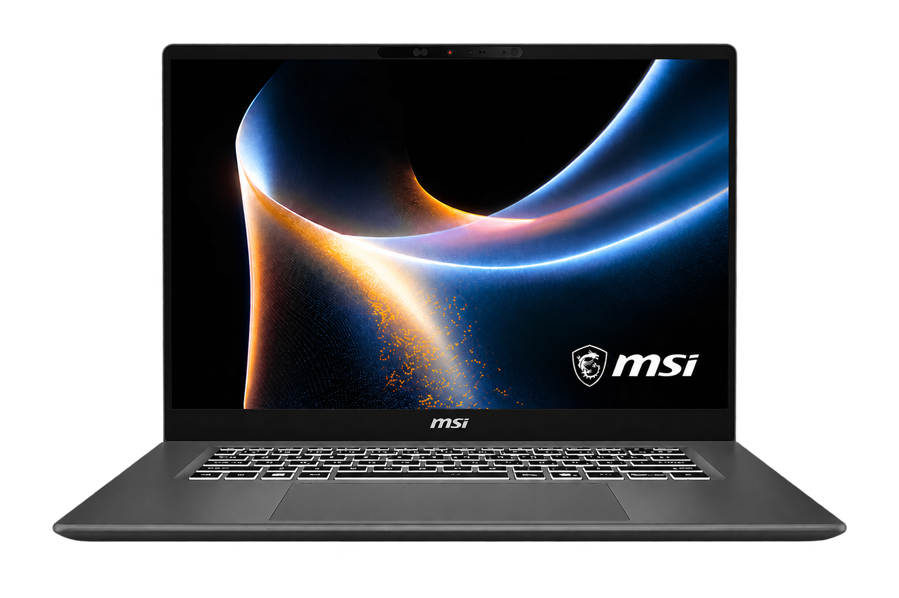
</div>
<div class="card-content">
<div class="hallmark">MSI · PRESTIGE 16 AI+ / C3M</div>
<h3 class="product-name">Prestige 16 AI+ C3M</h3>
<div class="specs">
<div class="spec-row"><span class="spec-label">Processor</span><span class="spec-val">Intel Core Ultra X9 388H</span></div>
<div class="spec-row"><span class="spec-label">Display</span><span class="spec-val">16" 2.8K OLED · 48–120Hz VRR</span></div>
<div class="spec-row"><span class="spec-label">Weight</span><span class="spec-val">1.59kg · 11.9–13.9mm</span></div>
</div>
</div>
<div class="hidden-details" style="display:none;">
<div class="d-brand">MSI // PRESTIGE 16 AI+ / C3M</div>
<div class="d-title">Prestige 16 AI+ C3M</div>
<div class="d-why">A 16-inch professional laptop balancing AI headroom with all-day battery life.</div>
<div class="d-desc">The MSI Prestige 16 AI+ C3M pairs Intel Core Ultra Series 3 with a 16-inch OLED display, a lightweight aluminum chassis, and Copilot+ PC features.</div>
<div class="d-spec" data-label="Processor">Intel Core Ultra 9 388H | 16 Cores | up to 5.1GHz | 50+ NPU TOPS</div><div class="d-spec" data-label="Graphics">Intel Arc GPU B390 | Xe2-LPG Architecture</div><div class="d-spec" data-label="Memory">64GB LPDDR5x-8533MHz on-board</div><div class="d-spec" data-label="Storage">2TB NVMe PCIe Gen 4 SSD (M.2 2280)</div><div class="d-spec" data-label="Display">16" 2.8K OLED (2880x1800) | 120Hz VRR | 100% DCI-P3 | DisplayHDR True Black 600</div><div class="d-spec" data-label="Battery">99.9Wh (FAA maximum limit) | 100W PD 3.0 Type-C | Up to 24 hours</div><div class="d-spec" data-label="I/O">1x Thunderbolt 4 | 1x USB 3.2 Gen 2 Type-C | 1x USB 3.2 Gen 2 Type-A | HDMI 2.1 | SD Card Reader</div><div class="d-spec" data-label="Form Factor">Magnesium-aluminum alloy chassis | 1.59kg | 11.9-13.9mm</div></div>
</div>
<div class="card" data-brand="apple" data-cat="laptop" data-chapter="MOBILE WORKSTATIONS" data-lot="040" data-name="macbook neo 13 apple · entry mac apple laptop" data-status="wishlist">
<div class="lot-number">N° 040</div>
<div class="seal wishlist"><span class="dot"></span>WISHLIST</div>
<div class="img-box">

</div>
<div class="card-content">
<div class="hallmark">APPLE · ENTRY MAC</div>
<h3 class="product-name">MacBook Neo 13-inch</h3>
<div class="specs">
<div class="spec-row"><span class="spec-label">Processor</span><span class="spec-val">Apple A18 Pro</span></div>
<div class="spec-row"><span class="spec-label">Display</span><span class="spec-val">13.0" Liquid Retina</span></div>
<div class="spec-row"><span class="spec-label">Battery</span><span class="spec-val">Up to 16h video</span></div>
</div>
</div>
<div class="hidden-details" style="display:none;">
<div class="d-brand">APPLE // ENTRY MAC</div>
<div class="d-title">MacBook Neo 13-inch</div>
<div class="d-why">The affordable Mac I keep wishing existed: compact, quiet, and still unmistakably Apple.</div>
<div class="d-desc">MacBook Neo brings Apple's A18 Pro platform to a lighter entry notebook with a full-size keyboard and modern wireless connectivity.</div>
<div class="d-spec" data-label="Processor">Apple A18 Pro | 6-Core CPU (2P + 4E) | 5-Core GPU | 16-Core Neural Engine</div><div class="d-spec" data-label="Graphics">Apple A18 Pro 5-Core GPU | Hardware-accelerated Ray Tracing</div><div class="d-spec" data-label="Memory">16GB Unified Memory | 100GB/s Memory Bandwidth</div><div class="d-spec" data-label="Storage">1TB PCIe NVMe SSD</div><div class="d-spec" data-label="Display">13.0" Liquid Retina (2408x1506) | 500 nits | sRGB | True Tone</div><div class="d-spec" data-label="Battery">36.5Wh Lithium-Polymer | 20W USB-C Power Adapter | Up to 16 hours</div><div class="d-spec" data-label="I/O">2x USB-C (USB 3 + USB 2) | 3.5mm Headphone Jack | Wi-Fi 6E | Bluetooth 6.0</div><div class="d-spec" data-label="Form Factor">Recycled Aluminum Unibody | 1.08kg | 10.5mm thickness</div></div>
</div>
<div class="card" data-brand="acer" data-cat="laptop" data-chapter="MOBILE WORKSTATIONS" data-lot="042" data-name="swift go 14 ai acer · swift go acer 14-inch intel core ultra ai laptop" data-status="wishlist">
<div class="lot-number">N° 042</div>
<div class="seal wishlist"><span class="dot"></span>WISHLIST</div>
<div class="img-box">

</div>
<div class="card-content">
<div class="hallmark">ACER · SWIFT GO / AI</div>
<h3 class="product-name">Swift Go 14 AI</h3>
<div class="specs">
<div class="spec-row"><span class="spec-label">Processor</span><span class="spec-val">Intel Core Ultra X9 388H</span></div>
<div class="spec-row"><span class="spec-label">AI</span><span class="spec-val">Up to 180 TOPS</span></div>
<div class="spec-row"><span class="spec-label">Display</span><span class="spec-val">Up to 3K OLED · 120Hz</span></div>
</div>
</div>
<div class="hidden-details" style="display:none;">
<div class="d-brand">ACER // SWIFT GO 14 AI</div>
<div class="d-title">Swift Go 14 AI</div>
<div class="d-why">The 14-inch Swift Go is the portable counterpoint to the big workstations: light enough to carry every day, smart enough to keep up.</div>
<div class="d-desc">Acer's Swift Go 14 AI combines a light aluminum design with Intel Core Ultra performance, OLED display options, and Copilot+ PC features.</div>
<div class="d-spec" data-label="Processor">Intel Core Ultra 9 388H | 16 Cores | up to 5.1GHz | 50 NPU TOPS</div><div class="d-spec" data-label="Graphics">Intel Arc B390 Graphics</div><div class="d-spec" data-label="Memory">32GB LPDDR5X-8448 dual-channel</div><div class="d-spec" data-label="Storage">2TB PCIe Gen 4 NVMe SSD</div><div class="d-spec" data-label="Display">14" 3K OLED (2880x1800) | 120Hz | 500 nits | 100% DCI-P3 | DisplayHDR 500</div><div class="d-spec" data-label="Battery">65Wh Li-ion battery | 100W USB-C GaN adapter | Up to 14.5 hours</div><div class="d-spec" data-label="I/O">2x Thunderbolt 4 Type-C | HDMI 2.1 | 2x USB 3.2 Gen 1 Type-A | Wi-Fi 7</div><div class="d-spec" data-label="Form Factor">Laser-etched anodized aluminum | 1.12kg | 14.9mm thickness</div><div class="d-spec" data-label="Operating System">Windows 11 Pro</div></div>
</div>
</div>
</div>
<div class="section-wrapper" id="sec-desktop">
<div class="chapter-head">
<span class="chapter-eyebrow">desktops</span>
<h2 class="section-title"><span class="lang-pair"><span class="lang-zh" lang="zh-CN">终极主机</span><span aria-hidden="true" class="lang-divider"> / </span><span class="lang-en" lang="en">Ultimate rigs</span></span><span class="section-count">(2 / 2 PIECES)</span></h2>
<div class="chapter-rule"></div>
</div>
<div class="grid">
<div class="card" data-brand="buildcores" data-cat="desktop" data-chapter="ULTIMATE RIGS" data-lot="028" data-name="buildcores platform 6 gaming setup darkflash dy470 ryzen 9 9950x3d rog astral rtx 5090 256gb ddr5" data-status="wishlist">
<div class="lot-number">N° 028</div>
<div class="seal wishlist"><span class="dot"></span>WISHLIST</div>
<div class="img-box">
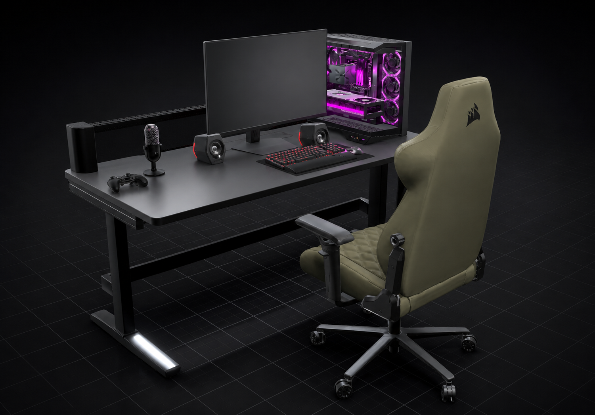
</div>
<div class="card-content">
<div class="hallmark">CUSTOM BUILD · BUILDCores</div>
<h3 class="product-name">Platform:6 Gaming Setup</h3>
<div class="specs">
<div class="spec-row"><span class="spec-label">CPU</span><span class="spec-val">Ryzen 9 9950X3D</span></div>
<div class="spec-row"><span class="spec-label">GPU</span><span class="spec-val">ROG Astral RTX 5090 32GB</span></div>
<div class="spec-row"><span class="spec-label">RAM</span><span class="spec-val">256GB DDR5-6000 RGB</span></div>
</div>
</div>
<div class="hidden-details" style="display:none;">
<div class="d-brand">CUSTOM BUILD // BUILDCores</div>
<div class="d-title">Platform:6 Gaming Setup</div>
<div class="d-why">A $16.7K full-room setup built around the 9950X3D, a 32GB RTX 5090, and an unapologetic 256GB of RGB memory.</div>
<div class="d-desc">A complete BuildCores setup with a darkFlash DY470 tower, Platform:6 desk, TC500 LUXE chair, Odyssey G7 display, and a full gaming and audio stack. <a href="https://www.buildcores.com/setup/WzqYrLzvE?share=true&amp;view=setup" rel="noopener" target="_blank">View the shared parts list</a>.</div>
<div class="d-spec" data-label="Processor">AMD Ryzen 9 9950X3D | 16 Cores / 32 Threads | 128MB 3D V-Cache</div><div class="d-spec" data-label="Graphics">ROG Astral GeForce RTX 5090 OC Edition | 32GB GDDR7</div><div class="d-spec" data-label="Case">darkFlash DY470 ATX Mid Tower | Black tempered glass</div><div class="d-spec" data-label="Motherboard">ASUS ROG STRIX X870E-E GAMING WIFI</div><div class="d-spec" data-label="Memory">G.Skill Trident Z5 Neo RGB | 256GB (4x64GB) DDR5-6000 CL36</div><div class="d-spec" data-label="Cooling">TRYX PANORAMA SE 360mm ARGB AIO | Lian Li Uni Fan SL-Infinity 120mm 3-pack</div><div class="d-spec" data-label="Storage">Samsung 990 Pro 4TB PCIe 4.0 NVMe + Samsung 990 EVO 4TB PCIe 5.0 NVMe (8TB total)</div><div class="d-spec" data-label="Power Supply">ASUS ROG THOR 1600T2 | 1600W | 80+ Titanium</div><div class="d-spec" data-label="Display">Corsair Xeneon 32UHD144 (32" 4K 144Hz IPS) + Dual Elgato Flex Arm Rig</div><div class="d-spec" data-label="Battery">AC Mains Powered (Dual Dedicated 120V/15A Circuits)</div><div class="d-spec" data-label="Desk &amp; Chair">CORSAIR Platform:6 Elevate Desk | TC500 LUXE Gaming Chair</div><div class="d-spec" data-label="Keyboards">Razer BlackWidow V3 Mini Phantom Edition | ASUS ROG Strix Scope II 96 RGB</div><div class="d-spec" data-label="Audio">Razer BlackShark V2 Pro (2023) + BlackShark V2 X | Razer Leviathan V2 + Edifier G2000</div><div class="d-spec" data-label="I/O">Dual 2.5GbE LAN | Wi-Fi 7 | 12x Rear USB-A/C | Front USB 3.2 Gen 2x2 Type-C | HDMI 2.1 | DP 2.1</div><div class="d-spec" data-label="Form Factor">Full Tower Custom Rig + Corsair Platform:6 Modular Motorized Sit-Stand Desk</div><div class="d-spec" data-label="Build Total">$16,671.47 total parts list</div></div>
</div>
<div class="card" data-brand="apple" data-cat="desktop" data-chapter="ULTIMATE RIGS" data-lot="030" data-name="mac studio (m4 ultra) apple · professional desktop apple workstation apple" data-status="wishlist">
<div class="lot-number">N° 030</div>
<div class="seal wishlist"><span class="dot"></span>WISHLIST</div>
<div class="img-box">

</div>
<div class="card-content">
<div class="hallmark">APPLE · PROFESSIONAL DESKTOP</div>
<h3 class="product-name">Mac Studio (M4 Ultra)</h3>
<div class="specs">
<div class="spec-row"><span class="spec-label">Processor</span><span class="spec-val">Apple M4 Ultra</span></div>
<div class="spec-row"><span class="spec-label">Memory</span><span class="spec-val">256GB Unified</span></div>
<div class="spec-row"><span class="spec-label">Storage</span><span class="spec-val">8TB NVMe SSD</span></div>
</div>
</div>
<div class="hidden-details" style="display:none;">
<div class="d-brand">APPLE // PROFESSIONAL DESKTOP</div>
<div class="d-title">Mac Studio (M4 Ultra)</div>
<div class="d-why">Fits in a lunchbox and outperforms workstations that cost several times more.</div>
<div class="d-desc">The M4 Ultra chip bridges two M4 Max dies for rendering and simulation performance.</div>
<div class="d-spec" data-label="Processor">Apple M4 Ultra | 32-Core CPU (24P + 8E) | 80-Core GPU | 64-Core Neural Engine</div><div class="d-spec" data-label="Graphics">80-Core Apple GPU | Hardware-accelerated Ray Tracing | 64-Core Neural Engine</div><div class="d-spec" data-label="Memory">256GB Unified Memory | 1.6TB/s Memory Bandwidth</div><div class="d-spec" data-label="Storage">8TB PCIe Gen 4 SSD (up to 7.4GB/s read)</div><div class="d-spec" data-label="Display">External: Up to 8x 6K displays @ 60Hz or 4x 8K displays @ 60Hz (Direct display not integrated)</div><div class="d-spec" data-label="Battery">AC Mains Powered (Desktop Workstation) | Internal 370W Power Supply</div><div class="d-spec" data-label="Camera &amp; Audio">Built-in speaker | 3.5mm Headphone Jack with advanced high-impedance support</div><div class="d-spec" data-label="I/O">6x Thunderbolt 5 (120Gb/s) | 10Gb Ethernet | HDMI 2.1 (8K) | 2x USB-A (5Gbps) | SDXC (UHS-II)</div><div class="d-spec" data-label="Form Factor">Extruded Aluminum Unibody (19.7 x 19.7 x 9.5 cm) | 3.6kg | Dual-fan thermal system</div></div>
</div>
</div>
</div>
<div class="section-wrapper" id="sec-peripheral">
<div class="chapter-head">
<span class="chapter-eyebrow">peripherals</span>
<h2 class="section-title"><span class="lang-pair"><span class="lang-zh" lang="zh-CN">装备与外设</span><span aria-hidden="true" class="lang-divider"> / </span><span class="lang-en" lang="en">Weapons &amp; peripherals</span></span><span class="section-count">(6 / 6 PIECES)</span></h2>
<div class="chapter-rule"></div>
</div>
<div class="grid">
<div class="card" data-brand="razer" data-cat="peripheral" data-chapter="WEAPONS &amp; PERIPHERALS" data-lot="031" data-name="deathadder v2 pro razer · for gamers. by gamers. esports grade razer" data-status="owned">
<div class="lot-number">N° 031</div>
<div class="seal owned"><span class="dot"></span>OWNED</div>
<div class="img-box">
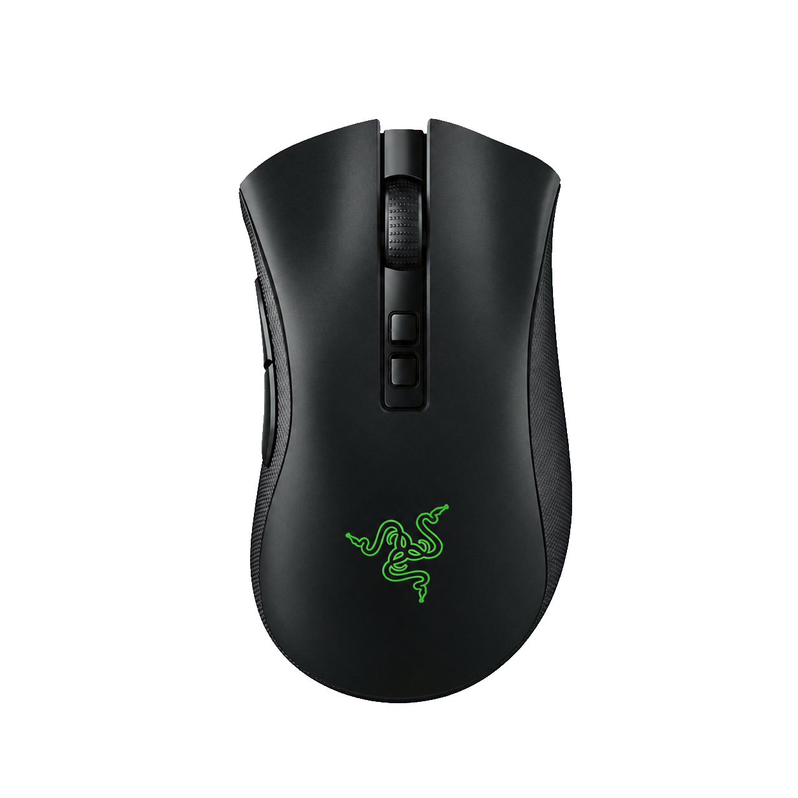
</div>
<div class="card-content">
<div class="hallmark">RAZER · FOR GAMERS. BY GAMERS.</div>
<h3 class="product-name">DeathAdder V2 Pro</h3>
<div class="specs">
<div class="spec-row"><span class="spec-label">Sensor</span><span class="spec-val">Focus+ 20K DPI</span></div>
<div class="spec-row"><span class="spec-label">Connection</span><span class="spec-val">HyperSpeed Wireless</span></div>
<div class="spec-row"><span class="spec-label">Weight</span><span class="spec-val">Ultra-light 88g</span></div>
</div>
</div>
<div class="hidden-details" style="display:none;">
<div class="d-brand">RAZER // FOR GAMERS. BY GAMERS.</div>
<div class="d-title">DeathAdder V2 Pro</div>
<div class="d-why">My daily driver. The ergonomics are perfect for my grip style and HyperSpeed wireless is basically wired latency.</div>
<div class="d-desc">A long-running ergonomic shape, updated with low-latency wireless connectivity.</div>
<div class="d-spec" data-label="Sensor">Razer Focus+ Optical Sensor | 20,000 DPI | 650 IPS</div>
<div class="d-spec" data-label="Switches">Razer Optical Mouse Switches Gen-2 | 70 Million Clicks</div>
<div class="d-spec" data-label="Connectivity">Razer HyperSpeed Wireless (2.4GHz) | Bluetooth | Wired Speedflex Cable</div>
<div class="d-spec" data-label="Battery Life">Up to 120 hours (Bluetooth) | 70 hours (HyperSpeed)</div>
<div class="d-spec" data-label="Form Factor">Right-Handed Ergonomic | 88g Weight</div>
</div>
</div>
<div class="card" data-brand="apple" data-cat="peripheral" data-chapter="WEAPONS &amp; PERIPHERALS" data-lot="032" data-name="pro display xdr 2 apple · reference display reference monitor apple" data-status="wishlist">
<div class="lot-number">N° 032</div>
<div class="seal wishlist"><span class="dot"></span>WISHLIST</div>
<div class="img-box">
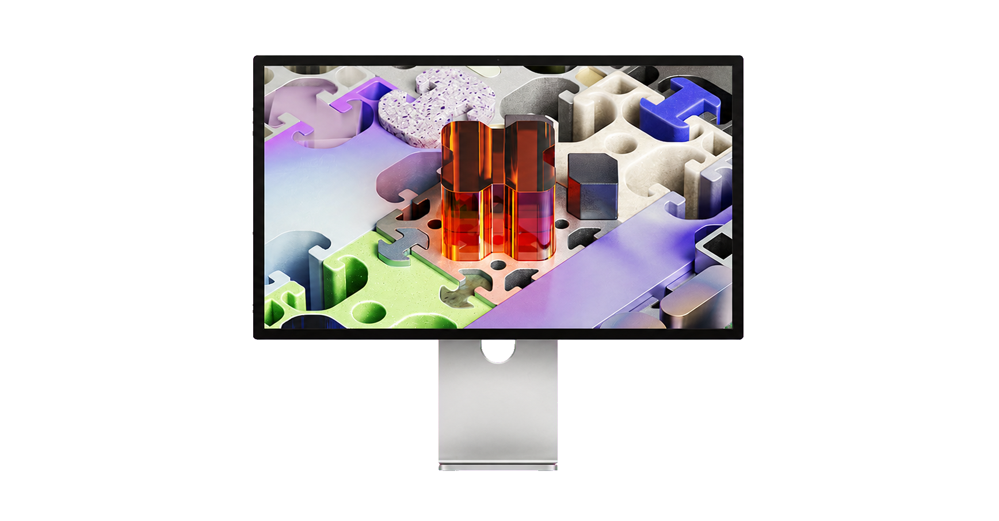
</div>
<div class="card-content">
<div class="hallmark">APPLE · REFERENCE DISPLAY</div>
<h3 class="product-name">Pro Display XDR 2</h3>
<div class="specs">
<div class="spec-row"><span class="spec-label">Panel</span><span class="spec-val">32" 6K Tandem OLED</span></div>
<div class="spec-row"><span class="spec-label">Refresh Rate</span><span class="spec-val">120Hz ProMotion</span></div>
<div class="spec-row"><span class="spec-label">Brightness</span><span class="spec-val">2000 nits Peak</span></div>
</div>
</div>
<div class="hidden-details" style="display:none;">
<div class="d-brand">APPLE // REFERENCE DISPLAY</div>
<div class="d-title">Pro Display XDR 2</div>
<div class="d-why">6K OLED reference panel. I don't need this spec, but I still want it.</div>
<div class="d-desc">A reference-monitor upgrade with a Tandem OLED panel and ProMotion up to 120Hz, built for HDR grading.</div>
<div class="d-spec" data-label="Display">32-inch Tandem OLED | 6016 x 3384 (6K)</div>
<div class="d-spec" data-label="Refresh Rate">ProMotion Adaptive Sync up to 120Hz</div>
<div class="d-spec" data-label="Brightness">1000 nits sustained | 2000 nits peak (HDR)</div>
<div class="d-spec" data-label="Contrast Ratio">1,000,000:1 | True Blacks</div>
<div class="d-spec" data-label="Build">Nano-texture glass | Pro Stand (Sold Separately)</div>
</div>
</div>
<div class="card" data-brand="apple" data-cat="peripheral" data-chapter="WEAPONS &amp; PERIPHERALS" data-lot="033" data-name="earpods apple · retro essential apple audio apple" data-status="owned">
<div class="lot-number">N° 033</div>
<div class="seal owned"><span class="dot"></span>OWNED</div>
<div class="img-box">
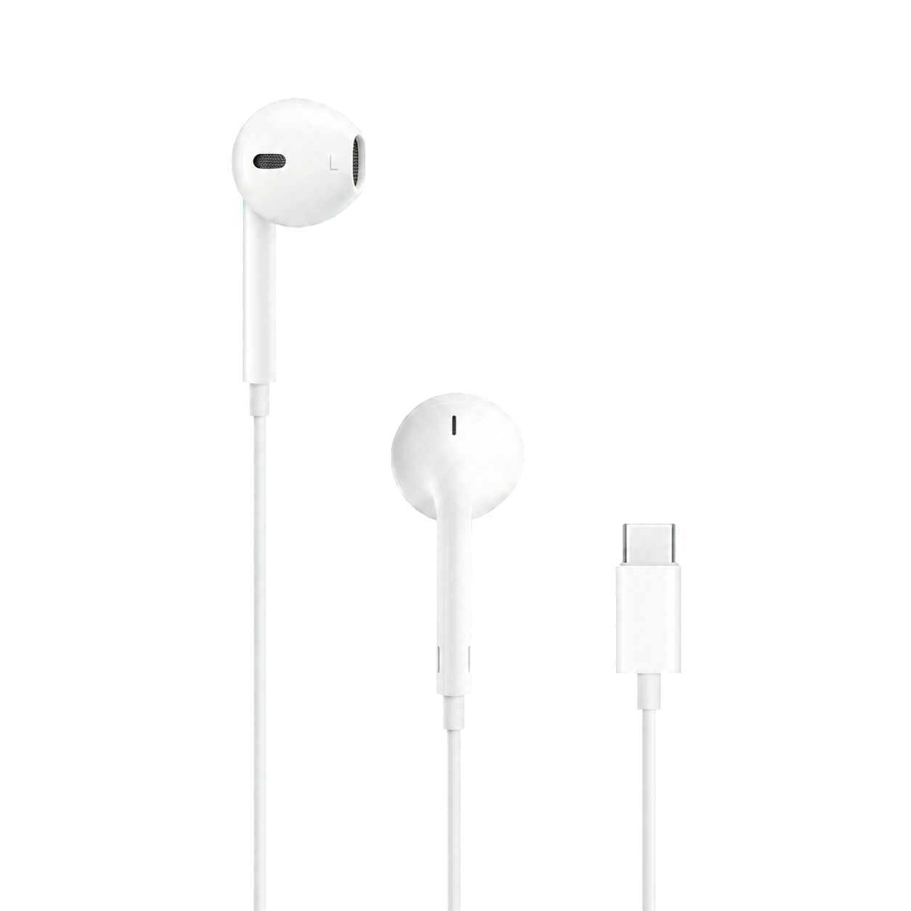
</div>
<div class="card-content">
<div class="hallmark">APPLE · RETRO ESSENTIAL</div>
<h3 class="product-name">EarPods</h3>
<div class="specs">
<div class="spec-row"><span class="spec-label">Type</span><span class="spec-val">Wired In-Ear</span></div>
<div class="spec-row"><span class="spec-label">Connection</span><span class="spec-val">USB-C / Lightning / 3.5mm</span></div>
<div class="spec-row"><span class="spec-label">Feature</span><span class="spec-val">Zero Latency. No Battery.</span></div>
</div>
</div>
<div class="hidden-details" style="display:none;">
<div class="d-brand">APPLE // RETRO ESSENTIAL</div>
<div class="d-title">EarPods</div>
<div class="d-why">Never left. No ANC, no spatial audio, just crystal clear call quality and zero latency. Underrated forever.</div>
<div class="d-desc">Wired earphones that need no charging and add no latency — plug and play.</div>
<div class="d-spec" data-label="Acoustics">Custom tuned drivers | Deeper, richer bass tones</div>
<div class="d-spec" data-label="Design">Defined by the geometry of the ear for enhanced comfort</div>
<div class="d-spec" data-label="Controls">Built-in remote | Adjust volume, control playback, answer calls</div>
<div class="d-spec" data-label="Reliability">Zero latency | Infinite battery life | Greater protection from sweat/water</div>
</div>
</div>
<div class="card" data-brand="samsung" data-cat="peripheral" data-chapter="WEAPONS &amp; PERIPHERALS" data-lot="034" data-name="galaxy buds 2 samsung · tws earbuds galaxy audio samsung" data-status="wishlist">
<div class="lot-number">N° 034</div>
<div class="seal wishlist"><span class="dot"></span>WISHLIST</div>
<div class="img-box">
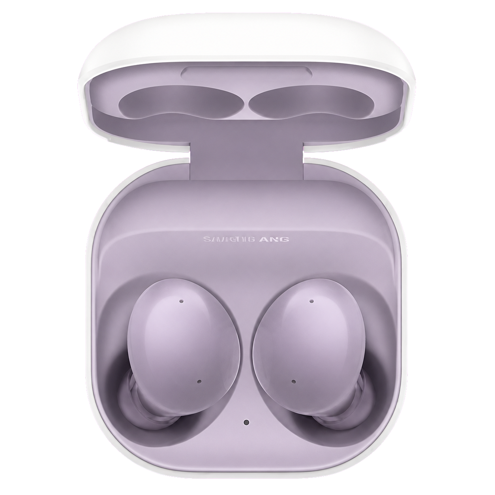
</div>
<div class="card-content">
<div class="hallmark">SAMSUNG · TWS EARBUDS</div>
<h3 class="product-name">Galaxy Buds 2</h3>
<div class="specs">
<div class="spec-row"><span class="spec-label">Type</span><span class="spec-val">TWS In-Ear</span></div>
<div class="spec-row"><span class="spec-label">Feature</span><span class="spec-val">Active Noise Canceling</span></div>
<div class="spec-row"><span class="spec-label">Weight</span><span class="spec-val">5.0g per bud</span></div>
</div>
</div>
<div class="hidden-details" style="display:none;">
<div class="d-brand">SAMSUNG // TWS EARBUDS</div>
<div class="d-title">Galaxy Buds 2</div>
<div class="d-why">Compact, clean ANC, and that galaxy ecosystem lock-in makes it seamless. Simple done right.</div>
<div class="d-desc">Compact, with active noise cancelling and a pebble-shaped case.</div>
<div class="d-spec" data-label="Audio">Dynamic 2-way speakers (Woofer + Tweeter) | Sound by AKG</div>
<div class="d-spec" data-label="ANC">Active Noise Canceling cuts background noise by up to 98%</div>
<div class="d-spec" data-label="Microphones">3 mics + VPU (Voice Pickup Unit) for clear calls</div>
<div class="d-spec" data-label="Battery">Up to 20h total playback with ANC on (with charging case)</div>
<div class="d-spec" data-label="Connectivity">Bluetooth 5.2 | Auto Switch between Galaxy devices</div>
<div class="d-spec" data-label="Build">IPX2 water resistance | 5.0g per bud | 41.2g charging case</div></div>
</div>
<div class="card" data-brand="samsung" data-cat="peripheral" data-chapter="WEAPONS &amp; PERIPHERALS" data-lot="035" data-name="galaxy buds 3 samsung · next-gen audio galaxy ai audio samsung" data-status="wishlist">
<div class="lot-number">N° 035</div>
<div class="seal wishlist"><span class="dot"></span>WISHLIST</div>
<div class="img-box">
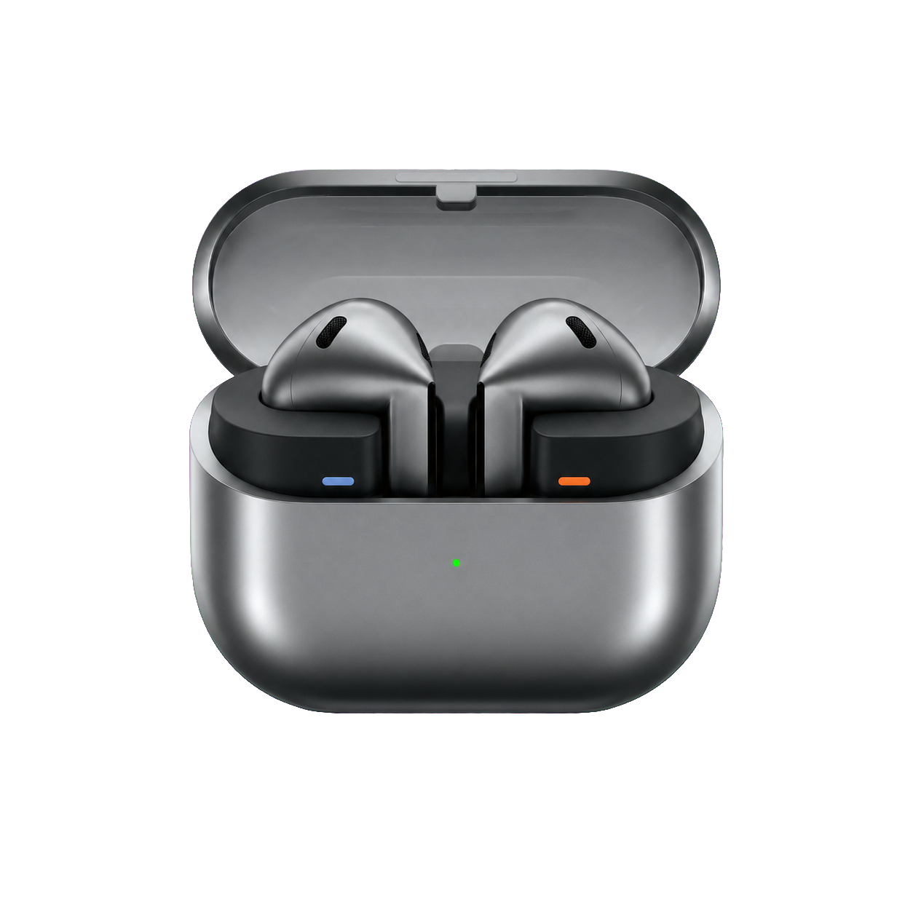
</div>
<div class="card-content">
<div class="hallmark">SAMSUNG · NEXT-GEN AUDIO</div>
<h3 class="product-name">Galaxy Buds 3</h3>
<div class="specs">
<div class="spec-row"><span class="spec-label">Design</span><span class="spec-val">Blade Design (Stem)</span></div>
<div class="spec-row"><span class="spec-label">Audio</span><span class="spec-val">24-bit Hi-Fi Sound</span></div>
<div class="spec-row"><span class="spec-label">Feature</span><span class="spec-val">Galaxy AI Translate</span></div>
</div>
</div>
<div class="hidden-details" style="display:none;">
<div class="d-brand">SAMSUNG // NEXT-GEN AUDIO</div>
<div class="d-title">Galaxy Buds 3</div>
<div class="d-why">Blade stem design + Galaxy AI real-time interpreter. If I'm on calls all day, these are the move.</div>
<div class="d-desc">A new "Blade" stem design with better controls and mics, plus Galaxy AI real-time translation.</div>
<div class="d-spec" data-label="Audio Architecture">11mm Dynamic Driver | 24-bit / 96kHz Hi-Fi Audio (SSC Codec)</div>
<div class="d-spec" data-label="Design">New Blade Design | Pinch &amp; Swipe Controls | Open-type fit</div>
<div class="d-spec" data-label="Smart Features">Adaptive EQ | Adaptive ANC | Galaxy AI Real-time Interpreter</div>
<div class="d-spec" data-label="Durability">IP57 Water &amp; Dust Resistance</div>
<div class="d-spec" data-label="Connectivity">Bluetooth 5.4 | Auracast Support</div>
<div class="d-spec" data-label="Battery">Up to 5h (ANC on) / 6h (ANC off) | 24h total with case | Wireless Qi</div><div class="d-spec" data-label="ANC">Adaptive ANC | Ambient Sound Mode | Sound Optimization</div><div class="d-spec" data-label="Build">IP57 water &amp; dust resistance | 4.7g per bud | 46.5g case</div></div>
</div>
<div class="card" data-brand="nothing" data-cat="peripheral" data-chapter="WEAPONS &amp; PERIPHERALS" data-lot="036" data-name="nothing ear a nothing · everyday audio wireless earbuds" data-status="wishlist">
<div class="lot-number">N° 036</div>
<div class="seal wishlist"><span class="dot"></span>WISHLIST</div>
<div class="img-box">

</div>
<div class="card-content">
<div class="hallmark">NOTHING · EVERYDAY AUDIO</div>
<h3 class="product-name">Nothing Ear (a)</h3>
<div class="specs">
<div class="spec-row"><span class="spec-label">Driver</span><span class="spec-val">11mm Dynamic Driver</span></div>
<div class="spec-row"><span class="spec-label">ANC</span><span class="spec-val">Adaptive · up to 45dB</span></div>
<div class="spec-row"><span class="spec-label">Battery</span><span class="spec-val">Up to 42.5h with case</span></div>
</div>
</div>
<div class="hidden-details" style="display:none;">
<div class="d-brand">NOTHING // EVERYDAY AUDIO</div>
<div class="d-title">Nothing Ear (a)</div>
<div class="d-why">A playful everyday pair that brings proper ANC, good battery life, and a little visual personality to the shortlist.</div>
<div class="d-desc">Nothing Ear (a) balances a light transparent design with adaptive noise cancellation and broad codec support.</div>
<div class="d-spec" data-label="Audio Architecture">11mm Dynamic Driver | PMI + TPU diaphragm</div>
<div class="d-spec" data-label="Noise Cancellation">Adaptive ANC | Up to 45dB | Transparency Mode</div>
<div class="d-spec" data-label="Battery">Up to 9.5h earbuds | 42.5h with case | 10 min = 10h</div>
<div class="d-spec" data-label="Connectivity">Bluetooth 5.3 | AAC / SBC / LDAC | Dual Connection</div>
<div class="d-spec" data-label="Protection">IP54 earbuds | IPX2 case | 4.8g per earbud</div>
<div class="d-spec" data-label="Build">IP54 earbuds | IPX2 case | 4.8g per earbud | 39.6g case</div><div class="d-spec" data-label="ANC">Smart ANC with 3 levels | Up to 45dB depth | Transparency Mode</div></div>
</div>
</div>
</div>
</main>
<footer class="site-footer">
<div class="footer-line" data-en="TECH ARSENAL / Catalogue" data-zh="TECH ARSENAL / 总目录">tech arsenal / 总目录</div>
</footer>
<div class="empty-state" hidden="" id="emptyState">
<h2 data-en="No records match that search." data-zh="没有匹配记录">No records match that search.</h2>
<p data-en="Try a different device name, brand, specification, or chapter. The catalogue will return every record when the search is cleared." data-zh="试试其他设备名称、品牌、规格或章节。清除搜索后，目录会恢复显示全部记录。">Try a different device name, brand, specification, or chapter. The catalogue will return every record when the search is cleared.</p>
</div>
<script src="arsenal-site.js"></script>
<script>
        function applyCardImageFallback(img) {
            if (img.dataset.fallbackApplied) return;
            const card = img.closest(".card");
            const box = img.closest(".img-box");
            if (!card || !box) return;
            img.dataset.fallbackApplied = "true";
            box.classList.add("is-missing-image");
            box.dataset.fallback = card.querySelector(".product-name")?.textContent.trim() || img.alt || "Archive object";
            img.src = "assets/images/arsenal-spark.png";
        }

        document.querySelectorAll(".card .img-box img").forEach((img) => {
            img.addEventListener("error", () => applyCardImageFallback(img), {once: true});
            if (img.complete && img.naturalWidth === 0) applyCardImageFallback(img);
        });

        const filterButtons = [...document.querySelectorAll(".filter-btn")];
        const sections = [...document.querySelectorAll(".section-wrapper")];
        const searchInput = document.getElementById("searchInput");
        const resultSummary = document.getElementById("resultSummary");
        const controlBar = document.querySelector(".control-bar");
        const emptyState = document.getElementById("emptyState");
        const dossier = document.getElementById("techDossier");
        const dossierBackdrop = dossier.querySelector("[data-dossier-dismiss]");
        const dossierVisual = dossier.querySelector(".dossier-visual");
        const dossierBody = dossier.querySelector(".dossier-body");
        const dossierImage = document.getElementById("dossierImage");
        const dossierImageNote = document.getElementById("dossierImageNote");
        const dossierBrand = document.getElementById("dossierBrand");
        const dossierStatus = document.getElementById("dossierStatus");
        const dossierTitle = document.getElementById("dossierTitle");
        const dossierLot = document.getElementById("dossierLot");
        const dossierWhy = document.getElementById("dossierWhy");
        const dossierDesc = document.getElementById("dossierDesc");
        const dossierSpecs = document.getElementById("dossierSpecs");
        const dossierClose = document.getElementById("dossierClose");
        let activeFilter = "all";
        let selectedCard = null;
        let dossierInvoker = null;
        const cards = [...document.querySelectorAll(".card")];

        dossierImage.addEventListener("error", () => {
            dossierVisual.classList.add("is-missing-image");
            dossierImageNote.hidden = false;
            if (dossierImage.dataset.fallbackApplied) return;
            dossierImage.dataset.fallbackApplied = "true";
            dossierImage.src = "assets/images/arsenal-spark.png";
        });

        function addRecordActions() {
            cards.forEach((card) => {
                card.tabIndex = 0;
                card.setAttribute("role", "button");
                card.setAttribute("aria-haspopup", "dialog");
                card.setAttribute("aria-controls", "techDossier");
                card.setAttribute("aria-expanded", "false");
                const productName = card.querySelector(".product-name")?.textContent.trim() || "device";
                card.setAttribute("aria-label", "查看 " + productName + " 档案 / View " + productName + " dossier");
                const content = card.querySelector(".card-content");
                if (content && !content.querySelector(".record-action")) {
                    const action = document.createElement("span");
                    action.className = "record-action";
                    action.setAttribute("aria-hidden", "true");
                    action.innerHTML = window.arsenalBilingual("查看档案", "View dossier");
                    content.appendChild(action);
                }
            });
        }

        function getSearchText(card) {
            return ((card.dataset.name || "") + " " + card.textContent).toLowerCase();
        }

        function updateLead(section) {
            section.querySelectorAll(".card").forEach((card) => card.classList.remove("is-lead"));
            const firstVisible = [...section.querySelectorAll(".card")].find((card) => !card.hidden);
            if (firstVisible) firstVisible.classList.add("is-lead");
        }

        function applyFilters({scrollToResult = false} = {}) {
            const query = searchInput.value.trim().toLowerCase();
            let visibleTotal = 0;
            let visibleChapters = 0;

            sections.forEach((section) => {
                const categoryMatch = activeFilter === "all" || section.id === "sec-" + activeFilter;
                let visibleInSection = 0;
                section.querySelectorAll(".card").forEach((card) => {
                    const matches = categoryMatch && (!query || getSearchText(card).includes(query));
                    card.hidden = !matches;
                    if (matches) visibleInSection += 1;
                });
                section.hidden = !categoryMatch || visibleInSection === 0;
                if (visibleInSection) {
                    visibleTotal += visibleInSection;
                    visibleChapters += 1;
                    updateLead(section);
                }
            });

            if (selectedCard && selectedCard.hidden) closeTechDossier();

                emptyState.hidden = visibleTotal !== 0;
                controlBar.classList.toggle("has-query", Boolean(query) || activeFilter !== "all");
                resultSummary.innerHTML = visibleTotal === 0
                ? window.arsenalBilingual("没有匹配记录", "No matching records")
                : window.arsenalBilingual(
                    "显示 " + visibleTotal + " 条记录，分布于 " + visibleChapters + " 个章节",
                    "Showing " + visibleTotal + " record" + (visibleTotal === 1 ? "" : "s") + " across " + visibleChapters + " chapter" + (visibleChapters === 1 ? "" : "s")
                );

            if (scrollToResult && visibleTotal) {
                const firstSection = sections.find((section) => !section.hidden);
                if (firstSection) {
                    const behavior = window.matchMedia("(prefers-reduced-motion: reduce)").matches ? "auto" : "smooth";
                    firstSection.scrollIntoView({behavior, block: "start"});
                }
            }
        }

        function setActiveFilter(button) {
            filterButtons.forEach((item) => {
                const active = item === button;
                item.classList.toggle("active", active);
                item.setAttribute("aria-pressed", String(active));
            });
            activeFilter = button.dataset.filter;
            applyFilters({scrollToResult: activeFilter !== "all"});
        }

        filterButtons.forEach((button) => button.addEventListener("click", () => setActiveFilter(button)));
        searchInput.addEventListener("input", () => applyFilters());

        document.querySelectorAll(".chapter-index a").forEach((link) => {
            link.addEventListener("click", () => {
                const target = document.querySelector(link.getAttribute("href"));
                if (!target) return;
                const matchingFilter = filterButtons.find((button) => button.dataset.filter === target.id.replace("sec-", ""));
                if (matchingFilter) setActiveFilter(matchingFilter);
            });
        });

        function openDossier(card) {
            const details = card.querySelector(".hidden-details");
            if (!details) return;
            const getText = (selector) => {
                const node = details.querySelector(selector);
                return node ? node.textContent.trim() : "";
            };

            dossierInvoker = card;
            selectedCard = card;
            cards.forEach((item) => item.setAttribute("aria-expanded", String(item === card)));
            const sourceImage = card.querySelector(".img-box img");
            const sourceImageBox = sourceImage?.closest(".img-box");
            const isMissingImage = sourceImageBox?.classList.contains("is-missing-image");
            const isPlaceholderImage = sourceImage?.hasAttribute("data-placeholder-image") || isMissingImage;
            delete dossierImage.dataset.fallbackApplied;
            dossierVisual.classList.toggle("is-missing-image", Boolean(isMissingImage));
            dossierImageNote.hidden = !isMissingImage;
            if (isMissingImage) {
                dossierImage.dataset.fallbackApplied = "true";
                dossierImage.src = "assets/images/arsenal-spark.png";
            } else {
                dossierImage.src = sourceImage?.currentSrc || sourceImage?.src || "assets/images/arsenal-spark.png";
            }
            dossierImage.alt = sourceImage?.alt || getText(".d-title");
            dossierImage.classList.toggle("is-placeholder", Boolean(isPlaceholderImage));
            dossierBrand.textContent = getText(".d-brand");
            dossierTitle.textContent = getText(".d-title");
            dossierLot.textContent = "N° " + (card.dataset.lot || "") + " · " + (card.dataset.chapter || "");
            dossierWhy.textContent = getText(".d-why");
            dossierDesc.textContent = getText(".d-desc");

            const status = card.dataset.status === "owned" ? "owned" : "wishlist";
            dossierStatus.className = "dossier-status " + status;
            dossierStatus.innerHTML = window.arsenalBilingual(status === "owned" ? "已入藏" : "关注中", status === "owned" ? "In collection" : "Pursuing");

            dossierSpecs.innerHTML = "";
            details.querySelectorAll(".d-spec").forEach((spec) => {
                const row = document.createElement("div");
                row.className = "dossier-spec";
                const label = document.createElement("span");
                label.className = "dossier-spec-label";
                label.textContent = spec.dataset.label || "Specification";
                const value = document.createElement("span");
                value.className = "dossier-spec-value";
                value.innerHTML = spec.innerHTML;
                row.append(label, value);
                dossierSpecs.appendChild(row);
            });

            dossierBody.scrollTop = 0;
            const scrollbarGap = Math.max(0, window.innerWidth - document.documentElement.clientWidth);
            document.documentElement.classList.add("dossier-open");
            document.body.classList.add("dossier-open");
            document.body.style.setProperty("--dossier-scrollbar-gap", `${scrollbarGap}px`);
            dossier.hidden = false;
            dossierClose.focus({preventScroll: true});
            requestAnimationFrame(() => {
                if (!dossier.hidden && selectedCard === card) dossier.classList.add("is-open");
            });
        }

        function isVisibleFocusable(element) {
            if (!(element instanceof HTMLElement) || !element.isConnected || element.hidden || element.disabled || element.getAttribute("aria-disabled") === "true") return false;
            const style = window.getComputedStyle(element);
            return style.display !== "none" && style.visibility !== "hidden" && element.getClientRects().length > 0;
        }

        function closeTechDossier() {
            if (dossier.hidden) return;
            const restoreTarget = dossierInvoker;
            dossier.hidden = true;
            dossier.classList.remove("is-open");
            document.documentElement.classList.remove("dossier-open");
            document.body.classList.remove("dossier-open");
            document.body.style.removeProperty("--dossier-scrollbar-gap");
            if (selectedCard) {
                selectedCard.setAttribute("aria-expanded", "false");
            }
            selectedCard = null;
            dossierInvoker = null;
            if (isVisibleFocusable(restoreTarget)) restoreTarget.focus({preventScroll: true});
        }

        cards.forEach((card) => {
            card.addEventListener("click", () => openDossier(card));
            card.addEventListener("keydown", (event) => {
                if (event.key === "Enter" || event.key === " ") {
                    event.preventDefault();
                    openDossier(card);
                }
            });
        });

        dossierClose.addEventListener("click", closeTechDossier);
        dossier.addEventListener("click", (event) => {
            if (event.target === dossier || event.target === dossierBackdrop) closeTechDossier();
        });
        dossier.addEventListener("keydown", (event) => {
            if (dossier.hidden || event.key !== "Tab") return;
            const focusable = [...dossier.querySelectorAll("a[href], button:not([disabled]), [tabindex]:not([tabindex='-1'])")]
                .filter((element) => isVisibleFocusable(element) && !element.closest("[aria-hidden='true']"));
            if (!focusable.length) {
                event.preventDefault();
                dossierClose.focus({preventScroll: true});
                return;
            }
            const first = focusable[0];
            const last = focusable[focusable.length - 1];
            if (!dossier.contains(document.activeElement)) {
                event.preventDefault();
                first.focus();
            } else if (event.shiftKey && document.activeElement === first) {
                event.preventDefault();
                last.focus();
            } else if (!event.shiftKey && document.activeElement === last) {
                event.preventDefault();
                first.focus();
            }
        });
        document.addEventListener("keydown", (event) => {
            if (event.key === "Escape" && !dossier.hidden) {
                event.preventDefault();
                closeTechDossier();
                return;
            }
            if (event.key === "/" && dossier.hidden && document.activeElement !== searchInput && !["INPUT", "TEXTAREA", "SELECT"].includes(document.activeElement.tagName)) {
                event.preventDefault();
                searchInput.focus();
            }
        });

        addRecordActions();
        applyFilters();

        // ===== 清单/图册视图切换 — 见 implementation-plan.md §3.1 =====
        const VIEW_KEY = "arsenal-view-mode";
        const catalogueMain = document.getElementById("catalogue-main");
        const viewButtons = [...document.querySelectorAll(".view-btn")];

        function applyView(mode) {
            catalogueMain.classList.toggle("is-list", mode === "list");
            viewButtons.forEach((btn) => {
                const active = btn.dataset.view === mode;
                btn.classList.toggle("active", active);
                btn.setAttribute("aria-pressed", String(active));
            });
            try { localStorage.setItem(VIEW_KEY, mode); } catch (e) { /* storage blocked, ignore */ }
        }

        viewButtons.forEach((btn) => {
            btn.addEventListener("click", () => applyView(btn.dataset.view));
        });

        let initialView = "list";
        try {
            const savedView = localStorage.getItem(VIEW_KEY);
            if (savedView === "list" || savedView === "gallery") {
                initialView = savedView;
            }
        } catch (e) { /* storage blocked, ignore */ }
        applyView(initialView);
    </script>
</body>
</html>
```

### `topology.html`
```html
<!DOCTYPE html>
<html lang="zh-CN">
<head>
    <meta charset="UTF-8">
    <meta name="viewport" content="width=device-width, initial-scale=1.0">
    <title>TECH ARSENAL — 工位与连接 / Setup</title>
    <link rel="stylesheet" href="arsenal-pages.css">
    <style>
        .setup-intro {
            font-size: 0.95rem;
            line-height: 1.7;
            color: var(--muted, #a2adbf);
            margin: 24px 0 28px;
            max-width: 820px;
            text-wrap: pretty;
        }

        /* ===== 空间分区标题 ===== */
        .zone-header {
            display: flex;
            align-items: center;
            gap: 12px;
            margin: 36px 0 16px;
        }

        .zone-header:first-of-type {
            margin-top: 12px;
        }

        .zone-num {
            font-family: var(--mono, monospace);
            font-size: 0.68rem;
            letter-spacing: 0.1em;
            color: var(--accent, #6f86ff);
            background: rgba(111, 134, 255, 0.1);
            border: 1px solid rgba(111, 134, 255, 0.22);
            padding: 2px 8px;
            border-radius: 3px;
            font-weight: 600;
        }

        .zone-title {
            font-size: 0.92rem;
            font-weight: 600;
            color: var(--text, #edf2fb);
            letter-spacing: -0.01em;
        }

        .zone-line {
            flex: 1;
            height: 1px;
            background: var(--line, rgba(160, 176, 204, 0.12));
        }

        /* ===== 3列对称网格系统 ===== */
        .zone-grid {
            display: grid;
            grid-template-columns: repeat(3, 1fr);
            gap: 16px;
            margin-bottom: 24px;
        }

        /* ===== 通用卡片规范 ===== */
        .ring-card {
            background: linear-gradient(180deg, rgba(20, 27, 40, 0.92) 0%, rgba(14, 20, 30, 0.92) 100%);
            border: 1px solid var(--line-strong, rgba(160, 176, 204, 0.16));
            border-radius: 8px;
            padding: 18px 20px;
            display: flex;
            flex-direction: column;
            gap: 12px;
            box-shadow: inset 0 1px 0 rgba(255, 255, 255, 0.04), 0 4px 16px -2px rgba(0, 0, 0, 0.32);
            transition: border-color 0.18s ease, transform 0.18s ease, box-shadow 0.18s ease;
            position: relative;
        }

        .ring-card:hover {
            border-color: rgba(111, 134, 255, 0.36);
            transform: translateY(-2px);
            box-shadow: inset 0 1px 0 rgba(255, 255, 255, 0.06), 0 8px 24px -4px rgba(0, 0, 0, 0.45);
        }

        .ring-card:active {
            transform: translateY(0);
        }

        .ring-card-header {
            display: flex;
            align-items: center;
            gap: 14px;
        }

        .ring-img-box {
            width: 52px;
            height: 52px;
            border-radius: 6px;
            background: rgba(255, 255, 255, 0.025);
            border: 1px solid var(--line, rgba(160, 176, 204, 0.12));
            display: flex;
            align-items: center;
            justify-content: center;
            flex-shrink: 0;
            overflow: hidden;
            padding: 4px;
        }

        .ring-img-box img {
            max-width: 100%;
            max-height: 100%;
            object-fit: contain;
            display: block;
        }

        .ring-header-info {
            display: flex;
            flex-direction: column;
            gap: 4px;
            min-width: 0;
            flex: 1;
        }

        .ring-title-row {
            display: flex;
            align-items: center;
            justify-content: space-between;
            gap: 8px;
        }

        .ring-device-title {
            font-size: 1.02rem;
            font-weight: 600;
            color: var(--text, #edf2fb);
            margin: 0;
            letter-spacing: -0.01em;
            font-feature-settings: "tnum";
            font-variant-numeric: tabular-nums;
            text-wrap: balance;
            white-space: nowrap;
            overflow: hidden;
            text-overflow: ellipsis;
        }

        .ring-role-badge {
            font-family: var(--mono, monospace);
            font-size: 0.65rem;
            letter-spacing: 0.06em;
            text-transform: uppercase;
            color: var(--accent-2, #91a5ff);
            background: rgba(111, 134, 255, 0.1);
            border: 1px solid rgba(111, 134, 255, 0.2);
            padding: 2px 7px;
            border-radius: 3px;
            white-space: nowrap;
            flex-shrink: 0;
        }

        .ring-device-duty {
            font-size: 0.85rem;
            color: var(--muted, #a2adbf);
            line-height: 1.55;
            margin: 0;
            text-wrap: pretty;
        }

        .ring-connect-pill {
            display: flex;
            align-items: center;
            gap: 7px;
            margin-top: auto;
            padding-top: 10px;
            border-top: 1px solid var(--line, rgba(160, 176, 204, 0.1));
            font-family: var(--mono, monospace);
            font-size: 0.72rem;
            font-variant-numeric: tabular-nums;
            color: var(--muted-2, #7f8ca2);
            white-space: nowrap;
            overflow: hidden;
            text-overflow: ellipsis;
        }

        /* 静态指示圆点，无呼吸灯 */
        .ring-connect-dot {
            width: 5px;
            height: 5px;
            border-radius: 50%;
            background: var(--accent, #6f86ff);
            flex-shrink: 0;
        }

        /* ===== ZONE 01: 桌面联动核心大卡 (Mac Studio + XDR 2) ===== */
        .desk-core-card {
            grid-column: span 2;
            background: linear-gradient(180deg, rgba(22, 30, 44, 0.94) 0%, rgba(15, 21, 31, 0.94) 100%);
            border: 1px solid var(--line-strong, rgba(160, 176, 204, 0.24));
            border-radius: 8px;
            padding: 20px 22px;
            display: flex;
            flex-direction: column;
            gap: 14px;
            box-shadow: inset 0 1px 0 rgba(255, 255, 255, 0.05), 0 4px 20px -2px rgba(0, 0, 0, 0.38);
            transition: border-color 0.18s ease, transform 0.18s ease, box-shadow 0.18s ease;
        }

        .desk-core-card:hover {
            border-color: rgba(111, 134, 255, 0.42);
            transform: translateY(-2px);
            box-shadow: inset 0 1px 0 rgba(255, 255, 255, 0.07), 0 10px 28px -4px rgba(0, 0, 0, 0.5);
        }

        .desk-core-card:active {
            transform: translateY(0);
        }

        .desk-core-header {
            display: flex;
            align-items: center;
            justify-content: space-between;
            gap: 12px;
        }

        .desk-core-label {
            font-size: 0.82rem;
            font-weight: 600;
            color: var(--text, #edf2fb);
            display: flex;
            align-items: center;
            gap: 8px;
        }

        .desk-core-icon {
            color: var(--accent, #6f86ff);
            display: flex;
            align-items: center;
        }

        .desk-core-status {
            font-family: var(--mono, monospace);
            font-size: 0.68rem;
            letter-spacing: 0.04em;
            color: var(--accent-2, #91a5ff);
            background: rgba(111, 134, 255, 0.08);
            border: 1px solid rgba(111, 134, 255, 0.2);
            padding: 2px 8px;
            border-radius: 3px;
            display: flex;
            align-items: center;
            gap: 6px;
        }

        .status-dot-static {
            width: 5px;
            height: 5px;
            border-radius: 50%;
            background: var(--accent, #6f86ff);
            flex-shrink: 0;
        }

        .duo-container {
            display: grid;
            grid-template-columns: 1fr auto 1.35fr;
            gap: 16px;
            align-items: center;
            background: rgba(0, 0, 0, 0.26);
            border: 1px solid var(--line, rgba(160, 176, 204, 0.1));
            border-radius: 6px;
            padding: 16px 18px;
        }

        .duo-unit {
            display: flex;
            flex-direction: column;
            gap: 8px;
        }

        .duo-unit-top {
            display: flex;
            align-items: center;
            gap: 12px;
        }

        .duo-unit-title {
            font-size: 1.02rem;
            font-weight: 600;
            color: var(--text, #edf2fb);
            margin: 0;
            font-feature-settings: "tnum";
            font-variant-numeric: tabular-nums;
        }

        .duo-unit-badge {
            font-family: var(--mono, monospace);
            font-size: 0.62rem;
            letter-spacing: 0.05em;
            color: var(--accent-2, #91a5ff);
            background: rgba(111, 134, 255, 0.1);
            border: 1px solid rgba(111, 134, 255, 0.18);
            padding: 2px 6px;
            border-radius: 3px;
            white-space: nowrap;
        }

        .duo-unit-duty {
            font-size: 0.83rem;
            color: var(--muted, #a2adbf);
            line-height: 1.5;
            margin: 0;
            text-wrap: pretty;
        }

        .duo-bridge {
            display: flex;
            flex-direction: column;
            align-items: center;
            gap: 6px;
            padding: 0 4px;
        }

        .duo-bridge-pill {
            font-family: var(--mono, monospace);
            font-size: 0.65rem;
            letter-spacing: 0.04em;
            font-variant-numeric: tabular-nums;
            color: var(--accent-2, #91a5ff);
            background: rgba(111, 134, 255, 0.1);
            border: 1px solid rgba(111, 134, 255, 0.24);
            border-radius: 12px;
            padding: 3px 9px;
            white-space: nowrap;
            display: inline-flex;
            align-items: center;
            gap: 5px;
        }

        .duo-bridge-pill svg {
            color: var(--accent, #6f86ff);
        }

        .duo-bridge-line {
            width: 44px;
            height: 1px;
            background: linear-gradient(90deg, transparent, rgba(111, 134, 255, 0.4), transparent);
        }

        .desk-core-footer {
            font-family: var(--mono, monospace);
            font-size: 0.72rem;
            font-variant-numeric: tabular-nums;
            color: var(--muted-2, #7f8ca2);
            display: flex;
            align-items: center;
            gap: 7px;
            padding-top: 6px;
            border-top: 1px solid var(--line, rgba(160, 176, 204, 0.1));
        }

        .setup-outro {
            color: var(--muted-2, #7f8ca2);
            font-size: 0.88rem;
            line-height: 1.7;
            margin: 16px 0 48px;
            padding-left: 14px;
            border-left: 2px solid var(--accent, #6f86ff);
            text-wrap: pretty;
        }

        /* 键盘聚焦支持 (Accessibility a11y) */
        a.page-link:focus-visible,
        a.back-link:focus-visible {
            outline: 2px solid var(--accent, #6f86ff);
            outline-offset: 3px;
        }

        /* 响应式适配 */
        @media (max-width: 1024px) {
            .zone-grid {
                grid-template-columns: repeat(auto-fit, minmax(280px, 1fr));
            }
            .desk-core-card {
                grid-column: span 1;
            }
            .duo-container {
                grid-template-columns: 1fr;
                gap: 14px;
            }
            .duo-bridge {
                flex-direction: row;
                justify-content: center;
                padding: 4px 0;
            }
            .duo-bridge-line {
                width: 32px;
            }
        }

        /* 遵循系统无动画偏好 */
        @media (prefers-reduced-motion: reduce) {
            .ring-card, .desk-core-card {
                transition: none;
                transform: none !important;
            }
        }
    </style>
</head>
<body class="catalogue-page">
    <header class="header site-header">
        <div class="header-top top-row">
            <a href="index.html" class="back-link home-mark-link" aria-label="返回首页 / Back to home" title="返回首页 / Back to home"></a>
            <nav class="page-nav" aria-label="Site navigation / 站点导航">
                <a class="page-link" href="index.html"><span class="lang-pair"><span class="lang-zh" lang="zh-CN">首页</span><span class="lang-divider" aria-hidden="true"> / </span><span class="lang-en" lang="en">Home</span></span></a>
                <a class="page-link" href="tech-arsenal.html"><span class="lang-pair"><span class="lang-zh" lang="zh-CN">总目录</span><span class="lang-divider" aria-hidden="true"> / </span><span class="lang-en" lang="en">Catalogue</span></span></a>
                <a class="page-link" href="comparison-lab.html"><span class="lang-pair"><span class="lang-zh" lang="zh-CN">对比</span><span class="lang-divider" aria-hidden="true"> / </span><span class="lang-en" lang="en">Compare</span></span></a>
                <a class="page-link active" href="topology.html" aria-current="page"><span class="lang-pair"><span class="lang-zh" lang="zh-CN">工位与连接</span><span class="lang-divider" aria-hidden="true"> / </span><span class="lang-en" lang="en">Setup</span></span></a>
            </nav>
        </div>
        <div class="masthead">
            <div class="masthead-copy">
                <h1 class="main-title"><span class="tech">TECH</span> <span class="arsenal">ARSENAL</span></h1>
            </div>
        </div>
    </header>

    <main class="collection">
        <p class="setup-intro">家里固定摆的是 Mac Studio 加 Pro Display XDR，当主力工作台；出门就换成 14 寸 MacBook Pro；Legion 5 常年待在桌边，专门用来打游戏。三台机器各管一块，没人越界，也没多出一根线。</p>

        <!-- ZONE 01: 家里主工位 -->
        <div class="zone-header">
            <span class="zone-num">ZONE 01</span>
            <span class="zone-title">家里主工位 · Home Workstation</span>
            <span class="zone-line"></span>
        </div>

        <div class="zone-grid">
            <!-- 桌面联动核心大卡 (Mac Studio + XDR 2) 占 2 列 -->
            <article class="desk-core-card">
                <div class="desk-core-header">
                    <div class="desk-core-label">
                        <span class="desk-core-icon" aria-hidden="true">
                            <svg width="15" height="15" viewBox="0 0 24 24" fill="none" stroke="currentColor" stroke-width="1.8" stroke-linecap="round" stroke-linejoin="round"><rect width="20" height="14" x="2" y="3" rx="2"/><line x1="8" x2="16" y1="21" y2="21"/><line x1="12" x2="12" y1="17" y2="21"/></svg>
                        </span>
                        <span>桌面生产力核心 · WORKSTATION CORE</span>
                    </div>
                    <div class="desk-core-status">
                        <span class="status-dot-static" aria-hidden="true"></span>
                        <span>常驻工位 · LIVE DOCKED</span>
                    </div>
                </div>

                <div class="duo-container">
                    <!-- Mac Studio -->
                    <div class="duo-unit">
                        <div class="duo-unit-top">
                            <div class="ring-img-box">
                                
                            </div>
                            <div>
                                <h3 class="duo-unit-title">Mac Studio</h3>
                                <span class="duo-unit-badge">主力台机</span>
                            </div>
                        </div>
                        <p class="duo-unit-duty">全天开机连大屏，写代码、跑本地模型服务。</p>
                    </div>

                    <!-- 连线桥梁 -->
                    <div class="duo-bridge">
                        <span class="duo-bridge-line" aria-hidden="true"></span>
                        <span class="duo-bridge-pill">
                            <svg width="11" height="11" viewBox="0 0 24 24" fill="currentColor" aria-hidden="true"><polygon points="13 2 3 14 12 14 11 22 21 10 12 10 13 2"/></svg>
                            <span>雷电 4 一线直连 · 6K 120Hz</span>
                        </span>
                        <span class="duo-bridge-line" aria-hidden="true"></span>
                    </div>

                    <!-- Pro Display XDR 2 -->
                    <div class="duo-unit">
                        <div class="duo-unit-top">
                            <div class="ring-img-box">
                                
                            </div>
                            <div>
                                <h3 class="duo-unit-title">Pro Display XDR 2</h3>
                                <span class="duo-unit-badge">主力屏幕</span>
                            </div>
                        </div>
                        <p class="duo-unit-duty">32 寸 6K 视网膜屏，左边代码右边预览，分屏用一整天。</p>
                    </div>
                </div>

                <div class="desk-core-footer">
                    <span class="ring-connect-dot" aria-hidden="true"></span>
                    <span>单根雷电 4 线缆，扛 6K 信号和数据，桌面没有多余走线。</span>
                </div>
            </article>

            <!-- Legion 5 拯救者 占 1 列 -->
            <article class="ring-card">
                <div class="ring-card-header">
                    <div class="ring-img-box">
                        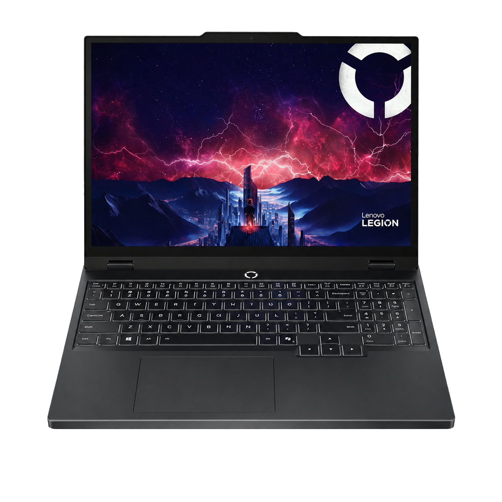
                    </div>
                    <div class="ring-header-info">
                        <div class="ring-title-row">
                            <h2 class="ring-device-title">Legion 5 拯救者</h2>
                            <span class="ring-role-badge">桌边游戏机</span>
                        </div>
                    </div>
                </div>
                <p class="ring-device-duty">常年放桌边，只打游戏和跑 Windows 独占的工具。走独立网线，不占主屏视野。</p>
                <div class="ring-connect-pill">
                    <span class="ring-connect-dot" aria-hidden="true"></span>
                    <span>有线网络单独接，跟主工位物理隔开。</span>
                </div>
            </article>
        </div>

        <!-- ZONE 02: 外出随身生态 -->
        <div class="zone-header">
            <span class="zone-num">ZONE 02</span>
            <span class="zone-title">外出随身生态 · On-the-Go &amp; EDC</span>
            <span class="zone-line"></span>
        </div>

        <div class="zone-grid">
            <article class="ring-card">
                <div class="ring-card-header">
                    <div class="ring-img-box">
                        
                    </div>
                    <div class="ring-header-info">
                        <div class="ring-title-row">
                            <h2 class="ring-device-title">MacBook Pro 14"</h2>
                            <span class="ring-role-badge">外出主力</span>
                        </div>
                    </div>
                </div>
                <p class="ring-device-duty">出门主力机，咖啡馆、差旅随身带，轻。</p>
                <div class="ring-connect-pill">
                    <span class="ring-connect-dot" aria-hidden="true"></span>
                    <span>移动办公，回家自动同步。</span>
                </div>
            </article>

            <article class="ring-card">
                <div class="ring-card-header">
                    <div class="ring-img-box">
                        
                    </div>
                    <div class="ring-header-info">
                        <div class="ring-title-row">
                            <h2 class="ring-device-title">iPad mini (A17 Pro)</h2>
                            <span class="ring-role-badge">便携平板</span>
                        </div>
                    </div>
                </div>
                <p class="ring-device-duty">外出看书、翻 PDF；回工位当 Sidecar 副屏，多摊一块地方看参考文档。</p>
                <div class="ring-connect-pill">
                    <span class="ring-connect-dot" aria-hidden="true"></span>
                    <span>无线接 Sidecar 副屏。</span>
                </div>
            </article>

            <article class="ring-card">
                <div class="ring-card-header">
                    <div class="ring-img-box">
                        
                    </div>
                    <div class="ring-header-info">
                        <div class="ring-title-row">
                            <h2 class="ring-device-title">iPhone 11</h2>
                            <span class="ring-role-badge">随身手机</span>
                        </div>
                    </div>
                </div>
                <p class="ring-device-duty">天天带的手机，微信、刷消息，拍完照 AirDrop 扔给电脑。</p>
                <div class="ring-connect-pill">
                    <span class="ring-connect-dot" aria-hidden="true"></span>
                    <span>AirDrop 隔空传。</span>
                </div>
            </article>
        </div>

        <!-- ZONE 03: 辅助与实验留存 -->
        <div class="zone-header">
            <span class="zone-num">ZONE 03</span>
            <span class="zone-title">外设与实验留存 · Peripherals &amp; Archive</span>
            <span class="zone-line"></span>
        </div>

        <div class="zone-grid">
            <article class="ring-card">
                <div class="ring-card-header">
                    <div class="ring-img-box">
                        
                    </div>
                    <div class="ring-header-info">
                        <div class="ring-title-row">
                            <h2 class="ring-device-title">EarPods</h2>
                            <span class="ring-role-badge">有线耳机</span>
                        </div>
                    </div>
                </div>
                <p class="ring-device-duty">有线，免充电，开会收音稳，没有蓝牙延迟这回事。</p>
                <div class="ring-connect-pill">
                    <span class="ring-connect-dot" aria-hidden="true"></span>
                    <span>3.5mm / Type-C，插上就用。</span>
                </div>
            </article>

            <article class="ring-card">
                <div class="ring-card-header">
                    <div class="ring-img-box">
                        
                    </div>
                    <div class="ring-header-info">
                        <div class="ring-title-row">
                            <h2 class="ring-device-title">Galaxy A51</h2>
                            <span class="ring-role-badge">测试副机</span>
                        </div>
                    </div>
                </div>
                <p class="ring-device-duty">插第二张卡收验证码。偶尔拿来装 APK，看 Android 上跑起来什么样。</p>
                <div class="ring-connect-pill">
                    <span class="ring-connect-dot" aria-hidden="true"></span>
                    <span>USB-C 接电脑，ADB 调试。</span>
                </div>
            </article>

            <article class="ring-card">
                <div class="ring-card-header">
                    <div class="ring-img-box">
                        
                    </div>
                    <div class="ring-header-info">
                        <div class="ring-title-row">
                            <h2 class="ring-device-title">Mi 9</h2>
                            <span class="ring-role-badge">退役留存</span>
                        </div>
                    </div>
                </div>
                <p class="ring-device-duty">以前的主力机，现在退役摆架子，偶尔开机翻老照片。</p>
                <div class="ring-connect-pill">
                    <span class="ring-connect-dot" aria-hidden="true"></span>
                    <span>独立摆放，不用常驻接线。</span>
                </div>
            </article>
        </div>

        <div class="setup-outro">照片手机拍完直接传，代码走局域网同步，桌面没有多余的线。</div>
    </main>

    <footer class="site-footer">
        <div class="footer-line" data-zh="TECH ARSENAL / 工位与连接" data-en="TECH ARSENAL / Setup">tech arsenal / 工位与连接</div>
    </footer>
    <script src="arsenal-site.js"></script>
</body>
</html>
```

## CSS 源码

### `arsenal-pages.css`
```css
:root {
    --bg: #0a0d12;
    --bg-elevated: #111722;
    --panel: rgba(17, 23, 34, 0.86);
    --panel-solid: #131a26;
    --panel-soft: #171f2d;
    --line: rgba(160, 176, 204, 0.14);
    --line-strong: rgba(160, 176, 204, 0.28);
    --text: #edf2fb;
    --muted: #a2adbf;
    --muted-2: #7f8ca2;
    --accent: #6f86ff;
    --accent-2: #91a5ff;
    --accent-soft: rgba(111, 134, 255, 0.14);
    --steel: #d7dde8;
    --shadow: rgba(2, 6, 18, 0.45);
    --shell: 1280px;
    --display: "Avenir Next", "SF Pro Display", "Helvetica Neue", "Segoe UI", sans-serif;
    --body: "SF Pro Text", "Avenir Next", "Helvetica Neue", "Segoe UI", sans-serif;
    --mono: ui-monospace, "SFMono-Regular", "SF Mono", Menlo, Consolas, monospace;
}

* {
    box-sizing: border-box;
}

html {
    scroll-behavior: smooth;
}

body {
    margin: 0;
    min-height: 100vh;
    min-height: 100dvh;
    padding-left: env(safe-area-inset-left, 0px);
    padding-right: env(safe-area-inset-right, 0px);
    color: var(--text);
    font-family: var(--body);
    background: linear-gradient(180deg, #090c11 0%, #0a0d12 42%, #0d1118 100%);
    background-color: #0a0d12;
    background-attachment: fixed;
    position: relative;
}

body::before {
    content: "";
    position: fixed;
    inset: 0;
    pointer-events: none;
    opacity: 0.22;
    background-image:
        linear-gradient(rgba(255, 255, 255, 0.028) 1px, transparent 1px),
        linear-gradient(90deg, rgba(255, 255, 255, 0.028) 1px, transparent 1px);
    background-size: 36px 36px;
    mask-image: linear-gradient(180deg, rgba(0, 0, 0, 0.8), transparent 85%);
}

::selection {
    background: var(--accent);
    color: #05070c;
}

a {
    color: inherit;
    text-decoration: none;
}

img {
    display: block;
    width: 100%;
}

.broadcast-bar,
.shell,
.site-footer {
    position: relative;
    z-index: 1;
}

.broadcast-bar {
    display: flex;
    justify-content: center;
    align-items: center;
    gap: 14px;
    padding: 12px 18px;
    position: sticky;
    top: 0;
    z-index: 20;
    border-bottom: 1px solid var(--line);
    background: rgba(10, 13, 18, 0.82);
    backdrop-filter: blur(18px);
}

.signal-icon {
    width: 7px;
    height: 7px;
    background: var(--accent);
    border-radius: 999px;
    box-shadow: 0 0 0 6px rgba(111, 134, 255, 0.1);
}

.shoutout-text,
.meta-chip,
.eyebrow,
.section-label,
.mini-label,
.page-link,
.back-link,
.stats-label,
.card-meta,
.footer-line {
    font-family: var(--mono);
    text-transform: uppercase;
    letter-spacing: 0.14em;
}

.shoutout-text {
    color: var(--muted);
    font-size: 0.66rem;
}

.creator-tag {
    padding: 4px 10px;
    border: 1px solid rgba(111, 134, 255, 0.4);
    background: rgba(111, 134, 255, 0.11);
    color: var(--accent-2);
    font-family: var(--mono);
    font-size: 0.72rem;
    letter-spacing: 0.12em;
    text-transform: uppercase;
}

.shell {
    max-width: var(--shell);
    margin: 0 auto;
    padding: 0 40px 76px;
}

.site-header {
    padding: 34px 0 20px;
}

.top-row {
    display: flex;
    justify-content: space-between;
    align-items: center;
    gap: 16px;
}

.site-mark {
    display: inline-flex;
    align-items: center;
    justify-content: center;
    width: 46px;
    height: 46px;
    flex: 0 0 auto;
    opacity: 0.86;
}

.site-mark img {
    width: 34px;
    height: 34px;
    object-fit: contain;
    filter: drop-shadow(0 0 16px rgba(111, 134, 255, 0.18));
}

.back-link,
.page-link {
    display: inline-flex;
    align-items: center;
    justify-content: center;
    min-height: 44px;
    padding: 0 16px;
    border: 1px solid var(--line-strong);
    background: rgba(255, 255, 255, 0.02);
    color: var(--muted);
    font-size: 0.67rem;
    transition: border-color 0.24s ease, color 0.24s ease, background 0.24s ease, transform 0.24s ease;
}

.back-link:hover,
.page-link:hover,
.page-link.active {
    border-color: rgba(111, 134, 255, 0.52);
    color: var(--text);
    background: rgba(111, 134, 255, 0.09);
    transform: translateY(-1px);
}

.back-link:focus-visible,
.page-link:focus-visible {
    outline: 2px solid var(--accent);
    outline-offset: 2px;
    border-color: var(--accent);
}

.page-nav {
    display: flex;
    flex-wrap: wrap;
    gap: 10px;
    justify-content: flex-end;
}

.hero-head {
    margin-top: 34px;
}

.eyebrow {
    color: var(--muted);
    font-size: 0.68rem;
}

.title-lockup {
    margin-top: 16px;
    display: grid;
    gap: 14px;
}

.main-title {
    margin: 0;
    max-width: 10ch;
    font-family: var(--display);
    font-size: clamp(3rem, 7vw, 6.4rem);
    line-height: 0.92;
    letter-spacing: -0.05em;
    font-weight: 700;
}

.main-title .accent {
    color: var(--accent-2);
    font-style: italic;
    font-weight: 600;
}

.page-subtitle {
    margin: 0;
    max-width: 40rem;
    color: var(--muted);
    line-height: 1.74;
    font-size: 1rem;
}

/* 标题防孤字与正文排版平衡 */
.main-title,
.section-title,
.product-name,
.dossier-title,
.zone-title {
    text-wrap: balance;
}

.dossier-why,
.dossier-desc,
.setup-intro {
    text-wrap: pretty;
}

/* 全站等宽数字排印规范 (Tabular Figures) */
.collection-ledger strong,
.hero-stats-inline strong,
.lot-number,
.spec-val,
.d-spec,
.dossier-specs,
.dossier-spec-val {
    font-variant-numeric: tabular-nums;
    font-feature-settings: "tnum";
}

/* 锚点滚动避让顶栏 (Scroll Margin) */
.section-wrapper,
[id^="sec-"] {
    scroll-margin-top: 80px;
}

.hero-panel,
.section-panel,
.card,
.timeline-entry,
.spec-card,
.radar-card,
.table-wrap,
.route-card {
    border: 1px solid var(--line);
    background:
        linear-gradient(180deg, rgba(255, 255, 255, 0.03), transparent 28%),
        var(--panel);
    box-shadow: 0 24px 70px var(--shadow);
}

.hero-panel {
    margin-top: 36px;
    overflow: hidden;
}

.hero-grid {
    display: grid;
    grid-template-columns: minmax(0, 1.08fr) minmax(360px, 0.92fr);
    min-height: 560px;
}

.hero-copy {
    position: relative;
    display: flex;
    flex-direction: column;
    justify-content: space-between;
    padding: 76px 42px 36px;
}

.hero-copy-top {
    display: grid;
    gap: 18px;
}

.hero-copy-top h2 {
    margin: 0;
    max-width: 12ch;
    font-family: var(--display);
    font-size: clamp(2.4rem, 5vw, 4.8rem);
    line-height: 0.96;
    letter-spacing: -0.045em;
    font-weight: 700;
}

.hero-copy-top p {
    margin: 0;
    max-width: 32rem;
    color: var(--muted);
    line-height: 1.72;
}

.hero-actions {
    display: flex;
    flex-wrap: wrap;
    gap: 12px;
    margin-top: 8px;
}

.button-primary,
.button-secondary {
    display: inline-flex;
    align-items: center;
    justify-content: center;
    min-height: 46px;
    padding: 0 18px;
    border: 1px solid transparent;
    font-family: var(--mono);
    font-size: 0.68rem;
    text-transform: uppercase;
    letter-spacing: 0.14em;
    transition: transform 0.24s ease, border-color 0.24s ease, background 0.24s ease;
}

.button-primary {
    color: #080b10;
    background: var(--accent);
    border-color: var(--accent);
}

.button-secondary {
    color: var(--text);
    border-color: var(--line-strong);
    background: rgba(255, 255, 255, 0.02);
}

.button-primary:hover,
.button-secondary:hover {
    transform: translateY(-1px);
}

.button-primary:focus-visible,
.button-secondary:focus-visible {
    outline: 2px solid var(--accent);
    outline-offset: 2px;
}

.hero-stats {
    display: grid;
    grid-template-columns: repeat(3, minmax(0, 1fr));
    gap: 12px;
    margin-top: 26px;
}

.hero-stat,
.metric-cell {
    padding: 16px 18px;
    border: 1px solid var(--line);
    background: rgba(255, 255, 255, 0.02);
}

.hero-stat strong,
.metric-cell strong {
    display: block;
    font-family: var(--display);
    font-size: 1.65rem;
    letter-spacing: -0.03em;
}

.hero-stat span,
.metric-cell span {
    margin-top: 6px;
    display: block;
    color: var(--muted);
    font-size: 0.86rem;
}

.hero-side {
    min-height: 100%;
    position: relative;
    padding: 28px;
    border-left: 1px solid var(--line);
    background:
        radial-gradient(circle at 50% 18%, rgba(111, 134, 255, 0.24), transparent 34%),
        linear-gradient(180deg, rgba(255, 255, 255, 0.03), transparent 40%),
        var(--panel-solid);
}

.hero-side img {
    height: 100%;
    min-height: 500px;
    object-fit: cover;
}

.duo-panel {
    display: grid;
    grid-template-columns: minmax(0, 0.92fr) minmax(320px, 1.08fr);
    overflow: hidden;
}

.duo-visual {
    min-height: 100%;
    padding: 22px;
    border-right: 1px solid var(--line);
    background:
        radial-gradient(circle at 40% 20%, rgba(111, 134, 255, 0.16), transparent 30%),
        var(--panel-solid);
}

.duo-visual img {
    height: 100%;
    min-height: 360px;
    object-fit: cover;
}

.duo-copy {
    padding: 30px;
}

.duo-copy h4,
.closing-panel h4 {
    margin: 10px 0 12px;
    font-family: var(--display);
    font-size: clamp(1.8rem, 3vw, 3rem);
    line-height: 1.02;
    letter-spacing: -0.04em;
}

.duo-copy p,
.closing-panel p {
    margin: 0;
    max-width: 42rem;
    color: var(--muted);
    line-height: 1.74;
}

.bullet-grid {
    display: grid;
    grid-template-columns: repeat(2, minmax(0, 1fr));
    gap: 12px;
    margin-top: 22px;
}

.bullet-card {
    padding: 16px 18px;
    border: 1px solid var(--line);
    background: rgba(255, 255, 255, 0.02);
}

.bullet-card strong {
    display: block;
    font-family: var(--display);
    font-size: 1.08rem;
    letter-spacing: -0.02em;
}

.bullet-card span {
    display: block;
    margin-top: 8px;
    color: var(--muted);
    line-height: 1.6;
    font-size: 0.92rem;
}

.summary-grid {
    grid-template-columns: repeat(3, minmax(0, 1fr));
}

.summary-card {
    padding: 22px;
    border: 1px solid var(--line);
    background: rgba(255, 255, 255, 0.02);
}

.summary-card strong {
    display: block;
    font-family: var(--display);
    font-size: 1.2rem;
    letter-spacing: -0.02em;
}

.summary-card p {
    margin: 10px 0 0;
    color: var(--muted);
    line-height: 1.66;
}

.closing-panel {
    padding: 28px;
}

.closing-panel .hero-actions {
    margin-top: 22px;
}

.meta-chip {
    position: absolute;
    top: 28px;
    left: 42px;
    display: inline-flex;
    align-items: center;
    gap: 8px;
    min-height: 34px;
    padding: 0 12px;
    color: var(--accent-2);
    font-size: 0.64rem;
    background: rgba(10, 13, 18, 0.54);
    border: 1px solid rgba(111, 134, 255, 0.34);
}

.section-panel {
    margin-top: 26px;
    padding: 26px;
}

.section {
    margin-top: 48px;
}

.section-label,
.mini-label {
    color: var(--muted-2);
    font-size: 0.64rem;
    margin-bottom: 10px;
}

.section-heading {
    margin-bottom: 18px;
}

.section-heading h3 {
    margin: 0;
    max-width: 18ch;
    font-family: var(--display);
    font-size: clamp(1.7rem, 3vw, 2.8rem);
    line-height: 1.02;
    letter-spacing: -0.04em;
}

.section-heading p {
    margin: 14px 0 0;
    max-width: 40rem;
    color: var(--muted);
    line-height: 1.7;
}

.portal-grid,
.route-grid,
.spec-grid,
.radar-grid,
.summary-grid {
    display: grid;
    gap: 18px;
}

.route-grid {
    grid-template-columns: repeat(12, minmax(0, 1fr));
}

.route-card {
    padding: 24px;
}

.route-card.wide {
    grid-column: span 6;
}

.route-card.narrow {
    grid-column: span 3;
}

.home-route-grid .route-card.narrow {
    grid-column: span 4;
}

.route-card strong,
.card h4,
.spec-card h4,
.timeline-entry h4,
.radar-card h4 {
    font-family: var(--display);
    letter-spacing: -0.03em;
}

.route-card strong {
    display: block;
    font-size: 1.38rem;
    margin-top: 8px;
}

.route-card p,
.card p,
.spec-card p,
.timeline-entry p,
.radar-card p {
    color: var(--muted);
    line-height: 1.68;
}

.route-meta,
.meta-grid {
    display: grid;
    gap: 12px;
    margin-top: 18px;
}

.route-meta {
    grid-template-columns: repeat(2, minmax(0, 1fr));
}

.meta-cell {
    padding-top: 10px;
    border-top: 1px solid var(--line);
}

.meta-cell span {
    display: block;
    color: var(--muted-2);
    font-family: var(--mono);
    font-size: 0.65rem;
    text-transform: uppercase;
    letter-spacing: 0.12em;
}

.meta-cell strong {
    display: block;
    margin-top: 6px;
    font-size: 0.96rem;
    font-family: var(--body);
    font-weight: 500;
}

.timeline {
    display: grid;
    gap: 16px;
}

.timeline-entry {
    position: relative;
    padding: 24px 24px 24px 54px;
}

.timeline-entry::before {
    content: "";
    position: absolute;
    left: 24px;
    top: 30px;
    width: 12px;
    height: 12px;
    border-radius: 999px;
    background: var(--accent);
    box-shadow: 0 0 0 8px rgba(111, 134, 255, 0.1);
}

.entry-kicker,
.status-pill {
    display: inline-flex;
    align-items: center;
    gap: 8px;
    min-height: 30px;
    padding: 0 10px;
    border: 1px solid var(--line-strong);
    color: var(--muted);
    font-family: var(--mono);
    font-size: 0.64rem;
    text-transform: uppercase;
    letter-spacing: 0.13em;
    width: fit-content;
}

.entry-kicker::before,
.status-pill::before {
    content: "";
    width: 6px;
    height: 6px;
    border-radius: 999px;
    background: var(--accent);
}

.timeline-entry h4,
.spec-card h4,
.radar-card h4,
.card h4 {
    margin: 14px 0 10px;
    font-size: 1.34rem;
}

.spec-grid {
    grid-template-columns: repeat(3, minmax(0, 1fr));
}

.spec-card,
.radar-card,
.card {
    padding: 22px;
}

.table-wrap {
    overflow-x: auto;
}

table {
    width: 100%;
    border-collapse: collapse;
    min-width: 760px;
}

th,
td {
    padding: 16px 18px;
    border-bottom: 1px solid var(--line);
    text-align: left;
    vertical-align: top;
}

thead th,
.table-head {
    color: var(--text);
    font-family: var(--display);
    font-size: 1.02rem;
    letter-spacing: -0.02em;
}

tbody th {
    width: 18%;
    color: var(--muted-2);
    font-family: var(--mono);
    font-size: 0.66rem;
    text-transform: uppercase;
    letter-spacing: 0.13em;
}

tbody td {
    color: var(--muted);
    line-height: 1.65;
}

.table-note {
    color: var(--steel);
}

.compare-choices {
    display: grid;
    grid-template-columns: repeat(4, minmax(0, 1fr));
    gap: 14px;
}

.choice-btn {
    text-align: left;
    padding: 18px;
    border: 1px solid var(--line);
    background: rgba(255, 255, 255, 0.02);
    color: var(--muted);
    cursor: pointer;
    transition: border-color 0.24s ease, background 0.24s ease, transform 0.24s ease;
}

.choice-btn strong {
    display: block;
    color: var(--text);
    font-family: var(--display);
    font-size: 1.08rem;
    letter-spacing: -0.025em;
}

.choice-btn span {
    display: block;
    margin-top: 8px;
    font-size: 0.86rem;
}

.choice-btn.active,
.choice-btn:hover {
    border-color: rgba(111, 134, 255, 0.5);
    background: rgba(111, 134, 255, 0.08);
    transform: translateY(-1px);
}

.radar-grid {
    grid-template-columns: repeat(3, minmax(0, 1fr));
}

.site-footer {
    max-width: var(--shell);
    margin: 0 auto 46px;
    padding: 24px 40px 0;
    border-top: 1px solid var(--line);
}

.footer-line {
    color: var(--muted-2);
    font-size: 0.64rem;
}

@media (max-width: 1100px) {
    .hero-grid,
    .duo-panel,
    .compare-choices,
    .spec-grid,
    .radar-grid,
    .summary-grid {
        grid-template-columns: 1fr 1fr;
    }

    .route-card.wide,
    .route-card.narrow {
        grid-column: span 6;
    }

    .home-route-grid .route-card.narrow {
        grid-column: span 4;
    }
}

@media (max-width: 780px) {
    .shell,
    .site-footer {
        padding-left: 18px;
        padding-right: 18px;
    }

    .top-row {
        flex-direction: column;
        align-items: flex-start;
    }

    .page-nav {
        justify-content: flex-start;
    }

    .hero-grid,
    .duo-panel,
    .hero-stats,
    .compare-choices,
    .spec-grid,
    .radar-grid,
    .route-meta,
    .bullet-grid,
    .summary-grid {
        grid-template-columns: 1fr;
    }

    .route-card.wide,
    .route-card.narrow {
        grid-column: span 12;
    }

    .home-route-grid .route-card.narrow {
        grid-column: span 12;
    }

    .hero-copy,
    .hero-side,
    .duo-copy,
    .duo-visual,
    .section-panel,
    .route-card,
    .spec-card,
    .card,
    .timeline-entry,
    .radar-card {
        padding: 20px;
    }

    .hero-copy {
        padding-top: 68px;
    }

    .meta-chip {
        top: 20px;
        left: 20px;
    }

    .hero-side {
        border-left: 0;
        border-top: 1px solid var(--line);
    }

    .duo-visual {
        border-right: 0;
        border-bottom: 1px solid var(--line);
    }

    .hero-side img {
        min-height: 280px;
    }

    .duo-visual img {
        min-height: 260px;
    }
}

/* Bilingual copy stays inside the annual grid: the primary language carries scale,
   while the translation is a readable secondary line. */
html,
body {
    max-width: 100%;
    overflow-x: hidden;
}

.top-row,
.site-header,
.hero-head,
.title-lockup,
.hero-grid,
.hero-copy,
.hero-copy-top,
.hero-side,
.section-heading,
.route-card,
.spec-card,
.summary-card,
.radar-card,
.timeline-entry {
    min-width: 0;
}

.lang-pair {
    max-width: 100%;
    white-space: normal;
    overflow-wrap: anywhere;
}

.page-nav .lang-pair,
.language-note .lang-pair {
    white-space: nowrap;
    overflow-wrap: normal;
}

.main-title {
    max-width: 18ch;
    font-size: clamp(3.2rem, 6vw, 6rem);
    overflow-wrap: anywhere;
}

.main-title .lang-pair {
    width: 100%;
}

.main-title .lang-en {
    max-width: 28ch;
    font-size: .32em;
    line-height: 1.16;
    letter-spacing: .08em;
    text-transform: uppercase;
}

.page-subtitle .lang-pair,
.hero-copy-top p .lang-pair,
.section-heading p .lang-pair,
.route-card p .lang-pair,
.spec-card p .lang-pair,
.summary-card p .lang-pair,
.radar-card p .lang-pair,
.closing-panel p .lang-pair {
    display: inline;
    line-height: 1.65;
    white-space: normal;
}

.page-subtitle .lang-en,
.hero-copy-top p .lang-en,
.section-heading p .lang-en,
.route-card p .lang-en,
.spec-card p .lang-en,
.summary-card p .lang-en,
.radar-card p .lang-en,
.closing-panel p .lang-en {
    color: var(--muted-2);
    font-size: .86em;
    letter-spacing: .025em;
}

.hero-copy-top h2 .lang-pair,
.section-heading h3 .lang-pair,
.route-card strong .lang-pair,
.spec-card h4 .lang-pair,
.summary-card strong .lang-pair,
.radar-card h4 .lang-pair,
.timeline-entry h4 .lang-pair {
    display: inline-flex;
    flex-direction: column;
    align-items: flex-start;
    gap: 0;
    line-height: .98;
    white-space: normal;
}

.hero-copy-top h2 .lang-divider,
.section-heading h3 .lang-divider,
.route-card strong .lang-divider,
.spec-card h4 .lang-divider,
.summary-card strong .lang-divider,
.radar-card h4 .lang-divider,
.timeline-entry h4 .lang-divider {
    display: none;
}

.hero-copy-top h2 .lang-en,
.section-heading h3 .lang-en,
.route-card strong .lang-en,
.spec-card h4 .lang-en,
.summary-card strong .lang-en,
.radar-card h4 .lang-en,
.timeline-entry h4 .lang-en {
    color: var(--accent-2);
    font-size: .38em;
    font-style: italic;
    letter-spacing: .04em;
    line-height: 1.1;
}

.hero-copy-top h2,
.section-heading h3,
.route-card strong,
.spec-card h4,
.summary-card strong,
.radar-card h4,
.timeline-entry h4,
.page-subtitle {
    overflow-wrap: anywhere;
}

@media (max-width: 780px) {
    .main-title {
        max-width: 14ch;
        font-size: clamp(2.9rem, 13vw, 5rem);
    }

    .main-title .lang-en {
        max-width: 24ch;
        font-size: .3em;
    }
}

/* Annual index world: the shared pages use the same blue catalogue language as tech-arsenal. */
:root {
    --annual-rule: rgba(160, 176, 204, .28);
    --annual-rule-soft: rgba(160, 176, 204, .16);
    --annual-blue-wash: rgba(111, 134, 255, .09);
}

body {
    background: linear-gradient(180deg, #090c11 0%, #0a0d12 46%, #0d1118 100%);
    background-color: #0a0d12;
    background-attachment: fixed;
}

.shell {
    max-width: 1400px;
    padding-inline: 48px;
}

.site-header {
    padding: 34px 0 28px;
}

.top-row {
    align-items: flex-start;
    padding-bottom: 22px;
    border-bottom: 1px solid var(--annual-rule);
}

.page-nav {
    gap: 8px;
    justify-content: flex-end;
}

.back-link,
.page-link {
    min-height: 36px;
    padding-inline: 12px;
    border: 0;
    border-bottom: 1px solid transparent;
    background: transparent;
    color: var(--muted);
}

.back-link:hover,
.page-link:hover,
.page-link.active {
    border-color: var(--accent);
    background: transparent;
    color: var(--text);
    transform: none;
}

.hero-head {
    margin-top: 42px;
    padding-bottom: 14px;
}

.eyebrow,
.meta-chip,
.section-label,
.card-meta {
    color: var(--muted-2);
}

.main-title {
    max-width: 15ch;
    font-size: clamp(3.8rem, 8vw, 8rem);
    line-height: .84;
    letter-spacing: -.07em;
    font-weight: 500;
}

.main-title .accent {
    color: var(--accent-2);
    font-weight: 400;
}

.page-subtitle {
    max-width: 50rem;
    color: var(--muted);
    line-height: 1.65;
}

.hero-panel {
    margin-top: 24px;
    border: 0;
    border-top: 1px solid var(--text);
    border-bottom: 1px solid var(--annual-rule);
    background: transparent;
    box-shadow: none;
}

.hero-grid {
    grid-template-columns: minmax(0, 1.08fr) minmax(300px, .92fr);
    min-height: 500px;
}

.hero-copy {
    padding: 74px 46px 36px 0;
}

.hero-copy-top h2 {
    max-width: 14ch;
    font-size: clamp(2.8rem, 5vw, 5.8rem);
    line-height: .9;
    letter-spacing: -.07em;
    font-weight: 500;
}

.hero-copy-top p,
.section-heading p,
.route-card p,
.spec-card p,
.timeline-entry p,
.radar-card p {
    max-width: 62ch;
    color: var(--muted);
    line-height: 1.7;
}

.hero-side {
    padding: 24px 0 24px 24px;
    border-left: 1px solid var(--annual-rule);
    background: transparent;
}

.hero-side::before {
    content: "";
    position: absolute;
    inset: 24px 0 24px 24px;
    border: 1px solid var(--annual-rule-soft);
    pointer-events: none;
}

.hero-side img {
    min-height: 450px;
    filter: saturate(.72) contrast(1.02);
}

.meta-chip {
    top: 26px;
    left: 0;
    min-height: 28px;
    padding: 0;
    border: 0;
    background: transparent;
}

.hero-actions {
    gap: 18px;
}

.button-primary,
.button-secondary {
    min-height: 40px;
    padding-inline: 0;
    border: 0;
    border-bottom: 1px solid currentColor;
    background: transparent;
}

.button-primary {
    color: var(--accent-2);
}

.button-secondary {
    color: var(--muted);
}

.button-primary:hover,
.button-secondary:hover {
    background: transparent;
    color: var(--text);
    transform: none;
}

.hero-stats {
    grid-template-columns: repeat(3, minmax(0, 1fr));
    gap: 0;
    margin-top: 34px;
    border-top: 1px solid var(--annual-rule);
}

.hero-stat,
.metric-cell {
    padding: 16px 16px 12px 0;
    border: 0;
    border-right: 1px solid var(--annual-rule-soft);
    background: transparent;
}

.hero-stat:last-child,
.metric-cell:last-child {
    border-right: 0;
}

.hero-stat strong,
.metric-cell strong {
    font-size: 1.8rem;
    font-weight: 500;
}

.section {
    margin-top: 78px;
}

.section-heading {
    display: grid;
    grid-template-columns: minmax(0, 1fr) minmax(260px, .75fr);
    align-items: end;
    gap: 28px;
    margin-bottom: 22px;
    padding: 15px 0 18px;
    border-top: 1px solid var(--annual-rule-strong, var(--annual-rule));
    border-bottom: 1px solid var(--annual-rule);
}

.section-heading h3 {
    max-width: 16ch;
    font-size: clamp(2.2rem, 4vw, 4.8rem);
    line-height: .9;
    letter-spacing: -.065em;
    font-weight: 500;
}

.section-heading p {
    margin: 0;
}

.hero-panel,
.section-panel,
.card,
.timeline-entry,
.spec-card,
.radar-card,
.table-wrap,
.route-card {
    border-radius: 0;
    box-shadow: none;
}

.section-panel {
    margin-top: 0;
    padding: 28px 0;
    border: 0;
    border-top: 1px solid var(--annual-rule);
    border-bottom: 1px solid var(--annual-rule);
    background: transparent;
}

.spec-grid,
.summary-grid,
.radar-grid {
    grid-template-columns: repeat(12, minmax(0, 1fr));
    gap: 0;
    border-top: 1px solid var(--annual-rule);
}

.spec-card,
.summary-card,
.radar-card {
    grid-column: span 4;
    min-height: 190px;
    padding: 24px 24px 28px 0;
    border: 0;
    border-bottom: 1px solid var(--annual-rule);
    border-right: 1px solid var(--annual-rule-soft);
    background: transparent;
}

.spec-card:nth-child(2),
.summary-card:nth-child(2),
.radar-card:nth-child(2) {
    grid-column: span 5;
    padding-left: 24px;
}

.spec-card:nth-child(3),
.summary-card:nth-child(3),
.radar-card:nth-child(3) {
    grid-column: span 3;
    padding-left: 24px;
    border-right: 0;
}

.spec-card h4,
.summary-card strong,
.radar-card h4,
.route-card strong,
.timeline-entry h4 {
    margin-top: 18px;
    font-family: var(--display);
    font-size: clamp(1.35rem, 2vw, 2.25rem);
    line-height: .98;
    letter-spacing: -.045em;
    font-weight: 500;
}

.summary-card p {
    max-width: 32ch;
    margin-top: 12px;
}

.status-pill,
.entry-kicker {
    min-height: 24px;
    padding: 0;
    border: 0;
    color: var(--accent-2);
    background: transparent;
}

.status-pill::before,
.entry-kicker::before {
    background: var(--accent);
}

.route-grid {
    gap: 0;
    border-top: 1px solid var(--annual-rule);
}

.route-card {
    min-height: 220px;
    padding: 26px 24px 28px 0;
    border: 0;
    border-bottom: 1px solid var(--annual-rule);
    border-right: 1px solid var(--annual-rule-soft);
    background: transparent;
}

.route-card.wide {
    grid-column: span 7;
}

.route-card.narrow {
    grid-column: span 5;
    padding-left: 24px;
    border-right: 0;
}

.home-route-grid .route-card.narrow {
    grid-column: span 4;
    padding-left: 24px;
    border-right: 1px solid var(--annual-rule-soft);
}

.home-route-grid .route-card:nth-child(3) {
    padding-left: 0;
}

.home-route-grid .route-card:nth-child(5) {
    border-right: 0;
}

.route-card strong {
    display: block;
    max-width: 17ch;
}

.route-card p {
    max-width: 44ch;
}

.route-meta,
.meta-grid {
    gap: 16px;
    margin-top: 22px;
}

.meta-cell {
    padding-top: 10px;
    border-top-color: var(--annual-rule);
}

.timeline {
    gap: 0;
    border-top: 1px solid var(--annual-rule);
}

.timeline-entry {
    display: grid;
    grid-template-columns: minmax(150px, .28fr) minmax(0, .72fr);
    column-gap: 28px;
    padding: 26px 0 30px 24px;
    border: 0;
    border-bottom: 1px solid var(--annual-rule);
    background: transparent;
}

.timeline-entry::before {
    left: 0;
    top: 32px;
    width: 7px;
    height: 7px;
    box-shadow: 0 0 0 5px rgba(111, 134, 255, .1);
}

.timeline-entry .entry-kicker {
    grid-column: 1;
    grid-row: 1 / span 2;
}

.timeline-entry h4,
.timeline-entry p,
.timeline-entry .meta-grid {
    grid-column: 2;
}

.timeline-entry h4 {
    margin: 0 0 10px;
    max-width: 20ch;
}

.table-wrap {
    border: 0;
    border-top: 1px solid var(--annual-rule);
    border-bottom: 1px solid var(--annual-rule);
    background: transparent;
}

table {
    min-width: 720px;
}

th,
td {
    padding: 18px 18px 18px 0;
    border-bottom-color: var(--annual-rule);
}

thead th {
    padding-top: 22px;
    color: var(--text);
}

tbody th {
    color: var(--accent-2);
}

.compare-choices {
    grid-template-columns: repeat(12, minmax(0, 1fr));
    gap: 0;
    border-top: 1px solid var(--annual-rule);
}

.choice-btn {
    grid-column: span 3;
    min-height: 130px;
    padding: 18px 18px 20px 0;
    border: 0;
    border-bottom: 1px solid var(--annual-rule);
    border-right: 1px solid var(--annual-rule-soft);
    border-radius: 0;
    background: transparent;
}

.choice-btn:last-child {
    border-right: 0;
}

.choice-btn strong {
    font-family: var(--display);
    font-size: 1.4rem;
    font-weight: 500;
}

.choice-btn.active,
.choice-btn:hover {
    border-color: var(--annual-rule);
    background: var(--annual-blue-wash);
    transform: none;
}

.site-footer {
    max-width: 1400px;
    margin-top: 92px;
    padding-inline: 48px;
    border-top-color: var(--annual-rule);
}

@media (max-width: 900px) {
    .shell { padding-inline: 28px; }
    .section-heading { grid-template-columns: 1fr; gap: 8px; }
    .hero-copy { padding-right: 28px; }
    .spec-card,
    .summary-card,
    .radar-card,
    .spec-card:nth-child(2),
    .summary-card:nth-child(2),
    .radar-card:nth-child(2),
    .spec-card:nth-child(3),
    .summary-card:nth-child(3),
    .radar-card:nth-child(3) {
        grid-column: span 6;
        padding-left: 0;
        border-right: 1px solid var(--annual-rule-soft);
    }
    .spec-card:nth-child(even),
    .summary-card:nth-child(even),
    .radar-card:nth-child(even) { padding-left: 24px; }
    .route-card.wide,
    .route-card.narrow,
    .home-route-grid .route-card.narrow { grid-column: span 6; }
    .route-card:nth-child(even) { padding-left: 24px; border-right: 0; }
    .site-footer { padding-inline: 28px; }
}

@media (max-width: 780px) {
    .shell { padding-inline: 18px; }
    .site-header { padding-top: 22px; }
    .top-row { gap: 14px; }
    .page-nav { justify-content: flex-start; }
    .main-title { max-width: 12ch; font-size: clamp(3.2rem, 15vw, 6rem); }
    .hero-grid { grid-template-columns: 1fr; min-height: 0; }
    .hero-copy { padding: 66px 0 28px; }
    .hero-copy-top h2 { max-width: 11ch; font-size: clamp(2.7rem, 13vw, 5rem); }
    .hero-side { min-height: 270px; padding: 20px 0 0; border-left: 0; border-top: 1px solid var(--annual-rule); }
    .hero-side::before { inset: 20px 0 0; }
    .hero-side img { min-height: 250px; }
    .hero-stats { grid-template-columns: 1fr 1fr 1fr; }
    .section { margin-top: 58px; }
    .section-heading h3 { max-width: 12ch; font-size: clamp(2.4rem, 12vw, 4.6rem); }
    .spec-card,
    .summary-card,
    .radar-card,
    .spec-card:nth-child(2),
    .summary-card:nth-child(2),
    .radar-card:nth-child(2),
    .spec-card:nth-child(3),
    .summary-card:nth-child(3),
    .radar-card:nth-child(3),
    .route-card.wide,
    .route-card.narrow,
    .home-route-grid .route-card.narrow {
        grid-column: span 12;
        padding: 22px 0 24px;
        border-right: 0;
    }
    .timeline-entry { grid-template-columns: 1fr; gap: 10px; padding: 24px 0 28px 22px; }
    .timeline-entry .entry-kicker,
    .timeline-entry h4,
    .timeline-entry p,
    .timeline-entry .meta-grid { grid-column: 1; grid-row: auto; }
    .timeline-entry h4 { margin-top: 7px; }
    .compare-choices { grid-template-columns: 1fr 1fr; }
    .choice-btn { grid-column: span 1; min-height: 110px; padding-right: 12px; }
    .choice-btn:nth-child(even) { padding-left: 12px; border-right: 0; }
    .site-footer { padding-inline: 18px; margin-top: 68px; }
}

/* Shared bilingual site chrome */
.lang-pair {
    display: inline-flex;
    align-items: baseline;
    gap: 0.18em;
    white-space: nowrap;
}

.lang-zh,
.lang-en {
    display: inline;
}

.lang-zh {
    color: inherit;
}

.lang-en {
    color: color-mix(in srgb, currentColor 70%, transparent);
    font-size: 0.9em;
    letter-spacing: 0.08em;
}

.lang-divider {
    color: var(--accent-2);
    opacity: 0.72;
}

.main-title .lang-pair {
    display: flex;
    flex-direction: column;
    align-items: flex-start;
    gap: 0;
    white-space: normal;
}

.main-title .lang-divider {
    display: none;
}

.main-title .lang-en {
    color: var(--accent-2);
    font-style: italic;
    font-weight: 600;
}

.language-note {
    display: inline-flex;
    align-items: center;
    margin-left: auto;
    color: var(--muted-2);
    font-family: var(--mono);
    font-size: 0.59rem;
    letter-spacing: 0.1em;
    text-transform: uppercase;
}

.language-note .lang-en {
    font-size: 0.92em;
}

.page-nav .page-link {
    min-height: 44px;
}

@media (max-width: 780px) {
    .language-note {
        margin-left: 0;
    }

    .page-nav .page-link {
        min-height: 38px;
        padding-inline: 11px;
    }
}

/* Final fit pass: preserve the annual catalogue voice while keeping real copy in frame. */
html,
body {
    max-width: 100%;
    overflow-x: hidden;
}

.shell,
.site-header,
.top-row,
.page-nav,
.page-link,
.hero-head,
.hero-grid,
.hero-copy,
.hero-copy-top,
.hero-side,
.section-heading,
.route-card,
.spec-card,
.summary-card,
.radar-card,
.timeline-entry,
.closing-panel {
    min-width: 0;
}

.lang-pair {
    max-width: 100%;
    white-space: normal;
    overflow-wrap: anywhere;
}

.page-nav .lang-pair,
.language-note .lang-pair {
    white-space: nowrap;
    overflow-wrap: normal;
}

.main-title {
    max-width: 18ch;
    font-size: clamp(2.75rem, 5.25vw, 5rem);
    line-height: .95;
    letter-spacing: -.055em;
    overflow-wrap: anywhere;
}

.main-title .lang-en {
    max-width: 28ch;
    font-size: .38em;
    line-height: 1.16;
    letter-spacing: .08em;
    text-transform: uppercase;
}

.page-subtitle,
.hero-copy-top p,
.section-heading p,
.route-card p,
.spec-card p,
.summary-card p,
.radar-card p,
.closing-panel p {
    overflow-wrap: anywhere;
}

@media (max-width: 780px) {
    .main-title {
        max-width: 14ch;
        font-size: clamp(2.5rem, 11vw, 3.8rem);
    }

    .main-title .lang-en {
        max-width: 24ch;
        font-size: .36em;
    }
}

/* Home is a mark in the shared chrome, not a second active navigation item. */
.home-mark-link {
    display: inline-flex;
    align-items: center;
    justify-content: center;
    flex: 0 0 46px;
    width: 46px;
    height: 46px;
    min-height: 46px;
    padding: 0;
    border: 0 !important;
    background: transparent !important;
    color: inherit;
    transform: none !important;
}

.home-mark-link img {
    width: 34px;
    height: 34px;
    object-fit: contain;
    filter: drop-shadow(0 0 16px rgba(111, 134, 255, .18));
    transition: transform .2s ease, opacity .2s ease;
}

.home-mark-link:hover img,
.home-mark-link:focus-visible img {
    opacity: 1;
    transform: scale(1.06);
}

/* Keep the shared chrome on one predictable rail before it becomes a second row. */
.top-row {
    flex-wrap: nowrap;
    align-items: center;
    gap: 16px;
}

.top-row .page-nav {
    flex: 1 1 auto;
    justify-content: center;
    gap: 6px 12px;
}

.top-row .page-nav .page-link {
    flex: 0 0 auto;
}

@media (max-width: 1100px) {
    .top-row {
        flex-wrap: wrap;
    }

    .top-row .language-note {
        order: 2;
        margin-left: auto;
    }

    .top-row .page-nav {
        order: 3;
        width: 100%;
        flex: 0 0 100%;
        justify-content: flex-start;
        padding-top: 14px;
        border-top: 1px solid var(--annual-rule);
    }
}

@media (max-width: 780px) {
    .top-row {
        align-items: flex-start;
        flex-direction: column;
    }

    .top-row .page-nav {
        width: 100%;
        flex: 0 0 auto;
        flex-wrap: wrap;
    }
}

/* One navigation rail across the whole site.
   The catalogue uses 1420px with 36px viewport gutters, so shared pages use
   the same effective content width instead of shrinking the header twice. */
.shell {
    max-width: 1492px;
    padding-inline: 36px;
}

@media (max-width: 1080px) {
    .shell {
        max-width: none;
        padding-inline: 21px;
    }
}

@media (max-width: 760px) {
    .shell {
        padding-inline: 18px;
    }
}

/* ==========================================================================
   PAGE-SPECIFIC COMPONENT MODULES (ALL 9 SITES UNIFIED IN ONE CSS)
   ========================================================================== */

/* --------------------------------------------------------------------------
   1. DECISION HELPER (decision.html)
   -------------------------------------------------------------------------- */
.scorer-panel {
    background: var(--panel-solid);
    border: 1px solid var(--line-strong);
    border-radius: 6px;
    padding: 24px;
    margin-bottom: 28px;
}

.sliders-grid {
    display: grid;
    grid-template-columns: repeat(auto-fit, minmax(240px, 1fr));
    gap: 18px;
    margin-bottom: 24px;
    padding-bottom: 20px;
    border-bottom: 1px solid var(--line);
}

.slider-group {
    display: flex;
    flex-direction: column;
    gap: 6px;
}

.slider-label-row {
    display: flex;
    justify-content: space-between;
    align-items: baseline;
    font-size: 0.8rem;
}

.slider-name {
    font-weight: 500;
    color: var(--text);
}

.slider-val {
    font-family: var(--mono);
    color: var(--accent);
    font-weight: 600;
    font-size: 0.82rem;
}

input[type="range"] {
    -webkit-appearance: none;
    width: 100%;
    height: 5px;
    background: var(--line-strong);
    border-radius: 3px;
    outline: none;
    cursor: pointer;
}

input[type="range"]::-webkit-slider-thumb {
    -webkit-appearance: none;
    width: 15px;
    height: 15px;
    border-radius: 50%;
    background: var(--accent);
    cursor: pointer;
    box-shadow: 0 0 6px rgba(111, 134, 255, 0.4);
    transition: transform 0.15s ease;
}

input[type="range"]::-webkit-slider-thumb:hover {
    transform: scale(1.15);
}

.results-rank-grid {
    display: grid;
    grid-template-columns: repeat(auto-fit, minmax(240px, 1fr));
    gap: 14px;
}

.rank-card {
    background: var(--bg-elevated);
    border: 1px solid var(--line);
    border-radius: 4px;
    padding: 16px;
    transition: border-color 0.2s ease, background-color 0.2s ease;
}

.rank-card.top-pick {
    border-color: var(--accent);
    background: var(--panel-soft);
}

.rank-badge {
    font-family: var(--mono);
    font-size: 0.62rem;
    color: var(--accent-2);
    text-transform: uppercase;
    margin-bottom: 4px;
}

.rank-score {
    font-family: var(--mono);
    font-size: 1.7rem;
    font-weight: 700;
    color: var(--text);
    line-height: 1;
    margin: 6px 0;
    display: flex;
    align-items: baseline;
    gap: 4px;
}

.rank-score span {
    font-size: 0.78rem;
    color: var(--muted-2);
    font-weight: 400;
}

.rank-title {
    font-size: 1rem;
    font-weight: 600;
    margin: 0 0 8px;
    font-family: var(--display);
}

.score-bar-bg {
    height: 5px;
    background: var(--line);
    border-radius: 3px;
    overflow: hidden;
    margin-bottom: 10px;
}

.score-bar-fill {
    height: 100%;
    background: var(--accent);
    transition: width 0.3s ease;
}

.dealbreaker-tag {
    font-size: 0.72rem;
    color: var(--muted);
    background: rgba(255, 255, 255, 0.03);
    border: 1px solid var(--line);
    padding: 6px 8px;
    border-radius: 3px;
    line-height: 1.4;
    margin-top: 8px;
}

.diff-controls {
    display: flex;
    gap: 10px;
    margin-bottom: 14px;
}

.toggle-btn {
    font-family: var(--mono);
    font-size: 0.68rem;
    padding: 7px 12px;
    border: 1px solid var(--line-strong);
    background: var(--panel-soft);
    color: var(--muted);
    border-radius: 4px;
    cursor: pointer;
    transition: color 0.2s ease, border-color 0.2s ease, background-color 0.2s ease;
}

.toggle-btn.active {
    border-color: var(--accent);
    color: #ffffff;
    background: var(--accent-soft);
}

.diff-table {
    width: 100%;
    border-collapse: collapse;
    font-size: 0.8rem;
}

.diff-table th, .diff-table td {
    padding: 10px 14px;
    border-bottom: 1px solid var(--line);
    text-align: left;
}

.diff-table th {
    font-family: var(--mono);
    font-size: 0.65rem;
    color: var(--muted-2);
    background: var(--panel-solid);
    text-transform: uppercase;
}

.advisor-card {
    background: var(--panel-solid);
    border: 1px solid var(--line-strong);
    border-radius: 6px;
    padding: 22px;
}

.advisor-select-row {
    display: grid;
    grid-template-columns: 1fr auto 1fr;
    align-items: center;
    gap: 14px;
    margin-bottom: 20px;
}

.select-box {
    display: flex;
    flex-direction: column;
    gap: 5px;
}

.select-box label {
    font-family: var(--mono);
    font-size: 0.65rem;
    color: var(--muted-2);
    text-transform: uppercase;
}

select {
    background: var(--bg-elevated);
    border: 1px solid var(--line-strong);
    color: var(--text);
    padding: 9px 12px;
    border-radius: 4px;
    font-size: 0.85rem;
    outline: none;
    cursor: pointer;
}

select:focus {
    border-color: var(--accent);
}

.advisor-arrow {
    font-family: var(--mono);
    font-size: 1.1rem;
    color: var(--accent);
    text-align: center;
}

.advisor-verdict {
    background: var(--bg-elevated);
    border: 1px solid var(--line);
    border-radius: 4px;
    padding: 18px;
}

.verdict-header {
    display: flex;
    justify-content: space-between;
    align-items: center;
    margin-bottom: 12px;
    padding-bottom: 8px;
    border-bottom: 1px solid var(--line);
}

.verdict-badge {
    font-family: var(--mono);
    font-size: 0.72rem;
    font-weight: 600;
    color: var(--accent);
}

.budget-grid {
    display: grid;
    grid-template-columns: repeat(auto-fit, minmax(260px, 1fr));
    gap: 16px;
    margin-top: 16px;
}

.budget-card {
    background: var(--panel);
    border: 1px solid var(--line);
    border-radius: 4px;
    padding: 18px;
}

.budget-header {
    display: flex;
    justify-content: space-between;
    align-items: baseline;
    margin-bottom: 8px;
}

.budget-name {
    font-weight: 600;
    color: var(--text);
}

.budget-drop {
    font-family: var(--mono);
    font-size: 0.68rem;
    color: var(--accent-2);
    background: var(--panel-soft);
    padding: 2px 6px;
    border-radius: 2px;
}

.price-compare {
    font-family: var(--mono);
    font-size: 0.78rem;
    margin: 8px 0;
    display: flex;
    gap: 12px;
}

.price-retail {
    color: var(--muted-2);
    text-decoration: line-through;
}

.price-target {
    color: var(--accent-2);
    font-weight: 600;
}

/* --------------------------------------------------------------------------
   2. TOPOLOGY & SETUP (topology.html)
   -------------------------------------------------------------------------- */
.topology-controls {
    display: flex;
    gap: 10px;
    margin-bottom: 24px;
    flex-wrap: wrap;
}

.station-tab {
    padding: 9px 16px;
    border: 1px solid var(--line-strong);
    background: var(--panel-soft);
    color: var(--muted);
    font-family: var(--mono);
    font-size: 0.72rem;
    letter-spacing: 0.06em;
    cursor: pointer;
    border-radius: 4px;
    transition: color 0.2s ease, border-color 0.2s ease, background-color 0.2s ease, box-shadow 0.2s ease;
    display: inline-flex;
    align-items: center;
    gap: 8px;
}

.station-tab:hover {
    color: var(--text);
    border-color: var(--accent);
    background: var(--panel);
}

.station-tab.active {
    color: #ffffff;
    border-color: var(--accent);
    background: var(--accent-soft);
    box-shadow: 0 0 0 1px var(--accent);
}

.station-tab .tab-indicator {
    width: 6px;
    height: 6px;
    border-radius: 50%;
    background: var(--muted-2);
}

.station-tab.active .tab-indicator {
    background: var(--accent);
}

.topology-board {
    background: var(--panel-solid);
    border: 1px solid var(--line-strong);
    border-radius: 6px;
    padding: 24px;
}

.topology-nodes-grid {
    display: grid;
    grid-template-columns: repeat(auto-fit, minmax(250px, 1fr));
    gap: 16px;
}

.node-card {
    background: var(--bg-elevated);
    border: 1px solid var(--line);
    border-radius: 4px;
    padding: 16px;
    transition: transform 0.2s ease, border-color 0.2s ease;
}

.node-card:hover {
    border-color: var(--accent);
    transform: translateY(-2px);
}

.node-header {
    display: flex;
    justify-content: space-between;
    align-items: center;
    margin-bottom: 10px;
    padding-bottom: 6px;
    border-bottom: 1px solid var(--line);
}

.node-type {
    font-family: var(--mono);
    font-size: 0.62rem;
    color: var(--accent-2);
    letter-spacing: 0.08em;
    text-transform: uppercase;
}

.node-badge {
    font-family: var(--mono);
    font-size: 0.6rem;
    padding: 2px 6px;
    border-radius: 2px;
    background: rgba(111, 134, 255, 0.12);
    color: var(--steel);
}

.node-title {
    margin: 0 0 6px;
    font-size: 1rem;
    font-weight: 600;
    color: var(--text);
    font-family: var(--display);
}

.node-role {
    font-size: 0.8rem;
    color: var(--muted);
    line-height: 1.45;
    margin-bottom: 12px;
}

.node-connections {
    display: flex;
    flex-direction: column;
    gap: 5px;
    border-top: 1px dashed var(--line);
    padding-top: 10px;
}

.connection-tag {
    font-family: var(--mono);
    font-size: 0.65rem;
    color: var(--muted-2);
    display: flex;
    align-items: center;
    gap: 6px;
}

.connection-tag .dot {
    width: 4px;
    height: 4px;
    border-radius: 50%;
    background: var(--accent);
}

.pipeline-table {
    width: 100%;
    border-collapse: collapse;
    font-size: 0.82rem;
    margin-top: 16px;
}

.pipeline-table th {
    text-align: left;
    padding: 10px 14px;
    font-family: var(--mono);
    font-size: 0.65rem;
    letter-spacing: 0.08em;
    text-transform: uppercase;
    color: var(--muted-2);
    border-bottom: 1px solid var(--line-strong);
    background: var(--panel-solid);
}

.pipeline-table td {
    padding: 12px 14px;
    border-bottom: 1px solid var(--line);
    color: var(--text);
    vertical-align: middle;
}

.pipeline-table tr:hover td {
    background: rgba(111, 134, 255, 0.04);
}

.protocol-pill {
    display: inline-block;
    font-family: var(--mono);
    font-size: 0.65rem;
    padding: 2px 7px;
    border-radius: 3px;
    background: var(--panel-soft);
    border: 1px solid var(--line-strong);
    color: var(--accent-2);
}

.power-grid-cards {
    display: grid;
    grid-template-columns: repeat(auto-fit, minmax(290px, 1fr));
    gap: 16px;
    margin-top: 16px;
}

.power-card {
    background: var(--panel);
    border: 1px solid var(--line);
    border-radius: 4px;
    padding: 18px;
}

.power-card-head {
    display: flex;
    justify-content: space-between;
    align-items: baseline;
    margin-bottom: 12px;
}

.power-card-title {
    font-size: 0.92rem;
    font-weight: 600;
    color: var(--text);
}

.power-card-wattage {
    font-family: var(--mono);
    font-size: 1.05rem;
    color: var(--accent);
    font-weight: 600;
}

.power-route-list {
    list-style: none;
    padding: 0;
    margin: 0;
    display: flex;
    flex-direction: column;
    gap: 6px;
}

.power-route-item {
    font-family: var(--mono);
    font-size: 0.72rem;
    color: var(--muted);
    display: flex;
    justify-content: space-between;
    padding: 4px 0;
    border-bottom: 1px solid rgba(255, 255, 255, 0.04);
}

.power-route-item span:first-child {
    color: var(--steel);
}

.power-note {
    margin-top: 12px;
    padding: 8px 10px;
    background: rgba(111, 134, 255, 0.06);
    border: 1px solid var(--line);
    border-radius: 3px;
    font-size: 0.74rem;
    color: var(--muted);
    line-height: 1.4;
}

.loadout-grid {
    display: grid;
    grid-template-columns: repeat(auto-fit, minmax(260px, 1fr));
    gap: 16px;
    margin-top: 16px;
}

.loadout-card {
    background: var(--panel-solid);
    border: 1px solid var(--line-strong);
    border-radius: 4px;
    padding: 18px;
}

.loadout-header {
    display: flex;
    justify-content: space-between;
    align-items: baseline;
    margin-bottom: 8px;
}

.loadout-tag {
    font-family: var(--mono);
    font-size: 0.65rem;
    color: var(--accent);
    text-transform: uppercase;
}

.loadout-weight {
    font-family: var(--mono);
    font-size: 0.8rem;
    color: var(--text);
    font-weight: 600;
}

.loadout-list {
    list-style: none;
    padding: 0;
    margin: 10px 0 0;
    display: flex;
    flex-direction: column;
    gap: 6px;
    font-size: 0.8rem;
    color: var(--muted);
}

.loadout-list li {
    position: relative;
    padding-left: 14px;
}

.loadout-list li::before {
    content: "•";
    position: absolute;
    left: 2px;
    color: var(--accent);
}

/* --------------------------------------------------------------------------
   3. TECH ARSENAL CATALOGUE (tech-arsenal.html)
   -------------------------------------------------------------------------- */
.header {
    width: 100%;
    max-width: var(--shell);
    margin: 0 auto;
    padding: 24px 0 10px;
}

.masthead {
    display: flex;
    justify-content: space-between;
    align-items: flex-end;
    flex-wrap: wrap;
    gap: 20px;
    padding: 24px 0 20px;
    margin-top: 14px;
    border-bottom: 1px solid var(--line);
}

.masthead-copy {
    max-width: 620px;
}

.main-title .tech {
    font-weight: 700;
    color: var(--text);
}

.main-title .arsenal {
    color: var(--accent);
    font-style: italic;
    font-weight: 400;
}

.header-sub {
    margin: 10px 0 0;
    color: var(--muted);
    font-size: 0.92rem;
    line-height: 1.5;
}

.collection-ledger {
    display: flex;
    align-items: baseline;
    gap: 20px;
    flex-wrap: wrap;
    padding: 12px 18px;
    background: var(--panel-solid);
    border: 1px solid var(--line-strong);
    border-radius: 4px;
    font-family: var(--mono);
    font-size: 0.65rem;
    letter-spacing: 0.1em;
    text-transform: uppercase;
    color: var(--muted);
}

.collection-ledger span {
    display: inline-flex;
    align-items: baseline;
    gap: 8px;
}

.collection-ledger strong {
    font-family: var(--display);
    font-size: 1.4rem;
    font-weight: 700;
    color: var(--text);
}

.collection-ledger .owned strong {
    color: var(--accent-2);
}

.control-bar {
    width: 100%;
    max-width: var(--shell);
    margin: 28px auto 20px;
    padding: 20px;
    background: var(--panel);
    border: 1px solid var(--line-strong);
    border-radius: 6px;
    display: grid;
    grid-template-columns: minmax(280px, 1fr) auto;
    align-items: end;
    gap: 20px;
}

.search-wrap {
    position: relative;
    max-width: 520px;
}

.search-label {
    display: block;
    margin-bottom: 8px;
    color: var(--muted-2);
    font-family: var(--mono);
    font-size: 0.65rem;
    letter-spacing: 0.12em;
    text-transform: uppercase;
}

.search-input {
    width: 100%;
    min-height: 44px;
    padding: 8px 60px 8px 34px;
    border: 1px solid var(--line-strong);
    border-radius: 4px;
    background: var(--bg-elevated);
    color: var(--text);
    font-size: 0.95rem;
    outline: none;
    transition: border-color 0.2s ease, box-shadow 0.2s ease;
}

.search-input:focus {
    border-color: var(--accent);
    box-shadow: 0 0 0 2px var(--accent-soft);
}

.search-mark {
    position: absolute;
    left: 12px;
    bottom: 15px;
    width: 12px;
    height: 12px;
    border: 1.5px solid var(--muted-2);
    border-radius: 50%;
    pointer-events: none;
}

.search-mark::after {
    content: "";
    position: absolute;
    width: 5px;
    height: 1.5px;
    right: -4px;
    bottom: -2px;
    background: var(--muted-2);
    transform: rotate(45deg);
}

.search-key {
    position: absolute;
    right: 12px;
    bottom: 14px;
    color: var(--muted-2);
    font-family: var(--mono);
    font-size: 0.65rem;
    padding: 2px 5px;
    background: var(--panel-solid);
    border: 1px solid var(--line);
    border-radius: 3px;
}

.filter-bar {
    display: flex;
    justify-content: flex-end;
    flex-wrap: wrap;
    gap: 8px;
}

.filter-btn {
    min-height: 44px;
    padding: 0 12px;
    border: 1px solid var(--line);
    border-radius: 4px;
    background: var(--panel-soft);
    color: var(--muted);
    cursor: pointer;
    font-family: var(--mono);
    font-size: 0.65rem;
    letter-spacing: 0.08em;
    text-transform: uppercase;
    transition: color 0.2s ease, border-color 0.2s ease, background-color 0.2s ease;
}

.search-input:focus-visible,
.filter-btn:focus-visible {
    outline: 2px solid var(--accent-2);
    outline-offset: 3px;
}

.filter-btn:hover {
    color: var(--text);
    border-color: var(--line-strong);
    background: var(--panel-solid);
}

.filter-btn.active {
    border-color: var(--accent);
    color: #ffffff;
    background: var(--accent-soft);
}

.result-summary {
    grid-column: 1 / -1;
    margin: 6px 0 0;
    color: var(--muted-2);
    font-family: var(--mono);
    font-size: 0.65rem;
    letter-spacing: 0.08em;
    text-transform: uppercase;
}

.dossier {
    position: fixed;
    inset: 0;
    z-index: 1000;
    display: grid;
    place-items: center;
    width: 100%;
    height: 100%;
    max-width: none;
    max-height: none;
    margin: 0;
    padding-top: max(24px, env(safe-area-inset-top));
    padding-right: max(24px, env(safe-area-inset-right));
    padding-bottom: max(24px, env(safe-area-inset-bottom));
    padding-left: max(24px, env(safe-area-inset-left));
    overflow: hidden;
    overscroll-behavior: contain;
    isolation: isolate;
}

.dossier-backdrop {
    position: absolute;
    inset: 0;
    z-index: 0;
    background: rgba(2, 6, 18, 0.86);
    cursor: pointer;
    opacity: 0;
    transition: opacity 0.22s ease;
    touch-action: none;
}

.dossier-panel {
    position: relative;
    z-index: 1;
    display: grid;
    grid-template-columns: minmax(300px, 0.82fr) minmax(0, 1.18fr);
    grid-template-rows: minmax(0, 1fr);
    width: min(1040px, 100%);
    height: min(760px, calc(100vh - 48px));
    height: min(760px, calc(100dvh - 48px));
    max-height: 100%;
    min-height: 0;
    overflow: hidden;
    background: var(--panel-solid);
    border: 1px solid var(--line-strong);
    border-top-color: var(--accent);
    border-radius: 10px;
    box-shadow: 0 26px 68px rgba(0, 0, 0, 0.62);
    opacity: 0;
    transform: translateY(14px);
    transition: transform 0.24s ease, opacity 0.2s ease;
}

.dossier.is-open .dossier-backdrop {
    opacity: 1;
}

.dossier.is-open .dossier-panel {
    opacity: 1;
    transform: translateY(0);
}

html.dossier-open,
body.dossier-open {
    overflow: hidden;
}

body.dossier-open {
    padding-inline-end: var(--dossier-scrollbar-gap, 0px);
}

.dossier[hidden] {
    display: none;
}

.dossier-visual {
    position: relative;
    display: grid;
    place-items: center;
    min-width: 0;
    min-height: 0;
    height: 100%;
    padding: 34px;
    overflow: hidden;
    background: var(--bg-elevated);
    border-right: 1px solid var(--line);
}

.dossier-visual::before {
    content: "";
    position: absolute;
    inset: 18px;
    border: 1px solid var(--line);
    pointer-events: none;
}

.dossier-visual img {
    position: relative;
    z-index: 1;
    width: auto;
    max-width: 100%;
    max-height: min(58vh, 420px);
    object-fit: contain;
    filter: drop-shadow(0 16px 30px rgba(0, 0, 0, 0.44));
}

.dossier-visual.is-missing-image img {
    width: 64px;
    height: 64px;
    max-height: 64px;
    opacity: 0.35;
    filter: none;
}

.dossier-image-note {
    position: absolute;
    right: 30px;
    bottom: 30px;
    left: 30px;
    z-index: 1;
    margin: 0;
    color: var(--muted-2);
    font-family: var(--mono);
    font-size: 0.58rem;
    letter-spacing: 0.08em;
    line-height: 1.45;
    text-align: center;
    text-transform: uppercase;
    overflow-wrap: anywhere;
}

.dossier-image-note[hidden] {
    display: none;
}

.dossier-body {
    display: flex;
    flex-direction: column;
    min-width: 0;
    min-height: 0;
    padding: 28px 34px 30px;
    overflow-y: auto;
    overflow-x: hidden;
    overscroll-behavior: contain;
    scrollbar-color: var(--line-strong) transparent;
    scrollbar-width: thin;
}

.dossier-topline {
    display: flex;
    align-items: center;
    justify-content: space-between;
    gap: 18px;
    min-width: 0;
    padding-bottom: 14px;
    border-bottom: 1px solid var(--line);
}

.dossier-brand, .dossier-status {
    font-family: var(--mono);
    font-size: 0.65rem;
    letter-spacing: 0.1em;
    line-height: 1.4;
    text-transform: uppercase;
}

.dossier-brand {
    min-width: 0;
    color: var(--muted);
    overflow-wrap: anywhere;
}

.dossier-topline-tools {
    display: flex;
    flex: 0 1 auto;
    align-items: center;
    justify-content: flex-end;
    gap: 10px;
    min-width: 0;
}

.dossier-status {
    display: inline-flex;
    align-items: center;
    gap: 7px;
    min-height: 30px;
    padding: 6px 9px;
    color: var(--accent-2);
    background: var(--panel-soft);
    border: 1px solid var(--line);
    border-radius: 2px;
    white-space: nowrap;
}

.dossier-status::before {
    content: "";
    width: 6px;
    height: 6px;
    flex: 0 0 6px;
    border-radius: 50%;
    background: var(--accent);
}

.dossier-status.owned {
    color: var(--steel);
}

.dossier-status.owned::before {
    background: var(--steel);
}

.dossier-status.wishlist {
    color: var(--accent-2);
}

.dossier-title {
    max-width: 11ch;
    margin: 26px 0 8px;
    color: var(--text);
    font-family: var(--display);
    font-size: clamp(2.4rem, 4.8vw, 4.6rem);
    font-weight: 600;
    letter-spacing: -0.03em;
    line-height: 0.96;
    overflow-wrap: anywhere;
}

.dossier-lot {
    margin: 0;
    color: var(--muted-2);
    font-family: var(--mono);
    font-size: 0.65rem;
    letter-spacing: 0.1em;
    line-height: 1.45;
    text-transform: uppercase;
    overflow-wrap: anywhere;
}

.dossier-why {
    margin: 24px 0 0;
    padding-top: 16px;
    color: var(--text);
    border-top: 1px solid var(--line);
    font-size: 1.02rem;
    line-height: 1.55;
}

.dossier-desc {
    margin: 13px 0 0;
    color: var(--muted);
    font-size: 0.86rem;
    line-height: 1.6;
}

.dossier-specs {
    display: grid;
    grid-template-columns: repeat(2, minmax(0, 1fr));
    margin-top: 26px;
    padding-top: 2px;
    border-top: 1px solid var(--line);
}

.dossier-spec {
    min-width: 0;
    padding: 14px 16px 14px 0;
    border-bottom: 1px solid var(--line);
}

.dossier-spec:nth-child(even) {
    padding-right: 0;
    padding-left: 16px;
    border-left: 1px solid var(--line);
}

.dossier-spec-label {
    display: block;
    margin-bottom: 5px;
    color: var(--muted-2);
    font-family: var(--mono);
    font-size: 0.6rem;
    letter-spacing: 0.1em;
    line-height: 1.35;
    text-transform: uppercase;
    overflow-wrap: anywhere;
}

.dossier-spec-value {
    display: block;
    color: var(--text);
    font-size: 0.84rem;
    line-height: 1.48;
    overflow-wrap: anywhere;
}

.dossier-actions {
    display: flex;
    align-items: center;
    gap: 12px;
    margin-top: 24px;
    padding-top: 20px;
    border-top: 1px solid var(--line);
}

.dossier-action,
.dossier-close {
    cursor: pointer;
    font-family: var(--mono);
    font-size: 0.68rem;
    letter-spacing: 0.08em;
    line-height: 1.25;
    text-transform: uppercase;
}

.dossier-action {
    display: inline-flex;
    align-items: center;
    justify-content: center;
    min-height: 46px;
    min-width: 0;
    max-width: 100%;
    padding: 12px 18px;
    color: #05070c;
    background: var(--accent);
    border: 1px solid var(--accent);
    border-radius: 2px;
    transition: transform 0.18s ease, opacity 0.18s ease;
}

.dossier-action .lang-en {
    color: inherit;
}

.dossier-action:hover {
    background: var(--accent-2);
    border-color: var(--accent-2);
    transform: translateY(-1px);
}

.dossier-close {
    display: inline-flex;
    align-items: center;
    justify-content: center;
    gap: 8px;
    min-width: 44px;
    min-height: 44px;
    max-width: 100%;
    padding: 8px 10px;
    color: var(--muted);
    background: transparent;
    border: 1px solid var(--line-strong);
    border-radius: 2px;
    transition: transform 0.18s ease, opacity 0.18s ease;
}

.dossier-close .lang-pair {
    white-space: normal;
    overflow-wrap: anywhere;
}

.dossier-close-icon {
    width: 12px;
    height: 12px;
    flex: 0 0 12px;
    fill: none;
    stroke: currentColor;
    stroke-linecap: square;
    stroke-width: 1.2;
    transition: transform 0.18s ease;
}

.dossier-close:hover {
    color: var(--text);
    border-color: var(--accent);
    transform: translateY(-1px);
}

.dossier-close:hover .dossier-close-icon {
    transform: rotate(90deg);
}

.dossier-action:focus-visible,
.dossier-close:focus-visible {
    outline: 2px solid var(--accent-2);
    outline-offset: 3px;
}

@media (prefers-reduced-motion: reduce) {
    .dossier-backdrop,
    .dossier-panel,
    .dossier-action,
    .dossier-close,
    .dossier-close-icon {
        transition: none;
    }
}

@media (max-width: 900px) {
    .dossier-topline {
        align-items: flex-start;
        gap: 12px;
        flex-wrap: wrap;
    }

    .dossier-brand {
        flex: 1 1 100%;
    }

    .dossier-topline-tools {
        flex: 1 1 100%;
        width: 100%;
        justify-content: space-between;
        row-gap: 8px;
        flex-wrap: wrap;
    }
}

.collection {
    width: 100%;
    max-width: var(--shell);
    margin: 0 auto;
    display: flex;
    flex-direction: column;
}

.section-wrapper {
    margin-top: 54px;
}

.section-wrapper.hidden {
    display: none;
}

.chapter-head {
    margin-bottom: 18px;
}

.chapter-eyebrow {
    color: var(--muted-2);
    font-family: var(--mono);
    font-size: 0.65rem;
    letter-spacing: 0.14em;
    text-transform: uppercase;
    display: block;
    margin-bottom: 6px;
}

.section-title {
    margin: 0;
    font-family: var(--display);
    font-size: clamp(1.8rem, 3.5vw, 2.6rem);
    font-weight: 600;
    color: var(--text);
    display: flex;
    align-items: baseline;
    gap: 14px;
    flex-wrap: wrap;
}

.section-count {
    color: var(--accent-2);
    font-family: var(--mono);
    font-size: 0.68rem;
    font-weight: 400;
    letter-spacing: 0.1em;
}

.chapter-rule {
    width: 100%;
    height: 1px;
    margin-top: 14px;
    background: var(--line-strong);
}

.grid {
    display: grid;
    gap: 12px;
    margin-top: 16px;
}

/* --------------------------------------------------------------------------
   TECH ARSENAL / editorial collection display
   The catalogue is a reading surface: one lead object, then an index of
   smaller objects. The existing data, filters and dossier interactions stay
   intact while the visual rhythm moves away from row-by-row inventory.
   -------------------------------------------------------------------------- */
.catalogue-page {
    color-scheme: dark;
}

.catalogue-page .collection {
    gap: 0;
}

.catalogue-page .section-wrapper {
    margin-top: 72px;
    padding-top: 28px;
    border-top: 1px solid var(--line-strong);
}

.catalogue-page .chapter-head {
    display: grid;
    grid-template-columns: minmax(0, 1fr) auto;
    align-items: end;
    gap: 24px;
    margin-bottom: 22px;
}

.catalogue-page .chapter-eyebrow {
    display: none;
}

.catalogue-page .section-title {
    gap: 12px;
    letter-spacing: -0.025em;
}

.catalogue-page .section-count {
    padding-bottom: 3px;
    color: var(--muted-2);
}

.catalogue-page .chapter-rule {
    grid-column: 1 / -1;
    margin-top: 0;
    background: var(--accent);
    opacity: 0.7;
}

.catalogue-page .grid {
    display: grid;
    grid-template-columns: repeat(12, minmax(0, 1fr));
    gap: 1px;
    margin-top: 0;
    padding: 1px;
    background: var(--line-strong);
    border: 1px solid var(--line-strong);
}

.catalogue-page .card,
.catalogue-page .card.is-lead,
.catalogue-page .card:not(.is-lead) {
    grid-column: span 4;
    display: flex;
    flex-direction: column;
    min-height: 100%;
    border: 0;
    border-radius: 0;
    background: var(--panel-solid);
    transform: none;
    box-shadow: none;
}

.catalogue-page .card:nth-child(4n + 3):not(.is-lead),
.catalogue-page .card:nth-child(4n + 4):not(.is-lead) {
    grid-column: span 6;
}

.catalogue-page .card:hover,
.catalogue-page .card:focus-visible {
    z-index: 2;
    border: 0;
    outline: 2px solid var(--accent);
    outline-offset: -2px;
    transform: none;
    box-shadow: 0 14px 34px rgba(0, 0, 0, 0.34);
}

.catalogue-page .card.is-lead {
    grid-column: 1 / -1;
    display: grid;
    grid-template-columns: minmax(280px, 0.92fr) minmax(0, 1.08fr);
    min-height: 430px;
    background: var(--panel);
    outline: 1px solid var(--accent);
    outline-offset: -1px;
}

.catalogue-page .lot-number {
    top: 18px;
    left: 20px;
    color: var(--text);
    opacity: 0.72;
}

.catalogue-page .seal {
    top: 16px;
    right: 18px;
    z-index: 3;
}

.catalogue-page .img-box,
.catalogue-page .card.is-lead .img-box,
.catalogue-page .card:not(.is-lead) .img-box {
    min-height: 250px;
    flex: 0 0 auto;
    padding: 32px;
    border: 0;
    border-bottom: 1px solid var(--line);
    background: var(--bg-elevated);
}

.catalogue-page .card.is-lead .img-box {
    min-height: 430px;
    height: 100%;
    border-right: 1px solid var(--line);
    border-bottom: 0;
}

.catalogue-page .img-box img,
.catalogue-page .card.is-lead .img-box img {
    max-height: 230px;
    transition: transform 280ms ease, filter 280ms ease;
}

.catalogue-page .card.is-lead .img-box img {
    max-height: 350px;
}

.catalogue-page .card:hover .img-box img,
.catalogue-page .card:focus-visible .img-box img {
    filter: drop-shadow(0 16px 26px rgba(0, 0, 0, 0.48));
}

.catalogue-page .card-content,
.catalogue-page .card.is-lead .card-content,
.catalogue-page .card:not(.is-lead) .card-content {
    display: flex;
    flex: 1 1 auto;
    flex-direction: column;
    align-items: flex-start;
    min-width: 0;
    padding: 20px 22px 22px;
}

.catalogue-page .card.is-lead .card-content {
    justify-content: center;
    padding: 42px 46px;
}

.catalogue-page .hallmark {
    margin: 0 0 9px;
    color: var(--accent-2);
    font-size: 0.62rem;
}

.catalogue-page .product-name,
.catalogue-page .card.is-lead .product-name,
.catalogue-page .card:not(.is-lead) .product-name {
    font-size: clamp(1.35rem, 2.1vw, 2.1rem);
    letter-spacing: -0.025em;
}

.catalogue-page .card.is-lead .product-name {
    max-width: 12ch;
    font-size: clamp(2.6rem, 5vw, 5rem);
    line-height: 0.96;
}

.catalogue-page .specs,
.catalogue-page .card.is-lead .specs,
.catalogue-page .card:not(.is-lead) .specs {
    display: grid;
    width: 100%;
    grid-template-columns: repeat(2, minmax(0, 1fr));
    gap: 0 16px;
    margin: 20px 0 0;
    padding: 0;
    border: 0;
}

.catalogue-page .card.is-lead .specs {
    grid-template-columns: repeat(3, minmax(0, 1fr));
    max-width: 680px;
    margin-top: 30px;
}

.catalogue-page .spec-row {
    min-width: 0;
    padding: 11px 0 9px;
    border-top: 1px solid var(--line);
}

.catalogue-page .spec-label {
    font-size: 0.58rem;
}

.catalogue-page .spec-val {
    color: var(--text);
    font-size: 0.76rem;
    line-height: 1.4;
}

.catalogue-page .record-action {
    min-height: 36px;
    margin-top: auto;
    padding: 7px 11px;
    border-color: var(--line-strong);
}

.catalogue-page .card.is-lead .record-action {
    margin-top: 28px;
}

.catalogue-page .empty-state {
    margin-top: 52px;
}

@media (max-width: 980px) {
    .catalogue-page .card,
    .catalogue-page .card.is-lead,
    .catalogue-page .card:not(.is-lead) {
        grid-column: span 6;
    }

    .catalogue-page .card.is-lead {
        grid-column: 1 / -1;
    }

    .catalogue-page .card:nth-child(4n + 3):not(.is-lead),
    .catalogue-page .card:nth-child(4n + 4):not(.is-lead) {
        grid-column: span 6;
    }
}

@media (max-width: 700px) {
    .catalogue-page .section-wrapper {
        margin-top: 48px;
        padding-top: 22px;
    }

    .catalogue-page .chapter-head {
        grid-template-columns: 1fr;
        gap: 8px;
    }

    .catalogue-page .grid {
        grid-template-columns: 1fr;
    }

    .catalogue-page .card,
    .catalogue-page .card.is-lead,
    .catalogue-page .card:not(.is-lead),
    .catalogue-page .card:nth-child(4n + 3):not(.is-lead),
    .catalogue-page .card:nth-child(4n + 4):not(.is-lead) {
        grid-column: 1;
    }

    .catalogue-page .card.is-lead {
        display: flex;
        min-height: 0;
    }

    .catalogue-page .card.is-lead .img-box {
        min-height: 300px;
        height: 300px;
        border-right: 0;
        border-bottom: 1px solid var(--line);
    }

    .catalogue-page .card.is-lead .card-content {
        padding: 28px 22px 24px;
    }

    .catalogue-page .card.is-lead .product-name {
        max-width: none;
        font-size: clamp(2.4rem, 13vw, 4.2rem);
    }

    .catalogue-page .card.is-lead .specs,
    .catalogue-page .specs {
        grid-template-columns: 1fr 1fr;
    }

    .catalogue-page .card:not(.is-lead) .img-box {
        min-height: 210px;
    }
}

@media (prefers-reduced-motion: reduce) {
    html {
        scroll-behavior: auto;
    }

    .catalogue-page .card,
    .catalogue-page .img-box img,
    .catalogue-page .filter-btn,
    .catalogue-page .record-action {
        transition: none;
    }
}

.card {
    position: relative;
    background: var(--panel-solid);
    border: 1px solid var(--line);
    border-radius: 6px;
    display: grid;
    grid-template-columns: 220px minmax(0, 1fr);
    min-width: 0;
    cursor: pointer;
    transition: transform 0.22s ease, border-color 0.22s ease, box-shadow 0.22s ease;
    overflow: hidden;
}

.card:hover, .card:focus-visible {
    border-color: var(--accent);
    transform: translateY(-2px);
    box-shadow: 0 10px 30px rgba(0, 0, 0, 0.35);
}

.card.is-lead {
    grid-template-columns: minmax(280px, 0.38fr) minmax(0, 0.62fr);
    background: var(--panel);
    border-color: var(--line-strong);
}

.card[hidden] {
    display: none;
}

.lot-number {
    position: absolute;
    top: 14px;
    left: 16px;
    z-index: 2;
    color: var(--muted-2);
    font-family: var(--mono);
    font-size: 0.62rem;
    letter-spacing: 0.1em;
}

.seal {
    position: absolute;
    top: 14px;
    right: 16px;
    z-index: 2;
    display: inline-flex;
    align-items: center;
    gap: 6px;
    font-family: var(--mono);
    font-size: 0.62rem;
    letter-spacing: 0.1em;
    text-transform: uppercase;
    padding: 3px 8px;
    border-radius: 3px;
    background: var(--bg-elevated);
    border: 1px solid var(--line);
}

.seal .dot {
    width: 6px;
    height: 6px;
    border-radius: 50%;
}

.seal.owned {
    color: var(--accent-2);
    border-color: rgba(111, 134, 255, 0.3);
}

.seal.owned .dot {
    background: var(--accent);
}

.seal.wishlist {
    color: var(--muted);
}

.seal.wishlist .dot {
    background: var(--muted-2);
}

.img-box {
    min-height: 220px;
    padding: 22px;
    display: flex;
    align-items: center;
    justify-content: center;
    background: var(--bg-elevated);
    border-right: 1px solid var(--line);
    overflow: hidden;
}

.card.is-lead .img-box {
    min-height: 300px;
    padding: 24px;
}

.img-box img {
    max-width: 100%;
    max-height: 210px;
    object-fit: contain;
    filter: drop-shadow(0 10px 20px rgba(0, 0, 0, 0.3));
    transition: transform 0.3s ease;
    transform: scale(1.06);
}

.card.is-lead .img-box img {
    max-height: 280px;
    transform: scale(1.1);
}

.card:hover .img-box img {
    transform: scale(1.1);
}

.card.is-lead:hover .img-box img {
    transform: scale(1.14);
}

/* Local product renders include transparent canvas padding; scale the object,
   not just its surrounding image rail, so the hardware remains legible. */
.img-box img:not([src^="http"]) {
    transform: scale(1.45);
}

.card.is-lead .img-box img:not([src^="http"]) {
    transform: scale(1.6);
}

.card:hover .img-box img:not([src^="http"]) {
    transform: scale(1.5);
}

.card.is-lead:hover .img-box img:not([src^="http"]) {
    transform: scale(1.65);
}

/* Tall phone cutouts stay contained instead of being enlarged past the rail. */
.img-box img:not([src^="http"])[src$="mi10ultra-transparent.png"],
.img-box img:not([src^="http"])[src$="huaweimate40proplus-transparent.png"],
.img-box img:not([src^="http"])[src$="huaweip50pro-transparent-v2.png"],
.img-box img:not([src^="http"])[src$="honormagic4ultimate-transparent.png"] {
    transform: scale(1.08);
}

.card.is-lead .img-box img:not([src^="http"])[src$="mi10ultra-transparent.png"],
.card.is-lead .img-box img:not([src^="http"])[src$="huaweimate40proplus-transparent.png"],
.card.is-lead .img-box img:not([src^="http"])[src$="huaweip50pro-transparent-v2.png"],
.card.is-lead .img-box img:not([src^="http"])[src$="honormagic4ultimate-transparent.png"] {
    transform: scale(1.1);
}

.card:hover .img-box img:not([src^="http"])[src$="mi10ultra-transparent.png"],
.card:hover .img-box img:not([src^="http"])[src$="huaweimate40proplus-transparent.png"],
.card:hover .img-box img:not([src^="http"])[src$="huaweip50pro-transparent-v2.png"],
.card:hover .img-box img:not([src^="http"])[src$="honormagic4ultimate-transparent.png"] {
    transform: scale(1.1);
}

.card.is-lead:hover .img-box img:not([src^="http"])[src$="mi10ultra-transparent.png"],
.card.is-lead:hover .img-box img:not([src^="http"])[src$="huaweimate40proplus-transparent.png"],
.card.is-lead:hover .img-box img:not([src^="http"])[src$="huaweip50pro-transparent-v2.png"],
.card.is-lead:hover .img-box img:not([src^="http"])[src$="honormagic4ultimate-transparent.png"] {
    transform: scale(1.14);
}

/* iPhone 17's portrait render fills its canvas; keep the complete phone inside the rail. */
.img-box img:not([src^="http"])[src$="iphone17-transparent.png"] {
    transform: scale(1);
}

.card.is-lead .img-box img:not([src^="http"])[src$="iphone17-transparent.png"] {
    transform: scale(1.02);
}

.card:hover .img-box img:not([src^="http"])[src$="iphone17-transparent.png"] {
    transform: scale(1.02);
}

.card.is-lead:hover .img-box img:not([src^="http"])[src$="iphone17-transparent.png"] {
    transform: scale(1.04);
}

/* Edge-to-edge square cutouts stay fully inside the image rail. */
.img-box img:not([src^="http"])[src$="mi9-transparent.png"],
.img-box img:not([src^="http"])[src$="pixel11proxl-transparent.png"],
.img-box img:not([src^="http"])[src$="iphone13promax-transparent.png"],
.img-box img:not([src^="http"])[src$="macstudio-m4-ultra-transparent.png"],
.img-box img:not([src^="http"])[src$="s21ultra-transparent.png"],
.img-box img:not([src^="http"])[src$="samsungzfold8-transparent.png"],
.img-box img:not([src^="http"])[src$="samsungzfold8ultra-square-transparent.png"] {
    transform: scale(1);
}

.card.is-lead .img-box img:not([src^="http"])[src$="mi9-transparent.png"],
.card.is-lead .img-box img:not([src^="http"])[src$="pixel11proxl-transparent.png"],
.card.is-lead .img-box img:not([src^="http"])[src$="iphone13promax-transparent.png"],
.card.is-lead .img-box img:not([src^="http"])[src$="macstudio-m4-ultra-transparent.png"],
.card.is-lead .img-box img:not([src^="http"])[src$="s21ultra-transparent.png"],
.card.is-lead .img-box img:not([src^="http"])[src$="samsungzfold8-transparent.png"],
.card.is-lead .img-box img:not([src^="http"])[src$="samsungzfold8ultra-square-transparent.png"] {
    transform: scale(1.02);
}

.card:hover .img-box img:not([src^="http"])[src$="mi9-transparent.png"],
.card:hover .img-box img:not([src^="http"])[src$="pixel11proxl-transparent.png"],
.card:hover .img-box img:not([src^="http"])[src$="iphone13promax-transparent.png"],
.card:hover .img-box img:not([src^="http"])[src$="macstudio-m4-ultra-transparent.png"],
.card:hover .img-box img:not([src^="http"])[src$="s21ultra-transparent.png"],
.card:hover .img-box img:not([src^="http"])[src$="samsungzfold8-transparent.png"],
.card:hover .img-box img:not([src^="http"])[src$="samsungzfold8ultra-square-transparent.png"] {
    transform: scale(1.02);
}

.card.is-lead:hover .img-box img:not([src^="http"])[src$="mi9-transparent.png"],
.card.is-lead:hover .img-box img:not([src^="http"])[src$="pixel11proxl-transparent.png"],
.card.is-lead:hover .img-box img:not([src^="http"])[src$="iphone13promax-transparent.png"],
.card.is-lead:hover .img-box img:not([src^="http"])[src$="macstudio-m4-ultra-transparent.png"],
.card.is-lead:hover .img-box img:not([src^="http"])[src$="s21ultra-transparent.png"],
.card.is-lead:hover .img-box img:not([src^="http"])[src$="samsungzfold8-transparent.png"],
.card.is-lead:hover .img-box img:not([src^="http"])[src$="samsungzfold8ultra-square-transparent.png"] {
    transform: scale(1.04);
}

/* These newly catalogued Xiaomi and Samsung cutouts already use tight transparent canvases. */
.img-box img:not([src^="http"])[src$="mi10-pro-transparent.png"],
.img-box img:not([src^="http"])[src$="mi-note-10-pro-transparent.png"],
.img-box img:not([src^="http"])[src$="samsung-galaxy-a72-transparent.png"],
.img-box img:not([src^="http"])[src$="samsung-galaxy-a72-gpt-image-2.png"],
.img-box img:not([src^="http"])[src$="samsung-galaxy-a72-gpt-image-2-transparent.png"],
.img-box img:not([src^="http"])[src$="oneplus-9-pro-gpt-image-2-transparent.png"],
.img-box img:not([src^="http"])[src$="vivo-x70-pro-gpt-image-2-transparent.png"],
.img-box img:not([src^="http"])[src$="oppo-find-x9-ultra-gpt-image-2-transparent.png"] {
    transform: scale(1);
}

.card.is-lead .img-box img:not([src^="http"])[src$="mi10-pro-transparent.png"],
.card.is-lead .img-box img:not([src^="http"])[src$="mi-note-10-pro-transparent.png"],
.card.is-lead .img-box img:not([src^="http"])[src$="samsung-galaxy-a72-transparent.png"],
.card.is-lead .img-box img:not([src^="http"])[src$="samsung-galaxy-a72-gpt-image-2.png"],
.card.is-lead .img-box img:not([src^="http"])[src$="samsung-galaxy-a72-gpt-image-2-transparent.png"],
.card.is-lead .img-box img:not([src^="http"])[src$="oneplus-9-pro-gpt-image-2-transparent.png"],
.card.is-lead .img-box img:not([src^="http"])[src$="vivo-x70-pro-gpt-image-2-transparent.png"],
.card.is-lead .img-box img:not([src^="http"])[src$="oppo-find-x9-ultra-gpt-image-2-transparent.png"] {
    transform: scale(1.02);
}

.card:hover .img-box img:not([src^="http"])[src$="mi10-pro-transparent.png"],
.card:hover .img-box img:not([src^="http"])[src$="mi-note-10-pro-transparent.png"],
.card:hover .img-box img:not([src^="http"])[src$="samsung-galaxy-a72-transparent.png"],
.card:hover .img-box img:not([src^="http"])[src$="samsung-galaxy-a72-gpt-image-2.png"],
.card:hover .img-box img:not([src^="http"])[src$="samsung-galaxy-a72-gpt-image-2-transparent.png"],
.card:hover .img-box img:not([src^="http"])[src$="oneplus-9-pro-gpt-image-2-transparent.png"],
.card:hover .img-box img:not([src^="http"])[src$="vivo-x70-pro-gpt-image-2-transparent.png"],
.card:hover .img-box img:not([src^="http"])[src$="oppo-find-x9-ultra-gpt-image-2-transparent.png"] {
    transform: scale(1.02);
}

.card.is-lead:hover .img-box img:not([src^="http"])[src$="mi10-pro-transparent.png"],
.card.is-lead:hover .img-box img:not([src^="http"])[src$="mi-note-10-pro-transparent.png"],
.card.is-lead:hover .img-box img:not([src^="http"])[src$="samsung-galaxy-a72-transparent.png"],
.card.is-lead:hover .img-box img:not([src^="http"])[src$="samsung-galaxy-a72-gpt-image-2.png"],
.card.is-lead:hover .img-box img:not([src^="http"])[src$="samsung-galaxy-a72-gpt-image-2-transparent.png"],
.card.is-lead:hover .img-box img:not([src^="http"])[src$="oneplus-9-pro-gpt-image-2-transparent.png"],
.card.is-lead:hover .img-box img:not([src^="http"])[src$="vivo-x70-pro-gpt-image-2-transparent.png"],
.card.is-lead:hover .img-box img:not([src^="http"])[src$="oppo-find-x9-ultra-gpt-image-2-transparent.png"] {
    transform: scale(1.04);
}

/* Xiaomi 11 Pro is scaled up generously to be prominent while keeping safe margins without overflowing */
.img-box img:not([src^="http"])[src$="xiaomi11pro.png"] {
    transform: scale(1.22);
}

.card.is-lead .img-box img:not([src^="http"])[src$="xiaomi11pro.png"] {
    transform: scale(1.26);
}

.card:hover .img-box img:not([src^="http"])[src$="xiaomi11pro.png"] {
    transform: scale(1.25);
}

.card.is-lead:hover .img-box img:not([src^="http"])[src$="xiaomi11pro.png"] {
    transform: scale(1.29);
}

/* Xiaomi's restored cutout has a wider canvas; keep the hardware large but contained. */
.img-box img:not([src^="http"])[src$="xiaomi17promax-transparent.png"] {
    transform: scale(1.4);
}

.card.is-lead .img-box img:not([src^="http"])[src$="xiaomi17promax-transparent.png"] {
    transform: scale(1.48);
}

.card:hover .img-box img:not([src^="http"])[src$="xiaomi17promax-transparent.png"] {
    transform: scale(1.45);
}

.card.is-lead:hover .img-box img:not([src^="http"])[src$="xiaomi17promax-transparent.png"] {
    transform: scale(1.52);
}

.img-box img:not([src^="http"])[src$="xiaomi17-transparent.png"] {
    transform: scale(1.4);
}

.card.is-lead .img-box img:not([src^="http"])[src$="xiaomi17-transparent.png"] {
    transform: scale(1.48);
}

.card:hover .img-box img:not([src^="http"])[src$="xiaomi17-transparent.png"] {
    transform: scale(1.45);
}

.card.is-lead:hover .img-box img:not([src^="http"])[src$="xiaomi17-transparent.png"] {
    transform: scale(1.52);
}

/* Honor's tall cutout fills its canvas; leave a safe edge around the hardware. */
.img-box img:not([src^="http"])[src$="honormagic4ultimate-transparent.png"] {
    transform: scale(.96);
}

.card.is-lead .img-box img:not([src^="http"])[src$="honormagic4ultimate-transparent.png"] {
    transform: scale(.98);
}

.card:hover .img-box img:not([src^="http"])[src$="honormagic4ultimate-transparent.png"] {
    transform: scale(.98);
}

.card.is-lead:hover .img-box img:not([src^="http"])[src$="honormagic4ultimate-transparent.png"] {
    transform: scale(1);
}

/* iPhone 11's restored portrait cutout needs a smaller scale to stay inside the image rail. */
.img-box img:not([src^="http"])[src$="iphone11-transparent.png"] {
    transform: scale(1.08);
}

.card.is-lead .img-box img:not([src^="http"])[src$="iphone11-transparent.png"] {
    transform: scale(1.1);
}

.card:hover .img-box img:not([src^="http"])[src$="iphone11-transparent.png"] {
    transform: scale(1.1);
}

.card.is-lead:hover .img-box img:not([src^="http"])[src$="iphone11-transparent.png"] {
    transform: scale(1.14);
}

/* Galaxy A51's restored portrait cutout needs a smaller scale to stay inside the image rail. */
.img-box img:not([src^="http"])[src$="samsung-a51-transparent.png"] {
    transform: scale(1.08);
}

.card.is-lead .img-box img:not([src^="http"])[src$="samsung-a51-transparent.png"] {
    transform: scale(1.1);
}

.card:hover .img-box img:not([src^="http"])[src$="samsung-a51-transparent.png"] {
    transform: scale(1.1);
}

.card.is-lead:hover .img-box img:not([src^="http"])[src$="samsung-a51-transparent.png"] {
    transform: scale(1.14);
}

/* Realme 11 Pro+'s restored portrait cutout needs a smaller scale to stay inside the image rail. */
.img-box img:not([src^="http"])[src$="realme11proplus-transparent.png"] {
    transform: scale(1.08);
}

.card.is-lead .img-box img:not([src^="http"])[src$="realme11proplus-transparent.png"] {
    transform: scale(1.1);
}

.card:hover .img-box img:not([src^="http"])[src$="realme11proplus-transparent.png"] {
    transform: scale(1.1);
}

.card.is-lead:hover .img-box img:not([src^="http"])[src$="realme11proplus-transparent.png"] {
    transform: scale(1.14);
}

/* Nothing Ear (a)'s restored horizontal case uses a contained scale to keep the full shell visible. */
.img-box img:not([src^="http"])[src$="nothing-ear-a-transparent.png"] {
    transform: scale(.96);
}

.card.is-lead .img-box img:not([src^="http"])[src$="nothing-ear-a-transparent.png"] {
    transform: scale(.98);
}

.card:hover .img-box img:not([src^="http"])[src$="nothing-ear-a-transparent.png"] {
    transform: scale(.98);
}

.card.is-lead:hover .img-box img:not([src^="http"])[src$="nothing-ear-a-transparent.png"] {
    transform: scale(1);
}

/* Laptop renders already fill their source canvas; the shared local-image zoom crops them on narrow cards. */
.img-box img:not([src^="http"])[src$="macbook-air-15-m5.png"],
.img-box img:not([src^="http"])[src$="prestige-16-ai-plus-c3m.png"],
.img-box img:not([src^="http"])[src$="macbook-neo-13-clean.png"] {
    transform: scale(1);
}

.card.is-lead .img-box img:not([src^="http"])[src$="macbook-air-15-m5.png"],
.card.is-lead .img-box img:not([src^="http"])[src$="prestige-16-ai-plus-c3m.png"],
.card.is-lead .img-box img:not([src^="http"])[src$="macbook-neo-13-clean.png"] {
    transform: scale(1.02);
}

.card:hover .img-box img:not([src^="http"])[src$="macbook-air-15-m5.png"],
.card:hover .img-box img:not([src^="http"])[src$="prestige-16-ai-plus-c3m.png"],
.card:hover .img-box img:not([src^="http"])[src$="macbook-neo-13-clean.png"] {
    transform: scale(1.02);
}

.card.is-lead:hover .img-box img:not([src^="http"])[src$="macbook-air-15-m5.png"],
.card.is-lead:hover .img-box img:not([src^="http"])[src$="prestige-16-ai-plus-c3m.png"],
.card.is-lead:hover .img-box img:not([src^="http"])[src$="macbook-neo-13-clean.png"] {
    transform: scale(1.04);
}

/* iPad Air 11's restored square cutout already fills its canvas; keep the full tablet visible. */
.img-box img:not([src^="http"])[src$="ipad-air-11-transparent.png"] {
    transform: scale(.98);
}

.card.is-lead .img-box img:not([src^="http"])[src$="ipad-air-11-transparent.png"] {
    transform: scale(1);
}

.card:hover .img-box img:not([src^="http"])[src$="ipad-air-11-transparent.png"] {
    transform: scale(1);
}

.card.is-lead:hover .img-box img:not([src^="http"])[src$="ipad-air-11-transparent.png"] {
    transform: scale(1.02);
}

/* Full-bleed WebP renders already use their canvas; keep them contained. */
.img-box img:not([src^="http"])[src$=".webp"] {
    transform: scale(1.06);
}

.card.is-lead .img-box img:not([src^="http"])[src$=".webp"] {
    transform: scale(1.1);
}

.card:hover .img-box img:not([src^="http"])[src$=".webp"] {
    transform: scale(1.1);
}

.card.is-lead:hover .img-box img:not([src^="http"])[src$=".webp"] {
    transform: scale(1.14);
}

/* These PNGs are also full-frame renders, not transparent cut-outs. */
.img-box img[src$="ipad-pro-13-enhanced.png"],
.img-box img[src$="galaxy-tab-s11-ultra.png"],
.img-box img[src$="galaxy-tab-s10-plus.png"] {
    transform: scale(1.06);
}

.card.is-lead .img-box img[src$="ipad-pro-13-enhanced.png"],
.card.is-lead .img-box img[src$="galaxy-tab-s11-ultra.png"],
.card.is-lead .img-box img[src$="galaxy-tab-s10-plus.png"] {
    transform: scale(1.1);
}

.card:hover .img-box img[src$="ipad-pro-13-enhanced.png"],
.card:hover .img-box img[src$="galaxy-tab-s11-ultra.png"],
.card:hover .img-box img[src$="galaxy-tab-s10-plus.png"] {
    transform: scale(1.1);
}

.card.is-lead:hover .img-box img[src$="ipad-pro-13-enhanced.png"],
.card.is-lead:hover .img-box img[src$="galaxy-tab-s11-ultra.png"],
.card.is-lead:hover .img-box img[src$="galaxy-tab-s10-plus.png"] {
    transform: scale(1.14);
}

/* Galaxy Buds 2's restored square cutout already fills its canvas; keep the complete case visible. */
.img-box img:not([src^="http"])[src$="galaxy-buds-2-transparent.png"] {
    transform: scale(.98);
}

.card.is-lead .img-box img:not([src^="http"])[src$="galaxy-buds-2-transparent.png"] {
    transform: scale(1);
}

.card:hover .img-box img:not([src^="http"])[src$="galaxy-buds-2-transparent.png"] {
    transform: scale(1);
}

.card.is-lead:hover .img-box img:not([src^="http"])[src$="galaxy-buds-2-transparent.png"] {
    transform: scale(1.02);
}

/* BuildCores is a complete desk scene rather than a transparent single-object render. */
.img-box img[src$="buildcores-platform6-setup-v2.png"] {
    transform: scale(1);
}

.card.is-lead .img-box img[src$="buildcores-platform6-setup-v2.png"] {
    transform: scale(1.02);
}

.card:hover .img-box img[src$="buildcores-platform6-setup-v2.png"] {
    transform: scale(1.02);
}

.card.is-lead:hover .img-box img[src$="buildcores-platform6-setup-v2.png"] {
    transform: scale(1.04);
}

.card-content {
    padding: 22px 28px 20px;
    display: flex;
    flex-direction: column;
    min-width: 0;
}

.card.is-lead .card-content {
    display: grid;
    grid-template-columns: minmax(170px, 0.72fr) minmax(0, 1.28fr);
    grid-template-rows: auto auto auto;
    align-content: center;
    column-gap: 28px;
    padding: 28px 32px;
}

.card.is-lead .hallmark {
    grid-column: 1;
    grid-row: 1;
    margin: 0 0 10px;
}

.card.is-lead .product-name {
    grid-column: 1;
    grid-row: 2;
    align-self: start;
}

.card.is-lead .specs {
    grid-column: 2;
    grid-row: 1 / span 2;
    align-self: center;
    margin: 0;
    padding: 0 0 0 24px;
    border-top: 0;
    border-left: 1px solid var(--line);
}

.card.is-lead .record-action {
    grid-column: 2;
    grid-row: 3;
    align-self: start;
    margin-top: 16px;
}

.hallmark {
    margin-bottom: 6px;
    color: var(--accent-2);
    font-family: var(--mono);
    font-size: 0.65rem;
    letter-spacing: 0.1em;
    text-transform: uppercase;
}

.product-name {
    margin: 0;
    font-family: var(--display);
    font-size: clamp(1.4rem, 2.2vw, 2.2rem);
    font-weight: 600;
    color: var(--text);
    line-height: 1.1;
}

.card.is-lead .product-name {
    font-size: clamp(2.2rem, 4.5vw, 3.8rem);
}

.specs {
    display: grid;
    grid-template-columns: repeat(3, minmax(0, 1fr));
    min-width: 0;
    gap: 0 16px;
    margin-top: 18px;
    padding-top: 0;
    border-top: 0;
}

.spec-row {
    display: flex;
    flex-direction: column;
    gap: 6px;
    min-width: 0;
    padding: 10px 0 8px;
    border-top: 1px solid var(--line);
}

.spec-label {
    color: var(--muted-2);
    font-family: var(--mono);
    font-size: 0.6rem;
    letter-spacing: 0.08em;
    text-transform: uppercase;
}

.spec-val {
    color: var(--muted);
    font-size: 0.8rem;
    line-height: 1.35;
    text-align: left;
    min-width: 0;
    overflow-wrap: anywhere;
}

.record-action {
    align-self: flex-start;
    margin-top: 16px;
    padding: 4px 10px;
    border: 1px solid var(--line);
    border-radius: 3px;
    background: var(--panel-soft);
    color: var(--accent-2);
    cursor: pointer;
    font-family: var(--mono);
    font-size: 0.62rem;
    letter-spacing: 0.08em;
    text-transform: uppercase;
    transition: color 0.2s ease, border-color 0.2s ease, background-color 0.2s ease;
}

.record-action:hover {
    border-color: var(--accent);
    color: #ffffff;
    background: var(--accent-soft);
}

.card:not(.is-lead) {
    grid-template-columns: 240px minmax(0, 1fr);
}

.card:not(.is-lead) .card-content {
    display: grid;
    grid-template-columns: minmax(180px, 0.65fr) minmax(300px, 1.35fr) auto;
    align-items: center;
    gap: 24px;
    padding: 18px 28px;
}

.card:not(.is-lead) .hallmark {
    grid-column: 1;
    grid-row: 1;
    margin: 0;
}

.card:not(.is-lead) .product-name {
    grid-column: 1;
    grid-row: 2;
    font-size: 1.3rem;
}

.card:not(.is-lead) .specs {
    grid-column: 2;
    grid-row: 1 / span 2;
    align-self: stretch;
    align-content: center;
    margin: 0;
    padding: 0 0 0 20px;
    border-top: 0;
    border-left: 1px solid var(--line);
}

.card:not(.is-lead) .record-action {
    grid-column: 3;
    grid-row: 1 / span 2;
    align-self: center;
    white-space: nowrap;
    margin-top: 0;
}

.creator-title {
    color: var(--text);
}

.creator-desc {
    max-width: 640px;
    margin: 0 0 20px;
    color: var(--muted);
    font-size: 0.9rem;
    line-height: 1.5;
}

.video-card {
    max-width: 820px;
    background: var(--panel-solid);
    border: 1px solid var(--line-strong);
    border-radius: 6px;
    overflow: hidden;
}

.video-wrapper {
    position: relative;
    height: 0;
    padding-bottom: 56.25%;
    background: #000;
}

.video-wrapper iframe {
    position: absolute;
    inset: 0;
    width: 100%;
    height: 100%;
    border: 0;
}

.video-info {
    padding: 16px 20px;
    display: flex;
    align-items: center;
    justify-content: space-between;
    gap: 16px;
}

.video-title {
    margin: 0;
    font-family: var(--display);
    font-size: 1.1rem;
    font-weight: 500;
    color: var(--text);
}

.video-tagpill {
    color: var(--accent-2);
    font-family: var(--mono);
    font-size: 0.62rem;
    padding: 3px 8px;
    background: var(--accent-soft);
    border: 1px solid rgba(111, 134, 255, 0.3);
    border-radius: 3px;
    letter-spacing: 0.1em;
    text-transform: uppercase;
}

.empty-state {
    width: 100%;
    max-width: var(--shell);
    margin: 40px auto;
    padding: 40px 24px;
    background: var(--panel-solid);
    border: 1px dashed var(--line-strong);
    border-radius: 6px;
    text-align: center;
}

.empty-state h2 {
    margin: 0;
    font-family: var(--display);
    font-size: 1.8rem;
    color: var(--text);
}

.empty-state p {
    margin: 10px 0 0;
    color: var(--muted);
}

/* --------------------------------------------------------------------------
   4. SHARED RESPONSIVE EXTENSIONS
   -------------------------------------------------------------------------- */
@media (max-width: 1080px) {
    .control-bar {
        grid-template-columns: 1fr;
    }
    .filter-bar {
        justify-content: flex-start;
    }
    .card:not(.is-lead) .card-content {
        grid-template-columns: 1fr auto;
        gap: 12px;
    }
    .card:not(.is-lead) .specs {
        grid-column: 1 / span 2;
        grid-row: 3;
        border-left: 0;
        border-top: 1px solid var(--line);
        padding: 10px 0 0;
    }
    /* The lead card keeps its image rail at this width, but its content
       rail is too narrow for a second grid column. Stack the metadata before
       the nested specs grid can collapse and visibly clip its values. */
    .card.is-lead .card-content {
        grid-template-columns: minmax(0, 1fr);
        grid-template-rows: auto;
        row-gap: 0;
        column-gap: 0;
        padding-inline: 24px;
    }
    .card.is-lead .hallmark,
    .card.is-lead .product-name,
    .card.is-lead .specs,
    .card.is-lead .record-action {
        grid-column: 1;
        grid-row: auto;
    }
    .card.is-lead .specs {
        grid-template-columns: repeat(2, minmax(0, 1fr));
        margin-top: 18px;
        padding: 12px 0 0;
        border-top: 1px solid var(--line);
        border-left: 0;
    }
}

@media (max-width: 768px) {
    .advisor-select-row {
        grid-template-columns: 1fr;
        gap: 10px;
    }
    .advisor-arrow {
        transform: rotate(90deg);
    }
    .diff-table, .pipeline-table {
        display: block;
        overflow-x: auto;
    }
}

@media (max-width: 760px) {
    .masthead {
        flex-direction: column;
        align-items: flex-start;
    }
    .collection-ledger {
        width: 100%;
    }
    .dossier {
        place-items: end center;
        padding-top: max(12px, env(safe-area-inset-top));
        padding-right: max(12px, env(safe-area-inset-right));
        padding-bottom: max(12px, env(safe-area-inset-bottom));
        padding-left: max(12px, env(safe-area-inset-left));
    }
    .dossier-panel {
        width: 100%;
        height: min(680px, calc(100vh - 24px));
        height: min(680px, calc(100dvh - 24px));
        max-height: 100%;
        grid-template-columns: 1fr;
        grid-template-rows: minmax(170px, 34dvh) minmax(0, 1fr);
        border-radius: 10px 10px 4px 4px;
    }
    .dossier-visual {
        min-height: 0;
        padding: 22px;
        border-right: 0;
        border-bottom: 1px solid var(--line);
    }
    .dossier-visual::before {
        inset: 12px;
    }
    .dossier-visual img {
        max-height: 25dvh;
    }
    .dossier-image-note {
        right: 22px;
        bottom: 16px;
        left: 22px;
    }
    .dossier-body {
        padding: 22px 18px calc(22px + env(safe-area-inset-bottom));
    }
    .dossier-topline {
        align-items: flex-start;
        gap: 12px;
        flex-wrap: wrap;
    }
    .dossier-brand {
        flex: 1 1 100%;
    }
    .dossier-topline-tools {
        flex: 1 1 100%;
        width: 100%;
        justify-content: space-between;
        align-items: center;
        gap: 8px;
        row-gap: 8px;
        flex-wrap: wrap;
    }
    .dossier-title {
        max-width: none;
        font-size: clamp(2rem, 11vw, 3.6rem);
    }
    .dossier-why {
        font-size: 0.98rem;
    }
    .dossier-specs {
        grid-template-columns: 1fr;
    }
    .dossier-spec,
    .dossier-spec:nth-child(even) {
        padding: 13px 0;
        border-left: 0;
    }
    .dossier-actions {
        display: block;
    }
    .dossier-action {
        width: 100%;
    }
    .card, .card.is-lead, .card:not(.is-lead) {
        grid-template-columns: 1fr;
    }
    .img-box, .card.is-lead .img-box, .card:not(.is-lead) .img-box {
        min-height: 230px;
        padding: 22px;
        border-right: 0;
        border-bottom: 1px solid var(--line);
    }
    .card.is-lead .img-box {
        min-height: 280px;
    }
    .img-box img {
        max-height: 210px;
    }
    .card.is-lead .img-box img {
        max-height: 260px;
    }
    .card.is-lead .card-content {
        grid-template-columns: 1fr;
        grid-template-rows: auto;
        gap: 0;
        padding: 22px 18px;
    }
    .card.is-lead .hallmark,
    .card.is-lead .product-name,
    .card.is-lead .specs,
    .card.is-lead .record-action {
        grid-column: 1;
        grid-row: auto;
    }
    .card.is-lead .specs {
        grid-template-columns: 1fr 1fr;
        margin-top: 18px;
        padding: 12px 0 0;
        border-top: 1px solid var(--line);
        border-left: 0;
    }
    .card.is-lead .record-action {
        margin-top: 16px;
    }
    .card:not(.is-lead) .card-content {
        grid-template-columns: 1fr;
        padding: 16px;
    }
    .card:not(.is-lead) .specs {
        grid-column: 1;
        grid-row: auto;
        grid-template-columns: 1fr;
    }
    .card:not(.is-lead) .record-action {
        grid-column: 1;
        grid-row: auto;
        justify-self: flex-start;
    }
}

/* Final cascade for the catalogue view. Kept at the end so shared page rules
   cannot turn the editorial lead back into an inventory row. */
.catalogue-page .card.is-lead .card-content {
    display: flex;
    grid-template-columns: none;
    grid-template-rows: none;
    flex-direction: column;
    justify-content: center;
    align-items: flex-start;
    padding: 42px 46px;
}

.catalogue-page .card.is-lead .product-name {
    max-width: 12ch;
    font-size: clamp(2.6rem, 5vw, 5rem);
    line-height: 0.96;
}

.catalogue-page .card.is-lead .specs {
    display: grid;
    grid-template-columns: repeat(3, minmax(0, 1fr));
    width: 100%;
    max-width: 680px;
    margin: 30px 0 0;
    padding: 0;
    border: 0;
}

.catalogue-page .card:not(.is-lead) .card-content {
    display: flex;
    grid-template-columns: none;
    grid-template-rows: none;
    flex-direction: column;
    align-items: flex-start;
    padding: 20px 22px 22px;
}

.catalogue-page .card:not(.is-lead) .specs {
    display: grid;
    grid-template-columns: repeat(2, minmax(0, 1fr));
    width: 100%;
    margin: 20px 0 0;
    padding: 0;
    border: 0;
}

.catalogue-page .card:not(.is-lead) .record-action {
    align-self: flex-start;
    margin-top: auto;
}

@media (max-width: 1080px) {
    .catalogue-page .card.is-lead .card-content {
        grid-template-columns: none;
        padding-inline: 32px;
    }

    .catalogue-page .card.is-lead .specs {
        grid-template-columns: repeat(2, minmax(0, 1fr));
    }
}

@media (max-width: 760px) {
    .catalogue-page .card.is-lead .card-content {
        padding: 28px 22px 24px;
    }

    .catalogue-page .card.is-lead .product-name {
        max-width: none;
        font-size: clamp(2.4rem, 13vw, 4.2rem);
    }

    .catalogue-page .card.is-lead .specs,
    .catalogue-page .card:not(.is-lead) .specs {
        grid-template-columns: 1fr 1fr;
    }
}

@media (min-width: 981px) {
    .catalogue-page .card:not(.is-lead) {
        grid-column: span 4;
    }

    .catalogue-page .card:nth-child(4n + 3):not(.is-lead),
    .catalogue-page .card:nth-child(4n + 4):not(.is-lead) {
        grid-column: span 4;
    }

    /* Pair an expansive index entry with a narrow one, then reset to a
       three-up row. This keeps the rhythm intentional without stranded gaps. */
    .catalogue-page .card:nth-child(5n + 2):not(.is-lead) {
        grid-column: span 8;
    }

    .catalogue-page .card:nth-child(5n + 3):not(.is-lead) {
        grid-column: span 4;
    }
}

@media (max-width: 980px) {
    .catalogue-page .card:not(.is-lead) {
        grid-column: span 6;
    }
}

@media (max-width: 760px) {
    .catalogue-page {
        overflow-x: hidden;
    }

    .catalogue-page .top-row .page-nav {
        display: grid;
        width: auto;
        flex: 1 1 auto;
        min-width: 0;
        grid-template-columns: repeat(2, minmax(0, 1fr));
        gap: 6px;
    }

    .catalogue-page .top-row .page-link {
        min-width: 0;
        width: 100%;
        justify-content: flex-start;
        padding-inline: 6px;
        white-space: normal;
        overflow-wrap: anywhere;
        line-height: 1.25;
        font-size: 0.56rem;
    }

    .catalogue-page .control-bar,
    .catalogue-page .search-wrap,
    .catalogue-page .filter-bar {
        min-width: 0;
    }

    .catalogue-page .filter-bar {
        justify-content: flex-start;
        display: grid;
        width: 100%;
        grid-template-columns: repeat(3, minmax(0, 1fr));
        gap: 6px;
    }

    .catalogue-page .filter-btn {
        width: 100%;
        min-width: 0;
        padding-inline: 4px;
        white-space: normal;
        line-height: 1.2;
    }

    .catalogue-page .collection-ledger {
        width: 100%;
        min-width: 0;
        overflow: hidden;
    }
}

@media (min-width: 761px) {
    .catalogue-page .header,
    .catalogue-page .control-bar,
    .catalogue-page .collection,
    .catalogue-page .empty-state,
    .catalogue-page .site-footer {
        width: calc(100% - 80px);
    }
}

.catalogue-page .masthead-copy {
    width: 100%;
    min-width: 0;
}

.catalogue-page .header-sub {
    max-width: 100%;
    overflow-wrap: anywhere;
}

.catalogue-page .header-sub .lang-pair {
    display: inline;
}

.catalogue-page .header-sub,
.catalogue-page .header-sub .lang-pair,
.catalogue-page .header-sub .lang-zh,
.catalogue-page .header-sub .lang-en {
    display: inline;
    max-width: 100%;
    white-space: normal !important;
    overflow-wrap: anywhere;
    word-break: break-word;
}

@media (max-width: 760px) {
    .catalogue-page .masthead {
        width: 100%;
    }

    .catalogue-page .header-sub {
        display: block;
        width: 100%;
    }

    .catalogue-page .header-sub .lang-pair {
        display: block;
        width: 100%;
    }

    .catalogue-page .header-sub .lang-en {
        display: block;
    }
}

.catalogue-page #dossierImage.is-placeholder {
    width: 64px;
    height: 64px;
    opacity: 0.35;
    filter: none;
}

@media (max-width: 760px) {
    .catalogue-page .site-header {
        padding-top: 16px;
        padding-bottom: 8px;
    }

    .catalogue-page .top-row {
        gap: 8px;
    }

    .catalogue-page .home-mark-link,
    .catalogue-page .home-mark-link img {
        width: 30px;
        height: 30px;
    }

    .catalogue-page .top-row .page-link {
        min-height: 32px;
        padding-inline: 6px;
    }

    .catalogue-page .masthead {
        gap: 12px;
        padding-top: 16px;
        padding-bottom: 14px;
        margin-top: 8px;
    }

    .catalogue-page .control-bar {
        margin-top: 20px;
        padding: 14px;
    }

    /* Keep the mobile canvas from touching the viewport edge. */
    .catalogue-page .site-header,
    .catalogue-page .collection,
    .catalogue-page .control-bar,
    .catalogue-page .empty-state,
    .catalogue-page .site-footer {
        width: calc(100% - 32px);
        margin-left: auto;
        margin-right: auto;
    }
}
/* Keep the standalone catalogue rails clear of the browser edge before the
   mobile layout begins. The catalogue is not wrapped by .shell. */
:root {
    --catalogue-gutter: 36px;
}

.header,
.control-bar,
.collection {
    width: min(var(--shell), calc(100% - var(--catalogue-gutter) - var(--catalogue-gutter)));
}

@media (max-width: 1280px) {
    :root {
        --catalogue-gutter: 28px;
    }

    .control-bar {
        grid-template-columns: 1fr;
    }

    .filter-bar {
        justify-content: flex-start;
    }
}

@media (min-width: 1081px) and (max-width: 1280px) {
    .top-row .page-nav {
        column-gap: 5px;
    }

    .top-row .page-nav .page-link {
        padding-inline: 10px;
    }
}

@media (max-width: 760px) {
    :root {
        --catalogue-gutter: 18px;
    }
}

/* A failed source should become an intentional archive state, not a browser
   broken-image icon followed by the alt text. */
.img-box.is-missing-image {
    flex-direction: column;
    gap: 10px;
    text-align: center;
    background:
        radial-gradient(circle at 50% 40%, rgba(111, 134, 255, 0.12), transparent 42%),
        var(--bg-elevated);
}

.img-box.is-missing-image img {
    display: none;
}

.img-box.is-missing-image::before {
    content: "";
    display: block;
    width: 64px;
    height: 64px;
    flex: 0 0 auto;
    background: url("assets/images/arsenal-spark.png") center / contain no-repeat;
    opacity: 0.72;
    filter: drop-shadow(0 0 18px rgba(111, 134, 255, 0.22));
}

.img-box.is-missing-image::after {
    content: attr(data-fallback) " / IMAGE PENDING";
    display: block;
    max-width: 100%;
    color: var(--muted-2);
    font-family: var(--mono);
    font-size: 0.58rem;
    line-height: 1.45;
    letter-spacing: 0.1em;
    text-transform: uppercase;
    overflow-wrap: anywhere;
}

.card.is-lead .img-box.is-missing-image::before {
    width: 92px;
    height: 92px;
}
```

## JavaScript 源码

### `arsenal-site.js`
```javascript
(function () {
    const pages = [
        { file: "index.html", zh: "首页", en: "Home", key: "home" },
        { file: "tech-arsenal.html", zh: "总目录", en: "Catalogue", key: "catalogue" },
        { file: "comparison-lab.html", zh: "对比", en: "Compare", key: "compare" },
        { file: "topology.html", zh: "工位与连接", en: "Setup", key: "topology" }
    ];

    const currentFile = (window.location.pathname.split("/").pop() || "index.html").toLowerCase();
    const current = pages.find((page) => page.file === currentFile) || pages[0];

    function bilingual(zh, en) {
        return `<span class="lang-pair"><span class="lang-zh" lang="zh-CN">${zh}</span><span class="lang-divider" aria-hidden="true"> / </span><span class="lang-en" lang="en">${en}</span></span>`;
    }

    window.arsenalBilingual = bilingual;

    document.querySelectorAll("[data-zh][data-en]").forEach((node) => {
        node.innerHTML = bilingual(node.dataset.zh, node.dataset.en);
    });

    document.querySelectorAll("[data-placeholder-zh][data-placeholder-en]").forEach((input) => {
        input.placeholder = `${input.dataset.placeholderZh} / ${input.dataset.placeholderEn}`;
    });

    const textPairs = {
        "个人档案": ["个人档案", "Personal archive"],
        "个人首页": ["个人首页", "Personal archive"],
        "一份关于设备、手感，以及时间如何改变判断的私人档案。": ["一份关于设备、手感，以及时间如何改变判断的私人档案。", "A private archive of devices, tactility, and how time changes judgment."],
        "从 Mi 9 到 Fold、Ultra 和 iPad mini，我更在意一台设备留下的理由。": ["从 Mi 9 到 Fold、Ultra 和 iPad mini，我更在意一台设备留下的理由。", "From Mi 9 to Fold, Ultra, and iPad mini, I care about why a device earns its place."],
        "这里不追求把参数抄全。我要记下的是：第一次为什么会心动，用久了哪里顺手，热度退掉以后还愿不愿意拿起来。": ["这里不追求把参数抄全。我要记下的是：第一次为什么会心动，用久了哪里顺手，热度退掉以后还愿不愿意拿起来。", "This is not a complete spec dump. I record the first spark, the daily ease, and whether I still reach for it after the hype fades."],
        "我留下设备，先看三件事": ["我留下设备，先看三件事", "Three things I look for before a device stays"],
        "跑分和镜头当然会影响选择，但真正让一台设备待得久的，往往是每天都能感觉到的小地方。": ["跑分和镜头当然会影响选择，但真正让一台设备待得久的，往往是每天都能感觉到的小地方。", "Benchmarks and cameras matter, but the small daily sensations are what keep a device around."],
        "外形": ["外形", "Form"],
        "手感": ["手感", "Tactility"],
        "余味": ["余味", "Aftertaste"],
        "买过只是经历，留下才算判断。": ["买过只是经历，留下才算判断。", "Buying is an experience; keeping is a judgment."],
        "值得收藏的设备，应该过几年再看，仍然说得出喜欢它的理由。": ["值得收藏的设备，应该过几年再看，仍然说得出喜欢它的理由。", "A device worth keeping should still have a reason you can name years later."],
        "这一页专门处理“来源感”。它不需要比主目录更炫，只要更安静、更具体，让设备从参数变成真实经过你手里的东西。": ["这一页专门处理“来源感”。它不需要比主目录更炫，只要更安静、更具体，让设备从参数变成真实经过你手里的东西。", "This page follows provenance. It stays quieter and more specific, turning specs into objects that have genuinely passed through your hands."],
        "收藏的高级感，往往来自记忆，不来自效果。": ["收藏的高级感，往往来自记忆，不来自效果。", "The refinement of a collection comes from memory, not effects."],
        "现在先按阶段归档，后面再补真实日期。": ["现在先按阶段归档，后面再补真实日期。", "For now, the archive is arranged by phase; exact dates can come later."],
        "这页专门写“到手以后”的内容。它和时间线不一样，时间线讲阶段，这里讲使用后的判断有没有改变，哪些设备是真正留下来的。": ["这页专门写“到手以后”的内容。它和时间线不一样，时间线讲阶段，这里讲使用后的判断有没有改变，哪些设备是真正留下来的。", "This page is about what happened after ownership. The timeline tracks phases; these notes track which judgments changed and what truly stayed."],
        "高级感不来自想买多少，而来自你能不能说清用了以后是什么感觉。": ["高级感不来自想买多少，而来自你能不能说清用了以后是什么感觉。", "Refinement is not wanting more; it is being able to explain how something feels after using it."],
        "先把最值得写后记的三类设备挑出来。": ["先把最值得写后记的三类设备挑出来。", "Start with the three devices most worth writing about."],
        "这页的内容格式可以固定下来": ["这页的内容格式可以固定下来", "A repeatable format for every note"],
        "每条后记建议都回答同样四个问题。": ["每条后记建议都回答同样四个问题。", "Every note should answer the same four questions."],
        "主目录里写的是喜欢，这一页写的是取舍。把最容易纠结的旗舰机型拉到一起，比继续堆更多“想买理由”更有价值。": ["主目录里写的是喜欢，这一页写的是取舍。把最容易纠结的旗舰机型拉到一起，比继续堆更多“想买理由”更有价值。", "The main catalogue records attraction; this page records tradeoffs. Putting the difficult flagships together is more useful than adding more reasons to want them."],
        "同样是旗舰，吸引力其实来自完全不同的维度。": ["同样是旗舰，吸引力其实来自完全不同的维度。", "Flagships can be compelling for entirely different reasons."],
        "点选候选机型，下面的三列会同步切换。": ["点选候选机型，下面的三列会同步切换。", "Select a candidate and the three comparison columns update together."],
        "不是所有感兴趣的东西都应该直接进入主目录。Horizon 页面负责承接那些正在形成中的偏好、传闻线索和还没正式转正的候选设备。": ["不是所有感兴趣的东西都应该直接进入主目录。Horizon 页面负责承接那些正在形成中的偏好、传闻线索和还没正式转正的候选设备。", "Not every interest belongs in the main catalogue. Horizon holds emerging preferences, signals, and candidates that are not ready for promotion."],
        "让整站从静态收藏册，变成还在继续生长的判断系统。": ["让整站从静态收藏册，变成还在继续生长的判断系统。", "Turn a static collection book into a judgment system that keeps growing."],
        "现在最适合单独观察的四条线": ["现在最适合单独观察的四条线", "Four lines worth watching on their own"],
        "后续可以继续补的观察字段": ["后续可以继续补的观察字段", "Fields to add to the watchlist"],
        "candidate devices": ["候选设备", "Candidate devices"],
        "live slots": ["当前席位", "Live slots"],
        "shared table": ["共享表格", "Shared table"],
        "archive phases": ["档案阶段", "Archive phases"],
        "owned references": ["已入藏参考", "Owned references"],
        "living ledger": ["持续账本", "Living ledger"],
        "note clusters": ["手记分组", "Note clusters"],
        "owned anchors": ["已入藏锚点", "Owned anchors"],
        "after use page": ["使用后页面", "After-use page"],
        "watch states": ["观察状态", "Watch states"],
        "tracked themes": ["追踪主题", "Tracked themes"],
        "future lane": ["未来方向", "Future lane"],
        "criteria": ["比较维度", "Criteria"],
        "role": ["定位", "Role"],
        "display": ["屏幕", "Display"],
        "camera": ["影像", "Camera"],
        "chip and ai": ["芯片与 AI", "Chip and AI"],
        "pull": ["吸引力", "Pull"],
        "next move": ["下一步", "Next move"],
        "signal source": ["信号来源", "Signal source"],
        "promotion trigger": ["转正条件", "Promotion trigger"],
        "expected window": ["预计时间", "Expected window"],

        /* Narrative copy that predates the bilingual data attributes. Keep the
           Chinese source intact, then give every visible sentence the same paired
           treatment as the shared chrome. */
        "已记录的品目": ["已记录的品目", "Catalogued entries"],
        "正在更新的页面": ["正在更新的页面", "Pages in progress"],
        "贯穿全站的口味": ["贯穿全站的口味", "A consistent point of view"],
        "它有没有清楚的时代感。轻薄直板、折叠屏，或小尺寸旗舰，都应该一眼能认出来。": ["它有没有清楚的时代感。轻薄直板、折叠屏，或小尺寸旗舰，都应该一眼能认出来。", "Whether it has a clear sense of its era. A slim slab, foldable, or compact flagship should be recognizable at a glance."],
        "用久了还顺不顺手，系统会不会打断节奏，重量和续航会不会让人慢慢放下它。": ["用久了还顺不顺手，系统会不会打断节奏，重量和续航会不会让人慢慢放下它。", "Whether it still feels effortless, whether the system interrupts the rhythm, and whether weight or battery life slowly pushes it aside."],
        "过几年再回头，它还能不能把我带回某个具体时期，想起当时为什么喜欢它。": ["过几年再回头，它还能不能把我带回某个具体时期，想起当时为什么喜欢它。", "Years later, can it still return me to a specific period and remind me why I liked it then?"],
        "有些机器到手以后越用越喜欢，有些只在开箱那几天让人兴奋。首页想留下的是前一种。它可以不新，但今天看仍然有意思。": ["有些机器到手以后越用越喜欢，有些只在开箱那几天让人兴奋。首页想留下的是前一种。它可以不新，但今天看仍然有意思。", "Some devices grow on you; others are exciting only during unboxing week. This archive keeps the first kind. It does not need to be new, only interesting today."],
        "初见": ["初见", "First look"],
        "第一次让我停下来的地方。": ["第一次让我停下来的地方。", "The detail that first made me stop."],
        "拿到手": ["拿到手", "In hand"],
        "真正进入日常后，优缺点变成了什么。": ["真正进入日常后，优缺点变成了什么。", "What changed once it entered daily life."],
        "用久以后": ["用久以后", "After living with it"],
        "热度退掉，依然愿意留下的部分。": ["热度退掉，依然愿意留下的部分。", "What I still want to keep after the hype fades."],
        "归档": ["归档", "Archive"],
        "它适合进主目录，还是继续放在观望区。": ["它适合进主目录，还是继续放在观望区。", "Whether it belongs in the main catalogue or stays on the watchlist."],
        "这几类设备，最能说明我的口味": ["这几类设备，最能说明我的口味", "These device families say the most about my taste"],
        "它们先把收藏的轮廓勾出来。其他型号以后再补，不急着一次写完。": ["它们先把收藏的轮廓勾出来。其他型号以后再补，不急着一次写完。", "They sketch the collection's outline first. The rest can come later; there is no need to finish everything at once."],
        "起点": ["起点", "Starting point"],
        "Mi 9：当时一眼就喜欢上的机器": ["Mi 9：当时一眼就喜欢上的机器", "Mi 9: the machine I liked at first sight"],
        "它未必是后来最强的，却像很多偏好的起点：轻薄、快，还有一点不怕张扬的外形。": ["它未必是后来最强的，却像很多偏好的起点：轻薄、快，还有一点不怕张扬的外形。", "It was not the strongest for long, but it began many preferences: light, fast, and unafraid of a little visual drama."],
        "日常": ["日常", "Daily"],
        "iPhone 11 和 Galaxy A51：真的用得久": ["iPhone 11 和 Galaxy A51：真的用得久", "iPhone 11 and Galaxy A51: genuinely long-term"],
        "它们提醒我，稳定、顺手、不用反复折腾，有时比短暂的新鲜感更能留住人。": ["它们提醒我，稳定、顺手、不用反复折腾，有时比短暂的新鲜感更能留住人。", "They remind me that stable, effortless, low-maintenance devices can outlast a brief rush of novelty."],
        "想收": ["想收", "On the list"],
        "Fold、Ultra、iPad mini：总会再看一眼": ["Fold、Ultra、iPad mini：总会再看一眼", "Fold, Ultra, and iPad mini: always worth another look"],
        "有人被形态吸引，有人看重影像和生态，也有人只是觉得尺寸刚好。它们决定我接下来还会追哪些方向。": ["有人被形态吸引，有人看重影像和生态，也有人只是觉得尺寸刚好。它们决定我接下来还会追哪些方向。", "Some pull me in with form, some with imaging or ecosystem, and some simply feel the right size. They set the directions I will keep watching."],
        "站内四个入口，各自只做一件事": ["站内四个入口，各自只做一件事", "Four entrances, one job each"],
        "首页先交代口味，具体内容分到其他页面。这样每一页都有自己的重点。": ["首页先交代口味，具体内容分到其他页面。这样每一页都有自己的重点。", "The home page names the taste; the other pages hold the detail. Each surface keeps one clear focus."],
        "时间线，记录它们怎样进来。": ["时间线，记录它们怎样进来。", "Timeline: how they entered."],
        "从最早真正喜欢上的型号，到后来慢慢成形的偏好，按顺序看会更清楚。": ["从最早真正喜欢上的型号，到后来慢慢成形的偏好，按顺序看会更清楚。", "From the first model I truly loved to the preferences that formed later, the sequence makes the pattern clearer."],
        "重点": ["重点", "Focus"],
        "来源和阶段": ["来源和阶段", "Origin and phase"],
        "打开": ["打开", "Open"],
        "使用手记，把“想买”写到“用过以后”。": ["使用手记，把“想买”写到“用过以后”。", "Field notes: move from wanting it to living with it."],
        "很多判断都要上手后才会改变，这里留下的是实际使用的感觉。": ["很多判断都要上手后才会改变，这里留下的是实际使用的感觉。", "Many judgments change only after hands-on time. This is where the lived feeling stays."],
        "使用后的判断": ["使用后的判断", "Post-use judgment"],
        "把几台纠结的机型放一起看。": ["把几台纠结的机型放一起看。", "Put the difficult choices side by side."],
        "适合处理那些会来回权衡的选择。": ["适合处理那些会来回权衡的选择。", "For decisions that keep pulling you back and forth."],
        "观望": ["观望", "Watchlist"],
        "收好还没决定的对象。": ["收好还没决定的对象。", "Keep the undecided objects here."],
        "先持续关注，不急着把它们写进主目录。": ["先持续关注，不急着把它们写进主目录。", "Keep watching first; there is no rush to promote them into the main catalogue."],
        "先把这套口味说清楚。": ["先把这套口味说清楚。", "Start by naming the taste."],
        "看完这里，再去其他页面找细节。": ["看完这里，再去其他页面找细节。", "Start here, then follow the details into the other pages."],
        "这页先把理由摆出来。来源、后记和取舍，留给后面的页面慢慢补齐。": ["这页先把理由摆出来。来源、后记和取舍，留给后面的页面慢慢补齐。", "This page lays out the reasons first. Provenance, afterthoughts, and tradeoffs can be filled in by the pages that follow."],
        "去看对比": ["去看对比", "Open compare"],
        "所以时间线页的重点不是视觉花活，而是阶段、原因、使用痕迹和状态变化。": ["所以时间线页的重点不是视觉花活，而是阶段、原因、使用痕迹和状态变化。", "The timeline is about phases, reasons, traces of use, and status changes—not visual effects."],
        "先把结构立住，比硬编精确时间更重要。你之后只要往每个节点补上年月、购买背景和后续评价，这一页就会越来越强。": ["先把结构立住，比硬编精确时间更重要。你之后只要往每个节点补上年月、购买背景和后续评价，这一页就会越来越强。", "Establishing the structure matters more than inventing exact dates. Add the month, buying context, and later verdict to each node and the page will gain weight."],
        "Mi 9 把“高性能机很迷人”这件事第一次具体化。": ["Mi 9 把“高性能机很迷人”这件事第一次具体化。", "Mi 9 made the appeal of a high-performance phone concrete for the first time."],
        "轻、快、带一点炫技感，但又没有后来那些设备那样沉重。它像整个收藏倾向的起点。": ["轻、快、带一点炫技感，但又没有后来那些设备那样沉重。它像整个收藏倾向的起点。", "Light, fast, and a little showy without the weight of later devices. It feels like the starting point of the collection's bias."],
        "iPhone 11 和 Galaxy A51 把收藏冲动拉回了日常。": ["iPhone 11 和 Galaxy A51 把收藏冲动拉回了日常。", "iPhone 11 and Galaxy A51 pulled the collecting impulse back into daily life."],
        "这两台很适合一起写。一个代表长期稳定的 iPhone 体验，一个代表真正陪着日常任务跑很久的安卓中坚。": ["这两台很适合一起写。一个代表长期稳定的 iPhone 体验，一个代表真正陪着日常任务跑很久的安卓中坚。", "They belong together: one represents long-term iPhone stability, the other an Android workhorse that stayed with daily tasks."],
        "EarPods 和 DeathAdder V2 Pro 记录的是习惯，不只是规格。": ["EarPods 和 DeathAdder V2 Pro 记录的是习惯，不只是规格。", "EarPods and DeathAdder V2 Pro record habits, not just specifications."],
        "真正留下肌肉记忆的往往不是手机，而是每天摸到的鼠标和耳机。这一段最适合补“使用后记”。": ["真正留下肌肉记忆的往往不是手机，而是每天摸到的鼠标和耳机。这一段最适合补“使用后记”。", "Muscle memory often comes from the mouse and earphones touched every day, not the phone. This is the right place for a post-use note."],
        "接下来最值得补的字段": ["接下来最值得补的字段", "The next fields worth adding"],
        "只要再补下面三类信息，这一页就会从“结构完成”进入“内容开始有厚度”。": ["只要再补下面三类信息，这一页就会从“结构完成”进入“内容开始有厚度”。", "Add these three kinds of information and the page moves from complete structure to meaningful depth."],
        "入藏时间": ["入藏时间", "Acquisition date"],
        "先写到年月就够了，不必强求精确到日。": ["先写到年月就够了，不必强求精确到日。", "Year and month are enough; there is no need to force an exact day."],
        "使用后记": ["使用后记", "Post-use note"],
        "让“买之前为什么想要”变成“到手后到底怎样”。": ["让“买之前为什么想要”变成“到手后到底怎样”。", "Turn why you wanted it before buying into what it was actually like in hand."],
        "当前状态": ["当前状态", "Current status"],
        "继续服役、纪念保留、备用、退役，这些标签都很有用。": ["继续服役、纪念保留、备用、退役，这些标签都很有用。", "Active, kept for memory, backup, or retired—these labels make the archive useful."],
        "所以这页写的不是参数，也不是梦想配置，而是设备到手之后，哪些点真的兑现了，哪些只是发布期的激情。": ["所以这页写的不是参数，也不是梦想配置，而是设备到手之后，哪些点真的兑现了，哪些只是发布期的激情。", "This page is not a spec sheet or a dream build. It asks which promises held up after ownership and which belonged only to launch-week excitement."],
        "不是每一件设备都需要长评，但总有一些会代表一整个时期的偏好。先从这些写起最划算。": ["不是每一件设备都需要长评，但总有一些会代表一整个时期的偏好。先从这些写起最划算。", "Not every device needs a long review, but some stand for an entire period of taste. Start with those."],
        "从惊艳感变成怀旧感": ["从惊艳感变成怀旧感", "From first impact to nostalgia"],
        "当年觉得轻薄、快、外观有攻击性。现在回头看，它更像一个时代的起点，而不是一台绝对无敌的机器。": ["当年觉得轻薄、快、外观有攻击性。现在回头看，它更像一个时代的起点，而不是一台绝对无敌的机器。", "It felt light, fast, and boldly styled then. Looking back, it is more a starting point for an era than an unbeatable machine."],
        "稳定性比“是否最强”更长久": ["稳定性比“是否最强”更长久", "Stability lasts longer than being the strongest"],
        "很多设备一开始靠规格抓人，但留下来的往往是顺手、续航和不出戏的体验。": ["很多设备一开始靠规格抓人，但留下来的往往是顺手、续航和不出戏的体验。", "Specs catch attention at first; ease, battery life, and an experience that stays out of the way are what remain."],
        "越不花哨，越容易进入日常": ["越不花哨，越容易进入日常", "The less showy, the easier it enters daily life"],
        "EarPods 这种东西很适合拿来写“为什么它还在桌上”，因为它的价值恰恰来自不需要被夸张描述。": ["EarPods 这种东西很适合拿来写“为什么它还在桌上”，因为它的价值恰恰来自不需要被夸张描述。", "EarPods are perfect for asking why they are still on the desk: their value comes from needing no exaggerated description."],
        "一旦格式稳定，后面每加一件设备的后记都会很轻松。": ["一旦格式稳定，后面每加一件设备的后记都会很轻松。", "Once the format is stable, adding another device note becomes easy."],
        "买之前最期待什么": ["买之前最期待什么", "What did I hope for before buying?"],
        "实际到手后最常感受到什么": ["实际到手后最常感受到什么", "What did I feel most often in hand?"],
        "今天回头看仍然成立的优点": ["今天回头看仍然成立的优点", "Which strengths still hold up today?"],
        "还在用、备用、纪念保留、已退役": ["还在用、备用、纪念保留、已退役", "Still in use, backup, kept for memory, or retired"],
        "这页会让整站从“会列设备”变成“真的有判断”。": ["这页会让整站从“会列设备”变成“真的有判断”。", "This page turns the site from a list of devices into a record of real judgment."],
        "因为只有当你开始写后记，别人才能看出你的收藏不是堆规格，而是有持续修正和筛选过程的。": ["因为只有当你开始写后记，别人才能看出你的收藏不是堆规格，而是有持续修正和筛选过程的。", "Only when you write the afterthoughts can readers see that the collection is not a spec pile, but a process of revision and selection."],
        "有的靠形态，有的靠影像，有的靠生态，有的靠毫无短板。这个页面就是把差异讲清楚。": ["有的靠形态，有的靠影像，有的靠生态，有的靠毫无短板。这个页面就是把差异讲清楚。", "Some win on form, some on imaging, some on ecosystem, and some by having no obvious weakness. This page makes the difference legible."],
        "默认保留 Fold、Ultra 和 iPhone。Pixel 作为替换项，负责那条更偏算法和 AI 的路线。": ["默认保留 Fold、Ultra 和 iPhone。Pixel 作为替换项，负责那条更偏算法和 AI 的路线。", "Fold, Ultra, and iPhone stay in the default set. Pixel is the substitute for the more algorithmic, AI-led route."],
        "增加排序模式": ["增加排序模式", "Add sorting modes"],
        "后面可以做只看影像、只看续航、只看便携性。": ["后面可以做只看影像、只看续航、只看便携性。", "Later, filter to imaging, battery life, or portability alone."],
        "高亮差异项": ["高亮差异项", "Highlight differences"],
        "只标真正不同的项，读起来会更快。": ["只标真正不同的项，读起来会更快。", "Mark only the real differences so the table reads faster."],
        "跳回主目录卡片": ["跳回主目录卡片", "Jump back to catalogue cards"],
        "每一列后面都可以继续连回新的设备详情页。": ["每一列后面都可以继续连回新的设备详情页。", "Each column can eventually link back to a fuller device dossier."],
        "这个页面的价值不在于写满，而在于区分轻度关注、强关注和接近发布的对象。": ["这个页面的价值不在于写满，而在于区分轻度关注、强关注和接近发布的对象。", "The value is not filling the page; it is separating light interest, strong interest, and near-launch candidates."],
        "它们不一定都会买，但都值得继续盯。分开记录以后，主目录就能继续保持克制。": ["它们不一定都会买，但都值得继续盯。分开记录以后，主目录就能继续保持克制。", "I may not buy all of them, but each is worth watching. Keeping them separate lets the main catalogue stay restrained."],
        "真正该盯的是厚度、折痕和相机妥协是否还存在。如果这三个点一起解决，折叠屏会再次上升一个层级。": ["真正该盯的是厚度、折痕和相机妥协是否还存在。如果这三个点一起解决，折叠屏会再次上升一个层级。", "Watch the thickness, crease, and camera compromises. If all three improve together, foldables move up another tier."],
        "比起单纯涨性能，更重要的是基础款是否终于拿到完整的高刷和更成熟的 AI 入口。": ["比起单纯涨性能，更重要的是基础款是否终于拿到完整的高刷和更成熟的 AI 入口。", "More than a performance bump, the question is whether the base model finally gets a full high-refresh display and a mature AI entry point."],
        "小尺寸旗舰更能看出厂商有没有真正下功夫，因为它们很难同时兼顾续航、散热和影像。": ["小尺寸旗舰更能看出厂商有没有真正下功夫，因为它们很难同时兼顾续航、散热和影像。", "Compact flagships reveal how serious the engineering is because battery life, thermals, and imaging are hard to balance at once."],
        "这个页面很适合再往前一步，变成真正的 watchlist，而不是普通的兴趣备忘录。": ["这个页面很适合再往前一步，变成真正的 watchlist，而不是普通的兴趣备忘录。", "This page can become a real watchlist rather than an ordinary interest memo."],
        "记录来自发布会、爆料人还是评测人。": ["记录来自发布会、爆料人还是评测人。", "Record whether the signal came from a launch, a leaker, or a reviewer."],
        "满足什么条件后，它会正式进入 wishlist。": ["满足什么条件后，它会正式进入 wishlist。", "Name the condition that promotes it into the wishlist."],
        "给自己一个大致时间感，而不是永远停在模糊状态。": ["给自己一个大致时间感，而不是永远停在模糊状态。", "Give it a rough time window instead of leaving it permanently vague."],
        "Next Galaxy Fold line": ["下一代 Galaxy Fold 系列", "Next Galaxy Fold line"],
        "Base iPhone with stronger display tier": ["拥有更高规格屏幕的基础款 iPhone", "Base iPhone with stronger display tier"],
        "Compact Android flagships": ["小尺寸 Android 旗舰", "Compact Android flagships"],
        "rumor watch": ["传闻观察", "Rumor watch"],
        "launch window": ["发布窗口", "Launch window"],
        "high interest": ["高度关注", "High interest"],
        "form factor and productivity": ["形态与生产力", "Form factor and productivity"],
        "all round apex": ["全能旗舰", "All-round apex"],
        "ecosystem baseline": ["生态基准", "Ecosystem baseline"],
        "camera and native ai": ["影像与原生 AI", "Camera and native AI"],
        "phase 01 / first flagship pull": ["阶段 01 / 第一台旗舰的吸引力", "Phase 01 / First flagship pull"],
        "phase 02 / daily reliability": ["阶段 02 / 日常可靠性", "Phase 02 / Daily reliability"],
        "phase 03 / peripheral memory": ["阶段 03 / 外设记忆", "Phase 03 / Peripheral memory"],
        "lot": ["批次", "Lot"],
        "lots": ["批次", "Lots"],
        "memory": ["记忆", "Memory"],
        "thread": ["线索", "Thread"],
        "next field": ["下一字段", "Next field"],
        "note format": ["手记格式", "Note format"],
        "why this page matters": ["这页为什么重要", "Why this page matters"],
        "before": ["之前", "Before"],
        "after": ["之后", "After"],
        "still good": ["仍然成立", "Still good"],
        "status": ["状态", "Status"],
        "field 01": ["字段 01", "Field 01"],
        "field 02": ["字段 02", "Field 02"],
        "field 03": ["字段 03", "Field 03"],
        "phones": ["手机", "Phones"],
        "手机": ["手机", "Phones"],
        "Magic 4 至臻版": ["Magic 4 至臻版", "Magic4 Ultimate"],
        "小米 11 Pro": ["小米 11 Pro", "Xiaomi 11 Pro"],
        "小米 11 Ultra": ["小米 11 Ultra", "Xiaomi 11 Ultra"],
        "小米 15": ["小米 15", "Xiaomi 15"],
        "小米 17": ["小米 17", "Xiaomi 17"],
        "小米 17 Pro Max": ["小米 17 Pro Max", "Xiaomi 17 Pro Max"],
        "拯救者 Y700": ["拯救者 Y700", "Legion Y700"],
        "Legion Y700": ["拯救者 Y700", "Legion Y700"],
        "Xiaomi 13 Ultra": ["小米 13 Ultra", "Xiaomi 13 Ultra"],
        "小米 13 Ultra": ["小米 13 Ultra", "Xiaomi 13 Ultra"],
        "Xiaomi MIX 4": ["小米 MIX 4", "Xiaomi MIX 4"],
        "小米 MIX 4": ["小米 MIX 4", "Xiaomi MIX 4"],
        "Sony Xperia 1 V": ["索尼 Xperia 1 V", "Sony Xperia 1 V"],
        "索尼 Xperia 1 V": ["索尼 Xperia 1 V", "Sony Xperia 1 V"],
        "Huawei P60 Pro": ["华为 P60 Pro", "Huawei P60 Pro"],
        "华为 P60 Pro": ["华为 P60 Pro", "Huawei P60 Pro"],
        "OPPO Find X7 Ultra": ["OPPO Find X7 Ultra", "OPPO Find X7 Ultra"],
        "平板与薄板设备": ["平板与薄板设备", "Tablets & thin slabs"],
        "移动工作站": ["移动工作站", "Mobile workstations"],
        "终极主机": ["终极主机", "Ultimate desktop"],
        "装备与外设": ["装备与外设", "Gear & peripherals"],
        "The no weak category option in the whole shortlist.": ["这份候选中没有明显短板的选择。", "The no-weak-category option in the whole shortlist."],
        "Best when the form factor itself is the reason to buy.": ["当形态本身就是购买理由时，它最合适。", "Best when the form factor itself is the reason to buy."],
        "The ecosystem anchor if the base line really grows up this cycle.": ["如果基础款这次真正成长，它就是生态锚点。", "The ecosystem anchor if the base line really grows up this cycle."],
        "The software flavored flagship in this group.": ["这组里最偏软件体验的旗舰。", "The software-flavored flagship in this group."],
        "7.6 inch inner AMOLED with a 6.3 inch cover screen.": ["7.6 英寸内屏 AMOLED，外屏 6.3 英寸。", "7.6-inch inner AMOLED with a 6.3-inch cover screen."],
        "6.8 inch flat LTPO AMOLED with an anti reflective top layer.": ["6.8 英寸平面 LTPO AMOLED，配抗反射表层。", "6.8-inch flat LTPO AMOLED with an anti-reflective top layer."],
        "6.3 inch class panel with expected ProMotion and cleaner balance.": ["约 6.3 英寸屏幕，预计配 ProMotion，整体更均衡。", "6.3-inch-class panel with expected ProMotion and cleaner balance."],
        "6.8 inch LTPO OLED with strong brightness and clean Android feel.": ["6.8 英寸 LTPO OLED，高亮度与干净的 Android 体验。", "6.8-inch LTPO OLED with strong brightness and a clean Android feel."],
        "50MP main system with a productivity first compromise profile.": ["5000 万像素主摄，优先服务生产力的取舍。", "50MP main system with a productivity-first compromise profile."],
        "200MP main and stronger zoom stack across more situations.": ["2 亿像素主摄，在更多场景下提供更强的变焦组合。", "200MP main and a stronger zoom stack across more situations."],
        "Less wild than the Ultras, but tighter and more cohesive in daily use.": ["不如 Ultra 激进，但日常使用更紧凑、更协调。", "Less wild than the Ultras, but tighter and more cohesive in daily use."],
        "Signature Pixel tuning with a more obvious computational identity.": ["标志性的 Pixel 调校，更鲜明的计算影像个性。", "Signature Pixel tuning with a more obvious computational identity."],
        "Snapdragon 8 Gen 4 for Galaxy with multitasking as the main story.": ["Galaxy 定制 Snapdragon 8 Gen 4，重点在多任务。", "Snapdragon 8 Gen 4 for Galaxy with multitasking as the main story."],
        "Snapdragon 8 Gen 4 for Galaxy plus the most complete Android utility set.": ["Galaxy 定制 Snapdragon 8 Gen 4，加上最完整的 Android 工具集。", "Snapdragon 8 Gen 4 for Galaxy plus the most complete Android utility set."],
        "A19 positioning with Apple Intelligence as the baseline story.": ["A19 定位，以 Apple Intelligence 作为基础叙事。", "A19 positioning with Apple Intelligence as the baseline story."],
        "Tensor G4 with Gemini leaning features and Google first behavior.": ["Tensor G4，偏向 Gemini 功能与 Google 原生体验。", "Tensor G4 with Gemini-leaning features and Google-first behavior."],
        "It pulls hardest when a normal slab phone already feels solved.": ["当普通直板机已经足够时，它的形态吸引力最强。", "It pulls hardest when a normal slab phone already feels solved."],
        "This is the safe apex pick when you want one device to do everything.": ["如果只想用一台设备完成所有事，这是最稳妥的顶点选择。", "This is the safe apex pick when you want one device to do everything."],
        "It matters if the regular iPhone finally stops feeling intentionally held back.": ["如果普通 iPhone 不再被刻意限制，它就会变得重要。", "It matters if the regular iPhone finally stops feeling intentionally held back."],
        "Choose it when camera taste and software personality matter more than prestige.": ["当影像口味与软件个性比声望更重要时，选它。", "Choose it when camera taste and software personality matter more than prestige."]
    };

    document.querySelectorAll("body *:not(script):not(style)").forEach((node) => {
        if (node.children.length || node.closest(".lang-pair") || node.dataset.zh) return;
        const key = node.textContent.trim();
        const pair = textPairs[key];
        if (pair) node.innerHTML = bilingual(pair[0], pair[1]);
    });

    document.querySelectorAll(".seal").forEach((seal) => {
        const dot = seal.querySelector(".dot");
        if (!dot || seal.querySelector(".lang-pair")) return;
        const owned = seal.classList.contains("owned");
        seal.innerHTML = `${dot.outerHTML}${bilingual(owned ? "已入藏" : "心愿单", owned ? "In collection" : "Wishlist")}`;
    });

    document.querySelectorAll(".page-nav").forEach((nav) => {
        nav.setAttribute("aria-label", "Site navigation / 网站导航");
        nav.innerHTML = pages.map((page) => {
            const active = page.file === current.file;
            return `<a class="page-link${active ? " active" : ""}" href="${page.file}"${active ? ' aria-current="page"' : ""}>${bilingual(page.zh, page.en)}</a>`;
        }).join("");
    });

    document.querySelectorAll(".back-link, .back-btn").forEach((link) => {
        link.classList.add("home-mark-link");
        if (!link.querySelector("img")) {
            link.innerHTML = '';
        }
        if (!link.hasAttribute("aria-label")) link.setAttribute("aria-label", "返回首页 / Back to home");
        if (!link.hasAttribute("title")) link.setAttribute("title", "返回首页 / Back to home");
    });


    document.documentElement.dataset.sitePage = current.key;
})();
```

